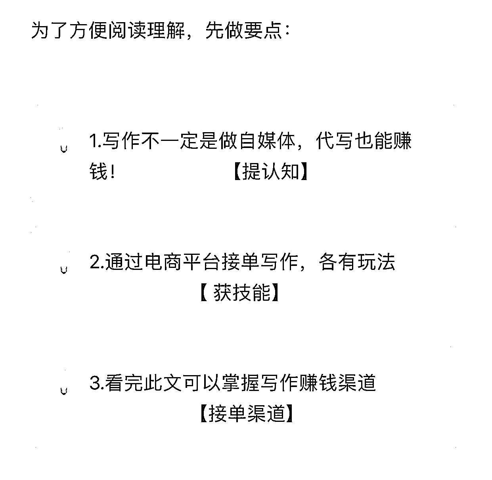
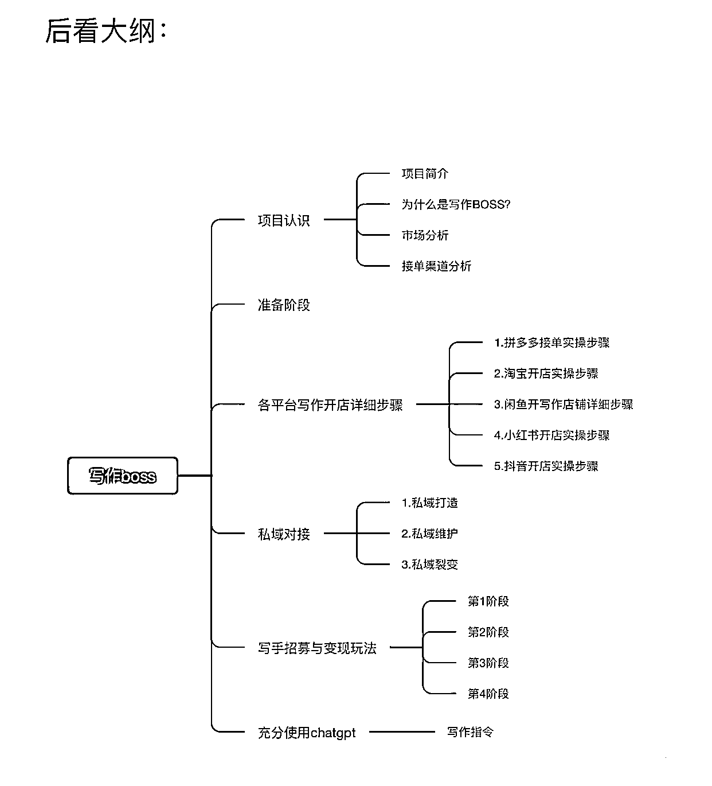

# 《通过开写作店铺年入 50w 的项目拆解》

> 原文：[`www.yuque.com/for_lazy/thfiu8/scbn5g4pba8meyvu`](https://www.yuque.com/for_lazy/thfiu8/scbn5g4pba8meyvu)

<ne-h2 id="6167b598" data-lake-id="6167b598"><ne-heading-ext><ne-heading-anchor></ne-heading-anchor><ne-heading-fold></ne-heading-fold></ne-heading-ext><ne-heading-content><ne-text id="ubbcc7957">(精华帖)(210 赞)《通过开写作店铺年入 50w 的项目拆解》</ne-text></ne-heading-content></ne-h2> <ne-p id="u2d281997" data-lake-id="u2d281997"><ne-text id="u7f19119d">作者： 饭饭</ne-text></ne-p> <ne-p id="u1257e58a" data-lake-id="u1257e58a"><ne-text id="ue17f21f3">日期：2023-05-12</ne-text></ne-p> <ne-p id="u3c2c01e7" data-lake-id="u3c2c01e7"><ne-text id="u6d989189">《通过开写作店铺年入 50w 的项目拆解》</ne-text></ne-p> <ne-p id="uf36999a0" data-lake-id="uf36999a0"><ne-text id="u03af72be">各位生财圈友大家好，我是饭饭，目前在电商赛道摸索，希望能在生财真诚分享写一些有价值的文章结识更多财友，实现破圈。</ne-text></ne-p> <ne-p id="uadefc7be" data-lake-id="uadefc7be"><ne-text id="uad64f491">我是一个非常普通的大学毕业生，做了多年实体店，然后实体店亏损扛不住了以后我就转行做电商了，转行以后我实现了自由职业，通过线上开写作店铺帮别人写文章，在这个赛道上赚到了人生第一个 50 万。目前看来这是一个普通人易复制，能够轻松操作的项目。</ne-text></ne-p> <ne-p id="u7dbe8cb0" data-lake-id="u7dbe8cb0"><ne-text id="u576a7bfa">这是一篇万字长文，非常感谢@靠谱大大的耐心指点，帮助我修改了让文章更加通俗易懂、干货满满。</ne-text></ne-p> <ne-p id="u69d7753e" data-lake-id="u69d7753e"><ne-text id="ub4445fbc">由于比较详细：全文包含了项目的介绍、多个平台开店教程、具体话术、变现渠道和如何避坑实现快速闭环等等</ne-text></ne-p> <ne-p id="u846501bc" data-lake-id="u846501bc"><ne-text id="u2544dea9">在我看来我目前完成了这个项目的 0-1，希望圈友能提出意见一起去助力我完成 1-10 或者更多，期待大家的阅读和点评，圈友移步飞书：</ne-text> <ne-text id="uf54758f9">（电脑版阅读体验更佳）</ne-text>[<ne-text id="ubcf61855">https://cxqeimz77vr.feishu.cn/docx/G2Zwdm2H7ol8FYxHEn7c0H2dn3c?from=from_copylink</ne-text>](https://cxqeimz77vr.feishu.cn/docx/G2Zwdm2H7ol8FYxHEn7c0H2dn3c?from=from_copylink)<ne-card data-card-name="image" data-card-type="inline" id="ZAhzB" data-event-boundary="card">  <ne-p id="u24057aac" data-lake-id="u24057aac"><ne-card data-card-name="image" data-card-type="inline" id="TFfRx" data-event-boundary="card"></ne-card></ne-p> <ne-hole id="ua6bce876" data-lake-id="ua6bce876"><ne-card data-card-name="hr" data-card-type="block" id="bQ2jR" data-event-boundary="card"><ne-p id="u23a38608" data-lake-id="u23a38608"><ne-text id="uf2ac00fa">评论区：</ne-text></ne-p> <ne-p id="ucb72f733" data-lake-id="ucb72f733"><ne-text id="ub6bbf4f2">dxy : 感谢分享！</ne-text> <ne-text id="u8ce6b282">饭饭 : 里面多个方法附件📎，很少用飞书不够熟悉，如果打不开的可以评论我后台设置一下</ne-text> <ne-text id="u5527f90c">凌心 : 感谢分享</ne-text> <ne-text id="u345f49ae">终身锻炼者—老杜 : 中国是个巨大的市场，网络把这一切需求连接起来。做好一个小的细分行业，都够一个小团队吃到饱。写回忆录算是很小的市场，奈何架不住人多，特别是老龄化加剧。</ne-text> <ne-text id="uf050d47c">饭饭 : 对对，对于小团队来说，红海打不过，蓝海才是最佳选项</ne-text> <ne-text id="uda681b1b">饭饭 : 有用就好，知道圈友凌心啦[爱心]</ne-text> <ne-text id="udf37df2d">饭饭 : 对圈友有用就好</ne-text> <ne-text id="u3f3e8e54">云端 : 受益匪浅，感谢分享</ne-text></ne-p></ne-card></ne-hole></ne-card></ne-p>