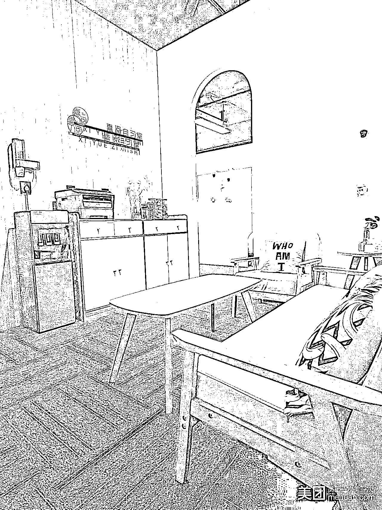

# 《平民开店手册「一」》

> 原文：[`www.yuque.com/for_lazy/thfiu8/fsx2g2ysvxudriuy`](https://www.yuque.com/for_lazy/thfiu8/fsx2g2ysvxudriuy)

<ne-h2 id="736d6eeb" data-lake-id="736d6eeb"><ne-heading-ext><ne-heading-anchor></ne-heading-anchor><ne-heading-fold></ne-heading-fold></ne-heading-ext><ne-heading-content><ne-text id="u33e7f971">(2277 赞)《平民开店手册「一」》</ne-text></ne-heading-content></ne-h2> <ne-p id="u4a338fd7" data-lake-id="u4a338fd7"><ne-text id="uab7ef8d0">作者： 杨涛</ne-text></ne-p> <ne-p id="u3a5d5644" data-lake-id="u3a5d5644"><ne-text id="u6a282acd">日期：2023-04-22</ne-text></ne-p> <ne-p id="u95d54836" data-lake-id="u95d54836"><ne-text id="u865219b0">涛说  ，平民开店手册「一」，</ne-text></ne-p> <ne-p id="u313670b6" data-lake-id="u313670b6"><ne-text id="u3494b2ab">经过这三年特殊时期，感觉互联网增速趋缓，很多朋友放了一些心力在实体经济上，俺也一样，</ne-text></ne-p> <ne-p id="ue2b554ac" data-lake-id="ue2b554ac"><ne-text id="u4635abde">这半年，陆续开了十几家实体店，凭借老练的社会学，敏锐的网感，基本上都实现了首月盈利，做起来的有麻辣烫，棋牌室，茶馆，除甲醛，家政， 自习室  ，包括即将做起来的云吞店，都会陆续都写给大家，</ne-text></ne-p> <ne-p id="u58acf7a6" data-lake-id="u58acf7a6"><ne-text id="u691ac845">我开店的逻辑有很多，最重要的一条，我装逼地把它叫做，「消费力套利」，起因是做社会实践的过程中发现一个很有意思的现象，就是三四线城市的休闲娱乐，生活消费往往不输一二线，但是人工和场地成本却远低于一二线城市，</ne-text></ne-p> <ne-p id="ud46c29f7" data-lake-id="ud46c29f7"><ne-text id="u59f7508f">且，伴随着传播媒介的兴盛，人们对所谓「品质生活」的判定有着相差无几的标准，三两好友去吃个宵夜大排档，在舟山和在宁波，都要两百多，一杯瑞幸在广州和在中山，打台球，上网一小时在厦门和在龙岩，人们的心理价位，并没有太大的差别，</ne-text></ne-p> <ne-p id="ud23eb171" data-lake-id="ud23eb171"><ne-text id="u8de07517">是的，于是我就开始找那些「确定性强，大概率赚钱的生意」，</ne-text></ne-p> <ne-p id="u4fc85f7e" data-lake-id="u4fc85f7e"><ne-text id="u945f81f6">今天想聊的是通过开「无人自习室」的过程中事无巨细的研究，得出的一套较为朴实的「思考方式」和「执行方案」，看完，哪怕从未接触过实体的你，应该也可以独立开启实体店赚钱的征程，</ne-text></ne-p> <ne-p id="u0ee14410" data-lake-id="u0ee14410"><ne-text id="ua2e93ed5">一，要投多少钱，操作复杂吗，收益怎么样？</ne-text></ne-p> <ne-p id="ub33de2fe" data-lake-id="ub33de2fe"><ne-text id="u9ae28dfa">投资小，回本快，收益高，</ne-text></ne-p> <ne-p id="u918707d7" data-lake-id="u918707d7"><ne-text id="u6b7733c5">基本上投资 3-6 万（房租可根据你想要的规模波动，但坚决不做大店，主题店，网红店，复合店等加戏的店），就可以开一家 1-2 年内平均回报率百分两百的自习室（我们要的是更高的确定性），</ne-text></ne-p> <ne-p id="ue297c30e" data-lake-id="ue297c30e"><ne-text id="u5bf006ff">核心逻辑是开在三线往下的城市，实现消费力套利，</ne-text></ne-p> <ne-p id="u59538b1f" data-lake-id="u59538b1f"><ne-text id="u28281ff1">二，无人值守自习室到底是什么模式？</ne-text></ne-p> <ne-p id="u51ab8078" data-lake-id="u51ab8078"><ne-text id="ufafc420b">自习室的前世今生（必须了解下，挺有趣），</ne-text></ne-p> <ne-p id="ue6b2b7a3" data-lake-id="ue6b2b7a3"><ne-text id="ueef01b44">1.0 时代，人工接待自习室，没有上程序，前台服务生接单，散客居多，人工安排座位，到点提醒续费，人工断电，有一定的轻服务，</ne-text></ne-p> <ne-p id="u6ee31490" data-lake-id="u6ee31490"><ne-text id="ue0dc1d7f">2.0 时代，半无人自习室，没有上程序，有私域意识，需要加微信，微信安排座位，到点全凭自觉或提醒续费，人工断电，有一定的轻服务，</ne-text></ne-p> <ne-p id="u3fafc6bf" data-lake-id="u3fafc6bf"><ne-text id="u338e61f0">3.0 时代，无人值守自习室，全程线上安排，小程序安排座位，领取开门二维码，到点自动断电，会员群，无人值守，客户中选出打扫志愿者，用人力换自习时长，私域稳固，</ne-text></ne-p> <ne-p id="ub5036feb" data-lake-id="ub5036feb"><ne-text id="uc321ff6a">无用的知识：目前成功的「自习室+」模式有：青旅+自习室，咖啡厅+自习室，便利店+自习室，书店/图书馆+自习室，</ne-text></ne-p> <ne-p id="ua62fb8dd" data-lake-id="ua62fb8dd"><ne-text id="u582cdbae">三，到底哪些人会去自习室？</ne-text></ne-p> <ne-p id="ua3871538" data-lake-id="ua3871538"><ne-text id="u9f720e72">全职自习：考研人群，</ne-text></ne-p> <ne-p id="ufb565ead" data-lake-id="ufb565ead"><ne-text id="u4e86563b">兼职自习：考公，考博，考证，考编，留学，移民，高考，交友，休闲，</ne-text></ne-p> <ne-p id="u1a6e100e" data-lake-id="u1a6e100e"><ne-text id="ufd9e23f2">这里提几个点，</ne-text></ne-p> <ne-p id="u6bb4112e" data-lake-id="u6bb4112e"><ne-text id="u7722ec4f">1，1000 万毕业生，475 万考研，</ne-text></ne-p> <ne-p id="u1af28300" data-lake-id="u1af28300"><ne-text id="u097ee0da">2，考研人群是自习室的吉祥物，因为太卷了，从 6 月开始进入紧张内卷状态，9 月开始进入疯狂学习状态，是自习室天然的气氛组，</ne-text></ne-p> <ne-p id="ubb7b26b7" data-lake-id="ubb7b26b7"><ne-text id="ue0a07b42">3，兼职自习人员，根据各种考试的时间，各有各的内卷周期，</ne-text></ne-p> <ne-p id="u6a56e2fb" data-lake-id="u6a56e2fb"><ne-text id="u074058ee">4，着重提一下，佛系自习人群，</ne-text></ne-p> <ne-p id="ucf5a2f7a" data-lake-id="ucf5a2f7a"><ne-text id="uedd8f98a">这部分人群，属于刚毕业逃避社会，不敢面对工作，逃避家庭，不想呆在家里，于是，早上早早拎着豆浆油条来自习室，蹉跎一天，然后夜里回家，对自己和家人都有个交代，</ne-text></ne-p> <ne-p id="u5d0ae99f" data-lake-id="u5d0ae99f"><ne-text id="uc1636722">5，休闲人群，</ne-text></ne-p> <ne-p id="u8ef88c77" data-lake-id="u8ef88c77"><ne-text id="u221dc321">这部分人群，来自习室打王者，刷剧，然后中午去吃完饭，下午来眯一会儿，继续刷剧打游戏，</ne-text></ne-p> <ne-p id="u94b77e51" data-lake-id="u94b77e51"><ne-text id="u3df9a4e9">6，高考人群，</ne-text></ne-p> <ne-p id="u2c80bc7f" data-lake-id="u2c80bc7f"><ne-text id="u479f7b03">这部分人很有意思，都是转介绍王者，觉得上自习很酷，爱凑热闹，一旦服务了一个高中生，过阵他半个班都来了，同样的，千万别给他们便宜，给一个人便宜，哦豁，全校都知道了，寒暑假达到高峰，</ne-text></ne-p> <ne-p id="u1848150e" data-lake-id="u1848150e"><ne-text id="uf6b61958">7，讲真，她们老有钱了，一天两杯奶茶，中途出去购物一下，回来刷剧，自习，打王者，</ne-text></ne-p> <ne-p id="uc7190eb8" data-lake-id="uc7190eb8"><ne-text id="u43bebace">四，开一个无人自习室，要多长时间？</ne-text></ne-p> <ne-p id="u176f0590" data-lake-id="u176f0590"><ne-text id="u710f703d">1，我们只开 100 平上下，30-50 个座位的小店，注意，除非你有特殊的拿店渠道，如补贴，免租，超级捡大漏等，千万别开大店，心力这东西，很微妙，平常心，咱要的是，确定性，</ne-text></ne-p> <ne-p id="u78dd8d57" data-lake-id="u78dd8d57"><ne-text id="ua11594f2">2，从选好位置开始算，平均 10-15 天，这段时间，下边四条线一起跑，</ne-text></ne-p> <ne-p id="ufd5324a5" data-lake-id="ufd5324a5"><ne-text id="uc0d6e384">a，执照与开业物料，</ne-text> <ne-text id="u6a090e29">b，采购桌椅，小配件，家电，</ne-text> <ne-text id="u0d7d8022">c，装修，</ne-text> <ne-text id="u5e2c16eb">d，注册各种互联网平台账号并上线，</ne-text></ne-p> <ne-p id="u30f03435" data-lake-id="u30f03435"><ne-text id="u4e896c6f">五，怎么知道自己的意向城市适不适合开？</ne-text></ne-p> <ne-p id="uf12142e5" data-lake-id="uf12142e5"><ne-text id="u44739f5f">满足下边第一条则基本不亏本，满足下边越多条，则越赚钱，</ne-text></ne-p> <ne-p id="u982aa18b" data-lake-id="u982aa18b"><ne-text id="uc5eb76d4">1，人口两百万以上 ，全城通过美团以及工商等任何途径查到的同行店数，满足下边的公式：人口数/5 万＞已有店数，即可，这是最保守的算法，很多城市可以更好，像东莞，太原，锦州这种要么地理奇葩，要么结构复杂，要么氛围浓厚的城市，还可以开更多，</ne-text></ne-p> <ne-p id="u5d101d7f" data-lake-id="u5d101d7f"><ne-text id="u0caea931">2，看周边城市，</ne-text></ne-p> <ne-p id="uebba67ad" data-lake-id="uebba67ad"><ne-text id="u8dc2c233">如果你要开的区域目前并没有自习室，你在做了各种市场调研之后依然不敢确定自己这个区域是否适合开店，去找自己临近和自己区域人口，经济，发展，目标客群情况相仿的城市，看对方区域目前是否有自习室这个业态，如果有，是什么发展情况，多找几个同省份城市进行对比，</ne-text></ne-p> <ne-p id="u430150b9" data-lake-id="u430150b9"><ne-text id="ua57dc699">不好懂么，只是举例哦，汕头 400 万人，佛山 400 万人，佛山 100 家自习室，汕头只有 2 家，两个城市经济差不多，高中数量差不多，电影院和星巴克的数量都差不多，那么，汕头，是不是机会？嗯嗯，下边的思考也是这样的指向，</ne-text></ne-p> <ne-p id="u5d8fdc01" data-lake-id="u5d8fdc01"><ne-text id="uf3fc829a">3，看人口结构，</ne-text></ne-p> <ne-p id="u927d53e0" data-lake-id="u927d53e0"><ne-text id="ua88c3638">4，考研人数，</ne-text></ne-p> <ne-p id="uc4dec8d9" data-lake-id="uc4dec8d9"><ne-text id="u39b60377">5，高中等院校数量，</ne-text></ne-p> <ne-p id="u075840b9" data-lake-id="u075840b9"><ne-text id="udfc9ca39">6，之前的闭店率，美团打开，输入自习室，下拉到底，可以看到多少倒闭的，</ne-text></ne-p> <ne-p id="u4868e5e8" data-lake-id="u4868e5e8"><ne-text id="uc10f343c">7，同行的优秀程度，是吧，都靠友军衬托，</ne-text></ne-p> <ne-p id="uc3dd8fbb" data-lake-id="uc3dd8fbb"><ne-text id="u7f7fbb04">六，我们怎么知道同行厉不厉害？</ne-text></ne-p> <ne-p id="ud82ba9e0" data-lake-id="ud82ba9e0"><ne-text id="u0344cb5b">1，看它有没有连锁意识，</ne-text></ne-p> <ne-p id="u01ef9f81" data-lake-id="u01ef9f81"><ne-text id="u99d45c1b">2，美团等平台的评论会不会维护（干预，回评，差评应对），</ne-text></ne-p> <ne-p id="uba3061e8" data-lake-id="uba3061e8"><ne-text id="ub4a4a752">3，有没有本地流量思维（小红书，抖音，达人探店等），</ne-text></ne-p> <ne-p id="u642f80a2" data-lake-id="u642f80a2"><ne-text id="u8972a514">4，加他微信，看操作（朋友圈，响应速度，话术，价格体系，产品结构），</ne-text></ne-p> <ne-p id="u1651c437" data-lake-id="u1651c437"><ne-text id="ue9340112">5，推广意识，有没有上推广通，</ne-text></ne-p> <ne-p id="u33758e87" data-lake-id="u33758e87"><ne-text id="u798c60ce">6，总之，同行的店，如果你感觉让你不舒服了，卫生，采光，通风，格局，服务，商业化，网感...等各种细节，让你觉得不过如此了，你就可以放心进来，干他，</ne-text></ne-p> <ne-p id="u1e049d0d" data-lake-id="u1e049d0d"><ne-text id="u4320c9b1">七，我能当甩手掌柜么，能用做副业的心态做么？</ne-text></ne-p> <ne-p id="udf278b6a" data-lake-id="udf278b6a"><ne-text id="u3cce9385">1，操作上来看，必须能，本身讲的就是无人值守自习室，全自动运营，只需当地有一个关系户，如亲戚朋友，应急，如果没有也没关系，有小志愿者，物业或者水电工熟悉就可以，处理一些停电，跳闸，门锁故障等微小概率事件，</ne-text></ne-p> <ne-p id="uaf4dd3c0" data-lake-id="uaf4dd3c0"><ne-text id="u16f5f49a">2，心态上来看，如果不想做大做强，只想赚钱，那就当副业呗，如果想开连锁，做大做强，占领某一个城市，那么它的收益也完全能支持你当主业做，</ne-text></ne-p> <ne-p id="u29640502" data-lake-id="u29640502"><ne-text id="u0bd5b418">3，题外话，</ne-text></ne-p> <ne-p id="ud8767f12" data-lake-id="ud8767f12"><ne-text id="u99f46412">一直认为，这是夹缝中的蓝海，理论上，除房租外，几乎没有循环成本，整体半年回本，首年回报率 30%以上，次年回报率 100%，且属于新兴项目，从业者很多是应届毕业生，在校大学生，稚嫩的互联网人，他们社会学缺失，不太会算账，爱跟风，不抗打，而抗打的老牌实体人，他们看不懂这个行业，这就是错位杀，开起来，就赚钱，</ne-text></ne-p> <ne-p id="uf1eefb36" data-lake-id="uf1eefb36"><ne-text id="uce8bbde6">且，三线以下的城市，普遍有个很好很淳朴的观念，叫做「回本思维」，半年回本的项目，极具诱惑，可以开展招商或者培训等，不用多宣传，我店没开多久就有好几个人来问怎么开了，</ne-text></ne-p> <ne-p id="u12b4f2b1" data-lake-id="u12b4f2b1"><ne-text id="u9704f403">八，确定了意向城市，怎么开始？怎么确定意向店址？</ne-text></ne-p> <ne-p id="ue39b5e3f" data-lake-id="ue39b5e3f"><ne-text id="u098c78ae">1，确定几大核心商圈（从网上到实地走走），</ne-text></ne-p> <ne-p id="u59cc0c0d" data-lake-id="u59cc0c0d"><ne-text id="u19f08285">2，唯一法则，有电影院，只开在电影院周边一公里内，无电影院则 pass，</ne-text></ne-p> <ne-p id="uc4256344" data-lake-id="uc4256344"><ne-text id="u433b8c2c">3，看商圈入驻率，有麦当劳/肯德基（选址王者），请相信百年老店的选址能力，时尚茶饮，剧本杀/桌游馆等时尚休闲空间，不是说人数能给我带来什么，是约定俗成的消费观念，为空间买单的观念，</ne-text></ne-p> <ne-p id="ue847f459" data-lake-id="ue847f459"><ne-text id="u4a5ce05a">4，看人流，</ne-text></ne-p> <ne-p id="u93fc93e2" data-lake-id="u93fc93e2"><ne-text id="uecbe463e">5，商家逼格，</ne-text></ne-p> <ne-p id="u3a623c1d" data-lake-id="u3a623c1d"><ne-text id="ueb84f7fa">6，看交通，</ne-text></ne-p> <ne-p id="u54c5f709" data-lake-id="u54c5f709"><ne-text id="u66f975f7">a，方便停车，停车费贵不贵，</ne-text></ne-p> <ne-p id="u32da47ab" data-lake-id="u32da47ab"><ne-text id="ue6ba7607">b，地铁/公交站方便，</ne-text> <ne-text id="uba30f172">c，电动车/自行车好不好停，</ne-text> <ne-text id="ucaf33341">d，共享单车方便与否，停车区离得近不近，</ne-text> <ne-text id="ue429baac">e，步行方便与否，有些地方要绕，有些地方车流多，</ne-text></ne-p> <ne-p id="u1257991f" data-lake-id="u1257991f"><ne-text id="u768400aa">7，是不是休闲商圈，</ne-text></ne-p> <ne-p id="u46707d1a" data-lake-id="u46707d1a"><ne-text id="u01f6e4f8">8，周边小餐饮好不好吃，多不多，这也很重要，</ne-text></ne-p> <ne-p id="u343c38aa" data-lake-id="u343c38aa"><ne-text id="u455d67da">9，人口分布情况，是不是黄金三巨头（商场/商业街，写字楼，住宅），</ne-text></ne-p> <ne-p id="ud4480672" data-lake-id="ud4480672"><ne-text id="uc9954cbd">10，用双脚丈量你的江山，步行绕圈，用体感去品这个商圈的氛围，</ne-text></ne-p> <ne-p id="u488956b5" data-lake-id="u488956b5"><ne-text id="ubcecb88f">九，门店选择，</ne-text></ne-p> <ne-p id="ue7af0de1" data-lake-id="ue7af0de1"><ne-text id="ub0a16634">1，去之前，中介先加 3-50 个，这 3-50 个中一定有 3-5 个非常靠谱热情的，联系，让人发房源，</ne-text></ne-p> <ne-p id="udc979c61" data-lake-id="udc979c61"><ne-text id="u66276d50">2，到实地后，根据专业程度，让他们带看，本质上，用数量对抗概率，</ne-text></ne-p> <ne-p id="ue6ba2fa9" data-lake-id="ue6ba2fa9"><ne-text id="uca0fe72d">3，细节是，海量看，记得千万要通过中介，最高效，直接和中介说需求，</ne-text></ne-p> <ne-p id="u65f68d6a" data-lake-id="u65f68d6a"><ne-text id="u17dbd843">a，太新的不要，要装修，而且意味着你要面对左邻右舍，楼上楼下长时间断续的装修，</ne-text> <ne-text id="udbd0a68f">b，不要太老的楼，物业不好，基建老旧，年龄结构老龄化，</ne-text></ne-p> <ne-p id="u2432ac61" data-lake-id="u2432ac61"><ne-text id="u1b21cdb4">4，物业，</ne-text></ne-p> <ne-p id="u6f2e24e7" data-lake-id="u6f2e24e7"><ne-text id="ua38c2d3e">a，这块大学问，先和大家说个冷知识，你们会不会发现，新楼盘的物业都是帅哥，过一阵，就换成大哥了，再过一阵，就变成大叔了，是的，越来越不好说话了，</ne-text> <ne-text id="u463e75bf">b，物业好不好说话，比如门禁好不好解决，放不放人，不放人能用 nfc 实现么，二维码实现么，梯控呢，</ne-text> <ne-text id="uf47c1427">c，这块社会学需要很到位，聊吧，尽量和物业有利益绑定，这里我稍微展开下，</ne-text></ne-p> <ne-p id="uc00cdbfd" data-lake-id="uc00cdbfd"><ne-text id="u916069f2">要和物业一条心，物业这块啊，是位卑权重，人要的甚至不是钱，是尊重，需要认可，是平等心，嘴甜一些好么，</ne-text></ne-p> <ne-p id="ufc969c7b" data-lake-id="ufc969c7b"><ne-text id="ua3f45f9f">想当初，我二店装修，敲墙了啊，海量的装修垃圾，那个叫王燕楠的胖经理，颤巍巍的喊来了 4 个保安，一百块啊，就一百块，给我搞定了，</ne-text></ne-p> <ne-p id="uce0d27b7" data-lake-id="uce0d27b7"><ne-text id="uf98bfea2">搞定了物业，就是搞定了一整个利益群体，包括保洁，水电工，保安，物业经理，相关人员在内的利益集团啊，</ne-text></ne-p> <ne-p id="uab595088" data-lake-id="uab595088"><ne-text id="ue105a9e8">嗯啊，可以的话，尽量找物业经理有佣金的物业租，</ne-text></ne-p> <ne-p id="u925b9716" data-lake-id="u925b9716"><ne-text id="ue4f38de0">无用的知识：现在房子很难租，很多房东物业费欠了几年了，物业巴不得你赶紧租下来开始营业，房租转物业，物业扣掉物业费，再转给房东，</ne-text></ne-p> <ne-p id="u15d280c2" data-lake-id="u15d280c2"><ne-text id="ue06cf3d3">5，电梯多的楼，10 户/梯是最优解，也就是如果一层楼有 30 户，那么最好有 3 个电梯，这样的话是很宽松的，</ne-text></ne-p> <ne-p id="u50f15ea7" data-lake-id="u50f15ea7"><ne-text id="ue9dd8ff8">6，商圈物业往往和写字楼物业，商住楼物业，是两个不同的物业，这点要很注意，找对人，很重要，</ne-text></ne-p> <ne-p id="ud535a053" data-lake-id="ud535a053"><ne-text id="u52344f9f">7，必须模拟自己是个来自习的选手，从附近小区不行来自习，电动车来自习，自行车/共享单车来自习，坐地铁/公交来自习，开车来自习，将心比心，模拟全过程，借消费者的眼，看这个过程，这一路衣食住行玩，餐饮多不多之类的，奶茶好不好喝，</ne-text></ne-p> <ne-p id="u164f0c89" data-lake-id="u164f0c89"><ne-text id="u508688ae">8，采光，采光，通风，通风，重要的事情说三遍，</ne-text></ne-p> <ne-p id="ud8c3cbcc" data-lake-id="ud8c3cbcc"><ne-text id="ubca67f01">9，白嫖中介的二三事，</ne-text></ne-p> <ne-p id="u08202572" data-lake-id="u08202572"><ne-text id="u3abbbd23">a，千万别中介带看房，然后你绕过中介租这套他带看的房，难讲以后你就天天被投诉，</ne-text> <ne-text id="u43993dc0">b，每个楼，户型就那么两三种，你看中了哪个户型，记得可以去不同楼层找一样的门牌，</ne-text> <ne-text id="u098dc375">c，看中了之后，可以找物业，最好和物业发生利益关系，对你未来的装修，营商，处理问题，都很有帮助，省事省时省心省钱，</ne-text> <ne-text id="u97f2e5f8">d，加物业群，能加进去，直接报户型，分分钟和房东确定了，而且这样房东配合度高，因为你给他省了中介费，</ne-text> <ne-text id="u0c82dda2">e，贴小广告在电梯里，标明，截止 3 天，那时我一定租到了，别 call，营造诚意和紧张感，更真实，</ne-text> <ne-text id="ud8009821">f，我试过手机屏幕高亮微信号放在手后边，试过间谍一样和房东交谈，试过纸条，试过...以上是体验生活，</ne-text></ne-p> <ne-p id="ue2c0a748" data-lake-id="ue2c0a748"><ne-text id="u5113086b">10，红包大法，</ne-text></ne-p> <ne-p id="ub2065811" data-lake-id="ub2065811"><ne-text id="u9e1c2cf1">11，闲鱼大法，闲鱼租房往往能捡到漏，</ne-text></ne-p> <ne-p id="u67e04d3c" data-lake-id="u67e04d3c"><ne-text id="u44e51bc9">12，以上，都是建立在一定要中介带看房的基础上，</ne-text></ne-p> <ne-p id="uff9ee174" data-lake-id="uff9ee174"><ne-text id="u8cc96462">十，门店选择，</ne-text></ne-p> <ne-p id="u64b0a1b5" data-lake-id="u64b0a1b5"><ne-text id="u8d6a7199">1，首选大平层，户型简单，空旷，四白落地，门窗齐全，不改阳台，不改灯，不装空调，不改消防，不改卫生间，不改墙，不装修，不改水电，</ne-text></ne-p> <ne-p id="ueac0acd1" data-lake-id="ueac0acd1"><ne-text id="u65d54509">2，住宅有什么好处，便宜，但是一举报就死，邻居破事多，消防不容易过，</ne-text></ne-p> <ne-p id="u8a1b335b" data-lake-id="u8a1b335b"><ne-text id="u5e944b28">3，硬要住宅的话，胆大心细，比如，从公路或者小区往上看，窗户上都是打广告的，然后进入小区以后挨个楼层走走，发现很多理发工作室，健身瑜伽之类的，商业氛围浓厚的住宅楼也是可以的，</ne-text></ne-p> <ne-p id="u139eb2b5" data-lake-id="u139eb2b5"><ne-text id="uc92c29e3">4，切记，不看真实面积，看使用面积，空旷，别有柱子，拐角多，找死，</ne-text></ne-p> <ne-p id="u9102987e" data-lake-id="u9102987e"><ne-text id="uc0dd0ad1">十一，楼层选择，</ne-text></ne-p> <ne-p id="u675c5d83" data-lake-id="u675c5d83"><ne-text id="u8e37257a">1，越高越好，除非遇到能嫖大露台，大阳台，小花园等，可以背书啊，</ne-text></ne-p> <ne-p id="ub81bde02" data-lake-id="ub81bde02"><ne-text id="u2f94289e">2，同楼层营商环境，台球室，棋牌室等各种吵闹嬉笑的不行，</ne-text></ne-p> <ne-p id="u3b75e2a1" data-lake-id="u3b75e2a1"><ne-text id="u1becdd27">3，低楼层千万注意避开餐饮店（餐饮一定有风机，嗡嗡的），大噪音如 KTV 等娱乐场所，</ne-text></ne-p> <ne-p id="u4ffeee86" data-lake-id="u4ffeee86"><ne-text id="u25e6663a">4，避开一些特殊从业女士人群的楼，</ne-text></ne-p> <ne-p id="ue18a8adc" data-lake-id="ue18a8adc"><ne-text id="u627548c0">5，多看是必须的，必须的，必须的，都是心态问题，</ne-text></ne-p> <ne-p id="u15d35c81" data-lake-id="u15d35c81"><ne-text id="u2c88efc4">和谈恋爱一样，谈了很多个，最后发现还是初恋好，</ne-text></ne-p> <ne-p id="u4b9e3fe4" data-lake-id="u4b9e3fe4"><ne-text id="u02e943ab">和谈恋爱一样，谈了很多个，最后才发现自己真正想要的是什么，</ne-text></ne-p> <ne-p id="ucd8b3d91" data-lake-id="ucd8b3d91"><ne-text id="u1e22723d">看多几次，你就能一眼看出那栋楼那层那间可以赚多少钱了，</ne-text></ne-p> <ne-p id="u1112f98c" data-lake-id="u1112f98c"><ne-text id="u2a464a42">6，违建不要，多便宜都不要，违建的材料巨差，隔热，隔音巨差，</ne-text></ne-p> <ne-p id="u2456daec" data-lake-id="u2456daec"><ne-text id="uf4288606">7，有些楼，10 点后才能装修，一刀切，这样的话，别人也是 10 点后才能装修，我们付出的是多几天装修期，避开的是未来别人也只能 10 点后装修，影响不到我们营业，</ne-text></ne-p> <ne-p id="u5ad2f91d" data-lake-id="u5ad2f91d"><ne-text id="ue0db3d75">8，5.5-6m 这种纵深最好了，利用率极高，</ne-text></ne-p> <ne-p id="ua48d29f3" data-lake-id="ua48d29f3"><ne-text id="ube836c3e">十二，选好了房子，合同怎么签，</ne-text></ne-p> <ne-p id="uf3386b55" data-lake-id="uf3386b55"><ne-text id="u02451fa3">1，免租期，装修期，越长越好，</ne-text></ne-p> <ne-p id="u95afbd8a" data-lake-id="u95afbd8a"><ne-text id="u08fd9546">2，看房时候要波澜不惊，装老手，只谈缺点，哪怕很满意，也要挑缺点，朝向，采光，干湿都可以挑，</ne-text></ne-p> <ne-p id="u74fa4b5d" data-lake-id="u74fa4b5d"><ne-text id="u75f90813">3，砍价，尽情砍，技巧，砍死后，来一句，大哥我半年付，能不能再少两百，理论上是你的资金使用率如果大于利息的行情，砍就好，</ne-text></ne-p> <ne-p id="u0c5c50ce" data-lake-id="u0c5c50ce"><ne-text id="u227a13d1">4，多喊房东装电器，</ne-text></ne-p> <ne-p id="u2c68e239" data-lake-id="u2c68e239"><ne-text id="u5b550fc9">5，原本行规是半年付的，争取月付，押二的，争取押一，直说，您放空半个月，就能给我少两百每月了，空置一个月，您就亏大发了，我是个好房客，巴拉巴拉，</ne-text></ne-p> <ne-p id="uc892fcf8" data-lake-id="uc892fcf8"><ne-text id="u6112cd2d">6，签标准合同，</ne-text></ne-p> <ne-p id="uedf8b558" data-lake-id="uedf8b558"><ne-text id="u18b6d0ec">7，谁解决问题，小问题我们肯定不麻烦，水电小毛病我们自己掏钱就修了，表态，但是有些时候需要房东身份证，注册公司，等需要房东配合出示各种证件，证明的，时候，需要一个配合的，能解决问题的房东，</ne-text></ne-p> <ne-p id="uc4390649" data-lake-id="uc4390649"><ne-text id="u53c63e80">8，强硬的，有钱的，最好能有好多套物业在这个楼的房东最优，因为他能和物业硬刚，</ne-text></ne-p> <ne-p id="u6905b98d" data-lake-id="u6905b98d"><ne-text id="u1c03b70d">9，提一下开票，但是我们不开，这是留一手，是的，你个老银币，未来万一有矛盾，开票这事儿能喝一壶，</ne-text></ne-p> <ne-p id="u476fc5a8" data-lake-id="u476fc5a8"><ne-text id="u4df84307">10，约定租期内别卖房，不涨租，我们经营不善，会帮您找好接盘的，您放心，</ne-text></ne-p> <ne-p id="u4b0151ad" data-lake-id="u4b0151ad"><ne-text id="u0ce259a9">11，房东人好，人有钱，好处很多，动不动给我免租，能抗事，帮忙和物业争取利益，</ne-text></ne-p> <ne-p id="u71413c2d" data-lake-id="u71413c2d"><ne-text id="u65b6d356">12，整体框架是，「得寸进尺」，</ne-text></ne-p> <ne-p id="uc9b7bb2d" data-lake-id="uc9b7bb2d"><ne-text id="ue1112130">十四，装修设计问题怎么解决，</ne-text></ne-p> <ne-p id="ua1d5931a" data-lake-id="ua1d5931a"><ne-text id="u4a099a88">1，我司有专业的设计师，其实就是我本人，用手绘，</ne-text></ne-p> <ne-p id="u538970fd" data-lake-id="u538970fd"><ne-text id="u8ad9ed01">2，看房必量尺，有尺寸就可以生成布局图，淘宝啦，</ne-text></ne-p> <ne-p id="ude7b5d43" data-lake-id="ude7b5d43"><ne-text id="u01c6de4f">3，有小程序可以输入尺寸自动出装修图纸，酷家乐，</ne-text></ne-p> <ne-p id="uc606e0f8" data-lake-id="uc606e0f8"><ne-text id="u586d9e67">4，装修图纸必须在租房前，和物业确定好，确认一切，</ne-text></ne-p> <ne-p id="uad085baf" data-lake-id="uad085baf"><ne-text id="u7bfd337e">十五，看房到租房签合同前最重要的事，</ne-text></ne-p> <ne-p id="uaedf1585" data-lake-id="uaedf1585"><ne-text id="u9a2d493c">算好账（算好账，是创业的第一序列）：</ne-text></ne-p> <ne-p id="u5473ab3c" data-lake-id="u5473ab3c"><ne-text id="u52f8a950">首年利润率=（月卡价格 x 座位数 x85%x12）/（全年房租+软硬件总成本），</ne-text></ne-p> <ne-p id="u0072cec9" data-lake-id="u0072cec9"><ne-text id="ub4e46364">这个公式牢牢记在心里，基本上还没租房，你就能知道今年要赚多少钱咯，</ne-text></ne-p> <ne-p id="ud5f5d4a1" data-lake-id="ud5f5d4a1"><ne-text id="ua9b22f11">举个例子，龙岩，低估单价，多算了成本，超卖的和空置抵消，按运营水平中等，再打个八五折，</ne-text> <ne-text id="u4c5f8048">首年，50 个座位的店，按月卡 500 来算，500</ne-text><ne-text id="uad544fd9" ne-italic="true">50</ne-text><ne-text id="u70e66167">12*85%=255000/100000=255%，</ne-text> <ne-text id="uacd2dd65">首年之后，就是 500</ne-text><ne-text id="ua08395aa" ne-italic="true">50</ne-text><ne-text id="u8a2f173b">12*85%=255000/40000=638%，</ne-text> <ne-text id="ub58bc200">（仅供参考），</ne-text></ne-p> <ne-p id="u3206ff2d" data-lake-id="u3206ff2d"><ne-text id="u24a72f0a">以下是一些无 zhuan 用 ye 的 shu 知 yu 识：可看可不看，</ne-text></ne-p> <ne-p id="uf04d50ef" data-lake-id="uf04d50ef"><ne-text id="u4e0fe388">「「毛利润=毛利/营业额</ne-text><ne-text id="uf3d60f83" ne-italic="true">100%=(营业额-成本)/营业额</ne-text><ne-text id="u350f329b">100%，</ne-text> <ne-text id="u60223209">毛利率=纯利/营业额</ne-text><ne-text id="uf621a22a" ne-italic="true">100%</ne-text><ne-text id="u61c6e84e">，</ne-text> <ne-text id="u5e7a7d5f">预估毛利=营业额</ne-text><ne-text id="ue7c3548b" ne-italic="true">毛利率=平均客单价</ne-text><ne-text id="u94421c8e">成交量</ne-text><ne-text id="u59830a44" ne-italic="true">进店量</ne-text><ne-text id="uc60a5e8c">成交率，</ne-text> <ne-text id="u410fceac">固定资产净残值=固定资产报废时预计可以收回的残余价值－预计清理费用后的余额，</ne-text> <ne-text id="ub3a5bebe">预计净残值率=固定资产净残值/固定资产原值</ne-text><ne-text id="ua0a1be07" ne-italic="true">100%</ne-text><ne-text id="u017b790e">，</ne-text> <ne-text id="ud0ae2dfc">平均年限法又称为直线法，是将固定资产的折旧均衡地分摊到各期的一种方法，</ne-text> <ne-text id="u49244d68">3 年平均毛利率(一般家具使用率是 5 年，但是自习室行业损耗率比较大，按照 3 年计算) ，</ne-text> <ne-text id="uf6435329">平均投资回报率/年(roi) roi=3 年平均年净利润/投资成本，</ne-text> <ne-text id="u8d27e905">固定资产折旧按个别固定资产单独计算时（个别折旧率），</ne-text> <ne-text id="uaf4343e7">计算公式如下：年折旧率=（1-预计净利残值率）/预计使用年限×100%，</ne-text> <ne-text id="u531d8e09">月折旧率=年折旧率÷12，</ne-text> <ne-text id="u72777dda">月折旧额=固定资产原价×月折旧率」」，</ne-text></ne-p> <ne-p id="u30c63a7a" data-lake-id="u30c63a7a"><ne-text id="ud577894b">是的，「算好账」，是创业的第一序列，</ne-text></ne-p> <ne-p id="uf8f72355" data-lake-id="uf8f72355"><ne-text id="u9a539e48">十六，开始装修，</ne-text></ne-p> <ne-p id="u7d92341d" data-lake-id="u7d92341d"><ne-text id="u36675faf">1，物业推荐，取舍之间，大开方便之门，有利益关系就是好，</ne-text></ne-p> <ne-p id="u7a00f71d" data-lake-id="u7a00f71d"><ne-text id="u77f708b0">2，加 10 个施工队，取舍，得失，付出时间，也许便宜，</ne-text></ne-p> <ne-p id="u84704359" data-lake-id="u84704359"><ne-text id="u087dc447">3，加装修公司，原地等，一直见人，嫖装修方案，然后找施工队，</ne-text></ne-p> <ne-p id="u3f983b0c" data-lake-id="u3f983b0c"><ne-text id="uba66ba61">4，装修工人，散户，同城准备开多家的，熟悉后，靠谱的可用，</ne-text></ne-p> <ne-p id="u4821655b" data-lake-id="u4821655b"><ne-text id="ue98d3a54">5，了解一切流程后决定，工期，材质，价格，工序，性价比，</ne-text></ne-p> <ne-p id="u93b7a36c" data-lake-id="u93b7a36c"><ne-text id="uf85fdc1f">（其实一切很快就很透明，但是高手还是可以通过工序来赚你的钱，比如上次，一个坐便改蹲便，师傅就说要多几道工序，敲掉重新来，还好我多问了几家），</ne-text></ne-p> <ne-p id="u4d5b9bb8" data-lake-id="u4d5b9bb8"><ne-text id="ucaa80cff">6， 固定的装修标准，工艺，工期，材料，品牌，材质，装修垃圾都包处理，包工包料，包干（无任何其他费用），</ne-text></ne-p> <ne-p id="ubd00f429" data-lake-id="ubd00f429"><ne-text id="u72843928">7， 油漆会干，五天装修完，但是遇到阴雨天气，就要做好白费几天房租的心理准备，装修前请看天气预报，</ne-text></ne-p> <ne-p id="u4c5a7d3f" data-lake-id="u4c5a7d3f"><ne-text id="u814ae0b4">8，结账方面的小知识，现在的大环境，一个施工下来，能拿到钱，就很舒服了，所以放心谈，装完付费，实在不行，给点定金，10%左右，然后超正规的装修公式，是 235 这样付费，</ne-text></ne-p> <ne-p id="u0ddf10df" data-lake-id="u0ddf10df"><ne-text id="u41b2a44d">9，熟练后我们 5-7 天可以装修完成一家店并投入运营，</ne-text></ne-p> <ne-p id="u4d9cdde0" data-lake-id="u4d9cdde0"><ne-text id="u823364e3">10，家电家具，</ne-text></ne-p> <ne-p id="u4979c952" data-lake-id="u4979c952"><ne-text id="uf5b6faa8">推荐清单，空调，学习桌子(含插座及开关灯管) ，冰箱，学习椅子，净水器，休息区桌子，微波炉，休息区椅子，空气净化器，书架，储物柜，路由器，打印机，客服手机，密码锁，前台电脑(看情况)， 吸尘器...等，</ne-text></ne-p> <ne-p id="u9e6b4201" data-lake-id="u9e6b4201"><ne-text id="u992854b2">11，小物件，</ne-text></ne-p> <ne-p id="ucc182704" data-lake-id="ucc182704"><ne-text id="udf35caac">推荐清单，文具架子，毛毯，垃圾桶，零食，静音鼠标，午休枕，垃圾袋，咖啡，静音膜，铝制拖把，袋装茶叶，鼠标垫，医用救生包，抹布，散装花茶，数据线，小剪刀，备用水桶，零食框子，橡皮，耳塞，洗手液，糖果，备用笔，曲别针，卫生间喷枪，卫生用品，便利贴，订书机，消防设备，消毒液，坐垫，抱枕，灭火器，洁厕灵，灭火指示牌，空气清香剂，喷洒，消毒凝胶...等，</ne-text></ne-p> <ne-p id="u9065fdf4" data-lake-id="u9065fdf4"><ne-text id="ua5d026a2">12，开业物料清单，</ne-text></ne-p> <ne-p id="u8bfd56d5" data-lake-id="u8bfd56d5"><ne-text id="uc5496902">推荐清单，号码贴，休息区标识，WIFE 标识，学霸公约，明亮区标识，卫生间随手冲马桶标识，钥匙密码盒，暗黑区标识，开关随手关灯标识招牌，随手关门标识，随手关空调标识，卫生间标识，静止喧哗标识，空调遥控器盒子，预约小程序图解，监控区域标识，励志墙贴...等，</ne-text></ne-p> <ne-p id="ub70561ff" data-lake-id="ub70561ff"><ne-text id="u57a5775b">13，监控，网线，密码门，密码锁，走电七七八八，</ne-text></ne-p> <ne-p id="u0757a634" data-lake-id="u0757a634"><ne-text id="u59a59e9e">14，多条线一起跑，</ne-text></ne-p> <ne-p id="ua5a187aa" data-lake-id="ua5a187aa"><ne-text id="u2f839c51">a，小程序，系统，公众号，5-10 天，看审核运气，</ne-text> <ne-text id="u87193d27">b，注册公司，开美团，5-10 天，看代办会计公司的实力，</ne-text> <ne-text id="ueaa0ba05">c，家具家电小物件，3-7 天，含着安装，安装要 2 天这样，</ne-text> <ne-text id="u5a9635b7">d，装修，搬运，清洁，</ne-text></ne-p> <ne-p id="ue06cea78" data-lake-id="ue06cea78"><ne-text id="u647ca4cf">15，装地毯，地毯是要的，逻辑是，椅子和地板摩擦会有声音，有人会问，地毯粘到饮料会发臭，记得用那种拼装的，哪边不太行了，换掉一块就可以，</ne-text></ne-p> <ne-p id="u9a15ab0d" data-lake-id="u9a15ab0d"><ne-text id="uc7d0b293">16，小技巧，无敌黏毛滚轴，pdd，26 块，可以用一年，</ne-text></ne-p> <ne-p id="u0fc5435e" data-lake-id="u0fc5435e"><ne-text id="uc5c03983">17，路由器，小米 ax6000 穿墙王，1000 块以下的极品，</ne-text></ne-p> <ne-p id="u863f42c5" data-lake-id="u863f42c5"><ne-text id="ue21f62cf">18，小技巧，椅子用那种匚字型的，静音小能手，</ne-text></ne-p> <ne-p id="u307d762c" data-lake-id="u307d762c"><ne-text id="u9988fc77">十七，开业准备有什么注意事项么，</ne-text></ne-p> <ne-p id="u3028d86c" data-lake-id="u3028d86c"><ne-text id="ufc64f64d">1，广告牌，这是文印店的事儿，各种标语，标语能立大功，甚至不夸张的说能构成一个店的风格，</ne-text></ne-p> <ne-p id="u28d068e1" data-lake-id="u28d068e1"><ne-text id="uabd31f9e">2，打扫要花一天，同步布置休息区，饮水区，水吧要不要看你自己，</ne-text></ne-p> <ne-p id="u4d334290" data-lake-id="u4d334290"><ne-text id="ub5f74a5b">3，桌椅，家电，小物件全部到位，走电（给桌子通电）完成，</ne-text></ne-p> <ne-p id="uba006048" data-lake-id="uba006048"><ne-text id="ubaa0e508">4，每个座位的充电口，要很亲民，灯光，座椅高度，这些都是标准化的，最丝滑的，</ne-text></ne-p> <ne-p id="uaeb46c21" data-lake-id="uaeb46c21"><ne-text id="u949a3712">5，卫生间是重中之重，</ne-text></ne-p> <ne-p id="uafd2c3df" data-lake-id="uafd2c3df"><ne-text id="ua238a190">a，必须保持清洁，大号是无法杜绝的，必须备着强力喷头，卷曲绕圈好放置的那种，</ne-text> <ne-text id="uc95907c0">b，卫生间里头必须贴满温馨提示，提醒到位，绝对绝对禁止吸烟，</ne-text> <ne-text id="u049b72a8">c，必须保持纸篓别满，大一些的纸篓，大一些的袋子，</ne-text> <ne-text id="u597d248c">d，必须反复体验冲水声，和其他声音，会不会太大，干扰到学习区，当然了，租房时候就要注意尽量远离学习区，</ne-text> <ne-text id="u777dc9a9">e，隔音棉是可以用的，上两层，</ne-text> <ne-text id="ub936c616">f，必须贴上有备用卫生间的标语，同楼层，或者上下楼层，怎么走，以防三急，</ne-text></ne-p> <ne-p id="u399b1518" data-lake-id="u399b1518"><ne-text id="ubc1d483e">（mark 下，每个人加微信我们也要准备一套微信上的注意事项，并提醒对方别删掉，随时可以翻阅，可以解决大多数问题），</ne-text></ne-p> <ne-p id="ud35d2895" data-lake-id="ud35d2895"><ne-text id="u7d65260f">7，所有人都加到微信，是我们的目的，所以，美团的流程是，通过美团或者电话，引导加微信，然后发小程序给他操作选位置，并建立联系，当然了，也可以不打电话直接他就可以去学习了，我们尽量安排，也可以设计活动，</ne-text></ne-p> <ne-p id="u6b7cb99b" data-lake-id="u6b7cb99b"><ne-text id="u5989563c">8，加到微信，好评不愁，</ne-text></ne-p> <ne-p id="ue3ddf02f" data-lake-id="ue3ddf02f"><ne-text id="u124536fb">9，给人以羊毛可以薅，必须知道，我们就算桌位断电了，对方还是可以不走的，我们巴不得这种人多点，营造气氛，人家还会觉得买 3 个小时可以学 8 个小时，我们无所谓的，等到真的满座的时候，嘿嘿，我们的监控是有语音播报功能的，A5 桌的王燕楠，你怎么那么不要脸，超时了 8 小时了，还不走，快走，（放心啦，会来自习的，素质普遍高，没问题的），</ne-text></ne-p> <ne-p id="ud489b9df" data-lake-id="ud489b9df"><ne-text id="u159e2605">10，当然了，就算有意外，我们也有学员群，也有小志愿者，可以帮忙喊一声的，</ne-text></ne-p> <ne-p id="u9e497692" data-lake-id="u9e497692"><ne-text id="ub7df0bf6">十八，开业前运营，</ne-text></ne-p> <ne-p id="u4cc2dd65" data-lake-id="u4cc2dd65"><ne-text id="u53444232">1，美团和大众和小红书，提前就要开始准备了，有图就可以开干，图我们这里很多，哪怕你还没装修好，评论区就要开始干预了，如果有成功获客成功，要来自习，喊她加微信，恭喜她成为我们第一个用户，送 2 小时，和她说，后天就正式营业了，</ne-text></ne-p> <ne-p id="uc7135fec" data-lake-id="uc7135fec"><ne-text id="u88b7a369">2，小管家的招募, 多问一嘴, 在会员办理会员卡之后, 多问一嘴, 说少年你骨骼惊奇, 我看是一定是一个认真负责积极的好少年, 来做我们的小管家吧，给你送课时，还有就是可以在美团团单上单独开一个小管家专用团单, 长期招募的信息，</ne-text></ne-p> <ne-p id="u81288acc" data-lake-id="u81288acc"><ne-text id="ub73dcd44">3，保洁阿姨基本能在同楼的酒店找到，便宜得很，10 元/天算高了，因为就是日常看一遍，带走垃圾袋，</ne-text></ne-p> <ne-p id="u2c35c5db" data-lake-id="u2c35c5db"><ne-text id="u56d1afa4">十九，产品设计，</ne-text></ne-p> <ne-p id="uc0703ae9" data-lake-id="uc0703ae9"><ne-text id="uac5ab681">1，终究，我们还是卖卡为主，和健身房一个逻辑，非固定座位，你可以两倍超卖，线上预约，无惧上座率，</ne-text></ne-p> <ne-p id="uc221f794" data-lake-id="uc221f794"><ne-text id="ub9cafd60">2，产品多样性覆盖整个价格带，次卡，十次卡，三十次卡，小时卡，十小时卡，固定卡，储值卡，天卡，周卡，月卡，季度卡，半年卡，一年卡，当然了，可以润色，比如月卡，可以命名术一下，变为，「必过冲刺卡」，如果你这家店座位数比较少 , 那你就减少短期卡的设置 , 尽量多设置长期卡 , 筛选客户, 定价要在你希望客户购买的产品上多倾斜 , 规则是有我们制定的 , 不是客户想怎样就怎样 , 众口难调 , 不要妄想满足所有的顾客 , 什么都想要结果就是什么都没有，</ne-text></ne-p> <ne-p id="u596d02d8" data-lake-id="u596d02d8"><ne-text id="u6241c3cf">3，有个赚钱的点，提一下，自动贩卖机，其实利润挺高的，合作还是自己来都可以，</ne-text></ne-p> <ne-p id="uc533d93b" data-lake-id="uc533d93b"><ne-text id="uba6f42df">4，接商家的广告，和灯箱广告，电梯广告一样的，放个海报或者任意形式的广告牌带上二维码，承诺多久不下掉，其实一个月房租就回来了，佛系接，爱来不来，</ne-text></ne-p> <ne-p id="u23f84724" data-lake-id="u23f84724"><ne-text id="uf2d2e7c2">5，嘿，懂我的人都知道，这些人加进来，成规模之后，我是一定会卖项目，卖资料，卖真题，卖培训，辅助出国移民，辅助留学，卖他们生财有术的，</ne-text></ne-p> <ne-p id="u4919950e" data-lake-id="u4919950e"><ne-text id="u9dcf5861">二十，佛系运营大法，</ne-text></ne-p> <ne-p id="u866429b4" data-lake-id="u866429b4"><ne-text id="u830cc4f4">刷！！本文完（划去），</ne-text></ne-p> <ne-p id="u426e1ebd" data-lake-id="u426e1ebd"><ne-text id="u1e0e95b0">1，客户一定一定要加到微信里，虽然美团可以直接 diy，但是我们在设计上，先让对方加我们，我们再引导他 diy，</ne-text></ne-p> <ne-p id="u74917dc5" data-lake-id="u74917dc5"><ne-text id="uda4c3238">2，微信群是双刃剑，没有控场能力和足够靠谱的托儿，慎重，规模也必须控制，</ne-text></ne-p> <ne-p id="u16194b36" data-lake-id="u16194b36"><ne-text id="u544670c5">3，本地生活是流量密码，用好小红书，大众点评，美团，抖音等，以及捡漏一些本地区域互联网的广告位和公众号的刊例，很香，因为没有对手，</ne-text></ne-p> <ne-p id="u0ad78f3f" data-lake-id="u0ad78f3f"><ne-text id="u06cc56dc">4，评论区控制，有问题必须第一时间去进行人工干预，声音要甜，态度要端正，补偿要到位，同时，不要害怕羊毛党，就让他们占便宜，谁能拒绝一家经常可以占便宜的店铺呢，</ne-text></ne-p> <ne-p id="u1296f2b7" data-lake-id="u1296f2b7"><ne-text id="u67db054a">5，走心小技巧一定是很多的，他们还都是孩子啊，别用你被污染过的心理阈值去思考他们，比如，考研上岸的照片墙，打卡签字排行榜，早来晚走送学时...是吧，这些套路，很得人心，</ne-text></ne-p> <ne-p id="uef0f3941" data-lake-id="uef0f3941"><ne-text id="ua67f1fe5">6，讲真，一个未成熟的市场，未养成的用户习惯，是需要所有同行一起去教育和培养的，而我，总觉得同行每花出去的一份推广通，就是在帮我培养客户啊，</ne-text></ne-p> <ne-p id="ue5d9730d" data-lake-id="ue5d9730d"><ne-text id="u8c0c2068">7，不客气的说，我们介入之前，不太抗打的同城同行都是在帮我们养客户，只要客户来过我们这一次，都会拖着之前的同学来的，</ne-text></ne-p> <ne-p id="u4f783fca" data-lake-id="u4f783fca"><ne-text id="u5f4065ca">这事儿，某种意义上是存量厮杀，赢家通吃，最终会卷死，而，综上所述，我们通过更低的综合成本（软硬件和获客）+互联网+私域+精细化运营，确保整体效率保持领先，以期做大做强，做久做长，</ne-text></ne-p> <ne-p id="ua2a068b1" data-lake-id="ua2a068b1"><ne-text id="u673c482c">好咧，超字数了，先这么多，感谢阅读，我是杨涛，微信：yuyu6n，在生财有个专栏，欢迎点击--〉   ，查阅指导，另，招一名餐饮熟手店长（原店长大婚回家），品类，麻辣烫，地点广州天河元岗，旺铺，包培训，包住，6-12k，</ne-text></ne-p> <ne-p id="uc0791341" data-lake-id="uc0791341"><ne-text id="u575eca23">点赞过两百，我就算秃了，也出下集，</ne-text><ne-card data-card-name="image" data-card-type="inline" id="td3l5" data-event-boundary="card"></ne-card></ne-p> <ne-p id="u0a7a17ce" data-lake-id="u0a7a17ce"><ne-card data-card-name="image" data-card-type="inline" id="JTzd6" data-event-boundary="card"></ne-card></ne-p> <ne-p id="u3d3729bf" data-lake-id="u3d3729bf"><ne-card data-card-name="image" data-card-type="inline" id="RhtDB" data-event-boundary="card"></ne-card></ne-p> <ne-p id="u1d642bf9" data-lake-id="u1d642bf9"><ne-card data-card-name="image" data-card-type="inline" id="Xrvvb" data-event-boundary="card"></ne-card></ne-p> <ne-p id="u66505283" data-lake-id="u66505283"><ne-card data-card-name="image" data-card-type="inline" id="X5wHr" data-event-boundary="card"></ne-card></ne-p> <ne-p id="u18f8545c" data-lake-id="u18f8545c"><ne-card data-card-name="image" data-card-type="inline" id="JsOQB" data-event-boundary="card"></ne-card></ne-p> <ne-hole id="u8f9d2c5d" data-lake-id="u8f9d2c5d"><ne-card data-card-name="hr" data-card-type="block" id="Hne6f" data-event-boundary="card"><ne-p id="ua16bc984" data-lake-id="ua16bc984"><ne-text id="ubba4c7d9">评论区：</ne-text></ne-p> <ne-p id="u72f70392" data-lake-id="u72f70392"><ne-text id="u36c4a219">好顺 : 太赞了，收藏收藏！</ne-text> <ne-text id="u306b7d8c">周彦充 : 图片很好看，生意咋样</ne-text> <ne-text id="u7ad53efa">宋儿的美体塑型星球 : 已收藏</ne-text> <ne-text id="u342f7684">梦想家李同学 : 那个男人，他回来了</ne-text> <ne-text id="u7860f85e">图图 : 转悠考察了几个县城，发现县城的潜力确实很大。我是做餐饮的，只要从餐饮这个角度分享下商业思考。</ne-text></ne-p> <ne-p id="u36db602d" data-lake-id="u36db602d"><ne-text id="u48e38ec9">1.县城的流量</ne-text> <ne-text id="u8efa7226">几十万人口居住的县城，主要的消费力都在线下，打开外卖平台，整体销量不高。线上生意是附带，主要吃线下流量。小县城消费主力也很有意思，就处无孔不入的电动车、摩托车大军。</ne-text></ne-p> <ne-p id="uefe0c4d6" data-lake-id="uefe0c4d6"><ne-text id="u2df4b099">2.县城的消费观</ne-text> <ne-text id="u0b7a96ca">“吃到肚子里的才是自己的”，民以食为天，吃，永远是县城人民的第一幸福感。吃东西带来的情绪价值高于一切。虽然人均工资两三千，但可能三千都是花在吃上面。所以，县城的餐饮消费力，一点都不低于一线城市，而且特别稳定。</ne-text></ne-p> <ne-p id="u5cf95d10" data-lake-id="u5cf95d10"><ne-text id="u5821f59d">3.县城的包容性</ne-text> <ne-text id="ubb5ea789">县城对新玩意的容新能力、尝新能力也是杠杠的。</ne-text> <ne-text id="uc00dc27b">在一线城市下来的品牌，新奇，好吃价格新民，可以在县城杀到疯，卖到疯。</ne-text> <ne-text id="u7843d516">从去年开始，各大餐饮品牌都嗷嗷叫着要瞄准下沉市场（县城，乡镇），利用供应链优势，农村包围城市。</ne-text> <ne-text id="u0bef7cbb">所以品牌加盟在一二线城市卷得不行，而在县城大有价值可发挥。</ne-text></ne-p> <ne-p id="ud190f91e" data-lake-id="ud190f91e"><ne-text id="u08c6e730">4.县城的商业机会</ne-text> <ne-text id="u890d7db5">考察了一家零食超市，垂直品类，卖零食，卖真诚，口号就是便宜，不做会员，不搞套路，红牛便宜一毛也是便宜，汽水便宜几毛也是便宜，生意很火，一手好营销，把县城消费者心智占领得死死的。</ne-text></ne-p> <ne-p id="u7423e242" data-lake-id="u7423e242"><ne-text id="u89ad09a0">把垂直品类放大，在一线城市行不通，在四五线城市、县城行得通。昨天问县城的朋友，最近又开了几家。</ne-text></ne-p> <ne-p id="u8e84afdb" data-lake-id="u8e84afdb"><ne-text id="u466bc241">考察糕点店，也是垂直品类。50 块钱的糕点，只要充 200 会员卡，50 块钱免单。会员圈钱模式，充分满足消费者占便宜的心理，资金流玩法。一二线城市健身房玩过的套路，在县城再套一遍。</ne-text></ne-p> <ne-p id="u4bdc6744" data-lake-id="u4bdc6744"><ne-text id="u00ceff2d">考察本土便利店，口号是不卖假烟，深得本土消费者认可，在县城开枝散叶。所以尽管便利店已经卷得不能再卷，却还是有人能找到切入的机会。</ne-text></ne-p> <ne-p id="ub3470708" data-lake-id="ub3470708"><ne-text id="u64ea4878">5.县城的人情世故</ne-text> <ne-text id="u146c1a93">在县城做生意，一半靠生意，一半靠关系。</ne-text> <ne-text id="ubb68813e">哪怕只是一个小铺面，只要生意好，背后都是一环扣一环是关系链。没后台很难立足。适合年轻人走小县城版的“高启强”发展模式。</ne-text></ne-p> <ne-p id="u0d9901dc" data-lake-id="u0d9901dc"><ne-text id="u24f20262">未来很大机会都在下沉市场，我公司从去年就布局下深，几个样板店跑通，真的比一线城市香，太香。</ne-text> <ne-text id="uc78ac2a9">西小昔 : 涛哥 yyds，史上最全开店指南</ne-text> <ne-text id="u81b6cb7b">路飞 TD : 🫡</ne-text> <ne-text id="u825b723d">谦墨 : 涛哥 yyds，互联网最帅的男人</ne-text></ne-p></ne-card></ne-hole>