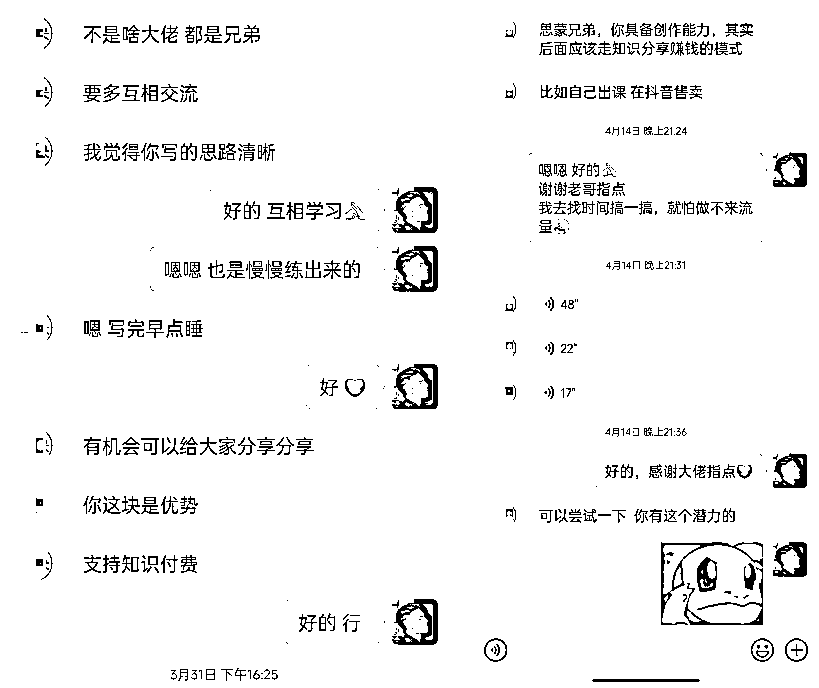

# 《我是如何用生财，从 0 基础小白做到 257 人团队的？》

> 原文：[`www.yuque.com/for_lazy/thfiu8/kpxks7w90ximr2qt`](https://www.yuque.com/for_lazy/thfiu8/kpxks7w90ximr2qt)

<ne-h2 id="fed46005" data-lake-id="fed46005"><ne-heading-ext><ne-heading-anchor></ne-heading-anchor><ne-heading-fold></ne-heading-fold></ne-heading-ext><ne-heading-content><ne-text id="u392f4a07">(114 赞)《我是如何用生财，从 0 基础小白做到 257 人团队的？》</ne-text></ne-heading-content></ne-h2> <ne-p id="ub53d0017" data-lake-id="ub53d0017"><ne-text id="ua893b37d">作者： 思蒙</ne-text></ne-p> <ne-p id="ua1db8b63" data-lake-id="ua1db8b63"><ne-text id="u57661efa">日期：2023-04-17</ne-text></ne-p> <ne-p id="udd823cb2" data-lake-id="udd823cb2"><ne-text id="u5f60cb0f">这算是给生财新人的，一篇参考文档。</ne-text></ne-p> <ne-p id="u79c63dde" data-lake-id="u79c63dde"><ne-text id="u19d871b0">为什么不叫指导，因为生财大佬太多，我不配。</ne-text></ne-p> <ne-p id="ua82b87b0" data-lake-id="ua82b87b0"><ne-text id="u5bfd8163">而且我确实也没什么能指导的，只是希望，</ne-text><ne-text id="ue0411aba" ne-bold="true">能给新人们，我自己在生财这个大圈子里逐渐成长的一点经验</ne-text><ne-text id="ub7aba26e">，希望对你有帮助。</ne-text></ne-p> <ne-p id="uc6f4aafd" data-lake-id="uc6f4aafd"><ne-text id="u616dc718">大家好，我是思蒙。</ne-text></ne-p> <ne-p id="uda39cfe9" data-lake-id="uda39cfe9"><ne-text id="u87a83a1d">以前是月薪 3000 搬砖人，目前在带 200 多人做短剧项目。</ne-text></ne-p> <ne-p id="u34626fec" data-lake-id="u34626fec"><ne-card data-card-name="image" data-card-type="inline" id="O6xnc" data-event-boundary="card">  <ne-p id="u669433bf" data-lake-id="u669433bf"><ne-card data-card-name="image" data-card-type="inline" id="jPyR7" data-event-boundary="card">  <ne-p id="u9131641d" data-lake-id="u9131641d"><ne-text id="u590b44ad">生财新一期，终于要正式开始了。</ne-text></ne-p> <ne-p id="u8f66de05" data-lake-id="u8f66de05"><ne-text id="ue0fe5f56">看到很多大佬们分享了一系列</ne-text><ne-text id="ue67c7042" ne-bold="true">帮新人如何认识生财，用好生财的帖子，都非常全面，专业</ne-text><ne-text id="ueeb23413">。不仅新人，我看了也获益良多。</ne-text></ne-p> <ne-p id="u0fd480f2" data-lake-id="u0fd480f2"><ne-text id="u24e8691d">按往常，我是觉得自己还没有资格，能给新人教些什么。</ne-text></ne-p> <ne-p id="u0604c3dd" data-lake-id="u0604c3dd"><ne-text id="u5c1cf710">但转眼一想，</ne-text><ne-text id="u08132e07" ne-bold="true">我从月薪 3000，到进入生财后开始自由职业，做到现在能带 257 人的团队，共同做一个项目。</ne-text></ne-p> <ne-p id="u3571a50f" data-lake-id="u3571a50f"><ne-text id="ud2670b70">也拿到了还算不错的结果，</ne-text><ne-text id="uc39d9557" ne-bold="true">这个经历本身，也许对很多新人就有一定的帮助。</ne-text></ne-p> <ne-p id="ud8aaa2df" data-lake-id="ud8aaa2df"><ne-text id="u3dc483d5">尽管我知道，生财里几乎聚集了各行业的大佬。无论是 6，7 期的“老财迷”，还是今年刚进来的“新财生”，都卧虎藏龙，各有千秋。</ne-text></ne-p> <ne-p id="u05f6715d" data-lake-id="u05f6715d"><ne-text id="uf91d213e">但更多的，还是像我这样，初入生财完全是个小白，“</ne-text><ne-text id="u4ff07a1c" ne-bold="true">一看精华真牛逼，关了手机又懵逼</ne-text><ne-text id="u807c04ec">”的情况。</ne-text></ne-p> <ne-p id="u8b5ddfe9" data-lake-id="u8b5ddfe9"><ne-text id="u8ca1e122">所以我打算，正好在第 7 期正式开始之际，把自己的经历分享出来，也许能给刚入生财的，像我这样的“三无”新人，一些启示和参考。</ne-text></ne-p> <ne-p id="u20e4e2eb" data-lake-id="u20e4e2eb"><ne-text id="uf6bdba6c">这篇文章分了以下部分：</ne-text></ne-p> <ne-oli index-type="0"><ne-oli-i>1</ne-oli-i><ne-oli-c class="ne-oli-content" id="u818b8bf0" data-lake-id="u818b8bf0"><ne-text id="u9d700a09">个人情况和生财结果</ne-text></ne-oli-c></ne-oli> <ne-oli index-type="0"><ne-oli-i>2</ne-oli-i><ne-oli-c class="ne-oli-content" id="u7b62e25d" data-lake-id="u7b62e25d"><ne-text id="uf03f5540">刚入生财的焦虑</ne-text></ne-oli-c></ne-oli> <ne-oli index-type="0"><ne-oli-i>3</ne-oli-i><ne-oli-c class="ne-oli-content" id="ufac01926" data-lake-id="ufac01926"><ne-text id="u2ff78c46">初步下场没结果</ne-text></ne-oli-c></ne-oli> <ne-oli index-type="0"><ne-oli-i>4</ne-oli-i><ne-oli-c class="ne-oli-content" id="u0bab465a" data-lake-id="u0bab465a"><ne-text id="u25993773">坚持输出得反馈</ne-text></ne-oli-c></ne-oli> <ne-oli index-type="0"><ne-oli-i>5</ne-oli-i><ne-oli-c class="ne-oli-content" id="ucc172b3f" data-lake-id="ucc172b3f"><ne-text id="u881ed683">一起同行再成长</ne-text></ne-oli-c></ne-oli> <ne-oli index-type="0"><ne-oli-i>6</ne-oli-i><ne-oli-c class="ne-oli-content" id="ue7945b02" data-lake-id="ue7945b02"><ne-text id="ub73d729e">带队二百干短剧</ne-text></ne-oli-c></ne-oli> <ne-p id="u21f74dbe" data-lake-id="u21f74dbe"><ne-text id="u8c2edef8">有时间的，可以从头看看，也许会引起共鸣，没时间的，就直接挑感兴趣的看。</ne-text></ne-p> <ne-p id="ud10ae516" data-lake-id="ud10ae516"><ne-card data-card-name="image" data-card-type="inline" id="UhEmv" data-event-boundary="card">  <ne-p id="ub16e5d4d" data-lake-id="ub16e5d4d"><ne-card data-card-name="image" data-card-type="inline" id="SGQj6" data-event-boundary="card">  <ne-p id="u68731e14" data-lake-id="u68731e14"><ne-text id="uf7c64f86">先简单介绍一下我的情况：</ne-text></ne-p> <ne-p id="u0df6d9f9" data-lake-id="u0df6d9f9"><ne-text id="u75047dfb">20 年 10 月加入生财；</ne-text></ne-p> <ne-p id="u7a6709bc" data-lake-id="u7a6709bc"><ne-text id="u19cd319c">21 年赚了 2 千多；</ne-text></ne-p> <ne-p id="u41df81f4" data-lake-id="u41df81f4"><ne-text id="u2359d076">22 年赚了不到 20 万；</ne-text></ne-p> <ne-p id="ue6798115" data-lake-id="ue6798115"><ne-text id="ubd03e8e0">今年 23 年，2 月和 3 月两个月，赚了以前上班最高年薪的钱；</ne-text></ne-p> <ne-p id="u63614bb2" data-lake-id="u63614bb2"><ne-text id="u82314a7b">累积在生财写了 6 篇帖子（作业不算），拿到 2 篇精华，其他 4 篇都被亦仁哥收进周合集里，也算是不错的反馈。</ne-text></ne-p> <ne-p id="u3f902b83" data-lake-id="u3f902b83"><ne-text id="u3a748fcd">这些结果，和大佬们比，不值一提。</ne-text></ne-p> <ne-p id="u8ec95108" data-lake-id="u8ec95108"><ne-text id="u39a71ecb">但生财 4 万多人，不可能 4 万多人都是大佬，</ne-text><ne-text id="ub6dada3b" ne-bold="true">反而像我这样，从 0 开始，慢慢积累，慢慢赚到钱的，应该才是常态，对普通人来说，参照意义，可能更大一些~</ne-text></ne-p> <ne-p id="u8fd72046" data-lake-id="u8fd72046"><ne-text id="u3cbf6ddb">我是 93 年的，坐标西北非省会地级市，人口不到 60 万，相当于南方小县城（甚至不如）；</ne-text></ne-p> <ne-p id="u50993317" data-lake-id="u50993317"><ne-text id="u92348187">15 年大学毕业，大学期间就知道玩，喜欢摄影、设计和骑行，和朋友从西安骑行青海湖及周边，累计骑行上万公里，街拍累计上万张照片；</ne-text></ne-p> <ne-p id="u46e83cba" data-lake-id="u46e83cba"><ne-card data-card-name="image" data-card-type="inline" id="LFz6V" data-event-boundary="card">  <ne-p id="u9d3e3536" data-lake-id="u9d3e3536"><ne-text id="ud6fa3516">毕业后进入 2 家公司，分别做到区域负责人，但最高月薪不超 8 千；</ne-text></ne-p> <ne-p id="ue7c9ed83" data-lake-id="ue7c9ed83"><ne-text id="uc2951b38">19 年回老家和朋友开水果店，跌跌撞撞 2 年期间开了 3 家，遇上疫情和火灾，加上没有合伙经验，最终以我退出告终。</ne-text></ne-p> <ne-p id="u094c48e2" data-lake-id="u094c48e2"><ne-card data-card-name="image" data-card-type="inline" id="oeAEG" data-event-boundary="card">  <ne-p id="u8a2c7608" data-lake-id="u8a2c7608"><ne-text id="ufbd36e9c">毕竟，早早了结，生意不成友谊在。</ne-text></ne-p> <ne-p id="u7536e91a" data-lake-id="u7536e91a"><ne-card data-card-name="image" data-card-type="inline" id="rIh43" data-event-boundary="card">  <ne-p id="uce4aa7df" data-lake-id="uce4aa7df"><ne-card data-card-name="image" data-card-type="inline" id="sgMMi" data-event-boundary="card">  <ne-p id="u2534c30c" data-lake-id="u2534c30c"><ne-text id="u0af63b7d">初入生财，我也是两眼一抹黑，怎么这么多精华帖，这么多大佬，大家都好厉害呀。</ne-text></ne-p> <ne-p id="u39f1c658" data-lake-id="u39f1c658"><ne-text id="ubebb07ba">而且越看帖子越迷茫，那么多项目，我该从何做起？</ne-text></ne-p> <ne-p id="u74b240d5" data-lake-id="u74b240d5"><ne-text id="ub5fa62b5" ne-bold="true">我不知道哪个适合我，也不知道哪个我自己能做</ne-text><ne-text id="u6d68d290">，加上自己本身也有工作，兜兜转转，懒懒散散，看了一篇又一篇，甚至有一段时间都不再打开生财了。</ne-text></ne-p> <ne-p id="u2067d623" data-lake-id="u2067d623"><ne-text id="ue831bc6f" ne-bold="true">感觉那些拿到结果的人，都离我好远，没有什么关系。</ne-text></ne-p> <ne-p id="u9ba96d69" data-lake-id="u9ba96d69"><ne-text id="ua46f9143">甚至一度怀疑自己，是不是花错钱了？</ne-text></ne-p> <ne-p id="ud7c1722d" data-lake-id="ud7c1722d"><ne-text id="uddaf48a2">我加进来到底有没有用啊。</ne-text></ne-p> <ne-p id="ucf942960" data-lake-id="ucf942960"><ne-text id="u9b444486">就这样过了一段时间，终于下定决心尝试一个小项目了，尽管跟着航海走，拿到了结果，挣了小几百块钱，但是也很费精力，感觉和自己付出的时间不成正比。</ne-text></ne-p> <ne-p id="uedeaeada" data-lake-id="uedeaeada"><ne-text id="u15fa5b0c">为什么别人好像动不动都是月入上万？甚至几十万的，人家做个项目下来随便就 6 位数了，我累死累活每天花了这么长时间，怎么才能挣几块几十块？</ne-text></ne-p> <ne-p id="u4db98184" data-lake-id="u4db98184"><ne-text id="ue3fa1e69">随放弃。</ne-text></ne-p> <ne-p id="ufff69bb8" data-lake-id="ufff69bb8"><ne-card data-card-name="image" data-card-type="inline" id="smMRS" data-event-boundary="card">  <ne-p id="u25bb4d44" data-lake-id="u25bb4d44"><ne-card data-card-name="image" data-card-type="inline" id="llYvK" data-event-boundary="card">  <ne-p id="u2dac8a8c" data-lake-id="u2dac8a8c"><ne-text id="ubd9c951c">就这样又晃了 2 个月，</ne-text><ne-text id="u553c9a68" ne-bold="true">一边在穷的边缘反复试探，一边在懒的汤锅里上下跳蹿。</ne-text></ne-p> <ne-p id="ubabc0463" data-lake-id="ubabc0463"><ne-text id="ufe9ae715">再这样下去也不是个事儿啊，还是得好好找一个项目去做，管他成败，把以前下苦力的勇气拿出来，</ne-text></ne-p> <ne-p id="u7901c3ef" data-lake-id="u7901c3ef"><ne-text id="uca4c4052" ne-bold="true">自己现在这么穷，唯一多的就是时间。</ne-text></ne-p> <ne-p id="ue16e6139" data-lake-id="ue16e6139"><ne-text id="u9281f3b2">就算失败了，只是损失了点时间，怕什么呢。</ne-text></ne-p> <ne-p id="ua8423a38" data-lake-id="ua8423a38"><ne-text id="u78219c96">随后又去翻精华帖，找到一个感觉自己能搞的，仔仔细细看了两三遍，就去联系分享的老师，发现还是得付费，而且费用还不少。</ne-text></ne-p> <ne-p id="u440d7655" data-lake-id="u440d7655"><ne-text id="uac37f2d5">但是转眼一想，加入生财的钱都花了，现在看到可能适合自己的，能赚钱的项目了，怎么还舍不得了？</ne-text></ne-p> <ne-p id="u5c2fd56c" data-lake-id="u5c2fd56c"><ne-text id="u7e381bc4">于是咬咬牙付费，直接开始跟着老师干了。</ne-text></ne-p> <ne-p id="u7aa39c4d" data-lake-id="u7aa39c4d"><ne-text id="ue507452a">当然最后的结果，还是不错的，我也在第一篇精华帖了分享了。</ne-text></ne-p> <ne-p id="ua5b2bb98" data-lake-id="ua5b2bb98"><ne-card data-card-name="image" data-card-type="inline" id="EFIHd" data-event-boundary="card">  <ne-p id="u523c83f9" data-lake-id="u523c83f9"><ne-card data-card-name="image" data-card-type="inline" id="zDWY1" data-event-boundary="card">  <ne-p id="ub81b5277" data-lake-id="ub81b5277"><ne-text id="u306b6b32">我还是太乐观了。</ne-text></ne-p> <ne-p id="u571bf270" data-lake-id="u571bf270"><ne-text id="u2c2aa63b">我以为 1，2 个月就能拿到结果。结果 3，4 个月过去了，我一共赚了，大概两千块[sad]。</ne-text></ne-p> <ne-p id="u3618ae25" data-lake-id="u3618ae25"><ne-text id="u4457ccff">说好的月入过万呢？！</ne-text></ne-p> <ne-p id="uac546602" data-lake-id="uac546602"><ne-text id="u678ef365">说好的半个月见结果呢？！</ne-text></ne-p> <ne-p id="u21569678" data-lake-id="u21569678"><ne-text id="ub40e0c8a">难道都是骗人的吗？？</ne-text></ne-p> <ne-p id="u2ddaa616" data-lake-id="u2ddaa616"><ne-text id="ua1aea1e9">虽然心态上有这种情绪，偶尔会怀疑自己，到底是不是选错了？</ne-text></ne-p> <ne-p id="u1659e913" data-lake-id="u1659e913"><ne-text id="u58c39c2d">但是在行动上从来没有迟疑过，</ne-text><ne-text id="ue71cb06f" ne-bold="true">因为迟疑没用。</ne-text></ne-p> <ne-p id="uad893ef4" data-lake-id="uad893ef4"><ne-text id="u67081ee9">就算没有收益，我也一直在研究，在找各种行业信息，在学习其他人怎么做的。</ne-text></ne-p> <ne-p id="u9fc71e11" data-lake-id="u9fc71e11"><ne-text id="u7ec0344e">为什么其他人可以挣钱，但我挣不到？</ne-text></ne-p> <ne-p id="u2593c3f5" data-lake-id="u2593c3f5"><ne-text id="u217f5b5b">所以在平台发生改变，同行开始转型的时候，我也是第一时间立刻开始研究、学习，去改变的，改变的过程很痛苦，但结果很好。</ne-text></ne-p> <ne-p id="uf7498f77" data-lake-id="uf7498f77"><ne-text id="u3ea7efba">终于，过了 1 个月，我爆了条百万级的播放，但游戏是预热阶段，还没挂链接，我没有收益[微笑]。</ne-text></ne-p> <ne-p id="ue085dd8d" data-lake-id="ue085dd8d"><ne-text id="uce486563">又过了 1 个月，再次小爆了一条，这条视频达到了一千多的收益。</ne-text></ne-p> <ne-p id="ud651adcf" data-lake-id="ud651adcf"><ne-text id="uf969456a" ne-bold="true">这是我第一次尝到，日入过千的感觉，简直太爽了！</ne-text><ne-text id="u5c2c64ab">随赶紧在我们小群发了个红包。</ne-text></ne-p> <ne-p id="u60ada3d3" data-lake-id="u60ada3d3"><ne-text id="ud0d82de0">这给了我极大的信心，此后每个月，我开始 6 千，1 万 2，1 万 6，2 万 1，这样的收入在涨……</ne-text></ne-p> <ne-p id="u72185768" data-lake-id="u72185768"><ne-text id="u0ebe0280">在这些过程中遭受的打击和磨练，让我不断去学习和研究短视频的逻辑和玩法，也促使我写出了第一篇精华帖，和后面一系列相关经验。比如：</ne-text></ne-p> <ne-p id="u355ebae4" data-lake-id="u355ebae4"><ne-text id="ubb1fa6a4">《一文讲清养号问题》</ne-text></ne-p> <ne-p id="u6a47367c" data-lake-id="u6a47367c">[<ne-text id="ucd9f9806">https://t.zsxq.com/0cWd5XlaU</ne-text>](https://t.zsxq.com/0cWd5XlaU)</ne-p> <ne-p id="uaa9602f3" data-lake-id="uaa9602f3"><ne-text id="u2684aa1f">《什么是账号标签，如何打账号标签？》</ne-text></ne-p> <ne-p id="u92826841" data-lake-id="u92826841">[<ne-text id="ua0e70827">https://t.zsxq.com/0cAOfjM58</ne-text>](https://t.zsxq.com/0cAOfjM58)</ne-p> <ne-p id="u5c9f44cc" data-lake-id="u5c9f44cc"><ne-text id="u4e6bb62c">《我是不是又被限流了？》</ne-text></ne-p> <ne-p id="u91dae139" data-lake-id="u91dae139">[<ne-text id="u2e1305f8">https://mp.weixin.qq.com/s/6UFc6F63y2i1nLuOtRFHWQ</ne-text>](https://mp.weixin.qq.com/s/6UFc6F63y2i1nLuOtRFHWQ)</ne-p> <ne-p id="u4e9bf112" data-lake-id="u4e9bf112"><ne-text id="u5f12c9a0">《你为什么做不好短视频？3 个必须知道的底层逻辑》</ne-text></ne-p> <ne-p id="ue5475751" data-lake-id="ue5475751">[<ne-text id="u647cb606">https://mp.weixin.qq.com/s/7tiDBvV7TvjAro7y8HtJqA</ne-text>](https://mp.weixin.qq.com/s/7tiDBvV7TvjAro7y8HtJqA)</ne-p> <ne-p id="uf0d37f1f" data-lake-id="uf0d37f1f"><ne-card data-card-name="image" data-card-type="inline" id="v8Zxi" data-event-boundary="card">  <ne-p id="udf80f63e" data-lake-id="udf80f63e"><ne-card data-card-name="image" data-card-type="inline" id="rzXPR" data-event-boundary="card">  <ne-p id="u3b2f22e0" data-lake-id="u3b2f22e0"><ne-text id="u402764b0">拿到了精华贴之后，再次给了我极大的信心。</ne-text></ne-p> <ne-p id="ub622f95d" data-lake-id="ub622f95d"><ne-text id="ubd3d384b">连我这种只挣到小几万，而且分享的内容里，也没什么深度的帖子，都能拿到精华？</ne-text></ne-p> <ne-p id="u0590c391" data-lake-id="u0590c391"><ne-text id="u6611d796">我到现在都怀疑，当时能拿到精华，一定是亦仁大佬给我放水了。哈哈哈哈~</ne-text></ne-p> <ne-p id="u7c78e94c" data-lake-id="u7c78e94c"><ne-text id="u9beed9f0">可能是他站在更高的角度，考虑到</ne-text><ne-text id="u714c5ad2" ne-bold="true">第一篇精华，对于一个小白成长路上的激励有多大，能让对方产生更大的进步，并且对生财的信任度和归属感也会更加强烈。</ne-text></ne-p> <ne-p id="u96e6d21a" data-lake-id="u96e6d21a"><ne-text id="u64dc0700">反正不管咋样，我现在肯定是要续费 100 年的。</ne-text></ne-p> <ne-p id="u544d8b62" data-lake-id="u544d8b62"><ne-text id="u451e2363">这个项目稳定之后，我逐渐放开时间，去生财里寻找其他项目，后来发现，在我专注做这个项目期间，有很多机会更大的项目，都被我错过了。</ne-text></ne-p> <ne-p id="u89589770" data-lake-id="u89589770"><ne-text id="u7f397b5f">但转眼一想，</ne-text><ne-text id="u4343210c" ne-bold="true">要是我当时不专注做这个，别的所谓机会更大的项目，我就一定能做成吗？</ne-text></ne-p> <ne-p id="u73db3527" data-lake-id="u73db3527"><ne-text id="u9ad3f0e7">别人能赚到钱，也许是在之前积累了很多相关经验，我进去，可就是从头开始。</ne-text></ne-p> <ne-p id="u719be220" data-lake-id="u719be220"><ne-text id="ud22f5601">所以不用懊悔，</ne-text><ne-text id="u24ff7297" ne-bold="true">抓住当下，看向未来，才是我们能做的最重要的事。</ne-text></ne-p> <ne-p id="u5bab4cb8" data-lake-id="u5bab4cb8"><ne-text id="uac11bceb">好景不长，在留意其他项目的同时，我这个项目由于各方因素，也逐渐开始不稳定了，这更逼我加速去留意其他项目。</ne-text></ne-p> <ne-p id="ud2d2867a" data-lake-id="ud2d2867a"><ne-text id="u70de4a50">没过多久，成哥就发现一个项目，让我尽快去测试一下，我第一天搞好账号，第 2 天立刻就去测，测了第 3 天看到有效果，就马上着手批量放大。</ne-text></ne-p> <ne-p id="ue53ad298" data-lake-id="ue53ad298"><ne-text id="uea175c50">当然这是个短期项目，算是撸羊毛不过撸的能多点，每天能撸几千块甚至上万的，大概十来天，项目就结束了。</ne-text></ne-p> <ne-p id="ua9907488" data-lake-id="ua9907488"><ne-text id="ubaed7972">这几天是我日产最高的时刻，十来天挣了几万块。</ne-text></ne-p> <ne-p id="u761a7c04" data-lake-id="u761a7c04"><ne-text id="u6c997c10">当时做到第 5 天，我挣了不到 2 万块，为了表示感谢，就给成哥发了收益近半的红包 8888 元。结果紧接着后面 2 天收益就下滑了。</ne-text></ne-p> <ne-p id="u0304714f" data-lake-id="u0304714f"><ne-text id="u071a5f88">项目完了我还和成哥开玩笑，”多亏早早给你发红包了，要是晚几天，我估计就没这么大方了。“</ne-text></ne-p> <ne-p id="u1a1bfecd" data-lake-id="u1a1bfecd"><ne-card data-card-name="image" data-card-type="inline" id="gqV9t" data-event-boundary="card">  <ne-p id="u4946ced8" data-lake-id="u4946ced8"><ne-card data-card-name="image" data-card-type="inline" id="LGtHO" data-event-boundary="card"> <ne-text id="ueaddd17d"><ne-p id="u83da6739" data-lake-id="u83da6739"><ne-text id="u950eb67d">这一节，没有按照时间顺序来讲，和其他章节属于平行时间。</ne-text></ne-p> <ne-p id="u7156e94c" data-lake-id="u7156e94c"><ne-text id="ud291d983">在我们找到适合自己的项目，并且专注实干的时候，别忘了有空回来看看。</ne-text></ne-p> <ne-p id="u129dfadb" data-lake-id="u129dfadb"><ne-text id="u0060a5d5">毕竟，就算你的项目再赚钱，也不可能一直持续（我是说新人）。</ne-text></ne-p> <ne-p id="u29eaaadd" data-lake-id="u29eaaadd"><ne-text id="u1a6d5238">项目不是长久的，但你认识的人，大概率是能长久的。我有一段时间，就是埋头苦干，甚至几个月都没进过知识星球。</ne-text></ne-p> <ne-p id="uc3c77c7a" data-lake-id="uc3c77c7a"><ne-text id="u2d25fa7d">但在稳定了之后，可以尝试抽一些时间，多去参加其他航海，不仅能多认识一些新朋友，毕竟在生财里交朋友，至少信任成本，都被大大的降低了。</ne-text></ne-p> <ne-p id="ued801203" data-lake-id="ued801203"><ne-text id="u112e0c91">还能了解其他行业动态，不一定要参与到别的项目，但是别的项目知识，也许对你当下的项目，有意外的启发和帮助。</ne-text></ne-p> <ne-p id="u893a17c4" data-lake-id="u893a17c4"><ne-text id="u491aed8a">我在后来项目稳定的时候，参与几个了航海活动，同时还报名了航海志愿者，</ne-text><ne-text id="u0b6138df" ne-bold="true">认识了一些圈友的同时，也学到了生财社群运营，和实战活动运营的很多小细节。</ne-text></ne-p> <ne-p id="ub4f039e1" data-lake-id="ub4f039e1"><ne-text id="uc6ce3017">这些小细节，分看来，好像都很普通，但是一套组合下来，非常的高效有用。</ne-text></ne-p> <ne-p id="u39668466" data-lake-id="u39668466"><ne-text id="u8415a20f" ne-bold="true">不仅节省了活动发起方的时间，也让参与者觉得很细心专业。</ne-text></ne-p> <ne-p id="u8e059de3" data-lake-id="u8e059de3"><ne-text id="ue17a2c98">这也给后来，我自己带项目积累了宝贵的经验。</ne-text></ne-p> <ne-p id="ue8b7c789" data-lake-id="ue8b7c789"><ne-text id="u6e9e3791">在这里我强烈建议，有时间的圈友，或者没项目的圈友，一定一定，至少参与一次航海实战，至少参与一次航海志愿者！</ne-text></ne-p> <ne-p id="u02bf476a" data-lake-id="u02bf476a"><ne-text id="u0b022af3">让你感受一下什么叫生财航海，什么叫真正的 SOP，什么叫圈友的力量！</ne-text></ne-p> <ne-p id="u1723d132" data-lake-id="u1723d132"><ne-text id="u4e4a60cf">后来也很荣幸，能被子安和静伟老师，邀请做 2 月份的抖音游戏航海的教练，能和生财的伙伴们，一起协作去写航海手册。</ne-text></ne-p> <ne-p id="uc37236f9" data-lake-id="uc37236f9"><ne-text id="ucd7ca5c2">让我又一次学习到了，什么叫专业的、真正的、保姆级实战手册，这也给我后面带队、写文档，并且拿到第 2 个精华帖做了铺垫。</ne-text></ne-p> <ne-p id="ueed0dd87" data-lake-id="ueed0dd87"><ne-text id="u3d5d4746">当然，我在做这些的时候，都是预料不到，这些事情会给我带来这么大的帮助的，因为当时那段时间我特别忙，经常都是在晚上 11,2 点后，才有空写实战手册，然后写完 1，2 点，甚至更晚。</ne-text></ne-p> <ne-p id="u6b72871d" data-lake-id="u6b72871d"><ne-text id="u3615d053">甚至有一次，被子安临时叫去帮忙分享，还是在外面有别的事，给电脑开着热点在车里去做的[笑]。</ne-text></ne-p> <ne-p id="u44bc06f3" data-lake-id="u44bc06f3"><ne-text id="u85cb981a">也正是这些经历，让我在带队的时候，也有了相关经验，所以更加从容，不慌。</ne-text></ne-p> <ne-p id="u0441f134" data-lake-id="u0441f134"><ne-card data-card-name="image" data-card-type="inline" id="w7PtL" data-event-boundary="card">  <ne-p id="uce6491e4" data-lake-id="uce6491e4"><ne-card data-card-name="image" data-card-type="inline" id="LN1Fa" data-event-boundary="card">  <ne-p id="u247e411c" data-lake-id="u247e411c"><ne-text id="u30e1839c">接上上一节，因为自身项目不太稳定。过年后，我就开始寻找新的项目。</ne-text></ne-p> <ne-p id="u33c0db03" data-lake-id="u33c0db03"><ne-text id="ub35e81af">在帖子里翻到一篇关于短剧的内容，我回想起，正好前几天和朋友聊过，但当时没在意。</ne-text></ne-p> <ne-p id="u8866b419" data-lake-id="u8866b419"><ne-text id="u0efcdb15">而且有一篇公众号里也提醒过，这就算是个异常值吧。</ne-text></ne-p> <ne-p id="u1c85384e" data-lake-id="u1c85384e"><ne-text id="ub354d9d6">亦仁说过，当一个关键词被反复提及的时候，你就得去注意了，这里面很可能蕴藏着巨大的商业机会。</ne-text></ne-p> <ne-p id="u63d9b982" data-lake-id="u63d9b982"><ne-text id="ue72178cf">所以我和朋友聊了之后，立刻就去找到渠道付费学习。</ne-text></ne-p> <ne-p id="udd34962b" data-lake-id="udd34962b"><ne-text id="u2b2f3956">然后花了 2，3 天时间，把模型跑通之后，就按照之前在生财学到的写实战手册的模式，写了一份【短剧推广的实战手册】，同时也分享到了社群里。</ne-text></ne-p> <ne-p id="u89c873b7" data-lake-id="u89c873b7"><ne-text id="u95b8183f">尽管当时，我对自己带队没有自信，但是我深知，这个项目本身，和我之前做的比，逻辑一样，操作上还要简单 N 倍，所以就迅速成立了一个陪跑群，拉到了第一批种子用户。</ne-text></ne-p> <ne-p id="uc1f10760" data-lake-id="uc1f10760"><ne-text id="u26007631" ne-bold="true">在做交付的途中，就用到了，一些在参与航海志愿者事学到的方法。</ne-text></ne-p> <ne-p id="u7067209a" data-lake-id="u7067209a"><ne-text id="u2e3073b4">比如，提前准备沟通话术 SOP，并且整理常见问题手册，方便及时回答学员。</ne-text></ne-p> <ne-p id="u7cba3730" data-lake-id="u7cba3730"><ne-text id="u5a825c3b">还有定期的直播分享，以及邀请优秀学员分享，整理出一份全面、清晰，而且容易查找相关问题的思维导图，和视频直播课。</ne-text></ne-p> <ne-p id="ue0b78800" data-lake-id="ue0b78800"><ne-text id="u11bddf8c">这些都是从航海，和其他课程学习来的。</ne-text></ne-p> <ne-p id="u9ba42034" data-lake-id="u9ba42034"><ne-text id="ucd7b6fe2">很荣幸，在自己赚钱的路上，也帮大家赚到了一些钱，所以</ne-text><ne-text id="u4dcc32ce" ne-bold="true">除了赚钱，我还收获了更多的认可、感谢、红包，以及行业大佬的支持。</ne-text></ne-p> <ne-p id="u0fc3dcab" data-lake-id="u0fc3dcab"><ne-text id="u248f9e35">比如亮宇的负责人，看了我的一些分享，说他们渠道本身是禁止收费的，但是觉得我分享的内容很有质量，认为我完全可以去专门做知识付费的内容。</ne-text></ne-p> <ne-p id="u606c4867" data-lake-id="u606c4867"><ne-card data-card-name="image" data-card-type="inline" id="NcitG" data-event-boundary="card">  <ne-p id="ube136423" data-lake-id="ube136423"><ne-text id="udc5802df">这些能力，当然不是我做了这个项目才有，而是我之前做过的，和正在做的，累积在一起，才慢慢迭代出来的。</ne-text></ne-p> <ne-p id="u100ac007" data-lake-id="u100ac007"><ne-text id="ue4642652">我很幸运，第一次做陪跑，就陆续得到了 200 多位小伙伴认可，并且还有很多小伙伴坦言，说成了我的小迷妹，后面有项目也愿意跟着我继续做。</ne-text></ne-p> <ne-p id="ueaeaac24" data-lake-id="ueaeaac24"><ne-card data-card-name="image" data-card-type="inline" id="IsVnE" data-event-boundary="card">  <ne-p id="udb805a19" data-lake-id="udb805a19"><ne-text id="u54194ac7">而这些结果，当然也不是在我一开始，就能想到的。</ne-text></ne-p> <ne-p id="uadc34091" data-lake-id="uadc34091"><ne-card data-card-name="image" data-card-type="inline" id="Z5chi" data-event-boundary="card">  <ne-p id="u10cb7d6f" data-lake-id="u10cb7d6f"><ne-card data-card-name="image" data-card-type="inline" id="ggHZD" data-event-boundary="card"> <ne-text id="u3e426e9e"><ne-p id="u2eec8997" data-lake-id="u2eec8997"><ne-text id="ua83a1f2b">最近，除了运营陪跑群之外，我在学习直播和 AI 绘画的相关内容。也欢迎有这部分经验，或者准备入局这方面的新老圈友来链接~</ne-text></ne-p> <ne-p id="u4efba375" data-lake-id="u4efba375"><ne-text id="u0675ef10">我今年的目标，是努力赚到 50 万，明年争取赚到 100 万。</ne-text></ne-p> <ne-p id="uc18eb993" data-lake-id="uc18eb993"><ne-text id="u1e8163ed">而据我狭窄的知识面了解的，可能这两个赛道，相对容易一点。</ne-text></ne-p> <ne-p id="u86a2fe79" data-lake-id="u86a2fe79"><ne-text id="ud1735a17">也许对已经打通任督二脉的大佬来说，一年随便玩儿，都能赚个 100 万。但对我目前来说，还差得远。</ne-text></ne-p> <ne-p id="u9a28351d" data-lake-id="u9a28351d"><ne-text id="u6398a0ca">我也许能体会那种感觉，</ne-text><ne-text id="u3e35c3c6" ne-bold="true">就像我现在自信的认为，随便找个项目去做，做到月入过万都没问题一样。放以前，我是一点也不敢这么想的。</ne-text></ne-p> <ne-p id="u8f67e1fe" data-lake-id="u8f67e1fe"><ne-text id="u2c1a6e27">这种底气，就是我们各种或成功，或失败的经验，积累起来的吧。</ne-text></ne-p> <ne-p id="uc35fccd1" data-lake-id="uc35fccd1"><ne-text id="ue87ec39d">我是思蒙，欢迎新老朋友，一起生财有术！</ne-text></ne-p> <ne-hole id="u3b01fbcc" data-lake-id="u3b01fbcc"><ne-card data-card-name="hr" data-card-type="block" id="YFK6x" data-event-boundary="card"><ne-p id="u3a836900" data-lake-id="u3a836900"><ne-text id="ua89cf58a">评论区：</ne-text></ne-p> <ne-p id="u714221e2" data-lake-id="u714221e2"><ne-text id="u957eeebc">果然靠谱 : 所以大佬是怎么做的短剧呢求指点～</ne-text> <ne-text id="u22fca46b">Lucia : 深夜干了这碗鸡汤</ne-text> <ne-text id="uaf518905">思蒙 : 哈哈哈哈~</ne-text> <ne-text id="ua2b01b38">财女小马达 : 赞</ne-text> <ne-text id="uea46fb22">思蒙 : 看我之前在生财分享的精华帖，就可以直接实干了呀</ne-text> <ne-text id="u77e785df">果然靠谱 : 谢谢大佬，我再去学学！</ne-text> <ne-text id="ud0601713">万能神 : [菜刀]</ne-text> <ne-text id="ue08ba0fb">肖一 : 感谢思蒙！让我加入生财赚到了第一笔 1000 元[玫瑰][玫瑰]</ne-text></ne-p> <ne-p id="ubfbbfe0e" data-lake-id="ubfbbfe0e"><ne-text id="u5efeb376">还是我脸皮厚啊，刚进生财体验那三天就开始狂加各种大佬，还不打招呼，真是要不得[捂脸]～</ne-text> <ne-text id="uf10d77ff">现在不敢再加大佬了</ne-text></ne-p></ne-card></ne-hole></ne-text></ne-card></ne-p></ne-card></ne-p></ne-card></ne-p></ne-card></ne-p></ne-card></ne-p></ne-card></ne-p></ne-text></ne-card></ne-p></ne-card></ne-p></ne-card></ne-p></ne-card></ne-p></ne-card></ne-p></ne-card></ne-p></ne-card></ne-p></ne-card></ne-p></ne-card></ne-p></ne-card></ne-p></ne-card></ne-p></ne-card></ne-p></ne-card></ne-p></ne-card></ne-p></ne-card></ne-p></ne-card></ne-p>