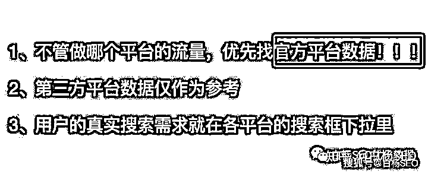
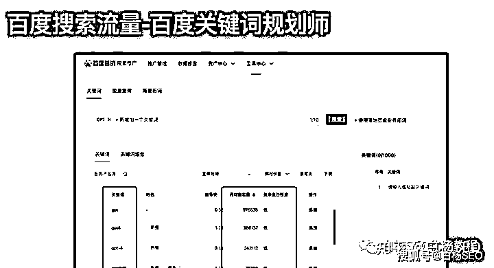
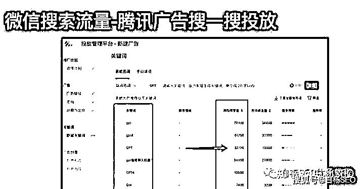
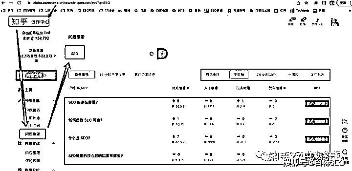

# 《如何找对有流量的关键词，与 ChatGPT 工具结合 SEO 可用在哪些方面？ 》

> 原文：[`www.yuque.com/for_lazy/thfiu8/icq7wl1ozrog4atp`](https://www.yuque.com/for_lazy/thfiu8/icq7wl1ozrog4atp)

<ne-h2 id="defe6931" data-lake-id="defe6931"><ne-heading-ext><ne-heading-anchor></ne-heading-anchor><ne-heading-fold></ne-heading-fold></ne-heading-ext><ne-heading-content><ne-text id="u0e977425">(49 赞)《如何找对有流量的关键词，与 ChatGPT 工具结合 SEO 可用在哪些方面？ 》</ne-text></ne-heading-content></ne-h2> <ne-p id="ufc6bfdd1" data-lake-id="ufc6bfdd1"><ne-text id="ua16fc4c1">作者： 白杨 SEO</ne-text></ne-p> <ne-p id="u19dc1ef9" data-lake-id="u19dc1ef9"><ne-text id="u51435d4b">日期：2023-05-05</ne-text></ne-p> <ne-p id="ucf7371ed" data-lake-id="ucf7371ed"><ne-text id="ube779abf">如何找对有流量的关键词?</ne-text></ne-p> <ne-p id="u48a96722" data-lake-id="u48a96722"><ne-text id="ua59c77e9">对于做 SEO 流量的同学都知道，不管做哪个平台的 SEO，除了了解该平台规则以外，最最重要的就是找对这个平台上的用户搜索用的关键词！</ne-text></ne-p> <ne-p id="ua981c4cc" data-lake-id="ua981c4cc"><ne-text id="u6854de46">如何找对关键词，如我在白杨 SEO 上海线下聚会 PPT 分享截图如下，核心就是</ne-text><ne-text id="ua140de5a" style="color: rgb(204, 0, 0);">优先找官方平台的数据！</ne-text></ne-p> <ne-p id="ue6d750de" data-lake-id="ue6d750de"><ne-card data-card-name="image" data-card-type="inline" id="YZjzP" data-event-boundary="card">  <ne-p id="u807bad65" data-lake-id="u807bad65"><ne-card data-card-name="image" data-card-type="inline" id="WC1E1" data-event-boundary="card">  <ne-p id="ufe97cad1" data-lake-id="ufe97cad1"><ne-card data-card-name="image" data-card-type="inline" id="jvn16" data-event-boundary="card">  <ne-p id="u37a41809" data-lake-id="u37a41809"><ne-card data-card-name="image" data-card-type="inline" id="F0SDN" data-event-boundary="card">  <ne-p id="u12fcd469" data-lake-id="u12fcd469"><ne-text id="u4860835a">为什么我们首先要用平台官方的关键词数据做做参考，因为很多第三方平台的数据其实也是预估或者找的一些接口，还有一些指数工具很多词都查不到，所以要用官方的。而搜索框下拉只能知道用户需求词，但词的流量多少才是我们要选哪个词做的关键。</ne-text></ne-p> <ne-p id="ud818be97" data-lake-id="ud818be97"><ne-text id="u92e09425" ne-bold="true">白杨 SEO 的 GPT 应用方面分享</ne-text></ne-p> <ne-p id="uf59cc05e" data-lake-id="uf59cc05e"><ne-text id="ubdf99891">关于我在 GPT（chatgpt、文心一言等生成式人工智能创作工具）的应用方面，这边同步一下大家，目前用得不算多。主要用在以下方面：</ne-text></ne-p> <ne-p id="ude037e1c" data-lake-id="ude037e1c"><ne-text id="u9f5fcf25">1、公众号写作主题或者内容参考。比如之前写微信 SEO 怎么做，GPT 与 SEO 对比等文章等。包括公众号标题参考等等。主要用于获取微信搜一搜流量。</ne-text></ne-p> <ne-p id="u1a25907a" data-lake-id="u1a25907a"><ne-text id="u78d6143e">2、网站文章、百家号文章。白杨 SEO 博客的网络营销栏目部分文章，以及其它自己的大闸蟹、装修网站。百家号文章，新弄了一个以企业认证服务的百家号，用来获取百度上的搜索流量。</ne-text></ne-p> <ne-p id="u02c4d0da" data-lake-id="u02c4d0da"><ne-text id="u0c46322c">3、知乎回答、小红书笔记。白杨其中一个小号，就用 GPT 来解答知乎上的问题。有人问问题怎么选？因为我是做精准搜索流量，所以我的问题都是用关键词去搜的（在知乎创作里搜或用 5118 筛选），而不是用推荐的问题。</ne-text></ne-p> <ne-p id="u3652d4ef" data-lake-id="u3652d4ef"><ne-card data-card-name="image" data-card-type="inline" id="LUH7p" data-event-boundary="card">  <ne-p id="ud356c866" data-lake-id="ud356c866"><ne-text id="uc24735ad">白杨 SEO 线下聚会对于 GPT 应用分享（部分）</ne-text></ne-p> <ne-p id="u01055675" data-lake-id="u01055675"><ne-text id="u351b037a">1、GPT+RPA（机器自动化）+百家号，主要能过让 GPT 根据提前找好的关键词或者 GPT 生成的关键词，然后再来生成的内容。再然后用 RPA（小白推荐用影刀 RPA）来自动模拟人操作流程发布到百家号上，再来进行推广。目前主要用于品牌推广。</ne-text></ne-p> <ne-p id="u62092902" data-lake-id="u62092902"><ne-text id="uedd9ba69">2、GTP+RPA+SEO+网站，这个是一个技术大牛小哥老王的分享，之前做国内的，网站有上百个，公众号有过上千个。现在主要是在研究谷歌 SEO 网站。主要运用 GPT 的内容直接用 PRA 发布在网站上，好的网站目前谷歌收录率 60%。目前主要用于先把网站流量做起来。</ne-text></ne-p> <ne-p id="uc4543ded" data-lake-id="uc4543ded"><ne-text id="u02fa1934">3、GPT+售前或售后服务，简单就是用 GPT 来写 2B 企业的专业的访谈稿大纲或者主要内容。给潜在 2B 客户感觉专业，加深好感。</ne-text></ne-p> <ne-p id="u4660cd19" data-lake-id="u4660cd19"><ne-text id="ufa4b1056">4、GPT+推广文章。用 GPT 来生成文案，用第三方发布工具 发布在第三方各自媒体平台，主要用于做第三方平台站内流量或者百度关键词搜索占位结果流量。</ne-text></ne-p> <ne-p id="ua3e01f42" data-lake-id="ua3e01f42"><ne-text id="u5c606708">星球里花爷说，ChatGPT 有四波机会，分别是【入门上手的需求】、【应用的需求】、【工具的需求】、【多平台的需求】。除了多平台，这个是国内这些大厂在搞的与我们普通人无关外，前三个说都有机会。</ne-text></ne-p> <ne-p id="u6298d8da" data-lake-id="u6298d8da"><ne-text id="u7574d9aa">在我看来，所谓入门上手的需求，比如 GPT 账号，GPT 注册，GPT 怎么使用，现在很多星球，包括直播 39.9 元都在干这个。</ne-text></ne-p> <ne-p id="u244b3380" data-lake-id="u244b3380"><ne-text id="u7db69593">所谓应用的需求，这也是白杨 SEO 正在做的，与 SEO 这个垂直相结合。</ne-text></ne-p> <ne-p id="u73ddc267" data-lake-id="u73ddc267"><ne-text id="u98a35351">而工具的需求，有很多朋友已经在基于 GPT 开发了。所以，GPT 入门需求，是教育用户，也可以叫信息差的钱。而 GPT 工具的需求，你不懂技术你赚不了，即使你懂技术，你的工具推广不出去，也不那么容易赚钱的。还有，工具还有一个 ZC 风险，懂得人懂。</ne-text></ne-p> <ne-p id="u189bce00" data-lake-id="u189bce00"><ne-text id="uc56d82c7">真正在 GPT 的机会，我觉得是 GPT 应用的机会。因为一直专注 SEO 及全网 SEO 十多年了，所以我想到与 GPT 结合做了 GPTSEO，那你是不是与你的行业可以结合做个产品？只要能提高工作效率，或者能为你搞流量，那么你就有可能赚到更多钱。你说对吗？</ne-text></ne-p> <ne-p id="udcd40adf" data-lake-id="udcd40adf"><ne-text id="u9e3a3bc6">白杨 SEO，专注 SEO 研究十年，全网 SEO 流量实战派，对互联网精准流量有深入研究。</ne-text></ne-p> <ne-hole id="ub3800548" data-lake-id="ub3800548"><ne-card data-card-name="hr" data-card-type="block" id="vngOX" data-event-boundary="card"><ne-p id="u713b8026" data-lake-id="u713b8026"><ne-text id="u3b9a9b81">评论区：</ne-text></ne-p> <ne-p id="u77528ab6" data-lake-id="u77528ab6"><ne-text id="u8d3af05c">猫哥 : 感谢分享。</ne-text> <ne-text id="ud5ff23a8">白杨 SEO : 不谢，有启发就好[咖啡]</ne-text> <ne-text id="uf2a0e6b5">张宇凡 : 刚写完分享就看到你这篇帖子，ChatGPT 与 SEO 结合，太符合了[强]</ne-text>[<ne-text id="ua6340148">https://articles.zsxq.com/id_v6w1tgdlw3eb.html</ne-text>](https://articles.zsxq.com/id_v6w1tgdlw3eb.html)</ne-p></ne-card></ne-hole></ne-card></ne-p></ne-card></ne-p></ne-card></ne-p></ne-card></ne-p></ne-card></ne-p>