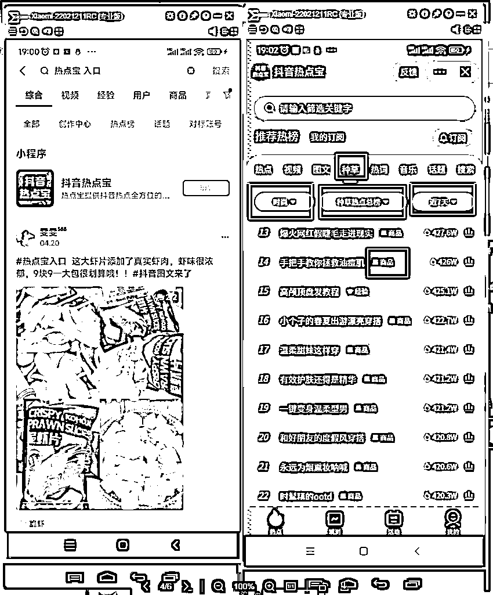
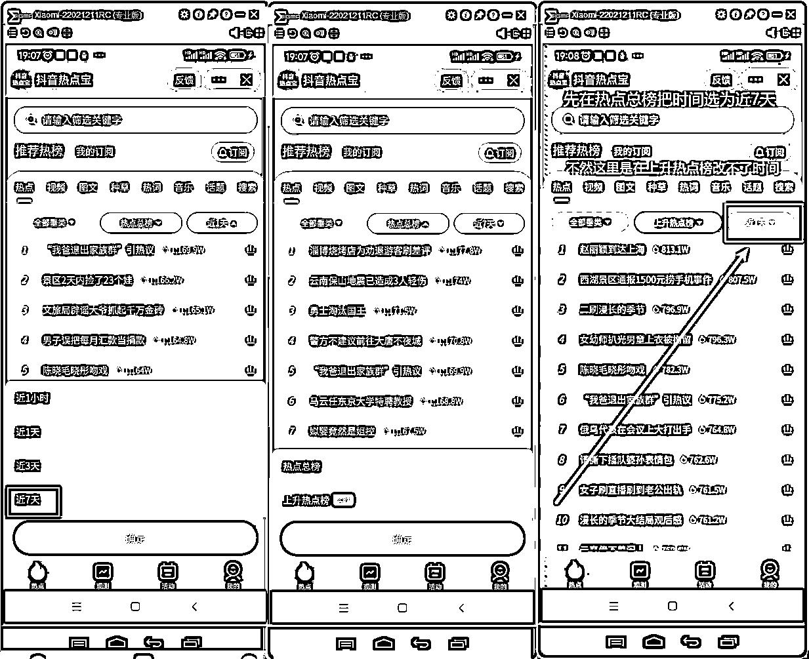
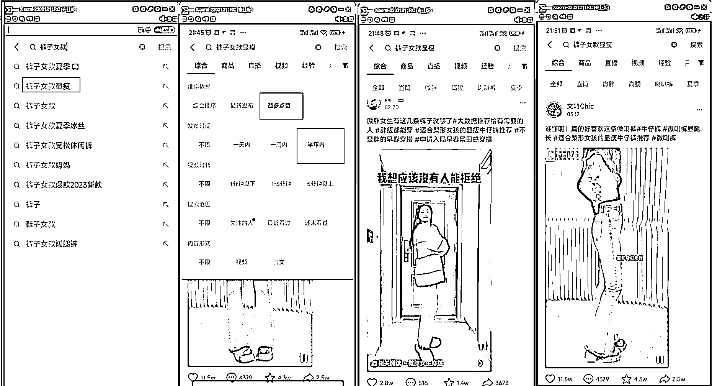
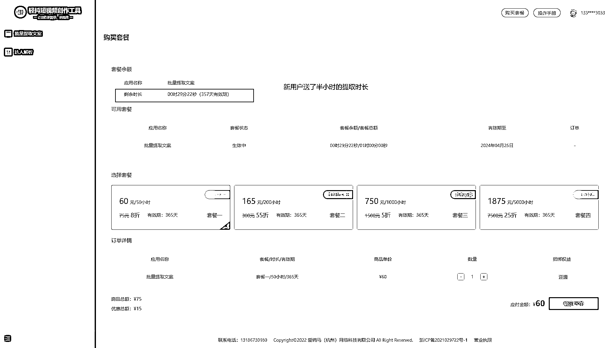
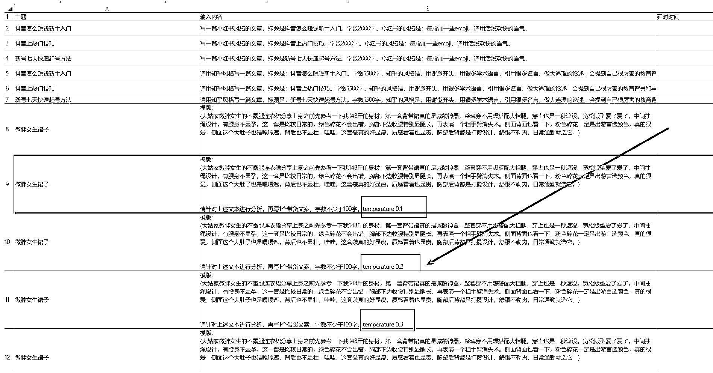
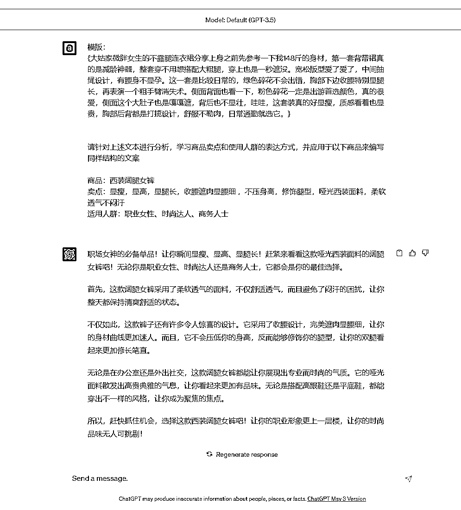
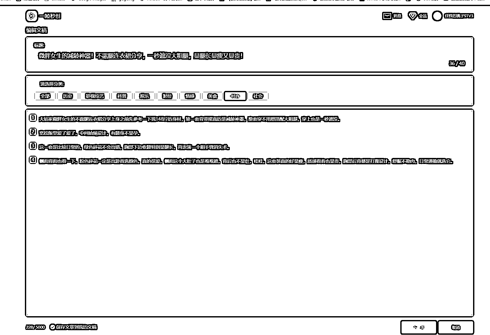
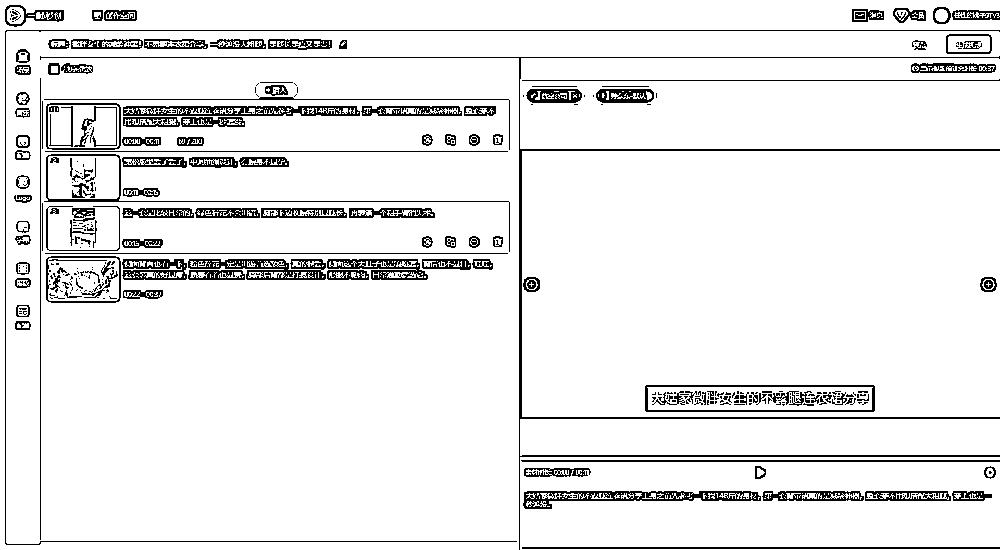
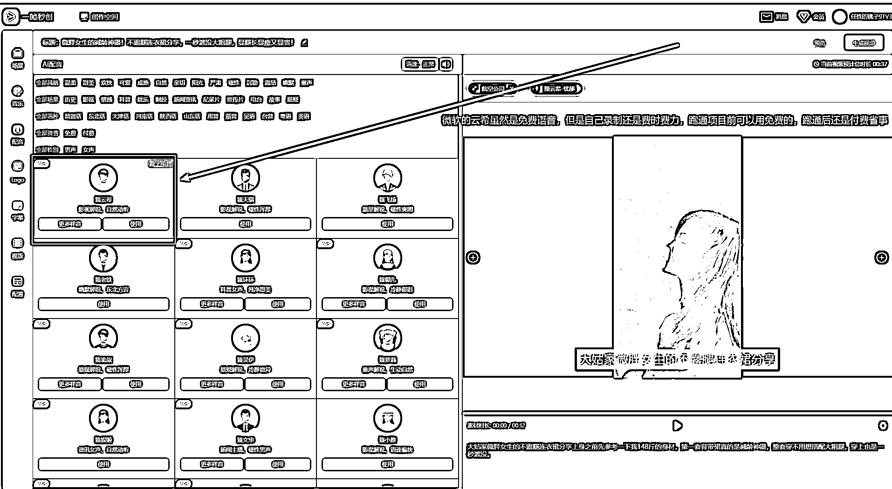

# 《用 ChatGPT 超级写手批量制作抖音带货文案》

> 原文：[`www.yuque.com/for_lazy/thfiu8/ci3n1g5r01tfk1qw`](https://www.yuque.com/for_lazy/thfiu8/ci3n1g5r01tfk1qw)

## (236 赞)《用 ChatGPT 超级写手批量制作抖音带货文案》 

作者： 渣渣浩 

日期：2023-05-06 

  

本文用到的工具清单： 

1.抖音热点宝（手机端） 

2.total control                 方便电脑控制手机（苹果用虫洞） 

3.轻抖（网页版）             新用户送 30 分钟，视频文案提取 

4.uibot                            chatgpt 超级写手机器人基于 uibot 开发完成 

5.chatgpt                        任何一个注册教程  搭配我写的一篇解决问题的思路的文章就能轻松解决 

6.temperature                 chatgpt 提问时加一个 temperature 输出效果立马不一样 

7.webchatgpt 谷歌插件    让 chatgpt 能够联网，文案输出能力极大增强不然只能用 2021 年 9 月以前的数据 

8.一帧秒创                       爆款文案出来后用它来生成视频并且自动配音，再替换本地素材 

带货文案怎么写？ 

最好的解决方案就是学习同行。 

简版流程： 

通过抖音热点宝（手机端）的种草视频， 

或者抖音筛选出最多点赞，半年内的带货视频。 

提取出带货文案， 

然后用 chatgpt 直接改写一下带货文案， 

也可以根据抖音商城的爆款商品，提炼出卖点， 

然后利用 chatgpt 根据卖点和适用人群，根据热点宝的种草视频去仿写出新的带货文案。 

最后用一帧妙创一键生成视频，如果你不愿意为了用云希的配音每月付 88 块。 

那就麻烦一点注册一下微软 azure，云希是微软的免费配音角色，魔 X 工坊也只是个中间商。 

手动流程梳理清楚了，再利用通过 RPA 文案生成+视频制作+视频上传全部都批量自动化了， 

把搜索下拉词+相关搜索+大家都在搜的关键词 

统统埋进视频的文案，详情描述，以及标签里。 

无论用户搜索什么关键词，都能看到你的作品，实现抖音 SEO 霸屏的效果。 

如何通过 chatgpt 超级写手批量制作能够直接用的抖音带货爆款文案？ 

# 一.找带货文案模版 

选文案模板视频时，只有一个标准，要有明显的带货性质，最好是机器人文字转语音的视频， 

## 1.热点宝（手机端） 

热点宝有两个路径可以找带货文案 

### a.种草 <ne-oli index-type="0"><ne-oli-i>1</ne-oli-i><ne-oli-c class="ne-oli-content" id="u782be014" data-lake-id="u782be014">时尚</ne-oli-c></ne-oli> <ne-oli index-type="0"><ne-oli-i>2</ne-oli-i><ne-oli-c class="ne-oli-content" id="ua8f49090" data-lake-id="ua8f49090">种草热点总榜</ne-oli-c></ne-oli> <ne-oli index-type="0"><ne-oli-i>3</ne-oli-i><ne-oli-c class="ne-oli-content" id="u30a1508b" data-lake-id="u30a1508b">时间选近 7 天</ne-oli-c></ne-oli> <ne-oli index-type="0"><ne-oli-i>4</ne-oli-i><ne-oli-c class="ne-oli-content" id="u53312d34" data-lake-id="u53312d34">有商品标签的热点就是我们要找的</ne-oli-c></ne-oli> 

 

### b.热点 <ne-oli index-type="0"><ne-oli-i>1</ne-oli-i><ne-oli-c class="ne-oli-content" id="ufcd3f862" data-lake-id="ufcd3f862">热点</ne-oli-c></ne-oli> <ne-oli index-type="0"><ne-oli-i>2</ne-oli-i><ne-oli-c class="ne-oli-content" id="u80fb7c51" data-lake-id="u80fb7c51">近 7 天</ne-oli-c></ne-oli> <ne-oli index-type="0"><ne-oli-i>3</ne-oli-i><ne-oli-c class="ne-oli-content" id="ud4d2d125" data-lake-id="ud4d2d125">上升热点榜</ne-oli-c></ne-oli> 

上升热点中的数据多一些，但带货的内容需要一个个去找，带货内容数量可能不如种草里多。 

不过，1w 赞的小热  点也有上榜，不至于那么卷。 

需要注意的是，上升热点榜，最好用大的类目词去搜索   比如女装，牛仔裤甚至更上一级的鞋，裤去搜索。 

 

 

 

## 2.抖音筛选 

### 最多点赞，半年内 

 

这里需要用到 RPA 的采集功能，将热点话题名称，视频链接，带货商品链接， 

都采集整理到 excel 表格，方便后面的流程使用。 

# 二.提取带货视频文案 

## 1.轻抖 

提取文案可以用轻抖等第三方工具，新用户用了 30 分钟的视频提取时长， 

 

你不可能只有一个手机号，家人朋友凑也凑几个了，测试基本上足够了，带货文案时间都不太长。 

即便付费，60 块钱   50 个小时，好像完全没有必要折腾，算上时间成本，花钱是最便宜的方案。 

## 2.RPA+飞书妙记 

[RPA+飞书妙记批量提取文案演示视频](https://juejinniu.feishu.cn/docx/NrSPdIq4KoxKYJxG9lIcM4DQnLf) 

对于已经跑通项目全流程，200 个小时都不大够用的朋友， 

可以用 RPA+飞书妙记的自动化免费方案来解决批量提取带货视频文案的问题。 

如果 200 个小时够用，就不要研究了，提取文案不是什么重要环节， 

自动化，批量更多的是解决从 1 到 100 的问题而不是解决从 0 到 1 的问题。 

# 三.用 chatgpt 批量改写带货文案 

## 1.chatgpt 超级写手 

[全自动，真批量——ChatGPT 超级写手机器人 1.0（带源码）（通用版）](https://juejinniu.feishu.cn/docx/ZpYXdqBrAo69eTxAYncco51xnJd) 

用 chatgpt 超级写手，批量改写，制作带货文案，这里我们设定不同的 temperature 的值， 

得到不同的答案。 

 

## 2.temperature 

chatgpt 中 temperature 的值到底设定多少合适，这个问题问 chatgpt 最合适不过了 

 

如果文案内容不满意，或者和你设想的有差距，可以通过调节 temperature 的值来实现。 

 

## 3.Chatgpt 批量改写带货文案演示视频 

[Chatgpt 批量改写带货文案演示视频](https://juejinniu.feishu.cn/docx/WHAydK7XnoeMjsxbM4qcqb9lnuf) 

# 四.替换商品沿用模板制作带货文案 

模版： 

{大姑家微胖女生的不露腿连衣裙分享上身之前先参考一下我 148 斤的身材，第一套背带裙真的是减龄神器，整套穿不用想搭配大粗腿，穿上也是一秒遮没。宽松版型爱了爱了，中间抽绳设计，有腰身不显孕。这一套是比较日常的，绿色碎花不会出错，胸部下边收腰特别显腿长，再表演一个粗手臂消失术。侧面背面也看一下，粉色碎花一定是出游首选颜色，真的很爱，侧面这个大肚子也是嘎嘎遮，背后也不显壮，哇哇，这套装真的好显瘦，质感看着也显贵，胸部后背都是打揽设计，舒服不勒肉，日常通勤就选它。} 

请针对上述文本进行分析，学习商品卖点和使用人群的表达方式，并应用于以下商品来编写同样结构的文案 

商品：西装阔腿女裤 

卖点：显瘦，显高，显腿长，收腰遮肉显腰细 ，不压身高，修饰腿型，哑光西装面料，柔软透气不闷汗 

适用人群：职业女性、时尚达人、商务人士 

 

# 五.用一帧妙创一键文案生成视频 

带货文案有了，再去拼多多或者淘宝，抖音的商品评价里找图片，可以用万彩的图片转视频功能批量制作视频， 

也可以直接用一帧妙创用文案一键制作视频，再替换自己的本地素材，不用在意一帧妙创生成的素材不好， 

后面剪映直接替换即可。视频直接用图片生成的 PPT 风格视频即可，电脑端万彩有一件生成方案， 

当然测试项目直接图片传到手机，手机剪映图文一键成片就行了。 

 

 

 

最后用 RPA 批量上传机器人，在各个平台发布。 

当然，一帧妙创等等，凡是可以用手动完成，且有一定规律的重复性操作，都可以用 RPA 来自动化实现。 

前提是手动流程跑通。 

 

# 六.抖音 SEO 霸屏 

 

抖音 SEO 这个东西到底有没有用就不讨论了，就像这葵花宝典一样，别人会了你不会，那不行啊。 

越写越感觉有了爆款文案也不一定能出单， 

上了 Chatgpt 和 RPA 自动化 

还是有可能干不过对手或者同行 

所以，这抖音 SEO 霸屏，必须上！ 

 

直接把搜索下拉词+相关搜索+大家都在搜的关键词 

统统埋进视频的文案，详情描述，以及标签里 

为了防止后期出现关键词作弊或者堆砌处罚，一个视频不要堆太多关键词了 ， 

反正通过 RPA 文案生成+视频制作+视频上传全部都批量自动化了，也无所谓一个视频内的关键词是多还是少了。 

最后，用户无论搜索什么关键词，都是你的作品。 

为什么呢？你觉得，你的同行，会有这个能力做这样的操作和关键词布局？ 

即便他有，即便他想，他人工手动，搞的过来？ 

万一真的那么卷，就换一个不那么卷的品或者类目吧 

#   

评论区： 

周彦充 : 厉害，抖音热点宝，又看见一个工具。 灵动 : 感谢分享，最后图片内容可以分享吗？有偿。 林清杰 : 感谢分享 短视频 I 直播 I : 你好下面图片的工具如何才可以获得？ 渣渣浩 : rpapark，欢迎交流[握手] 渣渣浩 : 可以的，rpapark 花无忌 : 学到东西了。热点宝。。 靠岸 : mark