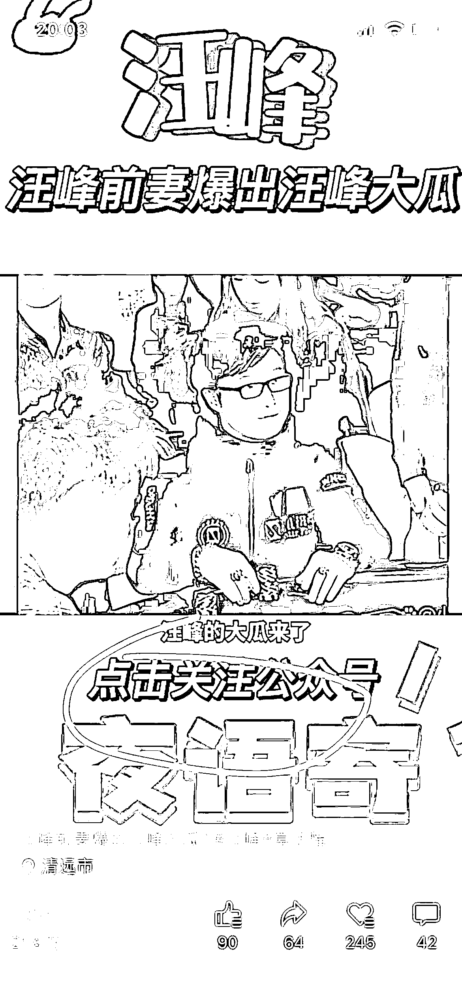
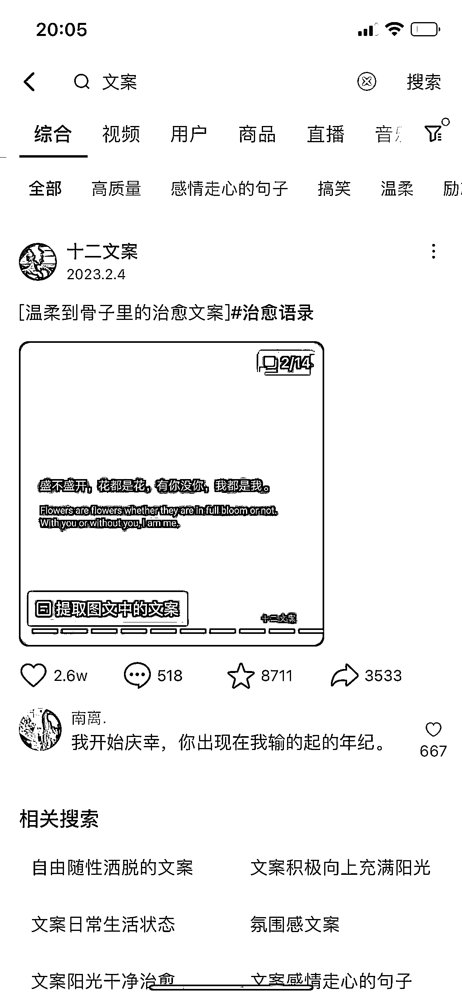
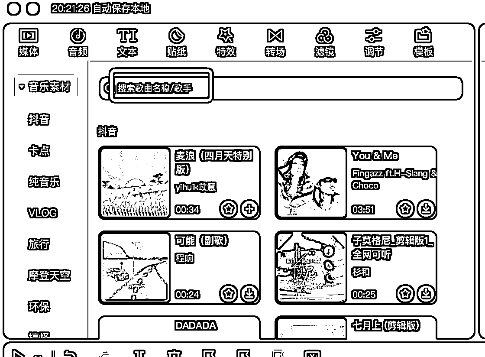
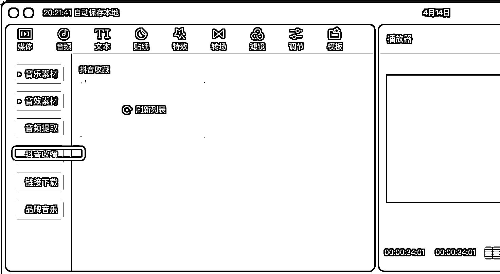
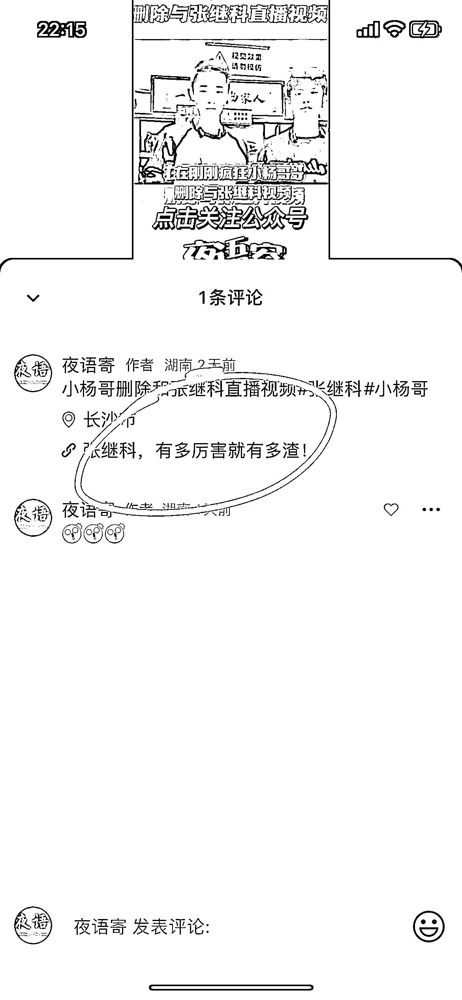
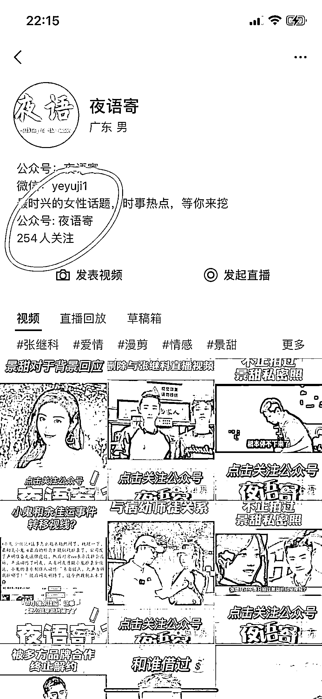

# 《视频号引流的逻辑复盘：10W+ 浏览量，半个月内迅速起号》

> 原文：[`www.yuque.com/for_lazy/thfiu8/gwp6soltc0px65qe`](https://www.yuque.com/for_lazy/thfiu8/gwp6soltc0px65qe)

<ne-h2 id="616edc8e" data-lake-id="616edc8e"><ne-heading-ext><ne-heading-anchor></ne-heading-anchor><ne-heading-fold></ne-heading-fold></ne-heading-ext><ne-heading-content><ne-text id="uc889a90d">(32 赞)《视频号引流的逻辑复盘：10W+ 浏览量，半个月内迅速起号》</ne-text></ne-heading-content></ne-h2> <ne-p id="u5cd52c6a" data-lake-id="u5cd52c6a"><ne-text id="u94c24b5d">作者： 辰风</ne-text></ne-p> <ne-p id="u6a9d60bb" data-lake-id="u6a9d60bb"><ne-text id="u59b0fc50">日期：2023-04-17</ne-text></ne-p> <ne-h3 id="5dfa1d88" data-lake-id="5dfa1d88"><ne-heading-ext><ne-heading-anchor></ne-heading-anchor><ne-heading-fold></ne-heading-fold></ne-heading-ext><ne-heading-content><ne-text id="ub12c8814">一、为什么要用视频号导流</ne-text></ne-heading-content></ne-h3> <ne-p id="u9f76c6b1" data-lake-id="u9f76c6b1"><ne-text id="u46bb8329">视频号的日活用户还是蛮多的，从视频号的运营动作来看，腾讯也是在大力推广短视频内容，因为它是单独给视频号一个接口的，就挂在朋友圈的下面，所以说它的曝光量和用户基数还是蛮大的。</ne-text></ne-p> <ne-p id="u4dc09851" data-lake-id="u4dc09851"><ne-text id="uf5d92eed">因为背靠聊天 APP，很多人会直接通过朋友圈这边的端口去浏览视频号的内容，所以说它的流量很大。</ne-text></ne-p> <ne-p id="u235a57e1" data-lake-id="u235a57e1"><ne-text id="ua87eef73">相对于抖音来说，抖音是属于第三方平台，你要通过抖音引流，再引流到你的公众号，其实是有很多用户都在流失的，但是你直接通过微信平台去做引流。</ne-text></ne-p> <ne-p id="u211ac8f1" data-lake-id="u211ac8f1"><ne-text id="u81feebf4" ne-bold="true">第一，他不属于第三方，微信是默许这种行为的，所以你可以实现导流;第二，跳转更方便，用户的转化效率也会更快，转化效果也会更好。</ne-text></ne-p> <ne-p id="u014e9c1d" data-lake-id="u014e9c1d"><ne-text id="u86c10d67">像我们的视频号，就是直接在我们的视频的图片里面加入了引导关注公众号的这样的字样，来吸引读者的注意力，让他们能够留意去关注我们的账号。</ne-text></ne-p> <ne-p id="u019d4c5f" data-lake-id="u019d4c5f"><ne-card data-card-name="image" data-card-type="inline" id="gfy2Q" data-event-boundary="card"></ne-card></ne-p> <ne-p id="udde810ac" data-lake-id="udde810ac"><ne-text id="ua18ee6d1">你可以在视频号直接做直播,去带货，或者直接给你的账号带流量，增加曝光度，增加活跃度。</ne-text></ne-p> <ne-p id="u5390032b" data-lake-id="u5390032b"><ne-text id="u154023cf">现在视频号也推出了一个广告分成计划，类似于公众号的流量主，也相当于是在分割公众号的一部分流量。</ne-text></ne-p> <ne-p id="u2b396d3f" data-lake-id="u2b396d3f"><ne-card data-card-name="image" data-card-type="inline" id="xPAsm" data-event-boundary="card"></ne-card></ne-p> <ne-p id="u2a3e5d52" data-lake-id="u2a3e5d52"><ne-text id="u1cafc404" style="background-color: rgb(255, 233, 40); color: rgb(216, 57, 49);">直接通过视频号，也可以实现变现。</ne-text></ne-p> <ne-h3 id="9e559003" data-lake-id="9e559003"><ne-heading-ext><ne-heading-anchor></ne-heading-anchor><ne-heading-fold></ne-heading-fold></ne-heading-ext><ne-heading-content><ne-text id="u3a700dc7" style="background-color: rgb(255, 255, 255); color: rgb(47, 48, 52);">二、前期准备</ne-text></ne-heading-content></ne-h3> <ne-h4 id="9039450f" data-lake-id="9039450f"><ne-heading-ext><ne-heading-anchor></ne-heading-anchor><ne-heading-fold></ne-heading-fold></ne-heading-ext> <ne-heading-content></ne-heading-content></ne-h4> <ne-h4 id="fee436e1" data-lake-id="fee436e1"><ne-heading-ext><ne-heading-anchor></ne-heading-anchor><ne-heading-fold></ne-heading-fold></ne-heading-ext><ne-heading-content><ne-text id="u732c031e" style="background-color: rgb(255, 255, 255); color: rgb(47, 48, 52);">1.文案</ne-text></ne-heading-content></ne-h4> <ne-p id="u7ddb5712" data-lake-id="u7ddb5712"><ne-text id="u07d5a4f7">对标抖音（视频号）w 赞爆款文案，直接复制搬运</ne-text></ne-p> <ne-p id="u0b5f762c" data-lake-id="u0b5f762c"><ne-text id="ub79a29d6">根据年龄群体，选择相应的文案（25-30 岁群体，鸡汤文案，暖心文案可以尝试）</ne-text></ne-p> <ne-p id="u002105f7" data-lake-id="u002105f7"><ne-card data-card-name="image" data-card-type="inline" id="PP6xi" data-event-boundary="card"></ne-card></ne-p> <ne-p id="u6259ce08" data-lake-id="u6259ce08"><ne-text id="u327e9ccc">像我的话，我就是属于比较偷懒的那种类型，然后也没有用很多软件去找文案或者怎么样，就直接很暴力的去找，通过一些关键词的检索，去抖音，还有视频号刷文案类的相关内容，然后把这些文字直接挪过来，然后自己拿过来用。</ne-text></ne-p> <ne-p id="u5e237d0f" data-lake-id="u5e237d0f"><ne-card data-card-name="image" data-card-type="inline" id="YVW2V" data-event-boundary="card"></ne-card></ne-p> <ne-p id="ufb6deef7" data-lake-id="ufb6deef7"><ne-text id="u4423be69">有句话说爆款就是相似的，就是说你这个文案，你在抖音上能够火起来，你在视频号也有可能能够火起来，包括你在视频号里火过的内容，它还是有市场的。</ne-text></ne-p> <ne-p id="u0197e6ff" data-lake-id="u0197e6ff"><ne-text id="ub8729186">上面这个视频，他其实没有发几个视频，而且他的视频的形式也很简单，就是一个聊天记录的截图，它主要的特点就是他的文案很好，然后他的音乐和他的剪辑转场的效果非常的带感，就尤其适合那种深夜很 emo 的那种人，他情绪一上来，然后他看到这个文案，他就会狠狠地共情到。</ne-text></ne-p> <ne-h4 id="ecbb4965" data-lake-id="ecbb4965"><ne-heading-ext><ne-heading-anchor></ne-heading-anchor><ne-heading-fold></ne-heading-fold></ne-heading-ext><ne-heading-content><ne-text id="u07c943a1" style="background-color: rgb(255, 255, 255); color: rgb(47, 48, 52);">2.剪辑能力</ne-text></ne-heading-content></ne-h4> <ne-p id="ud5eaab05" data-lake-id="ud5eaab05"><ne-text id="u79030374">剪映学，这个没啥好讲的，剪映很基础，小白就能上手。</ne-text></ne-p> <ne-h4 id="9039450f-1" data-lake-id="9039450f-1"><ne-heading-ext><ne-heading-anchor></ne-heading-anchor><ne-heading-fold></ne-heading-fold></ne-heading-ext> <ne-heading-content></ne-heading-content></ne-h4> <ne-h4 id="96369e93" data-lake-id="96369e93"><ne-heading-ext><ne-heading-anchor></ne-heading-anchor><ne-heading-fold></ne-heading-fold></ne-heading-ext><ne-heading-content><ne-text id="ua2eb1245" style="background-color: rgb(255, 255, 255); color: rgb(47, 48, 52);">3.视频加工处理</ne-text></ne-heading-content></ne-h4> <ne-p id="u0714208e" data-lake-id="u0714208e"><ne-text id="uc6c7af5b">要准备多段视频素材（3-4 段），做视频混剪，加 bgm，加转场，或者加背景图。</ne-text></ne-p> <ne-p id="u1f40114e" data-lake-id="u1f40114e"><ne-text id="u81a0743f">视频时长：15-18 秒左右最好。</ne-text></ne-p> <ne-p id="u94819d91" data-lake-id="u94819d91"><ne-text id="u0cde1b9b">做这种文案号，它的要求其实不高，但是你要去很用心的去模仿，去参考那些很火的那种文案，它的特点就是你的音乐一定要找好，然后你的文案一定要能够共情。</ne-text></ne-p> <ne-p id="u37cde57a" data-lake-id="u37cde57a"><ne-text id="u8510cdca">如果你这个文案不好或者你这个音乐找的不好，可能别人就不会关注过来，这个看上去感觉很简单，但是实际上操作还是需要去总结一些经验。比如说你要大量的去看一些文案，知道大家对什么样的文案会感兴趣，或者说大家会是被什么样的文案共情，然后我们去模仿他们的文案或者我们把这些爆款的文案直接拿过来。</ne-text></ne-p> <ne-p id="u2e3ea967" data-lake-id="u2e3ea967"><ne-text id="u4de9bea7">一个十几秒的视频，可能你花个半小时、一小时能够做出来，但同样也可能要把它做好，要半天甚至一天都有可能。</ne-text></ne-p> <ne-p id="ue80a0bd4" data-lake-id="ue80a0bd4"><ne-text id="ud755fc14">像我给公司做剪辑视频，我们的视频也是一般就是 10 多秒、20 多秒，但是有可能我找素材要找一个礼拜的时间才能够找到一些好的图片，再加上找音乐，然后去设计这个剪辑的转场，还有效果，可能还是要花一些时间才能够把这个视频打磨的特别好.</ne-text></ne-p> <ne-h3 id="26442cdd" data-lake-id="26442cdd"><ne-heading-ext><ne-heading-anchor></ne-heading-anchor><ne-heading-fold></ne-heading-fold></ne-heading-ext><ne-heading-content><ne-text id="u58b12b0a" style="background-color: rgb(255, 255, 255); color: rgb(47, 48, 52);">三、视频号的方向</ne-text></ne-heading-content></ne-h3> <ne-p id="ufddbedc2" data-lake-id="ufddbedc2"><ne-text id="uf8658611">可以从几个方向着手，一种是聊天记录类型的，一种是娱乐号剪辑，还有那种比较大众化的，就是情感文案，直接去抖音，对标爆款那种几万赞十几万赞的那种文案拿过来，包括音频可以直接提取，然后把他们转化一下，变成你自己的内容，然后去发。</ne-text></ne-p> <ne-p id="u2dbac95a" data-lake-id="u2dbac95a"><ne-text id="ua1c2c447">做情感文案这种是很容易成为爆款的，而且这种的话跟情感号的定位很匹配。</ne-text></ne-p> <ne-p id="u2136b5b1" data-lake-id="u2136b5b1"><ne-text id="ua260d716">因为大家是很容易被这种文案情绪所带动的。</ne-text></ne-p> <ne-p id="ue82b61ef" data-lake-id="ue82b61ef"><ne-text id="u609578cc">所以说你可以结合自己的账号定位去选择相应的文案，直接对标抖音上面的那些爆款的文案，包括配音可以直接拿回来使用，然后再用动漫作品去做混剪。</ne-text></ne-p> <ne-p id="u7fe31805" data-lake-id="u7fe31805"><ne-text id="ufdb8b4a4">其实这个在剪映上面很好学的，你先把那些素材先直接弄下来，去水印，然后依次排列去设计音乐的卡点，然后再加字幕文案，把配音再放上去就好了。</ne-text></ne-p> <ne-p id="u8bc24ff1" data-lake-id="u8bc24ff1"><ne-text id="u566fef72">包括卡点，这个在抖音的音频里也是可以设置自动卡点的，把相应的图片进行调整，拖拽一下就好。</ne-text></ne-p> <ne-p id="u7633db87" data-lake-id="u7633db87"><ne-card data-card-name="image" data-card-type="inline" id="CmCSX" data-event-boundary="card"></ne-card></ne-p> <ne-p id="u3deddfd1" data-lake-id="u3deddfd1"><ne-text id="ud970bb9d">音频可以用它自带的，可以在他这个搜索框里搜索，然后你可以设置卡点，卡点分为两种，一种是手动卡点，一种是自动卡点，自动卡点它有两种节奏，一种节奏就是间隔比较短的，一种就是间隔比较长，可以结合你这个视频素材，你选择相应的卡点。手动卡点的用于情况就是你这个音乐是外部音乐，它就无法实现自动卡点，必须手动来进行卡点。</ne-text></ne-p> <ne-p id="u93a1c0b5" data-lake-id="u93a1c0b5"><ne-text id="u143f7678">要想用抖音自带的音乐有两种方式，一种方式就是直接在这个 APP 里面搜索，另一种方式是在你的手机端搜索这个音乐的名字，然后把它收藏，然后你就可以在网页端打开了。</ne-text></ne-p> <ne-p id="u677b1c92" data-lake-id="u677b1c92"><ne-card data-card-name="image" data-card-type="inline" id="CooIQ" data-event-boundary="card"></ne-card></ne-p> <ne-p id="uece05419" data-lake-id="uece05419"><ne-card data-card-name="image" data-card-type="inline" id="unWPG" data-event-boundary="card"></ne-card></ne-p> <ne-p id="uba52ef75" data-lake-id="uba52ef75"><ne-text id="u3150969d">他这个音乐是有一点 bug 的，有时候你在这个网页端可能搜不到，但是你在手机抖音上面你可以搜到音乐，如果这两种方式都不行，那就可能你必须去通过其他的方式来下载音乐了，或者通过分离音频的方式，然后再手动卡点。</ne-text></ne-p> <ne-p id="ub1f89b76" data-lake-id="ub1f89b76"><ne-text id="u40011415">注意：音乐，文案至关重要，少一个都不行。</ne-text></ne-p> <ne-p id="u06ab3cc8" data-lake-id="u06ab3cc8"><ne-text id="u88487168">一个视频能火有可能是因为文案好，吸引人，也有可能是因为视频音乐好，bgm 吸引人。</ne-text></ne-p> <ne-h3 id="9039450f-2" data-lake-id="9039450f-2"><ne-heading-ext><ne-heading-anchor></ne-heading-anchor><ne-heading-fold></ne-heading-fold></ne-heading-ext> <ne-heading-content></ne-heading-content></ne-h3> <ne-h3 id="23619eca" data-lake-id="23619eca"><ne-heading-ext><ne-heading-anchor></ne-heading-anchor><ne-heading-fold></ne-heading-fold></ne-heading-ext><ne-heading-content><ne-text id="u6f749c88" style="background-color: rgb(255, 255, 255); color: rgb(47, 48, 52);">四、如何实现导流</ne-text></ne-heading-content></ne-h3> <ne-p id="ub7bfaddb" data-lake-id="ub7bfaddb"><ne-text id="uf9e38ae8">你的视频号要跟公众号要绑定，必须是同一个微信管理员，也就是用你这个微信注册的公众号，同时是你这个微信的视频号，才能够实现绑定和互通，暂时其他的微信好像不可以。</ne-text></ne-p> <ne-p id="u0ef45852" data-lake-id="u0ef45852"><ne-text id="ue2003a4b">你绑定了之后的好处就是可以在公众号和视频号之间实现互相跳转。</ne-text></ne-p> <ne-p id="ue403b277" data-lake-id="ue403b277"><ne-card data-card-name="image" data-card-type="inline" id="rbpNG" data-event-boundary="card"></ne-card></ne-p> <ne-p id="u017c35f1" data-lake-id="u017c35f1"><ne-text id="ucdbf2d2f">另外，在这个原文链接里就放你公众号的文章链接，可以直接给你的公众号带流量，如果你的内容质量 OK，别人也可以关注到你的公众号上面来.</ne-text></ne-p> <ne-p id="u3a6c657c" data-lake-id="u3a6c657c"><ne-card data-card-name="image" data-card-type="inline" id="Iczu2" data-event-boundary="card"></ne-card></ne-p> <ne-h1 id="9039450f-3" data-lake-id="9039450f-3"><ne-heading-ext><ne-heading-anchor></ne-heading-anchor><ne-heading-fold></ne-heading-fold></ne-heading-ext> <ne-heading-content></ne-heading-content></ne-h1> <ne-p id="uc5f7731a" data-lake-id="uc5f7731a"><ne-text id="u1a5a0a5d">还有一个好处就是视频号它也是算入微信指数的，你的视频号发布内容跟公众号的内容其实它是互通的，所以说它会增加你这个账号的权重，微信指数也会得到相应的提升。</ne-text></ne-p> <ne-p id="ue921884c" data-lake-id="ue921884c"><ne-text id="u3f8a553f">你的位置排名相对来说也会更加靠前。</ne-text></ne-p> <ne-p id="u3d3280d0" data-lake-id="u3d3280d0"><ne-card data-card-name="image" data-card-type="inline" id="ohaEj" data-event-boundary="card"></ne-card></ne-p> <ne-h3 id="786e47b0" data-lake-id="786e47b0"><ne-heading-ext><ne-heading-anchor></ne-heading-anchor><ne-heading-fold></ne-heading-fold></ne-heading-ext><ne-heading-content><ne-text id="u2c02d1b3" style="background-color: rgb(255, 255, 255); color: rgb(47, 48, 52);">五、如何找素材</ne-text></ne-heading-content></ne-h3> <ne-p id="u5589bbea" data-lake-id="u5589bbea"><ne-text id="u3bbef0c5">一般做视频的话，找素材是比较难找的，要么是自己拍，要么你去找外网的视频素材，这个有一定难度。</ne-text></ne-p> <ne-p id="u00c1ae33" data-lake-id="u00c1ae33"><ne-text id="uac7f67ec">最好的办法，就是直接搬运，搬运聊天记录图（微博），搬运视频去水印（微信小程序，搜：去水印），bilibili 直接下载（做动漫剪辑，影视剧剪辑）</ne-text></ne-p> <ne-p id="u9a3aa64a" data-lake-id="u9a3aa64a"><ne-text id="ud128a69f" ne-underline="true">最慢的方式：下载视频，利用格式工厂转变成 mp4 格式，或者进行录屏。</ne-text></ne-p> <ne-p id="ua8e032fc" data-lake-id="ua8e032fc"><ne-text id="ua03eb05a">视频内容，我之前的想法就是做聊天记录的，还有做那种表情包的，或者做真人口播的，或者做生活 vlog 拍摄当背景，然后口播的，这几种类型我觉得都可以去尝试。</ne-text></ne-p> <ne-p id="ua27654e4" data-lake-id="ua27654e4"><ne-text id="u25840dd5">同时，可以去运营视频的多平台，这一个视频做好之后，可以各个平台都去尝试一下，抖音，快手，还有今日头条，小红书这些平台都可以去尝试，在那之前要把这些账号都设置好，昵称、头像这些要统一，然后包括你的简介这些要写好。</ne-text></ne-p> <ne-p id="u004fb3c1" data-lake-id="u004fb3c1"><ne-text id="u982a8e7c">一方面多平台曝光获得收益，提升账号曝光度；后期通过设钩子，软植入广告，来进行公众号导流</ne-text></ne-p> <ne-h3 id="8f68e2bf" data-lake-id="8f68e2bf"><ne-heading-ext><ne-heading-anchor></ne-heading-anchor><ne-heading-fold></ne-heading-fold></ne-heading-ext><ne-heading-content><ne-text id="u3f3582db" style="background-color: rgb(255, 255, 255); color: rgb(47, 48, 52);">补充：</ne-text></ne-heading-content></ne-h3> <ne-p id="u7f9c787a" data-lake-id="u7f9c787a"><ne-text id="ueef46789">1.提升原创的几个办法，第一个就是，多用几段素材来拼凑，做一些相应的剪辑；加一些转场效果；加外边框背景，换音乐 bgm（多段 bgm)</ne-text></ne-p> <ne-p id="ufc5a8c14" data-lake-id="ufc5a8c14"><ne-text id="u731b28bf">2.微信它会压缩视频，你如果要通过微信来传的话，要存压缩包，再用电脑去上传视频到视频号，不然像素会受影响，QQ 的话好像不会有这个问题，但是视频这些会上传的很慢，大家可以找找看有没有比较好用的工具。</ne-text></ne-p> <ne-p id="u9f9ae20a" data-lake-id="u9f9ae20a"><ne-text id="u5d1a4a37">3.音画要同步</ne-text></ne-p> <ne-p id="uc24c5c3e" data-lake-id="uc24c5c3e"><ne-text id="uecc4da54">4.运营实用工具（本处引自网络）</ne-text></ne-p> <ne-oli index-type="0"><ne-oli-i>1</ne-oli-i><ne-oli-c class="ne-oli-content" id="ue3410b50" data-lake-id="ue3410b50"><ne-text id="ub751b8cd">手机端图片处理：Snapseed、vsco、美图秀秀（上面的消除笔功能很实用）</ne-text></ne-oli-c></ne-oli> <ne-oli index-type="0"><ne-oli-i>2</ne-oli-i><ne-oli-c class="ne-oli-content" id="udea98c64" data-lake-id="udea98c64"><ne-text id="ua73e73d8">手机端剪辑 APP：VUE、快剪辑、大片、inshot、videoleap</ne-text></ne-oli-c></ne-oli> <ne-oli index-type="0"><ne-oli-i>3</ne-oli-i><ne-oli-c class="ne-oli-content" id="u9fe90ff8" data-lake-id="u9fe90ff8"><ne-text id="ub1a675b0">手机端音频工具：讯飞、讯飞听见（可语音转文字）</ne-text></ne-oli-c></ne-oli> <ne-oli index-type="0"><ne-oli-i>4</ne-oli-i><ne-oli-c class="ne-oli-content" id="uc2baa420" data-lake-id="uc2baa420"><ne-text id="u394b45f8">电脑端视频剪辑：Pr、Final Cut Pro、爱剪辑</ne-text></ne-oli-c></ne-oli> <ne-oli index-type="0"><ne-oli-i>5</ne-oli-i><ne-oli-c class="ne-oli-content" id="u79174a50" data-lake-id="u79174a50"><ne-text id="u21c96b32">海报/封面图生成：Canva、稿定设计、创客贴、图怪兽</ne-text></ne-oli-c></ne-oli> <ne-oli index-type="0"><ne-oli-i>6</ne-oli-i><ne-oli-c class="ne-oli-content" id="ud85cafda" data-lake-id="ud85cafda"><ne-text id="u46f68f4a">笔记类：有道云笔记、印象笔记</ne-text></ne-oli-c></ne-oli> <ne-oli index-type="0"><ne-oli-i>7</ne-oli-i><ne-oli-c class="ne-oli-content" id="u5899d42e" data-lake-id="u5899d42e"><ne-text id="ucdeca115">公众号实用插件：新媒体管家</ne-text></ne-oli-c></ne-oli> <ne-oli index-type="0"><ne-oli-i>8</ne-oli-i><ne-oli-c class="ne-oli-content" id="u1605e19a" data-lake-id="u1605e19a"><ne-text id="ub2f1f373">推兔，多平台视频分发软件</ne-text></ne-oli-c></ne-oli> <ne-hole id="u91132ebd" data-lake-id="u91132ebd"><ne-card data-card-name="hr" data-card-type="block" id="YKUlV" data-event-boundary="card"><ne-p id="ucac7c8a6" data-lake-id="ucac7c8a6"><ne-text id="u54e9997c">评论区：</ne-text></ne-p> <ne-p id="u35800509" data-lake-id="u35800509"><ne-text id="uec83b136">lydia : 就问后续怎么变现？</ne-text> <ne-text id="u97784ccc">乔橘 : 我也想问哈哈</ne-text> <ne-text id="uf706443b">乔橘 : 可以出一份（广告分成计划）的变现分享吗~</ne-text> <ne-text id="u609713d1">辰风 : 这个暂时还没有找到它具体的分成内容</ne-text> <ne-text id="u138147c0">辰风 : 接品牌产品，广告分成，公众号导流接 cpa 广告，直播变现～</ne-text> <ne-text id="ub257fb11">彬🤔 : 现在还可以绑定公众号导流过去吗</ne-text> <ne-text id="ue731e02e">辰风 : 当然</ne-text> <ne-text id="u2b718a7b">坏脾气的小可爱 : 辰风真厉害👍</ne-text></ne-p></ne-card></ne-hole>