# 《谈谈“从 0 粉做到 300w 粉，从月收入 3K 到 10W”的心路历程》

> 原文：[`www.yuque.com/for_lazy/thfiu8/mw575v2cbcrnvel8`](https://www.yuque.com/for_lazy/thfiu8/mw575v2cbcrnvel8)

## (252 赞)《谈谈“从 0 粉做到 300w 粉，从月收入 3K 到 10W”的心路历程》 

作者： 猎音狮（豪叔） 

日期：2023-05-04 

大家好，我是猎音狮，之前发过一篇[《图书类目短视频投流带货，我是如何月入 10w＋的？》](https://t.zsxq.com/0d2QVMLub)的文章，点赞 200＋，得到广大圈友的垂青，倍感荣幸，有一种受宠若惊的感觉，同时也与不少圈友产生了链接，也跟圈友私信交流了一些具体操作方面的问题，由于消息有点多，回复可能很仓促，望谅解！（鞠躬） 

 

（截图是 4 月份抖音收益，没算视频号和快手的，收益大头主要在抖音，55w GMV 只有 12w 是因为有些品佣金线下结算了） 

今天这篇帖子，不谈结果，我就来谈谈我从“从0 粉做到百万粉，从月收入3K到10W”的一些心路历程（一直都是自己一个人在搞，没工作室，也没团队，既是文案、摄影、剪辑、投手，同时也是运营，所以熟悉整个闭环），写这篇稿子，为了能更清楚的把我的经历与经验呈现出来，前前后后差不多用了 12 天时间，与圈友共勉！（抱拳） 

目录 

第一章、起号那些事儿 

    第一节、手写起号 

    第二节、混剪起号 

    第三节、校园一角起号 

    第四节、口播起号 

    第五节、100w＋播放的视频是怎样做成的 

第二章、曲折的“变现”路 

    第一节、A4 书单（2019 年） 

    第二节、笔记书单（2021） 

    第三节、讲座书单（2022 年） 

    第四节、划线书单（2023） 

    第五节、真人出镜（2023 年） 

第三章、当“流量”爱上“金钱” 

    第一节、选品 

    第二节、柔情似水的“随心推” 

    第三节、放荡不羁的“千川” 

———我是一条分割线—— 

以下是我入坑互联网8 年沉淀下来的东西，都是自己一点点总结的，希望看完对您有所帮助！ 

文章字数：10241 字 

文章时长：阅读完大概需要 60 分钟 

完稿用时：12 天 

## 第一章、起号那些事儿 

## 第一节、手写起号 

顾名思义，就是通过手写内容，再用镜头拍下来，发到抖音，此类视频控制在 4-7s，由于时间短，文字内容多，容易提高完播率，比如视频 7s，进来的人看完视频平均花费 14s，完播率就是 200%，大家都知道，完播率高的视频，是很容易被系统推荐的，对不对？看到这里，是不是突然觉得自己掌控了流量密码？ 

此种模式适合职场（手写辞职信等）；情感（手写情书、情话、情诗等）；教育（手写学生作文、日记、试卷等）…………（更多赛道可以举一反三） 

eg1：情感号手写起号（案例节选本人实操） 

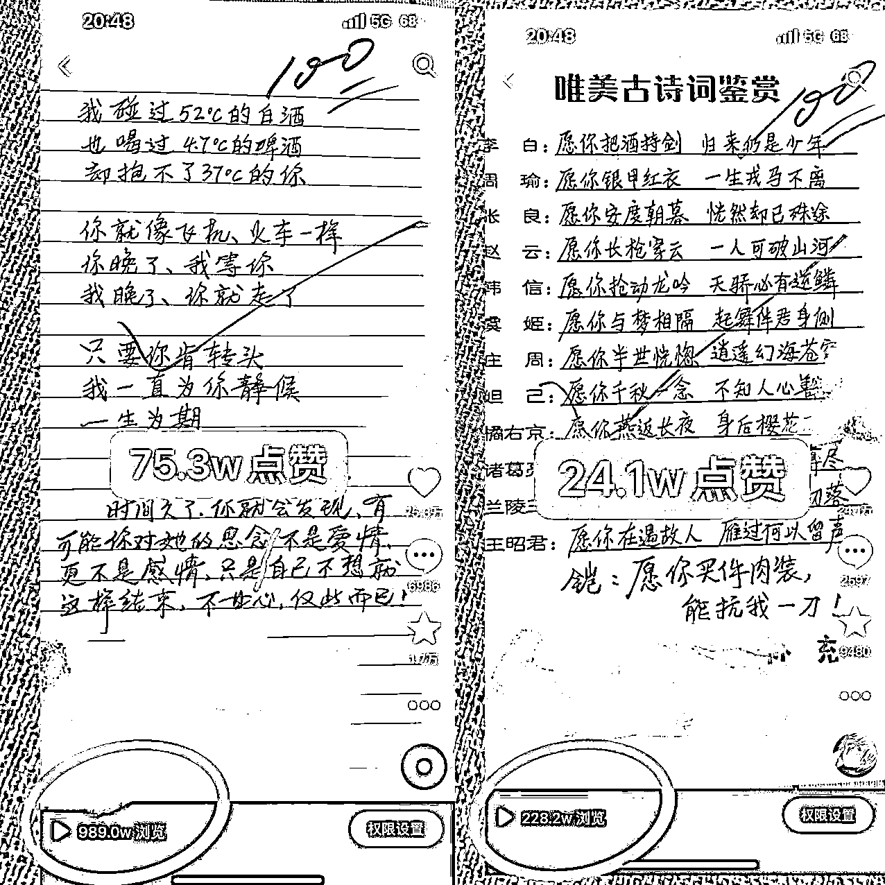  

  

eg2：教育号手写起号（案例节选本人实操） 

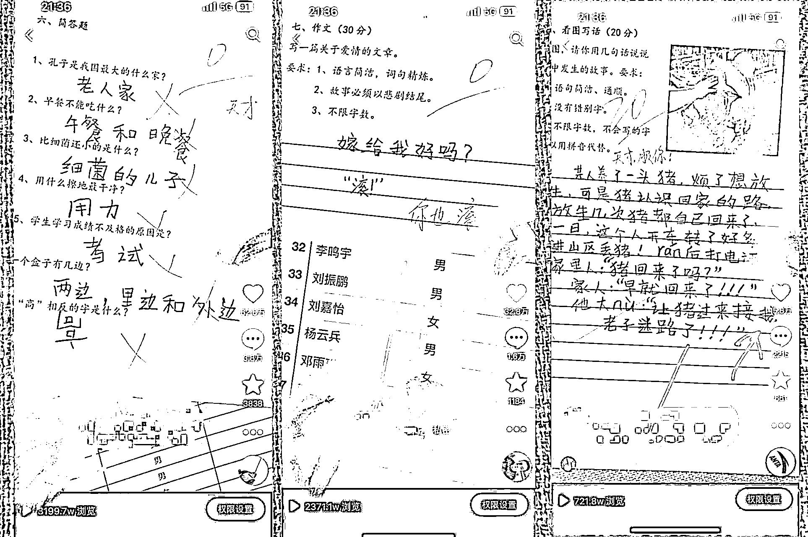 

 

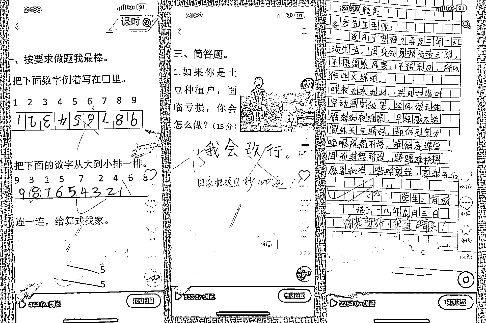 

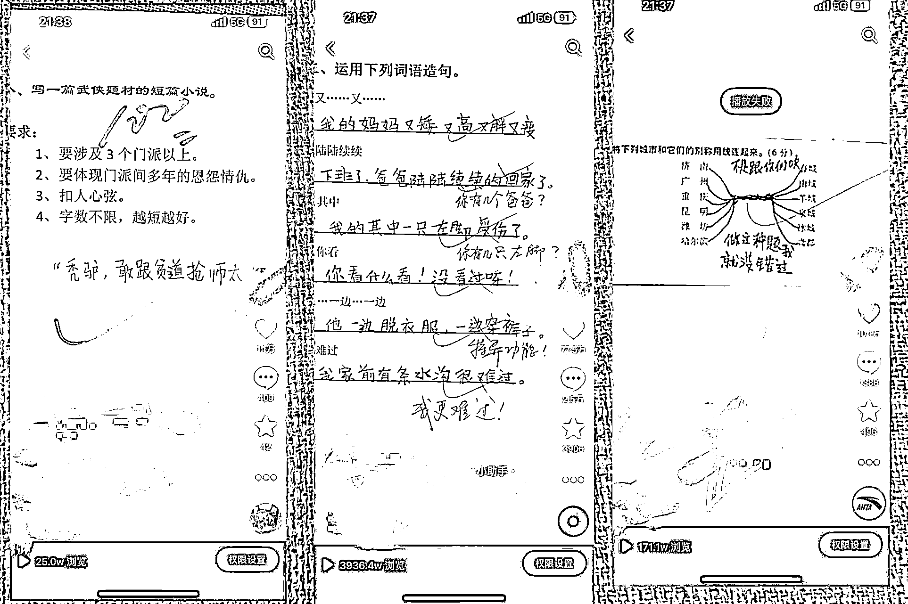 

学习本来就是一个很枯燥的事情，所以这里为了给大家提提神，笑一笑，笑完以后，不要忘了流量背后的底层逻辑：搞笑、有趣、有料、有才……   

怎么样，是不是距离解锁流量密码又近了一步？思路是不是一下子就打开了？ 

第二节、混剪起号 

混剪起号，这个大家都很熟悉，就是把一些别人的爆款素材拿来二次创作，混剪爆过的素材，爆率更高，同时也是效益很高的一种起号方式之一。 

所以，深受广大创作者的喜爱，但是唯一一个缺点就是去重没做好，就容易违规，去重这都是老生常谈了，但是对于新手来说，可能一头雾水，我就简单放个思维导图在下面吧： 

1、抖音查重原理 

不但知其然，还要知其所以然，我们来看看抖音是怎么查重的。 

  

2、去重技术 

上有规则，下有对策，我们只要把视频改了，避开机器查到就行，以下 7 步操作，就可以把算法也搞懵逼！ 

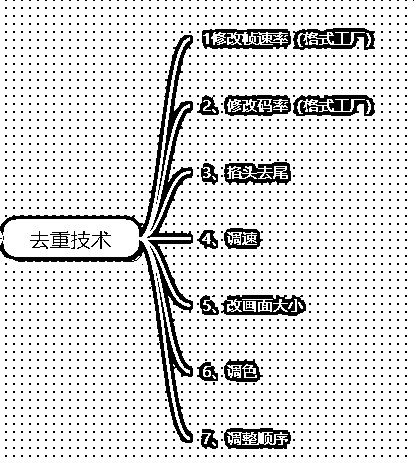 

3、补充：螺旋算法，漏斗转化，叠加推荐 

A. 非挂车视频评判维度： 

 

B. 挂车视频评判维度： 

 

这就回答了大家问的比较多的挂车流量少的原因。那么挂车视频如何增加流量呢？如下： 

 

第三节、校园一角起号 

这种模式成本也比较低，就是去学校门口，或者学校里面，拍一些镜头，回来在视频上贴上文案，做成 7s 的视频，配上热门音乐发布即可。如果你在北京，可以去拍一些清华北大的，不火都不行！但是这个模式可能会原创度低，所以就提一嘴，具体我就不讲了。主要聊聊第四节的口播、真人起号！ 

第四节、口播起号 

所谓的真人出镜，口播，就是把文案写好，在用剪映提词器录下来就行。这些大家都会，我就不说了，不会的百度或者抖音能搜到哈，我主要给大家讲一些网上搜不到的东西，这样的才会有价值！ 

1、文案 

A、抖音里有很爆的图文（不要抄视频，容易处罚非原创，抄图文拿来口播，你顶多算伪原创，不会被判），你可以直接拿来读一遍发，爆率 70%以上。 

B、小红书找笔记，跟你相关类目的爆款笔记，拿来对着镜头巴拉巴拉读一遍，爆率也很高。 

2、蹭热点 

A、每天关注热榜，除了社会新闻，只要跟你类目相关的内容，都可以拿来蹭。 

B、还有就是官方活动页不要错过，官方举办的活动，都是有官方投流扶持的！可以白嫖一波！ 

△ 3、真人出镜口播注意事项 

A、关于基础质量： 

清晰稳定、曝光正常、播放流畅、配音不嘈杂、不要遮挡关键信息； 

B、关于时长和画幅： 

30-90s 为宜，节奏明快不拖沓，前 5 秒直接阐述视频的核心重点； 

C、关于视频内容： 

内容真实、需要加字幕。 

D、关于视频营销感： 

挂车视频不要在主体内容中过度强调优惠信息，建议可通过购物车透传更多商品优惠信息！ 

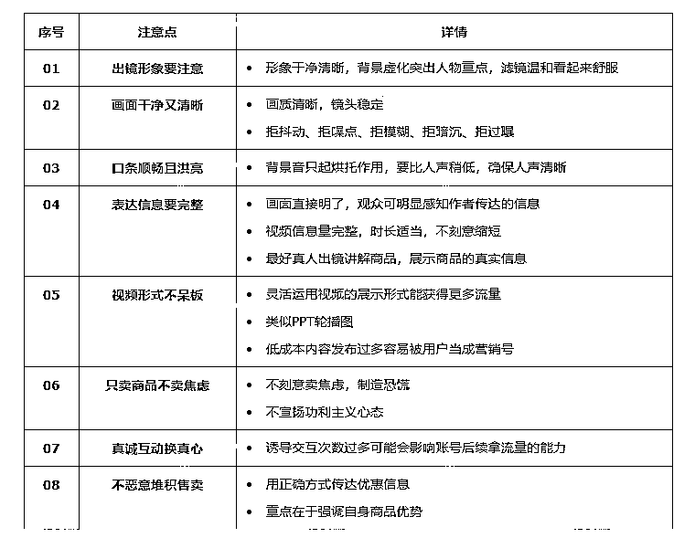 

第五节、100w＋播放的视频是怎样做成的 

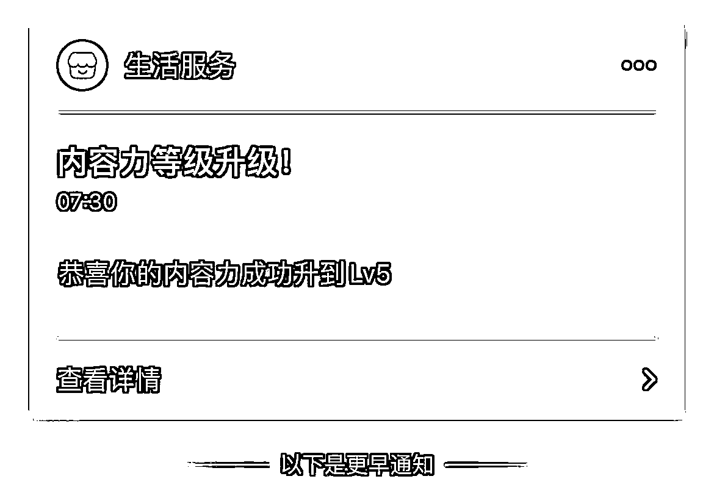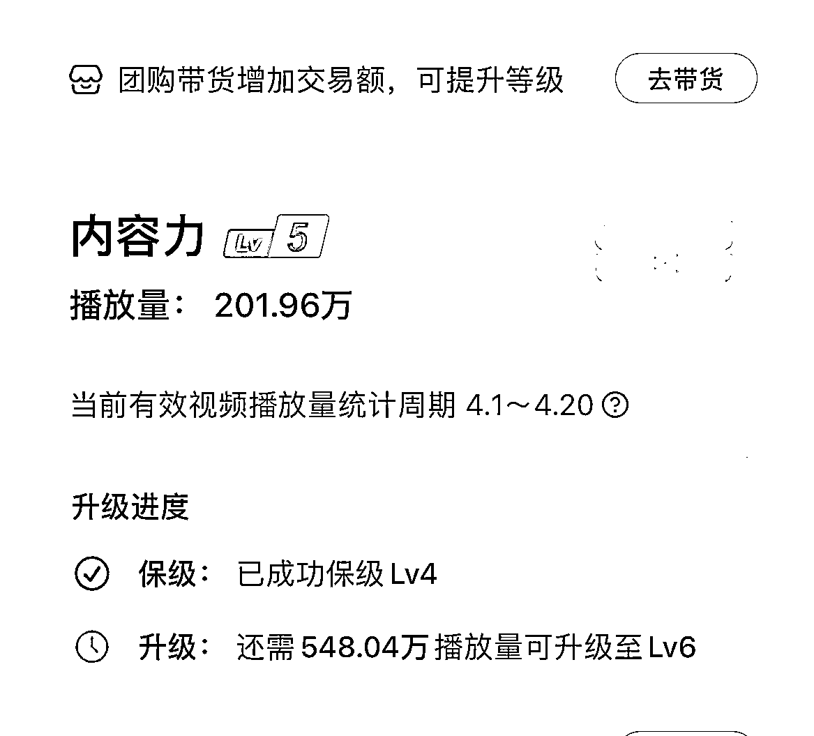 

1、制作爆款视频的 5 种思维 

A、热点思维 

 

B、利他思维 

 

C、发散思维 

 

D、创造性思维 

 

E、复盘思维 

 

2、爆款带货短视频具有传播性的六大底层逻辑 

 

3、抖音官方“透露”的热门技巧 

为什么是官方“透露”，不是噱头，也不是标题党，因为这确实是我跟 抖音官方工作人员一起打磨爆款视频时的交流内容，我总结如下： 

A、出圈效应 

 

B、如何让用户感兴趣 

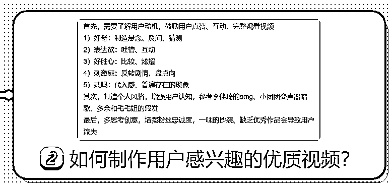 

C、视频发布相关建议 

 

## 第二章、曲折的“变现”路 

### 第一节、A4 书单（2019 年） 

顾名思义，A4 书单就是用一张 A4 纸打印几句文案，然后在那“丢”书，都不叫翻书，而是叫“丢”书，丢丢就火，都不用翻开，你就说气不气人。 

有同行用这种视频，一个视频就赚 50w 佣金！那时候可把我羡慕坏了，我知道的时候，玩的人多了，所以赚了几千块钱，从那以后，我就深深体会到了信息差是有多么的值钱。 

都说真传一句话，假传万卷书，真正能赚钱的项目，都是大道至简，几句话的事情，有可能大佬透露两个字，一个字，你就能轻松赚个几 w！甚至几十 w！ 

eg：A4 书单（素材来源于同行） 

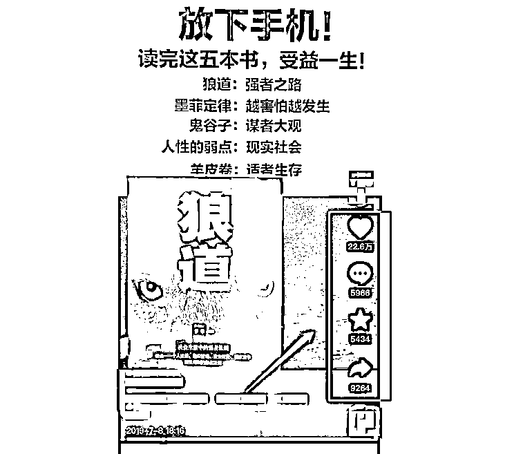、 

### 第二节、笔记书单（2021） 

同理，笔记书单，就是把内容以笔记的方式呈现，加上创意剪辑，从而激起用户购买欲的一种内容表现形式。 

直接上案例： 

eg：笔记书单（素材本人实操，自然流 ） 

 

### 第三节、讲座书单（2022 年） 

这个大家应该都见到过，细分还有 中国教授书单，老外书单，大学生讲座书单，家长会家长发言书单 …… 

玩法也是骚得很，哈哈哈哈嗝！ 

去年很火爆，很多人这种模式赚的盆满钵满，这块我没实操，就不过多提了，感兴趣可以私下交流。 

我们主要说一下第四节的划线书单，因为前不久刚火过，最近也是比较火的一种模式，跟风不吃肉，也能喝点汤。 

### 第四节、划线书单（2019——至今都可以玩） 

划线书单都不陌生，很多圈友也在做，但是别人能火，你为什么火不了？ 

因为别人花钱投流了，你没投，就这么简单，至于怎么投流，后面第三章的第一、第二节我会具体分享！ 

还是直接看案例： 

eg：划线书单（素材来源于同行） 

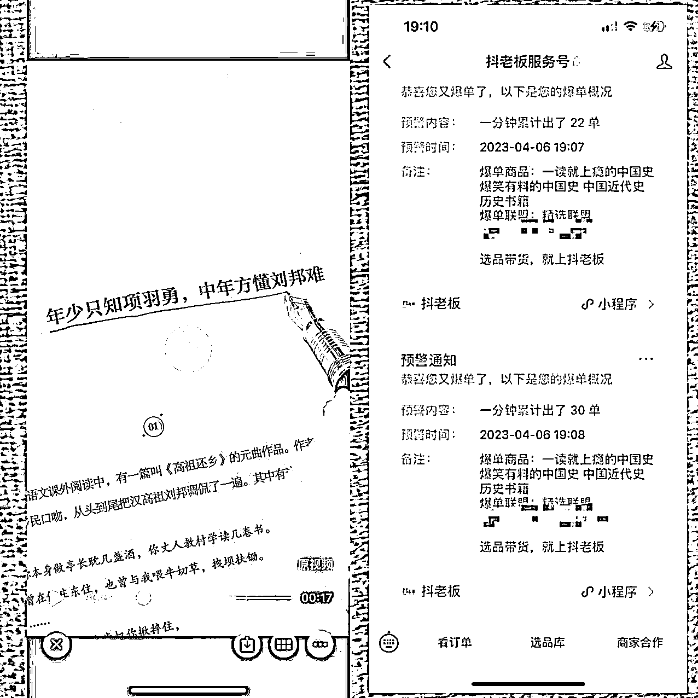 

是不是很简单，一看就会，都没啥好讲的。还是那句话，大道至简，干就完了！ 

###   

### 第五节、真人出镜（2023 年） 

### 1、语言表达 

语言自然流畅，不要拘束、呆板，不然看起来就像是在念稿子，抑扬顿挫的语速，配合上手势，想象成平时跟朋友聊天一样的去说话，这样录出来的视频比较自然。 

赠送 3 个“角色扮演”小技巧： 

A、录制给家长看的视频： 

想象成自己再跟妈妈聊天。 

B、录制给学生看的视频： 

想象成学生犯错了，你把他叫来办公室，跟他谈心。而且跟小学生，初中生，高中生，大学生的语气和口吻也是不一样的！和小学生说话，是不是每句话的最后一个字，你都得拖一下音，就想哄小孩一样！ 

但是你跟大学生这样说，他会觉得浑身鸡皮疙瘩？你要是用错了，把这种口吻用在家长身上，那岂不是就更尴尬了！ 

C、录制气氛紧张的视频： 

想象自己想上厕所，很憋很憋，就想赶快说完去上厕所。 

举一反三……（自己头脑风暴去吧） 

是不是很有意思？这就是角色扮演，真人出镜，他不是对着镜头说话那么简单，而是要把自己当成一个演员！ 

 

### 2、场景布置 

青铜：场景扁平化，后面一排书架，人就坐在书架前录视频，看起来就很压抑、枯燥，影响停留。 

eg：纯书架背景带来的压迫感 

 

王者：会找一个墙角，再稍微放点 绿植、暖光灯、摆件 作为背景稍微装饰一下，使空间瞬间变得有层次感，人物主体更立体。 

eg：书架+墙角组合场景带来的立体感 

 

### 3、布光 

从摄影学的角度来说，打光的时候，能少打就少打，能不打就不打。 

大家经常看直播就会发现，户外的流量都不小，因为户外白天基本都不打光，自然光是最好的光，但是我们室内录制、摄影棚录制，就必须得打光。 

这个灯光仔细讲下去，又有很多东西，好在百度可以搜到解决方案，我们就不具体阐述了！ 

### 4、工具：剪映的“提词器” 

提词器我不建议够买，因为我几十的，几百的都用过，效果不好！直接用【剪映】自带的提词器就 OK 了！ 

 

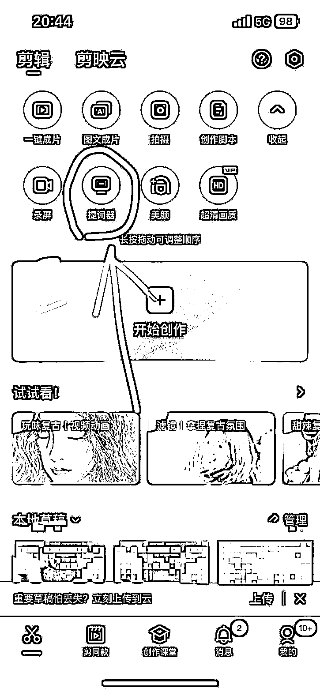 

##   

## 第三章、当“流量”爱上“金钱” 

## 第一节、选品 

1、用 4 个爆单秘籍选品 

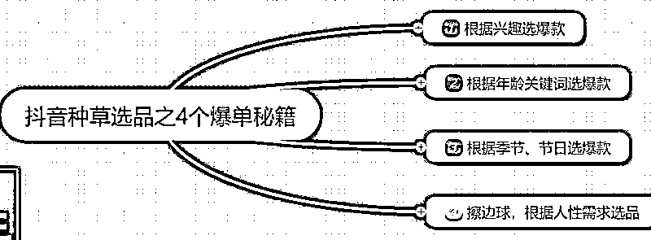 

2、跟爆款视频选品 

抖音—橱窗—往下拉找到创意中心—点进去选择你的赛道 — 通过爆款 视频 锁定  爆品 

 

3、看爆款商品榜单选品 

抖音橱窗 — 选品广场 — 任意找一个商品 有榜单字样的地方 点进去 —— 右上角 更多查看更多榜单 

 

4、选品误区 

其实爆品堆里也是有很多废品的，就是指那些你去投流很难赚钱的品，我们应该怎么去分辨，它们都有什么特征呢？ 

第一种，相关视频里有很多几百万播放量的，这种品不要选，因为别人都报了几百万播放了，转化好肯定会持续投流，抢量你根本就抢不过他。 

第二种，差评好评比大于 6%-8%的不要选，就是用差评的个数除以好评的个数，占比越大说明产品体验越差，不爆单还好，一爆单口碑分直接干废。 

第三种，商家体验分低于 4.8 的慎选！会拉低自己橱窗的口碑分！ 

## 第二节、柔情似水的“随心推” 

### 1、感受随心推的温柔 

为什么用“柔情似水”来形容随心推，因为她比较稳，你只需要每个订单投 100，即时空消，大不了这 100 没了，她不像千川，放量一空消分分钟几千大洋就没了，我开始研究千川，睡了 10 分钟午觉，给我跑了 3k＋，一个月工资就这样分分钟没了，呜呜呜……、 

2、随心推如何建计划？ 

在这里，关于如何建计划我就不具体罗列了，因为我觉得能靠搜索解决的东西，还在这里说，就是在浪费你的时间，也是浪费我的时间。 

顺便提醒一下，如果还没有培养遇到问题先搜索习惯的朋友，从现在开始，就可以把“随心推如何建计划？”在抖音搜索框查一下，有大把的视频教学。 

我想说的，是里面的一些细节，新手不要选“自定义定向投放”，你要相信，抖音机器，比你更懂抖音用户，更懂抖音人群。 

比如说：同一个账号，不同的品，有的品男性够买的多，有的女性够买的多，如果你定向了，定反了，只有两种结果，要么跑不出去，要么跑飞！ 

所以，为什么说投流简单，我之前分享也说过，只要选品没问题，做的素材（视频）没问题，用脚投都可以赚钱，就是这个道理，你就无脑选“系统智能投放”，自动出价，就 ok，甚至出价方式是 按转化目标出价，还是按播放量出价，都不影响，我就看心情，有时候投前者，有时候投后者。 

放个图吧，是不是用脚都会，哈哈！ 

 

随心推投放时长上，就选最长就行，以前是 48 小时，我就选的48 小时，后面改了，抖音最长只给选24 小时了！ 

就像很多人喜欢刨根问底，为什么要选 24 小时？ 

正好我也是喜欢纠根刨底，站在抖音的角度去想这个问题，你就明白了。 

打个比方啊，邻居小明失踪了，他爸爸给你 100 块钱去找他，这个时候是不是跟你给抖音 100 块让它给你找客户是一样的？ 

不管白天黑夜给你 24 小时，那你可以慢慢找，你可以走路去找，后面如果找不到，你把 100 块钱还回去，你也不亏，顶多走路锻炼了一下身体。 

但是如果给你 2 小时，你肯定觉得时间紧任务重，该打车打车，一不小心，这 100 块就花出去了。 

你给抖音的时间少了，算法要给你调用更多的服务器资源，所以帮你找客户的成本就变高了，所以有时候你投 2 小时，跑完了一单也不出就是这个道理！ 

你就给它时间，让它慢慢探索人群，慢慢给你找到精准用户，夜里活跃人群少，它就给你慢慢消耗，白天活跃人群多，它就给你消耗快一些！ 

超过 24 小时找不到客户了，或者找到的不符合你的预期，它会把剩下的退给你！ 

3、随心推新功能，直接投 Roi 

就是在“我希望提升”选项卡选择“商品支付 Roi”，其它操作同上！ 

那么，roi 要填多少呢？这个要根据你的佣金来了，请看如下表格，一般我们佣金线上结算，不要低于保本 roi 就行。 

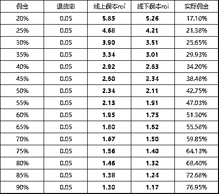 

4、随心推如何在高峰期抢量？ 

高峰期可以手动出价，2 小时，智能推荐，佣金的 1.2 倍开始测出价，如果不能消耗，说明这个品手动出价跑不动。 

手动跑不动，就自动出价跑，但是自动出价只能 24 小时，2 小时很容易亏！ 

如果能消耗，用时 1.2 小时就能消耗 70%，就降低 5%出价，直到测到既能消耗，又盈利的出价，就可以在高峰期批量剪 2 小时的计划出价抢量。 

5、如何利用随心推测千川出价？ 

当随心推消耗一定量后，基本模型已经出来，这个时候可以考虑上千川了，我们也可以通过随心推数据作为参考，计算出一个千川的出价，具体如何操作呢？ 

在抖老板里打开产品详情，如下: 

 

假设这个数据是我用随心推跑的，那么我们需要先计算出平均客单价，为什么要计算平均客单价，因为一个品，有很多个sku，比如有点选项拍下9.9，有的39，有的68，所以我们需要计算出平均出一单，是卖多少钱。 

计算公式：平均客单价=总销售额 ÷ 总订单数 

上面这个品的平均客单价，代入公式，得，39921.20 ÷ 591 = 67.55 

算出平均客单价后，就可以出价了，一般佣金多少直接出多少，比如这个品佣金 50%，就出67.55x50%=33.78 

但是要随时盯着，出这么高价格，是为了过新手期，一般成交 20 笔，就过新手了，过了新手，立马改一个出价，计算公式：原有出价 ÷ 1.2         即 33.78 ÷ 1.2  = 28.15 

得到这个新的出价，用这个出价跑，后期可以根据具体跑的情况做微调，涨价或者砍价！在保证计划能消耗的前提下，怎么能赚钱怎么来！ 

6、随心推=随心亏 

随心推不是一本万利，行业内她有一个绰号叫“随心亏”，没有亏的心态，你就玩不好随心推，尤其是测品的时候，测一个品，小亏则几百，大亏则几 k，要不别人怎么说投流就是“人民币”玩家呢？ 

所以，玩随心推，不要在乎一单两单的亏盈，放好心态：它亏任它亏，流量数据堆，它赚任它赚，定向钻一钻！ 

### 7、问题解答 

这里把大家问的多的问题整理一下： 

#### ①为什么千川计划跑得好好的，突然就不消耗了？ 

有没有人建的计划是这样的，昨天跑的好好的，以为要大爆单了，今天起来一看，突然就不消耗了。 

这里面的原因有很多种，比如说你的账户余额太少了，没有及时充值，再比如说你挂的商品 48 小时发货率低于 70%。 

排除这两个原因，最大的可能就是你的计划竞争力不足，ECPM 值排名靠后，系统就不给你流量了。 

什么意思？就是系统给了你一波流量，出单的结果也出来了，系统就根据你的出单情况重新计算你的 ECPM 值，发现你的点击率、转化率并不理想，排在同行后面了，流量就给同行了，你的计划自然也就不消耗了！ 

解决方案：智能放量；优化素材或丰富样式。若计划 ecpm 均值与胜出 ecpm 差距较大，建议优化定向、创意、商品信息，以提高竞争力！ 

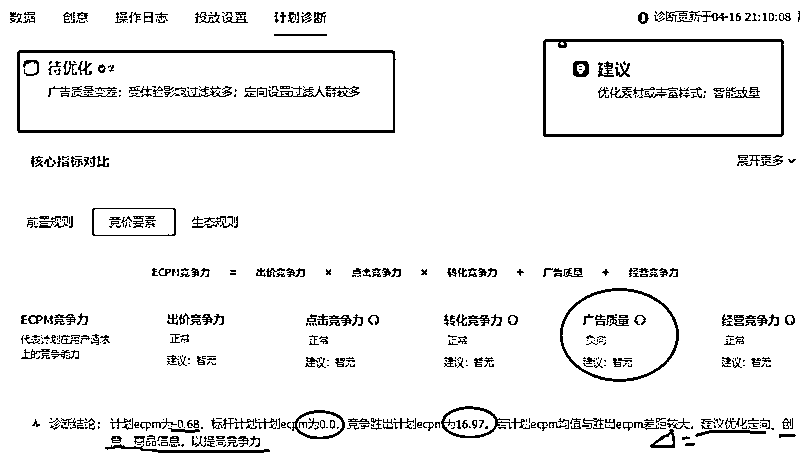 

#### ②带货天天不出单，一投流就亏？ 

做的都快没信心了。最近很多人跟我说，到处听了很多老师的课，学了很多方法，但都没什么效果，一直凑不出赚钱的素材。 

其实在我看来，绝大部分人不赚钱的原因就两个字，贪快，一发视频就想快速出单，想快速出单就投，不消耗就加价，然后就跑飞了。 

我今天给你提供一个不亏钱的解决方案，那就是你可以投流，但是把价格控制住，只在利润边缘出价，能跑就跑，不能跑拉倒。 

然后每天做几个素材出来，丢到抖音，其他不要做，坚持一个月，你会收到意想不到的惊喜！ 

#### ③投随心推，有点击为什么不出单？ 

你们在投随心推的时候，有没有碰到过这样的素材，点击率非常高，但就是不出单？ 

这种一般有这么几个原因，一个是视频内容对产品的价值塑造不到位，就是用户看了你的视频，对这个产品有一点点兴趣，他觉得愿意掏十块钱，但是点进小黄车发现这个产品卖 20 块钱，然后他就不买了。 

第二种原因是最近这个品推的人比较多，用户刷到很多类似视频，点进小黄车发现已经买过了，自然就不会再下单了。 

那遇到这样的视频素材应该怎么办呢？很多人就开始纠结，就想着要不要再投几笔试一下，我告诉你，完全没必要直接换素材，一切不转化的素材，点击率、完播率再高都没用！ 

 

## 第三节、放荡不羁的“千川” 

### 1、感受千川的魅力 

为什么用“放荡不羁”一词来形容千川，感受一下，用千川抢流量是一种什么体验？ 

一起来看一组图： 

eg：用千川抢流量是一种什么体验（案例节选本人实操） 

 

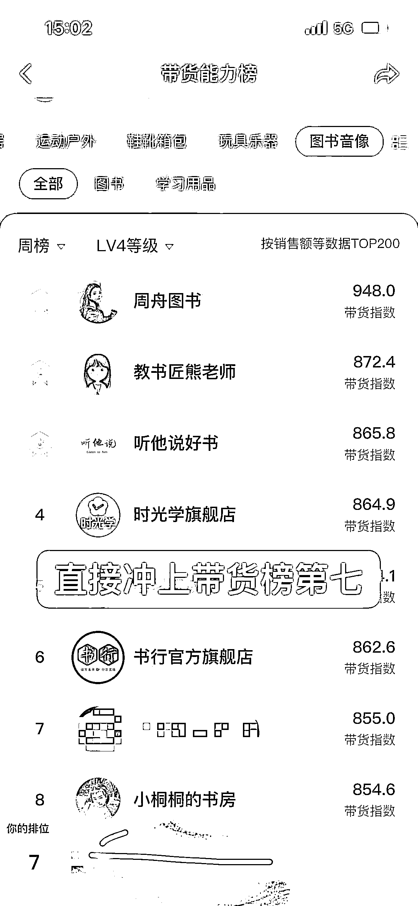 

具体怎么操作？后面的章节，我会逐一拆解，我还要工作，每天更新一点，感兴趣的可以持续关注哦~ 

2、千川搭建基本知识 

在这里，关于如何建计划我就不具体罗列了，因为我觉得能靠搜索解决的东西，还在这里说，就是在浪费你的时间，也是浪费我的时间。 

顺便提醒一下，如果还没有培养遇到问题先搜索习惯的朋友，从现在开始，就可以把“千川搭建”在抖音搜索框查一下，有大把的视频教学。 

我想说的，是里面的一些细节，就是能投自定义就不投托管，这些定向，也就是行业内叫的莱卡，不管你是怎么卡的，卡完后，你要注意你的是它的覆盖人群，不能低于 5 亿。卡的时候，如果低于 5 亿了，能放开的放开。 

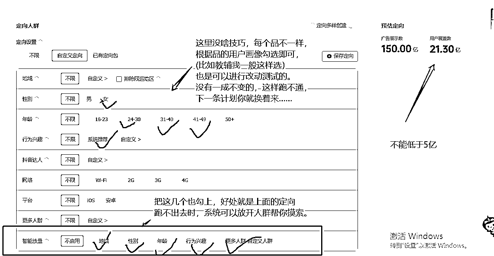 

3、如何出价不会跑飞 ？ 

如果是保守的玩家，担心计划跑飞，出价 ≤ （佣金÷ 1.2 ）是相对安全的，出这个价格，你直接去睡觉，不用管它也可以，可前提是计划 成本保障生效中 （控成本投放）。 

4、如何高峰期抢量？ 

用好工具“一键起量” 

 

起量时长选择 2 到 6 小时 之间！ 

 

5、计划如何快速通过学习期？ 

A、提高出价：前期肯定要亏，过万新手把价格降下来就行，但是一次降低不能超过20%，不然容易把计划搞死！ 

B、结合 A 利用好工具“一键起量”：高峰期使用!比如早上 6、7 点，中午 11、12 点，晚上 8 点后，但是操作时间要提前半小时，给到机器冷启动的时间。 

 

起量时长选择 2 到 6 小时 之间！ 

 

6、如何与算法“博弈”？ 

A、正反馈＞负反馈。 

什么意思呢？这个是站在平台角度来说的啊，假如你是平台，你也是想赚这笔投流的钱的。所以，你的每一个操作，都要让平台有益。比如你降低了出价，那你至少要加大预算，告诉平台这个计划你想跑，虽然你压价了，但是你愿意给更多的钱。有了一个压价（负反馈），你就要有一个加大预算（正反馈），不能让负反馈比正反馈多。不然就是告诉机器，这个计划你不想跑了。 

B、 避免素材同质化。 

如果同一个脚本，跑的人多的时候，难免出现创意挤压，这个时候，你要想办法拍出更有创意的素材，不然为啥叫创意？当然，这个跟我们模仿爆款不矛盾，这个脚本不行，我换一个脚本去模仿，很大几率又爆了！说到底，还是内容为王！想要爆单，就要多拍视频，测试出符合市场审美与要求的视频，放量投放！ 

我的分享到此结束，感谢你能读完这篇文章！ 

同时也感谢亦仁老师提供平台！ 

加入生财相见恨晚，2023 年加入生财，是我今年最正确的选择！接下来的日子，和大佬们一起生财有术！ 

评论区： 

牛顿 273 : 先赞后看，膜拜大佬[鼓掌][鼓掌][鼓掌] 猎音狮（豪叔） : 看完希望有帮助[抱拳][抱拳] 周彦充 : 厉害，值得收藏慢慢看 猎音狮（豪叔） : [社会社会][社会社会] 牛顿 273 : 知识点太多，太赞啦！被知识淹没了，准备慢慢消化~[爱心] 猎音狮（豪叔） : 感谢认可[呲牙] 肖江波 : 看到 10000 多字，需要 60 分钟，还是先点个赞再看[抱拳] 猎音狮（豪叔） : [偷笑][偷笑]