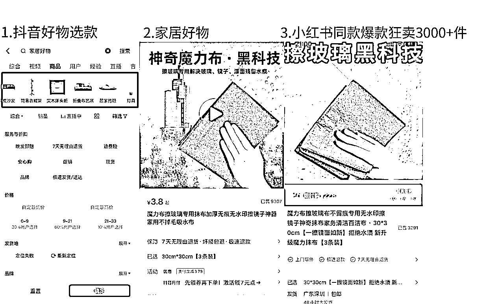

# 《小红书电商两种实操玩法分享》

> 原文：[`www.yuque.com/for_lazy/thfiu8/lxnri4kh1iecyiu5`](https://www.yuque.com/for_lazy/thfiu8/lxnri4kh1iecyiu5)

## (99 赞)《小红书电商两种实操玩法分享》 

作者： 曜文 

日期：2023-05-04 

通过两个多月的实战目前对小红书电商的玩法流程逐渐清晰、 

所以在五月份开始来和大家分享一下我近期的一个玩法方向和近期实操的经验。 

首先，小红书对于电商的扶持依旧在继续 

已经更进一步的在扶持上架，选款，赠送流量，帮助商家找到热门的选题 

（注：每个人的推荐可能都不一样，因为系统会跟随账号的标签和垂直度推送相关的热门话题） 

通过这种图已经有很多同学选中爆款实现店铺日出百单 

因为，只要参与话题就送笔记流量，那目前小红书出单基本也来源于笔记的曝光，所以，平台有流量扶持，赶紧冲！是个机会！ 

接下来，我们来聊聊我的两种实操操作，来带你玩转小红书电商 

## 1.好物爆款玩法 

好像各个平台都离不开爆款好物的玩法，小红书当然也不例外了，就是利润不高，但是爆单起量数据好看 

比如我之前做手机壳一天能卖 100 单以上，但是一单利润也就 2-3 元，但是对于新手可以尝试入局再不断的调整价格拉高账号数据和权重来实现更高的盈利。 

目前，家居好物，装修好物，日用好物，出行好物，....太多了 

打开抖音打开考古加数据看看近期热门爆款或往期爆款就能找到超多好物 

 

例如 

一款夏天精致吸管杯子 

一幅装修装饰画 

一个精致的花瓶 

.... 实在是太多了，找找年龄段 18-35 会用到的好物产品 

为什么好物能做呢？ 

因为这类素材多，之前在其他平台已经被验证过是用户需求 

而且，拿来做小红书电商素材足够能混剪，爆款内容也多，能够顺利的找到非常多的素材混剪去堆爆款。 

优势： 

素材容易找，起号快，各种垂直的好物多，每天能不断的测款，出爆款。 

也能在较短的时间内提升账号权重，和账号垂直类目的垂直度以便于后期提升利润获得更多的流量。 

## 2.垂直精细化玩法 

意思是，垂直于某个行业类目在这个类目下运营店铺 

比如，做饰品，那么可以做耳饰，手镯，戒指，项链....等等一系列的产品 

目前，可以根据小红书女性画像来确定想要深耕的赛道，确定了赛道之后就可以开始选品 

选品之后，就可以开始做店铺运营 

1.拆解用户需求 

2.找到产品卖点 

3.锁定关键词 

4.寻找对标 

5.拆解对标 

6.持续输出 

还可以做自己的原创店，或者个体 IP 店，什么意思呢？ 

就是在输出内容的时候加入自己的风格 IP，人设，让自己的店铺转化率更高，而不是仅仅停留在混剪上面。 

前期可以用百元内的产品来激活店铺权重和笔记流量，后面可以提升客单价来做利润品。 

此类店铺，不容易被同行举报能比较长久，但是前期店铺起量是需要一定的时间的，需要打造账号和做好内容运营，当然后期也能获取到较高的利润。 

能够锻炼提升自己的运营能力和剪辑文案能力。 

总结： 

好物账号出单比较快，素材比较多，如果选品困难不知道做什么可以从这个入手去找到感觉 

然后再精细化运营，但是前期利润比较低，单量高，利润确实不高，甚至有很多人能做到当天发笔记就出单。 

精细化运营能比较长久，而且后期的利润品只要上了基本也能出，如果你有留意的话你会在小红书发现很多账号前期是靠价格低的产品出了上千单，后续每个月上的品都能出个几十单，这就是利润品。 

精细化运营之后，还可以把垂直客户做到自己的私域来多次的成交流量，电商的流量客户始终都是平台的 

唯有私域才是自己的 

讲完，有所帮助，记得点赞！ 

评论区： 

巧巧 : 分享的太棒了 祁磊 : 很好，有收获，谢谢分享 晴子 : 很棒的分享