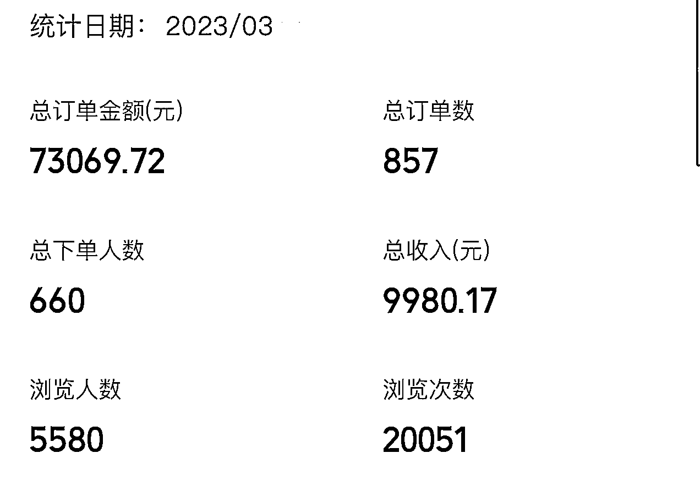
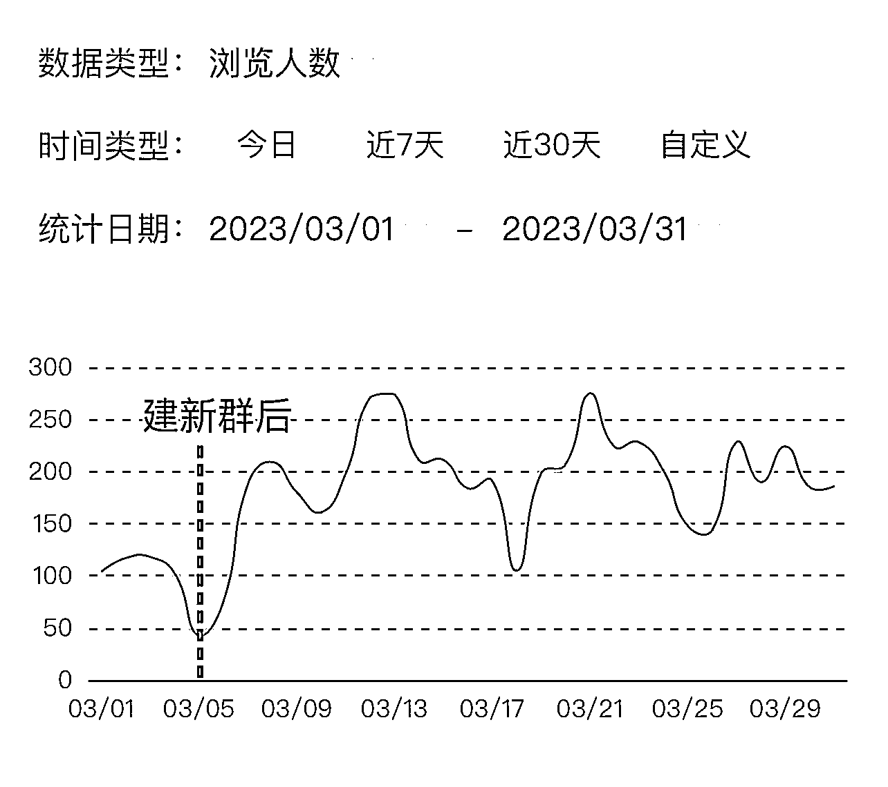
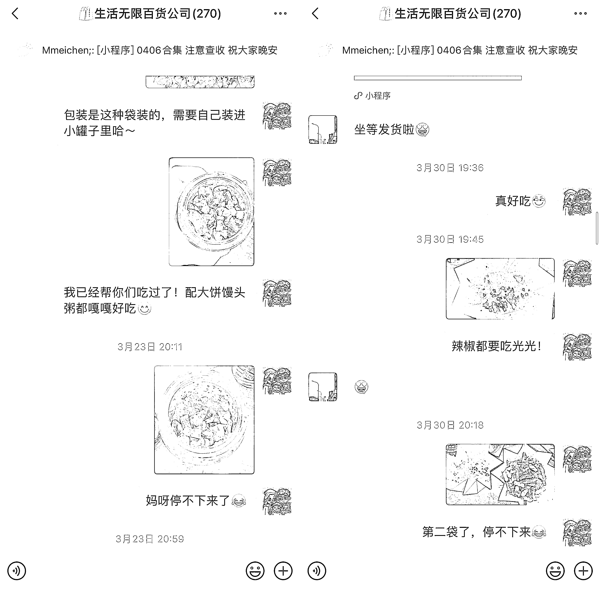
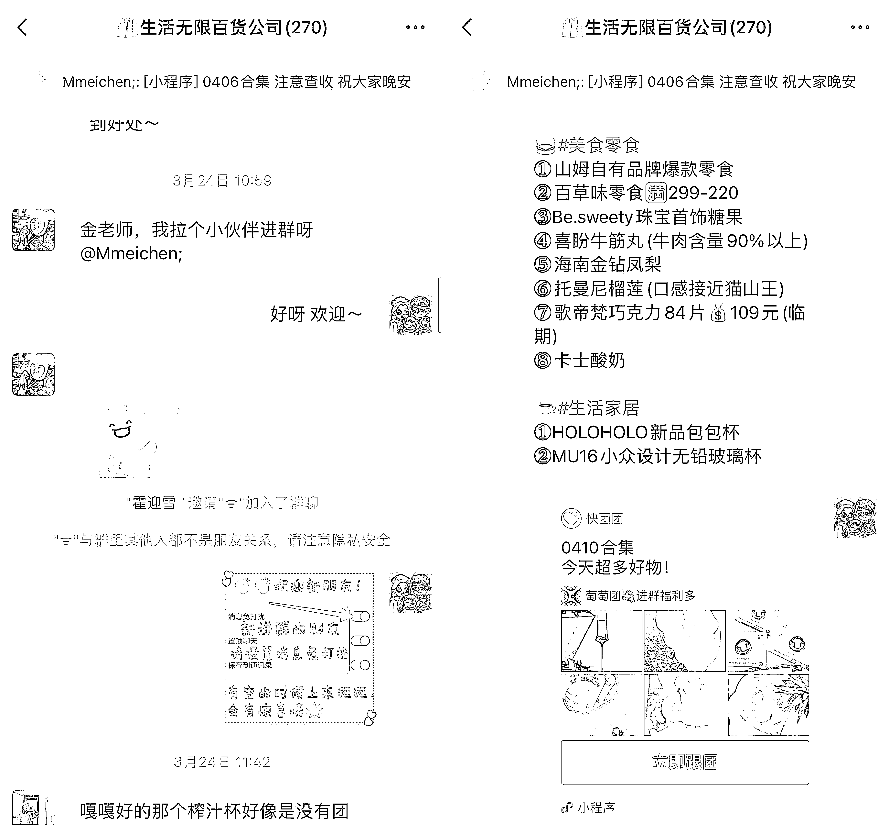
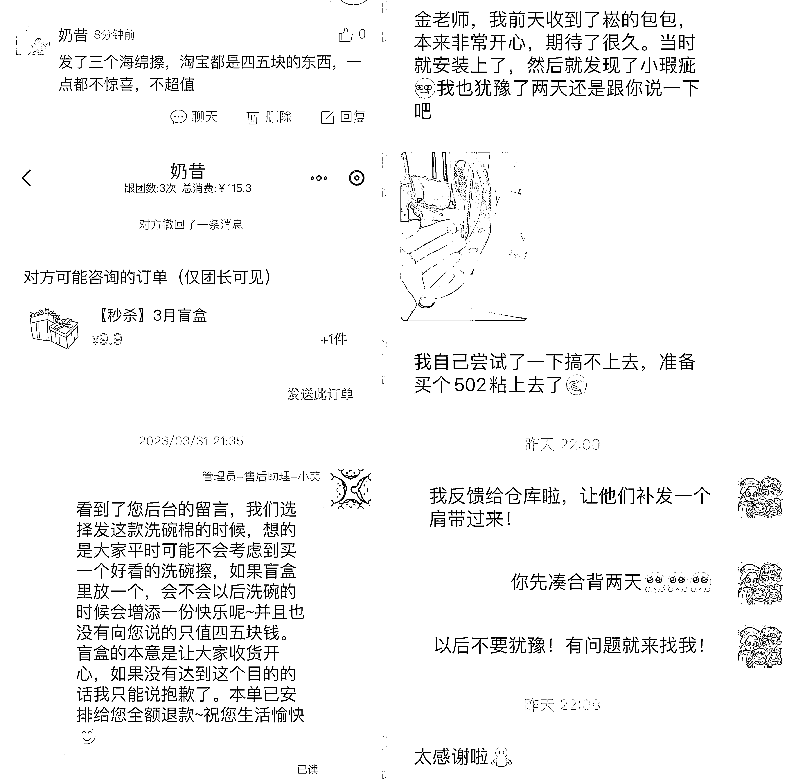
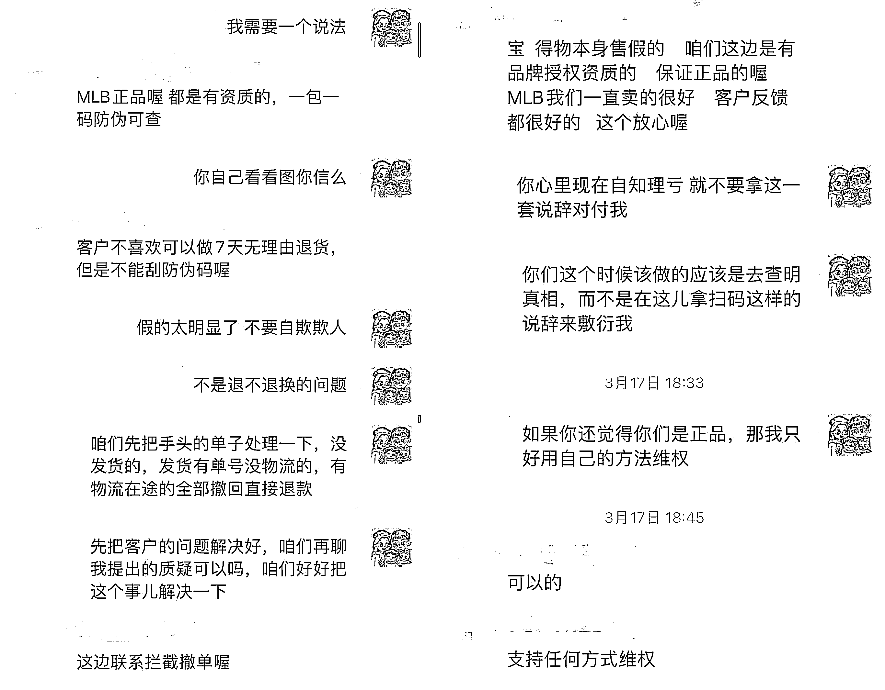

# 《一个热衷搞钱的二胎全职妈妈，如何在一个月成为快团团 GMV 7W 的团长》

> 原文：[`www.yuque.com/for_lazy/thfiu8/tr10k1upfno1thvv`](https://www.yuque.com/for_lazy/thfiu8/tr10k1upfno1thvv)

<ne-h2 id="bb6a7877" data-lake-id="bb6a7877"><ne-heading-ext><ne-heading-anchor></ne-heading-anchor><ne-heading-fold></ne-heading-fold></ne-heading-ext><ne-heading-content><ne-text id="u0e1f6056">(230 赞)《一个热衷搞钱的二胎全职妈妈，如何在一个月成为快团团 GMV 7W 的团长》</ne-text></ne-heading-content></ne-h2> <ne-p id="u757f0c8e" data-lake-id="u757f0c8e"><ne-text id="u9b0ed5e6">作者： Mmeichen;</ne-text></ne-p> <ne-p id="ufb63bf85" data-lake-id="ufb63bf85"><ne-text id="u51c7ba48">日期：2023-04-17</ne-text></ne-p> <ne-p id="u11675aa9" data-lake-id="u11675aa9"><ne-text id="ubb15e692">大家好，我是老金，现在是二胎全职妈妈，热衷搞钱。我从 2 月底开始接触快团团，登上了 3 月的航海，在朋友与各位教练船友的帮助与鼓励下，第一个月就做到了 GMV 7W+，进入了北京前 1000 位团长的排名之中。</ne-text></ne-p> <ne-p id="u11da3843" data-lake-id="u11da3843"><ne-card data-card-name="image" data-card-type="inline" id="lU2BM" data-event-boundary="card"></ne-card></ne-p> <ne-p id="u78c1d21f" data-lake-id="u78c1d21f"><ne-text id="u8490abc2">今天就想和大家分享一下我做快团团的从 0 到 1 的过程，和大家聊聊我是怎么冷启动的，以及售前、中、后都遇到了哪些问题，又是怎么应对解决的。</ne-text></ne-p> <ne-h3 id="76c3ef31" data-lake-id="76c3ef31"><ne-heading-ext><ne-heading-anchor></ne-heading-anchor><ne-heading-fold></ne-heading-fold></ne-heading-ext><ne-heading-content><ne-text id="uc97b75ed">我为什么选择做快团团这个平台？</ne-text></ne-heading-content></ne-h3> <ne-p id="u008ade23" data-lake-id="u008ade23"><ne-text id="u38643547">年初刚生完二胎的我，被好朋友雪姨 "按头" 推荐了快团团这个平台，她说这简直太适合我了。为什么她会这么说呢，先来给大家盘一盘我之前的工作以及累积的资源。</ne-text></ne-p> <ne-p id="udd2de949" data-lake-id="udd2de949"><ne-text id="u02500c72">由于语言优势，我从大学毕业后一直从事与韩国业务有关的工作，这份工作需要出差，我经常在国内和韩国往返，这就让我有了第一份副业——代购。在这两三年时间里，我累积了一个 400 多人的代购群，而且客户粘性非常强，转化率很高。</ne-text></ne-p> <ne-p id="u804a7575" data-lake-id="u804a7575"><ne-text id="ue42e0311">随着副业渐渐做的好起来，19 年初我辞去了月薪过万的工作，加入了紫菜团队，做一些倒爷撸货的项目，便开始接触社群、私域、引流等等领域。一年下来，我的 2 个微信号积累了 8000+ 的微信好友。而跟我发生过金钱交易的人，不到一千也有大几百了。</ne-text></ne-p> <ne-p id="u49bff378" data-lake-id="u49bff378"><ne-text id="udf790257">微信好友这一参数对于刚起步的快团团帮卖团长是非常重要的，直接影响着起号的难易程度。再加上我在别人眼中是 "代购"、"爱剁手"、“爱搞钱” 这类人设，让我卖货变得顺理成章，也更加有说服力。</ne-text></ne-p> <ne-h3 id="6ceb716f" data-lake-id="6ceb716f"><ne-heading-ext><ne-heading-anchor></ne-heading-anchor><ne-heading-fold></ne-heading-fold></ne-heading-ext><ne-heading-content><ne-text id="u5254abfe">如何进行快团团社群的冷启动？</ne-text></ne-heading-content></ne-h3> <ne-p id="u3c9e97f5" data-lake-id="u3c9e97f5"><ne-text id="ue11d05ca">起初我并没有选择在朋友圈做推广，或是建立一个新的快团团卖货群，而是直接重启了被疫情搁置了 3 年的 400 人代购群。</ne-text></ne-p> <ne-p id="ue348f9fb" data-lake-id="ue348f9fb"><ne-text id="u0f00e89a">当时是这么做的：我简单介绍了接下来要在群里做的事情，试图用一些福利将大家留下来，比如免费的体检、美容等。</ne-text></ne-p> <ne-p id="u1a4a70e5" data-lake-id="u1a4a70e5"><ne-text id="u3a09f632">但是试运营一周后，我发现这个 400 人的大群犹如一个死群，发的链接浏览不过个位数，说一句话半天也没人回应，甚至发出一个红包，第二天都会被退款。</ne-text></ne-p> <ne-p id="u821830a8" data-lake-id="u821830a8"><ne-text id="u7c521efb">这个时候正好读到了社群运营航海手册中，条形马老师的一段话：</ne-text><ne-text id="ua038816d" ne-bold="true">被运营死掉的社群，并没有什么一招激活术。重新激活社群，也是一个伪概念。</ne-text></ne-p> <ne-p id="u734231c3" data-lake-id="u734231c3"><ne-text id="u02abe7bd">这让我彻底斩断了对 400 人这个大基数社群最后的留恋，选择了一键解散，解散前留下了新群的二维码，希望群里还 “活着” 的人能继续跟着我。</ne-text></ne-p> <ne-p id="u4b88a68b" data-lake-id="u4b88a68b"><ne-text id="u5455a581">最终从老群中迁移过来不到 200 人。虽然人数减半，但迁移的大动作还是让群得到了更多的关注，链接浏览量的增加非常明显。群里“活人”多了，群也就活起来了，互动也有所增加。</ne-text></ne-p> <ne-p id="uc8876417" data-lake-id="uc8876417"><ne-card data-card-name="image" data-card-type="inline" id="SoKfn" data-event-boundary="card"></ne-card></ne-p> <ne-h3 id="5a930ae2" data-lake-id="5a930ae2"><ne-heading-ext><ne-heading-anchor></ne-heading-anchor><ne-heading-fold></ne-heading-fold></ne-heading-ext><ne-heading-content><ne-text id="u8c7a70cc">售前：有关选品的启发</ne-text></ne-heading-content></ne-h3> <ne-p id="u601a02de" data-lake-id="u601a02de"><ne-text id="u9743845f">生意三要素人、货、场中，人和场已经有了，搭建好一个正确的社群后，我便遇上了第二个难题——选品。</ne-text></ne-p> <ne-p id="ubd0dca76" data-lake-id="ubd0dca76"><ne-text id="u51f04505">最开始的时候，我一口气加了 100 多个无门槛的大团长，产品挑的眼花缭乱，看什么都觉得稀奇，像是发现了新大陆一样。我也没有给自己设立一个选品的逻辑或原则，只要看到好玩儿的、便宜的产品，都会激情转发。</ne-text></ne-p> <ne-p id="u0f7ba587" data-lake-id="u0f7ba587"><ne-text id="u6a3e81ed">也不知道是不是因为大家对一个新的购物平台感到新鲜，刚开始这么“粗放”的选品模式下，出单也很快，每天能有三十多的跟团量。</ne-text></ne-p> <ne-p id="u06f933d3" data-lake-id="u06f933d3"><ne-text id="uba1fc5f9">但好景不长，两周左右，这种模式就出现了瓶颈，不管我发什么，反响都不是很理想。而且商品质量的良莠不齐，导致了售后问题接踵而至，客户开始怀疑我的选品能力，有流失老客户的倾向。</ne-text></ne-p> <ne-p id="u61eef023" data-lake-id="u61eef023"><ne-text id="uf4be83d6">在一系列复盘后整理了往后的选品的方向和思路：</ne-text></ne-p> <ne-p id="u62649914" data-lake-id="u62649914"><ne-text id="u2ec82636" ne-bold="true">1、把自己的数据做好，筛选优质大团长</ne-text></ne-p> <ne-p id="ua3aef8aa" data-lake-id="ua3aef8aa"><ne-text id="u3edd2a0e">刚上手的小白没有甄别商品好坏的经验，只能依靠快团的官方数据作参考，比如根据团员数、跟团人次，我们可以看到大团长的带货能力、范围以及人均复购次数，再加上官方认证的口碑等级，可以迅速筛选出 “成绩” 好的大团长。</ne-text></ne-p> <ne-p id="u202d2ec2" data-lake-id="u202d2ec2"><ne-text id="u396b8b20">大家也知道有些优质的团长是有帮卖门槛的，迅速提高自己的团员数和跟团数可以让自己获得更优的资源。有一个相对好的方法就是帮卖大团长们的 1 分钱抽奖活动，1 分钱的考虑成本是很低的，面对高额奖品的诱惑大家还是很乐意参与抽奖。</ne-text></ne-p> <ne-p id="u81aeb203" data-lake-id="u81aeb203"><ne-text id="ufa22f0be">再就是我的好友雪姨创新出来的 9 块 9 盲盒玩法，也很容易出单，这样跟团数就比较容易做上来。</ne-text></ne-p> <ne-p id="u18935ae0" data-lake-id="u18935ae0"><ne-text id="ud8463d52">我还发现了一个初期可以使用的增加团员数的方法：</ne-text><ne-text id="ua4e3ff84" ne-bold="true">把你想要分享的东西整合到一个快团链接里，并设置 0.01 的价格，再在页面设置 1 元无门槛红包，</ne-text><ne-text id="ufe9a66af">这一步非常重要，领了红包的人很有可能会被转化。比如前两天分享了最近很火的长月烬明的屏保(因为卖票积累了一些粉丝)，大家可以根据自己来做内容，比如学习资料分享、羊毛合集等等等等。</ne-text></ne-p> <ne-p id="u3c1ca527" data-lake-id="u3c1ca527"><ne-card data-card-name="image" data-card-type="inline" id="nZpom" data-event-boundary="card"></ne-card></ne-p> <ne-p id="u98307c5b" data-lake-id="u98307c5b"><ne-text id="u803b567e" ne-bold="true">2、给社群一个定位，只卖符合社群定位的商品</ne-text></ne-p> <ne-p id="u025769c8" data-lake-id="u025769c8"><ne-text id="ufe27f5e9">做快团团卖货离不开社群运营，这次我很多的运营决定和方向，都很得益于条形马老师的航海手册。</ne-text></ne-p> <ne-p id="ua60eada4" data-lake-id="ua60eada4"><ne-text id="ud2a12eb6">我一直认为买卖不仅仅是简单的商品交易，也是买卖你的生活方式以及附加的情绪价值。目前我群里的客户基本都是从代购时期就建立交易的，并且大多数人的经济条件都还算得上小康。所以我后来定的选品的方向，就是以高质量+高性价比为主，高质量+为情绪价值付出溢价为辅。</ne-text></ne-p> <ne-p id="uec15de91" data-lake-id="uec15de91"><ne-text id="u7f4e4816">社群的定位越清晰，社群里的人才不至于失去焦点，进入到社群的人才会更加垂直，社群的活跃度更高流失率更低。就像我的群所吸引的是有消费能力且追求高质量生活的人，群里很少再出现 9 块 9 的水杯、19 块 9 的床单了。</ne-text></ne-p> <ne-p id="u9748cf26" data-lake-id="u9748cf26"><ne-text id="u405a51bd" ne-bold="true">3、自己测过的品，才更有底气推广</ne-text></ne-p> <ne-p id="u6a470ced" data-lake-id="u6a470ced"><ne-text id="ue70c1e50">如何判断一个东西好不好，最直接的方法就是自己去试一试。你敢信吗，我和我老公 3 月一整月在快团团消费了 8000，真正实现了“快团赚钱快团花，一分都别带回家”。</ne-text></ne-p> <ne-p id="u01c4c788" data-lake-id="u01c4c788"><ne-text id="uab68d8a9">我亲自用过的吃过的，我都很有底气去推荐给别人，我的晒图也更能获得客户们的信任，而且这类产品一般出单情况都比较好。而且那些已经被市场拷打过的品牌产品，有品牌自身和许多大博主的信任背书，大多数可以直接开卖。</ne-text></ne-p> <ne-p id="u28bf6e64" data-lake-id="u28bf6e64"><ne-card data-card-name="image" data-card-type="inline" id="LCeL9" data-event-boundary="card"></ne-card></ne-p> <ne-p id="ufaf4c40a" data-lake-id="ufaf4c40a"><ne-text id="u487a59d0" style="color: rgb(143, 149, 158);">（主打的就是一个停不下来）</ne-text></ne-p> <ne-p id="u26d091dc" data-lake-id="u26d091dc"><ne-text id="ufb3f931b" ne-bold="true">4、建立品质信任，也要建立价格信任</ne-text></ne-p> <ne-p id="u108189e8" data-lake-id="u108189e8"><ne-text id="u656f48b3">所有帮卖团长们都有可能遇到过价格尴尬，就是在没有比价的前提下就一件帮卖了某产品，导致客户反馈比某宝卖的还贵或者跟某宝价格一样。</ne-text></ne-p> <ne-p id="u014e9416" data-lake-id="u014e9416"><ne-text id="u4982faab">第一次碰到这个问题时，我及时在页面添加了红包，并且和他们解释领红包就便宜了，以此化解尴尬。在此之后我也思考了很久关于价格的问题，比如：价格不够低会不会让被种草的客户流向了其他平台下单，价格太低自己会不会白忙活一场。</ne-text></ne-p> <ne-p id="u88e38c53" data-lake-id="u88e38c53"><ne-text id="ue307c4c5">现在我认为：对于顾客来说，快团团是一种新的购物平台，想要改变大家的购物习惯，不是一朝一夕的事情。在运营前期，我还是会与淘宝的主流店铺（官旗或是月销较高的店铺）做价格对比，给足价格优势。再慢慢转变客户的购物习惯。等基础信任搭建起来后，后续就算没有绝对的价格优势，客户其实也更愿意与你达成交易。</ne-text></ne-p> <ne-p id="uce5f9c11" data-lake-id="uce5f9c11"><ne-text id="u3fafd891" ne-bold="true">5、分析客户喜好，找到爆品</ne-text></ne-p> <ne-p id="u7dd078f6" data-lake-id="u7dd078f6"><ne-text id="uf5c161af">我每天都会花时间去看看当天产品链接的浏览情况，以此来找到可能的爆品。</ne-text></ne-p> <ne-p id="uc95d59cb" data-lake-id="uc95d59cb"><ne-text id="u0e854ef6">有一次我发现 200 元以内的包包和衣服浏览会偏高一些，于是我开始找又便宜，质量又好的 T 恤来卖。我在不同团长那里买回来四件不一样的样品来测试，最后选择了两款克重高、刺绣喷印工艺都不错的卡通 T 恤来主推，一共卖出了 17 件。</ne-text></ne-p> <ne-p id="u56fa1d76" data-lake-id="u56fa1d76"><ne-card data-card-name="image" data-card-type="inline" id="cphNW" data-event-boundary="card"></ne-card></ne-p> <ne-p id="ubcddb9dc" data-lake-id="ubcddb9dc"><ne-text id="u50d330b7">后来又按这个方式，选了两款 100-200 之间价位、做工较好的包买回来测试，全部拍实拍发到群里，最后一共卖出 21 件。前期可以全品类都尝试着去发一发，分析出客户群体的偏好后，有倾向性的去推荐就会事半功倍。</ne-text></ne-p> <ne-p id="uc2780837" data-lake-id="uc2780837"><ne-card data-card-name="image" data-card-type="inline" id="ACv6L" data-event-boundary="card"></ne-card></ne-p> <ne-p id="u36d1dbe4" data-lake-id="u36d1dbe4"><ne-text id="u931477ea" style="color: rgb(143, 149, 158);">（每次群里有好评就再发一次🔗，会有意外收获）</ne-text></ne-p> <ne-h3 id="7d02de67" data-lake-id="7d02de67"><ne-heading-ext><ne-heading-anchor></ne-heading-anchor><ne-heading-fold></ne-heading-fold></ne-heading-ext><ne-heading-content><ne-text id="u84e2f72b">售中：不要让社群变成纯卖货工具</ne-text></ne-heading-content></ne-h3> <ne-p id="u4cb0e99d" data-lake-id="u4cb0e99d"><ne-text id="u121748d7">为了不让我的群成为一个只会发产品信息的卖货工具，我在如何让群活跃起来、让群里一直有话题也下了一些功夫，也请教了同在做快团团的朋友雪姨，整理了几点亲测有效的激活群的方法：</ne-text></ne-p> <ne-p id="ufdf28f9c" data-lake-id="ufdf28f9c"><ne-text id="u190f1b63" ne-bold="true">1、为群友们提供附加价值</ne-text></ne-p> <ne-p id="ud68719b5" data-lake-id="ud68719b5"><ne-text id="u7f534ce7">我有一个母婴群，起初完全没有人说话，再加上群内的人群不同（有孕妇、有新生儿妈妈、学龄前儿童妈妈），选品的范围太广了，导致转化率一直不高。</ne-text></ne-p> <ne-p id="u34414e60" data-lake-id="u34414e60"><ne-text id="ua6e33e3f">但一件事让我得到了意外的正反馈：由于我本人也刚产后不久，会跟着抖音直播练习凯格尔运动（一项有助于产后恢复的练习），想着群里还有一些孕产妇也用得上，就分享到群里和大家一起练习。结果第一次有这么多人出来说话，群里也热起来了。</ne-text></ne-p> <ne-p id="u808345ec" data-lake-id="u808345ec"><ne-card data-card-name="image" data-card-type="inline" id="zHa2K" data-event-boundary="card"></ne-card></ne-p> <ne-p id="u80f38363" data-lake-id="u80f38363"><ne-text id="ucb1cc8e0">后面我也陆陆续续跟大家分享了婴幼儿打疫苗攻略、儿童补剂如何选择，甲流时期也为大家分享了我看过的用药指南。后来大家也逐渐愿意来问我推荐一些产品。虽然有一些我推荐的东西并没有在卖，但被人需要和信任的感觉，真的比赚佣金来的开心。</ne-text></ne-p> <ne-p id="ubdb967b9" data-lake-id="ubdb967b9"><ne-card data-card-name="image" data-card-type="inline" id="pSIJe" data-event-boundary="card"></ne-card></ne-p> <ne-p id="u36b5e48c" data-lake-id="u36b5e48c"><ne-text id="uef3f1cad" style="color: rgb(143, 149, 158);">（被人需要的感觉真的太棒啦！)</ne-text></ne-p> <ne-p id="u557a7f30" data-lake-id="u557a7f30"><ne-text id="uc7d6c7fd">一个普通的卖货群被替代的成本是非常低的，如果能为他附加一些价值，比如母婴群附加育儿经验、新手闭坑，代购群附加美妆穿搭技巧，用户的黏性就会增加。</ne-text></ne-p> <ne-p id="ud5300a42" data-lake-id="ud5300a42"><ne-text id="u7b747400" ne-bold="true">2、建立会员机制，鼓励晒单</ne-text></ne-p> <ne-p id="ud65448ac" data-lake-id="ud65448ac"><ne-text id="ud5e5f76d">快团团自带的积分商城版块是非常好用的，团员订阅、消费、分享下单链接、收货后晒单都可以获得积分，累积的积分可以兑换相应的奖品（团长可以自行设置）。</ne-text></ne-p> <ne-p id="udb062403" data-lake-id="udb062403"><ne-card data-card-name="image" data-card-type="inline" id="PkJW8" data-event-boundary="card"></ne-card></ne-p> <ne-p id="ucc2ce518" data-lake-id="ucc2ce518"><ne-text id="ube104867">我原来也没觉得大家会为了几个积分晒单或是分享下单链接到群里，但是尝试过后发现效果意外的好。跟团链接在某种程度上会刺激其他团员的消费行为，还会增加链接的浏览量，如果有个跟团链接出现在群里，你会不会也好奇“他买了啥好东西”？然后点开看一看呢。</ne-text></ne-p> <ne-p id="u49547227" data-lake-id="u49547227"><ne-text id="u2fd92b50">目前我的积分商城里只设置了两档：300 积分换 5 元无门槛，500 积分兑换 10 元无门槛，兑换率也是比较高的。</ne-text></ne-p> <ne-p id="ueac96076" data-lake-id="ueac96076"><ne-text id="ub5a9bc76" ne-bold="true">3、从客户角度出发，提供方便</ne-text></ne-p> <ne-p id="u3c8556bf" data-lake-id="u3c8556bf"><ne-text id="ucb8495b0">最简单的做法，就是每晚做个上新合集的链接来结束这一天。面对一个一天消息几百的群，逐一爬楼找商品的时间成本是很大的，每日合集可以为没有时间实时关注群消息的人提供方便，一下就看到今天上了什么好东西。</ne-text></ne-p> <ne-p id="u34a7d05e" data-lake-id="u34a7d05e"><ne-text id="u02fc6790">再者，每有一位新朋友进群，我都会提醒他设置群消息免打扰和置顶群消息，有空的时候进来随便看一看，也是从不要打扰到他人的角度出发。</ne-text></ne-p> <ne-p id="u47f0669f" data-lake-id="u47f0669f"><ne-card data-card-name="image" data-card-type="inline" id="mjC8N" data-event-boundary="card"></ne-card></ne-p> <ne-h3 id="3b0ccb5a" data-lake-id="3b0ccb5a"><ne-heading-ext><ne-heading-anchor></ne-heading-anchor><ne-heading-fold></ne-heading-fold></ne-heading-ext><ne-heading-content><ne-text id="uae6357c9">售后：最有可能流失客户的环节</ne-text></ne-heading-content></ne-h3> <ne-p id="u4ecabe6b" data-lake-id="u4ecabe6b"><ne-text id="u5359f0b0">不同于淘宝客，虽然都是发链接赚佣金，但快团团的团长是需要为客户提供售前咨询、售后处理等一整套服务的。</ne-text></ne-p> <ne-p id="ufc473ead" data-lake-id="ufc473ead"><ne-text id="uf851ac74">在做快团团的圈友可能都会有一个感受，尽管选品时再用心，当碰到售后服务不那么完善的大团长时，售后问题一定是我们被结结实实要上的一课。如大团长设置的“退货需扣除发货运费、发货周期慢、不支持无理由退换”等等，都是可能会碰到的坑。</ne-text></ne-p> <ne-p id="u2eb35ba0" data-lake-id="u2eb35ba0"><ne-text id="u4522e685">第一个直接可以避免棘手售后的方法，就是</ne-text><ne-text id="ud7011e5d" ne-bold="true">不卖不支持无理由退换货的商品。</ne-text><ne-text id="u80113ab7">因为那些不支持无理由退换的产品，即使买的时候强调了不退不换，还是会有无理的买家强制要求。</ne-text></ne-p> <ne-p id="u8956a14f" data-lake-id="u8956a14f"><ne-text id="u860082b2">所以如果想从根源上解决，我们在与大团长的沟通中还是要多多为顾客行方便，多为顾客争取权益。当退款事件发生时，也尽量减少与客户拉扯的回合，在权衡好利弊后，直接给出自己能承担的最大的售后条件。</ne-text></ne-p> <ne-p id="ucaf1abdd" data-lake-id="ucaf1abdd"><ne-text id="u2cf847e9">比如我一位经常下单的客户同时申请了两件不可退换货商品的退货申请。两件商品总价 70 元，如果商品实在是不满意，我可以让他退给我，我自己来消化这个货品，但如果进行一些补偿可以避免退货也是一个很好的办法。</ne-text></ne-p> <ne-p id="u7ba8dbea" data-lake-id="u7ba8dbea"><ne-card data-card-name="image" data-card-type="inline" id="nsB7i" data-event-boundary="card"></ne-card></ne-p> <ne-p id="u80f9e44f" data-lake-id="u80f9e44f"><ne-text id="u48620f1a">放弃佣金后再作出一些补偿，让客户看到售后的诚意。这个售后单我亏了 20 元钱，但换来的是客户的信任和复购，截止到今天这位客户已经下了 19 单，金额有 1200 元。如果当时售后没有做好，我得到了 10 元的佣金却有可能失去一个长期的客户。在此之后我也很少卖不可退换的商品了。</ne-text></ne-p> <ne-p id="u4869ad48" data-lake-id="u4869ad48"><ne-text id="uaac502ee" ne-bold="true">不要留恋暂时的小利益，你所放弃的长时间看来一定会像滚雪球一样加倍的像你投来。</ne-text><ne-text id="u674d881f" style="color: rgb(31, 35, 41);">有一次我在后台收到一条差评，起因是客户买的 9 块 9 盲盒让他感到不值当。于是我第一时间联系到他为他退了款。这件事情金额虽小，但如果不及时处理，可能就会产生嫌隙。</ne-text></ne-p> <ne-p id="udbaffcf5" data-lake-id="udbaffcf5"><ne-text id="ue0eb3b34" style="color: rgb(31, 35, 41);">我也会经常鼓励大家多多给我反馈，不要觉得不好意思开口，不要连帮你解决问题的机会都不给我。</ne-text></ne-p> <ne-p id="u09769477" data-lake-id="u09769477"><ne-card data-card-name="image" data-card-type="inline" id="JC7zO" data-event-boundary="card"></ne-card></ne-p> <ne-p id="u0a3c9d6d" data-lake-id="u0a3c9d6d"><ne-text id="ue25a0bdd" ne-bold="true">还有一点，就是要做到事事有回应。</ne-text><ne-text id="ud0b4e4b6">客户催发货，如果能及时做到有效反馈——不是单单的“我去催一下”，而是“我催过仓库了，因为什么原因导致发货慢，预计什么时候可以发出”，客户满意度会更高的。</ne-text></ne-p> <ne-p id="uedba9ae3" data-lake-id="uedba9ae3"><ne-text id="u03cfa3c5">快团与其他平台的不同就是，我们做的是私域的生意，不同于冰冷的客服，我们的服务是有温度的。我们吃点小亏，勤快一点，让别人满意了生意才会持久。</ne-text></ne-p> <ne-h3 id="cde4f570" data-lake-id="cde4f570"><ne-heading-ext><ne-heading-anchor></ne-heading-anchor><ne-heading-fold></ne-heading-fold></ne-heading-ext><ne-heading-content><ne-text id="u061e81cb">信誉危机——“老金是个卖假货的”</ne-text></ne-heading-content></ne-h3> <ne-p id="uaf5c92a1" data-lake-id="uaf5c92a1"><ne-text id="uc28f9cca" ne-bold="true">话说车速有多快翻车就多猛。</ne-text><ne-text id="u3ae321d6">在我整理好一切思路和方法，社群有序地运转了两周，还沉浸在自己的小成绩里时，惨遭滑铁卢。</ne-text></ne-p> <ne-p id="u4c47b99c" data-lake-id="u4c47b99c"><ne-text id="ubbbce45a">有一天我收到客户的退货申请，退货理由写着</ne-text><ne-text id="ufa8b9f08" ne-bold="true">“这是假包，团长以后好好选选你的供货商吧”</ne-text><ne-text id="ubedfe392">，这句话犹如重拳一击，我第一反应是这绝不可能啊！客户购买的是一只 299 元的 MLB 腋下包，供货团长是拥有 12 万团员，139 万跟团次，黑金口碑商家。</ne-text></ne-p> <ne-p id="ue99680bb" data-lake-id="ue99680bb"><ne-text id="uc279919d">我一遍又一遍的看商品链接，上面明确标注 100%正品，产品和天猫旗舰店同源，且有品牌授权。怎么看都不像是假货。于是我我私下联系了这位顾客（是曾经和我有过商业合作的人），她表示这只包从各项鉴定点看来都不过关，连高仿都算不上。</ne-text></ne-p> <ne-p id="u4bfdd94c" data-lake-id="u4bfdd94c"><ne-text id="u5829f4d5">我刚开始还以为对方是“肉眼鉴定大师”，还阴阳怪气了一番。但后来慢慢地我被对方说的越来越心虚，好在她也是体面人，没有过多纠缠，打算退货了事。可我是不允许别人诋毁我的，一定要把这件事情说清楚，就让她把包包同城快递给我，由于官网已经没有这款包了，我就在得物上买了一只用来做对比。</ne-text></ne-p> <ne-p id="u5bb3f86e" data-lake-id="u5bb3f86e"><ne-text id="u67d644dc">第二天两只包都到了，我一打开，就彻底傻了眼，什么叫 “一眼假” 被表现的淋漓尽致。于是我第一时间找到了大团长的售后，拍了对比图，让对方确认一下是不是发货出了什么问题，为什么会发出一个假包。没想到对方根本不关心我提出的问题，一直以有授权来搪塞我，态度强硬还质疑我调换了包包。</ne-text></ne-p> <ne-p id="ue6d09f33" data-lake-id="ue6d09f33"><ne-card data-card-name="image" data-card-type="inline" id="tSuti" data-event-boundary="card"></ne-card></ne-p> <ne-p id="uf6c48e5b" data-lake-id="uf6c48e5b"><ne-text id="u54faa579">刚刚起步遭遇了这么一件事情，一个人要去对抗这么大一个团队，无疑对我是一种打击。更糟糕的是</ne-text><ne-text id="uba59dc9e" ne-bold="true">我帮卖的这个品牌单量有 20+，涉及金额也有 1w 了。我真的害怕自己多年积累的口碑毁于一旦。</ne-text></ne-p> <ne-p id="ub70f77ce" data-lake-id="ub70f77ce"><ne-text id="ube7f70ec">当时我的态度就是“硬刚到底，绝对维权”。我先给这个客户退了款道了歉承诺一定给她个结果。下架了该团长所有的帮卖，并且让大团长召回退款了所有在途的订单。表明了我的态度和我接下来的维权计划。</ne-text></ne-p> <ne-p id="u3cc9b4c7" data-lake-id="u3cc9b4c7"><ne-card data-card-name="image" data-card-type="inline" id="lv1MU" data-event-boundary="card"></ne-card></ne-p> <ne-p id="uf0fa2e09" data-lake-id="uf0fa2e09"><ne-text id="u77fef42b">第二天他们估计也是发现了异常，自知理亏，以库房不小心把别人退回去的假包发出来为由主动来找我道歉，承诺给我三倍的赔偿。可此时我对他们的信任早已降到冰点，我无法确认其他客户已经收到货中是否还有假货，甚至是否都是假货。</ne-text></ne-p> <ne-p id="ud18ba191" data-lake-id="ud18ba191"><ne-text id="u23a05558">最后我提出假一赔三，其他所有已签收的该品牌订单，在后台直接全额退款，对方也同意了。这个事情也让大家看到了我的态度。</ne-text></ne-p> <ne-p id="u1eea249d" data-lake-id="u1eea249d"><ne-card data-card-name="image" data-card-type="inline" id="Flalg" data-event-boundary="card"></ne-card></ne-p> <ne-p id="u1b51df62" data-lake-id="u1b51df62"><ne-text id="u3ee42621" ne-bold="true">我有种被狠狠上了一课的感觉，这件事发酵的那几天每天都睡不着，是真的怕了。太过于相信依赖别人，真真假假真的不是靠数据就能甄别的。</ne-text></ne-p> <ne-p id="uc5ddb54d" data-lake-id="uc5ddb54d"><ne-text id="u1fb9ec4d">经过这件事情，对我的选品方向也有了影响。所有带有品牌价值的鞋服类基本都划到了我的雷区。像化妆品也是假货的重灾区，各种供货渠道说的天花乱坠的，拥有三年化妆品代购经验的我都无法辨别，一旦卖出后有客户提出质疑，你自己是心虚的，因为你也不敢保证自己卖的不是假货。所以也建议其他刚起步的团长谨慎选择。</ne-text></ne-p> <ne-p id="udd8b8958" data-lake-id="udd8b8958"><ne-text id="u0c5743c8">我以为假货风波就此也就过去了，有趣的是两周后相似的事情再次上演，只不过这次是我故意踏入陷阱。我看到另一位大团长（数据同样是非常的好，成员 16 万，跟团人次 168 万，黑金口碑，快团官方讲师）也开了 MLB 包包的链接，价格只要 100 上下，天猫官旗可是七八百在售的。承诺 100%正品，有品牌授权（我这辈子都不信授权这种鬼话了）。</ne-text></ne-p> <ne-p id="u2630164b" data-lake-id="u2630164b"><ne-text id="ubd66b163">我怀着 99%假货，1%走了狗屎运 1 折买到正品的心情激情下了单，到手果不其然又是个假货。此时再看链接跟团数已经快 500 了。找到售后，给我的回复如出一辙 “库房不小心把别人退回去的假货又发出去了”。</ne-text></ne-p> <ne-p id="u88727f25" data-lake-id="u88727f25"><ne-text id="u9485ee2b">我心里产生了两个疑问：</ne-text></ne-p> <ne-p id="u68506c93" data-lake-id="u68506c93"><ne-text id="u064698e9">第一，这些团长好不容易把团队做到这么大，真的至于卖假货消耗自己的口碑吗？</ne-text></ne-p> <ne-p id="ue580b3ba" data-lake-id="ue580b3ba"><ne-text id="ub978737b">第二：如果真的是意外，那这两起事件也太过于相似了。所以真相是怎样的留给大家思考...</ne-text></ne-p> <ne-h3 id="523b17d0" data-lake-id="523b17d0"><ne-heading-ext><ne-heading-anchor></ne-heading-anchor><ne-heading-fold></ne-heading-fold></ne-heading-ext><ne-heading-content><ne-text id="u20dfe67c">这一个月做快团团以来的感受</ne-text></ne-heading-content></ne-h3> <ne-p id="u87ac6d4f" data-lake-id="u87ac6d4f"><ne-text id="u48ebf421">虽然才开始做快团团一个月的时间，也算是经历了起起落落。</ne-text><ne-text id="ueca133bd" ne-bold="true">四个字总结了一下能做好做久的方法：爱惜羽毛。</ne-text></ne-p> <ne-p id="u73276075" data-lake-id="u73276075"><ne-text id="ud11e2d20" ne-bold="true">爱惜自己的羽毛，珍惜每个出于信任而下单的人，私域卖货可能多了一份人与人之间的联系，不是打一时的鸡血就能做好的，细水长流脚踏实地。</ne-text></ne-p> <ne-p id="u6beb74b3" data-lake-id="u6beb74b3"><ne-text id="u4c919d95">之前读过一篇泳仪分享的文章，如何运营他的母婴群，如何跟客户成为好朋友，儿童节母亲节为顾客制造惊喜，感触颇深，这就叫“真诚永远是必杀技”吧。</ne-text></ne-p> <ne-p id="u58ff6ff3" data-lake-id="u58ff6ff3"><ne-text id="u06e7c167">我目前也收获了首批忠实的“粉丝们”，最高已经消费了 4000 多，跟团 30 多次了！我打算每个月让出一点利在群里做回馈的活动，也计划着下个月的母亲节、520 节日里给消费金额高的 VIP 客户们准备惊喜。</ne-text></ne-p> <ne-p id="u24277125" data-lake-id="u24277125"><ne-card data-card-name="image" data-card-type="inline" id="BCJBI" data-event-boundary="card"></ne-card></ne-p> <ne-p id="u0fddda7f" data-lake-id="u0fddda7f"><ne-text id="u1e24e55c">4 月已经过去三分之一，这个月因为家里的事情，并没有积极上架新品，但每天都能有老链接出单，越来越多的客户有了进主页"逛街"的习惯，看看都卖些什么东西。</ne-text></ne-p> <ne-p id="u1fd8306b" data-lake-id="u1fd8306b"><ne-text id="u06de8745">这个时候我转换了心态，把快团团当成自己的小店，用心打理。把主页背景做的漂亮一些，及时清理已结束的团购，根据季节需求做不同的专题……把所有能服务于客户的细节都考虑到，这样他们在预览主页的时候，也许会更舒适～</ne-text></ne-p> <ne-p id="u85c60710" data-lake-id="u85c60710"><ne-text id="u934acdcf">以上就是我的分享，希望可以给同样准备起步或是刚刚起步的团长们一些帮助～</ne-text></ne-p> <ne-hole id="u552834e9" data-lake-id="u552834e9"><ne-card data-card-name="hr" data-card-type="block" id="X8Iia" data-event-boundary="card"><ne-p id="u0d802617" data-lake-id="u0d802617"><ne-text id="u407749fa">评论区：</ne-text></ne-p> <ne-p id="u4e066060" data-lake-id="u4e066060"><ne-text id="u81ecbaf6">肉松 : 真诚是永远的必杀技</ne-text> <ne-text id="u491c4f59">兽医李 : 好强！</ne-text> <ne-text id="ufddbfe0f">102℃De 月亮 : 金老师很厉害！</ne-text> <ne-text id="u61f70395">陈雪🦉碎碎念 : 厉害了金老师！</ne-text> <ne-text id="uf70a0d47">Mmeichen; : 谢谢雪姨的帮助与陪伴，接下来我们继续一起努力。(0.5 元一条，括号里的删了)</ne-text> <ne-text id="u81b4ffb2">Mmeichen; : 第一篇输出感谢肉松的指导～</ne-text> <ne-text id="u3838c51c">Mmeichen; : 想子谦虚了😙</ne-text> <ne-text id="u81301638">Mmeichen; : 月亮也超厉害的！</ne-text></ne-p></ne-card></ne-hole>