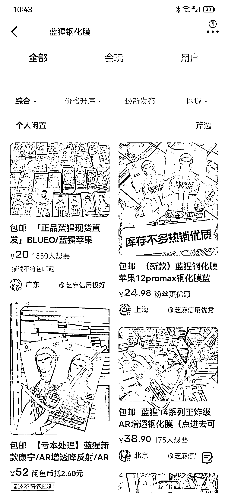
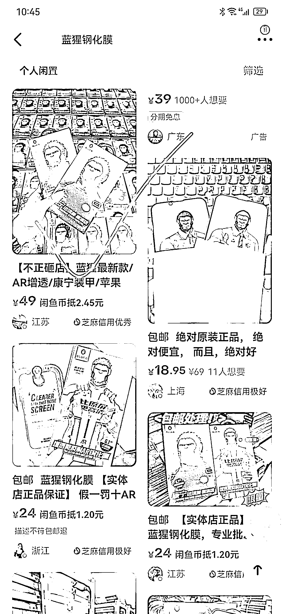
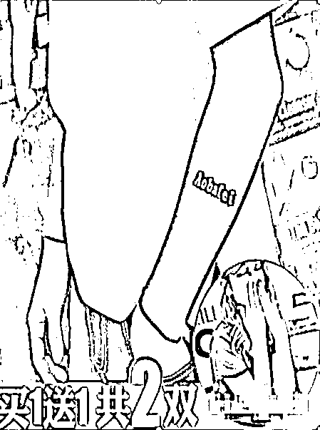
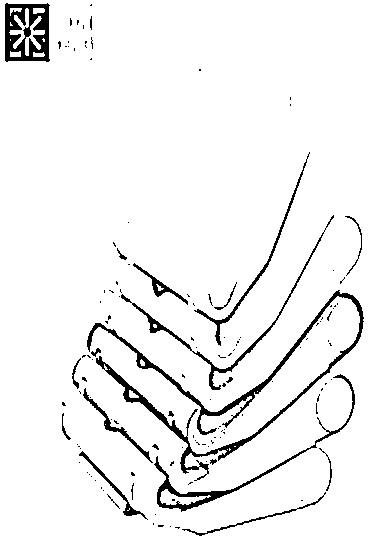

# 《闲鱼 7 个店铺如何霸占前排达到月销千单》

> 原文：[`www.yuque.com/for_lazy/thfiu8/zrsgguy5rbb4u9ts`](https://www.yuque.com/for_lazy/thfiu8/zrsgguy5rbb4u9ts)

## (139 赞)《闲鱼 7 个店铺如何霸占前排达到月销千单》 

作者： 远方 

日期：2023-04-17 

大家好我是远方，很荣幸能在生财上分享 

闲鱼无货源有很多人了解过，但是真正玩明白的人很少，因为新手不踩坑玩不明白，大佬看不上懒得研究，就导致这个领域半吊子割韭菜的特别多，真正理解玩透彻的人少之又少！闲鱼我知识付费一共花了一万五，有良师益友，也有屠龙宝刀  

绝对天花板级别，很少有人比我玩的明白，有点狂哈哈 

发现星球关于闲鱼这块的文章不是很多，有也是比较久远一些的，但闲鱼非常适合互联网新手，更像是进入互联网项目的敲门砖垫脚石。借用闲鱼培养网感，闲鱼这套打法的逻辑和算法规则可以应用到很多平台 。 

很多人应该做过闲鱼也出过单，问下大家知不知道下面这几个问题： 

做好哪些方面才会导致出单的？ 

做好哪些可以做到当天出单？ 

做好哪些细节才能快速持久爆单？ 

爆单后流量下滑什么原因导致的？ 

大多数人不知道，或者知道一点，一知半解不太透彻 

下面我理论围绕实操，让生财里的闲鱼选手打开一个新世界！ 

解释一下，当天出单不是偶尔一个账号运气好瞎猫碰到死耗子，是大多店铺运用了下面的打法都拿到了不错的成绩，是被验证过很多次的，我拿一个产品{蓝猩钢化膜}给大家举个例子，方法可以应用到闲鱼所有产品类目。 

大家可以在闲鱼搜索蓝猩钢化膜或者蓝猩这两个关键词，搜索之后你会看到前排的几个链接 

 

这俩个链接是我的，目前排全国前 5 或者前 10，偶尔也会排到全国第一 

然后你再往下滑 

 

这个链接也是我的，在全国 20 名左右，然后再往下滑 

 

这个链接也是我的，之前排国一的，后面没好好做刷下来了 

然后你只要想，再往下还会刷到，好的时候全国前 10 里面我占 4 个，这叫什么？这叫矩阵 

上架完我就知道这 8 个链接必定有一个爆单，甚至通过曝光和浏览数据可以准确到是具体哪个链接 

## 下面直接上干货 

### 一、关于设备 

在闲鱼官方公约里可以看下，其中的一条“违规关联管控”，意思是什么？ 

同一设备、网络下的店铺如果有一个出现违规，那么其他的店铺也会关联受到影响。 

所以，一机、一卡、一号，是很有必要的， 

还要说一点，不要轻易的更换手机设备，换手机之前要确保这部手机没有在闲鱼卖过东西，不然流量会直接受到影响，这是踩过的坑，切记！ 

### 二、关于养号 

我先说答案，养号就是浪费时间，十来个店铺从来没养过直接上架。 

市面上流传着许多养号的方法论，浏览产品、给别人点赞留言、咨询下单会增加权重之类，这是个误区 

因为这样操作下来提升的是你的买家标签，最大的作用是让系统更精准的知道你买什么产品，以后会给你推更多类似的商品方便你购买。是方便你买东西的，对你卖东西没有帮助 

给别人点赞咨询其实是相当于给别人养号 

产品权重是搜索单个产品关键词的排名，根据 30 天销量、点击率、收藏率、好评率、发布时间等综合评估计算出来的，店铺权重则是客户搜索商品时的排名依据，除了以上商品外还要考察售后、违规、二次访问 

由此得出结论，刷活跃对店铺的权重没有任何帮助。 

三、店铺方向 

做垂直店铺，增加专业度增加信任度 ，不要做杂货铺，杂货铺很难做好信任感 

榜单只要能上榜的都是垂直类目的，没有做杂货的。 

### 四、选品 

主要去围绕着闲鱼卖的好的产品去做，其他平台卖的好的在闲鱼可能不适用，平台属性不一样，闲鱼的用户大多喜欢捡漏 

在闲鱼首页，有一个闲鱼榜单，这里面是闲鱼的一些头部玩家，产品可以直接复制榜单里的 

流量基本不会太差，能上榜单的产品在闲鱼上都是很有市场的，这里暂时不做太多描述，先从闲鱼榜单选品。 

尤其是那种，买家多卖家少的，那种被称之为蓝海产品，竞争对手少，做起来更舒服一些，不过这类产品需要大家去思考。 

比方说一些小众领域，很多人想不到的，摩托车配件、改装件、某热门汽车改装件，这种小众领域中有一群固定人群。 

产品分类 

热门产品：需要卖家有极强的运营能力，懂得如何上推荐位，如何做排名，如何维持排名 

冷门产品：运营其次，需要对产品有极强的了解，冷门产品中的周边产品多思考，产品一定要冷门中带有一定人群 

了解产品 

无论做什么产品，都要先去详细了解产品细节，这个很简单 

1、多多淘宝拼多多问客服 

2、问闲鱼同行套话 

3、抖音小红书了解 

4、百度 

### 五、店铺人设 

1、头像：真实、接地气的，真人头像自带流量，不用网里网气的 

2、昵称：建议昵称和头像有一定相关性 

3、简介：填写宝贝相关内，凸显专业性，做个人介绍，增加人设感觉 

示例 

 

### 六、上架产品【重点】 

爆款八要素 

主要围绕真实，吸引买家购买、抓住买家的心理 

1、标题：标题中必须含有高搜索词，标题开头买家最关心的痛点问题或者激发他的好奇 

作用是：让买家更精准的搜索到我们的产品，搜索到后能够通过痛点问题吸引买家点击。 

例如：最后 20 件卖完下架、厂家清仓、实体店倒闭了，批发价甩卖 

闲鱼上的买家就是喜欢捡漏占便宜，你写的越吸引人，他会感觉能从你这占到便宜 

2、文案：好的文案最大特点就是吸引客户，说服客户 ，吸引购买。营造紧迫感、稀缺感，让顾客感觉占到了便宜 

不需要特别的文采，但是要考虑每句话在客户心里起到的作用，段落整洁，一大段文字瞬间丧失阅读感 

例如：这个桌子图片上 159 的普通款卖光了，还剩几个加固款，最后几个了，痛快的话给您按普通款的价格走吧 

3、图片：最大的特点吸引眼球，尽可能真实，在闲鱼卖产品就是卖主图，你的图片有特点能吸引人，他就会点进来浏览，浏览之后咨询，是个大关键。图片是吸引顾客点击进来的第一要素，不要随便找一张图片就放上去了，糊弄自己。 

4、详情图：最好有代入感，和包装的人设有上下关联，承上启下。 

比如自己包装成工厂，图片里面有工厂图片就更有说服力。 

5、价格：新品的话，比同行第一些，流量稳定后涨价。因为一个新店没有销量和好评，只能拼价格。 

6、发布地址：特产或者地域代表的，比如华强北，首选就发在广东深圳。其他的可以选择发货地旁边的一二线大城市，这样一边可以获取大城市的流量，同时也有较好的发货速度。 

7、标签：标签的作用是介绍图片中的产品 ，关键词下产品比较少时可以用作为替补词，文案是介绍产品的，标签是介绍这个图片是 什么东西。 

8、圈子：有助于宝贝出单，更快累积曝光 

每一节都围绕着买家的心理，吸引买家点击、咨询、下单 

示例 

 

这张图片包含的信息就很多，图片也会说话。 

 

没有中心思路，不搜索支架根本不知道是卖的什么 

 

背景独特也会吸引很高的点击，从而增大流量。 

 

特别权威，真实且有实力 

核心点 

1、三秒原则，让客户第一眼就注意到你 

2、让图片会说话，图片中表达出来的信息 

3、与众不同的背景 

不要老是想着复制同行，要思考如何超越同行 

做好以上这点，尤其是上架的这些细节，你就已经可以超越闲鱼百分之 70 的选手了，因为大部分做闲鱼的基本上都是抄袭复制。 

今天先讲这六节，闲鱼的五分之一内容，明天继续给大家更新，发布之后如何把流量给拉上去，做到全国排名。 

文章占用 5 分钟，感谢大家观看 

评论区： 

Lucia : 前排，坐等更新 货源选择也可以展开讲讲 远方 : 闲鱼的整体逻辑其实就是 抓住买家心理上架产品，提升排名让更多人看到我们，看到后文案图片在同行中脱颖而出，买家被吸引点进来浏览咨询产品，通过话术、店铺人设、好评销量吸引买家下单 远方 : 小事，货源更简单 亿安 : 这个货源怎么找呢？我前段时间也打算搞这个钢化膜，可是看见大佬您的价格后我就退缩了，我找到的货源利润都不行 亿安 : 谢谢大佬，我联系您一下吧 帅子 : 明天发不了贴了 远方 : 啊？为啥 果然靠谱 : 前排坐等更新，希望加入航海