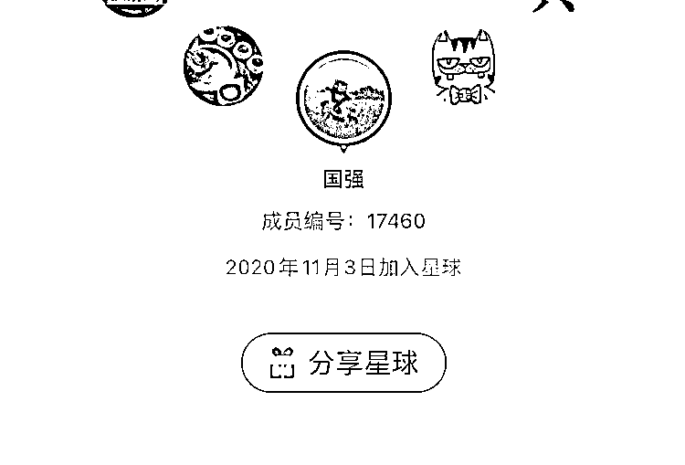
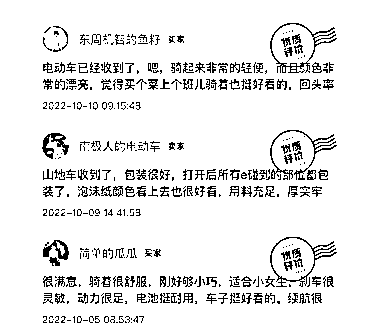

# 《4 年 400+ 店铺闲鱼运营经验—深度总结六问六答》

> 原文：[`www.yuque.com/for_lazy/thfiu8/aks9czar818th0go`](https://www.yuque.com/for_lazy/thfiu8/aks9czar818th0go)

## (111 赞)《4 年 400+ 店铺闲鱼运营经验—深度总结六问六答》 

作者： 杨小六 

日期：2023-04-18 

潜水了一段时间，又看到了很多新朋友，学习的机会又到了！ 

我是在 2020 年 11 月 3 日加入生财知识星球的，至今已经在这里学习探索了 2 年多的时间。当时大家都在等待年度最低价的 418 加入，毕竟当时只享受了半年的时间，当时要不是迷茫感觉自己赚的多，肯定不会当这个：“冤大头”。但是现在，因为通过在生财的学习和实践，提高了认知，让我知道人外有人天外有天，让我赚回了 100 倍的门票。现在回首过去，感谢亦仁老大带给的指点。 

保持空杯心态，努力提高认知。在生财，优秀的人才太多了！ 

我称之为：搞钱中的小清华~ 

  

写下我当时加入生财的故事哈，不怕大家笑话，我 2019 年开始做闲鱼，那时候刚大学毕业，小职业院校，没见过生财这么多优秀的人才， 那时候有 2 个员工加一个我，我是甩手掌柜，同学们还在为了 3k 的薪资按时打卡上班的时候，我收入每月不上班都能过万了，膨胀至极。整天思考吃喝玩乐，不思进取。 

后来看到亦仁大佬 2020 年投放公众号宣讲生财的的时候，提问了这个现在看来特别愚蠢的问题：我这么牛 x 了，月入过万了，我该怎么突破。你有什么建议吗？大概是这个意思，翻之前聊天记录没找到，有点可惜。 

老大说你这样见识太少，需要加入生财来打破你的认知格局。 

我等不了 418 了，连夜买票上车。当天晚上失眠了，原来大家都没毕业就过万了，有些还日入过万，一下像泄了气的皮球。 

幸好我当时年轻，看到高山就想着要跨过去，而不是退缩。 

最开始刚加入确实感觉大家都在吹牛逼，而我是真牛逼。 

经过一番看帖子，大大提高了我对财富的认知，感叹同是圈友，为啥都在秀，我在挨揍。 

发觉自己的渺小然后奋起直追。 

至此我们闲鱼店群规模已经扩大了 50 倍不止。原来加入生财前月入 1 万多点。8 个左右闲鱼店铺。 

截止今天我们团队有 420 个闲鱼店铺在运营。 

公司在山东聊城和山东滨州，随时欢迎大家线下交流探讨。 

目前在测试小红书电商。希望和大家多多学习。 

之前发布一些文章，圈友们会有很多想要入门的，或者刚入门的进行咨询。所以在这里我选了六个比较有代表性的问题，给大家分享一下我的认知，没有写到的问题，关于店铺，关于闲鱼人员管理，闲鱼扩大模式等问题大家可以评论留言，我看到都会做补充。 

一、闲鱼副业还能干吗？闲鱼还能赚钱吗？ 

这个问题小白咨询比较多，任何项目都有赚钱的，都有不赚钱的，要结合你自身的条件，去选择合适自己的项目。 

闲鱼适合什么样的人做： 

基本上主业月入 1w 以上的，我不建议在操作闲鱼了。因为闲鱼本身我理解为人力资源型工作，需要耗费你比较长的时间经历，况且收入副业收入常见的也就是 3k 左右。 

你的主业收入已经不错了，说明你的能力也很优秀，如果有时间可以考虑产出更高的一些项目，在生财多看看项目选择天花板高的，需要偏技术性人才的项目。 

闲鱼适合那些工资比较低，或者全职在家宝妈，或者刚想创业的人入门练手。 

闲鱼如果创业绝对是一个跳板，大家要跳出去，作为入门足够，但是天花板太低，小富即安的思想不要有。 

闲鱼能赚钱，但是不多。 

说真话，闲鱼卖货个人去做天花板一年 15-20 万，必须全职，早上 9 点到晚上 9 点必须在线。手机设备 10 个左右的产出。 

这个天花板，如果货源足够有优势有可能突破，真有优势，我也不建议来闲鱼卖。随便去个淘宝拼多多，都要 200 万产出以上了。 

闲鱼副业去做，因为副业兼职的来说，每个人的时间不同，付出也有差异。 

所以我拿市面上的学员来说，只要还在做的学员，大概有 80％的人，在一月 1000-2000 左右。剩余的 20％在 3000-5000 左右。 

你以为的轻轻松松，或者简简单单。不知道别人下了多少功夫，从事了多少年。 

二、闲鱼选品怎么选择？小百货&大百货？标品&非标品？ 

闲鱼选品，我们对学员说，是按你个人可支配时间选择！ 

不同的产品倾向的运营方式不同，有些产品倾向客服，有些产品倾向运营，有些产品还比较重财务。 

举例子： 

山地车，玩法低价引流，成本 300 元，利润一台 70 元左右。运营基本没事情做，只需要负责，复制粘贴发布产品，因为是低价引流，所以顾客来的络绎不绝，客服就比较辛苦了，每天会有很多的咨询，而且转化还比较低，需要用心的去筛选意向顾客，再让意向顾客完成下单。 

因为每天每个客服出不来几单，所以财务进货也轻轻松松。而且款式比较少，都在一个店铺买，所以比较简单。 

这个产品就是重客服。需要你有长时间很零散的时间进行回复。 

马桶，低价引流玩法，但是利润大，所以同行竞争比较激烈，你需要优化图片，优化文案，优化评价。这个就比较重运营，需要运营去筛选图片，炼丹，上评价，搞定搞事的同行。 

这个咨询不多，但是也非常重转化，因为顾客在你家问的同时也在别家进行询问。所以运营还需要管理好客服， 提高她们的转化率。 

单量出的不多，所以不需要怎么费财务人员。马桶类目比较重运营和客服转化。 

小百货&图书类目     重财务，轻客服运营。 

我们最开始起步是图书和小百货类目。单量确实大，也容易见钱。起步也很快，后来，由于 19 年 20 年的时候，闲鱼的工具不是那么完善，拼多多进货下单，回传单号，都非常费时间，一个财务比价，然后下单，复制地址过去，在吧单号填回来，每天任务量也就完成 100 单左右。 

因为我自己比较重财务，很多时候一个订单，超时退款了，我们当时是看不到的，没有像现在出来待发货，退款中的选项，可能也不多，几十块钱，但是感觉不太舒服，所以要求财务做的比较好，但是 100 多单，如果统计在填上表格，那财务太费人力。 

因为都是一些比较基础的，不需要怎么回复的产品，顾客自己看介绍就能理解百分之 90，所以过来咨询的人并不是很多。小百货客服也比较省事，每天简单回复就可以搞定。 

小百货逐渐就被我们淘汰了，改成了大百货类目。 

大百货比较重客服，因为客单价比较高的话，客服的犹豫和考虑时间比较长的。 

蓝海红海品类的选择，大家自己副业做的话可以看下圈友们分享的闲鱼选品，淘宝选品，拼多多选品等话题，方向和思路都是一样的。 

我们账户 400 多个基本上就几种品类，蓝海市场很难有这么大可以容纳的号。我们基本都是打红海类目。 

号多了  蓝海也变红海。 

写这个问题是想告诉大家，你自己要根据自己的时间来订产品 

考虑上班有没有时间回复，有没有时间进货。 

愿不愿意去研究闲鱼深层次的运营。 

每天固定运营时间是多少 

是打算多少个账户运营。去选择合适自己的品类。没有最好，只有合适。和选项目一样。 

三、很多闲鱼卖家动态都关闭了，看不到具体的产品销售情况，产品销量如何获得？ 

这个问题刚刚在问题求助看到的，给放进来，过年前后，闲鱼最新版就设置了可以隐藏所有动态，不可以删除动态了。 

其实我们再此之前一直在删除动态，单天销量确认收货比较多的时候，我们会删除掉，留下比较少的，你一样不知道我们的销量是多少。 

基础的玩家可能不会设置，高端点的，基本都有办法让你看不到真实数据。 

这里我给大家几个解决办法： 

1、选择一个宝贝，后面有他店铺的总销量数据变化，自己跟踪下就行了，基本就是他店铺我想要变动高的前三名的销量。   根据这个判断一天出了多少单。 

  

2、或者截图我想要数量变化，根据大致产品咨询转化率判断。 

  

3、某一个产品她的店铺卖的多才会屏蔽，直接干也行 

4、总有同行不屏蔽，慢慢找就行了。 

四、闲鱼到底用不用养号？什么叫养号？ 

这个问题基本小白都会遇到，刚注册的闲鱼号，需不需要养号，怎么提高用户权重。 

我用我操作 400 个手机的实操告诉你，不需要养号，只需要基础资料设置完整，头像简介之类的设置好，如果芝麻信用分比较高的话就授权一下，比较低就不用授权！！ 

正常发布宝贝即可，宝贝发布的好，才算真的好 

后面建议每天一键擦亮增加曝光率，还有就是首页左上角有个签到，每天签到并且捞鱼兑换金币，偶尔逛逛闲鱼就行！如果想要账号权重高的话，必须提高店铺转化率。对于来咨询你的客户，尽量让他下单转化。 

转化高，才是提高你店铺权重的核心办法。 

售后少，小二介入的少，是维护你店铺权重的核心办法。 

五、闲鱼有差评如何处理 

之前有过很多了，因为是做无货源，拼多多商家放了拼多多的好评返现卡，导致了评价出现拼多多字样，联系客服进行了删除。 

接下来删除闲鱼差评的步骤 

第一步，打开下闲鱼，找到我的客服，然后开始召唤，不断的发送一些看不懂的文字，随便敲打就行了，中间掺杂着客服与人工，他们在线时间是 9 点到晚上 9 点，其他时间召唤不出来的。 

打的多了，就可以看到下方有召唤客服，点击，客服就会在线和你回复了。 

现在也可以直接输入 12345 发送 会自动召唤客服。。实测好用 

第二步，发送评价的内容，告诉他要投诉评价，投诉的原因，基本上骂人的，宗教的，站外的都可以被屏蔽掉。 

不骂人评价的很少，哪怕一个字都算。就可以提交申请。（不确定能否删除的可以联系我判断下） 

第三步，告诉客服订单编号，客服核对之后帮你登记，就可以了。 

第四步，保存电话通畅，闲鱼通知你评价已经被删除，然后一顿道歉，到现在我们的目的就已经完成了。 

以上就是闲鱼删除差评的所有步骤。 

ps：闲鱼评价是双方评价后会里面上到评价页面。 

会同步更新动态页面，如果差评较多，可以挤下来评价，  因为是顾客评完你回评了之后才会上去，如果你不回评，会等到自动回评之后上去。可以利用这个时间差，找老顾客进行评价，给 1 元红包，20 个人，足够挤下来差评了。 

我们基本出现了之后会立马进行炼丹。3 天确认收货，发一些又臭又长的好评文案，就会被评为优质评价， 

潜在意向顾客基本也不会继续往下刷很多。 

  

六、我想做闲鱼卖货工作室，可以方便问下你们人员怎么搭配的吗？ 

之前写的一个文章我感觉挺有用，确实是我们实打实摸索出来的解决方案。 

另外纯个人再次建议，不要在大城市做闲鱼卖货，不要在大城市做闲鱼卖货，不要在大城市做闲鱼卖货 

重要的事情说三遍！ 

真心希望能帮到大家对闲鱼项目有一个基础的了解，祝大家 2023 在生财提高自己的认知，打开格局，拼命搞钱！ 

评论区： 

梅子 : 好真诚啊，写得很细节，感谢分享[咖啡] 佩佩 : 请问小红书和闲鱼电商是不是也一样，比较适合宝妈这种的？作为兼职的话一个月顶多挣 3000 左右 杨小六 : 不太清楚，建议咨询其他圈友 杨小六 : 感谢梅子🙏 财女小马达 : 真诚分享啊，谢谢老铁 大宇 : 大佬 请问用收发短信的注册卡 注册账号刚注册进去就强制跳实名有什么方法解决吗 杨小六 : 用苹果手机试试，当时我们注册失败用苹果可以进去。别支付宝同步登陆。手机卡不行换线下实名卡。 大宇 : 我就是用苹果手机的 不过是连着 wifi 的 所以一注册就马上跳实名 不知道是不是 wifi 影响的😳