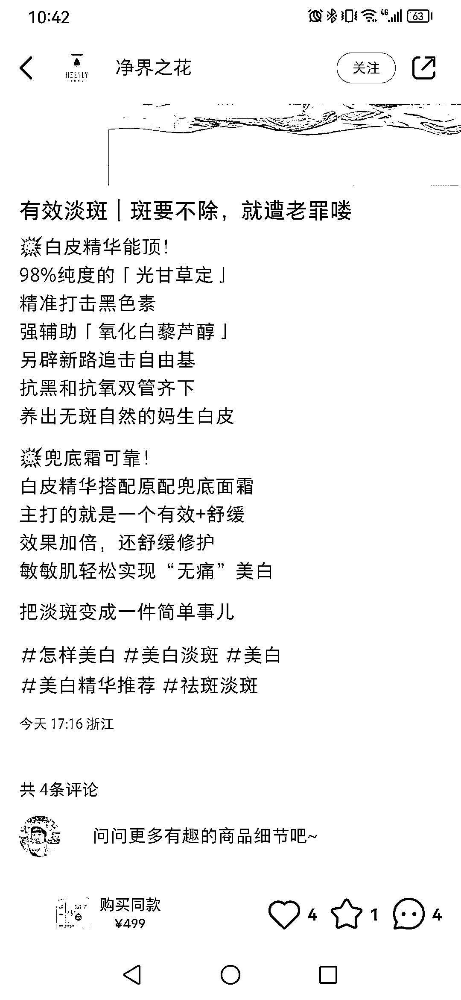
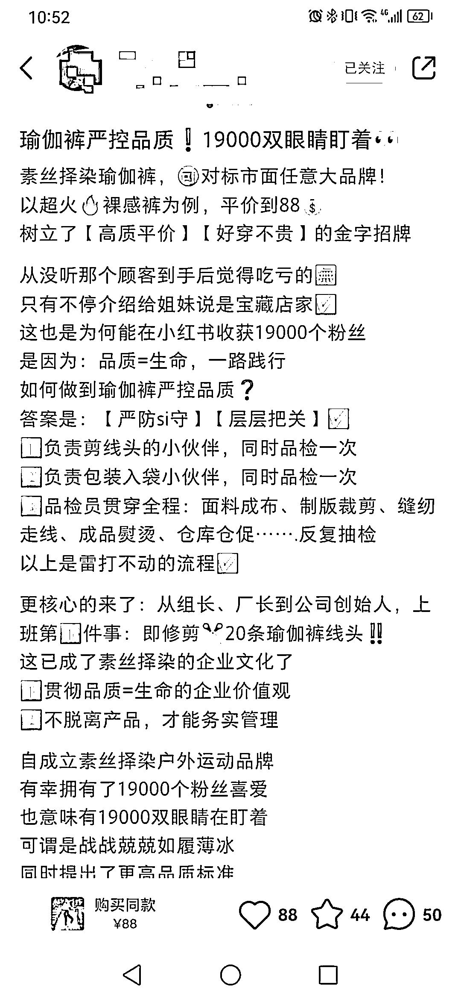
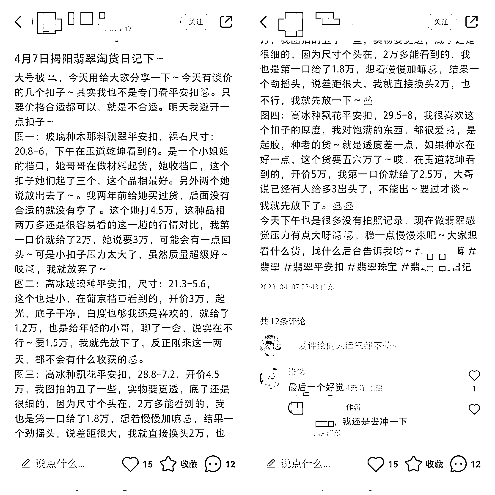
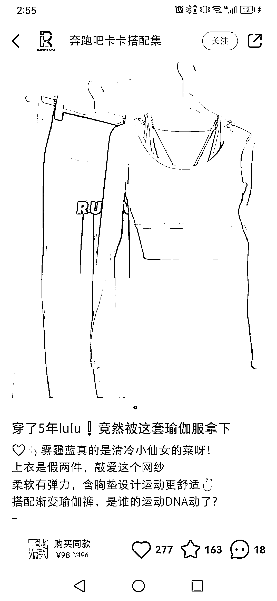
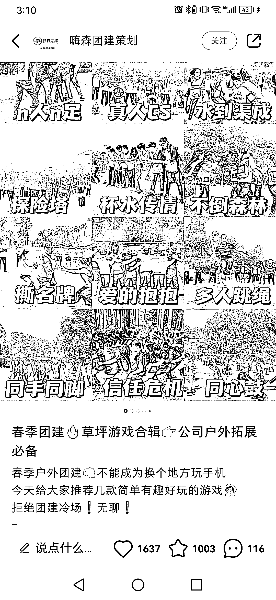
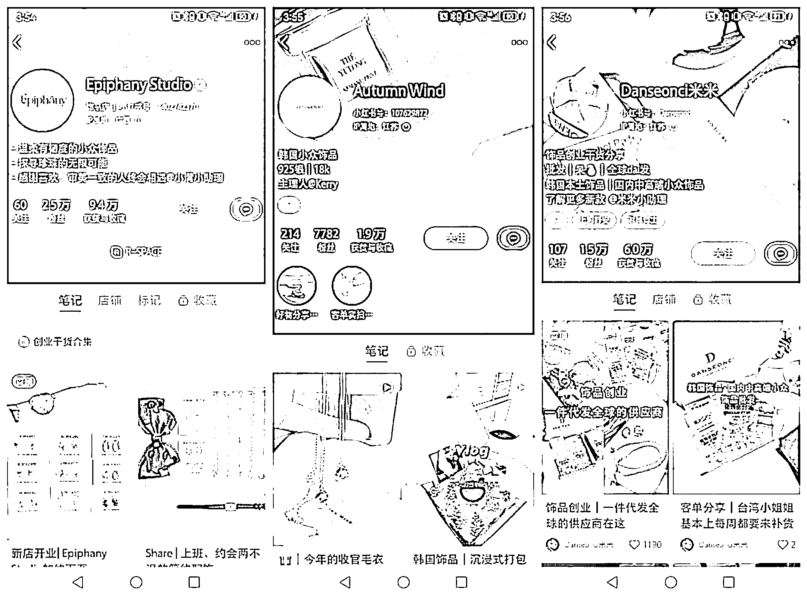

# 小红书 1 篇笔记可以卖货 10W+的文案，到底长什么样子？

> 原文：[`www.yuque.com/for_lazy/thfiu8/wgzle0g86u9qsww1`](https://www.yuque.com/for_lazy/thfiu8/wgzle0g86u9qsww1)

## (134 赞)小红书 1 篇笔记可以卖货 10W+的文案，到底长什么样子？ 

作者： 凯哥 

日期：2023-06-24 

大家好，我是凯哥，这篇文章，主要给大家分享一下小红书卖货文案，与种草文案的最大差异。 

凯哥运营过 300+个矩阵号，累计 10 余个品类的产品，踩了很多坑，不同产品和账号的文案，也有很多不同切入点，和文案的风格形式。我把它们总结了一下，分享给大家。 

很多圈友问我，为什么有的笔记特别火爆，上千上万的点赞收藏，但客户就是不下单，连一个问“怎么买”的都没有？有的笔记只有几个赞，评论区一大堆人都在“求链接”“怎么买”？ 

到底是哪个环节出了问题呢？ 

我们做小红书矩阵号，最关键的地方就是在评论区和私信中，有客户来询单，那为什么笔记爆了，却卖不了货呢？ 

这其实就跟笔记的文案，以及你的文案+人设定位有直接关系了。 

我们先来看这一篇笔记，这篇笔记是凯哥之前给客户写的。它只是一条小爆文，点赞量 270+，收藏 100+，但评论区问“怎么买”、“求链接”的，却有 250+，去掉主号回复的 50%，竟然有 137 精准询单。这样的一条笔记，当时加了 100 多个微信好友。客户卖的是调整内衣，客单价 358，成交近 5w 业绩。 

 

如果开了小红书店的话，估计转化率会更高。 

为什么这条笔记的转化率这么高呢？ 

我们先来拆解一下一条笔记。 

标题：胖女孩的舒适色调，大胸敲显小的调整内衣 

从这个标题，“胖女孩”主要是锁定目标人群，因为穿调整内衣的女生，大多都有些微胖，痛点更明显，筛选出精准人群，这样更有利于产品的转化。 

“大胸敲显小”，是产品的功能特点，锁定“大胸显小”这个用户需求，让目标用户需求更明确。 

“调整内衣”是产品属性，也是核心关键词，通过这个词来定位笔记的标签，也有助于用户第一时间可以感知，这是一件大胸显小的调整型内衣。 

再看笔记内容详情~ 

第一段，简单描述微胖女孩对“大胸围”的痛点，买不到合适又好看的文胸，导致穿内衣容易有臃肿，束缚感，不但没有调整功能，还会导致胸型变形。 

通过“在伤口上撒盐”之后，抛出解决方案，“那是你没试过这 3 款调整内衣”！ 

第二段，将 3 款调整内衣的不同特点描述清楚，每一款有自己的特点，但都是围绕“大胸显小+舒适”来展开，告诉用户“胸大烦恼，穿它就对了”！ 

第三段，最后给客户做一个尺码贴士，引导用户采取下一步动作—买它！ 

我们很多时候，写笔记文案，都会陷入几个误区。 

误区一、自嗨型笔记，卖点越多等于没有卖点； 

要么太强调产品的功能，卖点，一个劲的死吹自己的产品有多牛，完全不考虑你的用户看了是种什么感受？有没有 get 到她感兴趣的 G 点，反正我把功能都写完了，留下客户在风中凌乱。。。自然不会有什么好数据反馈给你。 

为了更直观，请看下面这条笔记的文案 

 

这种笔记文案，作者一定会苦恼为什么小红书笔记只有 1000 个字，因为这 1000 个字都不够他把卖点写全。 

首先讲一堆大道理，生怕用户不知道什么是“胶原蛋白”，其次来 1、2、3、4、。。。把卖点全部摆出来，完全不去考虑用户听不听得懂，记不记得住。最后又回到一开头的语气，没有做任何的引导和钩子。 

这样的文案，就是典型的自嗨型文案，小红书通常也不会给流量，这样的笔记内容，能破 100 个小眼睛，算是给面子了。 

如果过度排列卖点，还有可能会被系统认为是营销广告，不仅没有小眼睛，甚至账号还会被降权，被系统打上营销广告、低质量账号标签，笔记曝光会受到严重影响。 

正确植入卖点的方法~ 

写笔记之前，我们可以先梳理一下，我这篇笔记的主题是什么，如何将卖点切入进来。确定了文案主题以后，卖点其实就非常自然地植入进来了。 

有了明确的主题以后，我们再挑一个凸出的卖点，结合笔记内容，来扩展描述，去印证你的主题，这样就不会显得生硬植入，让人一看就是广告。 

另外，我们也可以把“卖点”变成“买点”来写。 

卖点是站在产品利益上表达，让客户知道这个产品有哪些好处；而买点则是站在客户利益上推荐，让客户可以告知这个产品能帮他解决什么问题。 

举个栗子，行李箱的文案 

卖点：功能多，体积小容量大 

买点：出行很方便，可以装下出差半个月的生活用品，隐藏杯架和挂钩设计，再也不用大包小包手里塞得手忙脚乱了。 

把卖点变成买点，以用户思维去表达你的产品，用户对产品价值的感知会更加明确，因为人都是利己的，你帮他解决问题，省钱，避坑，信任度自然就起来了。 

误区二、太多专业名词 

很多时候，我们听到别人讲很多我们听不懂的名词，我们会觉得这个人挺内行的！ 

但是在小红书上，如果你在文案中写太多专业名词，不但拿不到好的流量，甚至还会被系统判定你是一条广告。 

写小红书文案，我们一定要站在用户的角度，说人话，通过通俗易懂的语言，告诉用户这个对她有什么好处。 

因为她不是做产品的，不懂那些专业，她们只对自己可以理解的东西感兴趣。 

你跟她说这个产品是经过“28 道淬火工艺”，“获得了红点奖”，“人工力学”扒拉扒拉一大堆，鬼知道你在讲什么，客户一点兴趣也没有。。 

 

上面这样的一条笔记内容，看完你想买算我输。什么“98%纯度的光甘草定”“氧化白藜芦醇”，我特么听都没听过，整个文案都沉浸在自己的“专业”里，能听懂的都是“专家”！ 

误区三、没有情绪价值 

没有情绪的文案，就像是行尸走肉。 

优秀的文案，都是有温度的，字里行间都带着“我做的一切，都是为了你好”的情感。 

“姐妹们，我绝对不允许你还不知道这支防晒霜，赶紧去试，防晒效果很绝，关键是透气，肌肤不会闷燥，不好用算我输”！ 

感受一下这条笔记的文案 

 

这篇笔记虽然不是什么爆文，88 个赞，竟然有 50 条评论咨询的。 

文案中主要是通过写“小作文”，情真意切地告诉你，我为了给大家提供“品质瑜伽服”，我都做了哪些工作，字里行间都透露出自己的“负责”，“认真”，“品质”，这些信息传递出来的，就是“靠谱”2 个字，带着一种自我监督的情绪，让人看了就觉得，嗯，值得一试！ 

不管你是做个人账号，还是做企业账号，一定要给自己立个人设，植入自己的情绪，用情绪来影响用户，只有让用户感受到你的情绪，信任的种子才会发芽。 

最后给大家再看个我们群友的账号，他是以一个去档口帮粉丝探货为人设的定位，通过看货，记录自己的寻宝日记。 

文案写的很朴实，没有任何装饰，让人一看就觉得很真实，对产品的描述没有什么专业用语，却能够给人一种非常专业的感觉。 

 

他这个是新开的一个账号，大号前几天因为导流原因被限流了 7 天，之前的数据都非常好，客单价也非常高，都是几万，十几万的微信私域成交，非常值得大家学习。 

 

小红书的 sologan 是“标记我的生活”，官方一直强调，要“真诚分享”，杜绝虚假宣传，过度夸张，以及营销广告。 

写文案其实就是真实的还原我们推荐的本质，价值输出，给到消费者一个有效的参考信息，而不是拿个高音喇叭喊“走过路过，不要错过”。 

看完了前面几个账号案例，下面我们来研究几个让销量倍增的文案方法。 

1、“20 个字符”吸引目标用户 

小红书的标题，一共只有 20 个字符，包含标点符号和 emoji 表情。所以除了笔记主题以外，最容易吸引人眼球的，就是标题文案了。 

之前我们有课程讲了如何写标题的格式，凯哥提炼出来的方法，以及网络上流传着很多的标题风格，都是可以借鉴的，这里就不再赘述了，主要来分享如何提炼吸引眼球的关键词。 

值得注意的是，我们要对产品的足够了解，在产品中挖掘“买点”。 

我们可以先去电商平台上去找一下类似的产品，看一下他们在商品标题，或者详情描述中，有提炼出什么样的关键词。 

比如如下这款减肥产品 

 

“甩掉小肚腩”，或者“边睡边掉肉”这种简单轻松的减肥方式，是很多女生做梦都想要的效果，这样的商品标题，非常粗暴地戳中了懒人减肥的内心。 

我们可以在标题中，将“甩掉小肚腩”这样的动词，加到标题中来，就可以得到如下标题： 

亲测有用！甩掉小肚腩的 xxx！不节食哦！ 

当你找不到产品的效果词时，不妨可以去搜索一下类似产品，用这个方法来给自己积累词库。 

这 20 个字符的关键作用是“引起用户注意”，唤起用户“预期效果”，可以是卖点，也可以是买点。 

2、引起用户购物需求 

我们的文案的另一个关键作用，就是触发用户的购物心理。做矩阵号跟做博主号最大的区别也在此，矩阵号主要以产品为导向的文案，字字紧扣商品；博主号更多是讲个人体验，分享攻略。 

我写了上千篇小红书笔记，也观察了上千篇企业号的爆文，发现容易卖货，转化率高的几个文案套路。 

1）产品比较法 

我们对熟悉的产品，在脑海中都会有一个“标的”参考，有一定的认知，这样我们可以对该产品加以类比，让人们对这个产品有个比较，就会趋同和固定的认知，可以让客户非常直接地对我们这个陌生品牌建立起初步的了解。 

 

上图是一个不知名的瑜伽服品牌，他的标题文案 

“穿了 5 年 lulu！竟然被这套瑜伽服拿下” 

作为健身瑜伽界的女孩，基本都知道“lululemo”这个瑜伽服品牌，简称“lulu”，它是瑜伽服品牌中的标杆，一听就懂。拿自己的产品跟 lulu 去类比，用户心里马上就有了认知。 

当用户看到，一个穿了 5 年 lululenmo 的人，竟然也买了这款瑜伽服，我也会下意识地想看看，到底是款什么神仙瑜伽服，对它的款式，功效，特点有种想了解的欲望，并且也产生有一种跟风，想要购买的兴趣。 

这就是比较法，用一个大家熟知的产品跟一个不那么熟悉的产品来做比较，简而言之，就是用熟悉的产品去解释陌生的产品。 

2）场景构建法 

我们常说的内容，就是“人货场”。 

小红书笔记中，最让人欲罢不能的就是场景的构建，通过使用场景，刺激用户产生购物需求。 

找到产品的使用场景，让用户把自己装进去，联想到自己正在体验这个产品。 

 

我们可以用文字，或者图片，来帮助消费者构建一个想象场景，引起用户的场景联想，一家人在户外玩游戏，旅游，住在静谧、风景优美的惬意酒店，触发用户也想来一次这样的旅游体验。 

 

对于榨汁机，我想大家都不陌生。 

我们在文案中可以把使用的场景描述出来，“夏天可以喝冷饮，吃雪糕”，当然，还可以自己动手榨水果汁！ 

每天一起床，榨一杯果汁，榨万果汁盖上瓶子就可以去上班了，可以一边上班，一边喝，岂不乐哉？ 

让用户自己脑补出还在被起床气困扰的时候，可以喝上一杯亲手做的甜蜜果汁，一天的心情都会美美哒。 

这样的生活场景，会让用户快速联想到，这是一种多么“高品质”的生活和状态，必须安排！ 

3）营造理想自我法 

在现实生活中，我们都非常渴望被别人认同，都想要活成自己喜欢的样子，也渴望活成“别人的样子”。 

营造彼此的认同感，是搞定用户的“必杀技”！ 

满足客户“理想自我”的需求，要比满足“现实自我”的需求，更有杀伤力。 

如果你的产品，或者服务，可以帮助用户做一个精神上的提升，帮助她实现她想要的样子和状态，那么，我们在文案中，可以多尝试用这个方法。 

比如，每一个小红书女孩，都会渴望有白皙嫩皮肤，那我们的文案关键词可以这样写“养出嫩白牛奶肌”、“逆龄 10 岁”、“秒变光滑鸡蛋肌肤”、“嫩到滴水”。。。 

比如，每一个女孩都想要有一个理想的好身材，我们的文字，可以这样写，“D 杯秒变 c 杯”、“喝出梨形身材”、“穿出 S 身材”、“瘦成一道闪电”、“抹出细嫩大长腿”、“超显腿长”、“穿出高级感”、“穿出大圆胸型”。。。 

 

让用户看到理想中的自己，并让她感受到我们的这个产品，可以帮她实现她的梦想。 

这些词汇，都是可以在同类型的笔记中可以找到的，我们平时一定要养成搭建“词汇库”的习惯，看到别人爆文中，比较有感觉的关键词或者短语，就拿个小本本记下来，在我们写笔记的时候，就可以信手拈来啦！ 

3、设定人设，善于写“小作文” 

人设法其实就是写“小作文”，把自己包装成一个产品的创始人，一个创业者，一个绘本创业的宝妈。 

这类的文案，一看账号本身就有信任度，有认同感，在小红书账号和文案里，小作文的方式一直都屡试不爽，转化力 yyds！ 

给大家分享几个善于写“小作文”的账号，一起感受一下！ 

 

这几个账号都是以人设法的方式来创作笔记，通过分享自己创业历程，以及描述自己怎么做产品的，真实“真诚”分享，来赢得用户信任。 

其中，最值得注意的是，人设包装的方式，最容易营造情绪认同，塑造一个负责任，靠谱的形象，转化力自然就暴增。 

前面讲的那个做珠宝翡翠的账号，也是用的这样的文案方式。 

最后再总结一下，具有超级卖货能力的文案，一定要有情绪价值，不只是把产品功能做个流水账，通过产品比较法、场景法、和营造理想自我法来把产品“买点”嫁接进去，水到，就渠自成了！ 

我是凯哥，一个做了 3 年矩阵号的草根玩家。目前做高端女装有 200+账号，年产值 2500w+，其它产品也有在测试，希望能给到做小红书的朋友一些交流启发。 

评论区： 

悦佬 : [强] 兑兑 : 超用心的分享，谢谢[呲牙] 红日 : 非常棒的分享 希声 : 666 书豪 : 很棒 战实 : 凯哥，你的文案真实可以改变用户的行为，直达下单的行动👍。作为一个想要精进营销文案写作的人，能否指点个方向。 凯哥 : 哈哈哈，我只擅长小红书卖货文案，其他的还没尝试过呢，不知道能不能帮到你。。。 凯哥 : [抱拳]