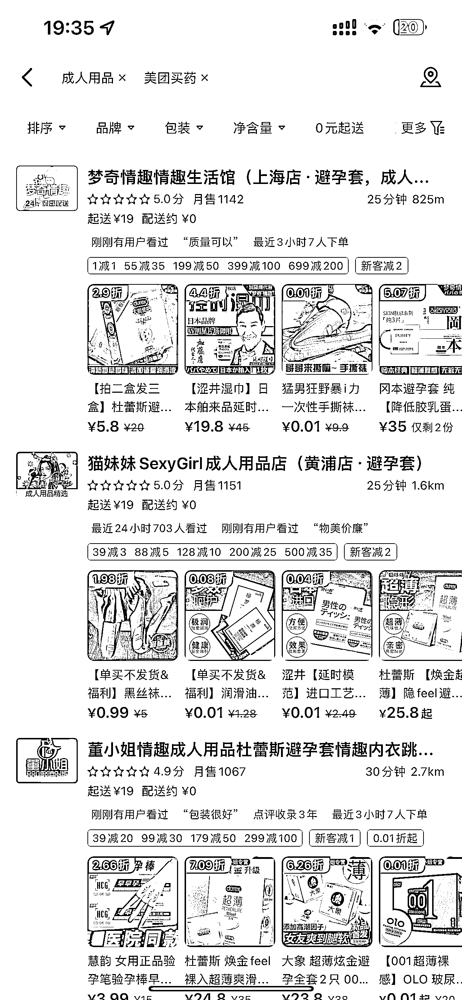
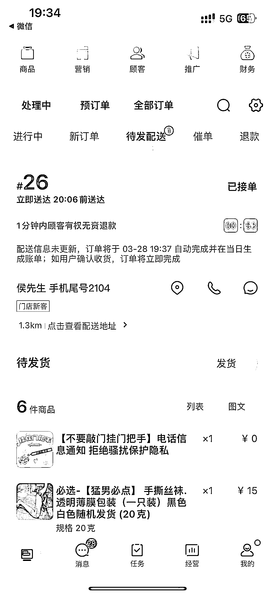
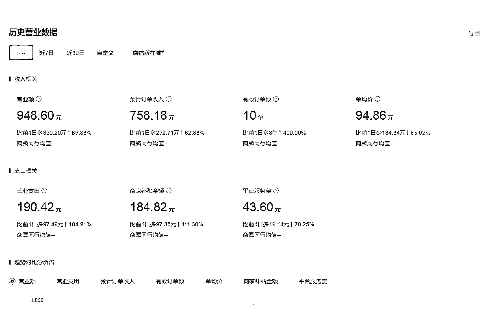
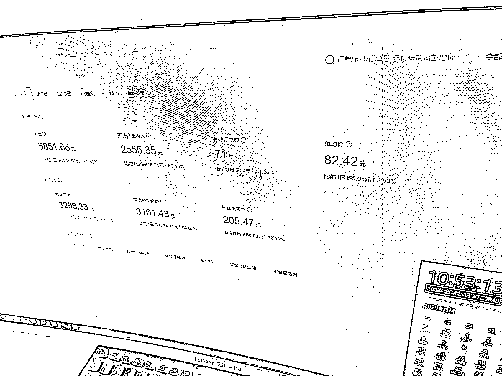

# CR 用品外卖到底赚不赚钱？做了 2 个月的经验来给大家分享下！

> 原文：[`www.yuque.com/for_lazy/thfiu8/ryykmnucw86ulh59`](https://www.yuque.com/for_lazy/thfiu8/ryykmnucw86ulh59)

## (45 赞)CR 用品外卖到底赚不赚钱？做了 2 个月的经验来给大家分享下！ 

作者： Ao 阳 

日期：2023-06-23 

     大家好，我是阿阳，一个来自哈尔滨创业的 95 后，主业目前从事通信行业，在做手机号卡，已经有 2 年多的时间，今天给大家分享一个目前在做的一个副业项目，年底的时候，朋友聚在一起，了解到了这个成人用品外卖店的项目，感觉是一个不错的蓝海项目，前景还是不错的，并且他那边做的很好，我这边年后开始做，目前把 2 个月的经验以及这个行业到底赚不赚钱分享给大家！ 

1.  项目形式及前景 

 

上面的数据是我这边本地，以及一些夜生活比较丰富的城市的一些店铺数据，哈尔滨这边做的好的普遍的话都在 1000 多单，大家都应该知道这个行业，是一个非常暴力且冷门的项目，利润高达几十倍，这个利润在 65%-75%左右，平均单价的话在 60-80 左右，1000 单毛利润在 6w-8w 左右，纯利润应该在 3.9w-6w 之间，这个项目还在于能够及时送达，去电商平台拍下发货要 3-5 天，多数人而言应该没有提前准备的这个习惯，也算是这个项目的一个优势，再就是需求量很大，这个数据也在增长，大家可以搜搜自己所在城市的店铺销量，目前这个行业竞争小，外卖隐蔽送达保护隐私确实解决一些后顾之忧，目前线上女性用户占比大，有可能都是觉得很不好意思，外卖平台完全解决了客户的顾虑！完全解决了用户的痛点！ 

  

（ps 不太行凑乎看吧） 

目前这个行业竞争小，利润大，投入小，需求大，而且随着社会的发展进步生活水平的提高以及思想上的更开放，未来会越来越多的人选择外卖店铺，这个市场也会越来越大！ 

  

  

  

（大学城店 周五周六会爆单哈） 

1.  项目需要的准备 

营业执照  场地在家或者找个车库 10 平米左右就可以，人员 2 人 白天晚上倒一倒 负责接单装货等外卖小哥来取货就可以了  晚上的单子会多一点，凌晨过后也会有订单，一个人有点熬不住，再就是货品品类，可以看其他家店铺作为参考！ 

1.  项目的核心 

选址问题：百度地图有热力图，可以看到人群热度，但是你所在的城市，其实你更熟悉，哪些区域街道有：临时性的成人用品需求（比如夜场周边、酒吧一条街周边等，大家可以发散思考） 

运营问题：不少人觉得没做过外卖平台，没有运营经验，可以去先找个靠谱的外卖代运营公司，自己也要去一点一点学习，最好的老师就是同行，找附近卖的最好的成人外卖店，然后，把销量高的列下来，把好的品记下来，去别的位置开店的话可以比他便宜，（这里并不是建议大家在价格上恶意竞争，也算获得流量的一些小技巧，可以离他家店铺远点哈），再就是一定要跟着做的好的店铺学习，模仿他！慢慢学习，数据也就会越来越好！ 

如果之前有过外卖运营的经验，上手可能会很快。 

希望这篇文章能够帮助到大家，对这个行业有一个更深的了解！ 

1.  最后 

作为一个副业，基本上跑通了，还是不错的，感觉前景还是很好的，比较适合夫妻俩，或者宝妈，一些刚创业的小伙伴们，对于这些群体很友好，投入小，利润高，目前准备开第二家店铺，选址中，（目前这边消耗的精力太多了，毕竟还有主业，打算交给家里人来打理了）数据很多在这里就不跟大家分享太多了，图片太多太乱，这也是目前做了 2 个月的一个心得，如果这篇文章对你有帮助，欢迎交流探讨！ 

评论区： 

饭饭 : 感谢分享！ Mr_Fei : 哈尔滨同城认识下[微笑] 四方小慢慢 : 等了好久，终于有人介绍这个了 🌸Tough Gir* : 这之前星球应该有好几篇内容的 四方小慢慢 : 啊，我都没发现，我看的都是无人售货，然后推销无人售货机的[流泪]