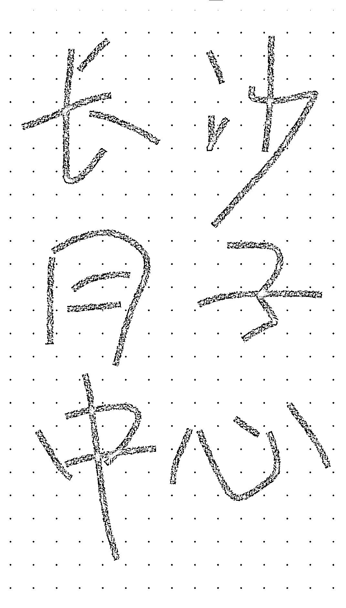

# 同城高客单在小红书玩法分享

> 原文：[`www.yuque.com/for_lazy/thfiu8/hc91mzfvfslty97a`](https://www.yuque.com/for_lazy/thfiu8/hc91mzfvfslty97a)

## (78 赞)同城高客单在小红书玩法分享 

作者： 西猫仁 

日期：2023-06-15 

最近在小红书操作同城高客单的引流，目前跑通了整个流程，分享给大家。 

首先要说明的是：同城高客单不是涨粉逻辑，是吃评论、私信逻辑，只要关注一个点：加到微信的用户有多少。粉丝量没有意义，所以我们所有的操作都是围绕这个点来进行。 

第一步 注册养号 

注册养号，生财的帖子很多，说说我的方法 

用数据流量注册，前期不连 WiFi，注册时候只选择自己行业相关的标签话题，注册好后刷大约 20 分钟，关掉。 

我这里用长沙高端月子中心举例。 

隔几个小时再打开，搜索行业关键词：长沙月子中心、长沙月嫂、长沙产后护理等，只看不互动，刷半小时。注意：做本地同城的，搜索关键词一定要带上城市名。 

第二天，继续搜索行业关键词，开始互动，点赞、收藏、评论，互动几个帖子就行，多刷多看，尽量模拟真人用户操作。 

第三天，看账号推送的内容是否大多是自己行业的内容，如果是，就养号差不多了，再继续养 1-2 天，账号就成了，可以准备发帖。 

第二步 打标签 

其实养号也是在打标签，只不过打的是用户端的标签，还没有打上内容端的账号标签。 

目前这个账号在系统那边会认为是关注这个行业的真人用户，但是还没打上内容端的标签，如果你直接发行业内容，其实系统是不知道怎么给你推荐的。只能给你瞎分发，这样数据就很差，流量起不来，因为系统推不到你的目标客户。 

所以这个时候要借助同行以及热心群众的力量！！！ 

这个是真干货，要记住! 

首先，一定要发问问题贴，什么意思？就是要发行业相关的问题，目的是让同行和热心用户来帮你解答，达到打账号标签的目的。 

还是用月子中心来举例子。 

标题：长沙哪家月子中心好啊？ 

内容：一张手写的图片就行。如图 

 

文案：宝子们，7 月的预产期，最近打算去看下月子中心，长沙哪家月子中心好啊，价格不错服务好的，求推荐求介绍啊。 

如果你之前的操作没问题的话，发了这种帖子，会有同行主动过来留言，还有就是热心用户过来留言说哪家不错，哪家不好等，也会有真实目标用户过来收藏点赞。 

这样你的内容端标签就慢慢打上去了，然后看账号情况决定下一步，如果互动数据很少，第二天继续发，内容标题类似就行，可以换一个区，比如长沙开福区哪家月子中心靠谱，求推荐。注意，封面图重新写一张，不要用相同的图。 

这样，你发的帖子数据就会很好看，系统把你的标签打上，系统会判断这是一个真实的用户而不是营销号。打好标签后，你的内容就会推到目标客户那边，这时候，就要发针对目标客户的帖子，举个例子：集美们，最近有打算找月子中心的吗？我们可以抱团取暖，交流一下，针对性考察。 

这时候观察你的帖子下面有没有目标用户过来留言，如果有，那账号就成了~ 

第三步 干货分享 

这时候你的账号标签没问题了，你随便发啥系统都会帮你推给目标客户，当然不能乱发，要进一步提升信任度，开始发行业干货了。还是以月子中心举例，内容素材直接在小红书上搜，比如：月子中心和自己在家坐月子的区别，月子中心要注意什么，怎么挑选月子中心等，把内容整合一下发出去，观察一下赞藏数据，数据不错的话，账号就大成，可以引流了~ 

第四步 引流 

引流笔记有 2 种思路。 

第一种是维持之前的人设。 

我们打标签发的帖子都是模拟真实用户来发的笔记，所以引流笔记还是用真实用户的人设，发布的帖子可以是对比同行、实地考察等从价格、环境、售后服务、口碑等角度植入我们的门店信息。 

举个例子： 

姐妹们，今天我去考察了 4 家月子中心，第一家在河西，环境不错，就是价格太高端了，我不配。 

第二家在河东，环境、服务不错，价格不错，目前偏向这家 balalala 

第三家 balabala... 

第四家 balabala... 

就这样发，发完这种帖子后，一般就会有目标客户评论 or 私信你，求推荐第二家，这样就可以私信用户给用户推荐，留自己家的微信，给销售去邀约、到店转化就成了。 

后续再发帖思路就是姐妹们我定好哪家了，姐妹们我入住月子中心了，姐妹们今天在月子中心吃的月子餐等等等 

这种人设的笔记，完全模拟真实用户，代入感强，信任感强，且这种高客单价的项目不会大规模爆量，私信直接发微信号都没什么问题，我做的一个号，发了 1 个多月微信号了，也没被屏蔽啥的，平均每天 3-5 个流量，一个月 100 多个目标用户加到微信，关注的粉丝也才 30 多个，所以不要看粉丝量，最重要的是评论和私信。 

 

这种真实人设账号的缺点是账号周期短，比如月子中心，从准备找月子中心到最后坐完月子，账号周期就完了。好在完全不需要担心素材问题，可以重新起账号，再走一遍这个流程，这种账号权重极高，即使不更新了在话题标签里面也有很高的排名，引流能力极强。我有个账号，2 个月没更新了，还不断有用户私信过来求推荐。 

引流笔记还有第二种思路，直接用商家人设。 

前面说到账号打好标签了，除了模拟真实用户还有就是直接用商家的角度写，因为打好标签后，发的内容会推到目标用户那里去，所以直接发硬广，注意：骚操作来了，把关注我们的同行全部拉黑，防止举报。发布笔记可以是硬广+行业干货，大约 1:2 的比例去发，然后慢慢把前面为了起号打标签发的帖子隐藏起来。 

这种账号周期长，引流没那么快，但是精准。 

以上就是我做的同城高客单小红书玩法全分享，有不懂的地方可以找我交流。这套打法可以用在任何高客单的项目上面，月子中心、美业、家装定制、月嫂、培训、驾校等。 

评论区： 

天使陷落 : 问个问题，为什么把关注你的同行拉黑了，它就无法举报你？ 西猫仁 : 系统不会把我们的笔记推流给拉黑用户，你更新啥的他不会知道，当然如果他开小号还是可以举报的，这种就没办法了。 Andy : 搜索里面搜到笔记还是可以看见笔记的 龙斯克 : 问个问题，在小红书上做“上海落户”这块好像和你说的这种有点像，我尝试了 2 周，发了十几篇笔记，但阅读量、点赞数都很少，想向您请教。 西猫仁 : 不看阅读量和点赞，私信和评论怎么样？没有的话，就是账号标签没有打好，按照我的方法全部走一遍 龙斯克 : 评论很少，就五个人私信过，其中 2 个是求合作的，3 个简单沟通了，也没有加成微信。我不是以客户的口吻来写的，而是已专业知识分享的方式写的，好像效果不行，我看再起个好，用您说的客户的口吻写是不是好点，新开号，需要用另外一个手机来做，是吧？ 龙斯克 : 到有几个收藏了笔记，估计觉得我说的对他有用，所以收藏了。 干饭人！到饭点啦！ : 能否请教一下真实人设的引流环节的模式跟话术呢？[抱拳]其他的部分大受启发，就是这个引流环节，我没能想好怎么样的模式跟话术能顺利过渡让客户加上微信