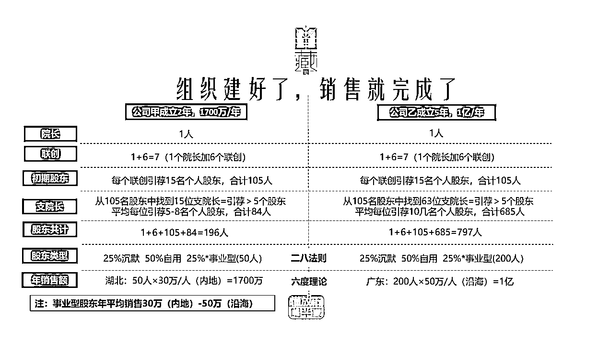
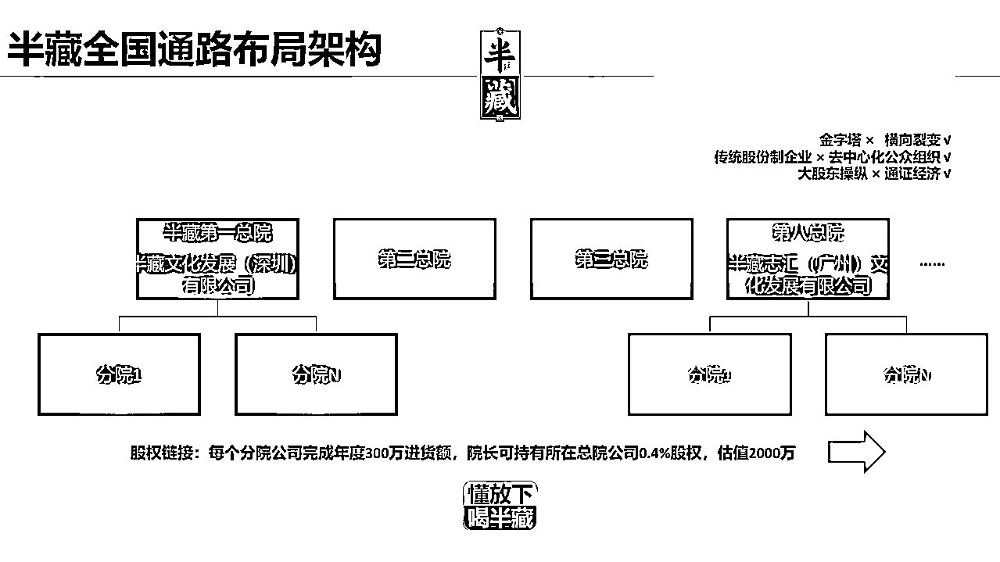
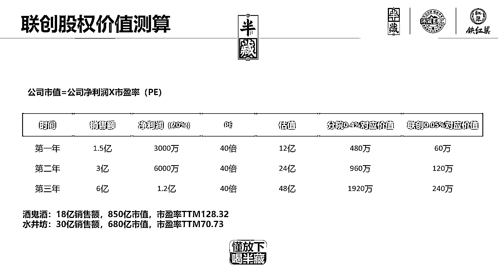
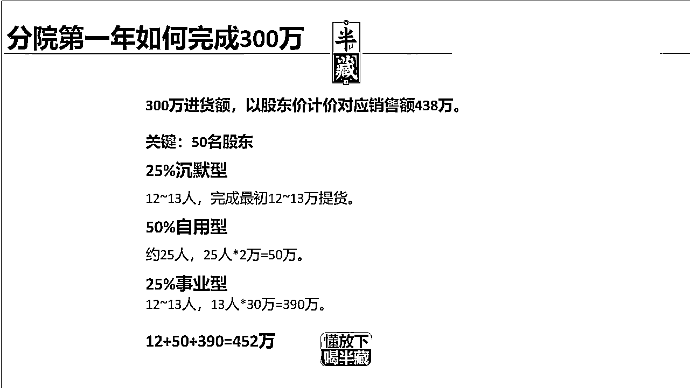
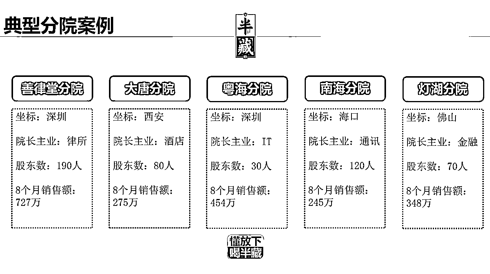

# 入局半藏酱酒项目半年，我是如何做到分院社群会员 50+，销售规模破百万的？

> 原文：[`www.yuque.com/for_lazy/thfiu8/pa052hgu8uqf23n4`](https://www.yuque.com/for_lazy/thfiu8/pa052hgu8uqf23n4)

## (精华帖)(59 赞)入局半藏酱酒项目半年，我是如何做到分院社群会员 50+，销售规模破百万的？ 

作者： 温钟奋 

日期：2023-06-14 

大家好，我是阿温，生财 2 年圈友，前世界 500 百强企业中层，一直在通讯行业摸爬滚打 20+年。 

一个新品牌酱酒 2020 年 9 月成立，20 位初期发起人，短短 13 月全国搭建 700+分院，7 万核心消费者参与共创，订单金额突破 6 亿。 

今天我分享 2021 年 12 月底开始加入半藏酱酒项目，并成立了分院，一句话概括是：半年分院社群会员 50+，销售规模破 100 万。 

我个人虽然一直是一个销售，但是几乎不爱醉酒，偶尔也喝一点，属于啤酒就一个易拉罐就满足的人，但是为啥走上了做社区卖酒之路呢。 

本人已经 40+，在通讯圈也摸爬滚打 20+年，身边人大多也是各个品牌方区域负责人，行业老板，时不时也参加一些饭局，大家经常都会带一些定制酒。 

久而久之，大家几个朋友就讨论是否自己也做一款，我们分析了一下，目前做的好的社群就大概也就是 49 坊，酣客，和新起的半藏。 

49 坊发展已经 6-7 年，起点相对要求较高。 

半藏又开放开盘不久，加上创始人大多也都认识，尤其和八总院的刘辛一总之前也是多少年同事，对政策大致有个了解之后，我们就开始了南京建邺分院的建立。 

这是半藏搭建一个分院的指引模版 

  

我们于 2021 年 12 月 20 南京建邺分院成立，我们就汇集了 10 个联合创始人，大多都是通讯圈的朋友，或者生意上的朋友，熟悉多年。 

启动之初我们每人出资 5 万合计 50 万，并约定半年之内每人发展 10 个股东，很快我们拉到 30 个个人股东并于 2022 年 1 月 8 日在南京同庆楼开启了分院成立庆典。 

由于 2 月是春节，每个股东投资 1 万购买一万酒水，很快我们一季度销售的就接近 80 万。 

# 一．销售架构的成立 

  

  

半藏品牌之下是 10 大总院，总院院长大多是半藏联合创始人，各个总院对下发展分院，总院类似传统意义的省包，每个总院由一个院长+（6-10）个联合创始人，大家地位平等，每个人对下发展的分院，有一套多劳多得，按劳分配的保障机制。 

通过短短半年，半藏在广东设立至少 5 个总院，在厦门，杭州，上海，郑州，北京，成都，西安，北京等地成立了总院机构。 

迅速的完成全国大省的布局，加上半藏品牌 20 个创始人大多在联想服务多年，除了有丰富管理经验，还有丰富的渠道资源和人脉，能够很快就搭建起几十个分院，快速起盘，并形成规模，并在过程中不断裂变。 

以我所在 8 总院例子，联创黄安置开始也是在某优鲜做投资总监，闲空时间参加先做了 2 个分院，觉得不错，拉着前同事刘辛一加入，在 2012 年 3 月成立 8 总院，并快速搭建创始人团队，2021 年就完成了 50 个分院的建设，实现销售目标 3000 万。 

映射到分院，也是一个院长 +6（n）个联合创始人，大家对下发展各自股东，分院价进货到股东提货有大致 30%利润，为联创利润，这，股东还可以按照会员价卖，大致也有 25%利润，会员价之上是京东零售价做标杆，总体股东价市京东零售价的 4 折左右，这样大家感觉喝的有面子，喝的实惠。 

# 二、销售业绩的达成 

（1）做起来的首要核心是认知到了酱酒的黄金产品属性（五点），基于这个属性，只要找到消费者并形成社群，就可以搭建类似 M2C 的商业模式。 

（2）然后才是搭建社群的能力，初创者的影响力，职业背景造就的职业能力 。好的初创团队实际上节省了初创项目早期的投入风险，或者换句话说，自带天使轮资源甚至 A 轮资源，自然启动容易和成功率高。 

（3）最后是合理的众创模式设计，既符合通路的规律，也满足众创参与者预期，商业利益角度，完美兼容通路的利益分配和众创者的利益分配。 

可能这一点事半藏最创新的地方，引进了期权的概念，即分院一年达成 300 万销售额就可享受所在总院的 0.04%的期权，这一创新性的招募理念，在第一年一下子激发了市场的热情，同时第二年年底第一总院接近有 50 个分院获得了行权，样板的树立，更是让大家看到了希望。 

除了传统酱酒推广 3 驾马车：贵州酱香之旅（封坛），品鉴会，体验馆，半藏创新的推出了股东期权的概念，让销售变得更加丝滑，这也是半藏能快熟崛起的杀手锏。 

按照约定，每个分院在成立的第一年只要提货达到 300 万，就可以拿到所在总院的 0.04%股份，联创一边卖货有批零差，一边还有未来上市的巨大红利，坚持做几年，有可能获得巨大财富。 

这也是分院能快速成立，并驱动联创快速招纳股东的强大引擎。 

  

  

分院成立之后，有了联创，接下来就是日常的运营，品鉴，拉人加入，这是半藏给与的一个指导。 

53 度酱酒需要推广，尤其在江苏本来有洋河国缘等强势地方品牌，公务宴请基本都是洋河国缘，我们分院推广主要是在社群内推广。 

推广就需要不断拉人品鉴，讲品牌故事，其实这是最难的环节。 

由于疫情的来临，过去两年聚会相对少，所以我们分院做的不算太成功，不过也有做的非常成功的，最早我们有两位联创是厦门的前同事，考虑到地缘太远，他们整合了资源在厦门发展，短短半年也孵化了 6 个分院，年销售业绩过千万，合肥一个做过酒水的前同事成立的分院，短短半年也做到了 600 万销售业绩。 

我总结了一下，分院要成功达成 300，至少分院院长要全职做，像我这样兼职玩票的只能是玩玩，最后是没发拿到总院的股份，也就是无法分享未来的上市红利。 

  

  

# 三、一年心得 

我们南京建邺分院经过过一年运营，后期疫情的关系，加上大家觉得 300 万比较难达成，就放弃了总部的期权，放平常心运营。 

但是也有不少优秀的分院达成了年度 300 万的业绩，例如第一总院，第一年就有近 50 家达成年 300 万的销售目标，实现了行权。 

我个人感觉如果要达成 300 万目标，还是有不小的挑战，至少需要分院长全职来做，兼职比较难达成。 

另外一个利好是，通过半藏分院的运营，股东的聚餐，聚会的确多了很多，有利于生意上的合作，分院内部也有不少股东，联创之间达成了生意合作，这也是半藏所倡导的。 

# 四、过程中的经验分享 

白酒产品拥有典型的关键意见消费者 koc，同时天然具备社交传播属性以及分享体验场景。 

当传统白酒企业企图自上而下用关键消费者口碑作为小盘来带动市场大盘时，半藏模式直接把关键意见消费者和种子用户变成利于共同体，并改变了厂家和渠道商的链接关系，白酒渠道营销模式及用户交互方式因此重构。 

做好一个酱酒需要 

A 保持初心：酱酒，只要守住大曲坤沙 12987 标准工艺，只要能扎根茅台镇核心 7.5 平方公里产区采用这里的水、粮、曲、窖，酒都不会差。 

但全国好几万个圈子酒，真正能做到的恐怕只有 0.1%却并不多。 半藏创始团队大多来源于前联想高管，大多都是行业精英，对品质，供应链，渠道管理，品牌管理等方便有较好的积累。 

B 快速上规模：酱酒做不大，源头上就拿不到好基酒，难以坚持做出好酒，成本和费用也下不来。消费者就更感受不到品质和性价比双高。 

很多酱酒初心也不错，很快能力守不住初心，品质下滑正是因此，毕竟酱酒需要 3-5 年的发酵，今年卖的事好几年的前的库存，这对资金和运营有较高的要求。 

C 专业能力：做圈子酒看似容易，却真正难在品牌，营销，渠道，资金的整合能力。半藏，仅仅一年多时间快速逼近 7 亿。 

而酱酒市场目前格局是，除了茅台习酒郎酒，其他酱酒品牌数以千计，大多也就几千万到一亿，过 5 亿已经算是优秀，可以进入行业前 20 名，想从中杀出，这就考验运营，营销，资金，供应链整合等等。 

IT/通讯行业曾经是中国商品流通领域的通路缔造者，联想人在通路领域积累了丰富渠道经验和合作伙伴积淀，通路，终端，运营等经验相对传统酒商属于降维打击。 

所以半藏 2020 年 9 月成立，前 13 个月建立了 10 大总院，20 位初期发起人，全国搭建了有 700+分院，7 万核心消费者参与共创，订单金额突破 6 亿。 

D 私域玩法：社群玩法用这几年的互联网词汇描述叫私域营销。虽然不走传统商超，酒桌之外很少能看到，但随着核心消费者裂变和流量汇聚，现在能见度越来越高，并溢出到达公域。 

所有的生意，本质都是流量生意。 

评论区： 

韫椟 : 模式厉害 李林洆 : 厉害。 帅彬 : 京东卖的不错这酒，没试过，喜欢酱香类 静水流深 : 老谢跟我是很好的朋友，半藏酒不错，那个字念藏经阁的藏[呲牙] 亦仁 : 感谢分享，已加精华。 温钟奋 : 感谢感谢 温钟奋 : 缘分 吃瓜群众 : 18939969117 加我认识下