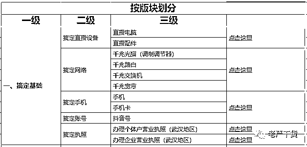
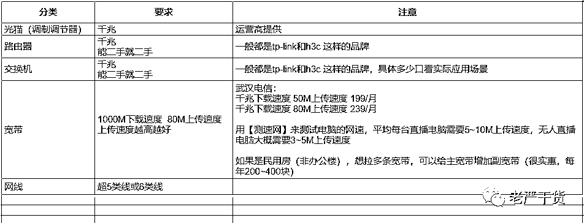
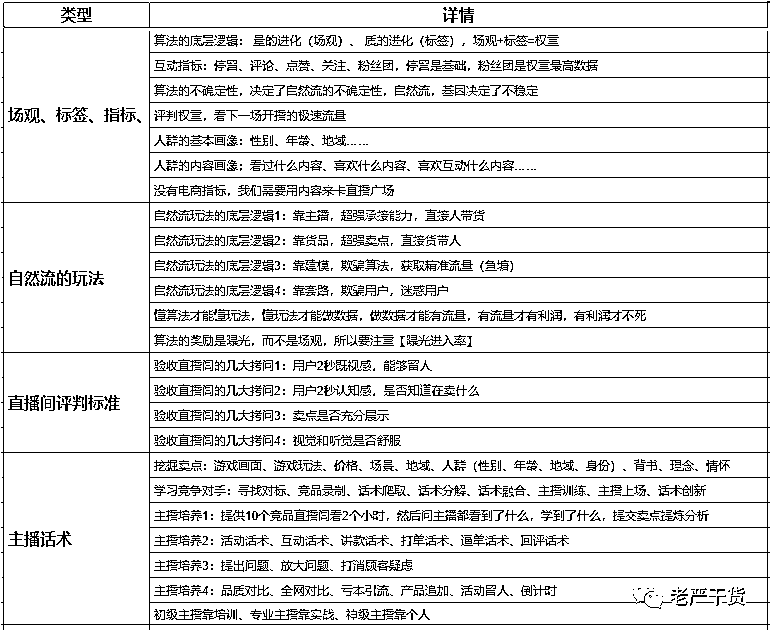
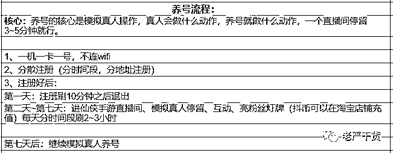
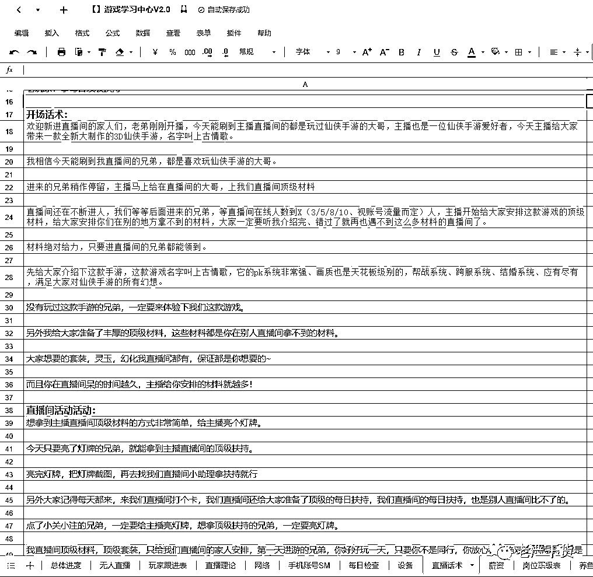
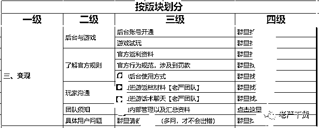
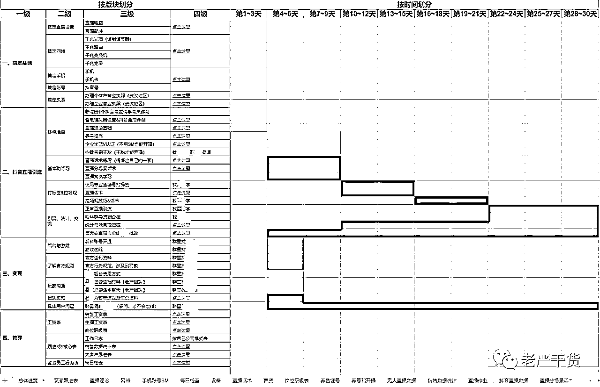

# 手游充值 CPS 项目拆解

> 原文：[`www.yuque.com/for_lazy/thfiu8/maf5304oe2lhfq88`](https://www.yuque.com/for_lazy/thfiu8/maf5304oe2lhfq88)

## (18 赞)手游充值 CPS 项目拆解 

作者： 老严干货 CPS 

日期：2023-06-16 

#   

自己团队做手游充值 CPS 项目，正好做了 1 年时间，去年写过几篇文章，介绍了项目的基本情况： 

https://t.zsxq.com/0fObxA62R 

https://t.zsxq.com/0frz3Wjrd 

但之前介绍的都是偏理论，今天上更多干货，截图了很多内部文档，全文 4000 多字，如果算上截图里的文字，估计大几千，分 2 部分继续写一篇长文分享： 

Ⅰ、项目实操干货拆解 

Ⅱ、为啥有的团队做得好，有的做不好？ 

Ⅰ、项目实操干货拆解 

分类逻辑有且仅有 3 种：按版块、按时间、按程度。接下来我会【按版块】来介绍这个项目内部资料的截图。 

一、搞定基础 

  

只有准备好了这些，才能开展项目，只要做过互联网项目的，这部分都是很简单就能完成。 

1.1、关于直播设备 

 

我们搭配是这样的： 

每位主播用 5 个抖音号直播，每个号每天播 1 常场，这样总共播 5 场，每场 50 分钟左右。 

每位主播设备清单:   N 个工位 + 5 台电脑主机+ 5 部安卓手机+5 张电话卡+ 2 台显示器  + 1 套外设（集线器、键盘、鼠标、摄像头、麦、灯）。 

电脑是租的，为了省钱，外设都比较便宜，也是为了省钱，我们直播画面大部分是游戏界面，用【直播伴侣】进行直播，对外设要求并不高。链接部分我打码了，没必要展示，大家要找到淘宝同款非常简单，看照片、参数和价格就好。 

1.2、关于网络 

 

我们直播项目最需要的不是下载速度，而是上传速度。 

一般来说千兆网上传速度 50M 左右，一台电脑你把清晰度等各种指标拉满大概占用 10M 上传速度，一条网最多支持 5 台电脑同时做高清直播，一般情况没必要这么多同时在线，因为公司会拉多条宽带。 

一旦拉了千兆网，后续所有配套全都要是千兆，我建议能二手就二手，不能二手再考虑买新，省钱嘛，不寒酸，把钱花在刀刃上，后面会说刀刃是啥。 

1.3、关于手机、账号、执照 

就不用截图细节了，这些大家自己去弄就好，都不难，该买就买，该注册就注册。 

二、抖音直播引流 

 

这是整个项目的核心部门，从软件环境准备，到能开播养号，到练习基本功，到正式开始起号，到数据统计，贯穿整个项目。 

2.1、环境准备 

核心思想就是先注册 1 个抖音号来练习话术，这个号就是准备播死来练习话术熟练度。 

模拟器设置和直播伴侣设置太长了，如果放进来就是一堆图片，太占篇幅，这些大家基本可以通过百度找到，不难。 

直播理论这东西有点玄，只有做过直播了，再总结才是自己的，否则你看来跟没看一样： 

 

养号流程比较简单： 

 

本质就是进行一些操作，让平台觉得你是一个正常的号。 

接下来就是半蓝认证和上千粉，详细操作百度可以搜索到，我就不截图了，都是开播前的必备条件，只有这 2 个条件搞定了，才能开播。 

上面这些都准备好，那就可以开播了。 

2.2、基本功练习 

一般来说，如果做过直播项目，才需要练习这个基本功，有直播能力的，这部分是直接跳过的，能省很多时间，上来就直接进入核心部分。 

说白了，就是给你一个麦，一台电脑，你能不能完成：连续 1 小时不间断激情满满地介绍游戏，尤其是直播间没有人的时候。 

有些人在这关就倒下了，因为直播间没人，心态就慢慢变差，也不愿意说话，最后心态就崩了。 

我给大家截图部分话术，可以看看主播在直播间的开始阶段在说什么。 

 

不过话术归话术，这只是第 1 阶段，这个熟练以后只能说可以开始上播了，距离引流还差很远很远。 

有些人只会背这些基础话术，不会根据实际情况去灵活调整，不能整理成一套自己的话术，那基本也做不好主播。 

我们有新主播入职的时候，也会把老主播录制的视频给到她们去下载学习。 

2.3、打标签&拉场观 

到这一步，才真正考验一个主播能不能起来的关键。 

首先要有个基础操作，我们得让平台知道我们是播啥内容的，俗称【打标签】，打好标签，好的，恭喜你，你直播间已经能做到每小时场观 100~200 区间，而是都是比较精准的粉丝。 

但是就这点场观，播 1 个小时也引不了几个人，再下一步就要【拉场观】了，把每小时的场观拉到三五百或更高，这时候只能靠主播本身的魅力了。 

我前面不是说【钱花在刀刃上】么，主播就是这个刀刃，如果主播魅力不行，那即使 ta 会全套操作，引流到私域的人也寥寥无几，反之，那结果就很乐观，所以招聘主播的底薪一定要高，远高于你做普通项目时招聘的客服和销售。 

原理很简单，在我们手游直播行业，直播间价值=主播价值+产品价值 

普通操作你懂我懂别人也懂，游戏你能代理别人也能代理【独家代理的游戏这里不讨论】，所有团队都还是站在同一起跑线，那抖音怎么知道要把流量分配给谁。 

对，还是要看直播数据，就是所谓的留存时间、评论数、新增关注、粉丝灯牌之类老掉牙的指标。 

如果你家主播没有足够的能力或魅力让客户喜欢 ta，那前面的动作就算再完美也无济于事，留不住人，数据会很拉胯就没有更多自然流。 

绝大部分好多团队就是倒在了这一步，ta 的直播间没意思，ta 的主播提不起观众的兴趣，精准客户过来直播间就划走了。 

而【一个人有没有意思】【能不能让别人喜欢】这些魅力，基本已经定型，就是 ta 前几十年的性格与人生阅历总和，几乎没法培养，企业也没这个财力去培养 ta，所以主播只能靠筛选，没法靠培养。 

就好比在饭桌上，一群人吃饭，那个最能调动现场氛围的人，ta 的这个【调动氛围】的能力，绝大多数人就不具备，而且也培养不起来。 

大部分的团队会死在这一步，老板入场的时候有多激情，离场的时候就有多凄凉。 

这里我花了非常大量的篇幅，就是想告诉没有做过直播项目的团队，直播这个事很难，难在哪，为啥很多团队进来就死了，还赔了不少钱。 

做过直播且通过直播项目赚钱的老板，这些认知已经具备，手上的主播上来就能干活，要学的只不过是后面项目变现环节，这个就简单很多了。 

2.3、引流统计交流 

能搞定【打标签】和【拉场观】，现在已经可以往私域导流了，最常见的是两种方式： 

第一是通过粉丝群，主播把客户往粉丝群引，粉丝群里放个小号发二维码图片，不过小号容易封，你需要准备一批小号，而且你所有直播的号都需要完成个人实名，否则没有粉丝群功能，这里又难倒了一批团队。 

第二是通过预约卡片，用户填手机号（一般都绑定自己微信），我们销售主动添加就好，如果添加不上就配合主播在直播间问对方准确的微信联系方式，这个方式不需要账号实名，只需要完成半蓝 V 认证就好，嗯，还是免费的。 

导流到私域后，至于统计数据、交流啥的，都是简单流程，做了自然懂，不赘述。 

三、变现 

 

如果能搞定引流这个环节，恭喜这个项目已经成功了 90%，是的，后面的变现环节，你肯定能有进账赚钱，只不过是效率高或低的问题，而随着时间的拉长和经验积累，你的效率肯定会越来越高。 

首先对游戏要懂吧，有哪些玩法，哪些功能，哪些流程，玩家在游戏里是怎么一步一步获得爽感的。 

然后游戏后台也要了解，怎么看数据，怎么给客户发材料，这个很快就能学会，对于玩家来说我们就好比是拥有金手指的上帝。 

再就是了解游戏的价格体系，怎么卖材料道具，不同的道具卖多少钱，接待的玩家多了，自然会熟悉。 

当然，遇到具体问题，一般会在项目陪跑群里直接私聊沟通，也比较容易解决。 

四、管理 

 

剩下的是一些基础管理问题，工资怎么发，岗位职级怎么定，如何设定员工的工作行为标准，如何监督检查等等，这些都是通用技能，每个公司都有自己的玩法，带过团队的基本都会这些，不多赘述。 

前文都是【按版块】进行介绍，最后附上一张项目全景图，也有【按时间】【按程度】的逻辑。 

 

右边的时间条类似于【甘特图】，就是什么阶段做什么事，有一个清晰规划，这就是时间逻辑，另外颜色越深代表这个版块越重要越难掌握，反之越容易掌握，这就是程度逻辑。 

无论你做不做直播项目，都希望这次分享的干货对你有帮助，毫不夸张地说，这是我们花了几百万沉淀的成果。 

Ⅱ、为啥有的团队做得好，有的做不好？ 

今年年初跟一些团队开始合作，我们公司提供几个人 【团队 v 团队】拉群陪跑，给大家汇报一下结果，有好有坏，整体上，好的占比要低于坏的，好的团队差不多总 GMV 百万左右。 

 

这是其中一家公司发给我的打款明细图，每周结算一次，因为我这边是提分公司 10%的充值收入，所以他们的游戏总充值 GMV 接近百万，收入 80w 左右。做的不好的团队成绩为 0，还亏损了一些人工设备场地等开支。 

好跟不好的差距太大，我就一直在想，为啥有的团队能做好，有的团队做不好，我接下来应该找什么样的团队合作，最后总结了几点经验： 

1、直播是一项复杂能力，很多团队没有这项能力 

不论是直播带货还是直播引流，无论是自然流还是付费流，【直播】难度都要大于【客服】、【运营】这些基础能力。 

很多团队以为只要勤奋就能学会这项能力，其实不是的。 

这么说吧，【用英语跟外国人沟通】是一项复杂能力，读完大学的兄弟，都学了 10 年以上吧，结果呢，有几个人能跟外国人正常沟通。 

再比如，【练出一身腱子肉】是一项复杂能力，但是大部分人，可能就买几个简单器械回家练练，或者办一张健身房年卡，然后，就没有然后了。 

团队如果要掌握直播这个能力，学习成本巨高，需要投入不少时间去研究学习，可能两三个月，可能半年一年。我们团队花了 5 个月时间，期间是亏钱状态，投入很长时间同时也意味着投入很多钱。 

对直播项目一定要有敬畏心，如果打算好好干直播类项目，一定要做好【几个月亏钱学能力】的最坏打算。 

2、团队不具备直播能力，做直播类项目失败率至少 80%。 

如果团队做的项目主要是淘客、店群、撸货、短视频混剪、抖店这类，没有干过直播，那刚开始转做直播项目，成功率低的可怜。 

2019 年~2020 年，我周围很多淘客兄弟去做抖音的项目，当时大部分人做的还不是直播，而是短视频带货，结果 90%的团队都亏了。 

后来也跟很多老朋友聊他们做过的直播项目，大部分都比较凄惨。 

3、啥叫具备直播能力？ 

简单点说，就是团队曾经通过直播的方式至少持续 3 个月赚到过钱。 

如果钱都没赚到，那就是能力还差一些，肯定有哪些路径没有跑通。 

一旦跑通一个直播项目，再去做别的直播项目，就触类旁通了。 

4、一旦具备直播能力，就会打开一扇新的窗户 

直播是一把锤子，你有了这把锤子，你看任何项目都是钉子，从此以后【公域直播引流+私域高客单变现】这类项目就都比较容易复制。 

就好比只要你通过在淘宝开店卖货品 A 赚到过钱，你就拥有了一种电商开店卖货能力，让你到任何一个电商平台，换个商品 B，就算从 0 开始，你都比那些从来没开过店的人更容易赚到钱。 

上面是我做项目以来的心得经验，希望对大家有用！ 

评论区： 

刘海龙 : [撇嘴]有幸见过几个大佬做的游戏 cps 项目，每个月收入都是几百万的，这也是我目前能接触到最赚钱的项目了