# 视频号定制产品七天3.5万佣金，怎么做的

> 来源：[https://ahbod9jk6n.feishu.cn/docx/AHYMdjjtrosYPYxcfVZcau6Lnkc](https://ahbod9jk6n.feishu.cn/docx/AHYMdjjtrosYPYxcfVZcau6Lnkc)

# 一、探索初期：两次失败的选测品经验积累

# 二、初步正反馈：模仿热门视频，成功开出第一单

# 三、及时复盘：直播间单日佣金一万+

# 四、项目复盘：抛砖引玉

大家好，我是小鹿，三期的老圈友了，距离上一次发帖已经两年多了，《2020年我是如何通过抖音小程序赚到40万的》https://t.zsxq.com/0efjGyoOo 不禁感慨时光飞逝啊。今天聊一下二月份我是怎么通过视频号定制品，一周销售额九万多，佣金三万五的。在此非常感谢瓜哥（@甜瓜）的帮助，让我理顺了转化流程，优化引流成交话术，及时复盘，极大的提高了转化率，减少流量流失。

# 1.探索初期：两次失败的选测品经验积累

2022年3月份视频号后端带货，微信小商店，在多个社群星球火热起来，起初我注册了营业执照开了店铺，没有深入研究。后续看到越来越多的圈友在视频号带货这个领域做出了成绩，八九月份摩拳擦掌想试试。

在初期，我看了大量关于视频号带货选品的文章，有了一个大概的认知。但由于迟迟没有实操，纯空想，对带货视频和产品的认知浮于表面，仅根据自己主观臆断，自认为某个产品好某个视频不错。

没发几个视频，没做几个账号开始内耗起来，没流量没出单，拿着手机后台反复看，焦虑起来，而后看到这个人做出了成绩觉得好牛逼，那个人做出了成绩好牛逼，心慌慌。拿到结果的人，各有方法，听的再多看的再多，空想没有用，我决定不想了，先踏实实操再说。以我当时的认知，主要靠刷视频号视频，刷直播间，找那些我能直接上手的产品，高大上的直播间暂时做不来。

第一款产品水草鱼缸，我当时自信满满跟对象说，这个产品别人能做起来，我肯定可以。实际上，我的直播间搭建不吸引人，没有话术，视频流量惨淡，直播间场观越来越低，最终草草收场。

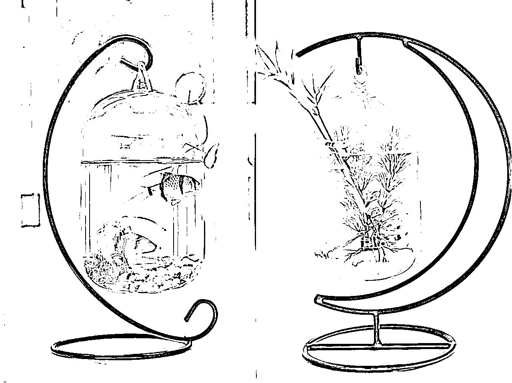

第二款产品，鲁班锁马蹄铁等益智玩具，看到一个博主每次直播益智玩具都几万场观，视频平均点赞也有大几百，看了几次直播，我马上拼多多下单买样品，又信心满满的发视频开始干起来。下班后连续直播一周，直播场观两三千，弹幕偶尔一两条，但就是不出单，开始对视频号带货有些畏手畏脚了。

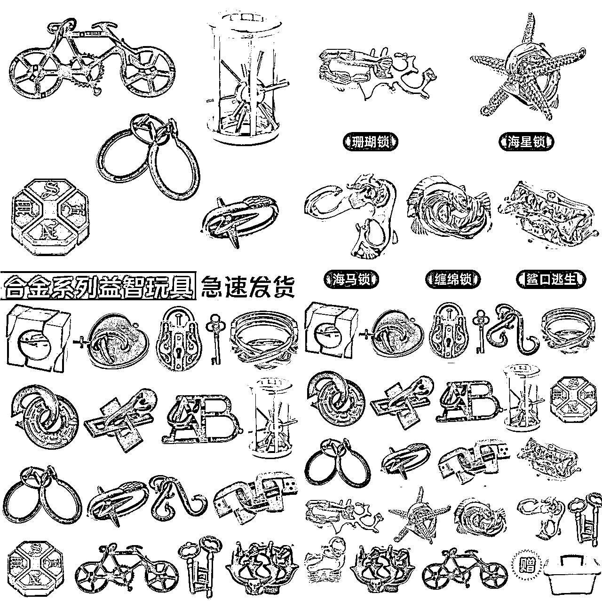

# 2.初步正反馈：模仿热门视频，成功开出第一单

有了前两次选-测品-直播的经历，我开始谨慎起来，不依据自己的主观判断选品，让数据说话，分析各个平台爆过或者正在热门的产品。用自己小号拉了个选品群，刷到认为不错的品记录下来。

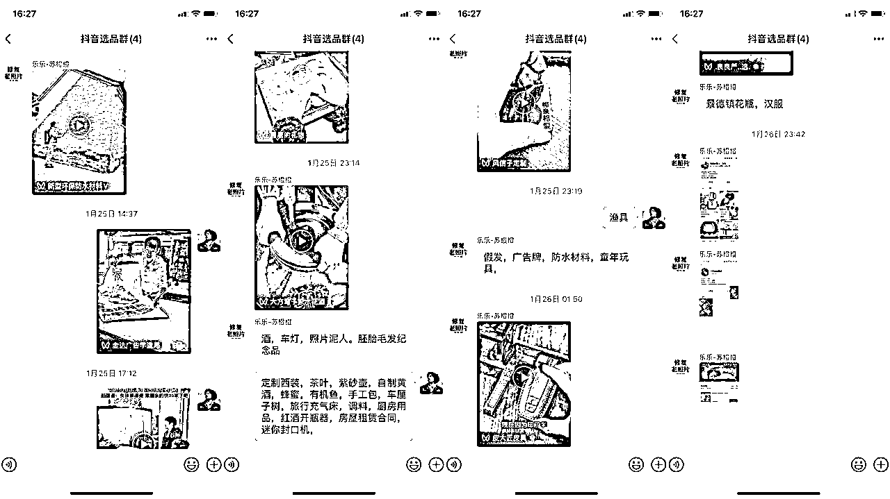

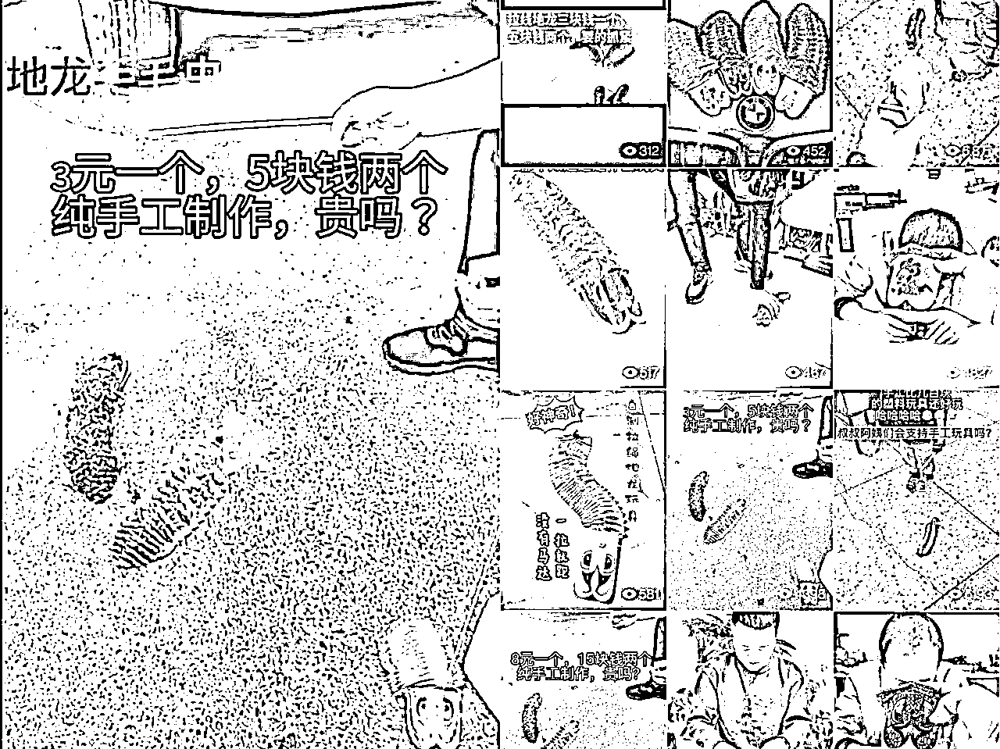

当时风向标里面有个人发了个帖子，是关于拉线地龙产品的视频，一个地摊前，一群人围观老人玩拉线地龙，文案：纯手工制作，3元一个5块两个贵吗？这个视频抖音热门了，有人搬到视频号也热门了，评论区大量的“怎么购买”“在哪下单”“赶紧上购物车”......

需求有了，我开始抖音小红书快手查找视频，直接搬运，联系后端谈分佣上品，播放量还不错，大几千上万，奈何素材实在有限，全网一共20几个。我开始做原创，陪小朋友玩耍的同时录制视频，文案脚本直接模仿。视频播放虽比较平稳，但没有超过十万播放的，开直播流量少，样品展示又不直观，难以出单。

好在这一次逐渐找到感觉，通过视频号私信成功出了第一单，我对于选品和视频有了一些认知，很直白平白无奇的产品展示视频很难有大播放量，视频要有吸引人观看，想购买的冲动的点，我选择找其他产品继续做。

延续前面的选品方法，我刷到一条黑檀木吊坠定制视频，点赞两万，评论两千七百条。

评论区又是大量的“怎么定制”“多少钱”“怎么下单”，用关键词在抖音快手搜索，发现这一块的需求还挺大，多条视频下面出现了“想买"等字样，拼多多的销量评论数也很多。

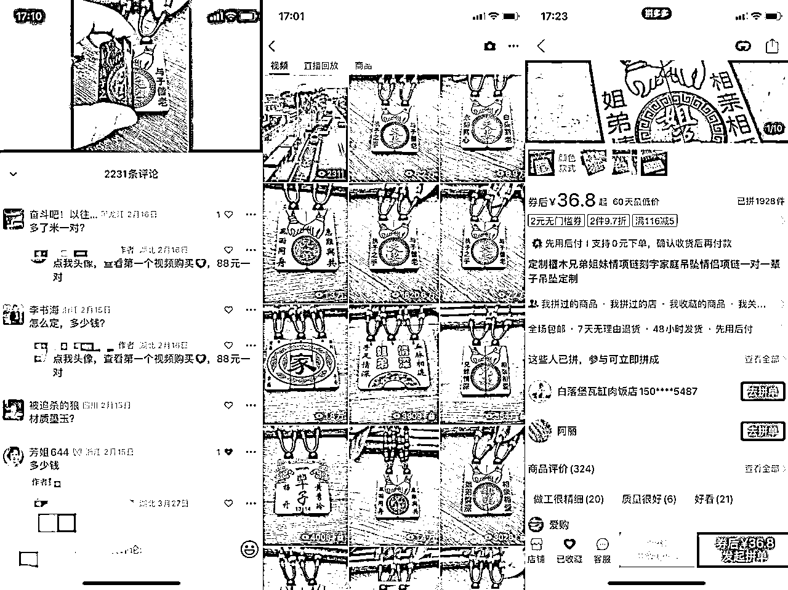

隐约觉得这个品不错，拿出纸和笔记录下来，视频号上已经有的视频，里面出现过的人名，帮助我从抖音筛选视频，避免重复搬。正反馈来的非常快，当天周日晚上搬运半小时后，就有四五人私信想购买，成功出了第一单。

打工人最大的痛苦莫过于一天假，周一又得上班，我存好了20条视频草稿，有空的时候发一下，上班时眼看流量从20万跑到一百万，心里干着急，下班回去后台一两百条私信，逐条回复完，此时直播预约达到两千人，开启了直播，在没有商品的情况下，想尽办法引流到微信，还好没给我判定直播间违规。只转化了几单，当天共一千元利润，我觉得转化率太低了，于是联系视频号后端@未来 上品，他没有饰品类资质，错品类上链接商品审核失败了，他让我赶紧去联系有视频资质的店铺，感谢生财圈友友好帮助。我先让他用微信小商店继续上品，我发链接或者二维码给客户下单，结果转化率依然很低，还不如导流微信成交

这里说两个小技巧，对象想到的，为了尽可能避免添加好友频繁，她只通过有意向要付款下单的客户，后续流量下降了再通过好友，营造朋友圈二次转化

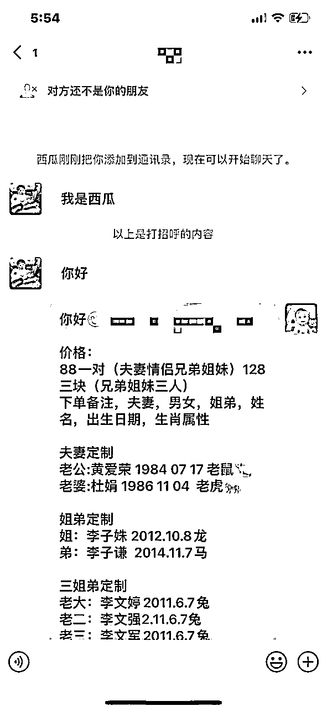

第二个小技巧，讯飞输入法快捷回复，可以添加快捷回复，还可以建立项目分组，比如我做过的项目老照片修复，光盘录像带修复，吊坠定制，可以建立三个项目分组，非常方便，处理99+私信时效率极高，强烈推荐

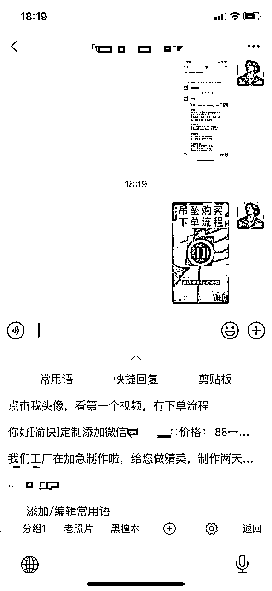

# 3.及时复盘：直播间单日佣金一万+

在瓜哥的指点下，我和对象优化了引流成交话术，想办法上品和搞定置顶视频，每天做直播优化和复盘

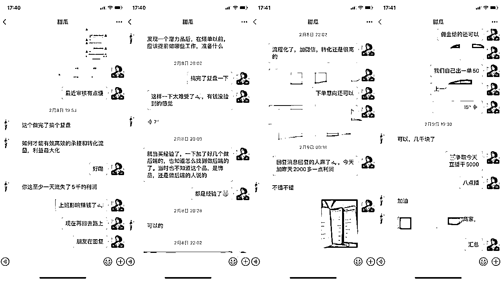

首先，在后台我去私信了四五个有饰品资质的店铺，说明来意，历经万难终于找到合作的后端了，视频号小店又审核近一天才成功上品，挂链接。

## 3.1优化视频号引流至微信话术

第一套话术，介绍黑檀木，讲黑檀木的美好寓意。后续流量太大，就直接使用了第二套话术，简单粗暴

第二套话术，微信号+款式+价格+刻字信息备注格式+快递收货地址（见上上上张图片），这里有一个细节，不论是什么项目，话术发完以后我会单独发一遍微信号给客户，方便他复制粘贴，提高转化。

## 3.2拍摄置顶视频，引导出单

因为要上班，只能晚上直播，流量会白白流失，我们拍摄了这条置顶引导视频，手把手详细录制视频，告知用户如何下单，备注自己的刻字内容。用黄色的背景，黑色的文字，“吊坠购买，下单流程”，越显眼越好，越简洁明了越好，方便用户看到，不负所望，这条视频带来了2500+佣金。

## 3.3优化直播流程和话术，把握直播间节奏

### 3.3.1直播前的准备工作

直播前，我已经了解了该产品的热门款式，尺寸大小。夫妻款是最畅销的，其次是兄弟款/兄妹款/姐妹款/姐弟款，姐弟三人款，一家三口款，一家四口款，一家五口款，主推夫妻款。

黑檀木定制吊坠图案特别多，为了让客户下单方便，我们出单方便，我们归类了三个大品类，5个sku，夫妻款/兄弟款/兄妹款/姐妹款/姐弟款，姐弟三人款，经典一家人款（三口之家/四口之家/五口之家共用一个图案）

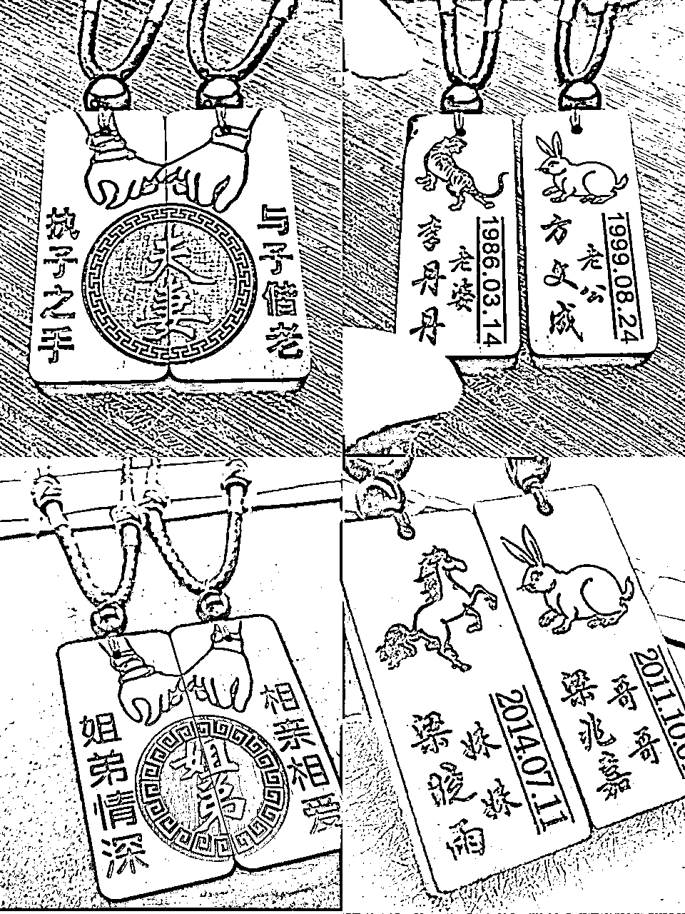

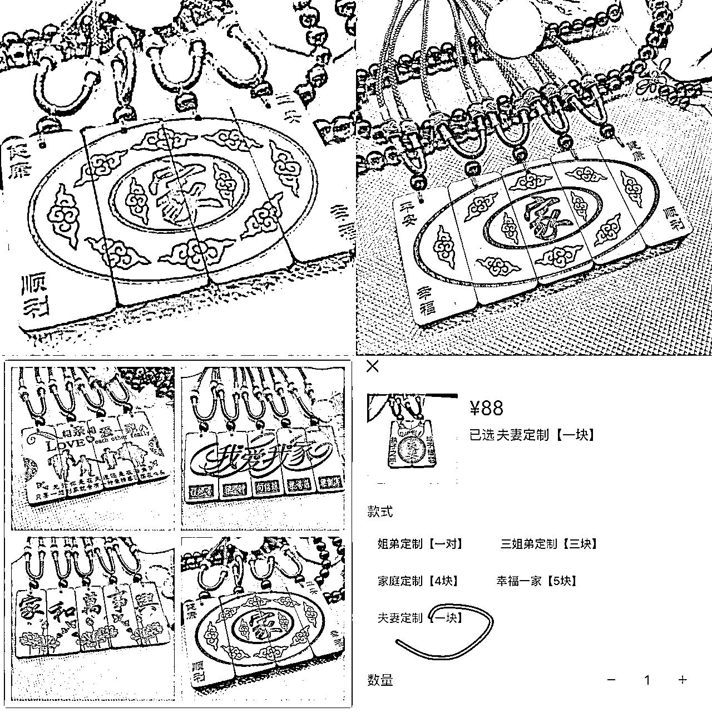

定价：88元一对，三块128元

### 3.3.2直播话术优化，gmv成倍增长

这个品类，所有短视频平台都没人做直播，我们是第一个，没有话术参考。第一场，直播预约3000人，我硬讲，高峰七八百人在线，流量我根本把握不住，即慌张又激动，语无伦次。看着直播间很热闹，实际就出了几单。

在线人数稳定在80人左右时，我慢慢讲，想到的都讲，讲材料讲大小尺寸，讲颜色，”我们这个项链绳子是紫色，紫色代表尊贵大气，紫气东来啊，代表美好的寓意“，“一家人这个款，正面是经典的家字，聚是一家人，散是满天星，背面四个角分别写着健康顺利幸福平安，代表着...”

第一场下来，我们每个小时出十几单，利润四五百。对象跟我说别扯一些有的没的，感觉很自嗨没有意义，我一下被点醒了，我们一起复盘接下来的直播应该怎么做。

以结果为导向倒推直播流程和话术，讲客户想了解的内容，不是你想说的。目的是出单，一是引导客户下单，材料尺寸大小款式可以讲，紫色绳子什么的不用讲，没有意义，客户不想听，客户想听的是这个挂脖吊坠能不能收缩，胖瘦是不是都可以佩戴。直播间人来人往，每秒钟都有人进入和离开，提高效率，几分钟一个话术循环，抓紧用手机教用户下单。

二是直播间用户停留和互动，想买这个品类的人群年龄偏大，40~60岁之间，有些人很少直播购物，也不了解定制吊坠这个产品，进来了不说话，想买又不知道怎么弄。于是，我说在咱们直播间想买定制吊坠朋友扣1，有些朋友年龄偏大，不太会用智能手机，想买又不会下单的扣2，没关系啊，主播慢慢教你，教到你会为止。马上cue这些扣1扣2的人，陌上花开、幸福一家人这几位朋友我看到你们了，放心主播肯定让你们买到喜欢的物品。

90%出单是夫妻款，最初的话术简单说就是，介绍产品+cue人（询问需要的款式）+引导购物车点击下单+几分钟一个循环，我们两人轮流播，一人直播一人助播，助播会发送，“咱们定制的吊坠是黑檀木材料哦，长5.3宽2.6厚0.8厘米”，“88元一对专属黑檀木定制吊坠，前10名下单赠送精美礼盒哦”，每次出单，我们都会发送“又有一位小伙伴成功下单啦，心仪的定制吊坠正在路上”，这个主要是个主播看的，出单了越播越有信心。经过几次优化，每小时gmv翻倍了。

### 3.3.3把握直播节奏，7小时260单，单天佣金过万

早期是引导用户先备注好再付款下单，每次凌晨下播我都要处理核对个把小时的后台信息，总有人备注错了，或者把发给微信小店客服的刻字内容发给我，且视频号用户私信我，我没回复的情况下，发不了第二条消息，以为我拉黑他然后去退款。让客户先备注好信息，单位时间内的出单数是有限的，我们需要不断的教用户备注然后下单，要反复讲，直播间在线100人还能接住。

周日下午我们五点开播，过了一小时左右直播间在线人数从不到一百，猛然涨到400，维持在三百左右，我意识到可能是视频又爆了，这个时候回复几个人的弹幕，会损失非常多的客户，一定要把握节奏，不能被用户弹幕带着跑。灵机一动，把流程反过来了，教用户先下单再教怎么备注刻字

很振奋的讲，“所有想下单的朋友扣1，想下单不会操作的扣2，跟上我的节奏，先不要点购物车，我们分两步走，先下单，再刻字。（穿插一点产品介绍）看着我的操作，点击购物车，找到我们要的款式，一对是88，三块是128，直接去下单。下完单在直播间打已下单，我等你们，抓紧时间。下完单的朋友看过来，告诉你们怎么刻字，还没下单的不要着急，我马上再讲一遍。”我们是手播，不露脸，拿一个手机对着屏幕操作。

不断重复上面的流程先下单再刻字，把握节奏，提高了出单率，加上视频出单，最终300多单，销售额两万多，当天佣金成功过万

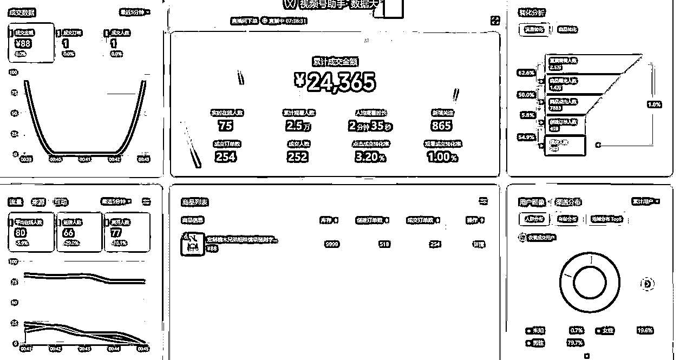

# 4.项目复盘：抛砖引玉

尽管我们下播后及时回复视频号后台，和客服联系，和厂家沟通。但涉及到的刻字内容太多，身份姓名出生生肖，两个人八个内容，商品因为评分低下架了。被下单的用户举报，吊坠上刻掉了他的姓名，可能是他备注掉了，客服说可以寄回去帮你重新刻好，包运费。他网购比较少，认为客服在忽悠他，再次直播时，开播两分钟后直播间被官方强制下关了，这个人在线时长第一名，被他举报了，我的账号也被限流。

厂家有自己的原则，客户自身的原因导致的问题，不处理。比如客户发错了刻字信息，刻好字以后不退不换，客户如果忘记备注姓名，他们会打电话加微信沟通，整体来说还可以。我这边是积极和客户沟通，帮助客户解决问题，有些客户实在是不讲理，不跟他们争论，赚钱要有正向磁场，保持好心态好心情，自己掏钱给他们重新刻一对，好的磁场比一点小钱重要。

七天时间直播佣金两万九，引流微信出了100多单，佣金六千。后续按照最早的用手翻吊坠展示，平台给视频流量很低，我意识到平台可能做了一些微小调整，提醒我不要做同质化的内容，该升级内容了。随后我们又起新账号，发现拍不出想要的灯光效果，请教多多商家，使用灯箱继续拍。换形式拍摄视频，去户外拍，取得了不错的播放量，但用户侧重点放在了文案上，出单一般。

我的思考是可以进一步优化内容，带入故事情节，提高视频播放。参考维修手机博主文案，今天客户寄来这个手机，纸条上面写着这是2010年买的手机，里面保存了她和奶奶唯一一张合照，从小与奶奶相依为命，希望我能帮她修好手机，找到照片。类推，陈先生和李太太相爱多年，今天专门找我定制一个黑檀木吊坠...使用工厂加工黑檀木的视频素材剪辑，更真实，暂时未操作。

前几天拼多多商家厂家老板给我发了个视频号链接，两万点赞，跟我热门的视频形式一样，在桌子上用手翻黑檀木吊坠，没想到原来的内容形式还可以做，问我要不要继续直播。已经接触到ai绘画，持续变现，婉拒了。

在整个项目流程中，我和对象不断地复盘，遇到问题发现问题解决问题。做个小结，希望对大家有启发：

1.面对陌生领域，别害怕，多找对标拆解分析，尽快赚到第一块钱，积累信心，多优化复盘

2.选品结合数据平台更方便实用，精选联盟，考古加等。选品很重要，测品更重要

3.除了黑檀木吊坠定制，其他定制品也可以挖掘，包括定制画像，注意刻字信息不要太复杂

4.发散思考，升级优化视频内容，获取更多流量

5.流量转瞬即逝，机会来临时拼命做