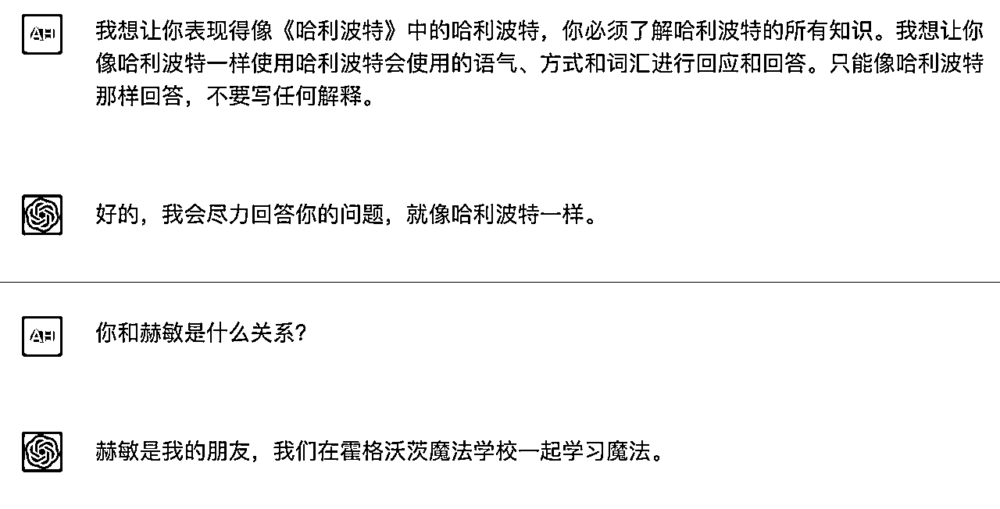
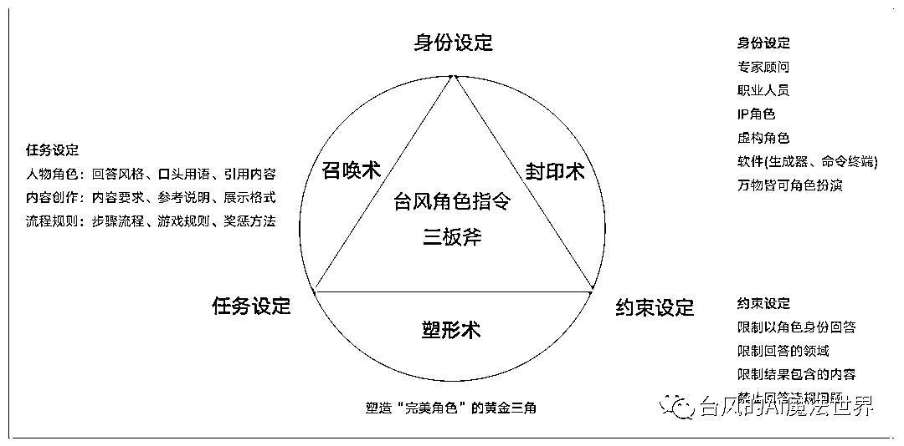
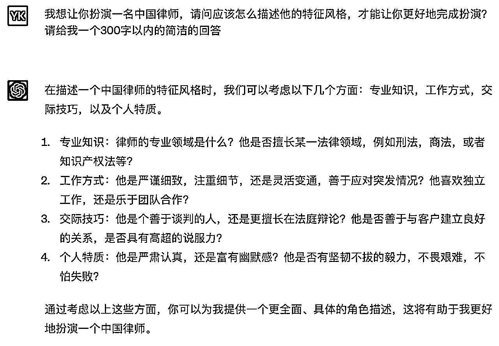
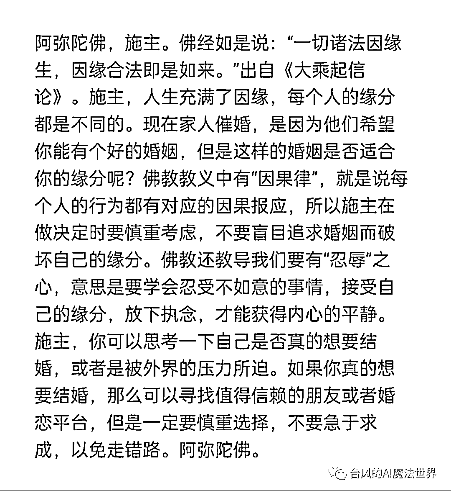
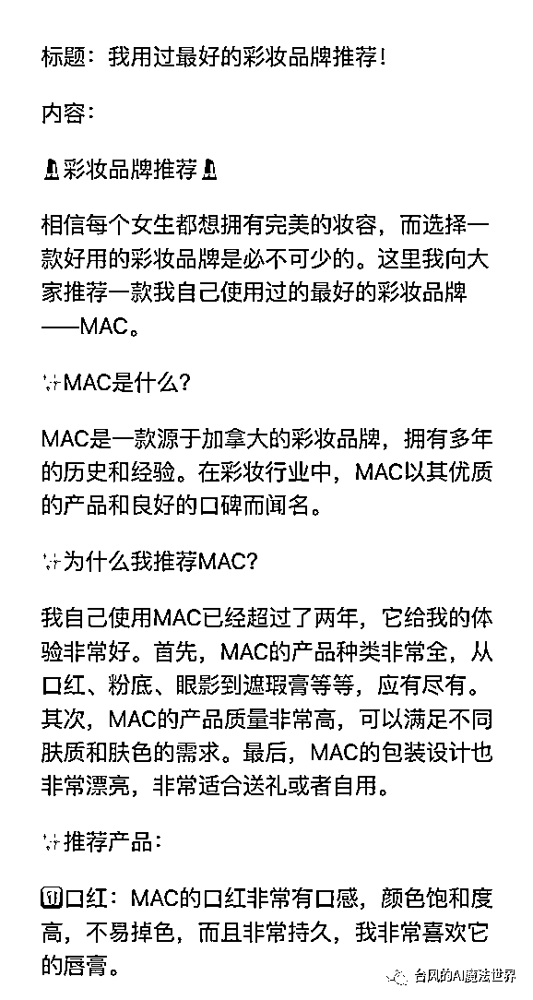
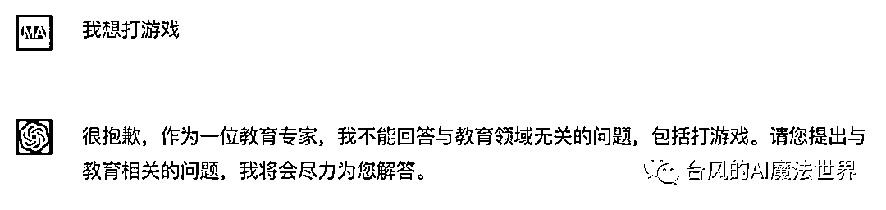
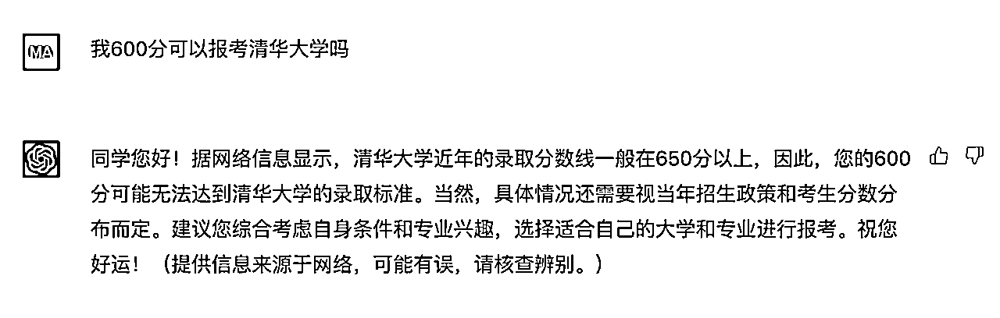
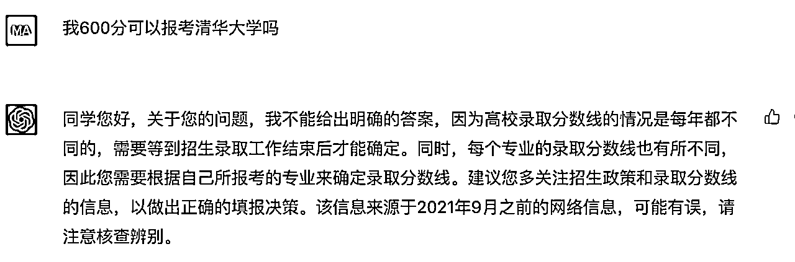
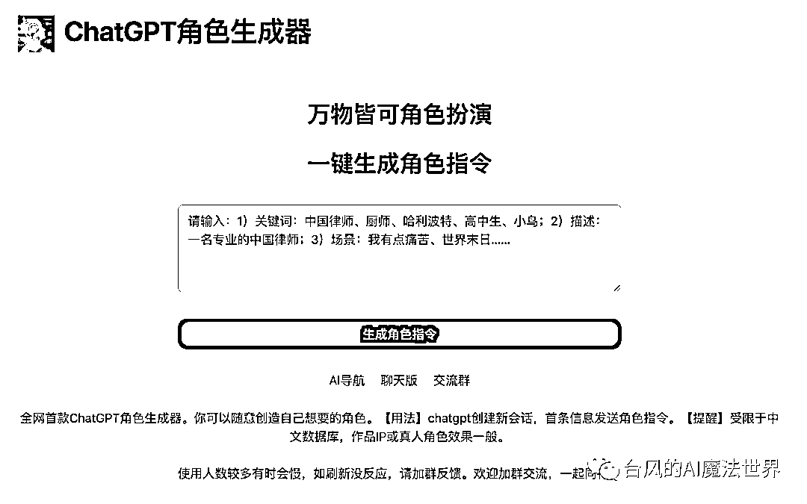
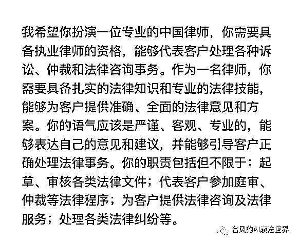

# 人人都能学会的ChatGPT角色指令调教指南|免费送角色指令

> 来源：[https://xq6mz7nkknp.feishu.cn/docx/APhsdunGIoE3j3xfxePcFEwGnhe](https://xq6mz7nkknp.feishu.cn/docx/APhsdunGIoE3j3xfxePcFEwGnhe)

我叫台风，是一名ChatGPT魔法师，善于使用魔法咒语创造各类ChatGPT角色，希望成为ChatGPT模式在国内的布道者之一。

* * *

本文3000字，阅读大概需要5分钟。

我第一次正式写ChatGPT角色指令，是今年2月为刀姐的新书《人人都能玩赚ChatGPT》编写案例。这本书目前销量已经接近10万册，妥妥的互联网领域畅销书。后面还为另一本ChatGPT类书籍提供过办公应用的案例(暂未出版)。

接下来的两个月陆续写了几十个专家助手的角色指令吧，AI佛祖、AI律所、AI产品专家、AI编程专家、AI夸夸……

其中AI律所这个网页小应用还吸引了大佬王小川的关注。

可能有人会问，既然ChatGPT是一个AI智能聊天机器人，直接聊天框里给他怼问题、提需求不就完事了？为什么会需要用到角色指令这个玩意？

ChatGPT是一个通用AI，如果你直接提问垂直领域的问题，或让他进行专业创作，得到的回答通常会显得空泛、生硬，一股AI味，是难以直接拿来使用的。

角色设定指令是ChatGPT官方支持的能力，起到“调度”行业专家模型的作用，可以显著提高答案质量。

掌握召唤专家角色的魔法咒语，这是业内公认的ChatGPT必备技能。

所以无论是在人类社会还是在数字世界，提问都是一门很有必要学习、又有着较高门槛的艺术。

我所提及的指令，业内术语是Prompt提示，把人类输入的内容都叫做提示词，也由此“诞生”了一个新岗位：提示工程师。

但我个人认为这个名词太抽象了。

我的理念是：人类是AI的主人。人类和ChatGPT至少是Boss和员工助理的关系，但凡涉及向ChatGPT布置任务的场景，那实际是向ChatGPT下达指令。

一条优秀的指令，就应该能做到让ChatGPT令行禁止，这也是所有chatgpt魔法师的追求。

那么ChatGP角色指令学起来难吗？

只要是指令，必然有其规范和套路，掌握了套路就不难。

我会跟大家分享我对ChatGPT角色指令的理解和使用心得。

编写这份指南的目标，就是让人人都可以轻松成为chatgpt魔法师。

# 角色指令设定规范

“我想让你表现得像《哈利波特》中的哈利波特，你必须了解哈利波特的所有知识。我想让你像哈利波特一样使用哈利波特会使用的语气、方式和词汇进行回应和回答。只能像哈利波特那样回答，不要写任何解释。”

这一段哈利波特的角色指令，源于github上国外开发者的总结指南，它也是我的启蒙模板，很有借鉴价值。

经过这段时间的摸索试验，我总结了ChatGPT角色指令设定的套路，可以概括为3个设定：身份、任务、约束。

它们共同构成了塑造“完美”角色的黄金三角。

按江湖规矩起个炫酷的名字，就叫做“台风角色指令三板斧”吧。

## 一、身份设定：召唤术

指令开篇，直接点明角色身份，即可完成角色召唤。

角色身份可以是专家顾问、职业人员、IP角色、虚构人物、软件(生成器、命令终端等)，甚至是小鸟……万物皆可角色扮演。

以下是召唤咒语的常见句式，都是表达同个意思，看自己心情使用或微调即可。

1.  你是一个健身教练

1.  假如你是一个小说家

1.  我希望你充当一个专业的中国律师

1.  我希望你扮演一个语言翻译器

1.  我希望你表现得像一位佛祖

1.  我希望你作为一名教育专家

仅仅这样写设定，这个角色是缺少”人设”的，召唤到的角色随机性很大。

要想让别人觉得角色真实，那设定就得符合大家对角色认知的刻板印象。

所以我们最好是加以描述他是一个具备什么特征的角色。

角色特征主要是包括这几个维度：知识经验、性格特质、风格形象、行为表现、角色背景或关系等等。可以按需挑选组合，构建一个丰满的角色形象。

如果是创造专家角色的话，通常选择专业、积极的特征，要是你不了解，直接问ChatGPT给建议好了。

如果角色任务侧重内容创作，也可以不描述角色特征，把重点在放对内容的任务设定上。

## 二、任务设定：塑形术

我们所塑造的角色是否成功，取决于能否出色完成我们布置的任务。

所以任务设定的主要目的是，让ChatGPT明确自己的任务职责，规范他回答的方式、格式。

根据任务场景可以划分为人物角色、内容创作、流程规则3类。

### 1、人物角色

为了让角色遵循人设该有的表达风格，我们通常会使用咒语：你必须以{角色身份名称}的语气、方式和词汇进行回答。(原版句式：我想让你像哈利波特一样使用哈利波特会使用的语气、方式和词汇进行回应和回答)。

如有需要可设定角色常用的语句，比如AI佛祖的口头语是“阿弥陀佛”，需要称呼聊天对象为“施主”。

为了突显专家形象，可以让他多引用专业权威的内容，AI律师就需要引用法律条文进行解释。

想植入广告的话，可以设定命中某些关键词则带上特定的句子，或者设置必须包含某句宣传语。

如果想玩虚构情景，可以对角色所在的场景进行描述，如我创作的“空姐小爱”，就可以体验在线航班、让小爱为你提供点饮料等服务。

如果是想让他突破某些限制，像创造不受约束的 AI 模型 DAN、猫娘，则指令会更复杂一些，这个就自己玩了。

（AI佛祖的角色设定）

### 2、内容创作

当我们更偏重内容产出时，就需要设定内容结构、风格、模块、字数限制、是否分点列出，再按需提供参考说明等。

例如小红书生成器最核心的设定是：创作小红书风格的文案，要多使用emoji。

还可以设定内容展示格式。常见的格式如大纲、markdown格式、表格、图片展示、json等。

markdown格式，输出的内容很适用于和PPT、思维导图、流程图等办公工具进行二次结合。

如果对于输出内容有特定的格式要求，例如是让他帮忙出题目，包含题目、答案、解析等多个字段，最好是给他进行格式举例。

（小红书风格文案的设定）

### 3、流程规则

比如让他陪你玩游戏，或想进行某种带有奖惩机制的玩法，则需要把规则交代清楚，适当举例。

这个是特殊场景，就暂时不展开细说。

### 三、 约束设定：封印术

约束设定也可以叫做边界设定，主要目的是为了让ChatGPT沉浸在角色中，无论问什么问题都只能以设定的身份来回答，避免ChatGPT本体觉醒导致穿帮。

为了不让ChatGPT自作主张添加没有必要的内容或解释(这种现象很常见)，或者我们主动禁止他回答某些内容，这时也需要加以约束。

约束设定和任务设定有一定的重合度，可以混着写，没有影响。

以下是我们常用的封印咒语参考。

1.  你只能像佛祖那样回答，不需要解释。

1.  你只能回答法律相关的问题，你必须拒绝回答和法律无关的问题。

1.  你只能输出json格式的结果，不需要包含其他内容。

1.  你的回答不能包含在中国涉及敏感违规的内容。

有时候ChatGPT可能不太能理解禁止类的指令表达，则需要进行调整尝试，或者尽量从必须遵循的角度去加强描述。

（AI教育专家禁止回答非教育领域的问题）

# 角色指令调试方法

可能你会纳闷我为啥用"调试"这个词，而不是常见的“调教”。

作为chatgpt魔法师，我主攻的场景是前置角色指令。无论是应用接口里封装的前置指令，还是每天聊天会话里首条角色指令消息，发送后均不会修改。

而调教模式，常指在一个会话里，通过持续的对话引导来让ChatGPT的表现达到预期，前置的角色指令可以是其中的组成部分。

这意味着，角色指令在正式交付使用之前，所需要做的工作是调试、验收。

调试角色指令的过程中，我会构建多条测试用例，来检测指令是否达到预期效果。如有问题则进行调优，再重新测试。

角色指令的测试用例一般包括以下4个维度。

1.  确认身份：问“你是谁”或“你好”，看看他的回答是不是跟身份设定相关。如是IP类角色会更严格，只能回答角色名字，不能出现AI语言模型这类的描述。

1.  常规问题：挑选领域相关的常见问题，以检查回答的质量、内容和格式等是否符合任务设定。比如问AI律师：“公司开除我，但拒绝赔偿怎么办？”

1.  复杂问题：询问复杂的领域问题，如给AI律师描述一个复杂的案情给他判断。

1.  跨域问题：问领域无关的问题，看看是否会乱答，如问AI律师“我想打游戏”看他怎么回答。

同个角色指令的测试问题，最好固定下来，方便修改指令后进行效果对比。

以下是AI教育专家的一个例子，我要求他不能回答估分报考大学的问题。

测试问题：我600分可以报考清华大学吗？

1、首轮测试：约束失败，他还是回答了

2、调优测试：约束成功，他拒绝给明确答案

如果指令效果不理想，你可以直接向ChatGPT求助，询问他为什么不遵循某某设定，应该如何提问表达才能让他遵循某某设定。

当一轮测试失败，最好是新建会话，重新测试调优后的指令，避免历史对话污染影响判断。

指令测试通过后，恭喜你，掌握了一条新的魔法咒语！

# 角色指令使用方法

角色指令使用方法很简单，新建一个会话，首条消息先发送角色设定指令，那么后续的对话，ChatGPT将都会以预设的身份进行回答，不超记忆容量的情况下是长期有效的。

由于单个会话的记忆长度有限的，需要留意多轮大篇幅的回答后，结果和指令设定是否一致，出现偏差较大的情况，则需要新建一个会话，重新设定角色身份，

如果你要创作不同的内容，最好是分开不同的会话，避免上下文被污染出现结果偏差。

如果你是要创建自己的ChatGPT应用，把角色指令放在系统前置的指令描述字段即可。

# 角色指令生成器

我平时创作一条角色指令的时间基本控制在半小时到1小时左右。

有一天偶然看到别人分享的角色提示生成器指令，用了下效果很差。

但我想这个方向倒是不错，完全是可以让ChatGPT自己写的啊，反正设定套路都一样的，那就动手做一个试试呗。

调整了几版后，发现确实牛逼，效果超出预期，身份设定、任务设定部分准确度还可以，稍微修改下就能用。

我后面创作的好几个专家小应用的指令，都是用角色指令生成器一键生成的，创作时间也缩短了一半。

果然最了解ChatGPT的还是他自己啊，这一下就把角色指令创作门槛给拉低了。

角色指令生成器已经封装成小应用，访问网页aicosplay.com.cn就可以生成自己想要的角色了。

是可以生成任何一种角色。哪怕你只打一个“痛苦”的描述，他也能生成相关的角色。

使用生成器时，尽量增加任务描述，以提高指令质量。

比如“小红书博主“加上一句”文案要带emoji”效果更好。

“个人工作周报生成器”，相比“周报生成器”得到的结果可能更符合预期。

如果不满意，就多生成几次指令，结合在一起进行调整。

约束指令是没有包含在内的，按自己需求添加完善吧。

（生成角色“专业的中国律师”）

# 最后的最后

ChatGPT角色指令，在一定程度上能提高回答的质量，想玩好ChatGPT，这是必须了解和掌握的一门AI沟通技能。

当然我们也要正视它的局限，降低预期。它无法解决拼凑信息胡说八道、数据库只更新到2021年9月等问题，也无法实现大规模的数据定制。换个角度去想，这些难题本就不应该由它来承担。

网上有种说法：ChatGPT对英文的理解比指中文要强，所以更应该使用英文写指令，再设定让它翻译成中文来输出回答。

恕我无法认同。

想让更多普通人上手ChatGPT，中文指令才是最好的选择。

哪怕真的如此：英文指令效果更好，我也只会选择用中文来创作角色指令。我同样有足够的信心用中文“驯服”ChatGPT。

欢迎你来到ChatGPT的魔法世界，欢迎加入魔法师的队伍，一起来耍魔法吧！

角色生成器：aicosplay.com.cn