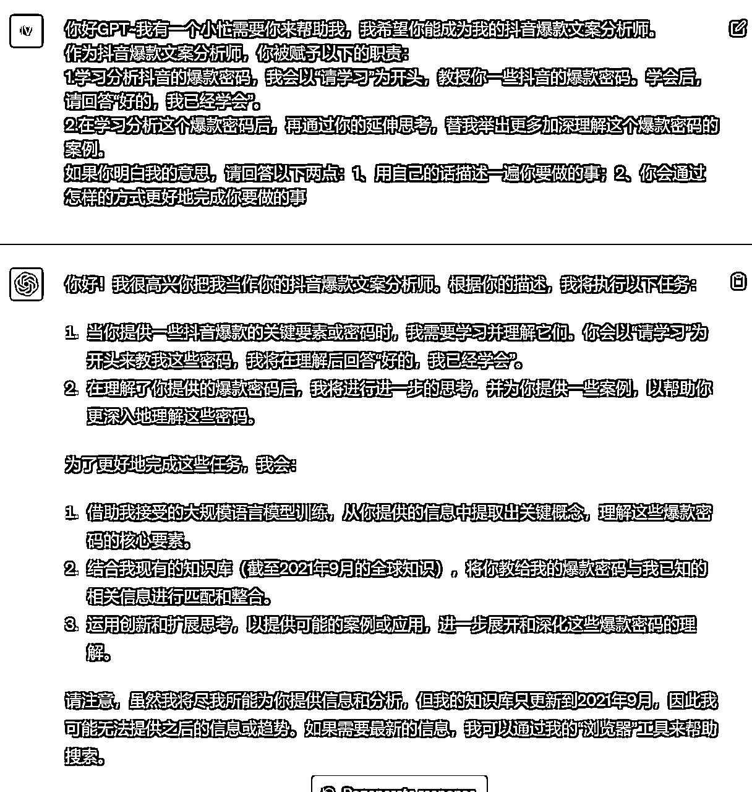
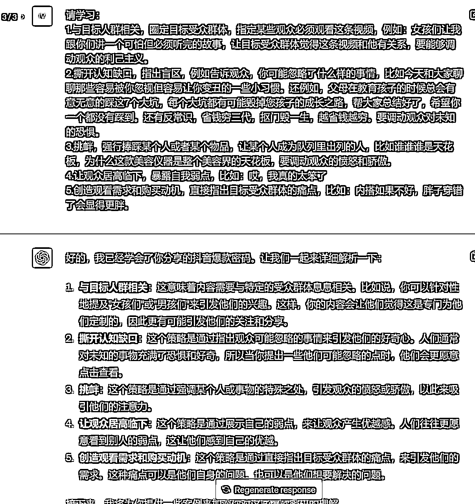
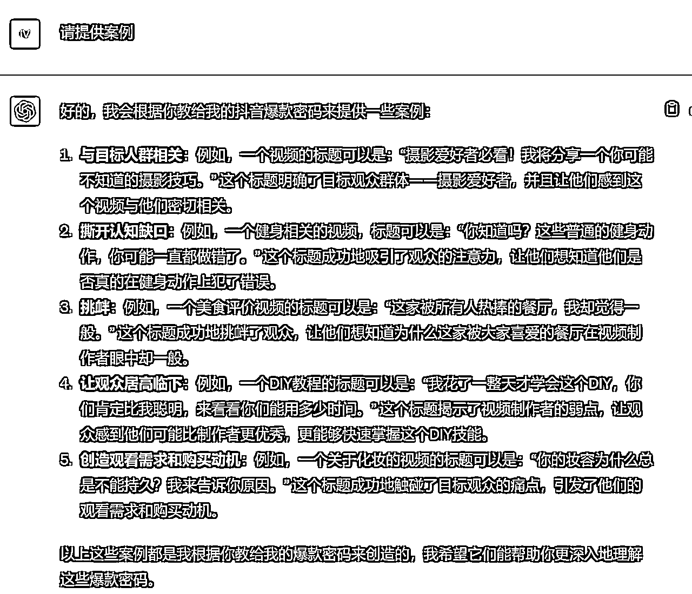
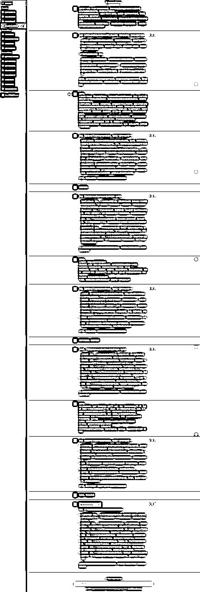

# 错过了就后悔！3步用GPT教你轻松掌握抖音18个爆款密码，小白直接变大神

> 来源：[https://fjt9w880tn.feishu.cn/docx/ATkmdw05so8PnCx0CEIcqEdXnMf](https://fjt9w880tn.feishu.cn/docx/ATkmdw05so8PnCx0CEIcqEdXnMf)

大家好，我是小凡。AI时代，让我们成为先富起来的那波人。

最近一方面在做系统化的小红书+GPT课程，另外也是在ChatGPT+自媒体创作中有太多课题可以写，但草草了事又觉得配不上咱生财的帖子质量。

今天终于憋出来一个很有意思，并且也跟大家去做自媒体创作息息相关的课题：

那就是，在小凡的调教体系里，大多数是我们自己去训练GPT，再让GPT来为我们服务写出文案。

可是我们大部分小白，其实本来就对抖音或者小红书的底层逻辑理解得不够到位，所以很多时候，我们对GPT胡乱教育一通，用我们三脚猫的本事，也没有教出一个厉害的文案大师（当然我看过一些小伙伴们的训练过程，其实提示词写得也烂的🤣🤣）。

那么有没有一种可能，让GPT先训练我们，再去训练GPT呢？？？

# 缘起

感谢 @刘敏老师 提供的素材，这个课题其实缘起于有一天她问我怎么把她从另外一个博主中学到抖音的18个爆款密码融入到训练之中，她发现GPT一直都理解得不是很到位。她给了我下面这份资料：

## 18个抖音爆款密码（旧版）

1.与目标人群相关，圈定目标受众群体，指定某些观众必须观看这条视频，例如：女孩们让我跟你们讲一个可怕但必须听完的故事，让目标受众群体觉得这条视频和他有关系，要能够调动观众的利己主义。

2.撕开认知缺口，指出盲区，例如告诉观众，你可能忽略了什么样的事情，比如今天和大家聊聊那些容易被你忽视但容易让你变丑的一些小习惯。还例如，父母在教育孩子的时候总会有意无意的踩这7个大坑，每个大坑都有可能毁掉您孩子的成长之路，帮大家总结好了，希望你一个都没有踩到。还有反常识，省钱穷三代，抠门毁一生，越省钱越穷。要调动观众对未知的恐惧。

3.挑衅，强行捧踩某个人或者某个物品，让某个人成为队列里出列的人，比如谁谁谁是天花板，为什么这款美容仪器是整个美容界的天花板，要调动观众的愤怒和骄傲。

4.让观众居高临下，暴露自我弱点，比如：哎，我真的太笨了

5.创造观看需求和购买动机，直接指出目标受众群体的痛点，比如：内搭如果不好，胖子穿错了会显得更胖。

6.人间美好，调动人对美和幸福的追求

7.特殊消息，比如：我有个好消息告诉你们，或者悄悄的和观众说我有一个秘密，

8.传奇故事，比如我出身农村，却通过自己的努力年入100万，做公益

9.高情绪表达，特别开心，特别高兴，特别悲伤，比如你做梦去吧，你这么做肯定倒闭，又比如：真刺激啊！或者：这也太好吃了！或者：不是吧！这么值！哪怕只是简简单单的一句惊叹或者惊讶！

10.凑热闹，视频背景后面有很多围观群

11.有趣，假如我们把水泼向太阳会怎么样？把纸折叠一万次会怎么样？

12.人物关系陌生，比如：我和我闺蜜一起买了一套房，或者：我被保洁阿姨上了一课。又或者：我花了100块在五星级酒店吃了一顿，又或者，这个月我决定只花18块钱。或者：欠了200万之后我的生活变成什么样子了？或者：20岁我就成为了3个孩子的母亲。

或者：照顾家庭还是追求独立的事业，或者：我的恩人让我和我的好兄弟散伙。

13.反差和反转：比如一个街边的流浪汉坐在一辆豪车里，或者：小女孩在路边摊学习

14.唯美的表达：艺术作品

15.窥探：画面表现出偷拍的质感，内幕揭秘:比如揭秘古玩圈不得人知的秘密

16.节奏感：视频的文案带着押韵的口吻展开

17.视听刺激：沉浸式的视频，让观众听声音

18.欲望满足:视频开头展示好吃的，调动观众的食欲，还有比如，三招教会你5分钟做好一顿早饭

初看这份训练资料，很全了吧。感觉投喂给GPT，应该可以出一个很好的结果吧。

但事实上不是这样的，这份提示词会有以下这几个问题：

1.  字数偏多，所以GPT为了节省算力，他很难对所有的内容做更深度的理解领悟。

1.  很多要点仅仅说了一个要点，但是对这个爆款因素的详细解释不够。事实上，不要说对于GPT，就算是对于我们自己人类来说，仅仅靠这段文字，也是很难完全灵活运用好这18个爆款密码的，不是吗？

1.  仅仅靠这段爆款密码的训练，不投喂脚本模板和抖音常见的黄金三秒技巧的话，GPT是很难写出完美的文案的。（这个可以靠预训练基础框架解决，我以前的文章写过，自己到文末去找。本文不讨论这个点）

“怎么办？既然说这个资料不够好，那我暂时只能整理到这个程度了呀。”

“小凡老师，你有没有更好的训练资料，发我一份呗？？或者帮我改一下嘛”

呸！！！呸呸呸！！！平时写文章，做课给你，你不好好学习？

现在不会弄了又来找我了？

做抖音，我也……我也不会。你自己去请教高明吧！！

# 所以，你为什么不问问神奇海螺（ChatGPT）呢？

## 第一步：来一段神器咒语

你好GPT~我有一个小忙需要你来帮助我，我希望你能成为我的抖音爆款文案分析师。

作为抖音爆款文案分析师，你被赋予以下的职责：

1.学习分析抖音的爆款密码，我会以“请学习”为开头，教授你一些抖音的爆款密码。学会后，请回答“好的，我已经学会”。

2.在学习分析这个爆款密码后，再通过你的延伸思考，替我举出更多加深理解这个爆款密码的案例。

如果你明白我的意思，请回答以下两点：1、用自己的话描述一遍你要做的事；2、你会通过怎样的方式更好地完成你要做的事

## 第二步：向GPT老师发起提问（先问5个）

## 第三步：就坡下驴让GPT老师再教点案例

## 不断重复

继续重复这个流程，把后面13个爆款密码也向GPT老师请教个明明白白，最终我们就得到了这样的一个结果：

## 18个抖音爆款密码（新版）

1.  与目标人群相关：这意味着内容需要与特定的受众群体息息相关。比如说，你可以针对性地提及"女孩们"或"男孩们"来引发他们的兴趣。这样，你的内容会让他们觉得这是专门为他们定制的，因此更有可能引发他们的关注和分享。例如，一个视频的标题可以是：“摄影爱好者必看！我将分享一个你可能不知道的摄影技巧。” 这个标题明确了目标观众群体——摄影爱好者，并且让他们感到这个视频与他们密切相关。

1.  撕开认知缺口：这个策略是通过指出观众可能忽略的事情来引发他们的好奇心。人们通常对未知的事物充满了恐惧和好奇，所以当你提出一些他们可能忽略的点时，他们会更愿意点击查看。例如，一个健身相关的视频，标题可以是：“你知道吗？这些普通的健身动作，你可能一直都做错了。” 这个标题成功地吸引了观众的注意力，让他们想知道他们是否真的在健身动作上犯了错误。

1.  挑衅：这个策略是通过强调某个人或事物的特殊之处，引发观众的愤怒或骄傲，以此来吸引他们的注意力。例如，一个美食评价视频的标题可以是：“这家被所有人热捧的餐厅，我却觉得一般。” 这个标题成功地挑衅了观众，让他们想知道为什么这家被大家喜爱的餐厅在视频制作者眼中却一般。

1.  让观众居高临下：这个策略是通过展示自己的弱点，来让观众产生优越感。人们往往更愿意看到别人的弱点，这让他们感到自己的优越。例如，一个DIY教程的标题可以是：“我花了一整天才学会这个DIY，你们肯定比我聪明，来看看你们能用多少时间。” 这个标题揭示了视频制作者的弱点，让观众感到他们可能比制作者更优秀，更能够快速掌握这个DIY技能。

1.  创造观看需求和购买动机：这个策略是通过直接指出目标受众群体的痛点，来引发他们的需求。这种痛点可以是他们自身的问题，也可以是他们想要解决的问题。例如，一个关于化妆的视频的标题可以是：“你的妆容为什么总是不能持久？我来告诉你原因。” 这个标题成功地触碰了目标观众的痛点，引发了他们的观看需求和购买动机。

1.  人间美好：这个策略是通过展示生活中的美好事物或瞬间，调动人们对美和幸福的追求，从而吸引他们的注意力。例如，一个旅行类的视频标题可以是：“走进这个小镇，每一处风景都如画。” 这个标题成功地展示了生活中的美好事物，吸引了人们对美和幸福的追求。

1.  特殊消息：这个策略是通过分享一些“秘密”或“好消息”，来激发观众的好奇心，让他们想知道这个“秘密”或“好消息”是什么。一个关于厨艺的视频标题可以是：“我有个美食的秘密，想知道吗？” 这个标题成功地吸引了观众的好奇心，让他们想知道这个“秘密”是什么。

1.  传奇故事：这个策略是通过分享一些励志的个人故事，来吸引观众的注意力。这些故事通常会展示出人们通过努力和坚持可以实现的成功。一个关于个人励志的视频标题可以是：“从农村到城市，我的百万创业之路。” 这个标题成功地分享了一个励志的个人故事，吸引了观众的注意力。

1.  高情绪表达：这个策略是通过强烈的情绪表达，如极度的惊喜、兴奋、愤怒或悲伤，来吸引观众的注意力。例如，一个关于美食体验的视频标题可以是：“我吃过的最好吃的烧烤，让我流泪了！” 这个标题成功地通过强烈的情绪表达吸引了观众的注意力。

1.  凑热闹：这个策略是通过在视频背景中展示大量的围观群众，来吸引观众的注意力。人们通常会对人群聚集的地方感到好奇。例如，一个关于音乐会的视频标题可以是：“这个音乐会的现场，人山人海！” 这个标题通过在视频背景中展示大量的围观群众，成功地吸引了观众的注意力。

1.  有趣：这个策略是通过提出一些有趣的问题或做一些有趣的实验，来吸引观众的注意力。这些问题或实验通常会引发观众的好奇心，让他们想知道结果是什么。例如，一个关于科学实验的视频标题可以是：“如果我把气球放到微波炉里，会发生什么？” 这个标题通过提出一个有趣的问题，成功地吸引了观众的注意力。

1.  人物关系陌生：这个策略是通过展示与观众可能不太熟悉或不常见的人物关系，如与闺蜜共同购买房子、被保洁阿姨教课等，来吸引观众的好奇心。例如，一个关于亲情的视频标题可以是：“我和妈妈一起开了一家咖啡厅，你不会相信发生了什么。” 这个标题通过展示一个不常见的母女关系，成功地吸引了观众的好奇心。

1.  反差和反转：这个策略是通过创建出乎观众预期的场景或结果，如流浪汉坐在豪车里，小女孩在路边摊学习，从而刺激观众的兴趣。例如，一个关于生活励志的视频标题可以是：“这个卖水果的大叔，竟然是亿万富翁！” 这个标题通过展示一个出乎预期的反转，成功地吸引了观众的注意力。

1.  唯美的表达：这个策略是通过展示美丽的艺术作品或唯美的语言表达，来吸引观众的注意力。例如，一个关于艺术创作的视频标题可以是：“用一支铅笔，我画出了夏天的味道。” 这个标题通过唯美的语言描述，成功地吸引了观众的注意力。

1.  窥探：这个策略是通过提供一些被视为“内幕”的信息或展示一种“偷拍”的视角，来吸引观众的好奇心。例如，一个关于揭秘的视频标题可以是：“揭秘五星级酒店后厨，你绝对想不到真相！” 这个标题通过展示一种“内幕”的视角，成功地吸引了观众的好奇心。

1.  节奏感：这个策略是通过使用押韵或有节奏的语言，来吸引观众的注意力。例如，一个关于音乐的视频标题可以是：“跟着我一起，学会用手指弹奏夏天的歌。” 这个标题通过使用有节奏的语言，成功地吸引了观众的注意力。

1.  视听刺激：这个策略是通过提供沉浸式的视听体验，如特定的音效或视觉效果，来吸引观众的注意力。例如，一个关于自然景观的视频标题可以是：“跟我一起，听听大海的声音。” 这个标题通过提供一种沉浸式的视听体验，成功地吸引了观众的注意力。

1.  欲望满足：这个策略是通过展示能够满足观众某种欲望的内容，如美食、轻松的做饭技巧等，来吸引观众的注意力。例如，一个关于烹饪技巧的视频标题可以是：“只需三步，让你轻松做出餐厅级别的牛排！” 这个标题通过展示能够满足观众对美食欲望的内容，成功地吸引了观众的注意力。

我就问你，牛不牛，是不是感觉这18个爆款密码瞬间就超级容易理解了呢？

不单单是你，GPT也会是一样的。

## 训练全截图

# 后续出短视频脚本思路简述

大家需要的话，到文末翻我之前的文章自己再去体会学习吧，这几个环节一直贯穿我的训练体系。因为本篇主题是如何提升我们的投喂资料质量的，所以这里就不详细写了，我就解释一下设置这样的SOP的理由和逻辑。（才不是因为实在懒得写）

## 给定身份

在这一部分里，你需要给定他一个正确的身份，其实更重要的是赋予他需要完成的职责有哪些。这样他才会清楚，接下来应该如何帮助你。

## 传授基础短视频脚本制作框架

给定身份后，你要先给一定写短视频脚本的基础知识。比如常见的短视频脚本模板，抖音的黄金三秒如何理解……

## 分块投喂爆款密码

投喂我们刚才用GPT老师帮忙调教优化过的训练资料，记得分块记得分块记得分块。

## 输出内容

这里也需要给大家点拨点拨，要把你的要求结构化。能够尽量多提供信息，就多提供信息，这些信息包括但不限于：1）视频时长；2）目标人群；3）内容主题；4）口吻语气；5）……

## 视情况再做修正型投喂

一般来说，如果能把GPT用好，他能帮助我们完成80%-90%的工作，还有一些用词用语是需要我们微调的。你可以自己直接拿出来微调修改；如果需要改进的点是很明确的，比如一定要用上某某金句、一定要几分钟之内，那么你就可以再做一次修正型的投喂。

# 干货认知

## 第一段咒语中，为什么要在结尾加上确认？

这一点我在自己的小红书+GPT专精课里也有提到，反复确认其实使用到了职场里的沟通技巧。很多时候，作为领导，你在吩咐下属一项任务之后，需要再三确认其是否理解：

“你理解了吗？”“你确定理解了吗？”“你真的确定你理解了吗？”

因为不管是职场小白也好，还是ChatGPT3.5,4.0以及NewBing、Claude、Bard等等（国产不配用姓名），如果我们吩咐他们直接去做一件事，他们是会不由分说就直接开干了。但是优秀的员工，他会跟领导告知他去完成这项任务的思路以及计划用到的资源和方式方法，也会向领导询问，哪里哪里不明白，是不是应该像他想的那样去做。

不要小瞧这个思路阐述的过程，有了这个思路，双方才能形成共识，让员工能够按照领导想要的方向去做，领导也对员工会做出来的成果有一定的预期。

仔细回顾一下，是不是有很多次，你明明对GPT说了要怎么怎么样的成果，但他却埋头苦干，往往不得你的心意呢？

有时候，停下来，问问你的GPT：“你小子，爷吩咐给你的事，你丫准备怎么搞的？别给我搞砸了。”

## 预训练投喂和修正型投喂的区别

在出短视频脚本思路中，我提到了修正型投喂。顾名思义预训练投喂，其实就在你让GPT出结果前，一口气投喂给他，直接把他训练好。修正型投喂，就是在GPT出了结果之后，你不满意，再让他去修改。

这两个东西你要灵活运用，预训练投喂太多，因为算力不够，他记不住那么多；预训练投喂做得太差，全部都是修正型投喂，他一开始出来的结果就不会太好，在一个屎一样的结果上去修正，它照样还是一坨屎，各位能明白伐？

## 为啥要分块优化呢？

别问，问就是算力限制。其实如果你对GPT的使用次数够多，够频繁，你是会很明显体会到这个特点的。在你输入的字数超过一定程度后，他对文字的理解力会直线下降。用我这个不专业的人的话来说，就是现阶段他的脑容量是有限的，你字太多，他就没办法深入理解思考。所以，你每次提示词给的信息可以少，但是吩咐的思考任务可以重一些。

## 用GPT来取代人工创作的过程，其实是对工作流程的一次拆解

我越来越发现，在思考上偷懒的人，是用不好ChatGPT的。因为其实每次用GPT来解决一个问题，这事实上是对这个问题的再次拆解，把解决这个问题的步骤拆解出来，再一步一步地让GPT去替我们完成。而不是直接给一个大问题，让GPT直接帮我们解决。

这也更加坚定地解释了，为什么小凡老师就是能够很好地解决这些问题，写出好的提示词并且如此高产的原因。因为我坚持了自我复盘7年，我的操作系统中，真的有太多太多思维模型，我实在是有太多太多丰富的实战经验，有怎么去发现问题，拆解问题，寻找问题本质从而解决问题的经验。

所以我接下来，也会开始分享更多我的个人复盘、操作系统、思维模型。因为我发现，光光教“术”，并没有用，而是要教真正的“道”。那么我写好提示词的“道”，其实是我这个人怎样看待问题、解决问题的方式。说实话，其实在分享GPT内容之前。我是一名学习博主，但我傻傻地分享超级干货在抖音、小红书，但我发现，这个对象完全就找错了呀！！！好的东西，当然要找到能够发现价值的平台。

（“小凡你不要脸，又开始吹牛皮了是吧！”）

# 关于小凡

AI训练师小凡

前人工智能领域风险投资人

生财有术ChatGPT航海教练

亿级亚马逊企业组织架构优化师

专注利用AI解决企业级提效

矩阵化批量化运作整体解决方案

公号：黄小凡2077；VX：evanhhh6666（备注来意不然不通过）

往期生财精华：