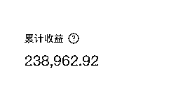
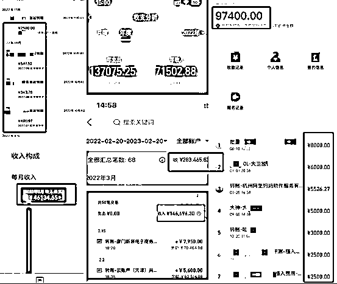
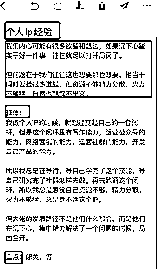

# 超详细步骤毫无保留告诉你，如何靠商业软文年入百万？

> 来源：[https://mmmu5tnlrk.feishu.cn/docx/AwMHdgfqxomlshxeCdgcVpEMn9b](https://mmmu5tnlrk.feishu.cn/docx/AwMHdgfqxomlshxeCdgcVpEMn9b)

哈喽大家好，我是钱酱，今天给大家分享我自己迭代的写商业软文的方法。

先跟大家打个招呼，自己一直都是实战派，很少公开去讲这套方法，所以有讲的不好的地方，大家多担待，不明白的地方也可以下来问我。

我对一篇好的商业软文的定义：

1、如果你做IP，能快速获得读者信任

2、如果你引流，能快速获得粉丝

3、如果你做转化，能快速让你收钱

一句话概括，既能带给读者价值，又能带给自己商业价值的文章，就叫商业软文。

我自己就是靠这套方法，一个人、不露脸、并且在粉丝很少的情况下，快速积累到自己的第一桶金。

质量大家放心，我的文章不会有太多假大空的东西，只要照着去做，就能立马出结果。

可能你会感觉写作这件事很复杂，或者至少需要很强的文字功底，其实不是，我是理科生，大学学的软件工程，我的那点文学功底跟你一样，也只来自于九年义务教育，大学毕业后，就直接开始自己干新媒体这行了，然后自己一点一点琢磨出这套方法，并且靠它做起来，要知道，当时我基本没啥工作经验和社会阅历，在很多方面，可能都没你优秀。

这套方法也是我之前带学生用的，能快速的复制给他们，在短时间内，学会快速写出“有商业价值”的软文。

关于这套方法，接下来我会分为5个部分给大家讲，

第一部分：分享我是怎么做起来的，我会通过这些经历，跟大家讲清楚我写商业软文的底层逻辑，看懂了你就掌握了商业软文赚钱的精髓。

第二部分：讲一下一个完整的商业软文，它需要具备的条件，离开这些条件，你的内容就不能发挥赚钱的效果。

第三部分：教你搭建一个写作外挂，你光会写商业软文还不够，还要快，互联网上赚钱，快就是生产力，写的慢，赚钱的速度就慢，所以这块就教你用写作外挂，辅助你在速度上上升一个大的台阶

第四部分 ：讲一个实操的SOP，根据前面的知识点，总结出一套具体可执行的流程，告诉你第一步怎么做，第二步怎么做，就是你拿到这个方法就可以快速上手去做，去用商业软文赚钱，

第五部分：讲一下整个我自己的一些分享和心态吧。就是我靠内容赚钱这些年，我回头再看，那些对我影响非常大的关键点，希望对你有用。

好，那我们继续。

第一部分：我是怎么做起来的？

我把我做起来的经历分为五个阶段，跟大家讲一下：

第一个阶段，我就觉得内容创业挺好的，就像那些大佬一样，一根网线，一台电脑，一个人在家敲键盘就能把钱赚了，这多爽啊，结果怎么做都起不来，我觉得肯定是没出爆款，所以我来到了第二阶段；

第二个阶段，经历了一系列痛苦的过程，我终于是出爆款了，我发现出了爆款也赚不到钱，，每天看着数据那么好，但是却没人找我打广告，自己也不知道咋把这流量转化成钱，所以我来到了第三阶段；

第三个阶段，我突然意识到，爆款和赚钱是两回事，对于赚钱来说，重要的不仅仅是内容，还有商业价值，咱们对自己的角色一定要清晰，我们就是一个“内容商人”，所以注意力一定要放在“商业价值”上，然后我就疯狂写“商业软文”。

一开始我也不知道商业软文怎么写，我看大佬都是写“干货”，我就认为，一定要给用户很干很干的干货，然后我就查阅很多资料、参考文献，工具书我也读了非常非常多，当时我就大篇幅的去分享，结果这个过程中我发现数据并不好，然后我又来到了第四阶段；

第四个阶段，我意识到其实你理解的干货不一定是用户理解的干货，内行人写东西最大的误区，就是无法切换到用户的视角去理解用户到底喜欢什么东西。

所以就琢磨怎么写出“具有爆款潜质”的商业软文，然后就达成了一个结果，就是在这个过程中，我能通过商业软文收钱了。

这是我的这个账号情况和变现情况，是我当时一发出去，就收到了这些，刚开始定的是2999和5999两个档，后面我调整到了3580和6580，基本上80%报的都是高价位的，然后剩下的没有预算条件的人才会报3580。

本来变现效果应该更好点，为什么这么说，因为我没有提前设计好商业闭环，什么意思呢，就是我很艰难的把流量做起来，我的精准流量涌上来给我喂饭吃的时候，我没有进行引流，没有设计好自己的变现方式，

所以在这简单给大家提个醒，一定要先设计好自己的变现方式，再去做内容，这件事情就很简单，否则内容爆了，你再围绕这个内容去做变现，其实难度会上升。

第五个阶段，这个阶段，发现虽然能写出具有爆款潜质的商业软文了，但是效率跟不上，因为效率就是生产力，效率慢，输出的速度就慢，迭代的速度也就慢，赚钱的效率自然而然也不会太快。

所以最后又去琢磨怎么“快速”写出就有爆款潜质的商业软文，最后的结果我再给大家分享一下

不知道大家有没有听过知乎好物这个项目的，或者是自己操盘，自己做过的。

现在知乎好物风口已经过了，很多人说知乎不行了，知乎文章都是营销文，知乎带货不赚钱，在大家都是唱衰知乎好物的情况下，我简单的给大家截了一个图，我的好物矩阵中，

变现最多的账号，这三年给我带来了70w+的佣金，

其中有一个账号的一篇文章就给我带来了20w+的佣金，

只是佣金，除此之外还有其他商业合作。

我承认，确实赶上了风口，但做出这个成绩，光靠运气是靠不住的，所有的事情，最可靠的就是靠方法论，因为方法论带来的成功是必然的，只不过是早晚而已。

下面我就详细给大家讲讲我的方法论：

第二部分：一个完整的商业软文需要具备的条件

首先说一个完整的商业软文需要具备的条件有明线和暗线，我带过的所有通过商业软文赚了钱的学员，一定是满足这两个条件的。

什么是明线？

那什么是明线呢？这个概念是我原创的，可能很多同学没有听过，但是对于我本人来说，它是非常有用的，明线你可以理解为就是在一篇文章或者一个视频里边可以被代替的知识点或者观点。

比如你写一篇自媒体写作文章，有个知识点叫标题怎么写，那我从别的平台搜一下，标题怎么写，找个不同的文案替换上去，效果是一样的，这就是明线。

大家记住这个概念，在一篇文章中可以被代替的知识点或者观点叫明线。

什么是暗线？

暗线就是：影响用户决策的点

一些人设类的、背书类的，比如你觉得哪个博主做了哪些事很厉害；

引导类的，比如你想引导他私信你 ，比如你想引导他在评论区提问 ，等等这种不可替代性的内容，都是暗线。

我举个例子，大家感受一下：

这是我截取的一个小篇章，大家可以看一下哪部分是明线？哪部分是暗线？

首先你看第一部分：

这个是明线还是暗线？这段话的意思是，强调找到好的平台去展示自己的重要性，这是什么？是观点对吧，我从其他地方找个意思一样的话，就能把它替换掉，这个就是明线。

那我们看一下第二部分：

这段话的意思是，你想要找平台展示自己，我给你整理了很多渠道，读者看到这，可能会想我要试试这个渠道，然后就跑到了他公众号里，发了“渠道”两个字，这里是不是就影响了用户的决策了，这就是暗线。

按照这两条线去拆同行的文章，把他拆解成框架，然后明线从别的地方找一个，替换上去，暗线换成自己的

我们一定要明白一点，很多时候我们摸着爆款过河就好了。

普通人写文章难在哪里？

难在现在想要把你的经历描述清楚，但又不知道怎么描述清楚，然后你就去学习，找方法，又去练习自己的表达能力；

难在你想让文章有干货、想让文章好传播、想让文章能引流还能转化；

这个时候摸着好文章过河，就会让你跳过从0到1写文章的阶段。

输出内容和创业是一样的，从0到1都很难，很痛苦，从1到100就很容易。

第三部分：如何快速写出爆款商业软文？

说到这你可能会觉得，就算让我在一篇文章的基础上改写，我也感觉很很困难，因为脑子里没墨水呀，最多也只能被字句改成把字句，反正写不出比原文更高质量的内容了，

这不是你脑子里没墨水，那些写的好的人，之所以写的好，是因为人家有庞大的写作素材库支撑的，

我从新手到现在，最大的感触就是：

高手写文章都是从确定的选题和一堆素材开始的，小白都是从一张白纸开始的。

所以，接下来我就要教你怎么搭建自己的写作外挂，这个搭建起来，你写东西的速度能快80%。放心，不会很难，我在自己实操和教学员的过程中，把很多步骤都化繁为简了，只留下了效率最高、最必要的环节，学会了马上就能用起来，

就两个重点 ，一个是记录，一个是搜索。

第一个重点，记录。

记录什么？

1、记录知识点：

平时在书中、文章中、课程中学到的知识点，我都会记下来到印象笔记中。

2、记录感觉：

比如我经常会记一些能触动我情绪的内容，然后把自己的情绪提炼成标签，每次遇到好的内容，我都会贴上相关的标签。

比如视频、文章里边比较牛逼的观点，我听完以后，感觉这些内容好厉害，那我会把他收集到我的印象笔记，然后备注一个：感觉牛逼。

比如说我看到一个人写了朋友圈，我看完以后，我觉得真的写的太好了，我太想买了，我太想看一下他卖什么东西的，这些朋友圈我也会放印象笔记里，标记一个：产生购买欲、产生冲动。

当我写文章想让读者产生冲动的时候，我直接可以打开这个标签，就会出来非常多可以让人产生冲动的内容

一个庞大、优质的垂直领域素材库，基本上是持续稳定输出的基础。

第二个重点，搜索。

你觉得做素材库的目的是什么？

素材库对于咱们来说就一个目的，就是“用”。

怎么用？

就是假如说我现在想表达一个意思，或者说表达我现在的感觉。

我之前看到过一段话，能精准的表达出来，但是我又记不起来了，我只记得大概的意思，或者只记得一个关键词。

如果我当时没收集的话，基本上就很难再找到了。

如果我收集了，那我搜索这个关键词，找到这段话，就可以用了。

这就是素材库的作用。

那怎么才能最大限度的找到这段话呢？

给你讲个我的方法：

看这个

有一些话可以触动我，或者让我产生一些联想，我就会记录下来。

“延伸”，就是我联想的一些东西。

“重点”就是我搜索的时候，有时候一些关键词可能记差了，搜索不出来，所以我就提取出多个关键词，这样用的时候搜索出来的概率就大了。

这步的重点是：

你积累的这些素材，不是积累了就不管了，我平时会反复去提取这个素材中可用的点，时不时的增加关键词，就是为了我以后搜索结果能够更广。

实操SOP

上面学完了，你就知道了该“做什么”，但还不够，因为你不知道“怎么做”也没用，所以，根据前面的知识点，我总结出一套能快速上手的sop，打起精神，我们继续

首先，在这儿跟大家讲一下，就是我们教的可不是洗稿啊，大家也不要有洗稿的想法，这套方法教你的是有效借鉴，具体怎么借鉴，我给你演示一下，这块我建议你看两遍，第一遍，你要知道整个流程是什么样子，第二遍，再去像素级实操。

好，先看原稿。

原稿是这样子的：https://mp.weixin.qq.com/s/_a16gH4nnK6b5_13xzEdrA

第一步：拆解成思维导图

先按照自己的理解把文章拆解成思维导图，怎么把文章拆解到位，我给大家拆解了一下，你可以先自己拆解一下，然后对比一下我拆解的，体会一下。

https://mmmu5tnlrk.feishu.cn/mindnotes/bmncnxWPJ5kNgpB2adeUiRMXqLf#mindmap

第二步：分析这篇文章中的明线和暗线，

用我上面讲的明线和暗线的概念和案例，去标一下文中哪些是明线，哪些是暗线。这块我帮大家标了一下，你自己标完以后，可以对比一下，体会一下https://mmmu5tnlrk.feishu.cn/mindnotes/bmncnL7QkLwRTTmfcePG6dw5xT8

第三、四步：修改明线和暗线

案例1：

先看这个开头

这部分我会怎么改？

这个就要用到平时的积累了，一点都不难，我给你展示一下：

第一步，我会在印象笔记中搜索“开幕雷击”。我平时看到好的开头会记录到印象笔记，然后备注四个字“开幕雷击”，所以用的时候我直接搜索“开幕雷击”就可以搜出来很多好的开头

第二步，找到合适的开头，我们就直接套一下右边这个，

大家可能看不清，我给大家放一段文字版：

这篇文章可以在一定程度上改变你的生活，帮你大幅度提高情商，别不信，这是有多个案例与理论，以及实验数据支持的。全程干货，建议点赞收藏，方便在动态里查看并学习。

你看这段话，你们任何一个行业是不是都可以用？

比如你做医美的，你可以改成：这篇文章可以在一定程度上改变你的生活，帮你大幅度提高颜值，别不信，这是有多个案例与理论，以及实验数据支持的。

比如你是做理财的，你可以改成：这篇文章可以在一定程度上改变你的生活，帮你大幅度提高收入，别不信，这是有多个案例与理论，以及实验数据支持的。

比如我是做创业的，那我可不可以改成：

这篇文章可以在一定程度上改变你的生意，帮你大幅度提高业绩，别不信，这是有多个案例与理论，以及实验数据支持的。

全程干货，建议点赞收藏，方便需要的时候拿出来反复学习。

但是光这么改，我还不是很满意，因为我里面提到了一句话：“别不信，这是有多个案例与理论，以及实验数据支持的。”

读者看到了会怎么想？他会想看你到底有什么数据支撑，如果你没放你的数据支撑，那你这段话就缺少“说服力”，

所以这个时候必须在后面加上一个案例，来把前面说的这句话立住，

我再优化一下，你看一下这个效果

提个关键点，就是能加图片的地方一定要放图，图片更带给人更强的冲击力。

你现在回忆一下暗线的概念，

你再看一下，我加的这个案例，是不是把暗线植入进去了？

这个案例也是我在印象笔记中搜索的，都是我平时积累的自己的小成就，我平时遇到可以炫耀的案例、截图，以及我看到一些文案，觉得这个博主很牛逼，或者我觉得他很努力，这人很可靠，我也会记下来，

说道这，我突然想到一个问题，如果你没有成功案例怎么办？那就强调自己做过哪些努力，比如你拆解过多少...调查过....请教过....用自己做出的努力去把这个观点立住。

这也是我观察了大量在起步阶段，没有成功案例的作者，他们就是用这个方法获取读者信任的，我在起步阶段也是这么干的，非常有用。

通过观察、拆解和积累，你会发现，不是你没有成功案例，不是你不优秀，只是你不善于发现，不善于积累，所以用的时候感觉自己没什么拿得出手的成就，自己硬吹又不好意思。

一定要随时积累，很多事情，你没有积累，这件事就相当于没有发生，不能给你以后的事业产生帮助。

案例2：

再看里面一个典型的，你可能看不清楚上面的字，先听我讲，讲完后，你打开我刚才给你发的链接，仔细研究一下，

这块主要讲的是：“4个优化维度，做出爆款内容”。

怎么改呢？

我文中说的是“4个维度优化出爆款内容”，这块讲的是啥是怎么做爆款内容是吧，那这个时候你去其他地方查一下：怎么做爆款内容，比如说我看到了这个，

这个笔记是啥意思呢？

主要强调了标题对爆款的重要性。

那这块可以改成，做爆款最大的流量密码是标题！

思路有了，内容我再填充一下，这个时候，我在我的印象笔记里搜索“标题”，会出现很多我平时积累的，有关“标题”的经验和干货，直接一替换就行。

比如这个，是我自己在实践过程中的感悟和发现

再比如这个是我在学习课程中，看到讲的好的，我就摘录了下来，课程中的小知识点，大多不用怎么改就能直接用，这样平时买的那么多课，就都发挥出立竿见影的价值了。

当然，我建议摘录的时候，要在下面加上自己的理解，经历、案例、或者感受，这样才是自己的东西。

举个例子，下面是我看《把时间当做朋友》这本书时做的笔记，第一段是书中的知识点，第二段是我当时看到这段话时产生了极大的认同感，所以我用自己的经历和感受举一反三；这样我在写文章时，就可以直接用第二段话，

以此类推，修改整个文章的明线和暗线，最后整个文章就跟盖房子、拼积木一样，搭建起来了，你平时积累的东西，可以用来表达各种各样不同的观点，当你掌握这个方法，写出“收钱软文”，就像“1+1=2”一样简单

第五步：最后整个梳理一遍，看通顺不通顺，微调一下。

最后还是要再强调一下关于心态：

1、目的要非常明确。

做IP要有定位，写文章要有目的，而且一定要非常明确。

不要指望着在网上随便说说话，就有人找你付费了，你自己不知道要赚哪类人的钱，不知道自己能帮哪类人解决什么问题，不知道你想让读者做什么动作，是看完去你的私域？还是看完买你的产品？你自己都马马虎虎，含糊不清，读者就更一头雾水了，就算你写的再好，大概率就是给你点个赞评论一个“受教了”，然后拍拍屁股走了，钱咱也没赚到。

2、利他。

这词都说烂了，我还是要再强调一遍，想写的快，写的好，不要忘了自己的初衷。

初衷是啥？是真诚、是利他，是帮助别人解决问题，时刻想着这个初衷，脑袋就会清醒，文字就会有说服感和笃定感，否则动作就会变形；

你仔细回忆一下，很多时候总觉得自己写的不好，没法下笔，就是因为太想镇住读者了。

你的拧巴，读者是能感觉到的。

你的真诚，读者也是能感觉到的。