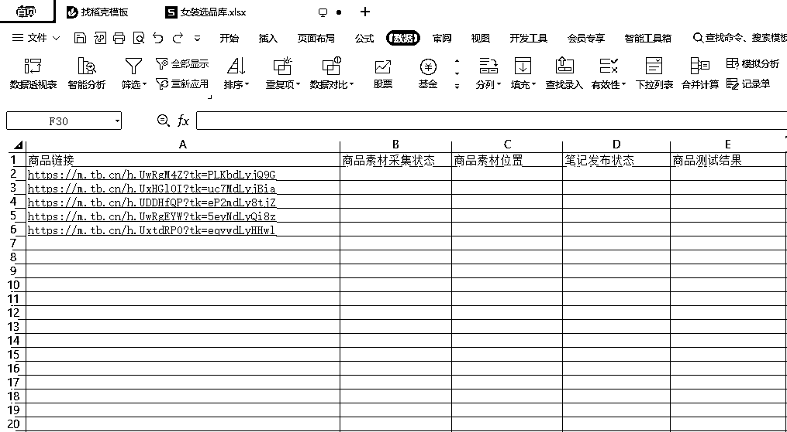

# 小红书无货源电商如何高效测品？

> 来源：[https://rlp3cigezs.feishu.cn/docx/B6jPdJ2qGoa6Jsx5ky8c5iU8nUf](https://rlp3cigezs.feishu.cn/docx/B6jPdJ2qGoa6Jsx5ky8c5iU8nUf)

大家好，我是沐风。最近，应该有很多同学都在落地小红书电商项目，我们都知道，对于电商项目来讲，选品是重中之重，而关于如何选品，星球里已经有很多大佬都已经详细的写过了，我之前也写了一篇关于选品的文章：《 》，大家有兴趣的话，可以看看。

不过，选品固然重要，但选出来的产品到底能不能出单，我们终归还是要去测试的，我们测的产品越多，出单的概率也就越高，那么我们该如何高效的测品呢？

其实，我们可以梳理一下整体流程：

首先，在测品之前，我们需要搜集产品相关的素材，然后直接发布或者进行二次创作之后发布，之后，根据测试数据来验证我们选出来的产品是否OK，如果OK，就继续围绕这个这个产品创作内容，获取更多流量，如果不OK，那就继续选品、测品，总结来讲就是：

选品->搜集素材->创作笔记->发布笔记->数据分析->决策->选品->......

因此，我们可以以选品为起点，建立一个选品库以及相应的素材库，并追踪记录该产品的发布状态和产品测试结果，而通过这种方式把整个工作流程标准化之后，我们就可以在一个时间段之内只专注其中某一个环节，进而大大提升我们的整体测品效率。

比如，现在我们基于淘宝来进行选品，那么，我们就可以基于我们选定的类目专门制作一个 Excel 数据表格，大致形式如下：

接下来，我们就可以去根据商品链接去采集商品相关的素材了，而关于素材的采集，我们可以直接使用一些浏览器插件去进行采集，采集完成之后，我们把该商品相关的素材都整理到一个文件夹中，并在 Excel 表格中记录一下素材的本地存储位置，这样我们就可以建立起商品和本地素材的对应关系，当我们需要创作笔记的时候，直接根据商品对应素材的存储位置找到相应的素材进行二次创作就可以了。

不过，相信大家应该也感觉到了，这个过程其实比较机械、枯燥，那么，针对这个环节，我们就可以利用 RPA 来搭建一个自动化流程，来进一步提高我们的生产效率，这里我可以通过视频给大家通过简单演示一下：

好的，以上就是我关于如何拆解和梳理业务流程，并利用 RPA 来实现部分业务流程的自动化，进而提高小红书电商整体测品效率的一些思考和实践，希望对大家有所启发，另外，如果大家对 RPA 感兴趣的话，也欢迎跟我多多交流。