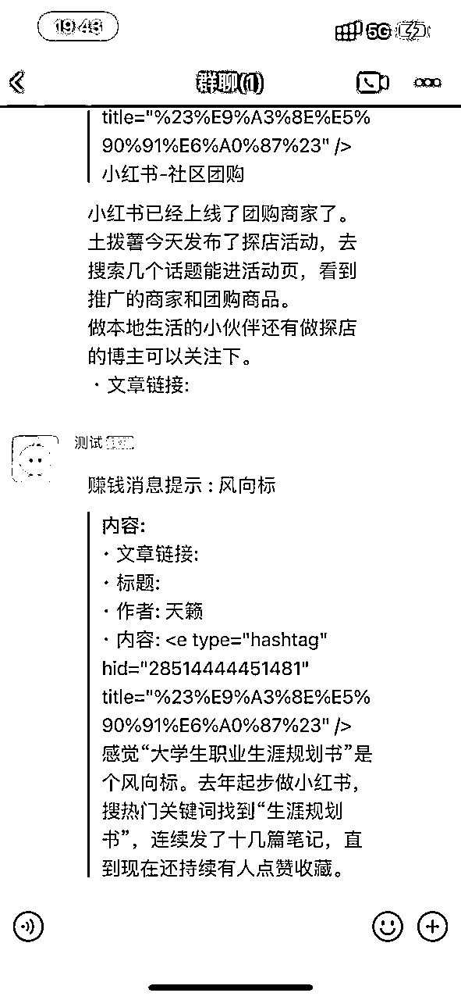
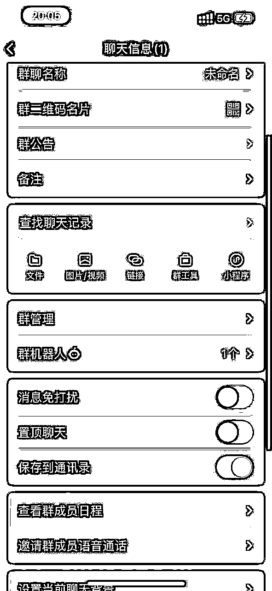
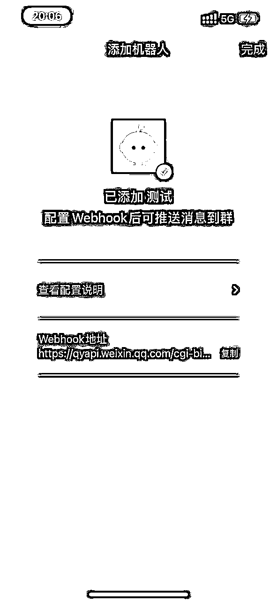
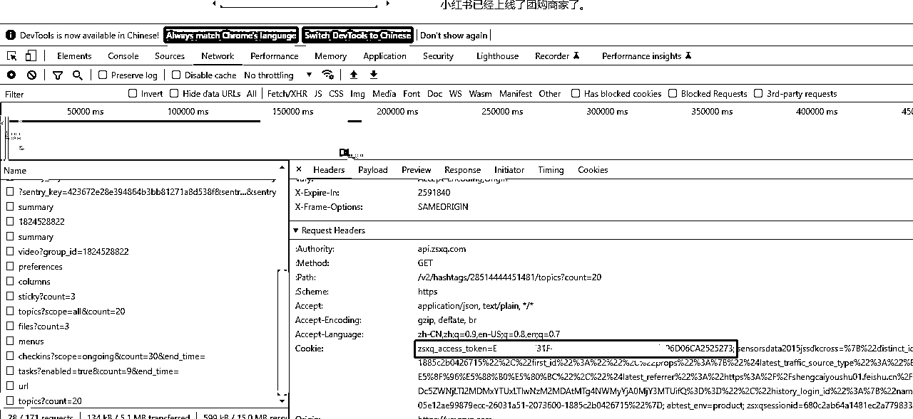

# 知识星球_微信群消息提醒

> 来源：[https://mwbd1qmlmx.feishu.cn/docx/BNZsd608eoQZffxlFzccXVVmnbb](https://mwbd1qmlmx.feishu.cn/docx/BNZsd608eoQZffxlFzccXVVmnbb)

## 1.背景

经历了14天的航海，今天找到了一个感兴趣的点，想做一个实时推送的群聊机器人，将生财每天的更新帖子推送到个人微信。

为什么要做这个小工具呢？平常上班时间忙，然后下班到家去翻历史内容，总感觉好像错过了几个亿似的，主要还是太懒，懒才能推动工具进步。

目前考虑点如下:

1.调研了知识星球网站api爬取相对简单，传入cookie就能获取自己所加入星球的信息

2.机器人最初选择考虑微信公众号推送，但是只有订阅号才有这功能，而且需要企业认证，暂时放弃，目前考虑企业微信的机器和飞书机器人

3.实现一个简单的初版，有定时消息推送，然后考虑按分类信息推送，最后考虑订阅信息和加入gpt总结功能

## 2.功能介绍

1.  已经支持企业微信机器人通知

1.  已经支持最新消息和风向标群通知

1.  支持linux和windows部署使用

1.  运行效果



## 3.使用教程

### 3.1 创建企业微信机器人

如果没有企业微信可以先注册一个，可以跳过各种企业资质认证，然后新建一个企业群，选择添加机器人，获取webhook地址(修改配置会用到)如下图所示：





### 3.2获取知识星球cookie

暂时没有做扫码登录，目前需要手动登录电脑端知识星球获取cookie，按f12,选择network，随便点击一个接口，然后获取复制，下图圈的部分：



### 3.3 修改配置

```
[wx]
# 微信机器配置(填写webhook后的uuid)
robotKey =
[zsxq]
# 获取最新消息
# https://api.zsxq.com/v2/groups/1824528822/topics?scope=all&count=10
# 获取风向标内容风向标
url = https://api.zsxq.com/v2/hashtags/28514444451481/topics?count=1
# 知识星球cookie
cookie =
# 解析数据格式为talk内容
type = 1
[config]
# 定时消息通知频率 默认1小时发布一次
cronTab = @every 3600s
```

#### 3.4 启动（linux）

```
# 假设程序部署在data/wechat 目录下，用绝对路径执行
nohup /data/wechat/wechatrobot &
# 检查服务是否存在
ps -ef |grep wechat
```


## 4.程序下载