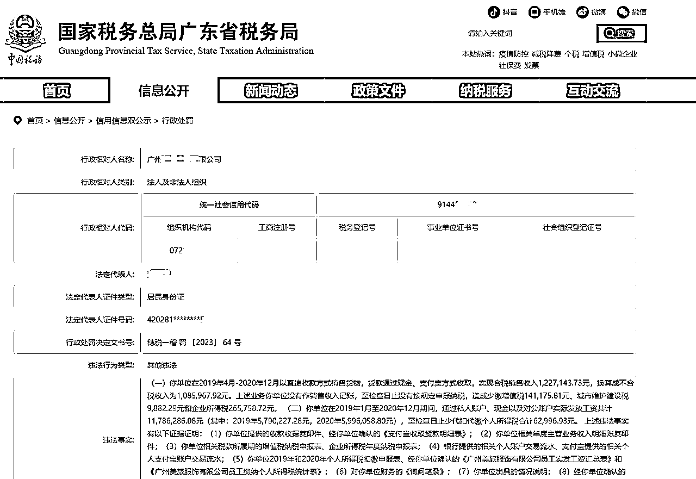
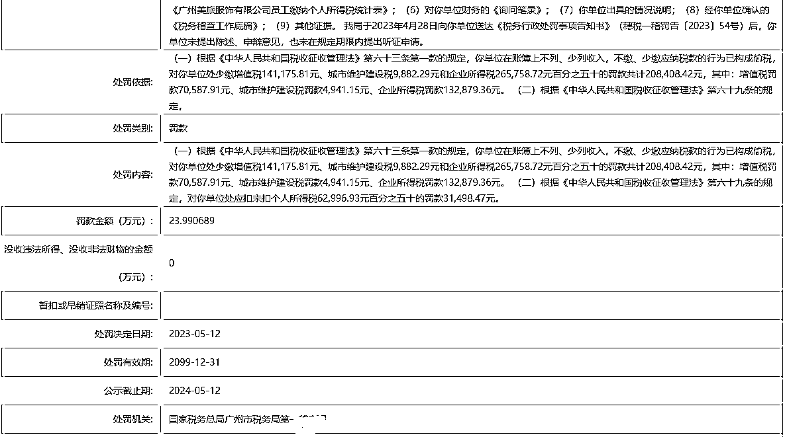

# 金税四期严控下电商企业老板应该如何应对？

> 来源：[https://d2dfqmvn0e.feishu.cn/docx/BiGGd6N0Zog6dyxpBnoc2MQknsW](https://d2dfqmvn0e.feishu.cn/docx/BiGGd6N0Zog6dyxpBnoc2MQknsW)

随着“金税四期+严征管”时代的到来，税务监管环境越来越严格，新闻更是频频爆出网红主播天价补税、直播电商、社交电商、等电商企业出现补税潮等各种税务问题，企业财税风险防不胜防。

今年5月，广州xx服饰公司，因通过现金以及支付宝收款含隐匿销售收入金额122万元，未计入销售收入，造成少缴纳增值税14万元.......

违法事实正文:

（一）你单位在2019年4月-2020年12月以直接收款方式销售货物，货款通过现金、支付宝方式收取，实现含税销售收入1,227,143.73元，换算成不含税收入为1,085,967.92元。上述业务你单位没有作销售收入记账，至检查日止没有按规定申报纳税，造成少缴增值税141,175.81元、城市维护建设税9,882.29元和企业所得税265,758.72元。

（二）你单位在2019年1月至2020年12月期间，通过私人账户、现金以及对公账户实际发放工资共计11,786,286.08元（其中：2019年5,790,227.28元，2020年5,996,058.80元），至检查日止少代扣代缴个人所得税合计62,996.93元。

处罚内容：

*   根据《中华人民共和国税收征收管理法》第六十三条第一款的规定，你单位在账簿上不列、少列收入，不缴、少缴应纳税款的行为已构成偷税，对你单位处少缴增值税141,175.81元、城市维护建设税9,882.29元和企业所得税265,758.72元百分之五十的罚款共计208,408.42元，其中：增值税罚款70,587.91元、城市维护建设税罚款4,941.15元、企业所得税罚款132,879.36元。

*   根据《中华人民共和国税收征收管理法》第六十九条的规定，对你单位处应扣未扣个人所得税62,996.93元百分之五十的罚款31,498.47元。

### 金税四期严控下对电商企业有何影响？

金税四期上线，是“以数治税”来精准监管，简而言之就是通过大数据来多维化、全方位的全流程监控，对企业影响具体如下：

1、三全：全领域、全环节、全要素金税四期，不仅仅是税务方面，工商、银行、所有资产的监管。

2、广覆盖：比你还了解你的系统金税四期搭建了各部委、人民银行以及银行等至少46家参与机构之间信息共享和核查的通道，同时实现企业相关人员手机号码、企业纳税状态、企业登记注册信息核查三大功能。

3、智能监管：堪比抖音的推荐机制金税四期实现“税费”全数据、全业务、全流程“云化”打通，未来税的管理是智能化，全电发票的区域化推行，数字化税务管理。

4、个人资金交易受限：蚂蚁雄兵行不通个人卡交易、交易类型、交易金额及交易频次均受到监管。

5、自然人一户式个人的资产收支更加透明化，自然人纳税识别号的建立与纳税人身份、单位、家庭、个人收入等数据一体融合，建成全国个人纳税人“一人式”档案。实现了从人找数“填报”到数找人“确认”的转变。

6、违规即违法没有实际业务为前提的开票行为属于虚开发票行为，“税收洼地”不是不能用，而是不能“滥用”！

### 税务稽查电商企业哪些方面？

随着《电子商务法》出台后就不断的升级与完善，再加上电子商务税收数据分析系统的配合，再想偷逃税款已经是几乎不可能的事了，税局也会从这三大方面开始调查：

隐瞒收入或虚开发票刷单刷量电商直播带货违规避税

1、隐瞒收入或虚开发票

很多电商商家利用线上买家不开发票的习惯，不申报，少列收入等。

但是，我们都很清楚，所有的电商平台都存有完整的销售订单记录，银行、支付宝、微信等等都是有收款流水的。

要知道，电子商务法早有规定：电商平台有义务保留至少3年的交易数据，并依法同步给税务机关。

一旦被查到，商家肯定是补税+滞纳金+罚款，按《税收征收管理法》，将会面临未收税款50%以上3倍以下的罚款，并影响企业信用等级。严重的还可能面临牢狱之灾，多年打拼一无所有。

2、刷单刷量

电商商家最为熟悉的手段：刷单刷量。

这种虚构业务的行为十分危险，一直都是税局监察重点，通过大数据分析比对，早前就有北京，广州等各地的商家因电商平台销售数量和金额与申报的销售收入不一致而被查。

3、直播带货违规避税

直播带货不纳税面临的税务风险相当巨大，由于涉及到商家、平台、经纪公司、主播等多个主体，各个主体的纳税及扣缴义务比较复杂，一方被查，其他各方若同样存在违法违规行为，则很难逃脱干系。

个人直播带货也需要缴纳个人所得税，如企业未给合作的个人申报个税会带来追缴补税的风险；

4、达人品牌推广无票支出

平台的各个达人合作，也会出现不同的情况，有公司主体与没有公司主体的自然人，他们产出内容为电商企业进行产品的推广，但没有公司主体的个人的结算，需注意：企业合作各大平台的达人推广企业有义务帮助个人代扣代缴个人所得税，如对私结算，无票支出，企业的税负率增高，还会涉及到补税风险；企业可根据具体的情况按照适合缴税科目来进行缴纳个税，如企业未给合作的个人申报个税会带来追缴补税的风险；

### 电商企业如何做到财税合规？

电商企业财税合规的好处：

1、规范会计工作程序，帮助企业做出更正确的业务决策；

2、使财务透明，有利于降低卖家的税收风险；

3、可以提高税务机关对卖家的税收信用评级，减少税务检查，更方便企业享受国家优惠政策。

无论电商企业如何发展，“合规”都是绕不开的话题，也是势在必行的，建议各电商老板尽早把握趋势，规避风险，安全运营。简单跟大家聊一下电商企业财税合规需要注意的几个点：

01 真实申报销售收入

即使客户不要发票，但无票收入也要据实申报。

增值税申报的收入包括：开票收入、未开票收入、稽查差补收入等，因此，不论是否开票，实际销售了，都要进行纳税申报。

申报时在增值税申报表附表1里的未开具发票一栏据实填写。

02 绝对不能虚开发票

金税四期对“非税业务”进行全面监管，虚开发票后果非常严重：不仅有最高罚款50万，构成犯罪的，还会依法追究刑事责任。

03 好评奖励、促销活动的涉税处理

好评返现，税务处理：

1、企业代扣代缴返现给客户是否需要缴纳个人所得税，分两种情况：

A：如果购买商品，收货后，给予好评返现5元，开具发票的时候，发票上把这个5元作为折扣开具在发票上了，不应该交个税。

根据财税[2011]50号规定：企业通过价格折扣、折让方式向个人销售商品(产品)和提供服务不征收个人所得税。

B：如果购买商品后，好评返现5元，直接发红包5元，个人购买的商品还是按照原价开具发票的话，这个好评返现属于偶然所得，要交个税。

适用《国家税务总局关于加强网络红包个人所得税征收管理的通知》(税总函〔2015〕409号)第一条规定，对个人取得企业派发的现金网络红包，应按照偶然所得项目计算缴纳个人所得税，税款由派发红包的企业代扣代缴。

现在的电商企业一般都是第二种情况，需要代扣代缴个税。

从税收征管角度，返现红包的确应该交税，但这毕竟是互联网时代企业创新营销的一种手段，这种商业模式是不是应该给它一定的容忍空间，这也是一个值得探讨的话题。

2、企业可以在企业所得税前扣除：因为好评返现不属于增值税的应税范围，无需发票作为税前扣除凭证，企业提供相关的支出证明资料可以税前扣除。

相关资料包括：活动规则公告、电子商务系统内订单明细清册、实际已返现明细清单、支付凭证等资料，该项目按业务宣传费税前扣除。

促销是商家常用的手段，比如：代金券、打折、满减、定金膨胀（如：付定金10元，尾款结算抵20元）等。

打折、满减属于商业折扣，税务处理：

1、销售额和折扣额在同一发票注明，并且折扣体现在发票金额栏，按折扣后的余额作为销售额计算增值税和企业所得税。

2、不满足第一种情况的，不论财务上如何处理，均不得从销售额中减除折扣额计算增值税、企业所得税。

定金、代金券按预收款处理，税务处理：

1、销售时，按定金金额开具增值税普通发票：使用“未发生销售行为的不征税项目”编码中的“预付卡销售和充值”开具，税率栏应填写“不征税”。

2、使用时，对顾客补付金额开票，收入无需调整，不影响企业所得税。政策依据：国税函[2008]875号，销售商品采取预收款方式的，在发出商品时确认收入。

04 尽量避免个人账户收款

个人账户收款避税，屡屡被罚，个人账户若是收款超过5万元人民币时就会被监控。如果超过20万元人民币时反洗钱系统会自动检测到数据；银行等金融机构对于大额支付和可疑交易会实施监控，并且，对于大额交易和可疑交易履行报告义务，一旦发现问题，就会马上向中国反洗钱监测分析中心报送大额交易和可疑交易报告；情节严重者银行会冻结银行账号迫使个人账户不得进行交易，引发税务稽查风险。

如收款人为法人账户，财务未把法人收款资金纳入企业销售收入，有隐匿企业销售收入的嫌疑，会涉及到补税的情形，上述案例中就有提到的偷逃增值税补税的情形。

05企业应尽量不选择个人账户进行付款

如果公司转款给到个人的话，要有合理的理由，以及公转私的合规凭证，一定做好财务和税务的合规处理。

*   无票支出财务会在账面为难，除非个人去税局代开对应金额的发票提供给到企业，还会导致为减少企业所得，而买卖发票的行为；

*   如按照劳务报酬给到个人进行结算的话，需提前告知个人，以免年度汇算清缴时，个人进行投诉，导致企业有被税局问话的风险，导致税局对公司进行税务稽查；因劳务报酬会在每年的的个人app汇算清缴中并入综合所得，个人全年收入可能会因为劳务报酬的金额增加，个人有补税的风险，而进行投诉此发放此笔费用的公司。

*   如果一定按照个人生产经营所得给到个人结算的话，要给到外包服务的个人进行结算合作正规的具有税局颁发的委托代征资质的灵活用工平台进行结算，企业作为义务扣缴人，如未给到个人代扣代缴个税，税局追缴时，企业无法向单个个人去追缴税款，损失就得企业自己担着。

#### 做好事前规划，有备无患，祝各位老板们天天爆单 ！

如有疑问，随时交流，有问必答