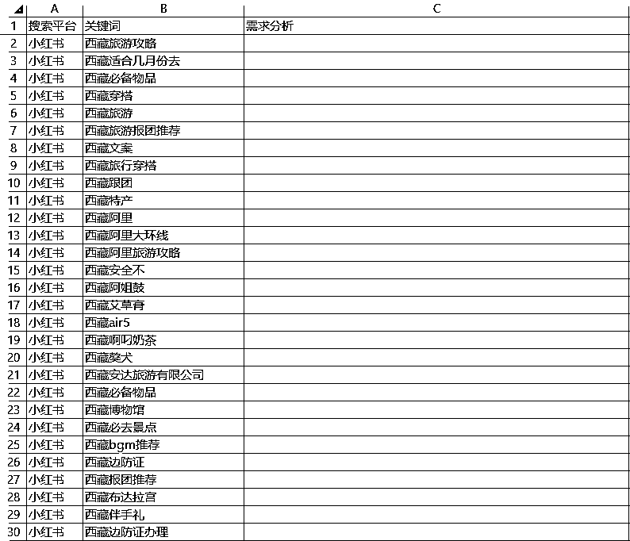
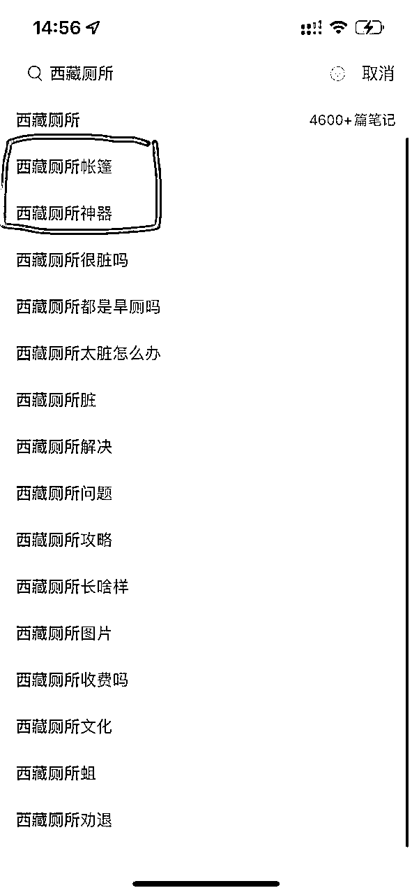
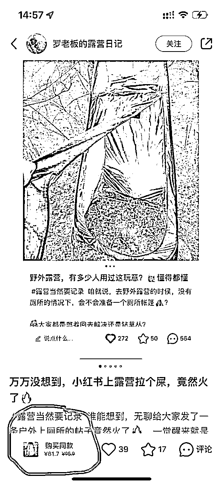

# 作为普通人，我们该如何挖掘商机？

> 来源：[https://rlp3cigezs.feishu.cn/docx/CWTGdnwBZoreawxpweSc128UnPe](https://rlp3cigezs.feishu.cn/docx/CWTGdnwBZoreawxpweSc128UnPe)

# 需求是商业的起点

大家好，我是沐风，今天我想跟大家分享一下：作为普通人，我们该如何挖掘商机？

通过生财，大家已经见识到了各种各样的赚钱项目，但实际上，我们也知道，任何一个项目的底层逻辑基本上都可以概括为：

需求-产品/服务-流量-转化-交付-变现。

也就是说，需求其实是一切商业活动的起点。那么，如果我们能围绕着某类目标人群挖掘出一些需求，去针对性的提供一些差异化的产品或服务，并以此为卖点去获取流量，然后做好转化和交付，那么，变现就是水到渠成的事情了。

只不过，对于我们大多数普通人来讲，在资源和精力有限的情况下，我们可能无法兼顾所有环节，这个时候，我们只需要做好其中的某几个环节，然后把剩余的环节交给其他更专业的人去完成，我们一样可以实现变现。

比如，对于大多数做无货源电商的同学来讲，我们只需要做好选品，然后围绕着产品去创作一些内容（这里主要指的是兴趣电商），比如图文或者短视频，进而获取流量，完成转化，赚取收益，而真正的交付，我们其实是交给我们的上家来完成的。

又比如，对于大多数做自媒体的同学来讲，我们只需要在某一个领域做好选题，然后根据选题去创作内容，并获取流量，以公众号为例，如果我们开通了流量主收益，那么此时，我们相当于把我们获取的一部分流量打包出售给广告主，从而赚取收益，而真正的转化和交付则是由广告主来完成的。或者，我们也可以去分销一些商品来获取佣金，这种情况下，相当于我们又多了一步转化，而真正的交付则是由商家来完成的。

而无论是选品还是选题，归根到底都是为了满足用户的某些需求，要么是生理上的，要么是精神上的，或者兼而有之。因此，我们不难得出，我们选品或者选题的过程，本质上就是在挖掘需求，而需求挖掘的越精准，我们成功的概率也就越大。

# 如何高效挖掘需求？

那么，我们该如何高效的挖掘需求呢？

首先，我想提醒大家的是，在进行需求挖掘的时候，我们最好是基于我们自己当前所处的行业或者已经有一定了解的行业去挖掘，这么做有两点原因：

1.  对于我们当前所处的行业或者已经有一定了解的行业，我们可以利用自身经验，更快的判断出来这些需求到底是真需求还是伪需求。

1.  在判断需求的确存在的情况下，我们就可以直接利用现成的行业资源和优势，更快的围绕着这个需求去为目标用户提供产品或服务，并最终实现变现。

而对于一个我们不熟悉的行业，我们挖掘出来的需求则很有可能是伪需求，或者即便这个需求的确存在，我们也不具备相应的资源去快速落地，而对于大多数普通人来讲，想要整合这些资源，可能又会增加不少难度，那么，这样的需求，即便我们发现了，对我们来说价值可能也没有那么大。

理解了这一点之后，我们就可以开始进行需求挖掘了，那么，问题来了，我们该如何下手呢？难道全凭我们去观察和思考吗？当然，这并不是不可以，只是这种方式对于我们大多数普通人而言，难度太大了，因为它对于一个人的商业洞察力要求非常高。

那么，有没有适合我们这种普通人的方式呢？

有的，其实我们可以通过搜索关键词来进行挖掘，因为当用户在搜索框里针对某一个关键词进行搜索时，他一定是抱着某种明确的需求来的，那么，我们就可以利用他们的搜索关键词来反向的进行需求挖掘，于是，问题就变成了：

我们该如何找到这些关键词呢？

## 相对专业的方案

这个时候，可能稍微有一些经验的同学都知道，我们可以利用 5118 来收集关键词，这个网站功能非常强大，它涵盖了国内各大主流平台的关键词，因此，我们可以先从上面导出一些关键词，并进行需求分析，进而挖掘出一些比较有商业价值的需求。

不过，任何事情都是有两面性的，5118 也不例外，比如：

1.  它毕竟是一个三方数据平台，所以在数据的准确性、实效性方面肯定不如官方数据。

1.  由于功能复杂，专业性比较强，里面包含很多专业名词，对于普通人来说，有一定的学习门槛。

1.  想要使用它的很多功能，需要升级会员，而这个会员的价格并不低，根据会员等级的不同，每年可能需要几百到几千元不等，而我们很多时候需要的可能只是其中的一小部分功能。

## 对普通人更加友好的方案

那么，有没有一些对我们这些普通人更加友好的方案呢？

答案是肯定的。实际上，当前各大主流平台，都是包含搜索功能的，传统的搜索平台百度就不用说了，除此之外，像小红书、抖音这样的内容平台，也都开始推出各自的搜索功能，毕竟有内容的地方用户就一定搜索需求，所以各大平台也都在有意识的培养用户这方面的心智，实际上，我们也不难发现，很多用户也都开始逐渐习惯在有问题的时候直接去小红书或者抖音搜索，而不是百度。

PS：我之前在抖音工作的时候，就是做搜索相关业务的，所以对于平台在有意识的培养用户搜索心智这一点上，还是有所感触的，只不过我属于客户端开发，所以当时的关注点都是在客户端 App 的一些开发工作上，不会直接接触到后台用户搜索数据。

回归正题，既然如此，那我们有没有可能利用这些平台的搜索功能来挖掘需求呢？

实际上，我们会发现，当我们在这些平台上通过搜索框去搜索一些关键词的时候，它往往会给我们一些展示 sug 词，sug 其实是 suggestion 的缩写，也就是联想词或者引导词，这些引导词并不是平台随便给我们的，而是服务端基于大数据统计、分析并整理得来的，因此，它们跟我们实际想要搜索的关键词是有很强的关联性的，而且也会跟随着用户搜索需求的变化而变化，平台之所以这样做，本身也是为了优化用户的搜索体验，所以，这些引导词对我们来说很有价值，因为我们可以借助它来发掘一些比较精准的用户需求。

举个例子，比如一个用户想要去西藏旅游，那么，他可能就会先打开小红书，搜索一下跟西藏相关的一些内容，而当他在搜索框里面输入“西藏”这两个字的时候，系统就会展示出很多跟西藏相关的引导词，如下图所示：

这里可能有同学会说：这个虽然有价值，但是这些引导词数量有限啊，单从这些引导词里面我们也很难发掘出什么有商业价值的需求吧？

不要着急，既然这种方式可行，那我们是不是可以再想办法优化一下？怎么优化呢？

我们可以先简单思考一下：当用户输入完西藏之后，他下一个字会输入什么呢？这时候，可能有同学会说：我又不是 AI，可能性太多了，我怎么能猜得出来呢？没关系，我再给大家一点提示：

这个时候，想必大家应该已经明白了：

虽然我们不知道他会在西藏这个关键词之后输入什么内容，但是无论他接下来要打什么字，他总得借助 a-z 这 26 个字母吧？那么，我们是不是就可以利用这种关键词+26个字母随机组合的方式，来获取到跟西藏相关所有关键词了？而且正是因为随机组合，不才能组合出一些我们意料之外的关键词吗？

而且上面我们也说了，这些关键词都是平台基于用户最近的搜索趋势统计、分析并整理之后展示给我们的，所以，我们可以简单的理解为这些引导词就是代表当下大部分用户关于目标关键词的需求。

因此，我们只需要把这些关键词批量整理下来，然后把它们复制粘贴到一个 Excel 表格里面，最后再逐个去分析，这样，我们是不是就有可能挖掘出一些有商业价值的需求了？

下面是我整理好的 Excel 数据表格的部分截图：

从这些关键词里面，我发现了一些我之前根本想不到或者完全不知道的关键词（当然，也可能确实是我孤陋寡闻），比如：

1.  西藏边防证。

1.  西藏air5。

1.  西藏无人机。

然后，我把这些关键词，再次输入到搜索框的时候，得到如下结果：

原来，这些并不为人所熟知的关键词背后真的存在着一些细分需求，而针对这些细分需求，自然而然的就延伸出了一些项目，这些可能就是单靠我们想很难想出来，而别人可能又在利用它们赚钱的项目。之后，为了求证我的想法，我专门跟一位在西藏呆了 9 年的朋友沟通了解了一下，她说确实有一些个人或者旅行社在做这些业务，而且业务很成熟。

而在我把这份 Excel 表格分享给她之后，她说：我在西藏呆了这么多年，万万没有想到，竟然会有这么多人在小红书上搜索：西藏厕所！！

于是，我又搜了一下西藏厕所这个关键词，发现：

哈哈哈，果然，有需求的地方就存在着商机啊！

# 更进一步

那么现在，思路有了，但是在实操的时候我们会发现，我们首先需要批量整理这些关键词，如果手动去一个一个去整理的话，可能就比较麻烦了，不过，这对于稍微懂点技术的同学倒也不是什么难事儿，比如，我这边是用 RPA 开发了一个工具，可以一键自动把这些关键词全部抓取下来，并存储到 Excel 表格中，方便我们后续分析使用，具体可以看下面的视频演示：

# 思维发散

思路有了，工具也有了，接下来，我们是不是可以大胆发散一下思维？

比如，以上我只是通过西藏这个关键词给大家举了一个例子，而全国有这么多省市，我们是不是可以根据自己所在的区域，来尝试一下看看会不会有什么我们意想不到的需求呢？

再抽象一下，这种方式本质上相当于基于地理位置来挖掘商机，那么，我们是不是也可以利用自己的行业关键词来发掘一些机会呢？比如：

做自媒体的同学，咱们可能经常会比较头疼的问题是：围绕着一个方向，不知道该如何选题。那么，咱们是不是可以利用这种方式围绕着一个关键词发散出来N多个选题呢？

做电商的同学，咱们是不是可以利用这种方式来发掘一些细分领域的蓝海品呢？

做技术的同学，咱们是不是可以通过这种方式来挖掘一些用户需求，然后基于这些用户需求针对性的开发一些工具呢？

除此之外，当我们发掘出一个有商业价值的关键词之后，我们是不是可以再以这个关键词为词根，用同样的方式，挖掘出来更多的关键词呢？

所以，能不能充分发挥出这套思路和工具的价值，以及能发挥出多大的价值，就看各位同学的想象力了，哈哈~

# 回到起点

在文章的开始部分，我们提到：需求是一切商业活动的起点。但是需要提醒大家的是，挖掘出有商业价值的需求并不意味着我们就一定能赚钱。

因为在这之后，我们还要去想办法针对这些需求为目标用户提供相应的产品或服务，并尽量跟竞品之间形成差异化竞争，那这里面可能又会涉及到一些类似资源整合、产品开发之类的工作，最后，我们还要想办法去解决流量、转化和交付的问题，而等这些环节搞定之后，才会到变现的环节。

当然，正如前面所说，我们也未必需要搞定所有的环节，具体还是要根据我们的业务形态以及变现方式来确定。

# 总结

文章的最后，我也跟大家分享一下：我是如何发掘出这套思路并把它开发成一个工具的？

首先，要感谢亦仁，为我们提供了生财有术这样一个非常有价值的平台，通过翻阅一个个的精华帖和项目案例，我的视野和认知得到了极大地提升，这其中包括：

1.  通过 @mr.hua 的文章我学习到了如何发掘隐性需求，并围绕隐性需求做一些差异化产品。

1.  通过 @盗坤 和 @刘小排 的文章，我学习到了蓝海战略和交付外包的思维模式。

1.  通过 @小曾 的文章，我学习到了可以通过关键词来挖掘需求。

1.  最后，说来惭愧，技术出身的我，也是来到生财之后，才知道 RPA 这门技术，而这一点则是来源于 @阿愚呱呱 和 @子木 所写的关于 RPA 的文章，深入研究之后，我才意识到 RPA 的价值，之后，我便开始在一些项目中尝试利用 RPA 来提升效率，具体可以参考：《 》、《 》

所以，感谢以上各位的无私分享，也正是受你们的影响，我才开始鼓起勇气在生财分享自己的一些思考和经历。很快，就有一些同学跟我发私信并链接到了我，其中有一个同学在跟我深度交流之后，又介绍了另外一个生财圈友给我认识，她就是我在上面提到的那位在西藏呆了 9 年的同学。

在跟她交流的过程中，我得知她想在小红书做西藏相关的旅游 IP，但却苦于不知道该怎么选题，所以一直以来，她完全是凭借自己这么多年在西藏的经验来进行内容创作的，这样效率就很低，而且效果也不是很好，因为很多时候她所想的跟用户所需要的可能并不匹配。

而正是有了前面的积累，这个时候，我才突然想到：是不是可以通过搜索框中的引导词来挖掘需求，并进行选题？然后，我就把这个思路分享给了她，她听完之后感觉思路一下被打开了！

之后，我并没有停止思考，而是基于这一点继续延伸，最终形成了这套思路，并基于这套思路开发了这个工具。

我想，这就是生财里大家一直说的：越分享，越幸运吧！我们并不一定非要等到成为别人眼中的所谓大佬之后，才觉得自己有资格去分享，而是在不断思考、实践、分享之后，通过外界的反馈，不断地优化调整自己的思路，发掘自己的天赋，并通过刻意练习将这些天赋慢慢转化成自己的优势，这样，我们才有可能逐渐成长为理想中的自己。

最后，也感谢各位同学有耐心看到这里，如果这篇文章能给你们带来了一点点启发，那就再好不过了，同时，如果大家有一些其他的想法，也欢迎跟我多多交流沟通。