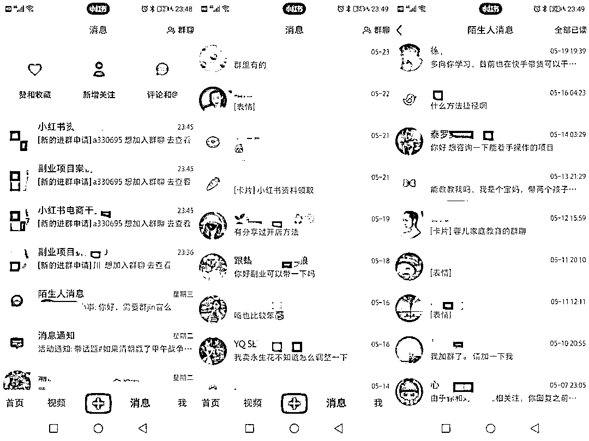
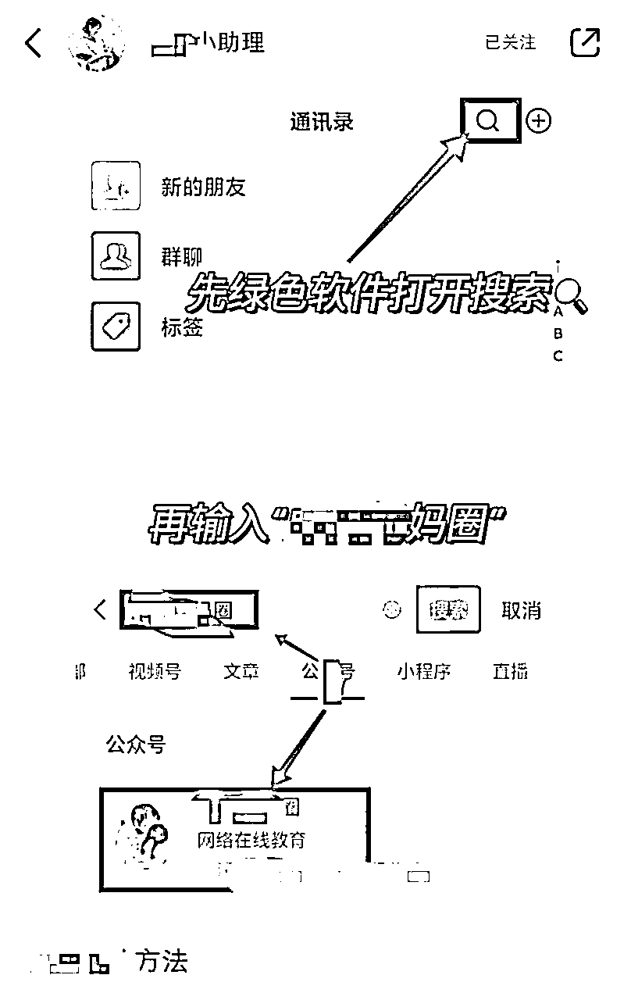

# 日引流200+！贼安全的一套小红书引流技巧！

> 来源：[https://p03a4vs9s2.feishu.cn/docx/CafcdYCEao0v1cxXOKxc3GHgnFc](https://p03a4vs9s2.feishu.cn/docx/CafcdYCEao0v1cxXOKxc3GHgnFc)

哈喽，我是叁斤，主要在小红书赛道

最近小红书引流挺严格的，好多朋友找我咨询的都是关于引流违规的问题

之前我分享过：引流底层逻辑和套路拆解

但之前这份偏理论，不是上手就能用的方法

今天分享一个我使用了很长时间，都没有出过任何问题的引流方法

靠这套方法，公众号一天引流上百个人，稳定每天都能加几十个微信

废话不多说，直接上操作：

目录：

引流方法介绍

操作细节

注意事项

# 一、引流方法介绍

一句话概括：

建立小红书群，通过发布引流笔记，吸引用户进群建联，再用小号在群里发布引流图片和话术

## 1、引流笔记

之前在 引流底层逻辑和套路拆解 中分享过。

这里一句话简述：

收集爆款选题、封面，制作用户感兴趣、有需求或者有痛点的内容，在内容中放置“钩子”，让用户自发跟你建联

## 2、建立小红书群

现在小红书群都是开放的，可以在：

小红书 ➡️ 消息 ➡️ 右上角群聊 ➡️ 创建群聊

### 群名字命名

群名字要跟你的产品要高度相关，而且要让别人知道群内大概有什么

如，我要引流副业粉，我群聊名字就是：副业项目拆解或者副业资料分享等

如果你提供有资料，就写上xxx资料领取，总之让人一眼就知道群里有什么，并且愿意进群

### 群聊管理

大部分群聊设置都是默认的就行，但以下这几个需要自己注意一下

1、在个人主页展示

这个功能一定要打开，否则别人在你主页看不到这个群聊

2、系统默认欢迎语

这个功能可以关掉，没什么必要，会影响进群的感官体验

3、进群确认&展示历史消息

这两个功能长期打开就行

4、关联笔记

这个功能很重要，如果不关联笔记，别人就无法从笔记中看到你的群聊，会损失很大一波流量

所以在群聊设置好后，记得关联上群聊。之前发过的也可以关联上，还有流量的笔记都可以关联

### 关于群禁言

自从有人发布过代开禁言的副业后，小红书多了一大波代开禁言的账号

由于账号太多，影响了社群体验，所以小红书把这个方法给掐了

现在小红书已经不能禁言了（以及开过的可以继续）

## 3、引流承接设置

在引流前，制作一份引流sop图，有很多方式

*   手写微信号

*   背景图植入微信号

*   抠键盘写微信号

*   让人留下微信号

*   ……

这些方式都有效，也都会有风险。微信号容易检测，且加的人太多会影响微信号

分享一个亲测风险极低的方式，但是会有点绕

### 一句话概括：

创建公众号，引流到公众号承接，再从公众号筛选用户转到微信

### 公众号设置：

公众号注册这里就省略了，网上很多教程，不会的也可以直接搜“微信公众平台”，按流程一步步操作就行

需要注意的是，每个实名现在只能注册一个公众号，但可以绑定5个公众号

设置主要关注2部分：

*   自动回复：设置一个关注自动回复，可以写上自己的优势以及你的资料领取方式，在末尾可以放上微信号

*   菜单栏：这里要设置一个能联系上你的方式，可以直接放“联系XXX”的链接，点开直接发送二维码

### 公众号维护：

公众号维护不是重点关注项，有空可以做一些日常更新，没空可以月更都没关系

# 二、操作细节

一句话概括：以最低风险的方式发布最直接的引流信息

## 1、小号设置

任何操作，只要是你主号发布，都会有一定的风险。所以我们要把风险转移到小号

*   注册一个新的小红书，命名为“XXX小助理”

*   将小助理拉进群，设置为管理员

*   只要有人进群，就发布群公告或者引流sop图

最好所有操作都由小助理完成，这样的风险是最低的

## 2、引流sop图

给大家看看我的图（名字是手动打码）：

基本上一眼就知道应该怎么联系我，但是整个图片没有留任何联系方式

这个图片我自己当笔记发，也能审核通过

制作方法也很简单

*   截一张通讯录图

*   截一张搜索结果图

*   打开美图秀秀，拼图

*   打开涂鸦笔，把敏感字涂鸦掉

### 方法延伸

如果不想引流公众号，也可以用同样的方式，把你微信名片截图下来

只留下头像和微信昵称，其他全部打码，再拼图，这样的风险也很小

## 3、群筛选

前面说了，现在禁言已经失效了，所以进群要做一些筛选，炸群的人要避免

怎么识别炸群的人？

*   使用默认昵称的一律不放进群

*   同行不放进群（各行业自行识别）

*   “蜜桃”之类字眼的不放（该品牌做qqny的，炸群特别特别严重）

*   ……

另外，有人发广告之后要及时撤回，广告太多会被举报，群聊也会受到管制

为了节省管理经历，尽量让大家不要发言，有问题加微信即可

# 三、注意事项

## 1、人群筛选

为了节省销售压力和降低时间成本，可以按照前面的方法在小红书群做一遍筛选

然后到公众号后，如果意向不是特别强的，一般都不会加微信

如果想再筛选一次，可以在菜单栏和自动回复中写明你的付费项目，有需要再联系你，这样可以节省很多沟通时间

## 2、注意分流

即使通过公众号引流，我也加爆过几个微信。所以在引流的时候一定要注意分流

多设置几个微信，备注加不上的时候可以加其他微信，这样可以节省一部分流量流失

## 3、小号管理

小号简介可以@大号，大号@小号，这是不违规的，另外，小号尽量不要去私信评论中的用户

私信是最容易被监管的，如果私信太多很容易封号

有用户私信，也引导进群，在群内引导去公众号

一句话概括：一切私信行为，请在微信中完成

# 总结

以上方法是我实操几个月的总结，这几个月下来效果都很不错，而且挺安全的

该踩的雷我也踩过，留下的都是安全的精华了

引流方法有很多，我自己试过的也很多，我自己实操，也是好几个引流方法结合在一起用

之后有时间会把所有方式的sop都写一遍

这个方式里面涉及的细节也没有全部写完，篇幅太长了，我太懒了……