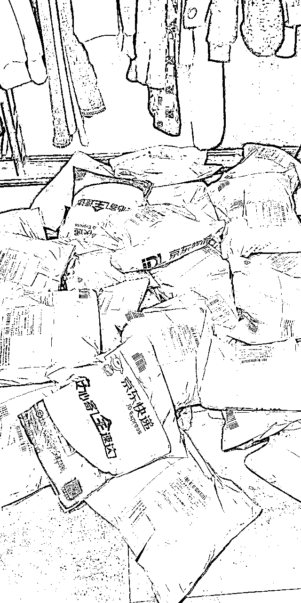
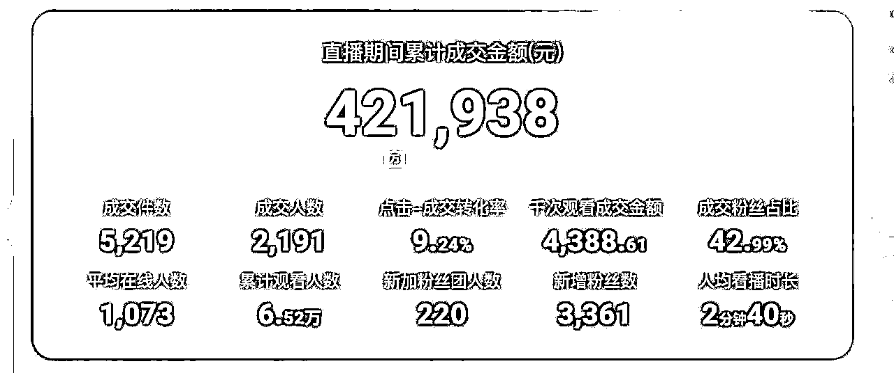
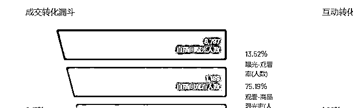
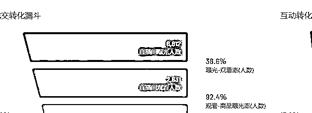
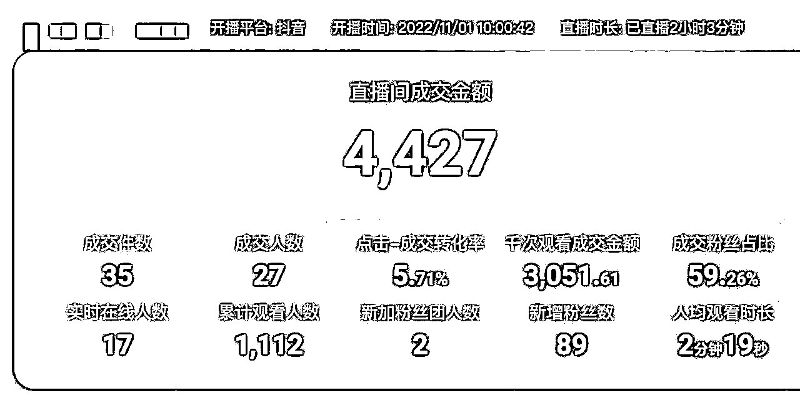

# 《3次濒临结业到团队月产出百万营业额，关于我们在抖音女装直播赛道上的经历》

> 来源：[https://shengcaiyoushu01.feishu.cn/docx/Cv1JdoQtGobPiVxSNglcTSBnn4f](https://shengcaiyoushu01.feishu.cn/docx/Cv1JdoQtGobPiVxSNglcTSBnn4f)

# 正文

各位朋友们大家好，我们坐标山东，主业是女装类目的直播电商，在这条赛道上，我们经历了从项目立项开始，持续几个月每天不出单，到目前通过团队努力稳定在每月月度百万营业额产出的阶段状态。

月产出百万营业额的3个关键点：优化“人货场”要素适应抖音推荐算法+迭代选品供应链和品类+自己先干会再招人筛人组团队。

深知还算不上什么成绩，所以现在还在持续努力的过程当中，在这个过程中我收获了关于自己工作上的一些经验教训，在这里分享给大家，希望能对你有所帮助。

1.入局抖音直播电商的契机

2.从0-0.1，3次濒临结业，咬牙开始自播

3.月产出百万营业额的3个关键点

4.复盘和总结

# 一、入局抖音直播电商的契机

刚接触到直播电商的时候，我们适逢在做一个大型的实体餐饮项目，血亏，当时我自己总结写了一篇标题为《我是如何凭实力亏钱》的文章，也正是在那个时候，出于及时止损、创造新增收点的考虑，我们同时在进行着现在这个直播电商项目的尝试。

# 二、从0-0.1，3次濒临结业，咬牙开始自播

在项目开始初期，我们主要做了项目选址、团队组建、供应链选品这几个事情。

## 项目选址

首先，我们把项目的执行地址选在了北京，原因有两个，一是离山东近，来回交通方便。二是我们认为北京的各项资源尤其是主播、直播运营这些方面的人才资源应该会比较丰富，方便我们后续业务和团队的拓展。

在北京这个寸土寸金的地方，房屋租金是相当贵的，由于我们项目才刚刚开始，手脚不敢太大，于是租用了一个百十来平的民用住宅作为直播开展的场地，这个住宅当时的租金就是一年接近20W的样子。

## 团队组建

然后在初期团队的组建上，当时在北京的初期团队成员就是我一个家人（我的姐姐）、一名主播、若干助理，因为我还在主做当时正在进行的餐饮门店，所以姐姐全面负责北京这边的统筹工作，那名主播是我们之前就认识的一位北京本地人，是从别的行业跨行业过来做带货主播的，所以在直播这个板块也没有什么经验，助理之前也没做过直播这个行业。

可以说，初期的团队是完全业余的一个团队，大家完全是摸着石头过河，或者说是石头都摸不到光着脚过河的状态。

## 供应链选品

再一个是选品供应链上，因为姐姐之前就接触过服装供应链，所以在这一块上还是有一定的基础，相对比选址、团队这两项前期准备而言，要稍微稳一些，在项目准备的前期，我们也花了大量时间去跑了供应链现场，但是主要的生产线也就是卫衣、T恤系列，还是比较单一的状态。

做了这些的前期准备，同期直播电商这个行业也是才刚刚兴起的苗头，我们对这方面的运营几乎一无所知。

起先账号还不是在抖音直播，而是在一个不知名的女装垂类直播平台进行直播带货，每天的工作节奏大概就是，主播一早就开始拿着现有的衣服，在直播间镜头前不停的进行讲解，一直讲到下午、晚上，一场直播大概要进行6-7个小时，但是结果是几乎一单不出。

现在来看肯定有很多原因可以分析，比如团队没有组品排品的意识和准备，直播间主播没有讲品的节奏和思路，投放策略也是没有做等等。

但当时我们都很咂舌，不得其解。后来就两个多月的时间，每天几乎就是主播直接上去讲，助理在一旁默默给直播间点赞这样的工作状态。

结果自然可想而知，长期不出单的情况让主播变得越来越麻木，大家也逐渐失去工作的热情，每一天几乎都是感觉在自我消耗。

最后那名主播实在是耗不住了，跟我们提出了离职，也是在这样一个背景下，我们重新衡量了在北京的投入成本，决定做一次回撤，项目继续，从头开始，但是要把地点移动到山东本地来，方便集中火力来做这个事情。

回到山东后，我们做的第一件事就是重新组建新的直播团队，新招入了一名主播，也联系了本地的一名运营，准备开始重新开展我们的项目，这个时候，抖音电商开始兴起，我们觉得是一个风口，所以把直播的阵地也全部转移到了抖音这边来。

以为经历了一段时间项目的测试，这次会有一个好一点的结果，然而还是持续着之前的状态，每天几乎颗粒无收，我们这个主播很能坚持，只要开播就很认真的在讲解商品，所以我们把问题的关注点就没有放在她的身上，而是去考虑是不是福利活动没有设置好，衣服的定价没有做好，于是就有了9.9炸一件福利款、点赞评论截图抽奖送这样的活动，甚至我们还每天投入万数的投放费用，让第三方代投来给我们进行商业投放。

可是结果还是不理想，最好的时候是一天出了几十单的情况，那还是羽绒服99来特价引导的（现在来看，这应该是99羽绒服产品本身起到了很好的引流效果，作为引流款代替付费做到了比较好的引流效果）。

终于，过了几个月，周而复始这样的状态，新的主播再次耗不住了，跟我们提出了离职，我们再次陷入了停摆状态。

因为餐饮项目就一直是亏损的状态，如果这个项目我们再失败，对我们而言会是难以承受的打击（精神和物质双重），所以尽管前两个阶段的尝试都以失败告终，我们还是决定要咬牙坚持：既然外部靠不住，那就亲自下场。

没有主播，我们就拿着衣服自己播，我们认真的在镜头下展示产品的细节，直播间虽然寥寥几个在线客户，但还是很用心的去做讲解和互动。

没有运营，就自己去一边学习一边操作，如何拍摄视频、如何组织一场直播、直播团队人员如何培养和分工、后端发货/客服/物流的流程如何梳理…

适时因为精力不够，我们索性壮士断腕，砍掉了一直很有期待但一直亏损的餐饮项目，集中精力在了直播电商这件事情上。

终于，我们前方后方在不断坚持完善的过程中，直播间在线人数从开始的几个人、到几十人上百人，甚至有时可以到四位数在线人数的直播间，单场营业额也从每天几十几百变成了单场稳定6位数的产出。

从每天颗粒无收到刚开始突破百单的时候，内心激动不已。

从最开始的寥寥几个包裹到勉强算得上爆仓。

营业额从0到现在的突破。

破四位数直播间，进入平台带货榜。

# 三、月产出百万营业额的3个关键点

认真思考下来，在运营的账号整个实现起量的过程中，如果要说起到关键作用的，那一定是少数的几处。

在我看来，值得一讲的地方，可能主要还是把握好了三个方面：清晰建立对平台运维的基础认知、完善选品供应链和产品策略、不断夯实自己的运营团队。

## 清晰建立对平台运维的基础认知

以抖音为例，我的理解是，平台其实将线下传统生意通过算法为其在线上营造了一个经济市场，算法就是这个市场中的“经济规律”。

可以说，所有的生意，都可以在抖音再做一遍。抖音平台通过“内容，渠道，模型"三个板块，将线下各种传统的生意，在线上进行了重塑。

以我们所处的女装服饰行业举例，首先，内容这个板块，它包含我们最经常提到的"人货场"这三个基本要素，这三个基本要素共同构成了一个内容组合，比如一个服饰直播间，就是主播（人）+女装服饰（货）+售卖场景（场）三者的结合。

拿我们直播间来举例，每一次直播的开展，主播首先会提前把要组的品做好搭配，然后整理好过品讲品的思路，和运营、中控、助播以及场控沟通好在直播间相互之间的配合，调试好场景和灯光、声音的适配度，特别说明一下场景这部分，之前在做一些清仓大促的时候，我们会使用自己仓库的场景来配合直播（现在我们品已经换掉了，所以这样的场景也就没再使用），直播间测爆款的时候，我们会选择服装卖场的场景，在播高品的时候，我们则多半会使用居家场景。

在我看来，场景是人货场三要素中很重要的一个要素，一个有效的场景能第一时间向用户传达主题，吸引用户进入直播间，紧接着是主播和直播间人员的配合、货品的属性，一系列组合最终让用户完成从进入、停留到互动和成交的转化过程。

同样的，一段短视频也是包含人货场三个部分，也需要有效组合，才能让用户完成一系列转化。

把上面的思路，用到我们组织过的直播活动来说吧，我们去年起了一个新的直播间，主播和团队成员都是新组建的，在刚开始直播的时候，因为没有磨合好人货场的组合，一场直播下来销售非常惨淡，下来我们做了一次复盘。

分析到因为是新号，首先是直播间场景的主题传达是不明确的，就一个整洁干净的直播间，并没有服装款式的露出，用户对我们不够熟悉的情况下，场景不明确很难完成第一步的进入，然后货品组品上有比较明显的问题。

秋冬应季的情况下，直播间主打品类还是一些较薄款的外套、福利品打底等，并且周边的包包、项链等配饰也没有组到货品当中。

最后因为场景、组品不当，新主播自身是受到影响的，对货品的演绎表现的不自信，综合以上这些因素，最终影响到了直播间的销售和成交。

接下来，我们把直播间的售卖场景做了优化，搭配好了女装款式，挂在展示架上，在直播间做露出展示，强调我们售卖的品类，同时组品上加入了当季的羽绒系列（同时提升了货品单价），以及包包、项链、围巾等周边配饰，通过这些小件来促进成交，主播的过品讲品逻辑在开播前也一起做了梳理，再一次开播，首先进入率有了明显的提升，并且销售额实现了翻番。（具体见下图）；

然后，内容的展现是需要通过渠道去实现并触达用户的，在抖音，展现内容的渠道主要是短视频和直播间，这就是为什么我们要坚持创作和发布短视频，并在直播间进行带货的原因，要形成短视频种草/引流+直播间拔草/沉淀用户这样的一种流量获取和转化的逻辑，短视频拍摄/直播间开播都是针对内容三要素的一种展现的渠道；

最后是模型，我们通过将自己生意的"人货场"这些要素进行内容塑造和组合，并通过短视频/直播间两个渠道进行内容展现，在一次次的与用户的互动和交易行为中，会在平台沉淀出越来越多的数据，形成相对集中的互动（点赞/评论等）标签，交易（下单/成交等）标签，用户兴趣（服饰/日用/小说）标签等，这些标签数据共同构成了我们的生意在抖音生态里的模型，可以理解为在这个虚拟世界中的商业模式。

能否成功经营账号，获得目标用户的认可，一定程度上取决于我们的模型是否垂直和明确。算法是一种大的机制，随着平台方针的改变随时会有变化，但不是所谓的玄学。

这次起新号，优化直播间之前的进入、观看比率，销售结果。

优化人货场要素之后各项数据实现倍数提升。

## 完善选品供应链和产品策略

到目前，我们做了三次迭代。第一次，也就是刚入局抖音的时候，由于我们的供应和选品能力还不成熟，所以在产品的选品和销售上，我们是从单一品类切入的，切入的品类上我们选择了卫衣，因为我们坐标山东，而山东是全国的卫衣生产基地，靠近供应链，获取供应链优势，这样在选品上对我们来说比较便利，并且容易把控产品的质量。

其次，因为是单一品类切入，所以转化的用户会更加垂直，用户对我们店铺的辨识度也会高一些；在第一次单品经营的基础上，伴随着我们平台整体运营能力的提升以及选品能力的加强，我们开始加入了一些性价比高的市面通货，覆盖了女装类目几乎所有的款式类别，也就是不再单单是以卫衣为单一的售卖产品了，在产品品类的构成上更加丰富，基于这样的产品经营策略，我们也收获了更大圈层的用户；

第三次的产品迭代，也就是我们目前经营销售的产品，是在第二次产品结构的基础上，对整个品调和品价做了提升，以前经营的产品客单价普遍都不高，夏季的客单价在120上下，秋冬季的客单价在300上下，第三次产品的迭代，因为有了更加成熟的选品和供应能力，以及筛选和留住了一部分比较有消费能力、追求产品品质的用户。

所以我们首先是对整个选品做了调整，在款式、风格和品质上提升了一个档次，更具品质价值，然后我们对整个品价在原来基础上提升了大约1.5倍，也就是说价格更高一些了（当然，一定是性价比对得起良心）。

这就是我们到目前总共经历的三次产品迭代阶段，从单一品类，到全品类通货，再到品质高品，每一次迭代，都是我们选品供应链和产品策略的一次升级，从结果上反映了我们产品能力和格调的一次提升，同时也是一次对目标客户圈层的筛选和培养。

补充一下，在产品升级迭代的过程中，我们也踩过一些坑，比如有几回在直播中，我们临时遇到了比较偶然性的爆品出现，某一个款式一下子销量就打爆了，后来因为生产跟不上，我们客服联系客户申请退款，错失了很大的营收增长和用户增长的机会。

在售卖一款打底裤时，销量很好，但是因为没有做好品控，出现了大范围差评的情况，我们不得不对售出的这款打底裤做召回，并停止了后续的售卖。

在和一个外部商家合作的过程中，因为对方品控的原因，我们再次遇到大范围差评，这一次，因为不是自己的货品，我们没法做到太多的干预，白白伤害了用户，影响到了用户体验.....我们犯的大多数产品的问题，主要集中在了货品及时供应、品控两个方面，可以说是很痛的领悟。

## 不断夯实自己的运营团队

最后是运营团队的培养上。老实讲，在这方面我们也是走了很多的弯路。

前面讲过，在我们直播电商项目刚开始的时候，我们团队的所有人都不是专业的，甚至可以说是十分业余的，每次直播开播的时候，我们直播团队成员除了主播在镜头里讲解商品以外，其他人都是拿着自己的手机在直播间点赞，然后在一旁观看主播的直播，想想这样的场景，是不是感到有些类似或者比较诧异？

当然，就更别说什么复盘了，那一步完全不懂怎么去做。

还有，最开始的时候我们的办公环境是在一个咖啡店里，当时的仓库，就相当于一个普通次卧房间那么大，发货人员就一个大姐和一个大哥，他们俩基本的电脑操作是不会的，只会基本的手工贴快递单、打包（那时我们的发货量一天寥寥无几），这就是刚开始时我们的团队构成情况。

到后来，我们的直播带货有了一些起色后，直播间的基本工作大概也知道怎么去做了，就有了专门的同事来负责商品链接的上下架，仓库的面积扩大了，并且对接了ERP系统，仓库人员也重新进行了招聘，年龄在30岁上下，并且要会比如打字、做表格在内的基本的电脑操作，这样仓库发货的效率也得到了比较明显的提升。

但是，这个阶段我们对比如直播间、后方仓储/客服的工作流程和标准还是不够清晰的，大家的工作方式都还比较粗放，常常出现一个人身兼数职的情况。

到现在，我们直播间有了培养新主播、团队一起起号的能力，后方的管理也基本实现了流程化的操作系统，整个团队的效率是得到了明显提升。

要实现一次又一次团队能力的升级，我们做了哪些事呢？其实是简单的两点。

首先是我们自身下场，先自己去干，快速去学习和掌握了平台需要的标准和能力，比如直播间的中控、场控、广告投放、主播、助播，我们掌握了这些岗位的能力要求和学习实践的内容，才有了培养他人的基础。

其次是大量不断的招人、筛人，直播电商行业的一个特点是工作的节奏快，并且弹性也比较大，很少有人能适应这样的工作方式，我每天的工作当中，有一个固定的内容就是招人、面试人，如果有合适的目标求职者，都会尽量让对方过来试试，在工作中指导对方，并观察对方的工作能力和工作状态，不合适就会快速淘汰，合适的就会让对方留下来，并给到对方一个具体的岗位，同时大家伴随着自己岗位的指导和历练，自身也就变得更加专业。

这两点说起来好像不多，挺简单，但真正做起来，可是花了我们太多太多的精力和时间。

遇到有潜力带一带的同事，刚开始的时候信心满满，到后来会出现因为涉及的学习和实操内容越来越复杂，需要输出比较多的脑力和精力，目标对象坚持学习不下去的情况。

也会出现我们认为条件还不错的新人，面试的时候大都说4喜欢直播电商、喜欢女装这个行业，看起来干劲十足，到后来发现爱好和工作根本不是一回事，而惋惜离开的。

还有随着自身业务能力慢慢熟练，得到提升，开始出现心态浮躁的同事，以为团队没了他就运转不下来，工作上稍不顺心就耍脾气离开的...

这些情况我们遇到了太多太多，很多时候我们都很痛心，觉得时间精力付出了，但是人员培养和团队搭建上的不确定性依然很大。

刚开始我很容易因为这些情况的发生而感到沮丧，到现在，我的心态才稍微摆正了一些，我们认识到，从组织发展的岗位规划，再到人员的选用育留，是一个十分长期的过程。

只要公司还存在，业务还要开展，那么这个过程就会一直持续，永远不会停止。

所以，与其希望一颗种子能马上长成大树，不如多关注一下自己筛选、培养的方法和过程，多出很多的耐心来，不要放弃自己对行业的进一步学习和认知，然后永远对新人、以及公司现有的同事保持期待，自己的认识永远不能封闭，团队成员面临的工作内容、挑战不能一成不变。

把团队做成一潭活水，然后坚持好好种树，静待花开。

以上就是我们在项目经营过程中的一个大概的过程，这个过程中，对平台运营规则更加熟悉的了解和运用，对自身产品的打磨以及用户的培养，对团队的完善和搭建，这几个方面为我们的向前推进和发展创造了很大的价值，实实在在的帮助到了我们，在之后，我们会继续专注在这几个方面，要做的更好。

# 四、复盘和总结

## 1.复盘

“行百里者半九十”，经历了这些阶段，其实直播这个行业我们才刚刚入门，或者现在谈入门都还谈不上。但是这中间的一些事，我们或许是做对了的，写在这里，供大家参考，也当作对我们自己以后行为的校正和提醒。

1）坚持

如果这件事我们不去坚持着，关关难过关关过，那么也就没之后的什么事了。但是要注意的是，这里的坚持是指对正确的事的坚持。

我们认为直播电商这个项目我们还没有尽全力，所有资源还没有充分带动起来，所以才会一直做到现在，另一方面，像我们当时做的餐饮项目，不排除也可以是一个盈利项目，但我们用尽了资源和能力，结合起大环境来看，还是不能在现在和将来的预期内赚到钱，那么也就没法再坚持了。

2）预判

有一句话说的特别好，叫做“兵马未动、粮草先行”。

我们在做自己逐步起量的过程中，先预判准备了后方关于发货、物流、客服的承载力。每天营业额几百块的时候，基本简单的打包操作应该就可以了。

但量级翻几倍几十倍增长的同时，我们就开始预先思考我们能否先承载的住了。于是我们在每天实现几千营业额的时候，就引入新的系统、扩展培训专门的仓库人员，选址更大的货品仓库，当时眼目前我们还是应付的来的，而这些准备是为了承载几万十几万营业额而做的。

事实结果也证明，因为基础建设先做了一步，才让我们后面的销售能够有条不紊的得到拓展。

3）做好基本

我们现在理解到其实直播的本质之一也是线下的生意搬到了线上来做，生意的基础应该是相通的，那就是人货场。

我们前两次阶段的失败并不是偶然，人员的不专业、选品缺乏逻辑和思考、线上运营规则的不清晰（可以理解线上也是一个虚拟而又真实存在的生意场）…..导致我们举步维艰。

再到后来不断的坚持完善，我们现在在当地培养了相对比较专业的前后方团队，负责直播的开展和仓储物流客服的服务，货品生产供应线路也实现了相比初期成倍数的优化，变得更加丰富和稳定，同时，对平台的运营规则也在实战的过程中变得越来越熟悉。这些方面组成的人货场，就是我所理解的基本。扎实的基本应该才是生意长青的基石。

4）追风口

这个事情见仁见智，我个人认为新的风口就相当于新的生意机会，如果可以接触到，那还是要花最短最快的时间去接触一下，所以当时抖音电商变得逐渐强势，我们认为机不可失，值得all in尝试一下。

## 2.总结

最后大家可以看到，其实我们先后是经历了两个项目的更迭的，这之间存在着关于你做的事是否应该坚持或者应该放弃？是否应该进一步趁势放大？

这样的更大的思考问题，相比于我刚刚提到的反思和收获，我认为更有价值拿来做分享和讨论。

所以我想在总结来单独做一下延伸。

1）你做的事是否应该坚持或者放弃？

单从一个生意上来讲，我的判断标准是，不赚钱就不要坚持。这句话听起来好像很简单，哪里都听过，但是更进一步的思考是，怎么才能判断做的事赚钱还是不赚钱呢？ 我的理解是，要把你所做的资源组合放在一个周期里去检验。

资源组合是指人货场的组合，周期是指你所能承受的最大亏损周期。

拿我们放弃掉的餐饮项目来讲，当时我们的团队服务能力很不完善，团队成员的工作意识也缺乏干劲，选择的品类也非常小众，在当地，这个食物并不受欢迎，租用的场地近千平，属于大中餐饮体型了。

不成熟的团队+小众的选品+大中型高租金的经营场地，这样的组合我们用了近两年的时间周期去完善和检验，但是在这个时间范围内还是无法实现盈利。

最严重的是，静下来思考的时候，我尝试跳出来看待自己，感觉自己其实是长期处在一种自我感动自我陶醉的状态当中，也就是所谓的负有情怀的情绪（现在看来这种情绪和状态太可怕了，容易让决策变得极端和偏执），我们预想在将来的一年两年大概率会出现进一步恶化的状态，所以果断决定，及时止损，不再坚持。

相反，直播带货的项目，我们在接近一年的时间范围内，看到我们团队、货品、运营方式的资源组合不断趋于完善，并开始实现盈利，我们判断到我们应该是擅长运用这方面资源的，所以我们才会选择一直坚持。

总之坚持也好，放弃也罢，这些决定和行为，在我看来都没有好坏之分。如果要说糟糕和不好的话，可能只有一个，那就是失去理性思考的三天打鱼两天晒网，那样注定很难把一件事情做对做好。就算成功，有可能也难以长久。

2）你做的事是否应该放大？

我给出的结论是，以正确为前提，坚持为基础，竭尽全力去做放大。

首先前提是你能冷静判断到你做的事是正确的，建立在坚持的基础上的，那我认为就应该抓住一切机会去努力放大。比起突破现有舒适区，其实更应该害怕原地踏步。

因为假设你现在生意是月入十万，如果你满足了，除非你掌握的资源是永续且独一的，否则在将来的某个时刻，你的份额一定会被别人或者某一突发事件吃掉一部分，最后你的收入可能会变得越来越被动（抖音生态的竞赛机制、以及现实中疫情不断蔓延这样的大环境，不确定性让我深有感触）。

放大的目的首先并不是扩张，而是为了对冲这样的不稳定性，让自己稳中求进。

那么如何才能实现放大呢？相信团队，善用工具。

工作经历中每一次的突破，我看到的都是团队共同努力的结果（这点绝不是谦虚），日益增长的发货量及客户需求，因为仓储物流和客服团队的协作才得以承载，竞争越来越大的直播业务开展，需要更专业的选品、投放、直播组织和配合，这些都是一个人无法完成的。

以前没有用专业的仓储系统，一百个包裹需要花掉两个人一天当中三分之二的工作时间才能打包完成，现在两个人或许半个多小时就完成了。

以前选品/人员培养不当，我们得不到平台更多的流量推荐，只能原地打转，通过有效的投放工具和策略，配合现场的调整，能够得到营业额成倍数的增长，反过来现场的承载能力也得到了锻炼和突破。

这些经历都使我更加坚定了，一定要坚持和放大正确的事，而要做好放大这个事情，就一定要相信团队，要善用工具。

以上就是我个人在从事我们女装类目直播带货的项目经历当中的一些所见所思所想，认识肯定有所欠缺，真诚欢迎更多朋友来做指点和补充，希望我们能够一起，在各自的道路上成为对方的一盏明灯。