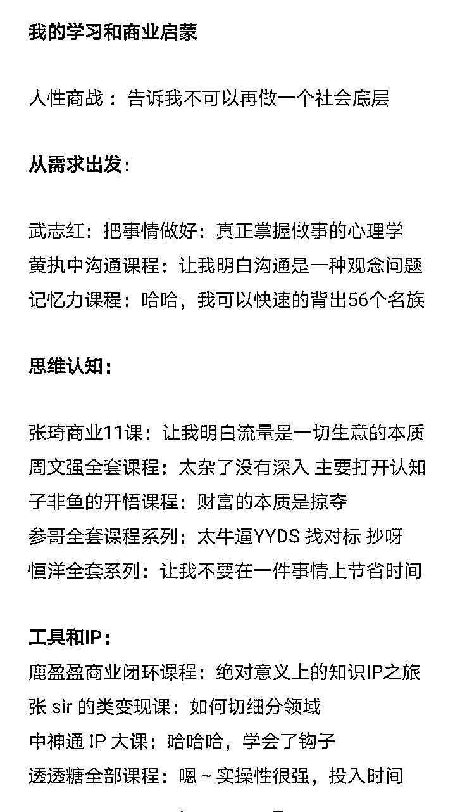
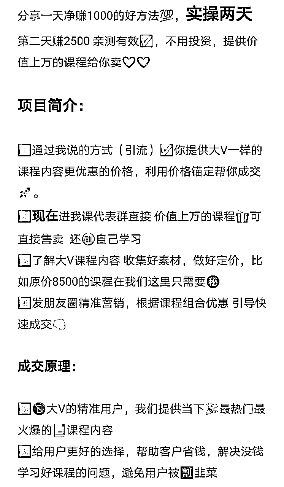
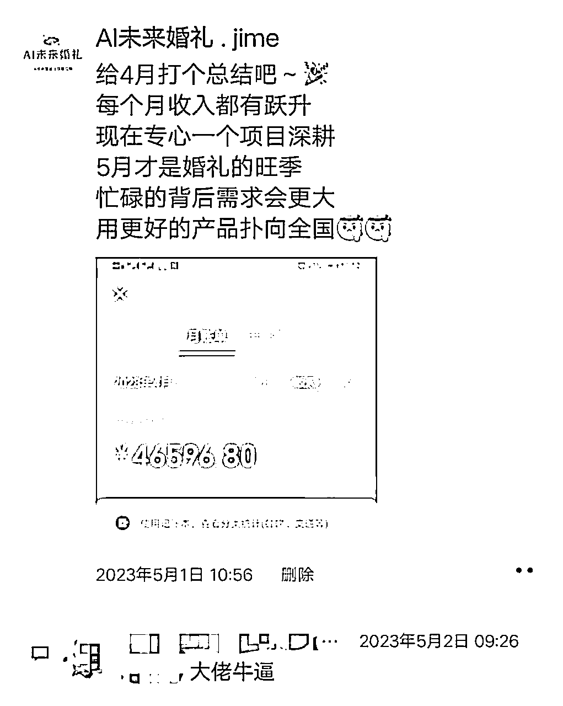
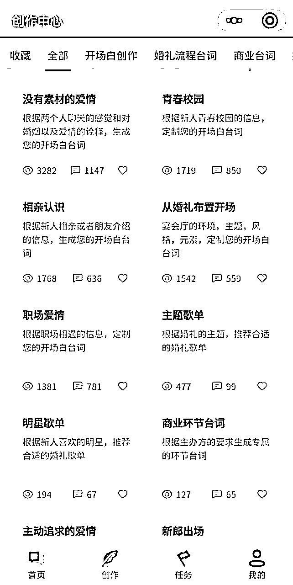
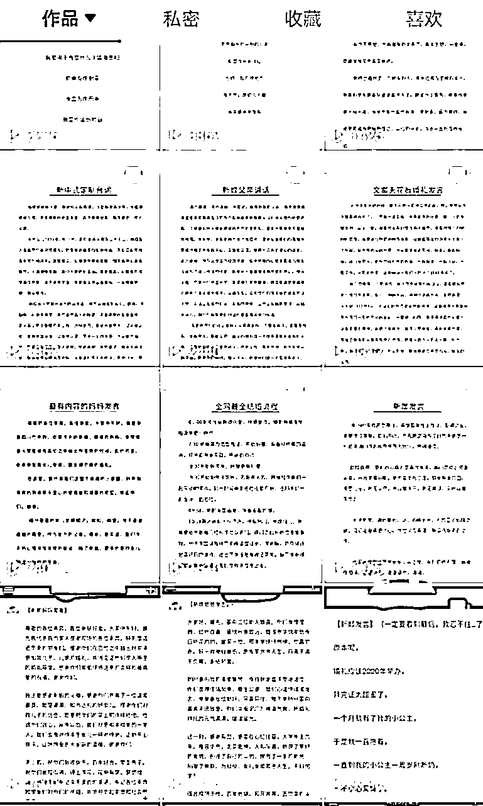
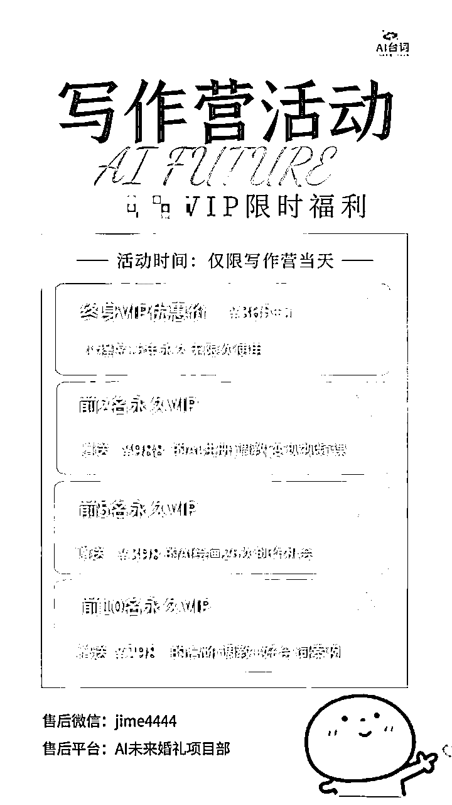
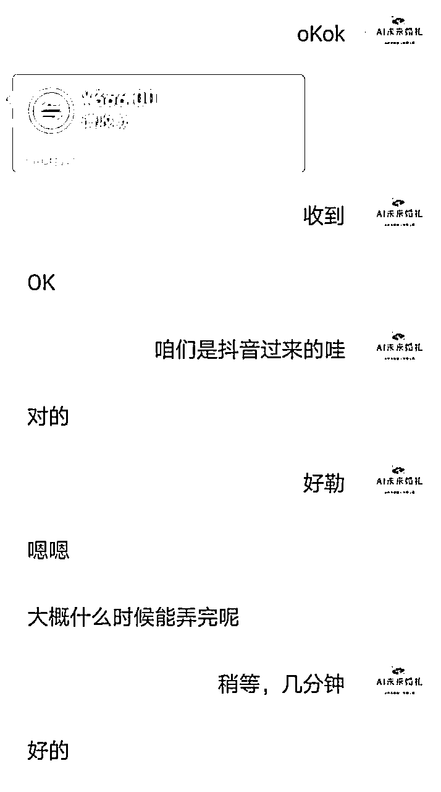
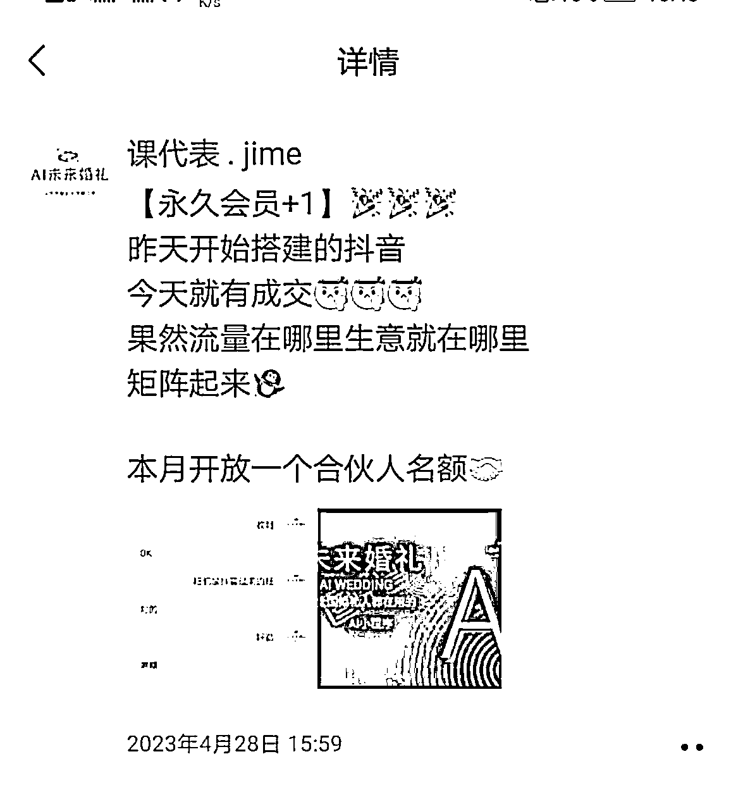

# 人人可复制的ChatGPT细分行业应用落地（月入5W+）

> 来源：[https://nvsbvagfu2y.feishu.cn/docx/DZundEBSqoCdx2xdBjNc5AA7nye](https://nvsbvagfu2y.feishu.cn/docx/DZundEBSqoCdx2xdBjNc5AA7nye)

一次机会和两个项目，让我从一个互联网小白，逆袭成为月入5W+的品牌创始人

# 三月疯长

大家好，我是jime，一个从2月份开始接触网赚项目的婚礼人，三个月时间我做了两个项目，一个是卖课，一个是ChatGPT行业应用落地，现在有自己的AI未来婚礼项目，成为了ChatGPT中文社群合伙人，有两个自己开发的AI行业小程序。实现第三个月5W+收入。

首先特别感谢生财有术，真的太强大了，我从11号加入以来，每天高能学习，推荐大家有目的性去看精华帖，比如我想做IP最近看的就是个人IP方面的，抄作业的感觉太爽。知道昨天看到龙珠贴，激发了我分享的欲望，有了下面这篇文章。比较详细耐心看完～一定可以用到你的行业。有什么不足的地方多多提点。

我会从以下6个方面让大家全面看到我的变现之旅，并让你可以复制到你的行业。

1.在变现之前我做过哪些积累

2.如何升高纬度跨越做出差异

3.如何主动发声链接资源获取信任

4.AI项目的发现与搭建

5.可复制的行业应用落地

6.可复制的终极变现之道

一·我在变现之前的积累

我其实在生活里是一个缺乏热情和创造的人，循规蹈矩是我过往20年来最好的总结，总是听话照做的好孩子，直到我看到关于人性的课程，让我恍然大悟。

总结精华：“社会有两面，第一是公平正义礼仪道德，第二是隐藏在背后的利益。”换句话说就是学会利用人性挣钱，而我之前是属于那个在规则里面做事儿，让别人挣钱的人，而学过人性之后我开悟了，也从此开启了开挂的副业人生。

1.学习之旅

能接触副业赚钱，是因为课程学习

2月份想学一门课程，在闲鱼上面找到了二手资源，这个时候属于开悟之后的恶补阶段，感觉自己啥也不是，学得很痴狂，一天可以刷一门课，基本上把大部分时间都用在了补认知上面。

给大家列举一下我半个月内学过的课程，也希望对你有用。

在这里并不是安利课程，而是真的每一个课程在不同程度上 给我带来的意义重大，影响着我副业之旅的重要决定（后面我会列举）划重点：其实培训的本质不是知识本身，而是 引起重视 ，

因为当你发现一个观点被不同的老师都讲到之后，你就能发现里面的共通性，才会坚定的相信并执行。

2.副业之旅

发现学习了很多课程之后，我要开始赚钱却无从下手

在我吸收了大量的知识之后，可以说是豪情满怀，激情满满，感觉大有可为，奈何找不到一个靠谱的项目去实操

。身边唯一能看到的就是卖我课的那个人，去找到他，并成为代理，开始卖课。交完钱我的代理跑路，总共买了两家全网课程代理。后续的所有操作都是我自己依靠学过的课程延伸出来的打法。

这里总结两点：1.圈子真的很重要 .你能做什么取决于你的朋友圈 2.我要做一定得有交付，不能成为那个跑路的人。

除了上家跑路我的卖课之旅应该算是比较顺的，第一个月收入1万三。是因为自己学习了大量的课程，对课程内容本身特别了解，并且深刻体验过自己当时想买一个课程的心理。

总结核心就是：你要先把自己销售出去，然后对自己产品足够的了解。

二.如何升高纬度跨越做出差异

一个人做事有上限，那就变成可复制的

在我卖课达到一天1000元的时候，开始在群内主动发声，分享我的卖课所得和所学。

由此带来两个受益：第一看到我学过的课程有收获，来找我买课，我的课卖得更好了。

第二是有很多朋友对卖课赚钱感兴趣，想到我最开始为什么开始卖课

我把赚钱的这套方法做成详细的步骤，卖模式给想做副业的朋友。

由此我出了我的课代群，总共49人 一人365 ，加上卖课第二个月我的变现是2万多。并且加入课代的朋友都挣到钱。有一些收益截图和卖课的实操方法我就不展示了。

为什么比很多比如入行早的人都做得好？ 这个过程中 我卖课的初心是我学习这些课程，真的受益了，并且省钱了，想着那么别人也很有需要，我的切入点是很精准的，所以成交很快。这个我会在文章最后变现之道中具体讲清楚核心是什么。

通过复制卖模式，遇到了一批副业圈的朋友，积累了很多人对我的信任，我成为了一个执行力爆棚的课代表。也因此了解了ChatGPT和生财有术，这才是我副业的开启。

总结一下：你手里有没有可以为别人创造价值的事，如果有，请你梳理一下。记得：“卖课不如卖模式”把赚钱的事情复制100遍。

三.如何主动发声链接资源获取信任

若没有主动发声，我可能还在卖课

根据我一路走来主动发声带来的收获，我会觉得这是我成长最快的路径。

第一次通过在学员群里面主动发声，我成为了课代表，我的做法是把学过内容写成总结发到群内。

第二次仅在副业群里面主动发声，养活了我的卖课模式，新增标签有130人，变现1万多，我的做法是把卖课的收获，心得，方法，毫无保留的分享到群内。

第三次是通过众筹引流软件，我主动分享，让我链接到很多有自己项目的朋友。了解到ChatGPT，进行深度学习，并且邀请我加入合伙，创办了ChatGPT中文社群，有了AI未来项目。

主动发声的核心是：输出价值，提供帮助，创造机会，展现正能量，给予正反馈

这是是主动发声给我带来的好处，主要是通过我的案例可以 引发重视 在生财里面有很多文章讲到了这一点，有兴趣的朋友可以去翻阅一下。

以上是我这两个月做副业的一些经历，简单列举，希望有所帮助，核心在于ChatGPT应用落地，没有这些积累我也不会遇到下面这个机会。

# 四.AI项目的发现与搭建

卖课不是终极，AI应用才是未来

敢抛弃已有的卖课利润，去做新的尝试，当觉得机会来临我会勇敢的抓住，在卖课的过程中遇到我的合伙人，还有一位技术大佬也是合伙人。我成立了AI未来婚礼这个品牌，实现了第三个月收入5W+

下面这个链接是我合伙人在生财有术前段时间发布的：方便了解项目全貌，看了这篇文章才看得懂怎么复制：

# 五.可复制的行业应用落地

没看上面的文章，看不懂如何复制

深度的参与一个项目的从零到一是最快的学习，掌握卧底思维：比如你想复制一家公司，不如去这家工作两年，你会了解公司的整个体系，再把学到的东西拿出去复制。

上次有个生财有术的朋友加我，他是培训老师，是关于小学生写作，问到如何把GPT用到自己行业。其实这个行业跟AI台词逻辑相同，刚好有很好的文字属性。

由此我还给他出了一篇详细的行业计划书：

所以我们打通了ChatGPT应用的从零到一，得到了市场的认可，只需要把接下来的内容和模式复制到你们所在的行业，一样可以产生相同的经济效应。

在做这件赋能行业之前还属于自己的想法，直到这个想法被业内多次证实（哇，太牛逼了），我们算是走在了行业前端。

其核心是为行业赋能，提高工作效率。切入细分领域。

## 详细拆解你也可以复制：

1⃣️使用GPT

1.先体验ChatGPT带给你的震撼，让你有动力觉得可以赋能自己行业

还没有账号的朋友这里免费更新获取https://freeopenai.xyz/ 有条件的朋友就去买个Plus，因为我用的是4.0，可能有点成本一个月150.

然后魔法，不能多讲，有兴趣的朋友自然会想方设法去搞定

2.学会深度使用ChatGPT，拼多多上面也有很多行业的Prompt 几块钱就搞定啦 这里列举一篇实用的

【从0学会prompt写法】👉

3.运用GPT的逻辑，摸索自己行业的Prompt（也就是怎么让GPT听你的话，研究个两三个小时你就可以）

2⃣️找到你的行业定位

首先讲一下我是为什么会做婚礼台词写作的小程序，第一是我被ChatGPT的文字能力震撼到了，然后自己尝试用GPT写了一篇我们婚礼主持的台词，发现比我自己写作要快要好，那我的想法是别人不知道或者不会用，我是否可以做个产品出来别人使用。OK，我就顺着我做这件事情的逻辑来梳理

1.找到用户需求

想一下你的客户群体是谁？

比如我的客户群体是婚礼主持人，他们大多是写不出来台词的主持新手

他们的需求是什么？

想要做高定婚礼的主持人，想自己写好台词让客户满意，提升自己的价格

要成交他们应该怎么满足痛点？

一分钟创作高定婚礼台词

就这一句话在我们行业杀伤力极大，因为正常写台词课程一上午，可能两小时，而你说1分钟可以写出来。

2.总结方法论，拿去抄作业

我的定位技巧就是：找到用户属性+用户痛点 ，最后给出完美状态

拿上面写作的举例子：用户属性是小学生，他们脑袋里面没货，想写出好的作文，OK你给出的完美状态就是：1.家长不用花时间改作文 2.娃娃写作满分的写作素材库

同样的方法应用到你们自己的行业是否可以呢，核心是举一反三，这个交给有行动的你们。

3⃣️写出商业计划

商业计划书大家觉得很难，可是有了GPT之后，是一件超级简单的事情，我当时做这件事情的时候是计划书先行，而且在线下跟一个大佬聊，他要给我投30万。知识因为当时太着急，还没有跑通0到1.

1.怎么写商业计划书

首先给GPT你想要的定位，利用GPT他会给你列出很多大框架：

比如：你现在是一名从业十年的商业顾问，现在利用GPT接入小程序，主要是通过小程序给到家长批改作文和给学生提供写作素材，先体验再收取会费，价格是365一年，由此也列出财务计划表。

那么就会出现上面你们看到的商业计划书，但是都是框架，你再根据你们行业内容修改就可以。

2.有了商业计划书你会有动力去做接下来的事情，因为知道这个事能赚多少钱，怎么去实施

3.在这里就要设计好你的商业架构，比如你只收小程序会员，还是有代理合伙，（因为我们代理合伙给我带来的收益占据80%。）

4⃣️找到你的合伙人+开发小程序

前面讲很多我的副业经历，就是在讲我怎么遇到我的合伙人的，刚好她带我了解学习GPT，然后开发小程序。

1.合伙人的寻找

这个可遇不可求，当时我的合伙人找到我，是下午15:47，她只说了一句，我想用GPT做点事情，得找个合伙人一起，我15:50直接拉了一个群，一拍即合。现在想想简直是执行力爆棚，然后就是接下来做的事情。

现在生财有术就是一个特别好的平台，你主动发声，去链接，去分享，前面也讲述了我怎么主动发声的。

2.小程序的开发

我们小程序的开发是借用了源码修改的，历时两天，就出了第一个原型。

那么我们在这个过程中也踩过坑，就是最开始用个人去认证的小程序，花了两次冤枉钱，个人认证300，迁移300，个体工商认证又300 ，所以大家要做，记得直接申请个体工商户去认证。

个体工商户申请：淘宝上面搜代办，找一个网络工作室类目，30块钱，一天搞定，想创业直接干就是了

小程序开发渠道：第一种方式，找我的合伙人，几百块钱，两天出我们类似的小程序，模块换成你们行业的就好。第二种，淘宝找技术，价格应该在2000，周期15天。

小程序注意事项：如果要开始做，1，个体工商户申请，2，收款商户申请 3，小程序主体认证，因为这些都有腾讯审核时间，其他的都交给技术，你我并不是全能的，他们会搞定国内服务器，国外服务器，GPT接入等等

3.小程序模块开发：

这个是基于我刚才说的定位做出来的，如果你在你们行业时间比较久，你自然知道他们需要用到什么功能，了解他们的需求，怎么满足他们的完美状态，列成他们触手可用的模块就行了

模块分类：

同等内容看类型：比如我们主持人：会用这个小程序写台词，我就把开场白划分为各种类型：异地恋，青春校园等等

同等类型分类目：在开场白写作里面有各种类型，那么除去婚礼，还有商业的，还有西式的，中式的等等

同等类目看结构：在西式婚礼里面又是有很多流程组成的，比如新郎出场，爸爸交接，新人誓言等等

结构里面有功能：比如每个流程里面除了台词还有音乐对不对，所以又有了一个模块出来

核心王道是人性：其实最终每个模块细分都是沿用了我的slgan：一分钟创作高质量台词，细分下来业内人觉得哇，专业

同样的方法，沿用到你们的行业，这里不做类举了，我相信你更加了解你的行业。

5⃣️产品的推广

上面那篇我说必看的文章讲了，我们的打法是什么，首先是基于我自身在这个行业的资源，这是一部分，后面延伸出来的是大家可以直接复制的

1.我在婚礼行业有8年的经验，也有上百个婚礼主持群，最重要的是有行业APP里面可以看到所有同行信息，最开始的打法是主动营销，比如去获取联系方式，加微信，告诉他有这样一个产品，然后群发售转化。（这里说一下，因为基于我目前人手不够，微信号加人频繁，这个方式暂时没有全面铺开，手里还有20多万的流量，所以上次合伙人文章主要的需求还是找寻志同道合的人来一起做。我们有SOP，相信看见听话照做就可以，这个是比较简单的。）

主要讲一下我现在的打法，自媒体引流，人人可复制

最开始我们用精准流量发短信，大概是500块钱1万条，最终小程序转化率跟下面免费的打法效果一样的

抖音引流：

起号的初衷：我们是为了引流和曝光的，所以什么点赞评论转发，我没有放在第一位，很简单，就是矩阵，我目前只有五个号，一天十条作品，平均一条播放一两千，我最高的也就一万播放，但是我的简介里面写得很清楚，🌍去搜：～～小程序，体验一分钟创作高质量台词。

我账号120粉丝的时候，私域引流了48个人。然后小程序一天能进80多个人。引流第一个抖音用户就成交了。

抖音起号：我只能简单说一下，因为在这方面拿到的结果并不大

想好自己的定位，是做成IP，还是为产品引流，如果单纯是为了引流，就是不断的刷作品，

1.把主页搭建好，在1万粉丝之前主页留个隐秘的联系方式

2.找同行的爆款作品，用你的小程序或者GPT洗一遍，变成用户需要的干货

3.一天发10条作品，刷存在感（我现在是做的图文，方便我批量产出）

目前这个做法，几个矩阵加起来已经超过我精准流量带来的转化了，而且是免费的，我更希望能连接引流的大佬，找做自媒体的大佬学习精进，希望我可以做得更好，引流更强。

6⃣️流量的转化

我们采用的是鹿盈盈的群发售的方式，要问我怎么做出下面这些的，就是我最前面说的前期积累，也就是学习，然后学以致用。

1.代理合伙SOP

让所有帮你做事儿的人，都有一套标准可复制的SOP，包括以下几个方面

产品熟悉：又一个你们产品的定位，功能，怎么引导客户体验，怎么充值，这些基本的介绍

加人标准化：我是让我所有的代理合伙人统一用我们的头像，品牌名+昵称，用一个破解的自动加人软件，统一的介绍，加人话术，邀请话术，体验话术，答疑话术。

朋友圈标准化：我一个号发圈，其他号用我给的软件，一键更圈，或者自动克隆。

转化标准化：根据制定的群发售SOP每个人邀请加的所有人入群，然后拉大号进来互动（有个小经验：前40个人拉群是不用别人通过的，所以我们会让加人最多的合伙人建群）

2.群发售SOP的制定

讲一下群发售我们也是踩过坑的，最开始把群二维码分享到群内，有很多人加入，但是人不精准，在里面成为了搅屎棍，反而影响成交，所以：宁缺毋滥

然后最开始两场时间太久，前面讲太多介绍和理念，基本上快拉到了两小时，最后效果也不好，大家记得控制时间，发售热场开始后 直接上干货

人员需求：场控，主持人，互动嘉宾，分享老师。这个是基本配置

现炒现卖：我们当天拉群，晚上八点直接开始，当时是假装定价199，然后告诉用户你可以免费体验，进群之后趁着热劲直接转化

群发售热场：如果有条件自己接一个ChatGPT到微信群，让群用户体验GPT，这个会特别活跃。接入方法我放这里了https://m.bilibili.com/video/BV1NR4y1v7u9?spm_id_from=333.337.search-card.all.click&vd_source=93310bee4d519f35bce25905cc4b6dab

然后正式开始的时候一定记得发红包，激活用户，金额不用太大。多发几个多发几轮（经验之谈，不然群内鸦雀无声，只剩你的互动嘉宾）

群发售流程内容：我现在没有了介绍，直接在预热的时候甩文档进去，让用户自己看关于里面和产品以及AI有多牛逼，然后我的定位是台词写作营：那么就是直接让用户发素材，然后我后台用小程序和GPT同时给他写作台词，写好马上发给客户，然后出来的结果都是特别震撼。最后体验完之后，需要一个人来逼得单，比如进入加入，可以有什么优惠～

下面是逼单神器和活动海报：

记得你的流程都必须标准到每一步，谁说什么话，怎么互动，形成SOP然后开之前，把要参与的人拉个腾讯会议，场控负责指导执行好SOP，这个是一场号的群发售核心，一场群发售下来我们收款最多的是14个，大家可以去看一下上面合伙人那篇文章，一个合伙人一天赚了1800多。

所以我们主要的成交战场就是群发售，然后平时就是用户体验次数用完了，他就找你付费，合伙人代理就加人加人引流，然后统一转化，对于成交，其实就是满足了客户的完美状态，最后文章结尾，我讲一下这个。

# 六.可复制的终极变现之道

以上是我的变现，总结给你也可用

首先理解赚钱，懂得举一反三，才是变现的底层逻辑。 2023大方向依然是互联网，自媒体，再具体就是抖音，个人IP，再融合AI能做的，这些都是我坚信并且深度参与实践的，然后去设计自己行业相关的产品。

1.「从0开始 学会任何行业的变现方核心」 优化自己

这就是我文章第一点讲到的，先破除之前的那些观念和行为。让大佬的经验来指导你的行为。还有就是生财有术的文章，有目的的去看。

2、忘记你的「固有认知」

大家想一下你身边 是真的没机会吗？不：机会到处都是，不信沉下心来，去生财有术的风向标去看看。

其实我们很多时候被固有认知束缚住了，机会哪里都在唯独不在你的固有认知里面

要看到机会 你就要先忘记你的固有认知 ，你的固有认知是什么 ？每当你看到什么机会 你的固有认知就会这么告诉你：“这都是骗人的”“这都是坑钱的”“这都是傻子才会上当的”“这不可能是真的”“要挣钱他早自己挣了”

然后和身边的人一起叹息 到处都是智商税 根本就没机会啊然后 转身就走 不再去理睬身边的机会，所以生财有术就是一个很好的改变固有认知的圈子，让你知道什么是更好的认知。

3、深刻了解“完美状态”

完美状态是一切商业行为供需关系的原点先有完美状态，再有商业需求，完美状态简单来说：就是搞明白 “对方想要的东西最好的样子是什么？”

举个例子，我为什么能够建立一个49人收费365 的课代表群，变现一万多，别人还美其名曰叫我老师，我最开始收费是99，后面收费到了365依然有人加入，为什么呢？

如果你跟我一样也有一个项目，自己做了几天不小心赚了1000块钱，你敢不敢就收别人99，收别人365，很多人都是不敢的。因为核心就是没有理解 什么是“完美状态” ，你会担心别人说你是骗子，也不明白客户为什么会为你付钱

这个时候就陷在自己的固有认知里 觉得一定先把一件事做成 一定要先有个好产品 产品质量还得算不错 你才有底气 你才能去变现！就像小时候你一定得把所有可能出现的知识点 都想明白想好了 才能举手回答老师的问题！

这就是很多人还没有变现的原因，所以我想通过我的实际案例来告诉大家，我抖音引流的第一个粉丝就成为了我的小程序会员。你也必须要这样。

所以能变到现 只是因为你理解了对方的“完美状态” 然后满足了他的“完美状态”而已

对我来说 我理解客户想要什么？他们大多数是刚入行的主持新手他们写台词的时候两个小时写不出一篇来

他们渴望更快的写出台词，他们想要快速的超越同行。然后我告诉他，我这有个AI工具，可以一分钟写出高定婚礼开场白。永久价格是698现在给你只要365+1.，我还给他超值的福利，于是他付钱了，是我骗了他吗？并不是，现在这个社会每个人都很聪明，不会被骗，是因为我满足了他的完美状态。

你可以看明白了吗？这就是 完美状态的满足 那么什么是完美状态？ 什么是商业变现的本质？ 是事无巨细的细节吗？是又大又强的成绩吗？是自证牛逼的截图吗？不，这些都不是。全都不是 而是他真的需要～

商业变现唯一的本质 就是满足客户的完美状态 不论我卖的是三个月前的课程，还是现在的AI项目，都是利用了这个

那么你从这一点出发，好好的复制，你也可以。

4、先破局，再行动

1.是你的过去障碍了自己 不是你自己没能力，而是你没学习

2.是你的固有认知限制了自己 你本该去追求有价值的东西

3.变现需要完美状态 你并不需要什么本钱，大的结果， 你也可以变到现

理解了上面这几点，我们只需要找到有结果的人和事，去研究去拆解，去复制，看见 | 相信 | 听话 | 照做

5、躬身入局，下水，把鞋弄脏

观察身边的商业机会，机会一定是多听多练多感受才把握出来的，不要加入自己主观的判断，就像一个考30分的学生去抄90分学霸的作业，要想得到90分就是不要有自己的思考，即使你对一个题的正确有把握，也不要自己判断，全部抄。

找到自己感兴趣的领域

直接在生财有术搜索你感兴趣的，或者进入任意自媒体平台 找自己行业的领域去看那些博主在怎么变现，我要通过AI实现弯道超车，或者把你现在所处的行业，深入分析一下，缺什么，能用AI赋能什么，怎么能让自己行业提高工作效率。

6、举一反三

那么我们能做什么AI项目呢？我想你什么领域都可以做，只要你感兴趣的 ，或者你足够了解的，你做起来有劲的均可

是不是一定要有技术和启动资金？当然不是 ，淘宝找一个，或者找我合伙人做一个，成本不大

是不是会觉得自己做的产品卖不出去？当然不会 你要学会好好拆一拆 ，我这个讲的满细致了，还有不懂的大家留言，我下期文章再更新。

这些对于新人来说 就已经可以开始自己行业的AI赋能变现之路了，用道德经里面的一句话鞭策一下大家可以开始行动了：上士闻道，勤而行之；中士闻道，若存若亡；下士闻道，大笑之。不笑不足以为道。通俗点就是：种一棵树最好的时间是十年前，其次是现在。

怕篇幅太长大家查阅起来会有难度，如果大家对写的AI应用到行业的内容感兴趣，后面再出相关文章，希望把我所经历的才过的坑和重点要解觉的问题分享出来，希望对大家有价值，在这里要特别感谢我的合伙人：喵爷，还有一诺，没有他们我没有机会进入到生财有术，当然最重要的是我进入生财的第一位贵人：靠谱老师，让我用实力说话，才有了这一篇分享。我会加倍努力。一定不负众望。

我是jime一个执行力超强创业者，最后我的目标是AI赋能行业，希望通过我的小小成就，让大家可以复制到你的行业，我坚定的相信，这是未来，所以我取名：AI未来项目。

一切刚刚开始未来值得期待