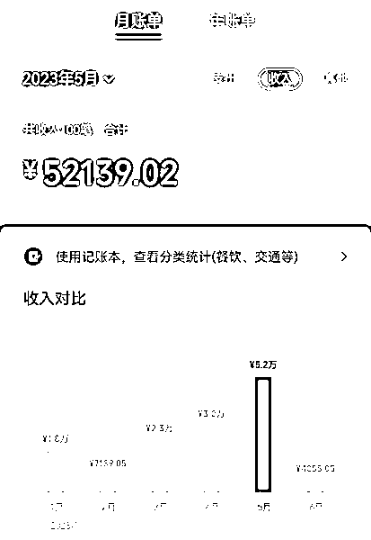
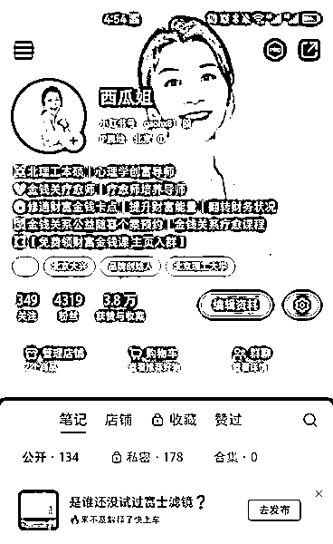

# 疗愈赛道小红书5个月变现20万超值干货分享

> 来源：[https://n28vbku1px.feishu.cn/docx/DdTfd4RpEotMHGxO49OcF6Q7n5T](https://n28vbku1px.feishu.cn/docx/DdTfd4RpEotMHGxO49OcF6Q7n5T)

大家好，我是西瓜姐（高海霞），连续创业者，树叶有光创始人，全网首创六有人生创富系统的成长导师，资深金钱关系疗愈师，疗愈师培养导师，陪跑CEO的CEO。

今天我想跟大家分享，我在小红书5个月通过图文笔记在金钱关系疗愈这个赛道，涨粉4000多，引流近1000人，变现20万+（小鹅通、微信、星球几个渠道收款，附图是我个人微信收款），原创笔记被N多账号照搬抄袭的纯干货经验。

目前我们的账号开始矩阵化复制，已经初见效果。

希望对想要探索心理疗愈这个赛道的伙伴一些启发和帮助，那我们的方法我相信对其他知识付费领域的伙伴也有所启发。

今天的分享包括：

1、我为什么会从创业商业咨询跨界转行到身心灵行业？

2、疗愈经济已来，一不小心我又踩对了风口

3、我做小红书所经历的三个阶段

4、转折点：升级运营后一个月变现3万+

5、高客单多途径丝滑变现

6、让IP自带光环

7、化成交于无形的成交心法

8、其他关键性的建议

9、在钱和术之外：守初心

我经常说一句话，生命是一场奇遇，我们的遇见是命中注定。

人生没有偶然的相遇，所有的相遇是有备而来。

这句话在未来的某一个时刻，你回想起今天我说的话，你一定会深有感触。

那你之所以来到这里和我连接和我碰撞，来看我分享，一定是冥冥之中的指引。

以下，enjoy!

# 一、我为什么会从创业商业咨询跨界转行到身心灵行业？

真的是有好多人好奇我在商业领域做的好好的，为什么就成为了一个身心灵导师了呢？为什么B端业务做的好好的，说放弃就放弃了呢？

你是不是也会好奇？我曾经在创业圈里摸爬滚打出一片天地，专业服务做到被政府孵化器甚至同行都要竖大拇指的程度，甚至有的客户以与我们合作为荣。我的公司是全国最大的语言大数据服务商的供应商，做了七八年牛哄哄的大乙方，如果我深耕下去，我在商业领域依然会熠熠生辉牛逼PLUS，为什么要跨界在从零开始付出巨大心力来设计新系统新模式？

那邀请你现在开始了解我的故事！

我是从少年时期就开始出名，一路走来是一个资深的学霸。资深学霸并不是因为我有多努力。中考时只想上个中专，结果呢突然想上大学，疯玩到高考最终上了九八五，还进过校志，拿着全校最高的奖学金，去人民大会堂领杰出大学生的奖。

我的职业背景也十分跨越，可以用一句话概括，开过淘宝、做过地推、编过纲要、当过编辑、做过管理，上过天入过地，继而走上创业这条不归路，再也没回头，现在我成了成长陪跑导师，主要做一件跟生命质量有关的事业。

以下是我的介绍。

在过去七八年的创业当中，我主要帮企业搞钱，辅导CEO陪跑创业，可以说我就是那个大佬或者潜在大佬身后的女人，一个精准犀利的商业创业顾问。

这七年当中我们几乎接触所有创业领域的项目，见证了各个风口浪尖、投资热点，各种互联网+，各种大数据，各种人工智能，各种VR/AR,各种机器人，临近空间飞艇，操作系统......

见识各种黑科技，hadoop、知识图谱、影像识别、脑机接口.......

我们陪跑的主要是一些海归、千人计划、海聚专家、行业精英、名校背景、大厂出身、科学家、U30的各类创业CEO，其中不乏在短短一两年时间就跑出来的独角兽企业。

也经由这段创业，我结识了我的创业好友，知果果集团创始人刘思思。

我是创业生死沉浮浪潮的参与者也是见证者，是观察者也是亲历者，我们服务的那些项目，大部分项目在创业的浪潮中失败了，部分项目在政策变化中被收购了，有的还在艰难坚持。创业维艰，他们当中仍然跑出了行业领头羊、技术先行者、独角兽、国家万人计划、海聚人才、中关村优秀创投案例等。

一转身，我依然在做一件与科技高度相关的事情，只不过我们现在聚焦的神经科学、心理学以及量子物理。从陪跑创业做商业咨询到切入到身心灵领域陪跑生命成长营，那也不是偶然。

因为我的人生在学业事业上好多方面非常非常顺，可以说要什么有什么，一切都来得太过于轻松和超预期。

但在我的生命里面还是遇到很大的挑战，我有过一段有硬伤的婚姻关系。婚姻上出现的挑战差点把我打崩，抑郁到想自杀撑不下去的那种状态。因为这样的缘由我走上了学习心理学的自我成长这条路，开始走进身心灵这个领域，一发不可收拾。

那在这个过程当中，我探索到自己的天命，就是帮助他人跳出痛苦和挣扎，活出自由丰盛和喜悦。如果说过去那段事业我们的使命是照亮商业梦想。那么在心理学这个领域我看到的是自己的天命，是在很我很小的时候就出现一个信号，哪里有苦难我要出现在哪里，我内心的渴望，是做一个帮助他人解除痛苦的人。

所以我开始系统深入的跟随国内外大咖大师们扔了小一百万进去学习这个领域顶级理论方法和技术。

在这个过程当中，我看到人类真的有太多各种各样的痛苦和挣扎。

我们大部分人类活得并不那么幸福快乐。

事实上真正活出轻而易举的富足的人是少一部分人。

活出有爱有光有意义，有钱有闲有自由，活出轻而易举的富足，是需要学习和刻意修炼的。

这促使我义无反顾选择从商业咨询领域踏入到身心灵领域，花五年时间完成从商业领域到身心灵领域的过渡。

40岁再次完全从零开始树叶有光的创办之旅，从零开始打磨树叶有光的助人系统。

在过去的一年多时间里，我们在产品层面做了很多探索和尝试，自我成长，亲子教育等等。

在摸索的路上，也是冥冥之中指引，让我进一步走上了一条帮助更多人解决财富金钱关系课题的路，并通过金钱关系课题这个切入点，引领更多人走上探索自我、疗愈自我的蜕变之旅。

1、金钱关系课题上突然的顿悟。

一年多前，我有一天突然意识到金钱关系非常重要，如果金钱关系不好，那总归意味着我们的人生在某个方面有卡点，不完整，也无法活出真正意义上的完整富足。然而实际上是我们跟金钱的关系却被我们大部分人忽视了，包括我自己。

过去我的好多同修，他们专注于探索内在，孜孜以求去实现精神成长，然而走着走着会发现，依然哪里不对？然后转过头去修金钱关系这个课题。

2、我发现95%以上的人有金钱卡点或困扰。

过去我们的学员普遍有金钱上的困扰。甚至当我提出一个年增收10万的计划时，有的人甚至说想都不敢想，像天方夜谭。

我就在想，为什么，在我身边，赚钱对于有的人就很轻而易举，对于我也是非常轻松的事情，而对于另外一些人，感觉就像难于上青天的事情呢？背后到底有什么秘密或者规律是大部分人不知道的呢？

于是我开始接触更多财富有关的课程和书籍，开始系统学习探索财富金钱背后的秘密是什么，到底有什么方法可以助力一个人活出轻而易举的富足呢？到底什么会卡住一个人的财运？

3、我很早留意到金钱在我身边流动好像有一些隐秘的规律。

我发现只要我想让钱流动，钱就能流动，想让钱回流，钱就会回流。这些规律，在我系统学习了更加系统的财富知识和课程之后，才知道，原来是这么回事。吸金体是底层逻辑和方法论的。我无形当中作对了一些事情，顺应了一些无形的规律。

4、我过去十多年做着离钱最近的职业。

过去十多年，我的工作主要是帮助企业开源节流，直接间接撬动的资金流动数亿元。过去我的客户常说我是他们的福星，因我们能给他们带来实实在在的利益。过去七年，我几乎没有请过一个创始人CEO吃过饭，大部分情形都是他们请我吃饭，他们邀请我作为嘉宾参加他们的发布会、年会；他们拿到好的结果，一激动就会给我发个大红包。他们很多人跟我说，你就像我们团队的一分子。为B端服务时，我能做到48小时内完成交付帮助客户拿到100万这个结果。很早以前我就能做到群里讲解一小时左右就能搞定十几万的签单，那时候不懂什么群发售，总之实际上实现了群发售的结果。

5、那我发现我赚钱是蛮容易的。

和我抱持的两个信念有很大关系：

第一个信念是在二十多岁的时候，我跟我闺蜜探讨钱的话题。那个时候我们自己还在靠助学贷款上学。我们抱持的观点是什么？就是会花钱的人才能赚钱。对，钱不是攒出来的，是赚出来的，这是第一个。

第二个是，当我妈妈抱怨说我找一个结婚对象，要啥没啥。我就跟他讲，我说你要相信我这辈子不会缺钱花的。五年的时间我什么都会有。然后五年我就真的实现了我的预言。

轻松能拿到一些结果一定是有原因的。那我说我翻手就可吸金是真的！

而且过去，我各方面都很自由，我的工作模式和生活状态跟打工族以及那些倡导996的苦逼创业者完全不同，我在创业过程中也是，一年最多工作10个月，最少只有3个月不到，想躺平就躺平，想出去拍照就出去拍照，旅行经常说走就走。

这些线索对我来说意味着什么？我是不是在金钱课题上，也载着某种使命？

这个答案是我在2021年就提出来的，要引领更多人，活出：

有爱有光有意义，有钱有闲有自由的人生，简称六有人生。

2022年10月经过长时间的探索我终于找准了一条，帮助大家活出六有的清晰路径：

以金钱关系课题切入助力学员活出六有人生。

目前已经形成了产品自动化成交体系：

1、财富体验课&公益金钱关系疗愈个案

2、六有人生初阶课：金钱关系疗愈师师资课

3、六有人生合伙人创富系统

自动化成交路径已经被验证跑通。

# 二、一不小心，我又踩对了风口

2014年我步入创业圈，那年被称为创业元年。而今年，我们有幸又迎来了疗愈元年。

我明显感觉到，在这个经济低谷期我们在顺应经济的周期，在迎来起飞的阶段。

### 1、不断增长的需求和趋势发展

未来二十年既是知识付费的时代，也是疗愈的时代。

人们将更加重视精神需求和生命质量。

70-90后这几代人，大部分都有原生家庭的问题和深层卡点需要疗愈。

00后的新生代，更是生活在一个青少年患心理疾病高达25%的大环境里。

YI情三年，又额外制造了很多心理疾病患者以及庞大的负债人群。

焦虑，抑郁，迷茫，挣扎，崩溃的边缘，是很多人来找到我时的状态。

他们好多人跟我说，老师，我觉得自己快撑不下去了。

是的，整个社会情绪内耗、挣扎拧巴成为常态，无论是关系带来的挑战，还是经济上的困境，又或者是健康的问题，事业上的瓶颈，心理上的疗愈需求与日俱增。

那这方面的数据其实非常多，随便一搜都是。

这里就不再赘述，其实你只要单纯从你身边去观察，你就会发现，太多人需要心理支持了！！

### 2、潜力赛道，供不应求

本身疗愈这个赛道现在就是供不应求的，而金钱关系疗愈这个赛道更是在早期。通过金钱关系一个很小的点切入疗愈是非常容易的。我们设计的金钱关系疗愈程序难度低，新手很容易上手，早就是机遇，就是优势。大部分人其实都在为钱而忙，钱很重要，搞钱很重要，但人们并没有意识到金钱关系很重要。

当然你也可以以情绪疗愈切入，这部分需求也相当大！

### 3、科学理论加持

神经科学、量子研究的进展为疗愈师提供了很好的科学理论基础，特别是量子纠缠说改变一切的基础，只要改变一个人内在作方式就可以了。这让我们帮助别人解决问题变得简单易落地，且很容易拿到反馈。

# 三、我做小红书所经历的三个阶段

### 1.0阶段：把小红书当朋友圈发

无知瞎发，把小红书当朋友圈发，结果呢，就是既不涨粉，也没有互动。发了好多毫无起色，所以说做这个，跟能力背景没啥关系，懂不懂小红书运营的底层逻辑才是关键。

### 2.0阶段：知道要学习，老老实实学习

去年上半年跟了一期小红书行动营，调整了定位。

终于，实现从了0-1的突破，有了赞藏过百和涨粉到100多的结果。

这个比起很多学员来说，不算啥好结果，但是对于我而言，至少说明学习跟不学习，差距就出来了，不学习呢，就原地踏步，做些无用功，学习了以后呢，就是一个质的飞越。

那现在我再回看当时的笔记：

1、选题开始有感觉了，终于解锁了小红书的调性；

2、封面不行，现在看简直太丑了，图文美观度不好，所以导致数据没上去；

3、自己所用的时间和精力不过，没有去更多对标一些爆款。

后来因为我没时间弄，所以就搁置了好久好久。

中间跟过一期生财航海，因为旅游出行，没有好好跟。

但生财的资料库对我们很有帮助，后来有时间复习了一些视频课，操作指南这些，帮助特别大！

这为向第三阶段冲击奠定了一个很好的基础！

### 3.0阶段：优化升级跑通小闭环

我原本想着，不如我花钱请人来做吧，倒是也找了。

但是，我有那么股不服的劲儿，就想着，别人能做起来，那我也能啊，那如果我跑通了，我就可以带我的合伙人去跑了。

所以我也跟合伙人依辰沟通了我的一个想法，她也是同感。

就是那股，老娘还不信了，别人能做出成果，我为什么不行呢?!!!

我是个想到就立刻马上做的人。

对，从想到到做，再到做到，再到结果，出其神速是我一向的风格！

果然，我把小红书打造影响力，引流变现这个闭环，跑通了！！！！

事实证明，这个决定是明智的，创始人IP前期要自己亲自做。

# 四、转折点：升级运营一个月就变现了3万+

到第三个阶段，我准备发起冲击，2022年12月12日开始，我做了几件事：

1、优化了我的小红书首页设置，包括我的简介重新修改，明确了精准的定位（离钱近、主业、擅长），带给用户的价值是什么，头像和背景都放我新拍摄的形象照，大幅提升真实的人设感。我的简介真的改过好几轮，这一版，是我最满意的一版。

2、借鉴梨云的小红是笔记优化了我的笔记文稿范式，增加人设的元素。

3、优化了我的笔记封面，正文图片格式，使用借鉴的梨云绿模板。大幅提升视觉体验。

4、设计了新的引流钩子，财富课程体验礼包，截图方式放在笔记图片里，笔记直观。

5、设计了笔记尾图的个人简介和引流图片。

6、持续对标找爆款笔记，优化内容的封面标题。

7、把之前发布的所有笔记内容，全部用上述几个动作优化了一遍。全部用的旧内容。

8、遇到问题就在小红书航海群求助，去看生财有术的课程和操作指南。

9、不断去琢磨，优化流程，让前端和后端形成丝滑的对接。

以上，在人设部分，我从很多的环节去植入，首页、笔记封面、尾图、文字稿、全方位强化西瓜姐的IP。这个点是非常成功的，因为有很多人就是被我吸引，在笔记里就对我产生了很强的信任，就会有后面的转化升级。

有很多粉丝反馈，我的笔记能量很高！

花了不到两天的时间，做了大约一个月的内容素材，使用定时发布的方式，一次性发好至少一周的素材。

那优化后的第一篇笔记，就比之前有大的突破，赞藏直接提升了10倍以上。其他笔记也有不错的表现。

这个时候呢，我就留意到，那小红书的规则就是你关注什么她就把资源推送到你面前。

于是我就眼前出现了好多关于选题的各种形式啊内容啊，别人的笔记给我很多灵感，对标做了一些新的内容，也带来不错的表现。比如，对标同行，直接发引流笔记，效果很显著。一篇笔记直接引流了200多人。

逐渐找到感觉了之后，就开始用用过的内容，针对我们的用户痛点去创新一些标题，反复发，去测试！有些笔记也拿到好的结果。直接产生变现了！

留言的宝子，有的已经是我们的学员，拿到好结果啦！

在这个阶段，就是优化，重复，实现1-N，继而开始探索矩阵模式。

除了前面提到的动作，还有几个重要的点分享给大家：

1、每天保持至少更新一篇笔记，时间分布在21点-23点之间，也有假日白天发的笔记效果不错的，关于发布时间，真的也是要自己去测试感知。整体而言，我觉得21:00之后的时间不错，小红书夜猫子极多。

2、粉丝到500，就可以做内容加热推广了，那我的建议是，用笔记数据好的拿去加热，雪球肯定是滚大的才滚的多。但有时候效果也不是很理想。关于加热这个事儿，我是这么想的，我就想每天预算75-150这样子，就相当于我请个兼职运营了，毕竟变现一个学员，就可以覆盖成本了，多出来就都是赚的。

3、还是要持续去对标新的选题，发新内容，投喂平台。旧内容发几次可能就不灵了，那至少要做一些修改再发。

到目前为止，我们的小红书原创原题笔记，已经成为众多账号抄袭的内容，原封不动，甚至连“树叶有光”四个字都能抄去，有的笔记还搬起了案例截图。

# 五、高客单多途径丝滑变现

做小红书，其实目的性就挺强的，就是：卖。

卖自己还是卖产品，你都要想好了，要卖啥。

那么先说卖产品：你要卖的产品是什么？

我们的产品：

1.  公益财富体验课；

1.  公益金钱关系疗愈个案；

1.  三位数幸福力轻量课、儿童正念抗挫力专注力训练课以及盖洛普优势初阶课（目前都有转化）；

1.  四位数金钱关系疗愈师师资课；

1.  五位数六有人生创富终身合伙人。

同时，我们：

1) 请设计师优化了我们的海报。

2) 完善了课程介绍PPT和课程答疑。

3) 上线了课程介绍讲解视频。

4) 丰富了我们的案例库。

5) 社群分享的文字稿沉淀出了新内容。

我本人从B端转C端,变现本身不难，但是我发现我不太适合做低客单，目标还是要奔着10万甚至几十万客单去的，那么高客单核心转化路径，甚至自动化成交要如何设计？

财富体验课——》四位数金钱关系课—》五位数六有人生创富合伙人+其他轻量产品

1、引流物料：我们用的引流物料体验课程，这个体验课可以让用户和我有更多的链接。效果是直接的，最快一个粉丝从加我到下单四位数课程，用了个5个小时，就是听了一节体验课。已经可以实现自动化成交，经由体验课直接来报金钱关系课程，再通过金钱关系课程升级合伙人，这个自动化路径已经实现闭环。

2、流程优化：前后端引流的话术，流程要完善。从小红书如何引流到微信，再到微信如何和用户互动，我做了好多次的优化。

3、社群转化：流量多的时候，一对一就不好做了，那就做社群。在社群集中分享，内容就是围绕课程的发售分享。基本我在群里分享一次，都有一个人私信来找我下单。通过这个过程，我们把课程的答疑文件做出来了，公益社群日常运营的SOP做出来了。引流过来的学员就秒变运营助理，负责打理这个社群。简直不要太丝滑！

4、公益随喜个案：最初小红书笔记征集公益个案，引流了一些人，最终收了4份问卷，做了一个个案，成交！这位学员从负债200万1个月已经快速开始翻转人生，给我们做出一个非常成成功的典型案例。后来我在群里，推出公益随喜疗愈个案活动，由我和我的学员合伙人一起落地。再后来我们做成常态化公益活动，引流来的粉丝，可以参与公益个案活动，通过公益随喜个案，建立深度链接和信任，个人IP的效应立竿见影，能量状态高的情况下基本上可以做到90%以上的课程转化，即便对方负债也可以在案后立刻下单，甚至在半月内升级合伙人。4月份我大概是11个个案实现单月转化7万左右。公益个案本身有随喜下线金额设置，不是免费模式，有保底收入。

公益疗愈个案这个方式：

第一，可以让用户更加直接体验专业服务的价值。

第二，给我们学员提供一个接单的渠道。

第三，个案转化成交可以很直接，因为个案的确不能解决所有问题，人们真正需要的是陪跑，解决从知道到做到再到拿结果的这部分。干货和知识都是易得的，而陪跑拿结果的价值，才是知识付费的核心。

第四，释放观摩机会，给到一些用户去感知的体会，那这样也能促成转化。

那公益随喜个案这样的设计，也给我们带来了显而易见的结果。

在心理疗愈这个领域，个案是一个非常好的与用户建立连接和信任的过程，弊端就是重时间投入（特别是我们的个案长达90分钟），当然如果做高客单转化，这个投入是非常值得的！

那我来说，我在这个阶段，重投入一部分时间精力，找到真正有潜力的学员和合伙人，对于树叶有光的发展节奏是非常有必要的！

我坚信一点，想要得到先付出。种下足够多的种子，回馈就越多。

那目前，我们转化的学员，已经为树叶有光带来新的学员，或者成为运营助理当中的一员，现在运营工作都是大家抢着排队做！

5、其他产品方面的转化：

流量来了，除了在核心业务上转化，还可以转化其他产品，比如推玩赚会员或者介绍生财有术给对方，又或者是我们的其他轻量课，做一些轻量的陪伴营，在朋友圈发一发也能转化，那主线我们还是以高客单产品为主。这些方面捎带手也能转化一些。

# 六、让IP自带光环

做心理成长疗愈赛道，人设尤其重要。当我问到来找我做个案的伙伴，信任度可以打几分的时候，大部分可以打8分以上，剩下通常是因为不熟悉的缘故。

那做IP，其实先要“卖”自己，对吧。那如何“卖”自己？

### 1、笔记里的人设打造

在我在小红书做的IP号，虽然主体还是以引流为目的。我的账号坚持自己运营，

我的笔记99%是原创内容，大部分内容，都是实践出来的体悟经验和结论。

加上IP的元素从头像，到背景图，再到自我介绍等在各个地方分布，那么一个shining高能西瓜姐，在很多细节里，比如我的卡通形象就很有特点。我有一个学员，说刷到我的笔记时，就认定，我是他要找的老师。我们一个合伙人，在小红书笔记那里，会犹豫要不要给我发消息，最终成了我的合伙人。

我觉得我们每时每刻，都在通过很多细节，向别人传递作为一个IP的能量、认知、品质、价值等等。那目前经过我们的矩阵测试，我们的兼职运营说“西瓜姐”三个字本身就自带能量。

### 2、立体化的IP运营

我秉持一个观点，无论有没有个人IP崛起的时代，一个人一生都在靠IP变现，我们从一出生起，就是一个行走的IP。我们能多大程度上得到家人、老师、同学、同事、朋友的支持，拿到什么样的资源和结果，结交什么样的贵人，靠的都是自己的品牌。我从20多岁起，就有意识的把自己的名字当品牌来经营的，那个时候，我就告诉自己，凡我出手的成果，必然有我的调性，我的品质。所以我在很多领域都是别人的天花板，原因就是这个。

我的盖洛普才干分布主题，是大战略+大影响力+大执行力，关系板块最弱。

天生配置自带光环效应，但是在公域引流，又如何继续打造出IP的光环效应呢？

我先来给大家看一些反馈，看看没有成交的成交是怎么样的：

打造IP是一生都要持续的事儿。影响一个人也是一个持续的事儿！

要有耐心做好长时间去影响一个人的准备。

首先，我朋友圈一直在做，我的朋友圈经常被朋友们反馈，是能量的补给站，有什么烦心事，看看我的朋友圈能量就回来了。我的朋友圈一直以来发的比较随性，但是发和不发，差别是巨大的，发的效果可能是当下有人就咨询问题，或者过了很久有人来问，甚至是几年之后，都是可能的，这是一块是与时间做朋友，经营IP的主战场。

第二，公众号，我有一篇“西瓜姐其人也”的爽文介绍。我还有很多原创文章，比如我的前半生系列以及其他各个主题的文章，经常在朋友圈里转发一下，在社群里分享一下。每个动作都可以泛起涟漪。我的公众号被学员有时候会翻个底朝天，一旦一个人开始对你有兴趣，这些内如都是必要的！

第三，视频号，我有一篇宣发视频，讲我做树叶有光的初心，有很多视频让大家可以全方面认识我这个大活人。那现在看起来，之前录制的视频，不管数据如何，至少对新来的粉丝和学员，是一个可复用的资源，时不时在朋友圈里转发一下。

我们有一个学员，她见我第一面，打分是9.5分，我问为什么，她说，看到我的头像，就感觉非常亲切。

IP，在每一个细节里，都可以渗透人心，你不知道你的哪句话，哪个分享就触动了别人。

当然，你要有心理准备， IP经营得再好，也注定会有人不喜欢，没关系，擦肩而过就是了，大千世界，人来人往，做IP靠的是吸引。

IP的光环效应是累计的结果，也是刻意经营的结果。

到一定程度的时候，就是被钱追着的感觉。

我无论在B端还是C端，成交从来都是不费劲的，十分简单粗暴。

经常冷不丁收到这样的消息，西瓜姐，我想报你的课，我说好呀，欢迎你！

# 七、化成交于无形的成交心法

无论在B端还是C端，我做成交，还是很厉害的，甚至是很简单的。

虽然很早以前我认为我并不适合做销售，当我变身成创始人时，我是直接启用了顶级销售的姿态来面对客户的。

我觉得想要成为一个销售高手，必须想清楚三个核心问题。

第一问题是，我们为什么要联系客户或者和客户发生联系？

抛开各种销售技巧、套路、话术，我们必须想明白，我们为什么要联系客户？这是一个深刻的问题。

联系客户，不是因为我有娃要养，不是因为我公司运营需要钱，不是因为我想年入百万或者别的。而是因为我清楚，我与他们建立连接，一定会在某一个点或者某一个时间我能帮到他。

利他之心是根本的出发点。

如果眼里盯着业绩、盯着拿到手的钱，注定成不了高手。

真正的高手，遵循的只有大道，胜在发心，胜在知行合一。

第二个重要问题是，我们要给客户传递什么样的状态？

保持高度开放性至关重要。我从一开始就以一个高度开放的心态与潜在的客户建立连接，我希望与原本陌生的、不熟悉的人，能建立起的，首先是一种开放的、可能持久信任的朋友关系。而不是建立单纯交易利益导向的一种关系。

哪怕他跟我聊了半天，最终没跟我成交也没关系。我相信我已经在洽谈阶段帮到了他们。成为朋友的可能性，除了在价值观等方面的共鸣，更重要的是，存在互惠互利。所以尽量让每一次沟通本身成为价值交换的过程。

不急于在短期内见效，有耐心去做时间的朋友，是高手销售的必修课。

我相信，我负责做好一个坦诚靠谱专业资深人士，和我沟通过的人总有一天会有别的事儿想到我。实际上，这样的状态，确实会给很多人留下了深刻的印象。

真诚谦卑就是最好的技巧。在和客户洽谈合作的时候，我一般主要从专业的角度和对方的角度，给出实在、有利于对方的建议，我会很真诚地告诉他们，我们的优势是什么，如果跟我们合作我们能给到的价值是什么，对他们意味着什么，那我们不能做到的又是什么？

自信笃定就是高手的能量场。真正的自信来自于清晰和确定，就是确定的知道自己能提供给别人什么，价值提供到什么程度。自己足够确定，才能传递给别人确定感，而确定感是普适需求。我经常爱跟别人讲一句话，请你相信我。但这句“请你相信我”的确定感，从哪里来呢？是我们需要足够了解自己，但还不足够，还要知彼。

最后一个问题，我们到底能给到客户什么？客户真正需要我们的地方是什么呢？

所有以货币衡量的商业本质，都是用价值交换博取利润的过程。

所以，我们到底能给到客户什么，是我们必须想清楚且能清晰传达给客户的。

如果你都不知道客户需要什么，不能捕捉到客户需求信号，不能站在客户的角度去想他需要和想要的，他找你做什么呢？？？

所以，当我必须成为一个销售和服务者时，我常常思考的一个问题是，客户需要我的是什么？这个客户需要什么，那个客户需要的又是什么呢？

当我们解决了销售的核心之“道”，剩下的那些话术啊、技巧啊、策略啊、职场礼仪啊，便可锦上添花，我们总可以找到适合自己的“术”。

那我现在的成交转化好，是因为大家觉得，我的能量场太强了！

实际上每个人一生都是一个行走的销售员。在人生的每个阶段，都扮演着这样一个角色，比如我们在婴儿期的时候，我们通过浑然天成的天真无邪吸引父母、亲人愿意付出足够多的爱和关注给我们；长大一点，走入社交场合，我们需要交到好朋友，就需要成功吸引别人愿意给你交朋友；逐渐长大直到开始找工作，你需要打动面试官给到你一个匹配的机会；等你想要创业，你需要开拓市场、找合伙人、组建团队甚至还要融资。

# 八、其他关键性的建议

### 1.定位定天下

找准定位，精准发力；赛道和初心，都是定位。树叶有光的整体定位是非常清晰的，但是在公域引流，特别是小红书，以非常垂直细分的方式去切入，我还是探索了好几个方向，最开始，发爱自己系列，又发女性成长相关的话题，都没啥好的结果，当然也是没有认真经营。那最后我们锁定，财富金钱关系这个离钱近的垂直赛代，就特别细分，专门针对财富卡点出笔记，那就非常符合小红书的调性，也很容易带来结果。

于我们而言，解决任何困境的底层逻辑是一样的，一个人因为关系困扰还是因为钱困扰，我们提供的解决方案也是一样的。

方向不对，努力白费！

但这个前端的定位，一定是与后端产品配套的，这样前后端才能丝滑闭环。

### 2.心态和能量很重要

耐心经营：数据不好就优化，继续发

量大出奇迹：发多了会螺旋上升，因为发的笔记够多，那最坏的，一篇笔记带给你3个粉丝，10篇，每天也能带来30个了

持续行动：不要三天打鱼两天晒网

情绪稳定：放弃玻璃心和内耗模式，我们的能量决定了我们能不能把事情做出结果。

做疗愈师这个赛道，能量非常关键。

同样的内容，我的有些合伙人做的结果并不好，原因是她们自己也有卡点，能量不稳，注意力在小红书用的不够。

那当我自己能量不高的时候，比如生理期的时候，我选择躺平修复能量。躺平了就会躺收学员。

当流量掉下去，我有一丢丢焦虑的时候，我会提醒自己，松弛下来，去干点别的，这个时候反倒会有很多咨询来。

对于从事身心灵，心理疗愈这个赛道的伙伴来说，自身的能量管理，是稳定变现的根基。

### 3.在哪里耕耘在哪里收获

想要做成一件事，就需要投注足够的精力、心力，去研究，去感知，去优化，去精进。

我开始做小红书刚两三天，就yang了。

在大家都生病的那段时间，我居然拿到了结果。

因为那段时间，反正也干不了别的，就天天盯着小红书。

但凡任何一件事，心想事成也好，做出成果也好，还是你打造吸金体也好，你说有捷径么，有呢，掌握方法论和底层逻辑。

那你说，没捷径呢，也说得过去，为啥，都得坚持去做，去行动。

在行动中感知思考。无论你想在哪里摘果子，你都得行动。

在对的方向上持续行动，细水长流的行动，会心想事成。

这样做的结果，也许不会突然爆了，但会形成长尾效应。

即便我是一个从量子物理角度讲内修能量的导师，我也明明白白的告诉大家，

靠每天坐家里做财富冥通过搞吸引力法则就可以拿到结果，那是异想天开。

我给大家中肯的建议，就是高维能量要修炼，三维操练要踏实落地。

高维能量是巨大杠杆，也得在现实世界使用才行。

在过去，我是个活出心想事成的典范。

在小红书运营上，又一次给大家一个范例，任何事情只要我上心，没有做不成。

心想事成既有心法，也有干法。

既要修心，也要修动。

能量加持，行动所及，无往不利！

# 九、在钱和术之外：守初心

那这个过程给我最大的回馈是什么？

一些从小红书来的学员，人生已经开始快速翻转。

一个宝子负债200万，抑郁到想要死，遇见我的时候，感觉自己已经撑不住了。

学习两个月时整个人发生了很大变化，五家银行的负债已经顺利结清2家，工作变顺，和家人关系变好。精神状态不再是魂不守舍，而是变得更加平静淡定专注和有创造力。目前已经实现升职加薪，人生在开挂的路上，越来越好！

从赚钱和商业的角度，尽可能要赚富人的零花钱，不要赚穷人的救命钱。

但是树叶有光恰恰是服务普通人的，做的是一件，需要救人于水火的事业。

这份事业，当然会让好的人好上加好。更多时候，大家找到我们是因为痛苦和挣扎，是因为自己感觉自己撑不下去了。他们需要有人伸出一双手，给他们铺上一张毯子，用专业和爱接住他们往下掉的人生，然后再用专业和爱陪他们触底反弹。

我做小红书初心，我希望能够借用小红书，碰撞出生命更多的奇遇，让更多人经由我，经由树叶有光，跳出困境，活出有爱有光有意义，有钱有闲有自由。

树叶有光存在就是为更多人带去光。

无论我以怎样的方式，帮到了他们，都是我的荣耀。

她们说，在我身上看到了光。

她们说，我就像他们的手电筒。

她们说，西瓜姐很温暖，能量很强。

对41岁的我来说，做由心而发的事，说由心而发的话，过有松弛感的生活，在热爱和擅长里，活成光，就很好。前半生创业，还要拼一些什么东西，后半生搞事业，只想玩儿做让自己滋养的事业。变现和变大我觉得都会是自然结果。

疗愈师是一个温暖人心抚慰人心的职业，是一个可以给人带来希望和光的职业，金钱关系疗愈师，又是一个可以帮助一个人快速修通深层金钱卡点、启动财富顺流的职业。

做这个职业，初心很重要，无我利他之心很重要，初心不正会反噬自己。

我时时提醒自己正心正念，慢一点没关系，每一步都扎实地走。

作为一枚资深生命成长导师和金钱关系疗愈师，我简直爱死我的职业了！

我们的学员和合伙人说做疗愈个案感觉棒极了！因为：

1、我融合部分心理学，自我关怀，身体疗法，设计了一套90分钟的疗愈程序，于疗愈师而言通过专业方法做90分钟个案不仅不累，事后还非常轻松更有能量，因为个案无需用脑只需用心，用方法实现生命影响生命，生命疗愈生命，用高能量去疗愈案主，彼此赋能。因为有方法可以护体，我们的疗愈程序不像其他疗愈方式，可能会被来访的能量反噬。

2、来访收获巨大，内在得到疗愈清理，拿回力量，给到我们的反馈，简直是太赋能我疗愈师了。

3、生命的碰撞体验实在太美妙了。看到大家经由我的帮助绽放出生命本该有的模样，是一个非常赋能自己和喜悦的事情。

4、那来钱都是自然结果！那一次个案会带来4位数变现。

如果有一份职业，收入不错，时间自由，潜力赛道，做着身心愉悦一点都不累，越老越吃香，你愿意尝试不？

回到那句话上，生命是一场奇遇，我经由小红书，碰撞出来的那些生命的奇遇，于才是最大的财富。

而经由这样的碰撞，变现的向上螺旋是自然而然的。

我从来不担心，我们会变现受阻，事实上，树叶有光的变现一直顺畅的，前期的探索和慢速积累的过程，是一个深挖洞的过程，也是一个节奏把控的需要。

我非常看好疗愈这个赛道，一个可以为爱发光，又可以越老越吃香的赛道，一个可以启动金钱不断向上螺旋的赛道，一个可以轻松收高客单的赛道。

期待有很多的伙伴加入这个赛道，和我们一起共创疗愈经济，共享疗愈时代的红利，共谋人类精神和物质的双富足。

稻盛和夫说：

钱，不是赚来的，越想赚钱的人，越赚不到钱。

钱是帮他人解决问题后给你的回报。

如果你有以下困扰：

*   陷入财务困境，负债、捉襟见肘，不知如何破局？

*   对钱总有焦虑、不配得、低价值、匮乏等负面感觉？

*   觉得赚钱好难，入不敷出，花钱肉疼充满恐惧匮乏?

*   苦于收入不佳遇瓶颈，不知如何轻松倍增?

*   苦于赚钱容易，却月光守不住钱？

*   苦于创业副业卖货变现受阻，渴望轻松增收？

*   苦于因为没钱，各种不顺、关系不和？

*   想转型做副业、自由职业、知识付费，不知从何入手？

*   受困于各种关系痛苦，无法自拔？

*   陷于挣扎拧巴，忙盲茫，人生困顿无望？

*   心理学学习了七七八八，感觉哪里卡住还是不通？

*   就是想要赚钱更轻松，打造吸金体，收入翻N倍？

*   心理学爱好者、有助人意愿，但感觉无从下手或变现好难？

链接西瓜姐送你一份财富课程体验礼包，加持你轻松地玩儿着就把钱赚了！

内修能量，外修影响。内外兼修是王道。高维智慧助力，三维玩赚落地。

最后感谢靠谱引我入玩赚和生财有术，感谢生财有术，感谢芷蓝和玩赚，感谢屏幕前的你。