# 实体店同城线上短视频保姆级教程

> 来源：[https://xsej9se9cv.feishu.cn/docx/Dq1gdPXKUo3uBAx00rNc6LdWnLb](https://xsej9se9cv.feishu.cn/docx/Dq1gdPXKUo3uBAx00rNc6LdWnLb)

「99.99%的实体老板大半辈子都是跟自己的行业在打交道（装修、餐饮、美业、工厂等等），完全不懂线上流量，而这个时候你只需要比同行多懂那么一点点，你就几乎垄断了方圆6公里甚至是整个同城线上的流量」

像很多优秀的同城实体账号，其实我们刷一辈子短视频都刷不到，因为它做的只是同城的生意。

「往往粉丝量只有几百上千的量，点赞数据也只有几十上百的数据，但是，变现却非常猛」

我是傅超人，这几个月在做实体店陪跑服务，检验自己的理论结合实践水平。

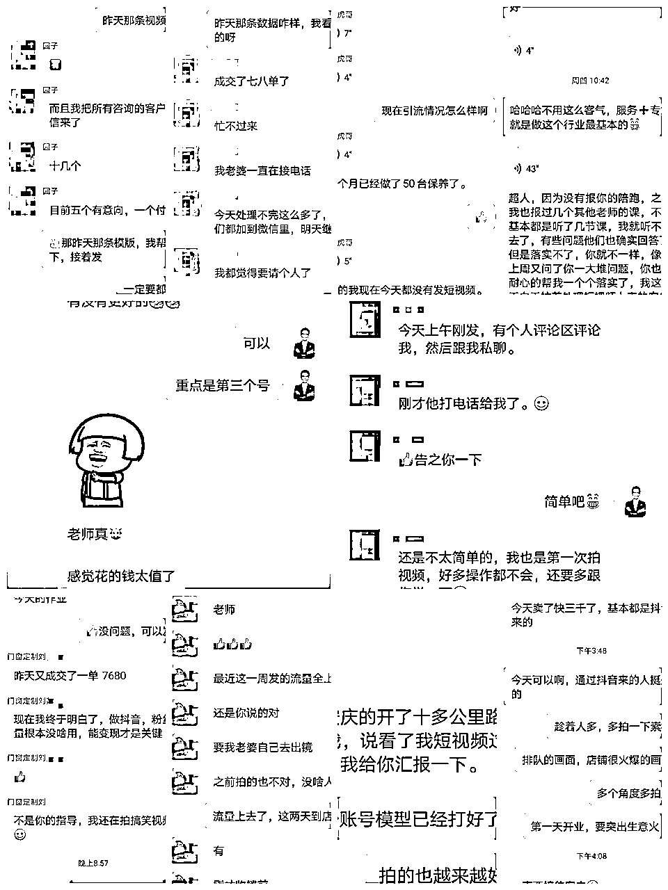

目前慢慢都出效果了。

上条精华帖子我结尾提了一嘴：实体老板多不多，拍我一下，如果多的话，我下次写篇实体店线上引流的干货。

然后就有很多实体老板加我，从今天开始，我会持续分享各个行业，如何做好实体流量，评论区可以留下你的行业，我下一篇就分享你这个行业的玩法。

# 绝大部分实体店都是做同城的生意，甚至是周围500米，1公里，3公里，6公里之内的生意:

流量渠道主要有以下六种：

1、线下路过的流量

2、大众的流量

3、美团饿了么的流量

4、短视频平台，小红书，内容平台的流量。

5、私域，朋友圈，同城群的流量

6、异业合作的流量

虽然对于实体店来说，一个渠道玩好，就够了，但是往往越传统的流量渠道，就越卷，因为做的同行多。

举个例子，发传单。虽然有效，但是也挺卷的。

那么对于实体店来说，其实最应该做的，投入产出比最高的，其实是做一个自媒体账号，比如做好短视频。

做一个同城IP。

「99.99%的实体老板大半辈子都是跟自己的行业在打交道（装修、餐饮、美业、工厂等等），完全不懂线上流量，而这个时候你只需要比同行多懂那么一点点，你就几乎垄断了方圆6公里甚至是整个同城线上的流量」

那么对于一家同城实体店来说，要怎么做呢？

# 其实就只需要做好这四个点：

目的明确、账号搭建、有效模板、复制放大。

尤其对于单店来说，做好前三个点就完全足够了。

## 目的明确：

首先我们一定要提前明确好我们的根本目的。

「我们作为一家实体店，做短视频的目的，就是为了线上引流精准客户，到店消费，而不是为了播放量、点赞量这些所谓的数据，播放量做到100W播放，没一个客资，没出一单，有屁用？」

变现，变现，变现，重要的事情说三遍。

对于同城实体店来说，做同城就是我们的核心也是我们的优势所在，我们需要的流：

只需要同城甚至是方圆几公里内的流量，当然更不是全国流量。

所以我们的短视频内容，就要紧紧地围绕这个根本目的去执行。

老老实实去口播拍专业知识，怎么练出翘臀，净水器怎么选，装修要注意哪些坑，如何护肤，讲这些大而泛的话题，怎么竞争得过全国各地的那些专业团队，专业选手呢？

那要怎么做呢？

别急，有效模板那块我再详细讲。

## 账号搭建：

这一块快速过，简单来说，就是名字、头像、背景图、简介、置顶视频五件套。

名字，对于一个同城IP是非常重要的，因为用户每刷到你一次视频，都是一次广告曝光，所以一定要让用户快速一眼就能知道，你在哪，你叫什么，你是干嘛的。

地域+行业+昵称。

比如长沙老王修车。

这里有个坑，一定一定要做同城IP，不要把你的店名当作你的名字，XXX公司，XXX店，比如：

潘阳县金属回收店、龙卷鲜黄焖鸡、扬州诚帮寄卖行。

为什么？

你放个店名，用店的身份去拍视频，天然带有广告性质。

个人IP自带亲切感，信任感。

「很多情况下，不是因为你的服务有多好，有多专业，我才去找你消费。

而是，因为我觉得你这个人特别靠谱，值得信任，才找你去消费。」

而，昵称，就是一个增加信任感的加分项，能拉近你和用户之间的距离。

为什么？

拿我自己举例子，我是叫傅超人更亲切，还是叫实体店引流更亲切呢？

如果你跟我互动，你到我店里来找我，是不是上来直接就会叫我名字，比如超人，我是刷你抖音来的。

如果没有昵称，那怎么打招呼？诶，喂？

对吧？

头像：就用IP本人的头像。

背景图：放店的门头图或者服务客户的过程图（比如餐饮店拍个很多用户就餐的图就行）

简介：展示自己的服务项、专业性、理念

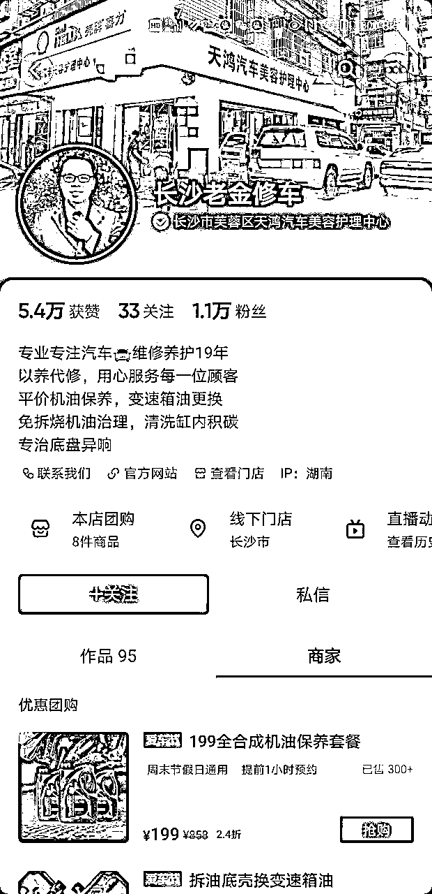

## 有效模板：

有效模板=黄金三秒+同城标签+购买理由+指令

你们思考一下，如果我是家烤肉店，这么多家烤肉店，用户为什么来我家吃饭？

是不是因为我家的烤肉好吃?

是不是因为我家的环境好?

是不是因为我家制作过程，食材干净卫生?

是不是因为我家的服务员服务好?

是不是因为我家的烤肉性价比高?

是不是因为我家有个美女老板娘?

是不是因为我家的美女老板娘感觉人很靠谱?

那同理，如果我是家装修店，这么多家装修店，用户为什么选我家的服务?

是不是因为我们公司做出来的装修效果好?

是不是因为我们公司用的原材料都是大牌?

是不是因为我们公司的性价比高?

是不是因为我们做装修非常细心?

是不是因为我们做装修非常专业?

是不是因为我们做装修口碑好，非常靠谱?

是不是因为我们为客户着想，服务好?

无论是产品，还是服务，用户能选择你的本质，是因为他看到了你的购买理由。

而很多大牌，做的大量广告营销，同样也是在讲购买理由

(这么多矿泉水，农夫山泉是甜的，是不是购买理由)

农夫山泉有点甜。

送礼就送脑白金。（过年要送礼，是不是购买理由)

小葵花妈妈开课啦，孩子咳嗽多半是肺热。(孩子咳嗽，是不是购买理由)

六味地黄丸，治肾亏不含糖。 (是不是购买理由)

好吃、新鲜、环境好、干净卫生、价格实惠、服务好、效果好、老板靠谱、性价比高、离你很近。

这些是什么？

是不是用户选择你们家的理由？

对吧？

好，那么我们拍短视频是不是就是把我们的购买理由通过短视频的形式呈现出来呢？

怎么体现出来食材新鲜？

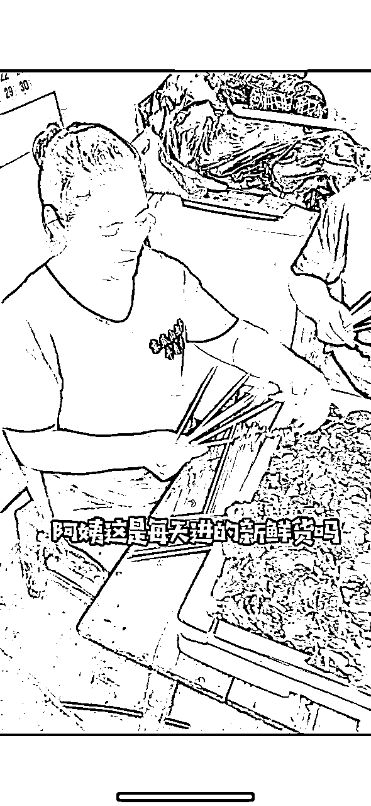

怎么体现出来好吃？

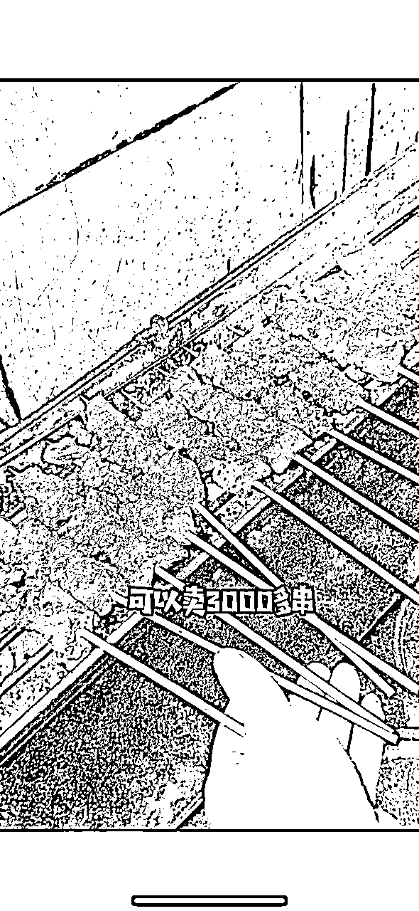

你的行业有什么购买理由呢，想一想。

好，那什么叫做有效模板呢？

首先提个概念：「想要在内容平台稳定高效获取流量，你的内容产出效率，你内容的可复制性一定要高。」

什么意思呢？

对于实体老板来说，每天花在短视频上的时间，不可能太多，而且也不能要求太高的拍摄剪辑能力，能做做口播，拍点视频素材，拼剪到一块就不错了，而且还得保持持续输出的能力。

那么，我们做内容必须套模板。

比如：

烤肉店视频，可以把一条30秒的视频，划分为5个段。

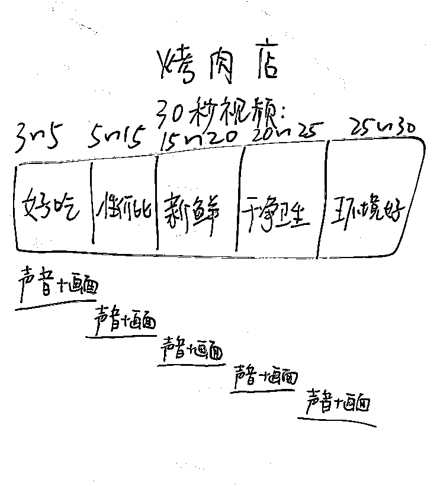

3~5秒：

烤肉滋滋冒油能不能体现好吃？

店里排队，爆满，吃的人多，能不能体现好吃？

客户好评能不能体现好吃？

5~15秒：

198团购满满一大桌子，十几个碟子满满当当。

昨天来了4个大学生，点一份198的团购就吃的饱饱的了。

客户对话（你们家的分量真够大的，吃的我好撑）

15~20秒：

把每天去菜市场采购的过程记录下来。

切新鲜肉的过程记录下来，能不体现新鲜。

那么干净卫生，环境好是不是一样，有非常多的表达方式。

视频素材上，文案上是不是取之不尽用之不竭？

这就叫做模板。

那我们作为一家实体店，是不是需要做的就是，找到模板，测出来有效，然后每天重复拍，是不是就够了？

其实，同城实体店，做短视频，就这么简单。

大家有没有发现，模板里面只有3~5秒，那么前三秒呢？

短视频平台，前三秒定生死（小红书封面标题定生死）

视频素材这一块我就不多说了，你自己搜索行业名，按照点赞顺序排序，把高赞视频的前三秒都看看，觉得你能持续拍出来的记录下来，自己去拍，测一下就行了。

那么除了视频素材，我们从画面上，也有骚操作：

比如

冲突流量词（放弃内卷、辞职创业、富二代体验生活、500公里、00后）、效果词（空闲、小富豪、尖叫连连、活力四射、围观）、第三方评价词（挺好做的、冲着老师也得把娃送进去、年轻人都说没见过没吃过）

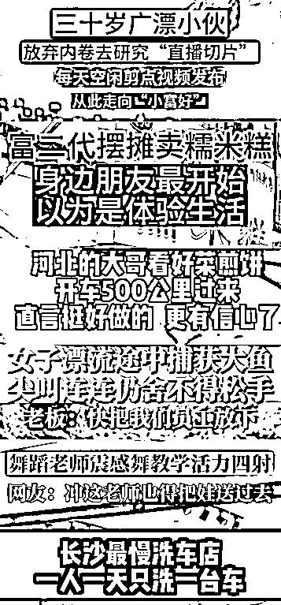

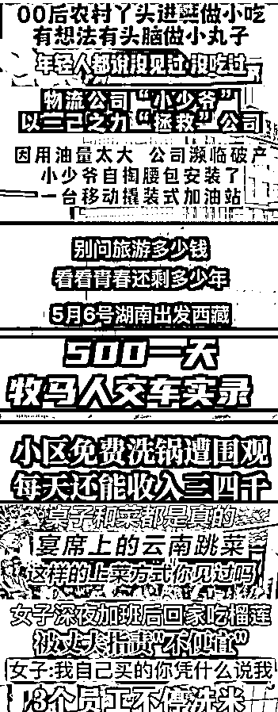

有的人还说，我看很多人整理了开头的文案，有用吗？

什么式，什么式的，显得很专业。

广告式 （直接讲产品）：39.9的双人烤鱼套餐真是太划算了、29.9居然就能做2次面部护理，是不是骗人的 、一平米XX的瓷砖，居然还有人觉得贵？

疑问式 （引起好奇）：在长沙如何花9.9就能吃10个菜？ 、如何在雨花区吃到 地道的重庆火锅 、如何在一周内学会三步上篮

导向式 （给出行为导向）：想周末带孩子去玩，那么就选XX 、想享受一次高档的XX体验，一定要来XX

比较式 （用过对比吸引）：1K和2K的净水器到底区别在哪？ 200块和2000块的包厢到底有什么区别？ 为什么有的XX烧烤要卖 XXX，而这里的只需要XX

挑战式 （借助挑战卖点做噱头）：在岳麓区挑战现场背唐诗，小孩免单。挑战在长沙两个人，99生活一天。

数字式 （用数字表达知识点）：买房前必须要了解的4点、我们是怎么做到每天服务100个顾客的

恐吓式：千万不要找熟人做装修，不然。。

其实，陪跑了这么多学员，这些什么式的开头，真的没啥用。

对于同城实体店来说，用好同城身份，用好开头三秒视频素材，用好标题党画面，就完全足够了。

根本不需要考虑啥文案。

好，前面我说了：

老老实实去口播拍专业知识，怎么练出翘臀，净水器怎么选，装修要注意哪些坑，如何护肤，讲这些大而泛的话题，怎么竞争得过全国各地的那些专业团队，专业选手呢？

同城同城，我们对比全国那些专业团队，最大的核心优势就是“同城”。

那“同城”到底是什么优势呢？

熟悉感，信任感，亲近感，跟我相关，离我很近。

可不可以说方言？（方言威力巨大，内容平台算法决定推流，而算法是根据刷到你视频，感兴趣用户的标签进行判断受众人群进行推流，你说方言，外地人谁愿意看呢？只有同城的看，慢慢的，你的推流标签，就都是同城的了）

可不可以在同城地标旁边拍？

可不可以说同城话题？长沙这十家招牌饭店，你吃过几家？

对不对！

我们做同城的最大优势就是“同城”这两个字，一定要好好用起来！

那有效模板=黄金三秒+同城标签+购买理由+指令

这个指令是什么意思？

就是用户看完视频，一定要去引导产生互动。

你引导互动，和不引导互动，数据还是有差别的。

对于我们同城实体店来说，这四个互动指令是最重要的。

购买 ：听说左下角这个团购活动只搞三天，这波羊毛赶紧去薅一波。

私信：如果你也在广州，想找专业做门窗的评论私信我

预约：在长沙，想做专业汽车保养的，左下角预约一下。

评论 ：评论区留下你的车型，我帮你看看，你能不能参加这次活动。

## 复制放大：

第四块是复制放大，单店老板，只要做好前三块，持续输出，就能在当地碾压其它同行，做个小网红了。

复制放大也有三类：

一类是内容复制，这一块就不多说了，有效模板已经说过了。

一类是付费复制，投豆荚6KM，本地推都算。

核心就是在有效视频的基础上，投放放大。

什么是有效视频？

出单很猛，咨询很多的视频。

一点点投就完事，这个技巧不多，就是锦上添花的操作。

一类是达人复制：

达人怎么找？

放大镜搜索团购达人广场，点击进去选择你所在的城市，比如说长沙。

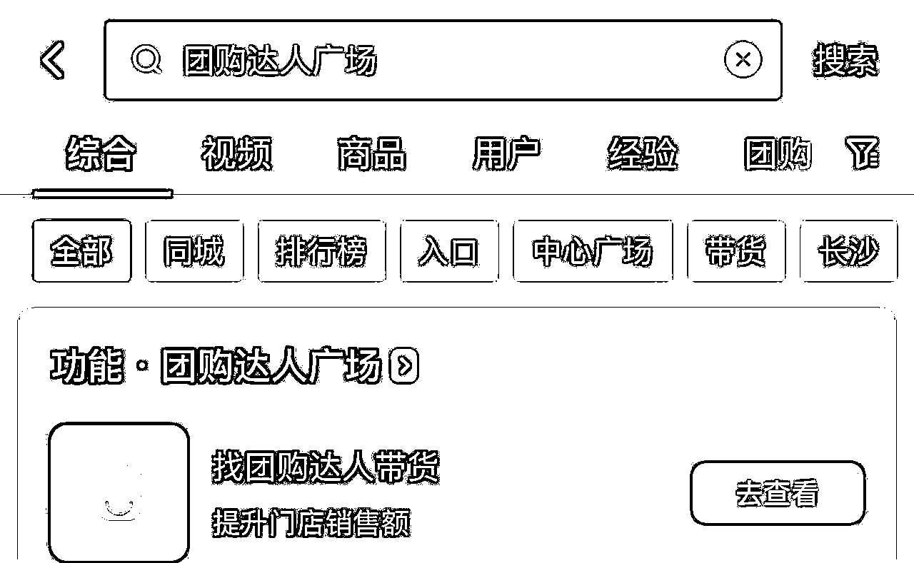

这也就是长沙所有的团购达人，直接给他们发消息就好。

第二，有这么多团购达人，怎么才能筛选出优质的达人？达人等级根据他们带团单的数据分为一到七级，等级越高效果越好。

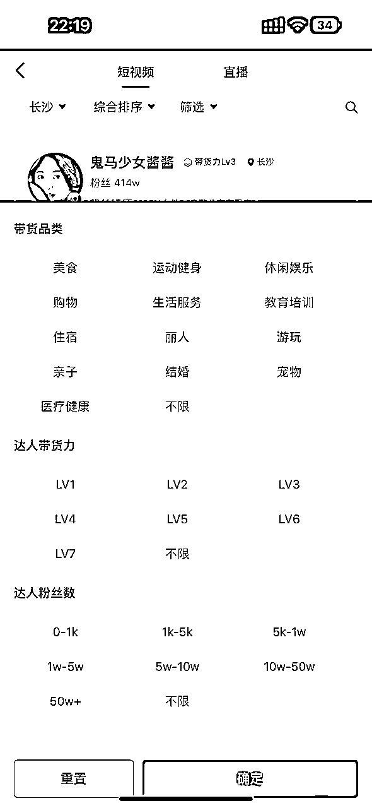

这里有个巨大的坑等着你去踩，你千万不要一股脑的去合作，你首先一定要综合考虑这三个指标，第一呢，优先找粉丝量少，等级高的，性价比高。

第二，看看他们的作品以及评论区IP地址，是不是都是本地人为主。

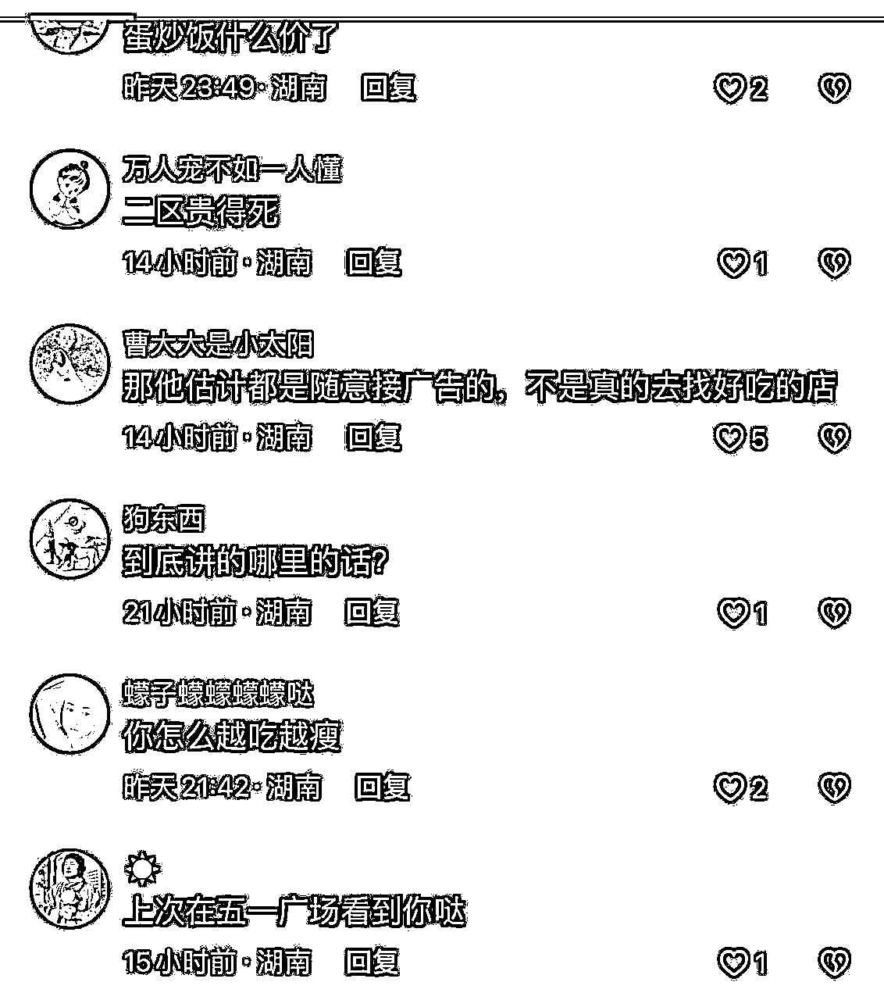

第三，优先选女性粉丝占比多的达人，女性消费能力更强，更容易冲动消费。

第四，一次找多少个达人合适呢？我们常用的组合是找15个三到四级达人，20多个一到二级的小达人。

主要是两种的合作方式，三四级以上的达人主要就是拍摄坑位费加抽佣，拍摄费用在50到几百不等，分佣比例呢在5%-90%不等，每个地方也不一样啊，多聊几个你就知道大概区间了。

还有第五点，最重要的一条，想要把你的店铺集中打爆，一定要和这些达人提前沟通好，必须集中在同一天发布。

这一点做好，你的店铺一周之内就会登上本地的吃喝玩乐排行榜。

而且现在团购达人不需要1000粉了，实名了就能开。

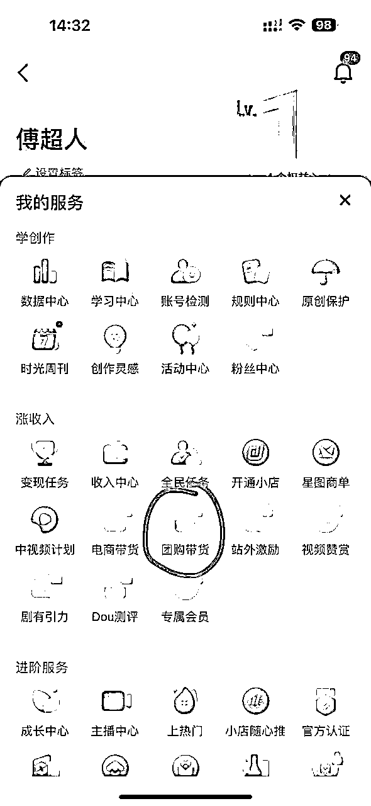

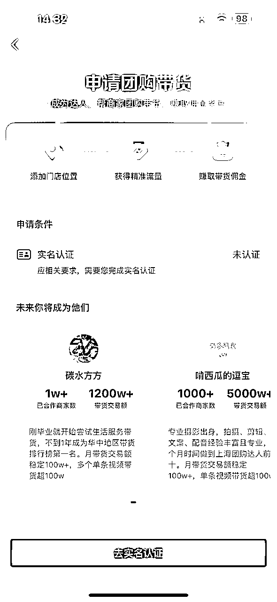

所以现在有很多连锁店，开始批量给达人有效素材混剪，走素人达人矩阵，效果非常好。

因为连锁店，只要团购达人挂地址，开了连锁店的任何地方都能刷到。

也就是说，我带的浙江的地址，但是如果我湖南有店的话，湖南这个店附近的人也刷的到。

可能看完还是有点懵，不知道从何下手。

一看就会，一做就懵。

没关系。

这篇文章只是给大家理清一下实体店做同城短视频的基本概念和底层逻辑。

当然也欢迎链接沟通 abcfjj123

我会在这个赛道里面深耕，专注于搞实体引流这个大方向。

但是，市面上的短视频呀，培训，课呀，其实对于实体老板来说，看了也很难学会。

最有效，最快的学习方法是什么？

就是在弄懂概念和底层逻辑后，直接一比一抄对标。

像很多这样优秀的同城实体账号，其实我们刷一辈子短视频都刷不到，因为它做的只是同城的生意。

「往往粉丝量只有几百上千的量，点赞数据也只有几十上百的数据，但是，变现却非常猛」

从今天开始，我会持续分享各个实体行业，如何做好线上短视频流量，直接拆对标账号，一比一抄就完事，评论区可以留下你的行业，我下一篇就分享你这个行业的玩法。

新圈友可以看这几个帖子再认识我一下，熟悉下名字，交个朋友。

看完如果有帮助的话，记得点赞支持一下，哈哈。

22岁，毕业半年，我赚了50W

https://mp.weixin.qq.com/s/2Ia-bdYlfRKUXHbhO8aP7g

小白如何快速成长

https://mp.weixin.qq.com/s/ScsBsTeHnbCIBlO0KBZUHw