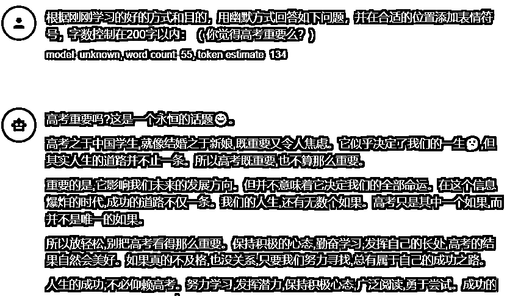

# 快速生成问一问的回答+视频号流量入口

> 来源：[https://y3my0b87ql.feishu.cn/docx/DyNYdmVkAodKlZxA2Qacr9gFnTf](https://y3my0b87ql.feishu.cn/docx/DyNYdmVkAodKlZxA2Qacr9gFnTf)

大家好，我是小叉，我又来了。

我看到好多人都在反馈，问一问提问之后，都提示审核不通过。

你不是一个人，我刚开始也是这样的，从ChatGPT 复制过来的文字，审核都通不过，提示不行。

# 一，什么是微信问一问？

有人认为是类似知乎体，我认为这个里面的回答更偏于知乎+小红书的分割，需要用户用很短的时间看完一篇文章。

毕竟知乎的群体是人均百万起步，逼格高一些。

来自官方的文档：在问一问里首页，用户可以看到我们为你推荐的优质有趣的问答。

在浏览别人回答的过程中欢迎你对感兴趣的问题也发表自己的看法、分享自己的经验你还可以直接进入问题广场，直接找到自己感兴趣的问题进行回答。

优质的答案，除了在问一问首页被推荐，还会在用户搜索相关问题时进行展现，帮助更多人解答问题。用户可以对认可的回答进行点赞、转发或关注创作者。

如果没有开通的「微信问一问」，站内搜索下，太多了，生财就有这样的好处。


可以参考第一篇：https://t.zsxq.com/0fzvazCi0 ， 我就不冷炒饭了。

# 二，做微信问一问的好处

视频号的快速流量来源之一。

如果是你在做视频号，想积累正反馈，这里是不错的选择。

通过回答问题，可以了解微信用户的各类问题需求，增加创作灵感来源。

比如你在写作公众号文章的时候，你看其他的问答或者自己的想到的一个点，就可以用来创作了，同时也可以梳理自己的写作框架等等。

回答后，高质量答案将在问一问首页推荐给更多用户看到。同时，在搜一搜中，用户搜索相关问题时，高质量答案将在结果页首条曝光，用户浏览后可进行转发、点赞等操作;

重点：如果你使用视频号视频来回答问题，还会为视频带来新增的曝光，也是吸引粉丝的新渠道。

那如何才能有更好的回答喃？

# 三，手把手教你创作

明白 ChatGPT 不是什么都懂的，需要你投喂资料才行，并且告诉他什么样的回答会被通过和获得高质量的点赞和转发。

## 告诉他什么是微信问一问

投喂前：没有投喂，出来的结果差十万八千里。


投喂提示词，告诉他，明确的是什么和目的是什么：

```
不对，下面我给你介绍下，什么是微信问一问和其目的：
（微信问一问是什么：
在问一问里首页，用户可以看到我们为你推荐的优质有趣的问答。
在浏览别人回答的过程中欢迎你对感兴趣的问题也发表自己的看法、分享自己的经验你还可以直接进入问题广场，直接找到自己感兴趣的问题进行回答。优质的答案，除了在问一问首页被推荐，还会在用户搜索相关问题时进行展现，帮助更多人解答问题。用户可以对认可的回答进行点赞、转发或关注创作者
参与问答的目的：
通过问题，你可以了解微信用户的各类问题需求，增加创作灵感来源:
回答后，高质量答案将在问一问首页推荐给更多用户看到。同时，在搜一搜中，用户搜索相关问题时，高质量答案将在结果页首条曝光，用户浏览后可进行转发、点赞等操作;如果你使用视频号视频来回答问题，还会为视频带来新增的曝光，也是吸引粉丝的新渠道。）
```


来看看返回的结果：


## 提供好的素材和案例

现在他知道是什么了，需求是什么了， 那么还有好的，优秀的作业给他抄一抄喃？

有的，直接上优秀的总结文档，下面是提示词，直接复制即可。

```
非常好，请继续学习下面是好的问答方式和优秀案例：

1\. 真实、直接且有效的回答，对真正抱有这个问题的人有帮助
真实经验，言之有物
真实感受，分享观点

2\. 开放性的问题下，简短但精炼的表述能在回答问题的基础上提供新颖有趣的思考角度
一句话也能回答问题，给人回味或提供趣味
在严肃回答的基础上，用幽默的方式丰富观点

3\. 添加高质量的图片或视频让答案更加清晰
主要通过文字回答问题但视频图片给到有价值的补充
视频图片本身回答问题

4\. 舒适的排版让内容变得易读
善用换行、表情、字符分隔文字，让逻辑清晰、重点突出
```

来看看学习的结果：


需要更好的素材和案例，用30分钟，刷问一问里面的优秀回答，然后复制出来，作为投喂的资料。

## 出成品的环节

上面投喂和训练完成之后，就可以开始创作了。

生财有非常这样多的话题和教程，我直接上提示词的案例：

```
根据刚刚学习的好的方式和目的，用幽默方式回答如下问题，并在合适的位置添加表情符号：（ 你觉得高考重要？）
```

训练后的效果：



# 四，最后的结果

我回答了10个问题 （每个问题2~4分钟），可以给视频号带来点赞超过100个，粉丝接近10来个。

你有产品，视频号的下方挂载公众号的链接，等等都是变现的方式，我目前还没有走通闭环，先把流量搞起来，内容尽量垂直。

下面是自己的号，内容不是很垂直，效果都不错。


来吧，知行合一：定一个Flag，每天回答 3 个问题。

还有什么问题，欢迎评论区交流。