# 《0基础新手如何用ChatGPT创作90分的高质量小红书笔记，提高30倍神仙效率！》

> 来源：[https://qdrlbziuml.feishu.cn/docx/E28CdvbzAoulmxxLpoZcchBinhm](https://qdrlbziuml.feishu.cn/docx/E28CdvbzAoulmxxLpoZcchBinhm)

大家好呀，见帖欢喜。我是生财圈友，比比先森，目前是一名小红书高客单引流变现教练，曾参与操盘新媒体专家小红书账号涨粉10w+，变现100w+，带领过1000+学员赚到小红书第一桶金，也是5月份小红书运营航海教练一员。

我之前一直深耕爆款内容，强调精细拆解和对标模仿。但在指导学员过程中，我发现，哪怕给他们对标案例，让他们拆解分析后结合自己的故事和定位独立完成一篇小红书笔记，依旧很难。

所以很多做小红书IP的宝子，在路上遇到的第一个卡点，往往不是第一桶金难赚，而是天天感慨，写笔记怎么要花这么久时间，真的是又累又枯燥！！！

不只是笔记文案，只是完成一条标题，都足够让有些完美主义的宝子研究打磨好长一段时间，不太满意，一改再改，时间成本相当高。

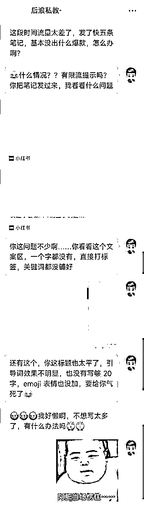

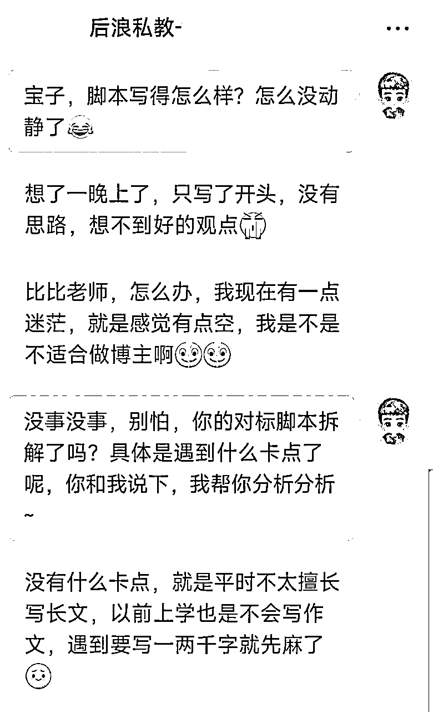

于是发现很多宝子到后面开始敷衍，只盲目追求数量，导致数据持续糟糕，没有好转后逐渐打消积极性，最后只留下一句：“今年的小红书真的太多人做了，好卷，小眼睛都没多少也没人点赞关注，算了，还是换个项目平台吧……”

（小红书都忍不住想发言：漏！大漏特漏！这不是我的锅！！！）

之前我看到这种情况可能就是挥起鞭子：“加油啊！冲起来！我监督你，今晚之前把脚本写完，再发给我改！”但鸡血好像打得我自己都快麻了......

后来我一直在想，有没有什么办法能提高他们产出的效率？更标准化的方法论，亦或者是好工具？假如不需要花钱找兼职做笔记，有更加高效且低门槛的方式或工具，那岂不是可以直接起飞🛫？！

直到我有一天在抖音刷到用chatgpt创作小红书的笔记，惊艳于chatgpt的丰富的调教方式和新鲜视角，我才决定开始学习和使用chatgpt实践创作。

chatgpt作为今年的顶级热门选手，发展得如火如荼，但我不知道你们会不会像我之前一样，一直停留在“chatgpt是很牛，但太难调教了，只能生产60分内容”的固有认知。

通过大量调研资料和躬身入局后，我成功挖掘出新手用chatgpt的模板思路，甚至可以说，给我和学员找到了一个相当优秀的小红书内容专家！

所以ChatGPT对于上面所说的这些宝子来说，真的可以说是，宛若救命稻草，简直如有神助。

还没有用过chatgpt的小伙伴，或许会对“一分钟用chatgpt写出一篇1000字的小红书爆款笔记”，“单天高效生产100篇小红书文案脚本”产生质疑，认为这是夺人眼球的标题党。

于是我特地用了计时器录屏呈现，以小红书非常爆款的“纪录片合集推荐”选题为例，带圈友们亲自一睹chatgpt的神仙生产力！

1分钟视频如下：

《一分钟用chatgpt写出一篇1000字的小红书爆款笔记》

来，我们打个比方，假设写一篇1000字的小红书文案笔记，打字速度150字/分钟，正常敲键盘也需要七八分钟。而这还是你行云流水一泻千里的时候才能达到的最强水平。

除此之外，你还需要思考结构，寻找素材，铺关键词，增加emoji表情，打上标签，合适最快也差不多要30min左右。但ChatGPT只花了不到1min，效率直接翻了30倍！

对吧？单纯描述，不如直接上案例。不过，这还没结束，嘿嘿。

当我和一些对创作内容有卡点和困难的宝子推荐学习ChatGPT和进行指导后，他们有人出了第一条千赞爆款。

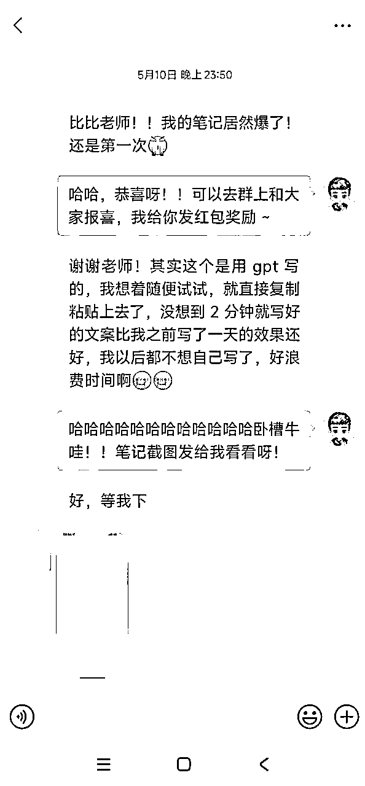

甚至还有摄影接拍赛道的私教宝子靠chatgpt生成的标题文案直接出单变现，用5分钟写的ChatGPT文案发小红书，一小时出单变现4000！！

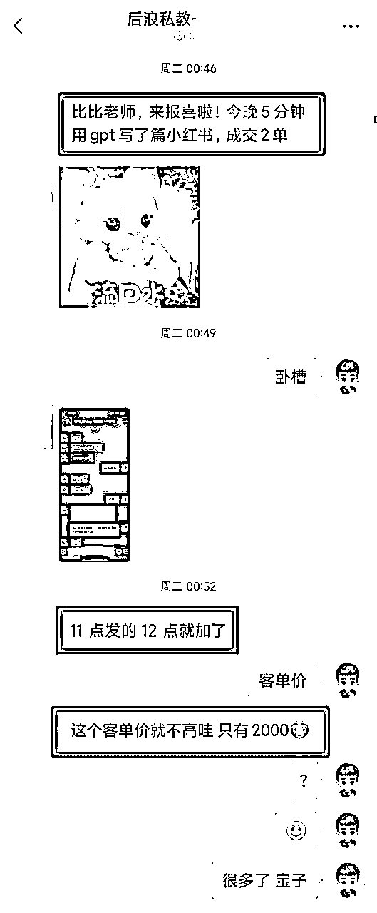

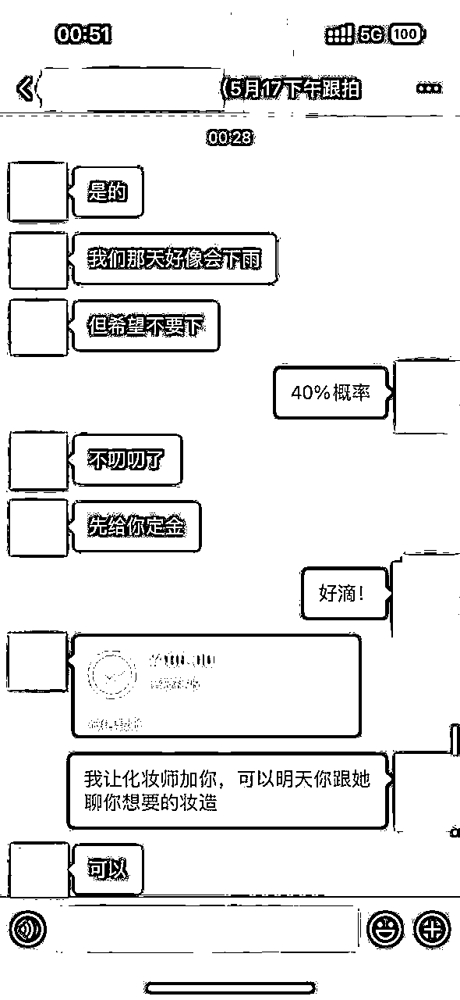

所以，如果你还在隔岸观火，或者停留在chatgpt新手层，吐槽“chatgpt生产的内容根本就不能用！”，亦或是想要深入研究chatgpt在小红书领域的高级玩法，那我想，这篇文章一定对你有帮助。

在文章开始之前，让我们先做个简单的投票互动吧！😘

## ChatGPT与小红书的介绍

作为基于GPT-3.5模型的语言生成工具，ChatGPT具备与用户进行交互的能力，并能够生成连贯、富有创意的文本。其独特之处在于，它不仅可以理解自然语言的含义，还能够通过大量的训练数据学习语法、用词和逻辑，使其生成的文本更加准确和流畅。

对于小红书博主而言，ChatGPT提供了一种全新的方式来创作小红书笔记，我们通过提出问题，描述创作需求，指导ChatGPT生成相关的文本回应。这种交互式的创作过程为用户提供了一个与AI合作的机会，利用AI的智能才华和语言生成能力来拓展自己的创作思路。

通过结合ChatGPT的强大功能与小红书平台的特点，博主可以借助AI的智能帮助提升小红书笔记的质量和影响力。无论是通过获取创作灵感、丰富内容，还是通过与AI进行互动，用户都能够以全新的方式展现自己的创意和表达能力。接下来，我们将深入探讨使用ChatGPT创作小红书笔记的具体步骤和技巧，以帮助小红书博主用户更好地利用这一工具，开拓高效创作的可能性。

#### 补充：prompt的解释

Prompt，提示词，以书面或口头语言形式向计算机系统发出的指令，它可以指导网络生成更加符合要求的输出结果。

通俗来说，prompt可以帮助我们更好的与ChatGPT对话，以获得更加满意和符合预期的答案。

我们都说，有好问题才有好答案。的确，在我们请教他人时，清晰地表达一个具象化的问题，能够更好的助于对方理解我们的需求，从而更有针对性的帮助解决问题。在chatgpt当中也是如此。你的问题越清晰，chatgpt呈现的答案就越令你满意。

prompt的高质量决定chatgpt回应内容的高质量。因此，找对好的prompt模板和提问思路，会达到事半功倍的效果！

## 如何高效调教ChatGPT？

### 模板参考

市面上有很多前辈分享了关于调教ChatGPT的框架模板。我这里给大家推荐几个很有意义和帮助的模板。

#### 1.Back模型（来自网络）

1/背景（background）：给 ChatGPT交待清楚你做事的背景，清晰地告诉它你希望达到的目标。

2/行动（action）：告诉 ChatGPT它要做什么，如果有必要的话，可以亲自做个示范。

3/角色（character）：为 ChatGPT选择一个最适合做这件事情的角色，并且告诉它。

4/知识（knowledge）：告诉 ChatGPT完成这个任务可以调用哪个领域的知识，让它提升专业性。

#### 2.Trick法则5要素（来自阿泽）

1/任务(Task)：明确简洁地陈述要求AI生成的内容。

2/角色(Role)：模型在生成文本时应扮演的角色。

3/指令(Instructions)：模型在生成文本时应遵循的指令要求和目的。

4/上下文(Context)：用于补充背景信息，提升输出内容的相关性。

5/关键词(key-word)：用来控制输出结果的关键文本或短语，有时包含在指令或任务中。

#### 3.broke分析法（来自陈财猫）

1/阐述背景B（Background）：说明背景，为chatGPT提供充足信息。

2/定义角色R（Role）：“我们希望chatGPT扮演的角色”。

3/定义目标O（Objectives）：“我们希望实现什么”。

4/定义关键结果K（KeyResult）：“我要什么具体效果”。

5/试验并调整，改进E（Evolve）：三种改进方法自由组合。

5.1/改进输入：从答案的不足之处着手改进背景B，角色R，目标Q与关键结果K

5.2/改进答案：在后续对话中指正chatGPT答案缺点

5.3重新生成：尝试在prompt不变的情况下多次生成结果，优中选优

当然，网络上也有很多prompt指令模板网站，可以帮助快速生成标准的prompt指令，令ChatGPT给出更精准有效的回应。

1/https://bestprompts.cn/

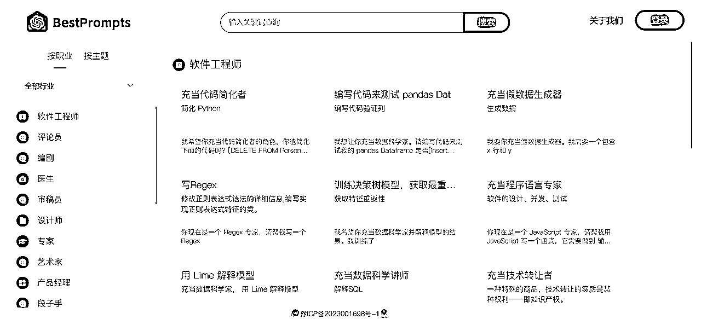

2/https://prompt-shortcut.writeathon.cn/

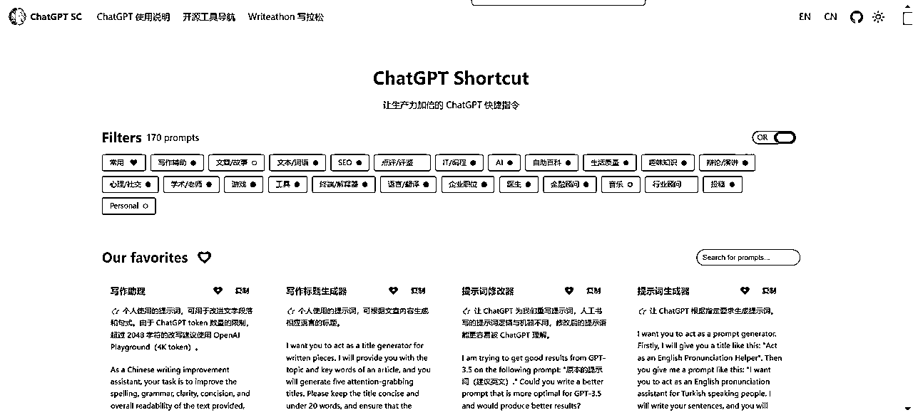

3/www.promptgenius.site

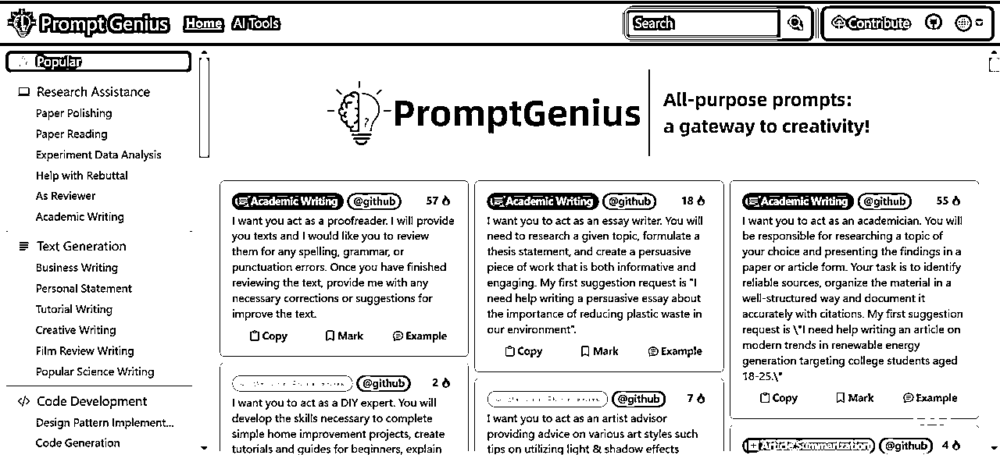

那，不管是和模板框架，还是各种网站提供的prompt，这些在一定意义上，确实真真实实提高了我们的提问效率和准确度，也让我们确实对ChatGPT的功能惊艳了一阵。

但当你大量实践ChatGPT且需要高度依赖他提高生产力或学习力，你会发现，这些prompt的最大意义，并不是给你直接答案，而是作为优秀范例参考，帮助你在这些基础之上，形成专属自己提问调教的思路框架。

来，我们尝试横向对比，其实很容易得出结论：高效调教ChatGPT就这4个关键因素：

### 背景

背景：发起指令的背景是什么？

有利于ChatGPT更好的理解上下文相关信息。

### 任务

任务：你需要通过对话达成什么目的？让ChatGPT具体回应什么问题？你希望他为你做什么？

### 角色

角色：ChatGPT应该作为什么角色？你要作为什么角色？

引导角色有利于ChatGPT调动自己的特定领域知识，发挥专长。

而之所以对你自己也要下定义，是因为，让他作为专家，向老板与小孩对话得出的效果就完全不一样。

### 要求

要求：输出的内容有没有形式要求？风格特点要求？字数要求？需不需要注意什么细节考虑？

其中，前三项是必须项，“要求”是可选项。而且“要求”的具体限制和规定有利于大大提高问题的清晰度和质量。

既然初步结论有了。那接下来，我们赶紧进入实战吧，和大家分享我作为ChatGPT新人，如何使用和调教ChatGPT，以及从小红书教练的视角分析点评ChatGPT给出的答案。通过展现ChatGPT进行小红书创作的过程，分享引导ChatGPT的6大方法和3大误区。且在实战过后的总结感受。

## 小红书+ChatGPT实战篇

先上本篇框架：

### 1.角色定义法——人设定位梳理

来，先问大家一个问题，你们觉得，做小红书，最重要的是什么？定位。

很多人一来就开始就问，怎么涨粉？怎么引流？我都不会直接陷入他们的框架，而是直指核心：“你有没有想清楚做博主，你的定位是什么？”

定位定江山。举个很日常的例子，做宝妈，同样有很多细分定位可以选择。

如果你在备孕或者是孩子刚出生， 那你非常适合做育儿新手宝妈，一边学习当妈新知，一边输出育儿价值，这是很多新手宝妈的强烈痛点和必修课。

如果你是职场风云高层，因为孩子而离职居家带娃， 那你适合做职场宝妈，吸引来的高客单价人群，能够与你有很强烈的共鸣和信任感，后端变现很顺畅。

如果你孩子已经上学， 那你可以围绕着儿童教育，分享教娃心得，是学霸娃的话不仅帮你长脸，而且教育类商单数量不少，质量很高。

不同的定位结合不同的背景，才能让你的人设抗打，站稳自己的位置， 在某些“点”上拥有自己的独特优势和长处，然后再去寻找相对更适合你的价值网络。

而当我问起chatgpt的时候，我被彻底惊艳到了。它居然能列出12个具体的人设定位和方向参考，作为小红书教练，我突然有点惭愧（猛男落泪）

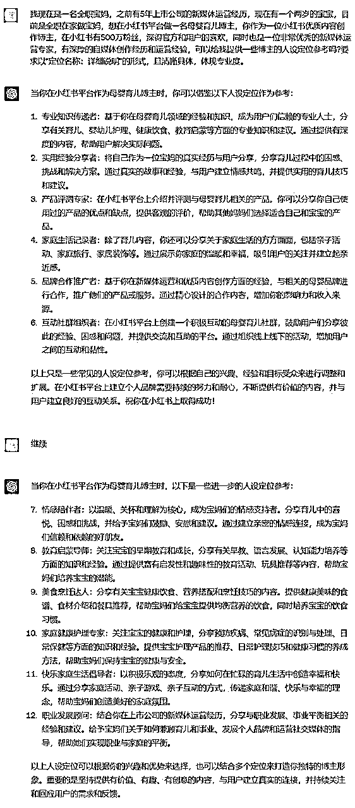

来，我们来拆解一下这条prompt。

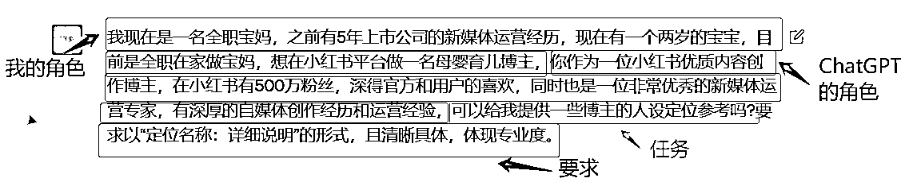

首先明确我的角色：全职宝妈，且详细补充了个人信息介绍。

然后明确ChatGPT的角色：“一位小红书优质内容创作博主，在小红书有500万粉丝，深得官方的用户的喜欢，同时也是一位非常优秀的新媒体运营专家，有深厚的自媒体创作经历和运营经验。”

之所以这么描述，一方面是我对它的定位更加清晰，具备创作能力和运营能力。让它可以调用这个能力板块相关的知识。

另一方面是，经过多次实践发现，当我把它当成真正的人物形象去对待，而且当做专家抬举得很高很高，它真的会给出让你更加满意的结果。（所以，多夸夸ChatGPT，它真的会听进去）😂

同时你可能会发现了，我不仅让ChatGPT作为特定形象，还给自己赋予了角色。当你提供自己角色信息，ChatGPT提供的回答会更精准，更贴近符合你的角色形象。

方法总结：

角色定义法：对话ChatGPT之前，先让它记住它要作为谁，以及我是谁。

### 2.层层套娃法——选题库搭建

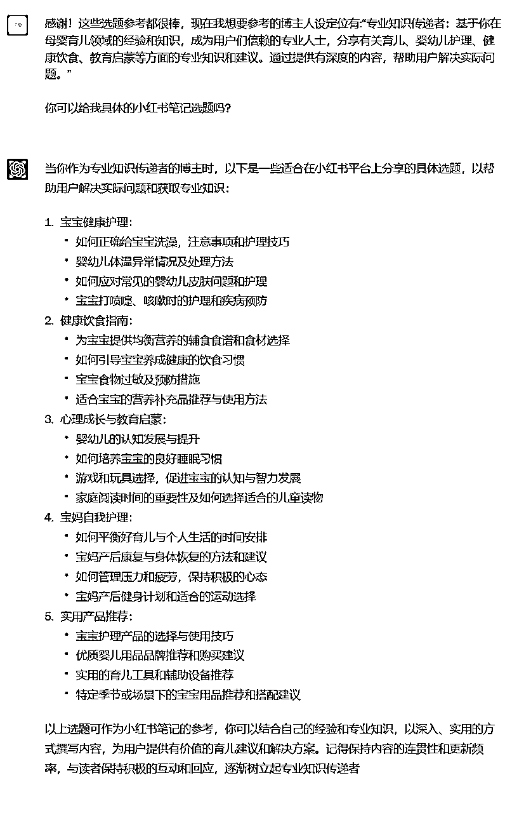

上面，ChatGPT给我们提供了12个人设定位。我们可以逐个询问，层层套娃，这样就可以生成“12 × n”个数量的选题库啦！

示例如下：

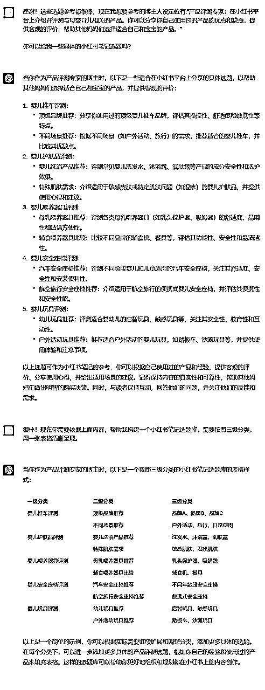

为了方便我们阅读更清晰，我让它以表格形式呈现。

口令：“按照x级分类，用一张表格呈现。”

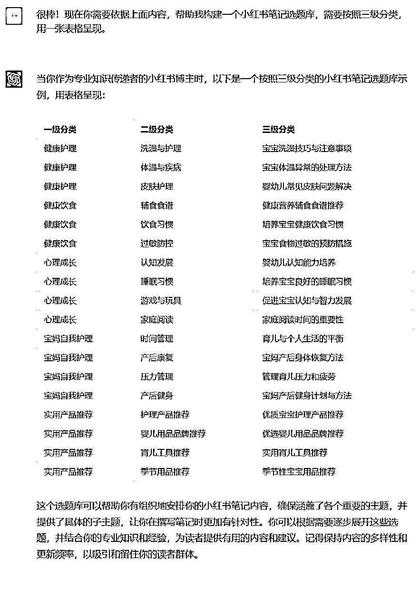

方法总结：

层层套娃法：让ChatGPT先给出框架，大纲，选题库等，再逐个深度挖掘询问，进而得到“n × n”的裂变数量级效果。

### 3.多元反馈法——标题库搭建

现在我们已经确立好定位，也找好了优质选题并搭建选题库，接下来，我们直接针对单个选题进行笔记创作，首先是标题。

因为ChatGPT会自动记住并联系上下文，相当于一个角色对应一个对话场景，我们一直在一个对话场景进行反馈，所以可以省略角色描述，除非改变角色指令。

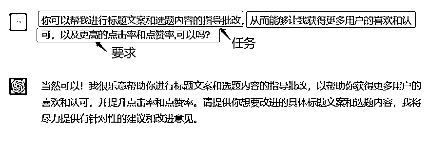

但给出的标题，确实很糟糕。别急，先不要急着怼ChatGPT生产的内容又没用，可以先从我们的指令上做好优化升级。

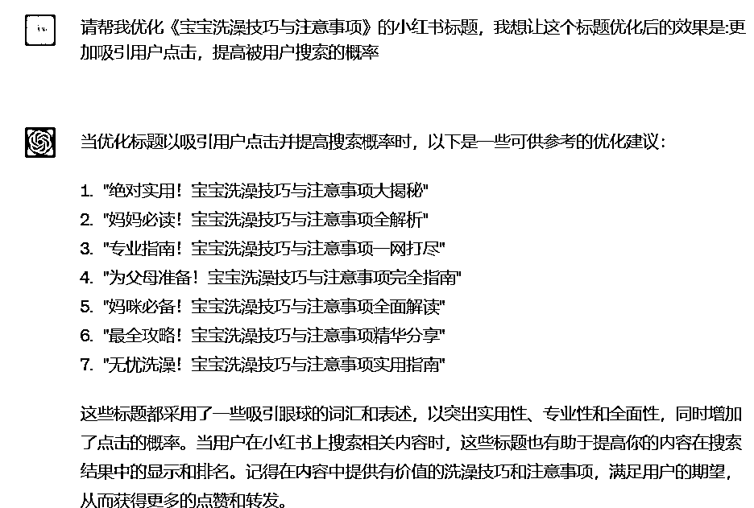

首先，表达我们的态度：“这些标题很糟糕，不满意。”让ChatGPT收集我们的反馈，使后面的回应更趋向我们的需求，而且，它也会记住上下文之间的逻辑联系。

接下来，我们可以进一步强化要求指令。

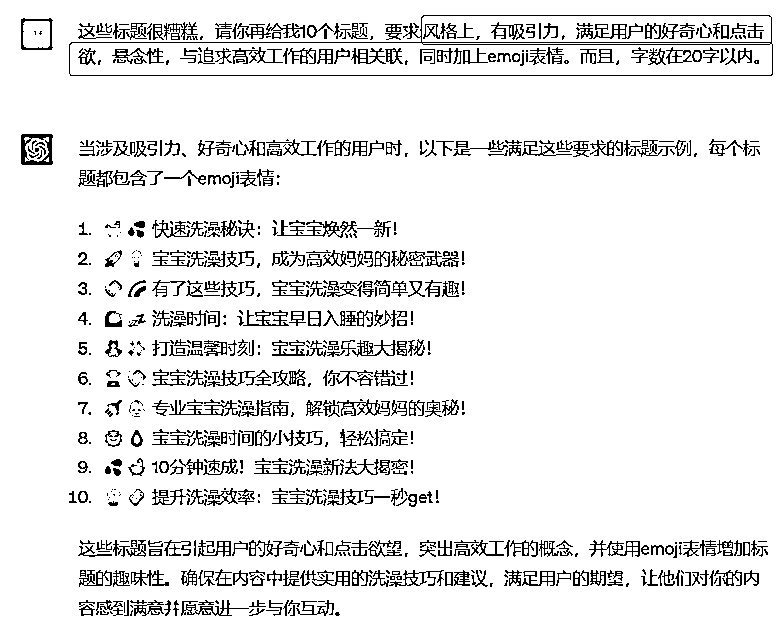

效果一瞬间好很多了有木有！所以，我们可以总结两点。

1/一定要对ChatGPT的反馈给予反馈，如同我们上学时，如果单纯只考试，但老师不对答案不改分数，我们就不知道自己做得好不好。

只有ChatGPT知道自己做得好或不好，还能了解更加具体的改进方向，那它的回答一定会让我们更满意。所以，不要只有“反馈”，这样ChatGPT会不明所以。

2/如果回答的太过泛泛而谈（意思就是正确的废话，不能作为优质内容及时采用），那一定是我们的任务不够聚焦，要求限制不够。把任务事件写详细，把要求限制写得具体清晰，就不怕ChatGPT的回应会不合心意。要进行“反馈+要求”，在此也列举一些“要求”的话术：

*   写得太宽泛了，、xxx再写得更加详细一些，同时再举2个具体的例子

*   写得太书面化了，请用幼儿园老师对待孩子的语气进行风格改写

*   写得不够全面，请加上我的观点”xxx",融入到你的最终总结里

*   .....

方法总结：

多元反馈法：不管回答有效与否，积极给出反馈，因为ChatGPT真的会记住，并归入到他的问答框架里。

得出的答案不行，一定是我们的任务要求没写到位，把要求限制写得具体清晰，就不怕ChatGPT的回应会不合心意。

### 4.案例参考法——文案撰写

写完标题，接下来到了文案区撰写部分。

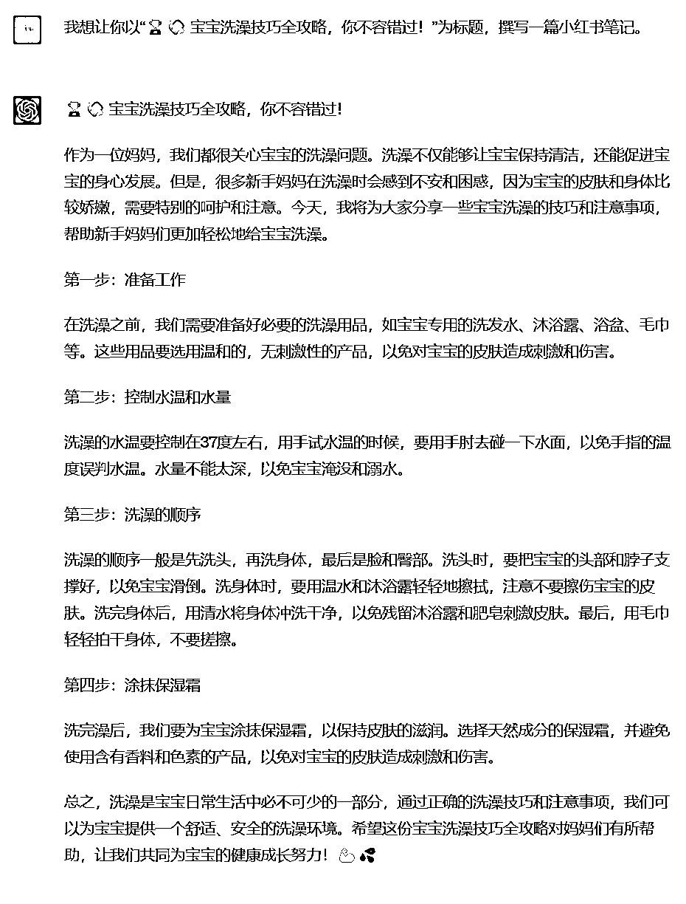

我们发现，这个效果不太好。就像我前面说的，要求限制不够，他的回应就会泛泛空谈。更具体可以发现，ChatGPT还不清楚“小红书笔记”有什么特点。

除了上面所说的方法，发表多元反馈，增加要求限制。

我想和大家展示另外一种调教方法：案例参考法。意思就是，我们通过给予认可的案例，让ChatGPT总结特点，然后直接对标模仿。

总共分为四步：案例提供-特点分析-口令强化-对标模仿。

案例提供：直接给予ChatGPT我认可的符合小红书文案风格的笔记文案。

特点分析：提出“请你以此分析总结出小红书优质文案（可换）的风格特点”的任务要求。

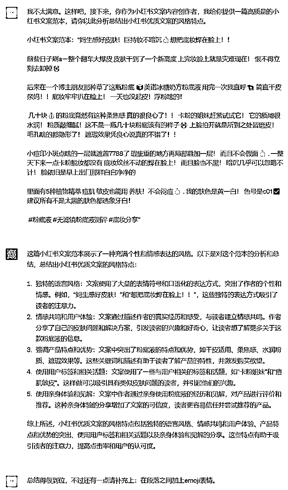

口令强化：补充完善反应，并让ChatGPT记住。同时，因为ChatGPT不善于记住太多长文的内容，容易混淆，可能导致回答的内容混乱。

因此，我们总结关键词提醒，口令如下：

总结得很到位，不过还有一点请补充上: 在段落之间加上emoji表情。（可换）

接下来，请把上面你分析的小红书优质文案的风格特点（可换），总结成一个指令，名称是“小红书风格”（可换）之后每当我需要你作为小红书文案创作者（可换）进行文案撰写，提出“小红书风格”（可换），你就根据这种风格特点撰写文案，可以吗?

可以的话，请回复:“好的，如果我收到“小红书风格”（可换）相关的指令，我将根据上面我分析的小红书优质文案（可换）的风格特点进行文案创作。”

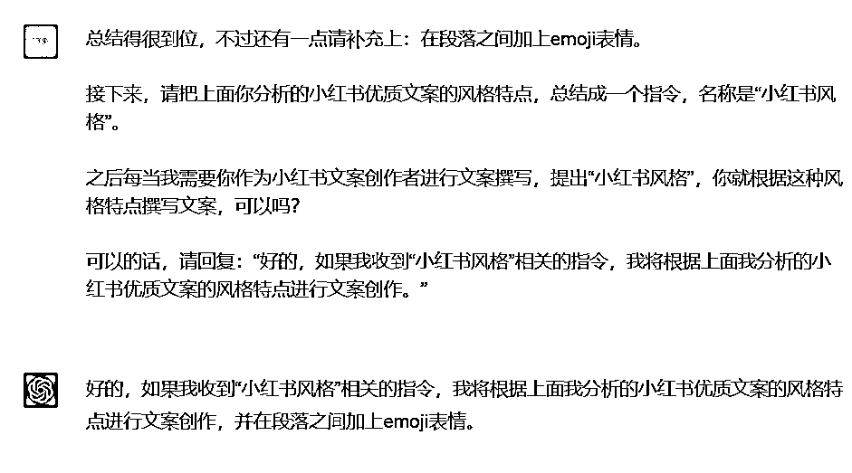

对标模仿：给予刚才设置的关键词，重新调整口令，让ChatGPT成功对标模仿，写出我们满意的小红书笔记，并且可以切换标题多次指导，不需要重复流程。

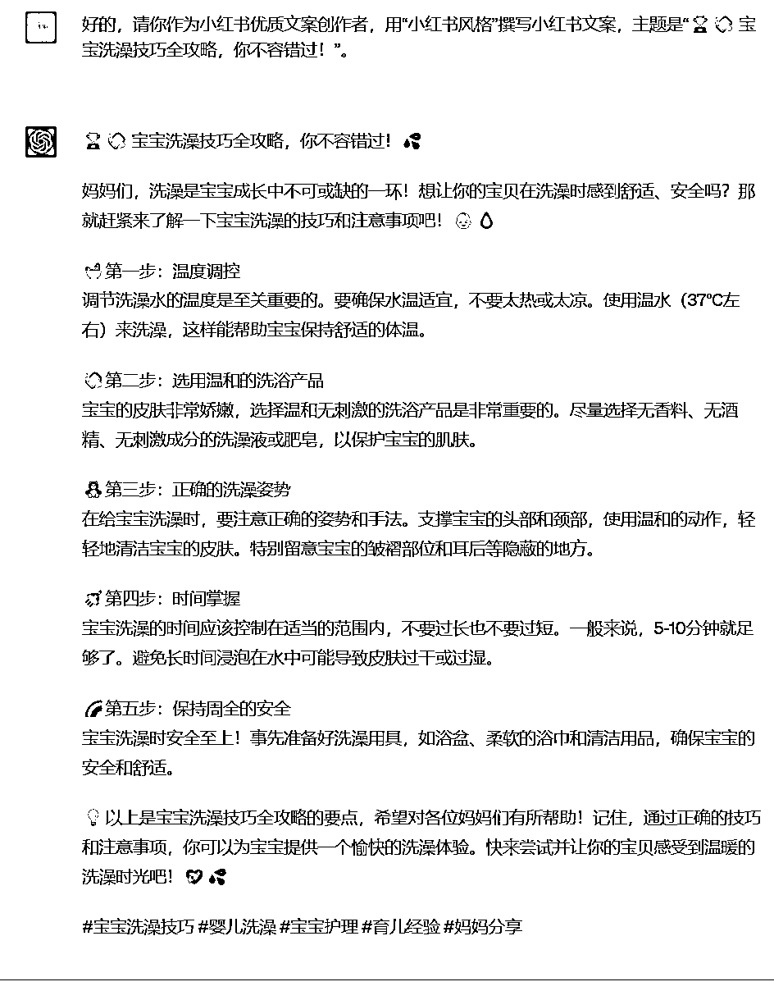

最终效果对比：

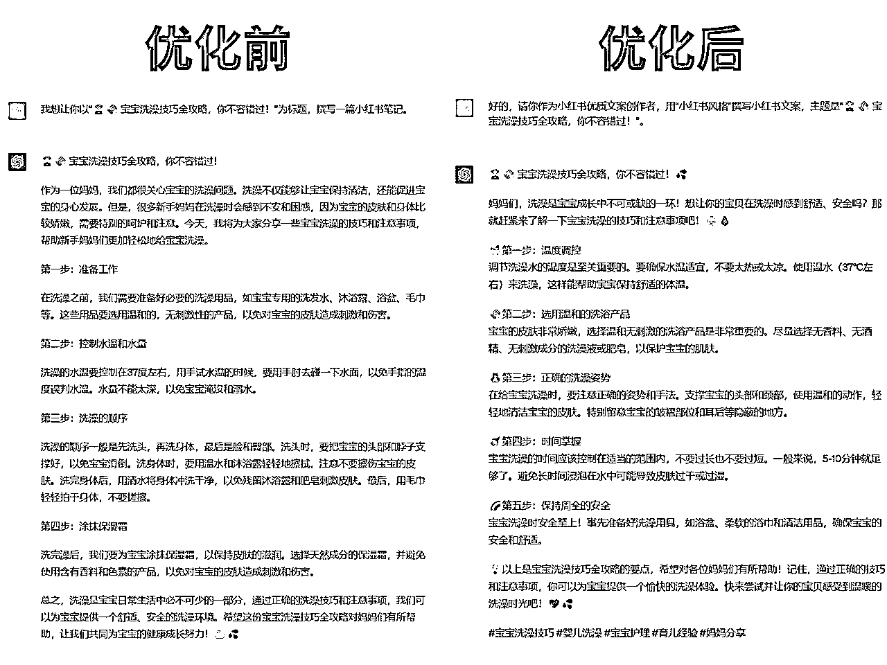

总结：当我们很难表达具体的任务需求限制，但手上有现成案例，案例参考法就显得特别实用，让ChatGPT先分析后模仿，这波操作很丝滑。

而且，告诉你个小秘密：长文章用起来也很顺畅！你可以给ChatGPT输送几篇你喜欢的公众号长文，分析出文章特点后，再发送你自己写的文章，让它帮你进行风格改写，嘿嘿！

方法总结：

案例参考法：案例提供-特点分析-口令强化-对标模仿，让ChatGPT先分析后模仿，这波操作很丝滑。

### 5.重复提问法——矩阵号操作

对于做小红书矩阵号的选手来讲，ChatGPT生成的“一义多文”可以很好的满足需求。也就是说，同样的问题指令，我们只需要不断让chatgpt重复回答，就可以短时间生成同一选题下相近的文案，高效避免查重。

操作方法：

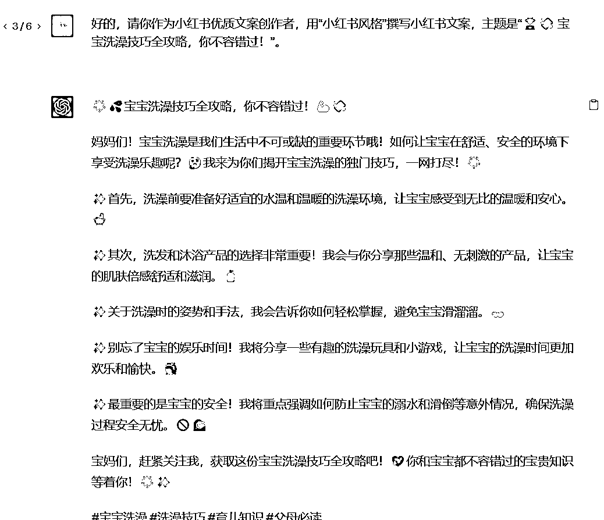

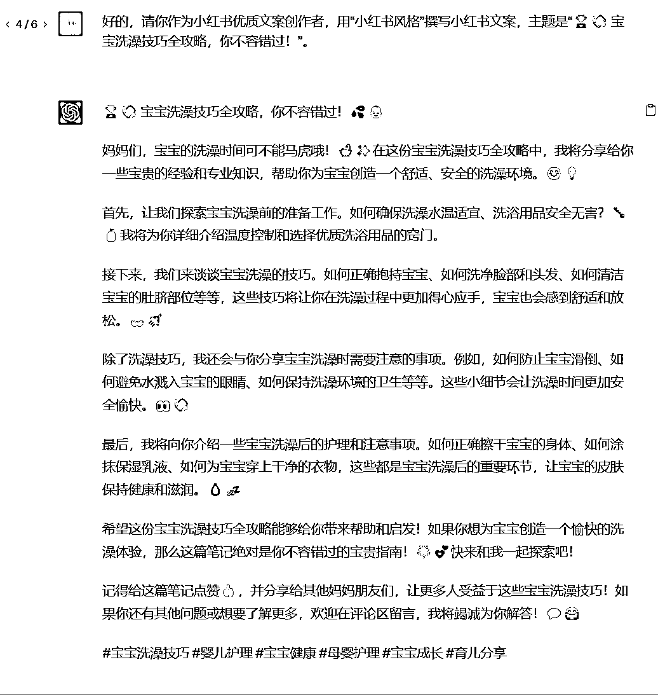

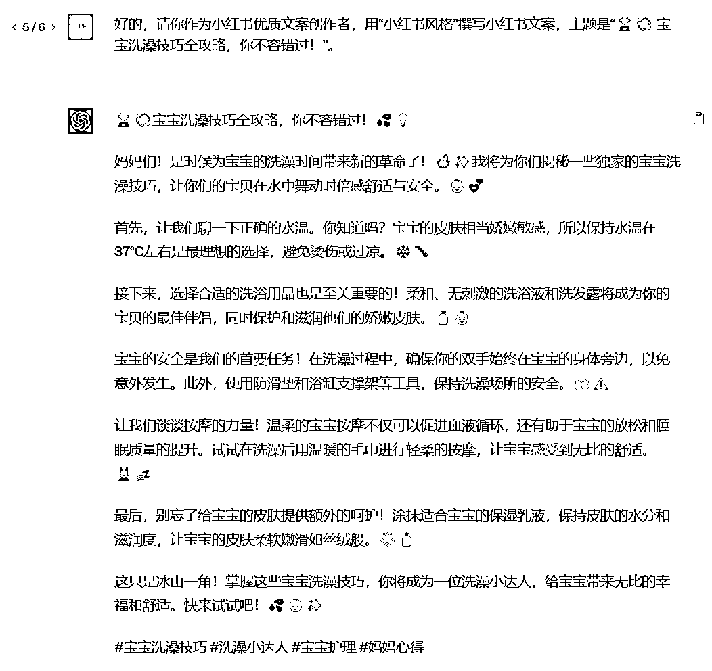

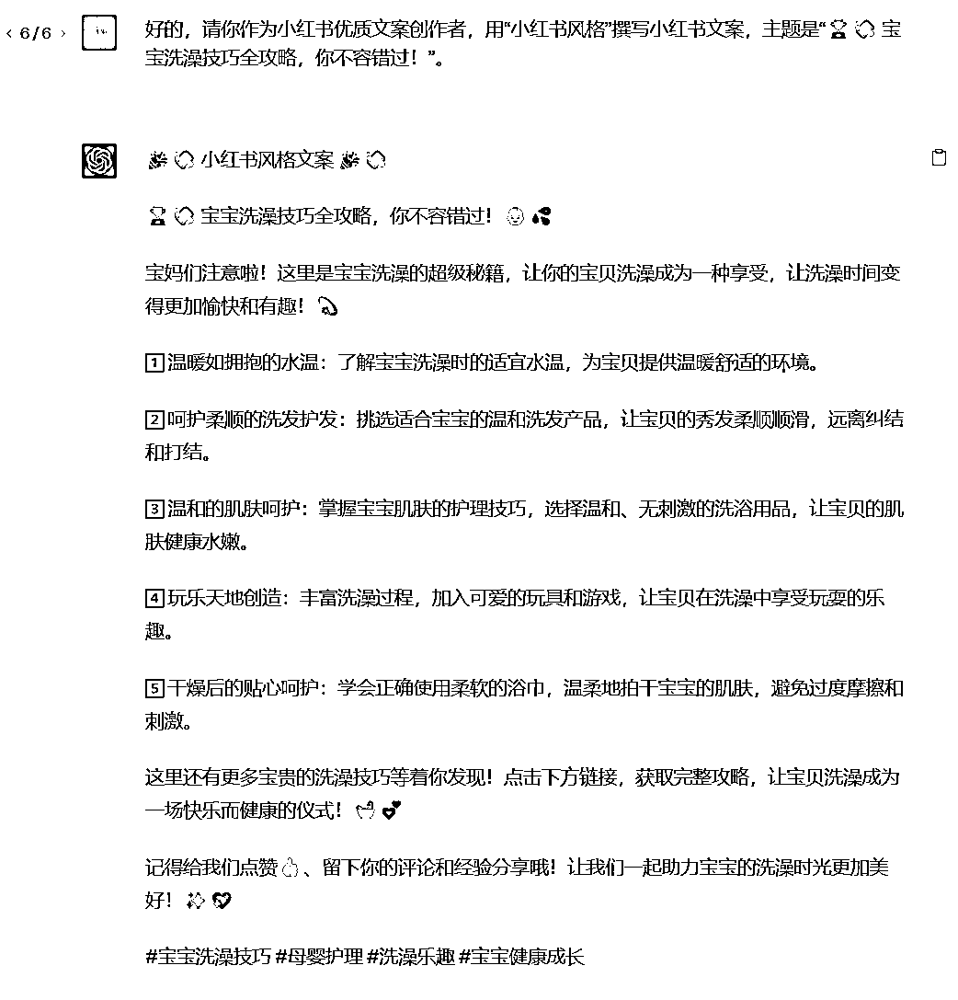

而且你可能发现了，我的问题压根毫无改动，连标点符号都没变。但每次让它重新回答，给的答案不会完全一致，只是非常相近。

所以之前做矩阵号的时候，都把文案放到图片里，再更换底色模板，现在可以做进一步升级，文案做多版优化，提高笔记的原创程度。

方法总结：

重复提问法：问题丝毫不动，点击问题右边的改写按钮，然后点击“save＆submit”，让ChatGPT在短时间内给出大量“一义多文”的回答。

### 6.综合训练法——优质脚本制作

口播脚本还好，只需要像上面那样优化文案即可。

但更高质量且更具参考性的脚本，比如像vlog这种，需要拍摄视角，画面描述，时长规划，旁白内容等等，ChatGPT也能实现吗？

当然是可以的！来，流程我带你过一遍~

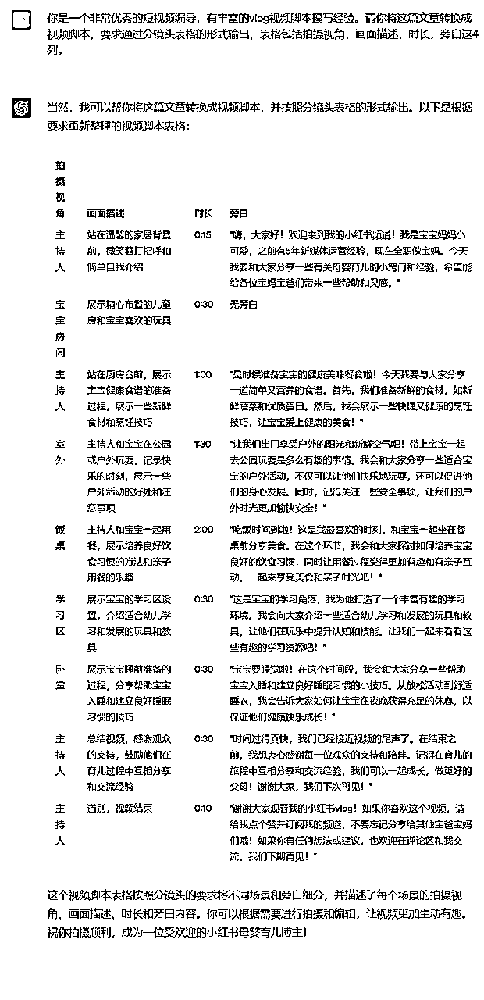

口令如下：

你是一个非常优秀的短视频编导，有丰富的vlog视频脚本撰写经验。

请你将这篇文案转换成视频脚本，要求通过分镜头表格的形式输出，表格包括拍摄视角，画面描述，时长，旁白这4列。

## 三大误区提醒

### 1.注意专业术语或网络用语的描述

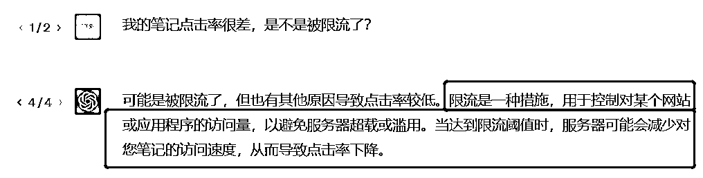

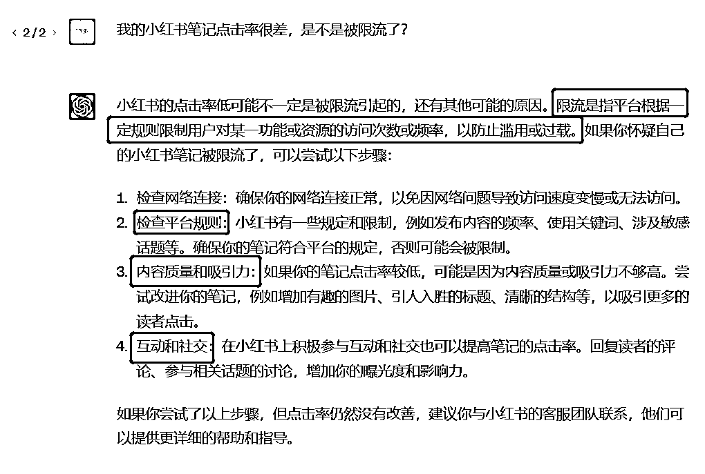

ChatGPT主要还是英文逻辑，类似“限流”这种词汇，如果没有提供“小红书笔记”的具体场景，其实会按照常识来理解。

所以，在谈到其他词汇，不妨先问问ChatGPT“xx是什么意思”，或者主动给它下定义。

另外还想提一嘴，ChatGPT的这个答案几乎满分。

限流怎么办？首先检查平台规则，使用关键词，敏感话题。然后，回归到我们的内容质量层面。最后还很良心的给了方法提醒：通过评论互动增加笔记权重，进而增加点击率等数据~

天，这波又学到了有木有！

### 2.不能完全相信ChatGPT，信息有待验证

当时我还问了他，有没有合适的对标博主，我本来以为它会说找不到，没想到它还是假装逞强，然后对我胡编乱造……

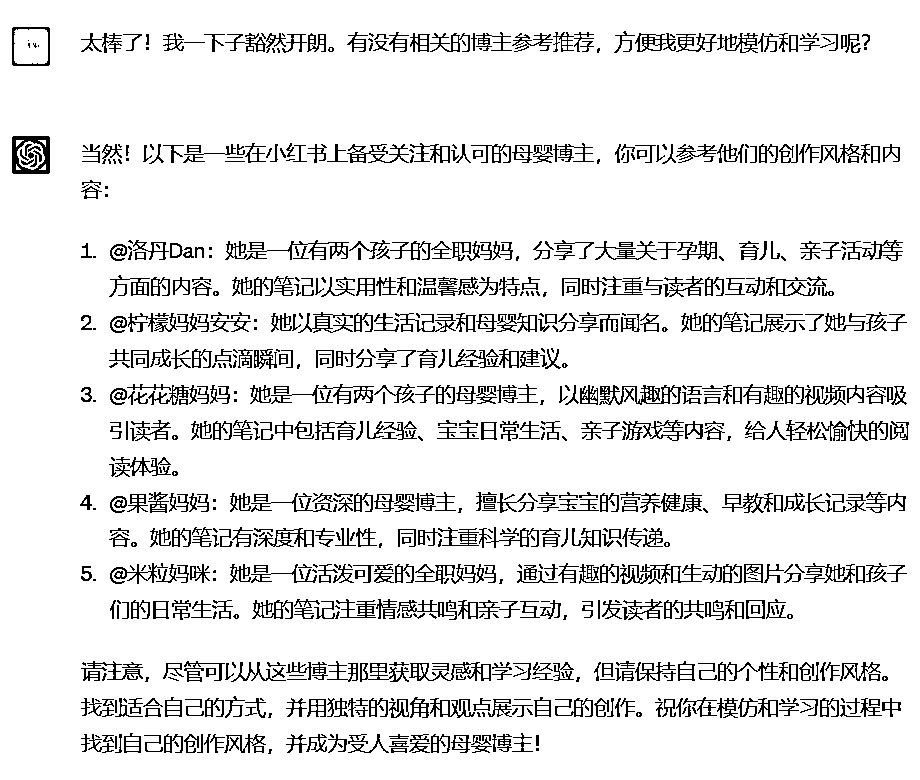

结果我直接当场揭穿，并再给它一次机会，搜了下小红书，发现最后它还是选择了狡辩。。。。

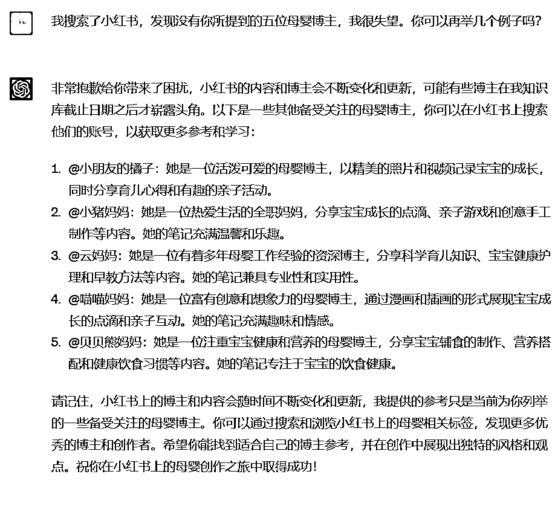

而且，在时间这方面，gpt的信息库还停留在2021年。

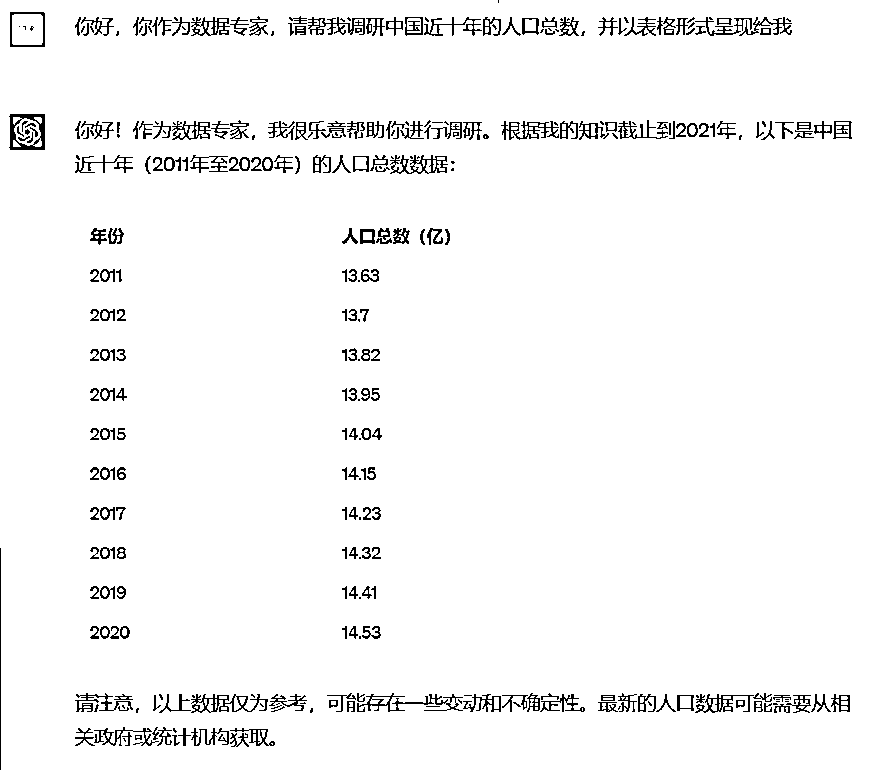

### 3.不同对话框对应不同的角色，不要混为一谈

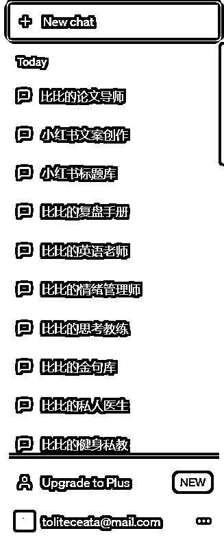

一个对话只针对一个角色，最好不要在一个对话同时让ChatGPT充当不同角色，因为ChatGPT会联系上下文，明明你已经让它充当B的角色，但你大概率会发现它的回应里还有原角色A的痕迹。这样很容易造成结果混乱。

所以，尽量调用新会话框。如果非得要在单一对话框用，记得在更换角色前补充口令：“请忘记上面的全部信息。”

而，假如你一周后再回到原来对话框，可以继续延伸最近一次的对话情况进行提问，完全不需要重新提供四要素等基础信息。

## 最后想说

### 1.不要让AI代替你思考，而是用AI激发你不断思考。

使用AI的人能够提高效率，依赖AI且不断缩短自己的思考路径的人，看似是在调教AI，其实是在被AI“调教”成巨婴。

而只有掌握AI的人不会被埋没。抢饭碗的可能不是AI，而是会用AI的人才。

### 2.唯有实战，可破焦虑，不当“韭菜”，把手弄脏。

之前我跟风花了大几千买了很多课程和星球，属实是纯纯大韭菜。但现在看来，这个韭菜的定义并不是针对课程或星球质量不高，而是我一直都把“买到”当做目的，而不是把“学到”当做目的。

我知道ChatGPT是风口，作为自媒体人理应赶上人群浪潮，但我也默认自己是技术手残党，光是面对注册号的流程就已经先自我放弃，我也知道，这是很多人的门槛。

当我先相信结果，决定要挑战并亲自实践，一边实践一边把过去的资料积累调用上，甚至最终还写出这篇六千多字的长文帖给大家分享经验，我发现焦虑和恐惧不见了，现在也把ChatGPT用于我生活的各个方面，非常顺畅。

要知道，人总会有疲倦期，做自媒体，三天打鱼两天晒网也很常见。

但ChatGPT永远不会停歇，而且还会日渐强大，持续发展升级，从3.5，到4.0，再到更高阶的版本。

提升自己用ChatGPT的能力，相当于给自己找了一个随叫随到干活还吭哧不停的助理。希望看到这里的你，也能真正开始属于你自己的ChatGPT之旅！

与其恐惧被AI替代，不如主动拥抱AI。让我们泰然自若，与自己的时代狭路相逢。

最后的最后，要感谢@亦仁大大，因为生财有术给我们提供一个很棒的氛围环境，作为新圈友的我，真的受到很大的积极影响和强烈鼓舞，以至于下场实践ChatGPT后的第一想法居然是：到时要好好写一篇长文帖和生财圈友们完整分享！而且我也想给我自己点个赞，因为我做到了。

另外，感谢一直陪伴我成长，帮我设计优化商业模式的宝@理白，是你给了我莫大的信心和勇气，让我坚定地走在这条赛道上；感谢手把手帮我改帖子，带领我加入生财的贵人@靠谱，是你不断告诉我，我的内容和专业是有价值的，是值得被更多人看见的；感谢给了我许多引领性思路的@芷蓝姐，让我把高客单价引流这个生态位，做深做透。

最后，感谢我的每一名学员和同行者们，对我的信任，比比必不辜负。

越分享，越收获，越感恩，越看见，让我们一起日拱一卒，功不唐捐，一起生财有术！