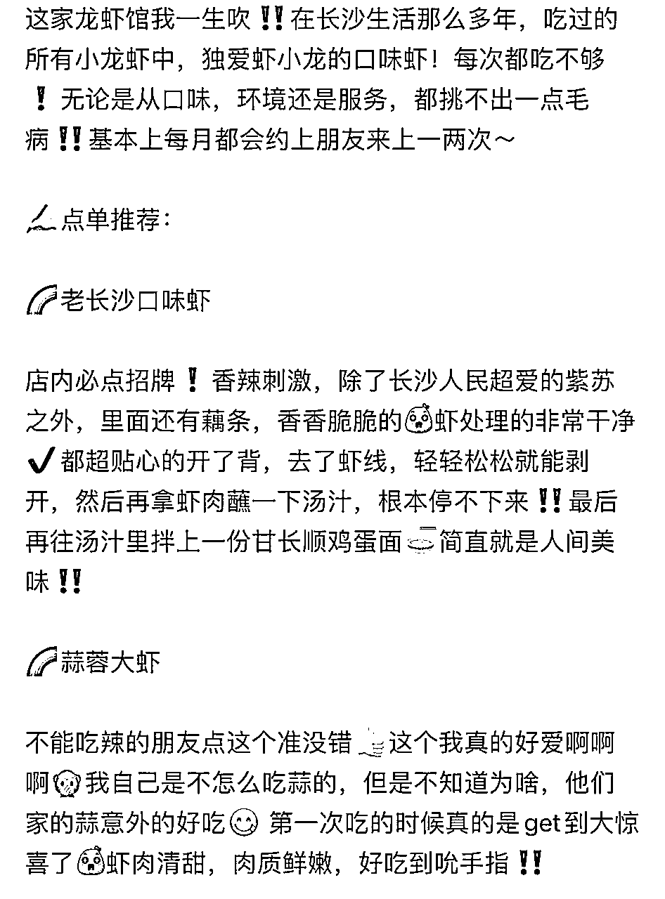

# 小红书探照灯计划是什么？达人如何报名保姆级文档

> 来源：[https://xsej9se9cv.feishu.cn/docx/E994d3QQpovKOOxO7YPc1jGxnXg](https://xsej9se9cv.feishu.cn/docx/E994d3QQpovKOOxO7YPc1jGxnXg)

「任何最好赚钱的机会，都是在平台红利期的时候，而往往这个时候，基本都是在捡钱，随便上个链接就能出单」

因为这个时候，进场的人不多，而且平台要做数据，有流量扶持。

# 十几年前的淘宝，上个链接就能出单。

为什么？

一方面是商家少，另一方面，是淘宝要做数据，平台本身在大量买量，它花1块钱买来的一个流量，你可能在淘宝站内一毛钱就能买到。

而现在呢？

商家越来越多，流量成本越来越高，再进场普通人根本不可能赚到钱。

# 三年前的知乎，随便发个回答，发篇文章就能赚钱。

很多品类根本没人写，你只要写了就是第一。

而且最开始连绑定账号数量都不限制，一个身份证可以绑无数个号，到后来的一个身份证两个号，到现在的一个号。

更别说现在了，普通账号一周只能发两篇插好物文章了，而且发了也没用流量，也没有排名。

现在你让一个小白再进场？别开玩笑了。

# 去年的视频号，半年前的小红书电商也是一样的。

刚开放带货口子，平台要做数据，所以带货的视频会给到流量扶持。

一个小白啥都不懂，从1688，pdd找货源，加价一倍挂到小红书，然后跟着操作去搬封面，混剪视频就能出单。

甚至还可能爆。一条帖子，赚十几二十万都是正常的。

你看现在呢？

是不是入场的人越来越多，就开始卷SOP，卷内容产出效率，卷投放了，慢慢的自然流量会越来越少。

普通人再入场怎么拼得过那些早入场，赚了波快钱，而且再把赚到的钱投入到供应链，内容，以及团队的这帮人呢？

「所以，对于绝大部分人来说，最好的机会往往是追逐风口」

3年前，我一个普普通通的大学生，啥都不懂，莫名撞上了，当时知乎刚推出好物推荐功能，处于红利期。

莫名其妙进了这台电梯，改变了我的人生轨迹，让我坐着电梯上升了几米。

那，那些莫名奇妙踩中淘宝，公众号，抖音，视频号的人呢？

也是一样的道理。

如果小杨哥是2023年才开始做的抖音，你们觉得他还能有现在的影响力吗？

「时来天地皆同力，运去英雄不自由」

天时地利人和，人只是其中影响最微不足道的那个因子罢了。

# 而小红书的本地生活服务，才刚开始内测。

小红书这个平台，2亿月活用户，大部分是18到35岁高质量高消费能力的女性。

本身就是个种草平台，现在的本地生活团单，直接打通了流量到变现的闭环。

小红书今年拿了大量融资，开始大量买量，一方面要做数据好上市。

另一方面，抖音，视频号虎视眈眈都瞄准了美团这个本地生活的万亿市场，小红书不跟上不行。

所以平台会给大量的流量扶持（对比小红书电商的流量扶持）

所以这里面有非常多的赚钱机会，比如：

自己当个达人，帮商家带团单，接广告，赚佣金。

自己是商家，自己学着做内容，带自己的产品。

做服务商，教达人，商家做内容，赚培训钱以及抽点。

# 为什么小红书要做本地生活？

因为，小红书目前营收结构单一，广告收入占比八成。

而本地生活是万亿市场，国内本地生活服务市场渗透率仅为12.7%，且集中在餐饮外卖领域，预计未来5年还能保持20%以上的增速。

所以抖音，视频号在今年也全力在布局这块市场，都在想抢美团这块蛋糕。

而小红书本身，就是一个以图文为核心的种草平台，内容门槛更低，且长尾价值更明显，一篇爆款帖子，往往热度会持续几个月，半年以上。

小红书的基因更像一个本地生活版“淘宝、京东”。

雨花区哪家粉店好吃，岳麓区哪家店适合拍照打卡。

“工具属性”会更加明显一些。

# 目前5月份小红书官方正在内测报名探店博主。

推出了探照灯计划：

针对本地美食探店博主的成长助力计划，官方通过流量扶持，会给第一批博主做流量扶持，“造星”。

这个时候需要打造一批案例，商家案例。

哪些商家通过入驻小红书本地生活，流量涨了多少，客户多了多少，销售额多了多少，从而来吸引更多的商家入驻，完善小红书本地生活生态。

而达人端，更需要“造星”。

为什么？

因为商家本身是没有内容产出能力的，不能指望商家天天拍好看的照片，写非常棒的标题，文案。

所以跟抖音一样，还是需要推一波达人出来，让他们赚到钱，才能有更多的人，愿意进来探店，贡献内容，产生内容闭环。

我下面介绍一下第一期探照灯计划：

【到5.31号截至】报名，并且按要求参加活动，创作本地餐厅探店日记。

【评选期：5.31-6.7】官方综合活动期间的笔记数据、质量，内容契合度以及最重要的POI地址推荐情况，选出第一批有资格的探店达人。

【6.7号后】第一批探店达人，进行流量扶持，成为“造星”计划其中一员，享受政策红利。

官方是这么写的：成为第一代小红书探店顶流。

为什么叫探照灯计划，因为要“造星”，明星都是站在聚光灯下的。

官方都这么提示了，目前距离报名截止时间还有不到十天，赶紧去报名参加。

# 不说废话，直接上步骤（一定要一比一按照官方的要求来做）

怎么申请成为第一批探店达人？

一个号需要发一篇本地探店的帖子，并按照下面的步骤一步一步去做，就行了。

# 1、标题：探照灯计划|XXXXXXX

（建议标题里面带上城市名，方便算法推送精准流量）

# 2、视频笔记不短于30S，图文笔记图片不少于3张

（文案可以多使用语气词，如：我是真没想到、竟然、离谱的是、最绝的一定是、有一说一、揭秘、吹爆、天花板、封神、私藏、快来、我不允许、绝绝子、yyds、还可以这样、宝藏、真香、神器、疯狂、安利、拯救、绝不能错过、惊呆了、家人们、谁懂啊、好用哭了、超好吃、神级、必备、必看、真的不错、没话说）

（要多使用emoji）

（文案，标题其实都可以用chatgpt生成，所以可以批量生成，我小红书的帖子基本都是chatgpt生成的，用好提示词很香3）

（至于封面，最好也要用爆款模板）

# 3、绑定话题#探照灯计划

（建议在绑定当地城市相关的话题，提高算法识别，推精准人群，比如#长沙美食）

# 4、添加店铺地点

# 5、@土拨薯

（注意：不要打成土拨鼠）

# 6、扫码官方二维码报名

（PS：多次提交的话，是按提交的最后一次来算）

活动时间【截至到5.31】

评选时间【5.31~6.7】根据笔记数据（曝光点击，点赞率，POI地址点击率，所以一定一定要带地址），内容契合度（探店写着美食，如果发的是汽修那肯定不行）

第一批“真探团”【6.7之后】长期官方流量扶持，首批探店合作功能开放

执行力强的，这波不要只拿一个号报名吧？多搞几个号，按照我的经验来说：

而且有执行力的人也可以开始，一手引流达人，一手吸引商家，做对接了（我也正在做这个事）

「最开始的权限是最好拿的，越往后，门槛越高」

欢迎链接沟通，abcfjj123

因为，我未来三年的方向就是实体引流，跟我的方向契合，而且又是风口，所以我会切入本地生活服务商这个板块，接下来会持续分享。

实体老板多不多，拍我一下，如果多的话，我下次写篇实体店线上引流的干货

「时来天地皆同力，运去英雄不自由」

下一波像小红书本地生活这样平台性的风口，不知道要等到什么时候了。

新圈友可以看这几个帖子再认识我一下，熟悉下名字，交个朋友。

看完如果有帮助的话，记得点赞支持一下，哈哈。

22岁，毕业半年，我赚了50W

https://mp.weixin.qq.com/s/2Ia-bdYlfRKUXHbhO8aP7g

小白如何快速成长

https://mp.weixin.qq.com/s/ScsBsTeHnbCIBlO0KBZUHw