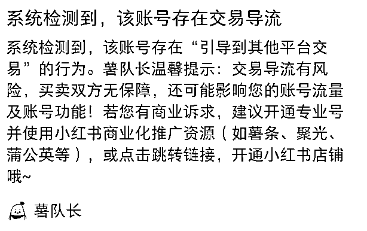
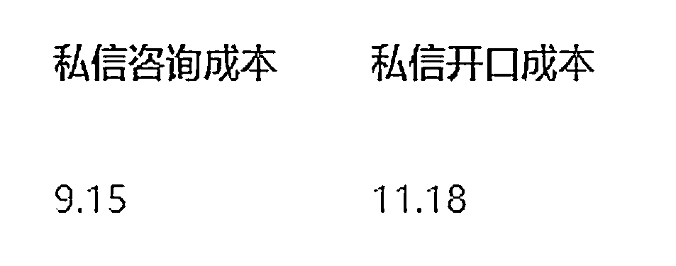
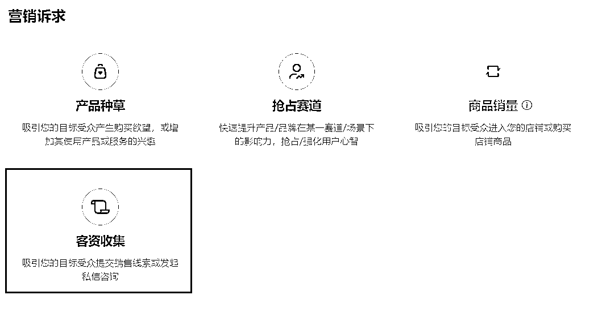

# 如何让你的钱花的有价值？小红书聚光投放实战攻略

> 来源：[https://ht16ej1tui.feishu.cn/docx/EH1xdsKsWov8KYxHCticAU9Wn3d](https://ht16ej1tui.feishu.cn/docx/EH1xdsKsWov8KYxHCticAU9Wn3d)

Hi 大家好，这里是ivy酱，小红书矩阵号玩家。目前有两位数的账号充值了聚光投放，私信单价在10元/个左右，我的同行基本都是30-60元/个私信。如果你也想通过聚光投放，安全+省钱的引流，那么这篇文章会给到你解决方案。

从3月底开始，小红书就狠抓导流到站外交易，有的赛道，甚至连发一个表情，都会出现“导流提醒”。

如图所示，第一次检测到，只是提醒，不影响流量，如果再次被检测，就会限流7天。限流期间，不能认证蓝V（企业号），也不能做投放。小红书聚光的销售，也无法解开限流，只能等处罚结束，因为账号/笔记违规，归社区管，和销售是两个部门。

如果你也收到过这样的提醒，并且仍然需要在小红书引流，那么这篇文章很适合你看，我会分享几种安全+省钱的引流方式。

# 免费的安全引流

在介绍聚光投放之前，先给大家分享几种，不花钱的安全引流方式。

1.  互关拉群：如果用户关注了你，那你也可以关注对方，接着直接拉进群，用小号在群里艾特对方，说微信号。

这个方法我是在拱卒的社群看到的，优点在于，进群率会比，发群邀请要高，但只有40人以下的群，才能操作，所以要不停的关注+拉群+建新群，会稍微有一点麻烦。

如果用户没关注，但想用方法1，也可以给对方说，“宝，guan️①下叭”，然后先关注Ta，再等Ta回关，这样大概率对方会回关你。

1.  小号私聊或者评论区艾特：如果用户没关注你，可以用小号去私聊对方，每号每天可以跟5个人打招呼，也可以用小号发一篇笔记，写微信号，在这篇笔记的评论区，艾特用户，同时大号给用户私信，让Ta去看评论。

1.  大号发群邀请：如果用户没关注你，也可以直接发群邀请，缺点在于，进群率会比较低，加微率也低。

# 付费的省心引流

如果觉得以上免费方法有点麻烦，也可以充值聚光投放，就可以放心大胆的引流了。

开通企业号后，会有小红书销售给你打电话，问你要不要充值聚光，直接在给你打电话的人里面找一个你喜欢的开户充值就可以，这样首充最低5000，如果你找别人推荐的销售，就会需要首充10000。

连续投放三天后，就可以让销售去跟社区沟通，私信开白，这样就可以直接发微信了，文字or图片都可，不会再提醒。

## 2.1 如何算清楚投放的账

要引流到私域成交的老板们，可能都会有这样的疑问：

怎么判断自己投放花出去的钱值不值？ROI怎么算？要不要继续投？

我给大家分享两种算法，判断你的投放值不值。

第一种，我们按投产比来算。

在聚光投放后台，你可以看到单个私信的价格。

假设小明投放的私信价格是10元/个；

那么投放1000元，就可以获得100个私信；

按加微率40%算，就会有40人加到微信；

再算上小明的成交率，假设是10%，那么就会有4人成交；

假设客单价是3000元，4人成交额为12000元，那么ROI=1000：12000=1:12

算是一个比较不错的ROI，可以继续投放。

第二种，按单流量价格算。

前面部分还是按1000元可以换取40人加微信算，那么每个加微的价格是25元。

假设小明的微信，每当有10人加过来，就可以成交1人，成交额3000元；

那么每个加微的价值就是3000/10=300元。

25/个买入流量，带来300的价值，ROI=25：300=1:12

算是一个比较不错的ROI，可以继续投放。

算清楚账啦，我们就来看看到底怎么做投放~

## 2.2 聚光投放实操

投放可以选择找小红书官方配的运营，来给建议，也可以自己摸索。

如果你要找官方运营，一定要守死自己的价格底线！

### 2.2.1 投放价格控制

价格分为两部分：

#### 私信咨询价格，可以自己设置

这个出价，可以根据前面算ROI的过程，反推出一个自己能接受的价格区间。

我个人建议可以设置20-30元/个私信。

有些运营会建议你设置50元/个，如果你觉得太贵了接受不了，也可以直接拒绝，最终价格设置多少是由你自己决定的。

#### 每日投放预算

一般官方运营会建议你用3-5个笔记，同时投放3-5个计划，先跑一周，每个计划每日低消是100，这样算下来就是100×3×7=2100，一周烧掉2100。

运营可能还会跟你说，计划好不容易跑起来就不建议暂停，不然影响投放效果，一天两天的看不出效果，建议跑长期来看看，单个账号这么烧钱实在有点吓人，所以我给大家分享下省钱版玩法。

开始投放前可以先确定3-5篇笔记，用于投放，具体笔记怎么选择，可以看下文。

每篇笔记新建一个投放计划，每个计划可以设置不同的投放时间。

比如：

笔记1，计划1，投放时间为周一

笔记2，计划2，投放时间为周二

笔记3，计划3，投放时间为周三

...

以此类推，也可以同一个计划，配置3篇笔记，同时跑，每日预算100。

这样赛马机制的跑一周，总消费500-700元，你就可以很明显的看出，某个计划/笔记投放的效果，要远远优于其他的计划/笔记，接下来就反复投放数据好的就可以了。

### 2.2.2 投放笔记选择

#### 分析同行笔记，提取共性

付费流量和免费流量的底层逻辑是非常不一样的，免费流量不需要考虑ROI，发一些免费领资料的也可以，就算这些人来了很难转化，但是能帮你把账号粉丝/权重做上去，也是值得的。

但如果要投放，就一定要考虑，怎样的笔记，才能带来买单人，精准更重要。

所以当你在选择投放笔记的时候，要做的第一件事！就是看同行！

同行花钱持续在投哪些笔记，就说明这些笔记之间存在，可以带来买单人的共性。他们已经在花钱投票了。

可以拿出一天时间专门刷你这个赛道的笔记，重点观察并用excel记录，同行投放的笔记（右下角有“赞助”两个字）。

记录好之后，开始分析，寻找共性。

比如这些笔记，都是什么主题？标题有什么特点？封面有什么共性元素？

提取出来之后，再加到你的投放笔记里面。

可以把之前本来就自然流不错的笔记，根据你提取的同行投放共性改改，再去投放，也可以重新写笔记。

我个人比较建议在之前的笔记上修改了再去投。

在观察同行的时候，有一个比较重要的点是，寻找异常值，并提取背后规律。

你可能会发现，同样的选题，但是有的笔记爆，有的笔记却不爆。

知道怎么做是正确的，很重要；但知道怎么做不正确，也同样重要，这样我们就可以避开错误做法。

同时，如果一个账号，大部分笔记数据都很差，但有一篇数据很好，这也是异常值，值得分析，为什么那篇数据会好，然后模仿。

#### 分析自己的笔记

分析完同行的笔记后，可以再分析一下自己的笔记。

比如哪些笔记曾经带来过比较多的买单人，那就可以尝试投放。

#### 分析投放数据，并复盘迭代

聚光后台可以看到每天的投放数据，我比较关注的主要是，每日消费，点击价格，点击率，评论，私信价格和私信开口价格。

可以建一个专门的excel表格，记录每个账号的账密，以及每天的投放笔记和投放数据。

刚开始投的时候，我一般会根据昨日的投放效果，来决定当日的投放笔记和金额。跑1-2周后，基本上可以摸清规律，即什么样的笔记配什么样的计划，可以跑出符合预期的效果，设置好计划就重复就行了，比较省事。

## 2.3 聚光投放的坑

1.  如果你的目标是导流私域，那么千万不要选择产品种草，不然会买到很多并没有用的点赞和收藏，直接选客资收集就行。

1.  推广目标建议选择【私信开口量】，如果选择【私信咨询量】，私信开口就会贵一些。

## 2.4 其他细节问题

1.  当你开始投放，会有3种情况发生：

第一种是，钱能符合预期地花出去，比如每天消耗100元，买10个私信，那就让广告正常跑即可，每月消耗3000元左右，ROI是正的，就不亏。

第二种是，钱花出去了，但不符合预期，比如当日消耗100元，买到了100个点击，但是没有任何人私信，等于说钱直接白花了，这种情况就是不太正常的。

出现这种情况，我猜是因为，付费流量，推送的人群不精准，再往前推，可能是笔记问题，可能是算法问题，也可能是计划设置的问题，我个人觉得比较难以解决，所以我的解决方案就是这个笔记和计划，直接不要了，停止投放。

【再吐槽一下，我觉得付费流的人群推送，没有自然流的精准。同一篇笔记，付费流的点击率和互动率，都会远低于自然流的数据。希望小红书投放算法未来可以解决这个问题。】

第三种是，钱花不出去，投放效果也差。比如有些计划/笔记会跑不动，每日消费设置100元，但是花了10-30元就停止消费了，已经消耗的那部分钱也基本上无法带来私信。

关于这种情况，小红书官方运营给到我的解释是，因为出价不够高，所以系统不愿意推，解决方案就是加钱。

如果你想变成第一种情况，可以尝试下，重新建计划，提高出价。

1.  关于停止投放对流量的影响

当你在投放的时候，不会影响自然流，这两者是分开的。如果你停止投放，刚开始一两天可能系统会需要反应时间，自然流会受到影响，但过几天以后，自然流又会恢复正常。

1.  如果你的账号曾经因为引流而被限流，等过了处罚期，就可以投放了，后续流量会变得正常，也不会再处罚。

但如果账号的首页推荐，已经是0，也就是说这个账号多次违规，已经被社区关小黑屋了，这样的情况，就算想花钱，也是没法投放的，建议换账号。

如果账号曾经有违规，充值之前可以让销售帮你问一下社区，是否能投放。

1.  充值后，如果钱花不完，是可以退的，需要写邮件给小红书官方邮箱，正常退款时间是一周左右。

以上就是我最近投放聚光，总结的一些经验分享。欢迎其他在做投放的老板和我交流。