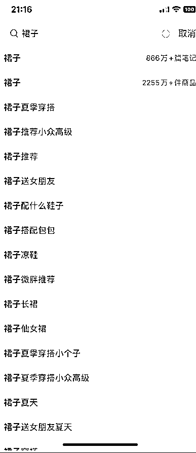
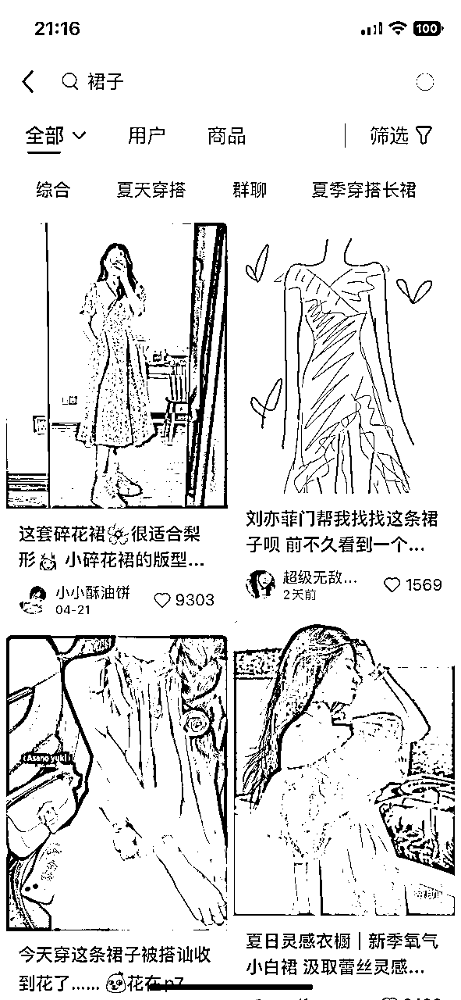
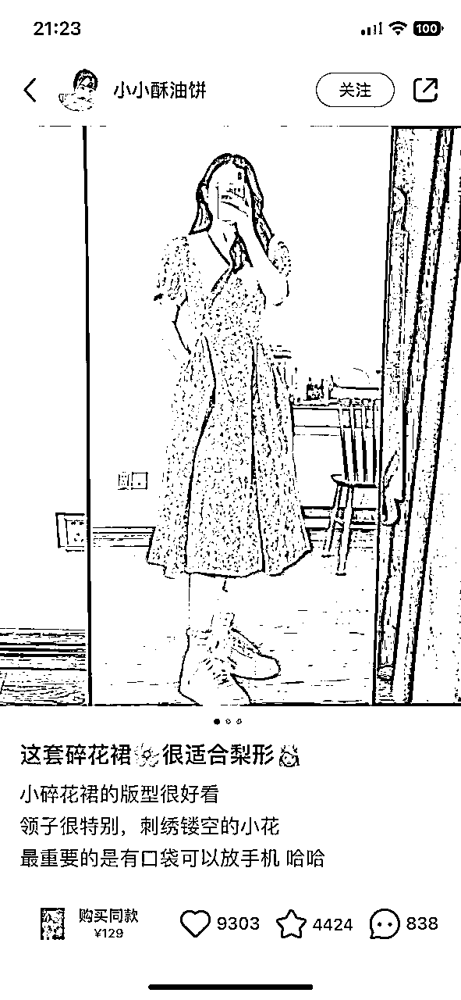
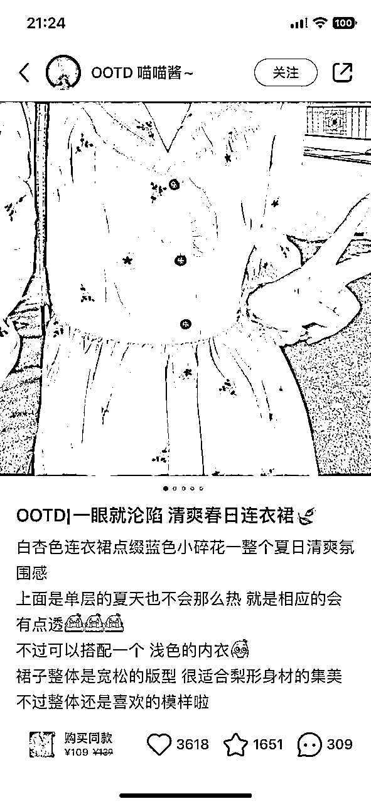

# 做一道填空题写出爆款小红书电商文案

> 来源：[https://go6xq64elg.feishu.cn/docx/EQv0d3JpRobdnWxjrHBccTnFn1c](https://go6xq64elg.feishu.cn/docx/EQv0d3JpRobdnWxjrHBccTnFn1c)

大家好，我是曜文

小红书作为一个种草基因的内容平台，对于内容文案的质量比其他平台要求是稍微要高的，但是我们在实操的过程中发现，很多人做小红书电商根本不注重文案标题导致自己的内容数据平平

而且有接触小红书电商的应该都知道目前基本所有的成交都来自于笔记流量。

那么如何写好吸睛的标题文案成为了很多小红书电商从业者的难题

目前我发现大家的痛点就是不知道怎么写小红书标题文案只知道复制粘贴

所以笔记的数据一直提升不上来

今天我就手把手带你学会3分钟写出爆款的小红书电商文案

首先，我先把步骤给大家理清楚，便于整体内容的阅读和思路的清晰

一、定位账号内容

二、搜集热门关键词

三、搜集爆款笔记

四、创作输出

# 一、定位账号内容

什么意思呢？

意思就是你的账号需要定位一个标签，比如你做连衣裙，那么你可以定位微胖人群穿的连衣裙，这样系统给你的内容推送给用户会更精准，那么转化率也会更好，当然也影响着我们笔记的基础播放。

值得注意的是，我们需要在热门类目里面挑选出热门的细分人群关键词这样需求才会足够大，才不会导致后续的操作你根本找不到素材。

同理，你还可以根据自己的产品找到，场景、人群、功效、亮点、等等一些系列的关键词来定位自己账号后续输出的内容。

当然，小红书本身就有热门下拉词和热门词

例如，你搜索裙子，它的搜索栏会出现很多关于裙子的热门下拉词，点击裙子进去，也会出现关于裙子的热门词。

# 二、搜集热门关键词

从上面的图片中我们可以得知

裙子夏季穿搭、裙子推荐小众高级、裙子微胖推荐...等等这些词是用户近期搜索比较多的关键词

然后我们需要做的是把这些下拉词记录起来和热门的关键词记录起来方便下一步的操作

（当然，这个步骤和你账号的浏览有关系，我们需要在第一步的时候就可以定位自己要做的人群属性然后去把这些词都给搜集起来，可以通过这个步骤建立自己的素材库方便后续文案输出的时候随时都可调用）

# 三、搜集爆款笔记

什么是爆款笔记呢？

可以从2个维度判断

1.赞藏是否1000+

2.评论区是否很多求购

如果符合就可以判断为是爆款笔记然后搜集爆款笔记的标题和文案

比如：

然后搜集后需要去了解爆款文案中博主想要表达的意思也就是他在是怎么描述这个产品的他的内容结构是怎么样的，思考，是不是可以结合自己所选的款式来优化。

例如：

P1：讲的是梨形身材适合穿的裙子，内容描述亮点

P2：讲的是男朋友都夸的裙子，热点关键词，内容描述亮点穿搭场景

P3：讲的是互动的内容，主打一个亲身体验代入感

P4：讲的是产品种草结合热门关键词

....

这里可以增加一个思路，有一些标题内容都没几个字但是评论区求购又很多的怎么办，你可以参考他的款式去选款，或者分析他是不是大博主，自带流量，如果是自带流量的博主可不文案内容参考。

搜集好之后，我们就可以进入到下一步

# 四、创作输出

还是那上面的几个标题举例

P1：这套碎花裙很适合梨形

P2：男朋友说好喜欢好喜欢这条裙子

P3：姐妹们 这条裙子留不留啊!!好纠结!!

P4：OOTDI一眼就沦陷清爽春日连衣裙

然后把他做成一个填空题

例如：这套碎花裙很适合梨形

这套（xxx）很适合（xxxx）+热门词

得出：

这套连衣裙真的很适合微胖女生穿上好显瘦

那么，可以思考这些空格里面的词就可以任意转换成你做的垂直类目的产品，风格，从而产出更多的爆款标题。

只要爆款素材足够多，你只要根据你的产提取出关键词那么就可以轻松写出超多的爆款标题出来。

再来

例如：

男朋友说好喜欢好喜欢这条裙子

（xxx）说好喜欢（xxxxx）这条（xxxx）

....下面标题就由大家发挥想象吧

然后是内容根据上诉所讲的思路

P1：小碎花裙的版型很好看领子很特别

刺绣镂空的小花最重要的是有口袋可以放手机 哈哈

例如：

（产品）的版型很好看（细节描述）很特别

（亮点）+关键词+口语化

得出：淘了好久的粉色连衣裙真的好好看裙子褶皱感很特别

夏天就应该穿粉粉的裙子搭各种鞋子特别的仙

很多连衣裙都没口袋这件有个大大的隐藏口袋可以放手机

P2：男朋友一直夸我穿这条裙子好温柔好好看好爱这条裙子

好温柔好显白~连衣裙才是夏天的味道长裙太有松弛感了~

颜色好粉嫩春夏都可以穿~太适合约会穿搭

度假旅行穿搭~bi备啊

例如：

（xxx）夸我穿这条裙子（xxxx）好爱这条裙子

（xxxx）才是夏天的味道（xxxx）太有（xxxx）

颜色（xxx）太适合（xxxx）

（xxxxx）穿搭~bi备啊

ok，这道题你来做吧

看到这里，是不是觉得标题文案没那么难了，几分钟就可以写出好几条了

当然，此操作要多练习多熟悉小红书爆款标题和文案操作时间久了

看到某个产品就能直接在脑海中联想出标题和文案

比直接复制粘贴标题文案能得到更大的提升

而且你还会成为小红书文案高手