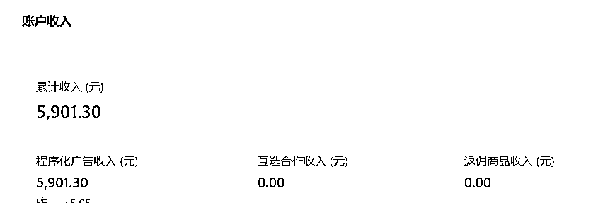
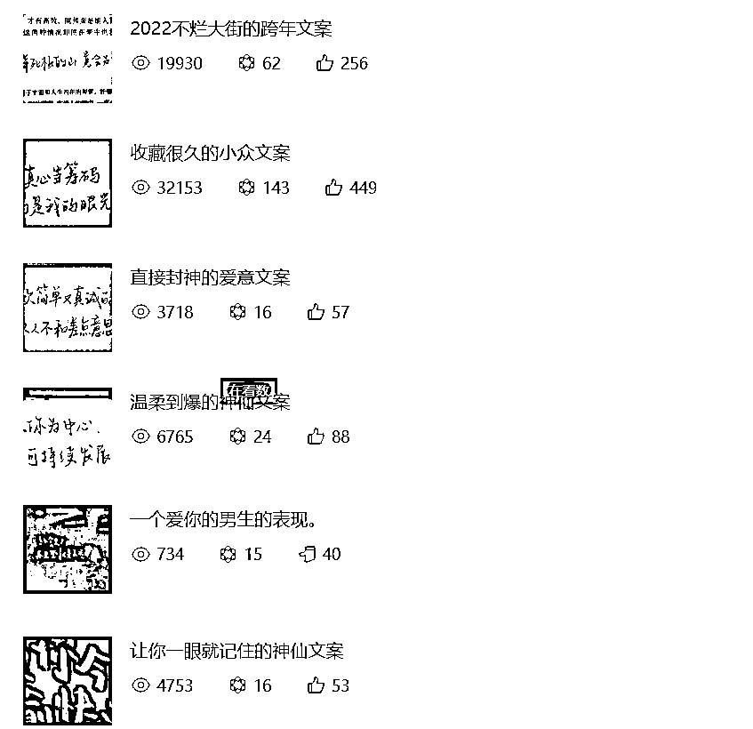
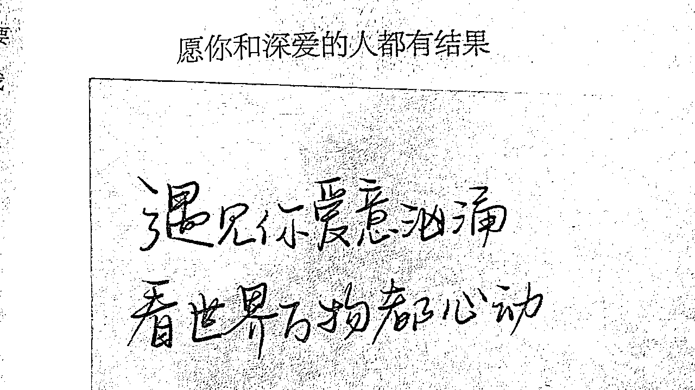
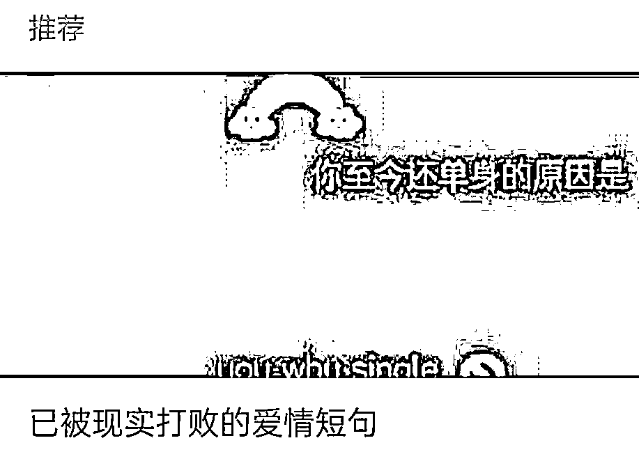
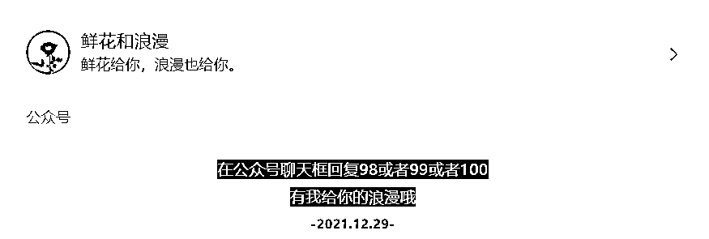
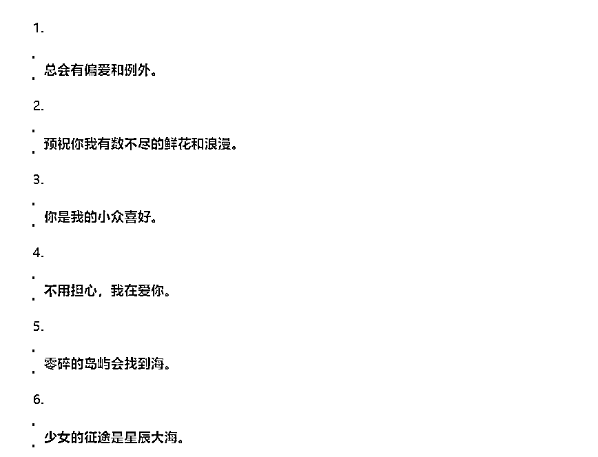

# 0 付费，每天复制粘贴5分钟，公众号涨粉3.7w+，变现5w+。

> 来源：[https://kyjhe9yxvm.feishu.cn/docx/Ecr6dapIPoqmF2xtF7GcISGOnSh](https://kyjhe9yxvm.feishu.cn/docx/Ecr6dapIPoqmF2xtF7GcISGOnSh)

先看数据。

流量主收益：

部分阅读量：

我是见川，公众号领域累积粉丝20w+。

这是我在做公众号过程中机缘巧合下做的一个文案类型公众号。起因是一个以前没怎么用的公众号，我想着放着也是放着，就想做一个文案号当做乐趣。当时是0粉丝，没想到几天后我发现阅读量破千了，接连几天都是这样。

于是我意识到这可能是个机会，于是我优化了一下图片标题排版等内容。很快便做出来一个均阅3000+，最高10w+的公众号，后来我利用这套逻辑，接连测试了几个小号，都达到了0粉丝阅读破千。

由于公众号注册的内容市面上已经很多了，在这里我就不赘述了。这份手册我将讲述从0-1如何搭建起一个文案公众号，每天5分钟，也可以变现。

##### 一、公众号名字

建议：有辨识度，非大众化，贴近人设，比如：鲜花和浪漫、我把浪漫给你等等。

不要名字和内容不符，比如名字是兼职副业相关发文案类文章，驴唇不对马嘴

注意：普通一点的名字就是xx文案馆，比如清风文案馆，但是我个人不建议，因为不利于IP打造。

##### 二、头像

和文章风格（治愈、浪漫或其他）相符，最好是治愈一点的动漫头像，有辨识度，给人的感官上很舒服。

注意：可以是小红书搜索动漫头像，浪漫头像，治愈头像，找到之后用微信小程序去水印，最后头像做一下镜像，翻转处理，这样哪怕撞了也不完全相同，在小红书找头像的时候可以大概翻下评论，了解一下目标人群。

##### 三、公众号介绍

简单、高级感，一句话表现出你的与众不同，比如：鲜花给你，浪漫也给你

（找到对标账号，去百度搜他的文案出处，这样就可以获得很多类似的文案）

##### 四、公众号类型

订阅号，最好是以前不用的公众号，注册时间长的，有留言功能更好，这样后期方便互动以及权重更高。

##### 五、文案来源

1、文案网

https://www.wenanwang.com/

使用的时候最好是多篇综合

2、知乎（推荐）

首页推荐下滑，自然翻到高赞文案

搜索框搜“文案”或者你想要的文案类型，选取高赞文案

注意：可以多个回答的文案组合

3、微博文案博主

4、同类型公众号

5、文案风格

最好是积极、正能量，全网也都在弘扬正能量，给青少年更好的环境，比如治愈、温柔、浪漫等，风格可以多样，但是不要反三观也不要涉及娱乐政治等敏感话题。

也可以根据用户群体以及文章数据去调整。

注意：不要开原创，如果你辛苦弄好了文案，发布时显示已经有人开了原创，直接举报即可，百分百成功，因为大家都是摘抄，你开原创就是给其他人制造麻烦。

##### 六、图片（封面）

我们要明确我们的用户群体多为初中生和高中生，他们的心里活动大多是与爱情相关，以前的文案公众号图片多为忧郁风的伤感风景类图片，但是随着大家审美的提高，我们要想他们为什么保存图片，无非就是觉得高级感十足，需要用来发朋友圈，根据推荐算法，图片的重要性就更加重要。

1、要求

图片清晰，最好是高清。

不要是以前的陈旧的风景图片，最好是上面有字体，看着有高级感。

2、图片来源

不用刻意保存，刷微博、抖音时觉得好看保存即可，如果有水印截取就可以。图片软件：堆糖、搜图神器等。最好的方式：微博搜索关键字 "文字背景图"。

3、底层逻辑

我们在订阅号的时候，会发现多了一个推荐栏目，他会根据我们的喜好，读文章的习惯推荐博主或者新的公众号，当我们打开之后发现，它可能阅读量并不高，但是依旧推荐给了我们。

这就是我们要关注的点，这是类似抖音的算法机制，以前是粉丝越多阅读量越多，很多有亮点的公众号即使优秀也不能展现，而这个推荐机制就给我们带来了新的机遇。

它会把我们的文章推荐给一部分人，如果看得人多，就会推荐给更多的人，这就是所谓的权重，那么如何衡量权重呢？

就是一篇文章能展现出来的数据：点赞数量、在看数量、收藏数量、转发数量，浏览时长，是否保存了图片等。

还有一个重要的点就是推荐给这群人的打开点击率。它是一个相辅相成的模式，可以这样思考。我有十个粉丝，微信推荐给了一部分人，一百人有九十人打开，这是一部分权重，打开的人保存了图片，浏览了所有文字，有的人点赞，有的人收藏等，这都增加了权重。

如果你的粉丝足够多当然点赞、在看、收藏等就是主要的权重，但是如果你的粉丝为0呢。

那需要关注一个权重点就是把你推荐给一部分人就显得尤为重要。

这就是推荐页面，一个很简单的逻辑，你能看到的只有两个信息，封面和标题，标题是说明内容类型，你确实需要可能就打开了，但是更多的人呢？

他们关注的是图片封面，我想保存好看的封面，当然图中的并不是很好，所以我看到的时候并不想打开，这就是前面强调为什么封面图片十分重要，你要给人打开的欲望，不然同类型公众号那么多为什么要点卡这个为什么要关注你，所以图片在我看来就是权重的前提条件。

权重还有一个点就是公众号的注册时间，如果你是很早注册的会更好，不是也问题不大。

还有一个点就是账号活跃度，就是用户点击菜单次数、在后台发消息的次数，这些都影响权重。互动的人多才说明你的号比较受欢迎。

那么我们如何增加用户在后台的互动呢？

可以设置关键字语音回复，男生和女生的声音都可以，同时也是在塑造人设，你的声音好听和你说的文案会吸引他们，他们会很有好感。

文字语音的话可以设置关键字的时候有互动感，或者像小故事一样。

但是不要一次性把你手里所有的语音都放出来，神秘感都没有了，谁还愿意去听以前听过的，建议每次三条语音正适应。

用户在后台互动了我们看到要回复，增加用户粘性也提高活跃度，还可以引导添加微信。

这只是其中一种方式。

4、排版

排版一定要干净，字体合适。

我自己用的是：微软雅黑，14字体，字间距1，行间距1.75

有自己的特点，而且每天发的风格最好是统一。

5、发文时间

11:00、20:00等都可以，但是不要断更，发文时间要固定。

##### 七、标题

a、可以参考同行（如何寻找同行，在微信搜一搜寻找文案两个字会出现公众号）

b、在知乎寻找

c、微博寻找

d、抖音寻找

注意：标题找到了最好是二次原创，所谓二次原创，你可以在标题的基础上添加词语，替换同义词等。

关于不同平台的选择：

知乎可以找文案，但是微博更适合找图片，微博很多博主的图片质量很高，我建议关注几个博主，主要是情感博主，还有图片摄影博主，当你日常刷微博的时候，官方推荐你关注同类型的都关注。

其实也不必刻意去刷，我们平时有个习惯是看到自己喜欢的会主动收藏，图片也一样，看到有感觉的就下载下来，平时的积累是要比临时去找更友好。

很浅显的一个道理，你的审美能支撑起图片质量，那其他人看了也会大概率喜欢。

文案号目前相对来说无风险也可以放大，首先是“文案”的微信指数高达以亿为单位，且公众号的推荐算法不断升级。如果不通过外站引流，只要通过坚持发推文也是可以达到最终的目的。

##### 八、引流以及其他拓展

文案号的前身是分享文案，目前来说可以进阶到IP人设。主要以树洞为主，用户黏性也很高。

就我个人号而言，粉丝年龄分布比较杂，各个年龄段都有，有利有弊，好的在于成年人消费能力更高，不好的在于18-25用户不是特别多，未成年人有初中以及即将步入大学，这些是长期可发展的粉丝群体，所以对于粉丝群体不能说好也不能说坏。

从树洞转化成个人IP也十分合适。

外部引流建议：

如果你没有时间去细致研究引流的操作，只是想每天复制粘贴那就每天坚持发文就可以了，如果你想通过外部途径更快的涨粉。

我建议你可以通过以下方式：

引流的方式都要重点关注一个动作：看对标。引流的方式并非是一成不变的，要紧跟热点，与时俱进。

知乎：回答文案。

视频号、抖音：抖音可以发布文案图集、视频号可以发聊天截图等等。

微博：名字尽量与公众号同名，内容可以同步每天的部分文案内容。

##### 九、变现

1、流量主

2、壁纸头像小程序（我的小程序积累用户6000+）、匿名短信等。

3、文创周边

4、塔罗+微商模式变现

5、广告收益

6、朋友圈营销变现：由于树洞的黏性比较高，我也会在朋友圈分享分销小项目或者向其他微信引流。

##### 十、扩大收益

1、如果你有闲置的公众号或者朋友有不用的可以拿来每天复制粘贴发布，可以做矩阵账号。可以搭配公众号引流相关的玩法扩大化。

2、类比文案号，表情包号、头像号也都可以去尝试。

持续更新.......