# 小红书5个月做到10000个精准粉，变现20万秘籍分享（看懂价值百万）

> 来源：[https://bd5shvz1qn.feishu.cn/docx/EoiedT1iZozZvOxArLBcbCIpnBg](https://bd5shvz1qn.feishu.cn/docx/EoiedT1iZozZvOxArLBcbCIpnBg)

大家好，我是舒丽。是新加入的生财圈友。

应生财鱼丸老师邀请，给大家分享一下我小红书5个月万粉，变现20万的经验。

如果你是一个知识IP，想在小红书开拓流量，快速吸引精准粉丝，引流变现，这个帖子应该可以给到你帮助。

我是从2022年3月份开始着手做小红书的，算是开始得比较晚的。

我做小红书的目的很明确，一方面是想分享自己这些年写作经验和心得，梳理下写作历程；

另一方面现在写作班招生越来越困难，需要从各个自媒体平台，吸引一些精准粉丝到私域转化。

所以，我一开始给自己的定位就是写作博主，我不是冲着广告变现去的，所以这个定位也决定了广告商很难来找我。

你在做账号定位时，要根据自己的变现目标来，一开始就要想好你要靠什么变现，变现路径怎么设定。

没有变现能力的账号做起来，可能动力也会不足。

那具体怎么定位呢，今天这篇文章不做过多讲解，因为比较复杂，要针对个人情况具体分析。如果你有这方面需求，可以私下问我。

那我今天这篇文章主要分享我如何快速用5个月时间吸引10000个精准粉丝，变现20万的秘籍。适合所有知识IP参考。

记住，做小红薯粉丝不在于有多少，而在于你有多少精准粉丝，因为只有精准粉丝，才有高变现价值。

我认识的好几个几万粉的博主，却没什么变现能力，那这个账号就属于低变现价值的账号。

打造高变现价值的账号关键在于，你的内容输出体系要足够精准戳中受众群体的痛点，最好每一篇笔记都能吸引粉丝买单。

成年人的时间成本是最宝贵的，一定要花最少的时间，获取最大的收益。不做无用功。

我的账号第一篇笔记就变现了，吸引了一个学员报名了我的读书营和我的年度私教，变现9800元。

接下来，详细拆解我的爆款笔记变现逻辑，看懂价值百万！

## 一、爆款收藏型笔记，是涨粉的关键

不得不说，小红书长尾效应真的很强，很多时候，1天没登陆，粉丝就会涨99+。

只要出了几篇爆款，数据就一直在涨，熬过了启动期，稳定下来就完全不会担心数据了。

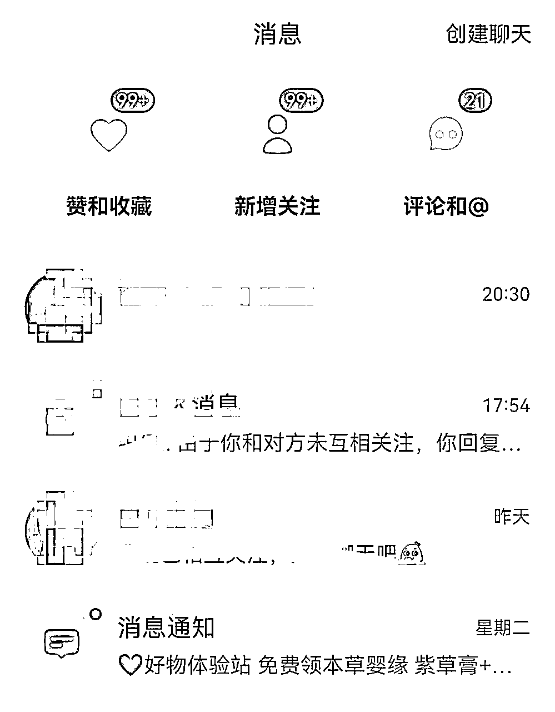

只要持续稳定更新干货内容，粉丝就会稳定增长。

从3月份启动小红书，我更新了58篇笔记，因为时间有限，大概两三天更新一篇但不会轻易断更。所以，粉丝增长还算稳定。

前期涨粉比较慢，我用了前2个月才做到2000粉。后面2个月就涨了6000粉。有2篇大爆款笔记单篇涨粉1000+。

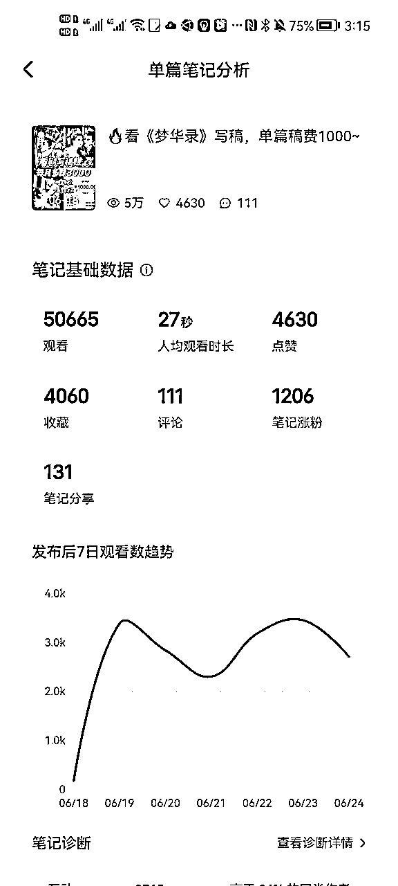

这2篇大爆款是我首创的爆款，之前在小红书上没人发布过类似选题。

所以，爆款是涨粉关键。

自从我这篇爆款笔记发出以后，很多博主都在借鉴我这个选题。但只能被借鉴，不能被超越，数据都远远不如我。

就像当初我写的一篇单篇阅读量过亿的爆款文章《为什么越内向的人越厉害》发出以后，也有很多人借鉴选题，但都没有成为刷屏级爆文。

这是为什么呢？

因为你虽然可以借鉴爆款选题，但是里面的很多内容布局，包括每句话、文字基础、价值精髓等等，你很难真正借鉴到。

这也是为什么很多人写一样的选题，但是别人写出了爆款，你却无人问津。

和大家具体拆解下我的2篇爆款怎么创作出来的。

先看第一篇爆款：INFP者，是天生写作的料

我是一个INFP者，作为才储主编，也在写相关的书籍，我对这个人格类型再熟悉不过了，而这个人格类型在小红书上有很多，我把它与写作相结合，来分析这个人格类型具体为什么适合写作。

就有很多这个人格类型的人对号入座，再看看博主也就是我本人就是一个INFP者，我的人设价值更丰满了。

后来，确实很多学员都是INFP来加我了，跟我学习写作，报名了读书营和写作营，还有6个人成为了我的私教学员，因为我们是同类人，很容易惺惺相惜。

也就是说，这篇笔记给我变现了将近8万元，是不是很香？

再看下第二篇爆款，看剧写稿，每月多赚3000，这是我的小红书第8篇笔记。

为什么有这样的创作灵感？别忘了我是公众号爆文作者出身，写过200多篇10W+爆文，其中有一半的爆文都和热点有关，更善于从电视剧中挖掘选题成文。

曾经我看《流金岁月》这部电视剧，做出了45个选题，那我做小红书，简直就是降维打击了。

我抓住了大多数宝妈群体的痛点，喜欢看剧，那一边看剧一边写稿赚钱，不就是他们的刚需吗？多爽啊！

于是，我就做出了这个选题，看剧写稿，这是一个场景描述，还放了一个电视机的图片，更形象化。

并且给出了可视化的数据结果，每月多赚3000.这是非常一个实际的效果，能看出来我是一个很实在的博主，不虚夸。不会动不动写月入过万。

对于大部分宝妈来说，每个月赚个3000元也很满足了。给了一个可实现的门槛。

果然，这篇笔记发出去，很快爆了，评论区200多个求带，一篇笔记引流了200多人来到了私域，最后转化了一半以上报名了我们的写作课程。

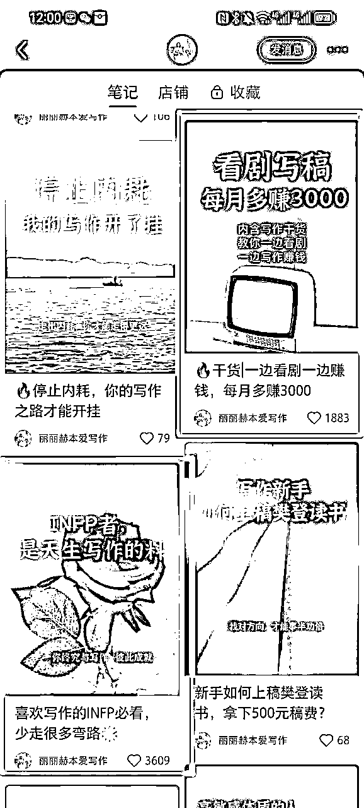

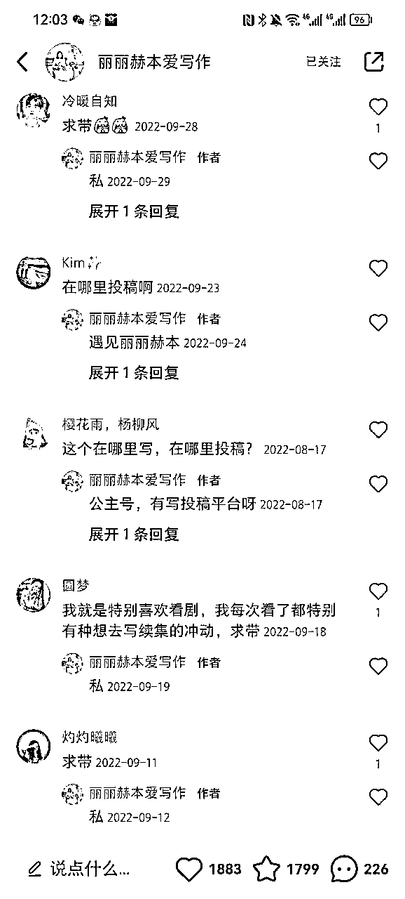

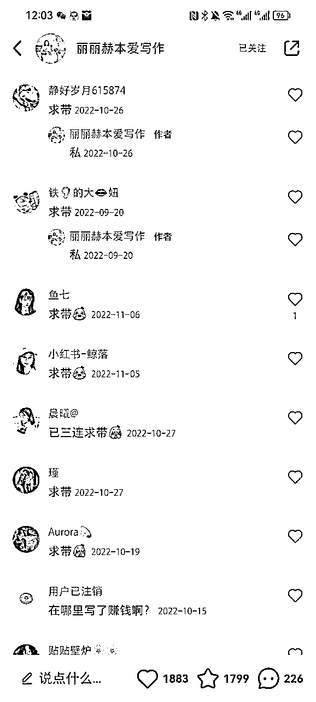

那出了这篇爆款笔记，该如何去持续输出爆款呢？那就是不断重复你自己的爆款选题，直到这个爆款没有流量为止。

你一定要明白，只有爆过的内容，一定会重复爆。给大家看下我的重复爆款。

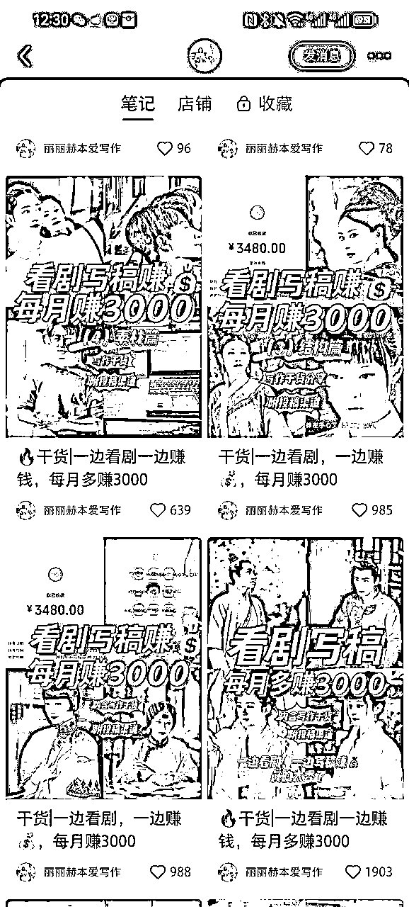

我会用不同的热播剧剧照作为封面，标题不做调整。内容做成一个系列，分别从我写过的文章选题、素材、框架和成文几个方面输出干货内容，让粉丝看到我确实很专业，也做出了结果。

他们自然就会很信任我，想要跟我学习了。

我连续重复做了6篇这样的爆款笔记，给我涨粉5000，吸引来了将近1000个粉丝引流到了私域。

后来，我又创作了一个独属于我的爆款内容体系。请大家看下下面笔记：

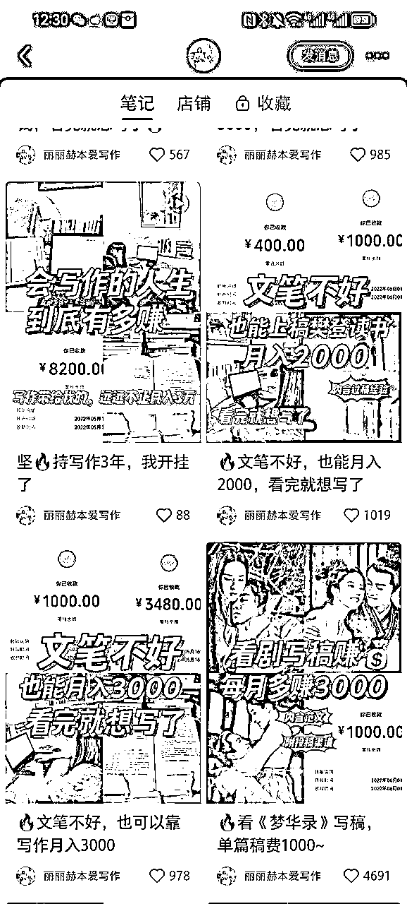

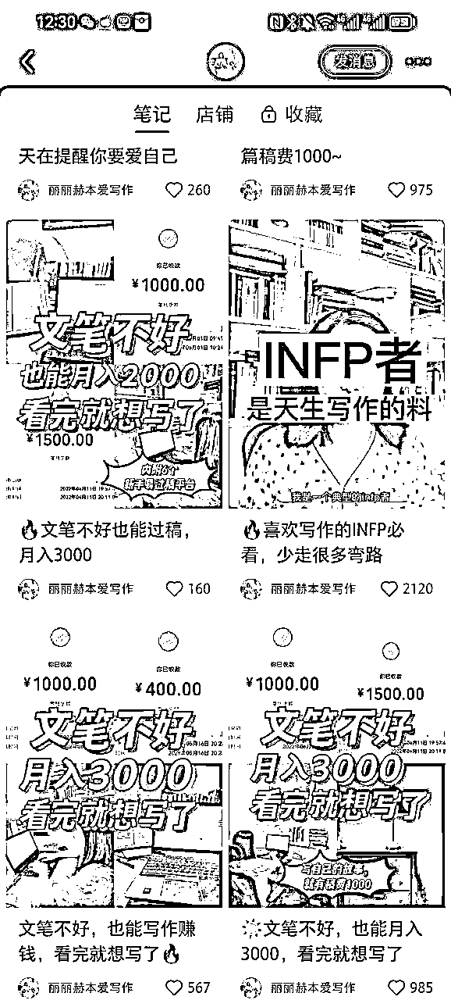

大家看出来了我的爆款逻辑了吗？

文笔不好，也能月入3000，看完就想写了

文笔不好，也能上稿樊登读书，月入3000

这就是我的内容公式。

因为我发现小红书关于文笔这个点，特别被很多人关注，大家都想提高文笔，觉得文笔不好就不能写作。

很多学员来咨询我写作时，也会问我：文笔不好，可以写作赚钱吗？

很多人对文笔都有误解，所以我才会输出这一系列笔记告诉大家文笔到底是怎么回事，写作赚钱和文笔好不好其实没多大关系。

也举了一些文笔不好的学员，经过一段时间刻意练习取得了好成绩。

那很多文笔不好的作者看到这些笔记，就会信心大增，也想学习写作。

那确实这一系列笔记，也都爆了，给我涨粉了3000多，引流来了500多人，变现了几万。

我们课程价格比较低，如果高价课程，那变现就更厉害了。

我的爆款笔记就跟大家分析到这里，更多爆款内容可移步我的小红书再看。

不得不说，只要你的爆款笔记痛点够痛，能够解决用户痛点，流量根本不愁。

而我最擅长的就是把握用户精准痛点，制造爆款内容。

我的知乎账号曾靠一篇爆文涨粉3000，头条账号靠一篇爆款涨粉1万，公众号靠一篇爆款涨粉3000。

在打造爆款笔记时，要多去研究已经被验证的爆款底层逻辑，方方面面都要进行分析。

不能只是看到别人选题爆了，自己就去写这个选题，更重要的是去思考他们为什么会爆，总结出经验。

这样你才能在做选题时，也能触发爆款机制。创造出独属于你的爆款内容公式。

否则即使你写的是别人的爆款选题，你的爆款成功率只有10%，纯靠运气了。

做小红书一定不能闭门造车，陷入自嗨模式，平时要多去刷爆款，收集爆款，培养爆款思维。

爆款底层逻辑：用户有病，你有药，药很好。用户有痛点，你提供爽点。

笔记末尾带的话题标签，最好选2000万以上关注度标签。可以看看类似爆款笔记用的什么标签。

这也是我们写文时经常说的要多去拆解学习爆文，做小红书也是同样的道理。

我总结了爆款笔记六步拆解法：

1.拆解出目标人群，分析此类选题内容针对的是什么样的用户

2.拆解出精准信息点，包括：具体场景、地点、风格、内容等，通过精准信息，可以让目标人群更加垂直

3.拆解用户心理，内容利用了哪一块用户心理进行垂直打击

4.拆解出情绪体系，内容利用了什么情绪体系感染了客户

5.拆解出干货知识，内容讲述了什么道理，传播了哪些知识

6.拆解出大/小标签/分析标签，把内容分级

同时，你的笔记要提供三大价值：情绪价值+干货价值+人设价值

也就是要干湿结合。

纯干货的笔记，太干，无趣。只有融合了情绪价值和人设价值的笔记，才能吸引用户持续关注你。

在写干货的过程中，可以带进你的故事、观点和价值观，增强人设感。

也就是你独一无二的人设定位，决定了你的账号价值有多大。切记别模仿，别模仿，别模仿。模仿无异于自杀。

模仿多了，你都不知道自己是谁了。又怎么会有独特的人设价值呢？

现在小红书越来越卷了，同质化内容太多了，所以差异化人设定位和内容输出体系，才能脱颖而出，吸引精准粉丝靠近你，快速变现。

最后，说一下，一般账号都有冷启动阶段，最开始发的笔记都没人看，小眼睛只有100多个阅读量。

但只要你持续更新有价值的干货内容，总有一条爆款笔记会激活你的账号，数据就开始稳定起来。

更新频率：有时间最好每天更新，账号涨粉会比较快。也可以1周更新3-4次，总之要保持稳定更新节奏，不要断更。

## 二、封面标题，是打开率的关键

做小红书需要很好的审美能力。

因为当你的笔记散落在一堆笔记中，第一眼吸引读者的就是你的封面标题。

用稿定设计、黄油相机做图，小红书年轻人比较多，女生喜欢粉粉的少女感。

你的封面标题越好看吸睛，打开率就会越高。

这就像公众号文章标题一样，一定要戳中读者痛点，吸引点开。

一旦打开率上来，官方流量也会随着来。阅读量就不愁了。

封面做得好的博主，打开率都在90%以上。

只要你保证笔记质量稳定，按照以上说的爆款收藏型来写的，读者打开后觉得以后能用到，顺手就收藏了。你的收藏量也就稳定了。

我最开始在封面标题上没太用心，封面不适合小红书风格，导致打开率特别低。放几张图让大家感受下就懂了。

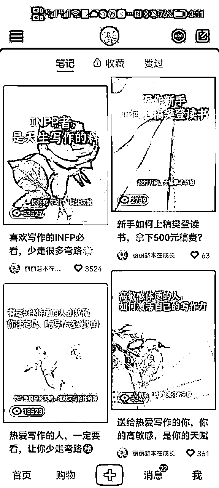

后来，我调整了封面风格，更符合小红书用户的审美标准，打开率一下子就提高，阅读量也比较稳定了。

建议大家自己拍照片，来设计封面图，一来增强人设感，二来为后期植入品牌做准备。

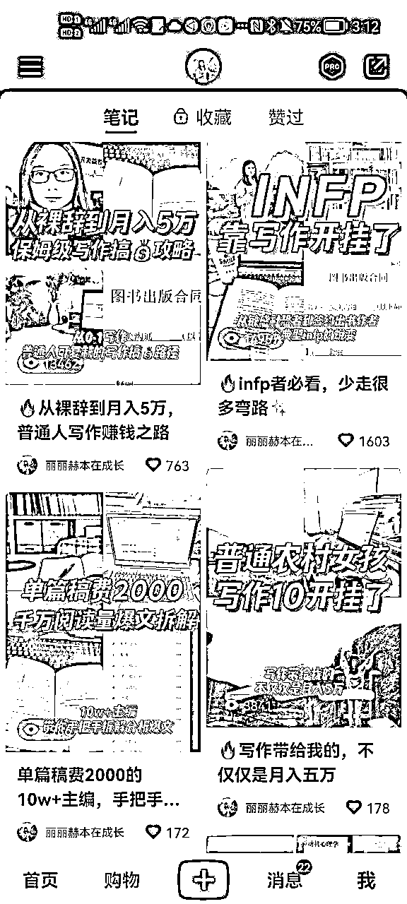

我们一定要多去进行数据分析，看看影响笔记的各个因素是怎么变化的，不断优化迭代笔记封面标题。

## 三、主页确定性，是让读者关注的关键

如果你靠爆款笔记吸引来很多粉丝，但是你的主页给人感觉很乱，她们可能只是收藏这条笔记，并不会去关注你。

这也是为什么不少人单条笔记数据很不错，但是涨粉困难。

你没有让读者对你产生期待，他们自然不会主动关注你，她并不知道你能持续带来什么价值。

所以，你的主页一定要有确定性。能让读者一进主页，就知道你是做什么的，能持续输出有价值的内容。

如果她在看你的主页时，欲罢不能，恨不得一口气看完所有笔记。她自然就留下来了。

确定性，包括形式上和内容上都要有确定性。

形式上的确定性，是你的封面标题要设计好固定模板，不要总是变来变去。

内容上的确定性，是你每条笔记都内容稳定，干货十足，价值给到位，有连贯性。

比如我自己的笔记内容，基本每篇笔记都与写作赚钱有关，读者就会对我形成期待，期待我输出更多与写作赚钱相关的干货内容。

那我吸引来的也会是精准的想要写作变现的粉丝，而我的产品-写作训练营就是帮助写作者实现写作变现目标的。

但刚开始我并没有意识到确定性的重要性，也是报名学习了一个自媒体运营课程学到的。

我发现自己最开始有几篇笔记数据很不错，但却没能吸引多少人关注我。

后来，我分析了下原因，封面标题和内容都没有确定性，不能让读者形成稳定期待。

小红书涨粉的本质就是：用户点赞当前内容，用户关注未来内容。

所以，一定要保持主页的确定性。

## 四、如何引流变现

谈到这点，我最心痛了。因为我在引流上栽了大跟头。

我的这个小红书账号在去年11月被关进了小黑屋，现在还没放出来，估计应该是废了。

所以我在上个月又重启了一个新账号。

我为什么会被关进小黑屋呢？是被同行举报了。

因为在私信里留下了微信号，还留了很多次。基本就是留图片微信号来引流的。当时抱了侥幸心理。

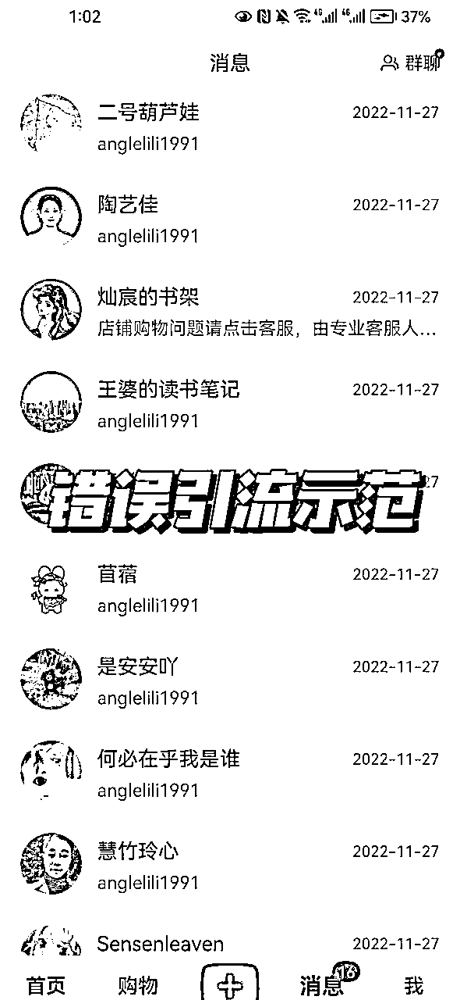

引流的时候是很爽，但却没考虑引流的正确方式。

在此，奉劝各位圈友一定要合理合规引流，千万不要抱有侥幸心理，不要重蹈我的覆辙！很多10万粉的博主，都栽在了引流上了！

那现在比较合适的引流方式是什么呢？

可以主页建立群聊，在群聊里发助理号，助理号上留下你的联系方式。类似于这样：

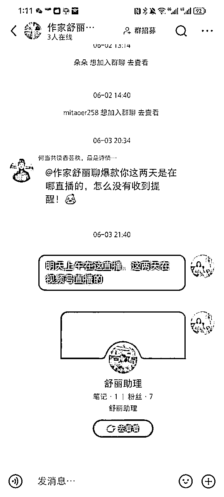

千万不能提到“学员”“训练营”“报名”“课程”等字眼。

也可以开通署店，通过官方渠道卖课，只要缴纳1000元保证金就可以了。

最后，分享5个判断是否被限流的方法：

第一、发布笔记半小时后，看看对应标签下最新笔记里有没有你的笔记，如果没有就判定笔记违规；

第二、试试薯条推广，如果提示笔记无法被推广，那一定内容不规范，被限流；

第三、粉丝在主页推荐里刷不到你的笔记；

第四、点开我的主页，左上角三条杠，点击帮助和客服，点击笔记申诉，选择申诉理由，然后提交等待回复；

第五、收到官方提醒，说你的笔记存在违规现象，让你整改，那就赶紧删除违规笔记。

引流到私域后，该如何转化成交呢？

可以发一些资料，比如她是看了哪篇笔记被引流来的，那你要准备好相关资料，给到她，满足她的初始期待。

不然，她会觉得被骗了。

在资料里要埋好钩子，展示一些成功案例，告诉她想要学习更多内容，可以有哪些选择，达成什么效果，让她根据需求选择就好。

除此之外，一定要经营好自己的朋友圈，公众号还有视频号。

这里就涉及到私域内容营销了。

用户到了你的私域，自动转化成交非常重要。

我的很多粉丝都是因为看了我的朋友圈和视频号，直接买课，甚至连一句话都没跟我说过。

因为我早已布局好了我的私域内容，每天坚持发圈5条以上，日更了朋友圈5年，自动成交体系早已搭建完成。

视频号也一直在更新，输出我的价值观和观点，吸引同频人。

所以，这20万的变现，是公域和私域联动达成的，缺一不可。

如果大家对私域内容营销感兴趣，我下次再来分享下我的高能朋友圈成交体系怎么搭建的。

以上，都是我在做小红书过程中，实战中积累的经验教训，希望对即将要做小红书或者正在做小红书的你有帮助。

我也有自己的小红书训练营，在带领一群知识IP打造赚钱的小红书账号，欢迎多多交流。

我在开始做小红书时，也经历了数据低迷期，包括现在，偶尔也会有笔记数据扑街，但我不会因为一篇笔记数据不好就焦虑不安，会分析具体原因，下次再不断优化迭代。

做任何事，都会遇到未知的障碍和挑战，也会经历一段看不到结果的沉淀积累的时光，但坚持的力量是巨大的。

只要你保持稳定的节奏坚持下去，找对方法，很多结果都是水到渠成。

祝各位大佬都能在小红书上找到自己的一席之地，引爆流量，赚大钱！