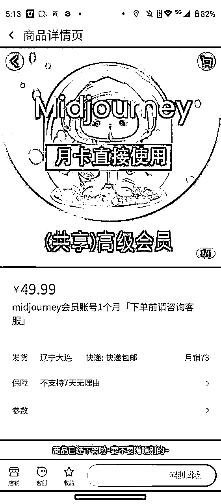
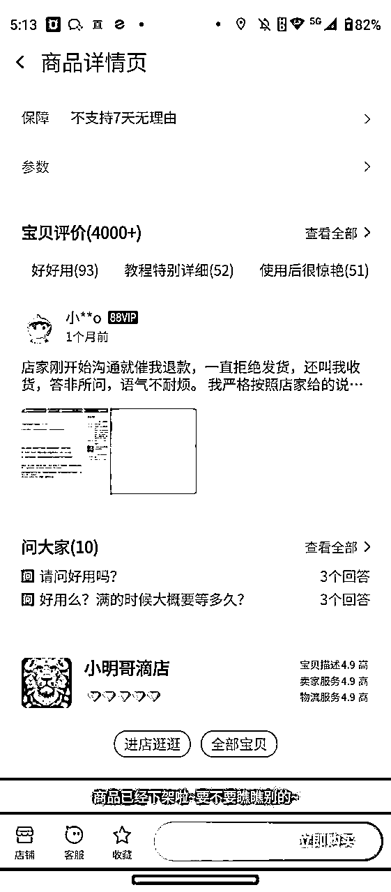
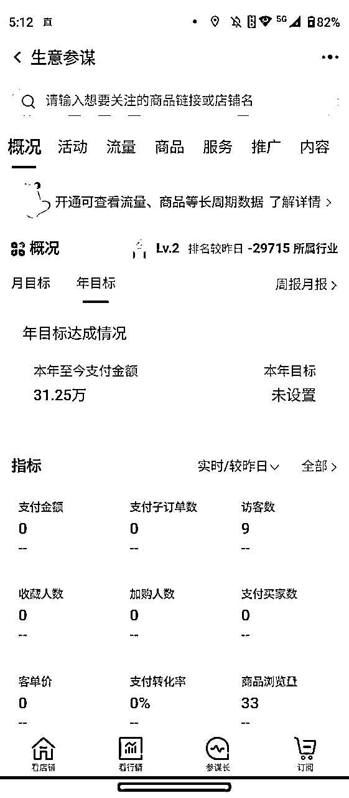
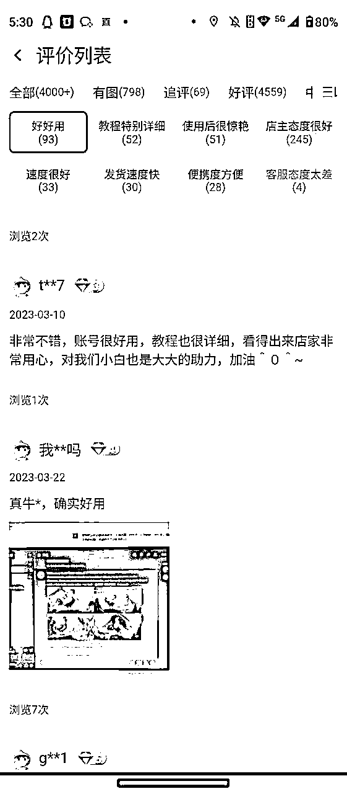
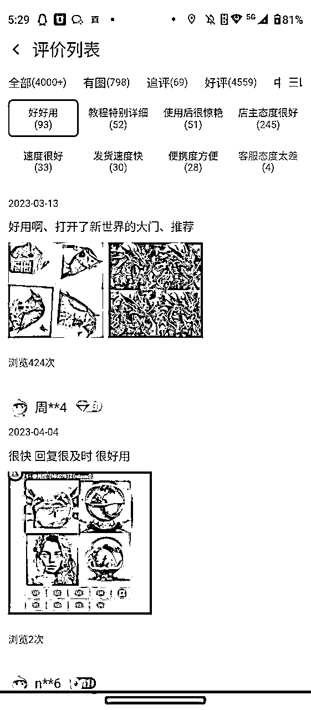
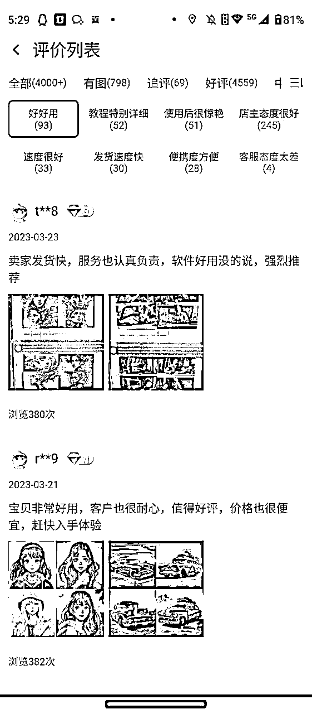
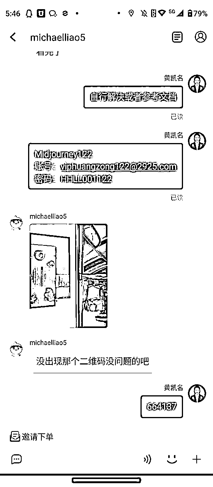
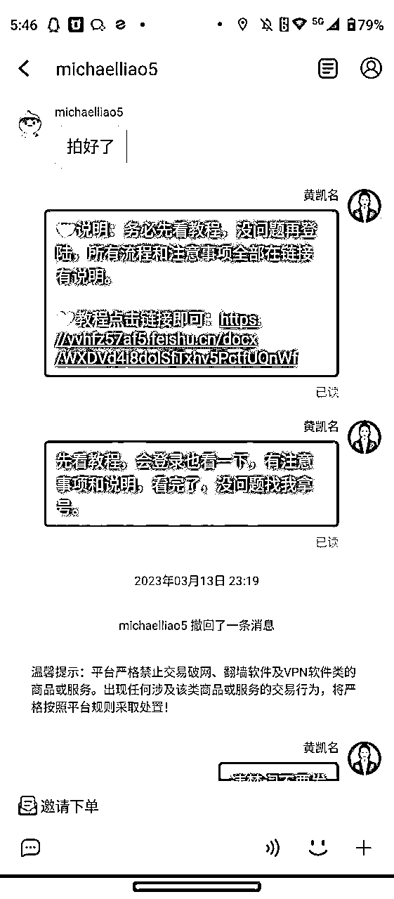
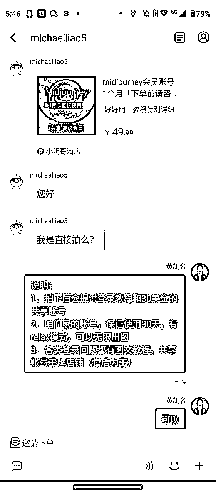

# 【Midjourney共享账号】三个月收入10W+复盘总结分享。

> 来源：[https://yvhfz57af5.feishu.cn/docx/Etbhd8zznojPTVxIrjockDUynfg](https://yvhfz57af5.feishu.cn/docx/Etbhd8zznojPTVxIrjockDUynfg)

# 一、文章说明以及感谢

1、利用淘宝出售Midjourney共享账号，2023年第一个10W+收入

2、感谢@西昂这个男人，带我做的这个项目，同行人雨哥

3、我会记录一些真实的感受，以及这个项目整体流程，来给大家进行分享

4、目前这个项目几乎已经停止，但是其他类型的共享业务，是不是可以继续挖掘，希望可以给新手一些帮助

# 二、项目结果以及复盘

一些结果数据的总结

1、项目从2023.1月份开始上架，4月底基本停止

2、总付款金额31.25万，会有部分退款，有时候还是蛮多的

3、收益大概是10W+，商品好评4000+，利润大概是销售额（去除退款）*（50%-60%）

项目复盘总结，总结出能够帮助大家的点

### 1、项目由来：

这个项目并不是自己发现，是在生财的一次大航海，我做志愿者，和我的领队产生深入交流。在大航海结束以后，他自己在做这个项目，由于有信任基础，就跟着一起做了，结果一发不可收拾。希望大家多多交流，多多主动链接，会存在很多机会。

### 2、项目关键转折点（做了就要100%投入）

比别人多做一点努力，未来总会收获的多一点

2023年春节期间，上架的宝贝开始有了流量，大概每天的的销售额是500左右，为什么说这个时间是我本店铺的转折点。因为自己无论是大年三十还是大年初一，都在回复用户，并且快速产生成交，可能其他商家回复的比较慢，我呢，必须一分钟之内回复，就是这几天，开始和其他店铺拉开差距。

它的背后是【客服回复率】【成交率】

### 3、引导好评，做评价，让客户不由自主下单（重点）

（要懂链路的设计，永远是客户跟着我的思路走，一直在做社群销售行业以及高管，这点还是懂的）

复盘出另外一个核心就是引导客户评价，评价会赠送Midjourney描述词，大家也都叫咒语。思路就是要评价，要好评我，这样才会比其他人有优势。大家把我说的这么好，商品看完自然就下单了。

赠送Midjourney描述词的时候，同时会把流量引进私域，用的是企业微信。其实当时想法是找人合作做Midjourney的基础课程，但是一个人太忙，就放掉了。好评的一些截图。

### 4、如何一个人接待几百个个咨询？总结必须回答的用户问题，全部给出方案，并且给出顺序

一个人做客服，真是很累很累，很累。总结出客户所有的问题+答疑文档

大家看到的数据总结背后，都是一个人的艰辛接客之路

1、早9：00—23:00全部一个人接待，一天高峰期成交100单以上

2、接待+售后维护+注册开通账号+用户基本问题的解决

3、吃饭在回复，洗澡也在回复，全月无休

4、无论在做什么，都在回复。都在，回复

高质量总结：

1、别怕吃苦，项目有机会的时候就要【猛搞】

2、在二三线城市，人工成本很低，北京这座城市，我真的请不起客服

3、销售的答疑环节，都可以把要解决的问题，写成SOP，进行统一的说明，提升效率

4、我想这个项目的前段文档也分享给大家了，亲自感受一下。

# 三、项目整体梳理+核心总结

发现项目-开始实战

实战路径：学习注册Midjourney，学习充值Midjourney。然后开始上架---接待---开号--维护账号--继续接待--优化话术--优化流程--不断进行优化和问题解决。

同行已经给了你所有的答案，同行给出了你所有值得优化的点。学习同行并不可怕，可怕的相互下扬沙子，破坏规则。等大批同行开始杀进来，开始打价格战的时候就真的很累，也就意味着快结束了。

一些真实的总结

1、不赚钱的时候就把当下的事情做好，心态好，状态好，才会有财富奔你而来，永远不是你奔向财富。

2、有门槛的事情，更值得去做（别人开通不了，我能开通，所以有一丢门槛）

3、别怕错，不怕失败，每一个项目，每一次航海，都会积累一定的经验。未来的成就都是经验的总和

4、别怕不会，觉得自己没有接触，学一学，就会了。

5、学会付费，付费才是最好的捷径。当然，找到一些能聊到一起，或者真正一点点起来的大佬