# Ai工具大全

> 来源：[https://jegjd0iktt.feishu.cn/docx/Ey1LdxNTPoilzuxUe0tcxJrInSh](https://jegjd0iktt.feishu.cn/docx/Ey1LdxNTPoilzuxUe0tcxJrInSh)

be fine

大家好，我是瑞克，花费了一天的时间为大家测试和筛选出来目前市面上，常用且效果不错的Ai工具合集，希望能给大家提供一点帮助！

文章撰稿思路来源于圈友@AI 同行侠-文卓 ，文章地址：https://wx.zsxq.com/dweb2/index/topic_detail/584558542125584

# 使用说明

1\. 部分Ai工具整理来源于生财圈友风向标及精华帖，将在后面附上原贴地址，以示感谢！

2\. 部分Ai工具需要魔法上网，请自行解决；部分工具需要收费，可以尝试用chatgpt代替这些功能

3\. 下列总结的Ai工具均已测试筛选，剔除掉了很多不实用、效果差且操作难度较高的ai工具，比较常用且重要的工具均已标红

4\. 对Ai工具使用有疑惑可以在知识星球联系我，昵称：深度思考的瑞克

本文档仅为部分常用Ai工具的介绍，完整的版本请查看飞书链接：

# 工具合集

## 聊天Ai

### 1.chatgpt（免费）

链接：https://chat.openai.com/auth/login

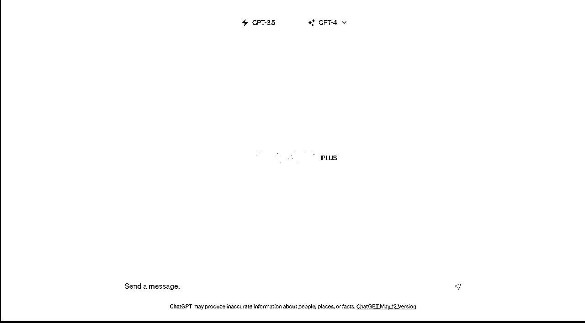

目前最强的人工智能语言对话模型，具有强大的储备和处理能力。在许多的工作和场景中都可以向它请教问题，或者寻求帮助，在非常多的领域，它都可以提供有用的建议和解决方案，并且最新的gpt已经可以连接网络和插件，能够获取最新的信息和动态。

【基础学习文章】https://learningprompt.wiki/docs/chatgpt-learning-path

生财圈友文章：

@七小 https://wx.zsxq.com/dweb2/index/topic_detail/214545152248251

（又双爆肝一晚上，一文讲明白ChatGPT能怎么玩！）

@菜菜 https://t.zsxq.com/0ecNiSFCh

（玩ChatGPT2个月后，我总结出高效对话ChatGPT的6字真经）

@Bittle.白先生 https://wx.zsxq.com/dweb2/index/topic_detail/181454428444412

（GPT调教心流法-身份篇）

### 2.new bing（免费）

链接：https://www.bing.com/

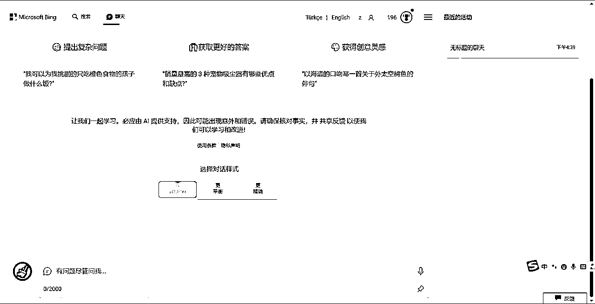

微软使用chatgpt开发出来的可联网Ai对话模型，功能强大，全部免费使用，对比chatgpt来说具备联网搜索功能，可创造型会更强，但是总体回答准确率不如chatgpt，速度更是远不如gpt3.5。可以结合使用，并且newbing可以在线绘画，马上也会上线插件功能。

@不期而遇 https://wx.zsxq.com/dweb2/index/topic_detail/412515482414118

（微软新 Bing 突然全面开放，还有一堆超实用的全新功能）

### 3.claude（免费）

链接：https://www.anthropic.com/product

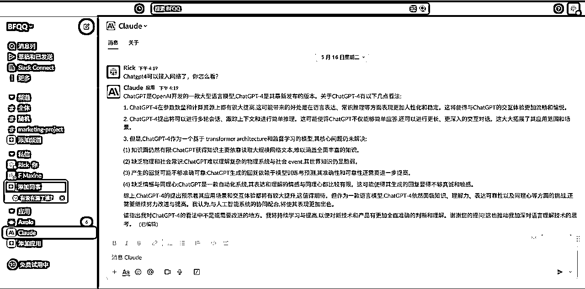

需要安装slake，Claude是一个由Anthropic公司开发的下一代AI助手，它可以通过聊天界面和API执行各种对话和文本处理任务，比如摘要、搜索、创意和协作写作、问答、编码等。

@独孤风 https://t.zsxq.com/0eXpu9mVq

（无需魔法——平替GPT的工具Claude）

### 4.poe（部分免费）

链接：https://poe.com/

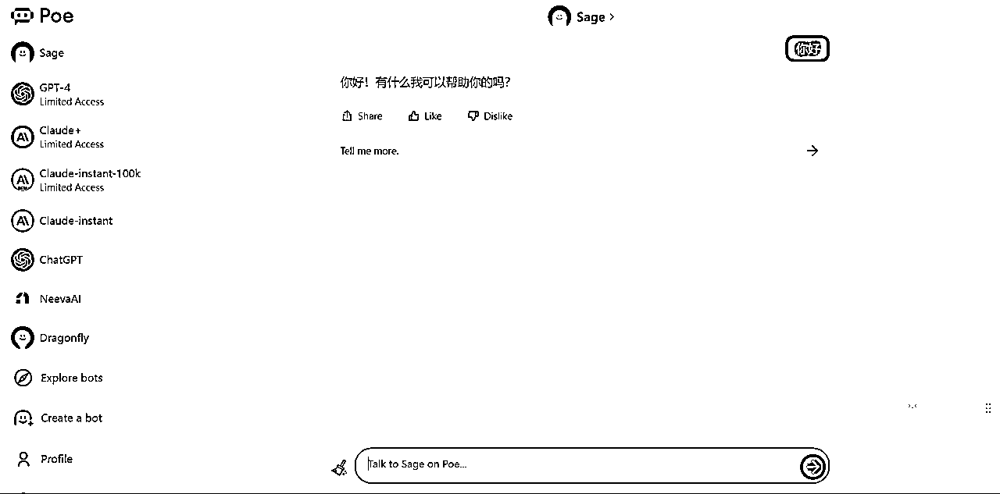

问答社区Quora推出的问答机器人工具，chatgpt3.5免费使用，还可以使用chatgpt4，claude plus等

@精神小伙 https://wx.zsxq.com/dweb2/index/topic_detail/181544521521882

（想体验 ChatGPT ，又不知道怎么注册的朋友，可以下载这个 Poe App 试试）

### 5.steamship（免费）

链接：https://www.steamship.com/

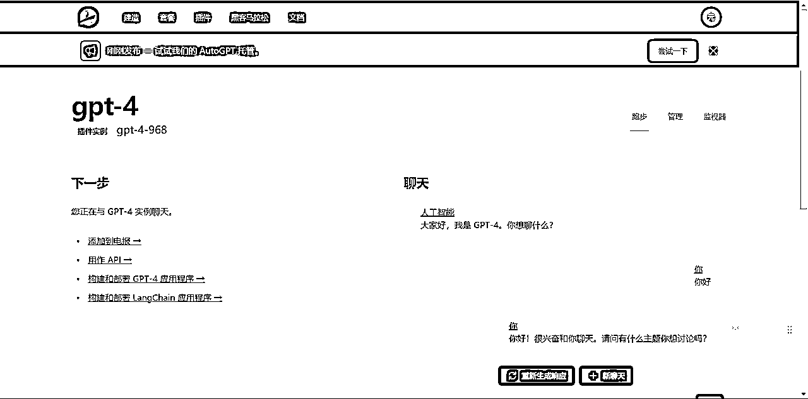

构建自己的Ai应用程序，并且可以免费使用chatgpt4

@波本零 https://wx.zsxq.com/dweb2/index/topic_detail/214218482155121

（如何白嫖gpt4账号？）

目前市面上大部分Ai对话模型都是免费或者申请资格即可使用，如果需要在国内使用chatgpt，可以自行搭建网站，在公司内部团队使用，不要大范围传播，搭建非常简单，具体教程可以看君莫笑大佬发布的帖子，出去审核等待的时间，我大概花了不到20分钟就可以直接使用了！

@君莫笑 https://wx.zsxq.com/dweb2/index/topic_detail/214214215241281

（只需4块钱，就可以搭建一款专属chatgpt中文版网站）

## 绘画Ai

### 1.midjourney（付费）

链接：https://www.midjourney.com/home/?callbackUrl=%2Fapp%2F

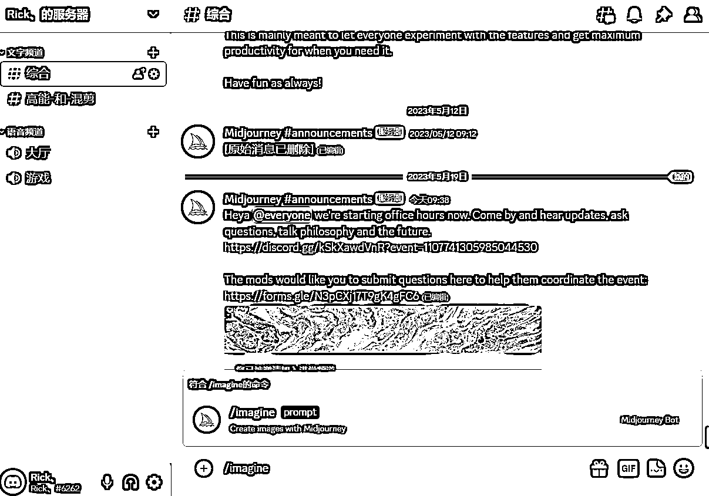

非常强大的Ai绘画工具，推荐新手入门使用；只要输入关键字，就能通过AI算法生成相对应的图片，可以选择不同画家的艺术风格，可玩性非常强，具体使用教程链接如下：

https://learningprompt.wiki/docs/midjourney-learning-path

@天辉 https://wx.zsxq.com/dweb2/index/topic_detail/814285811841242

（《行动起来，就会有好事发生》（附AI绘画万字长文））

### 2.stable diffusion（开源免费）

链接：https://github.com/CompVis/stable-diffusion

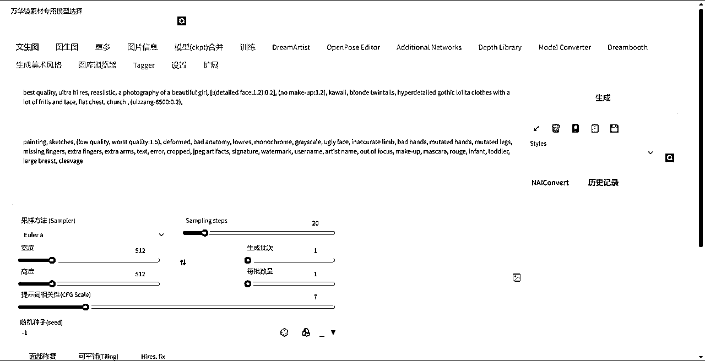

一款开源的Ai绘画程序，比midjourney更强大的是可以通过素材训练，得到你想要的模型，不过难度会高很多，上限也要更高，具体教程

@吴东子 https://wx.zsxq.com/dweb2/index/topic_detail/181484882125482

（耗时80小时！超详细的胎教级Stable Diffusion使用教程，看这一篇就够！）

@沧海 https://wx.zsxq.com/dweb2/index/topic_detail/181484454458282

（Stable Diffusion 应用场景和模型训练）

### 3.DELL·E 2（免费）

链接：https://openai.com/product/dall-e-2

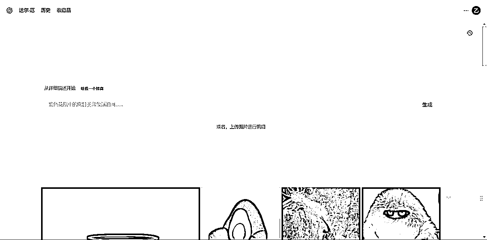

openai设计的Ai图像生成系统，具有强大的功能，目前bing已经接入，可以直接在网站对话作图

@深度思考的瑞克 https://wx.zsxq.com/dweb2/index/topic_detail/814455258248452

（用new bing生成渲染图，使用DELL-E 2模型，效果不输midjourney）

### 4.无界Ai（收费）+灵创Ai（收费）

链接：https://www.wujieai.com/

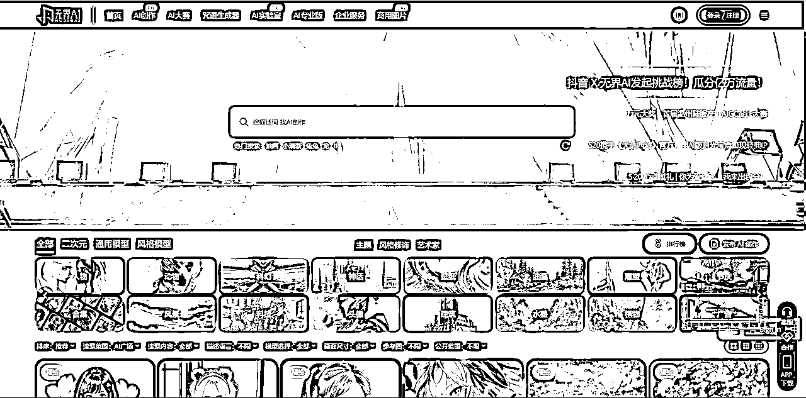

国内设计的两款Ai绘画模型，不仅可以在电脑端使用，可以在手机上下载app使用，比较方便，效果也很不错

@初心 https://wx.zsxq.com/dweb2/index/topic_detail/412518812252158

（AI绘画合集）

其他Ai绘画工具不太好用，并且价格比较贵，用前面几个就已足够，顺便说一句midjourney可以在淘宝购买共享套餐，一个月只需30

## 视频Ai

### 1.opus clip（免费）

链接：https://www.opus.pro/

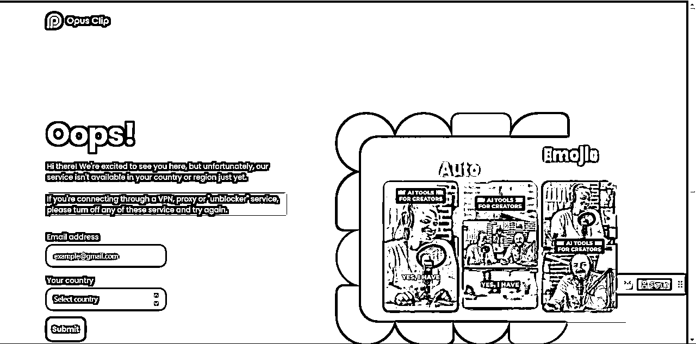

由openai公司开发的Ai视频剪辑软件，可以自动剪切长视频，目前暂时只支持youtube视频，后续功能应该会非常强大，大家可以期待一下，国内上不了可以换下节点，我用的德国节点连上去了

@黄小刀 https://wx.zsxq.com/dweb2/index/topic_detail/584588411815844

（Ai应用 opus clip）

@华哥 https://wx.zsxq.com/dweb2/index/topic_detail/814211184121142

（AI终于可以自己剪视频了）

### 2.runway（收费）

链接：https://runwayml.com/green-screen/

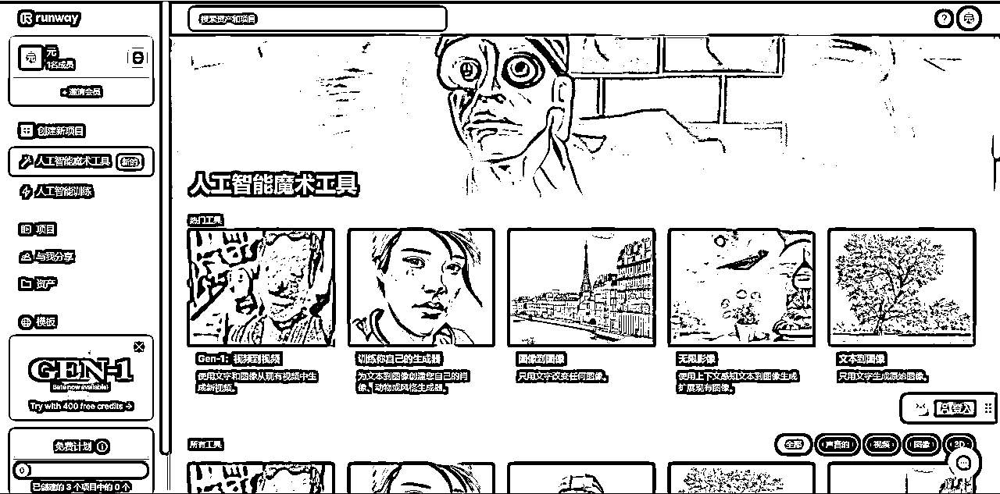

目前算是比较强的一个视频ai处理工具，可以去除背景，制作视频特效，但是我个人尝试过特效之后并没有达到让我满意的效果，用户基数很大。

目前市面上的视频处理Ai技术只有文字生成视频，以及生成特效方面会比较好用，但是处理出来的视频也是比较初级的，暂时来看，视频ai技术还需要一点时间去迭代，尤其是视频剪辑方面，处理起来的时间要远高于人工剪辑

## 办公Ai

### 1.chatdoc（部分免费）

链接：https://chatdoc.com/

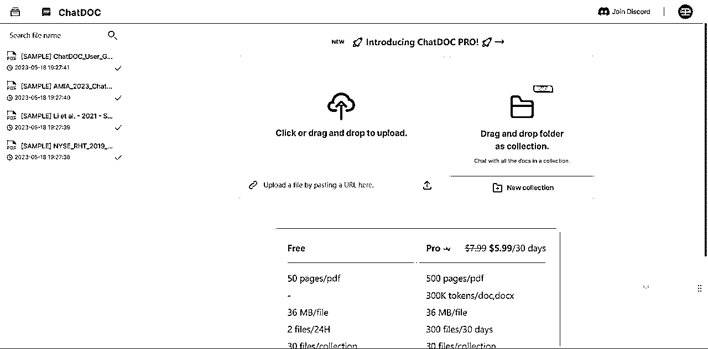

它是一款基于ChatGPT的文件阅读助手，可以 快速从文档中提取、定位、汇总信息，价格不算贵擅长理解文档、图片、表格，所有回答都有来自文档的直接引用支持。选择任意表格/段落，提出针对性问题，并获得更准确的答案。

@发达 https://wx.zsxq.com/dweb2/index/topic_detail/412244424428558

（与自己上传的文件聊天—ChatDOC）

### 2.chatpdf（免费）

链接:https://www.chatpdf.com/

类似于chatdoc，是一款可以快速帮忙理解、分析文档，总结pdf文档的在线工具，效果用起来不错，可以对它提问任何关于这份 PDF 的问题，非常适合快速提取各种 paper 论文的摘要

@蛤蟆先生 https://wx.zsxq.com/dweb2/index/topic_detail/214818424554581

（chatpdf）

### 3.chatexcel（免费）

链接：https://chatexcel.com/

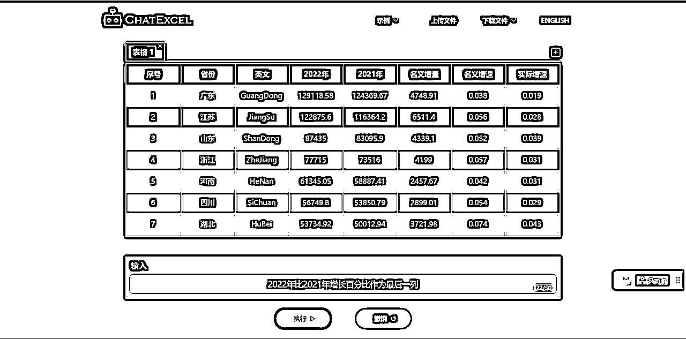

在聊天框内输入对于表格的整理需求表格就会自动处理，并且可以一键导出成标准Excel表格

@七哥个人品牌 https://wx.zsxq.com/dweb2/index/topic_detail/214814184182551

（ChatExcel AI 工具，按需求自动处理表格）

### 4.motiongo（部分免费）

链接：http://motion.yoo-ai.com/

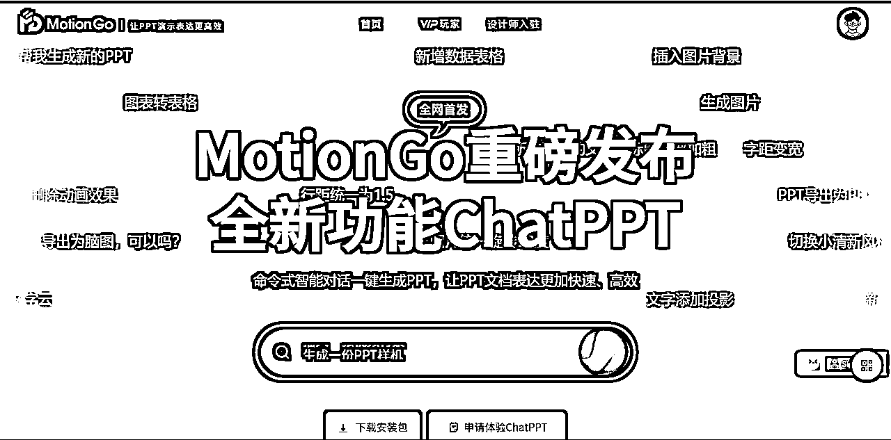

输入主题，一键完成ppt，申请通过后，会镶嵌到office里面，使用非常方便，目前可以免费体验，收费也很便宜，强烈推荐入手

@深度思考的瑞克 https://wx.zsxq.com/dweb2/index/topic_detail/181484212882482

（Ai一键生成ppt）

### 5.xmid copilot（免费）

链接：https://xmind.ai/

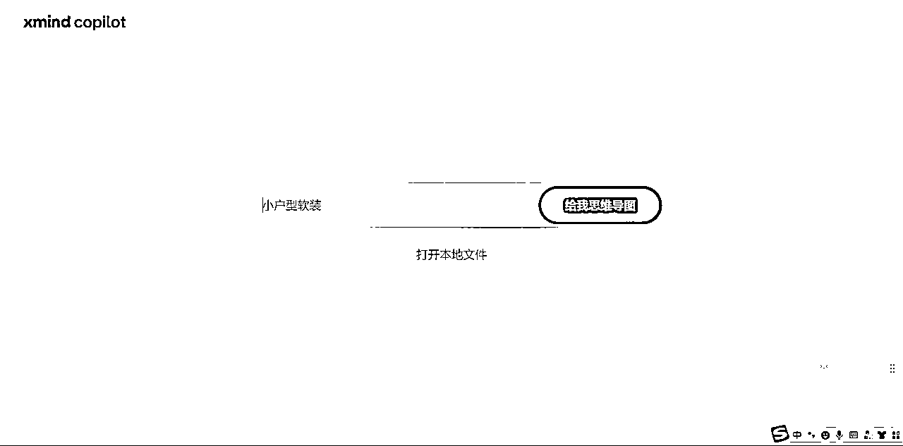

一键生成思维导图的工具，功能强大，支持思维导图框架内容扩写以及Markdown 文件导出

@飞 https://wx.zsxq.com/dweb2/index/topic_detail/814248515281412

（Xmind Copilot 思维导图龙头软件的AI来了）

办公Ai绝对是我们要去重点关注并且学习使用的，因为会大大提高我们的工作效率，尤其是chatdoc、chatpdf、chatexcel、chatppt等等工具

## 图像处理Ai

### 1.bgsub（免费）

链接：https://bgsub.cn/

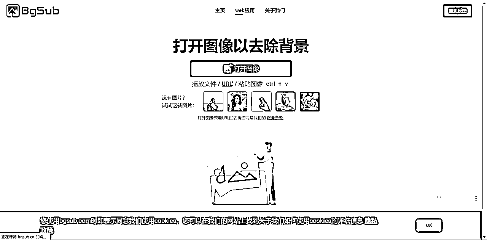

使用Ai自动替换图像的背景，一键抠图，完全免费，而且效果十分不错

### 2.ribbet（免费）

链接：https://ribbet.ai/

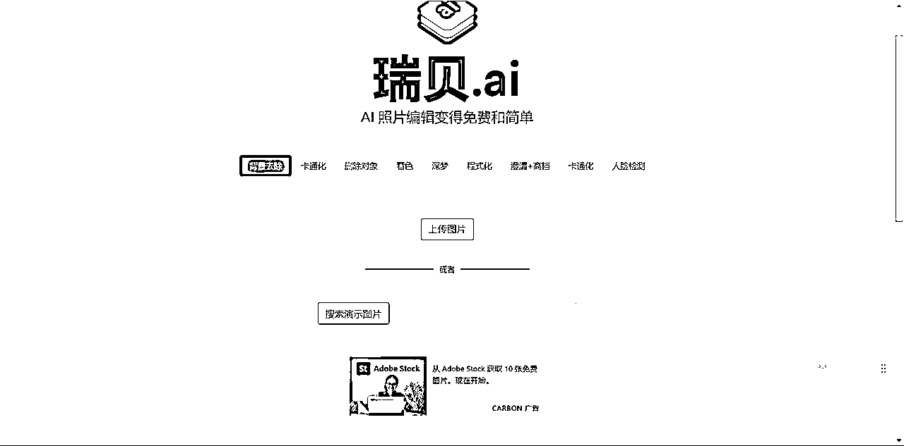

强烈推荐！免费，且效果非常好，可以一键抠图，照片一键修复，还可以一键卡通化，以及着色，

删除对象，日常处理照片用这个网站完全足够

### 3.photoroom（部分免费）

链接：https://www.photoroom.com/

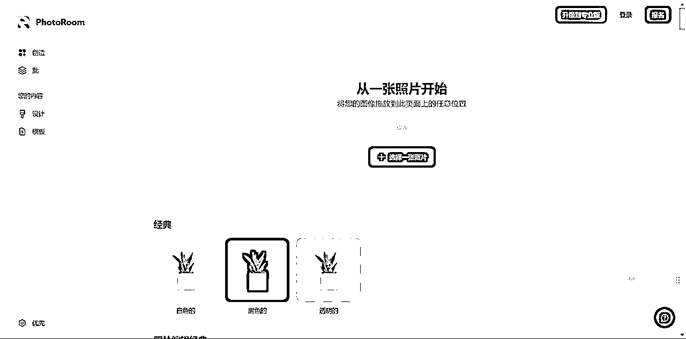

可以在手机上下载app使用，一键抠图，更换白色背景，模糊背景，删除对象，非常好用

目前市面上的ai图像处理工具非常多，我这里就不给大家推荐其他的了，大家选择我上面给出的1,2个就足够了，免费的也非常好用！

## 写作Ai

### 1.Notion Ai（收费）

链接：https://www.notion.so/product/ai

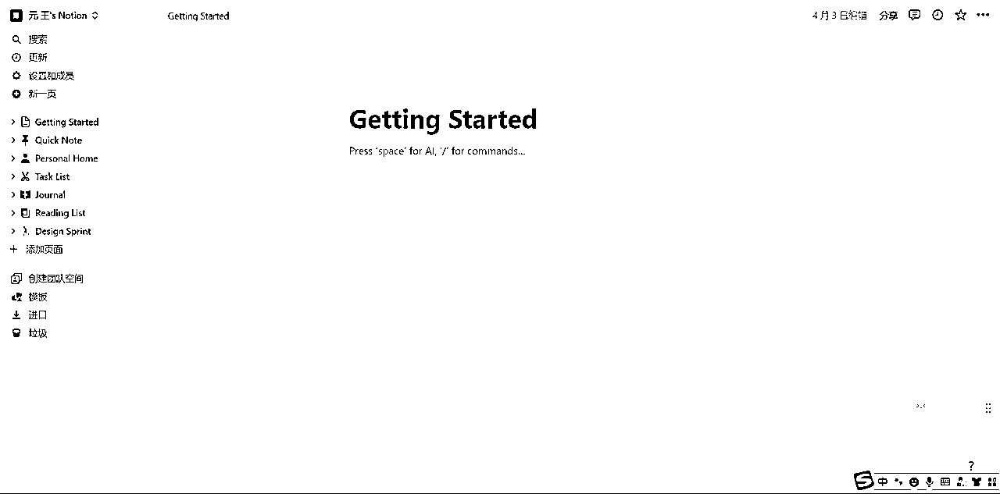

一个非常强大的Ai辅助写作工具，智能化程度不弱于chatgpt，但是更方便易用，美中不足的就是需要收费，但价格不贵，可以在淘宝购买，长期需要写稿写文案的同学可以考虑一下，或者用chatgpt结合生财的调教文章也是一样效果。

@北辰 https://wx.zsxq.com/dweb2/index/topic_detail/412541821855888

（Notion AI使用后之前，丝滑程度秒杀Chatgpt）

@蛤蟆先生 https://wx.zsxq.com/dweb2/index/topic_detail/181521141424142

（学习 Notion 技巧的 10 个Youtube 频道）

### 2.copy ai（部分免费）

链接：https://www.copy.ai/

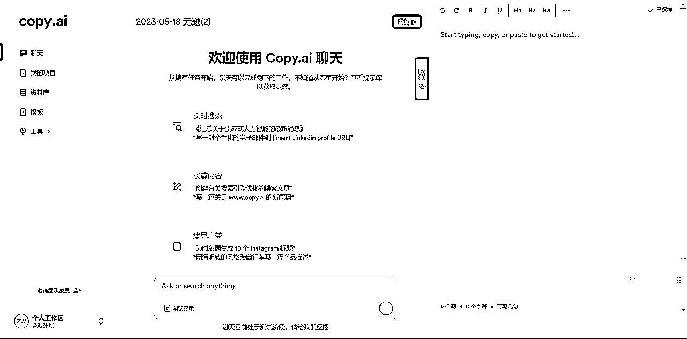

一款比较强大的Ai写作工具，部分功能使用免费，也可以升级到pro，体验更强大的功能，还挺好用的，对话式生成内容创作。

### 3.copydone（免费试用）

链接：https://copyai.cn/?share_code=435447

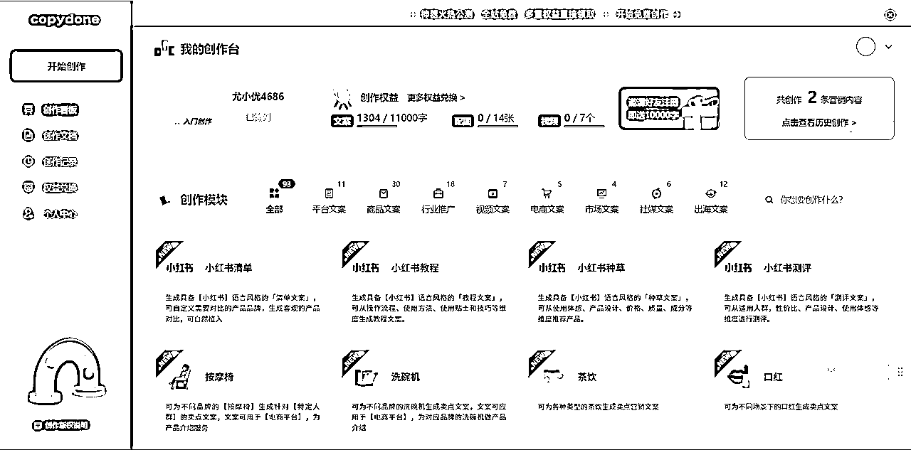

可用于不同场景营销文案的生成，包括小红书、知乎等主流平台营销内容的生成，还可以一键生成专属的营销配图与短视频，现在还可以免费使用，尤其是小红书文案写作，强烈推荐！

@零本波 https://wx.zsxq.com/dweb2/index/topic_detail/584522254458824

（推荐一款国内免费的AI智能写作工具）

写作ai平台国内目前出了挺多的，大多数效果都不错，但基本都要收费，如果不想付费使用，大家用chatgpt就好了，毕竟大部分都是基于chatgpt开发的

## 音频处理Ai

### 1.audo studio（部分免费）

链接：https://audo.ai

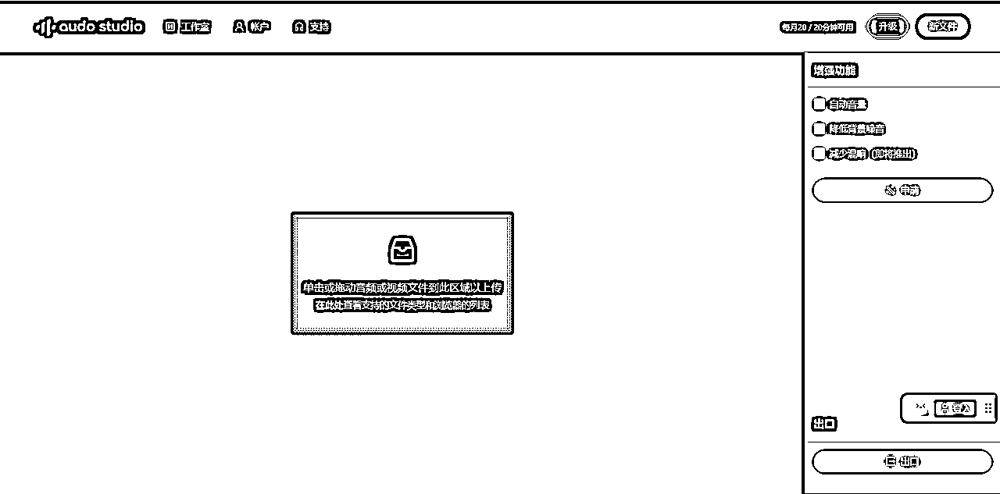

一键音频清理Ai工具，使用音频处理和人工智能的最新进展自动消除背景噪音并增强语音，可以短时间内快速处理音频，目前部分功能使用免费

### 2.voice ai（免费）

链接：https://voice.ai/

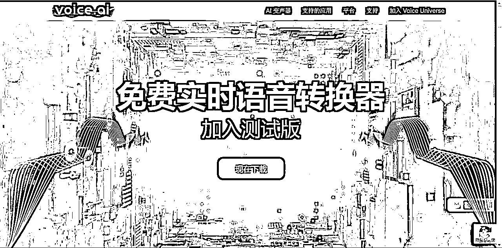

一款Ai变声器，免费实时语音转换器，适用于主播、内容创作者和游戏玩家的最佳语音转换器，可玩性非常强。

音频处理Ai目前没有发现特别好用的集结了各项功能的软件，大部分集中在降噪、增强语音，以及文字转语音、变声等方面，大家根据自己的需要，自行去选择适当的工具

## Ai设计

### 1.usegalileo（需要申请）

链接：https://www.usegalileo.ai/

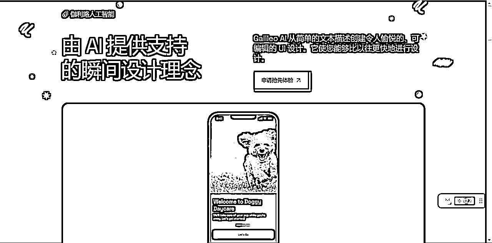

一款Ai设计工具，通过文本描述创建可编辑的 UI 设计。它可以生成比较复杂的ui

### 2.galileo ai（付费）

链接：https://magician.design/

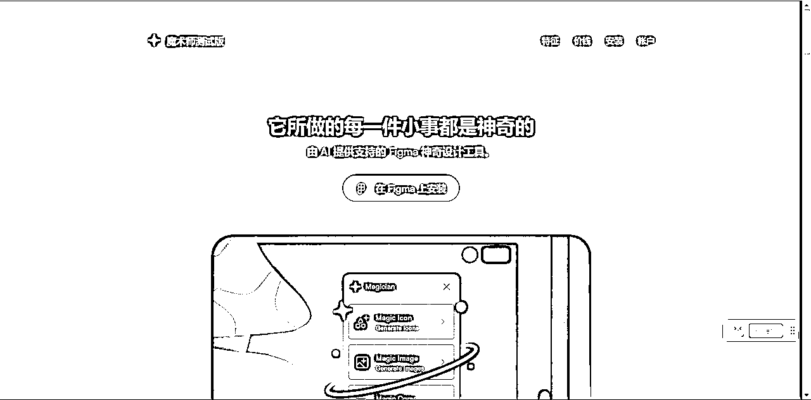

一款通过ai生成图标的设计工具，还可以生成文案和图像，价格不贵

@蛤蟆先生 https://wx.zsxq.com/dweb2/index/topic_detail/214824848845581

（Galileo AI - 文字描述自动生成界面）

## 内容检测Ai

### 1.gptzero（免费）

链接：https://gptzero.me/

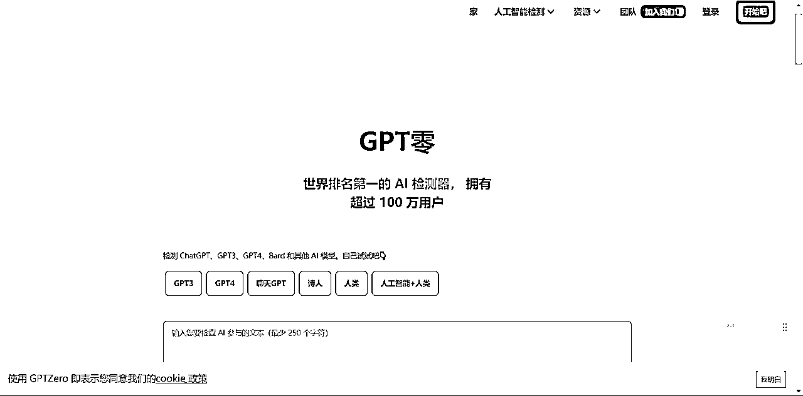

用户数量庞大，目前可以免费使用，可以检测Ai内容，包括chatgpt、bard以及其他Ai模型的内容

### 2.checkfor ai（部分免费）

链接：https://checkforai.com/

能够自动检测是否为Ai生产的内容

### 3.papercrazy（免费查重）

链接：https://www.papercrazy.cn/

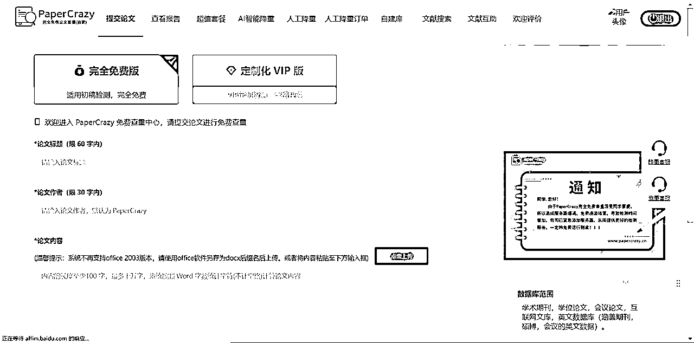

国内出版的，可以免费查重以及降重，非常好用，谁用谁知道

越来越多的ai模型生产出来的内容，Ai检测后面的运用将会非常广泛，之后会是一个非常好的赛道

## 编程Ai

### 1.github copilot（付费）

链接：https://github.com/features/copilot

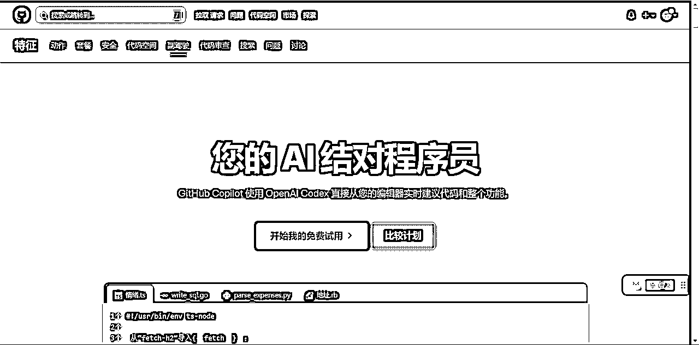

github开发的一款Ai编程工具，功能强大，可以自动处理代码，以及自动生成程序，程序员必备

@kai https://wx.zsxq.com/dweb2/index/topic_detail/181428558144552

（GPT使你不再需要自己写代码）

## 其他Ai

### 1.tutroia学习Ai（部分免费）

链接：https://www.tutorai.me/

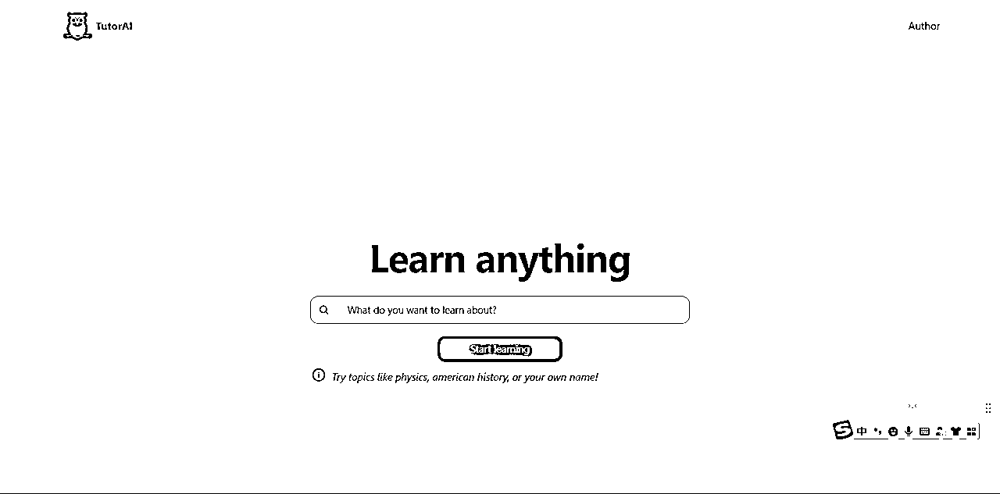

可以学习你想要的任何知识，比如学科知识，历史知识、技能、金融、各行各业的知识，根据你的水平、学习风格、喜好、进度，可以提供定制化服务。

@深度思考的瑞克 https://wx.zsxq.com/dweb2/index/topic_detail/814455412282152

（一款学习类Ai工具tuorai）

### 2.Deepl翻译Ai（免费）

链接：https://www.deepl.com/translator

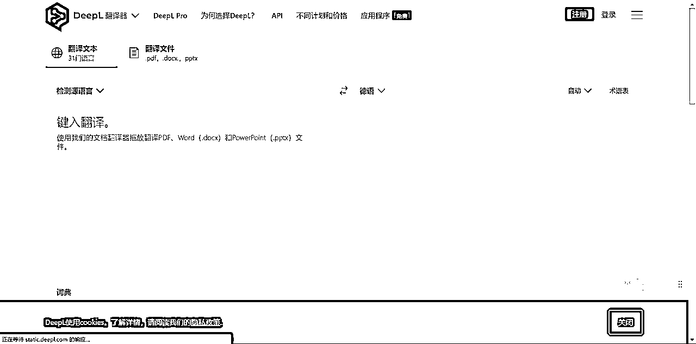

一款免费的翻译Ai工具，效果非常不错，前面也介绍了它是一款写作Ai

### 3.tarotmoon算命Ai（部分免费）

链接：https://tarotmoon.com/

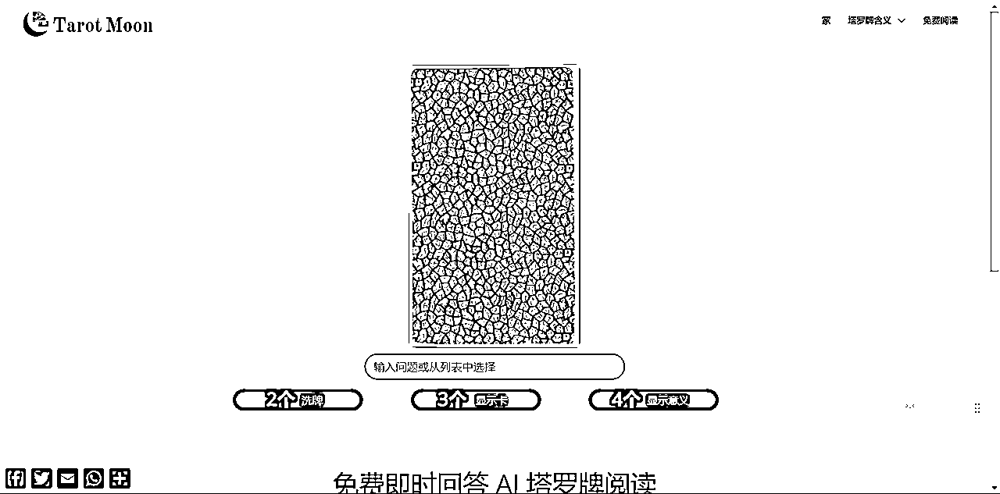

一款免费的塔罗牌Ai算命工具，提供独特的个性化塔罗牌占卜，ai免费解读，后续的更加详细的解读服务就需要收费了

很多Ai工具不太好用，在这里就都筛除掉了，上文介绍的都是常用并且效果还不错的Ai工具，大家先使用这些，后续我会继续更新，有比较推荐的工具也可以告知我！感谢大家！希望大家本次航海都能够取得一份满意的结果！