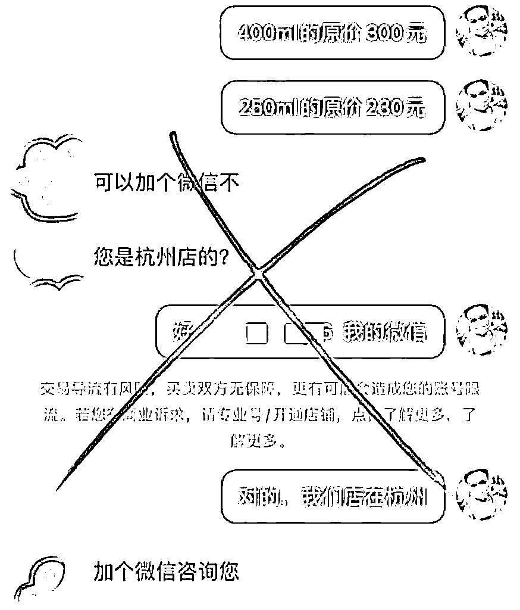
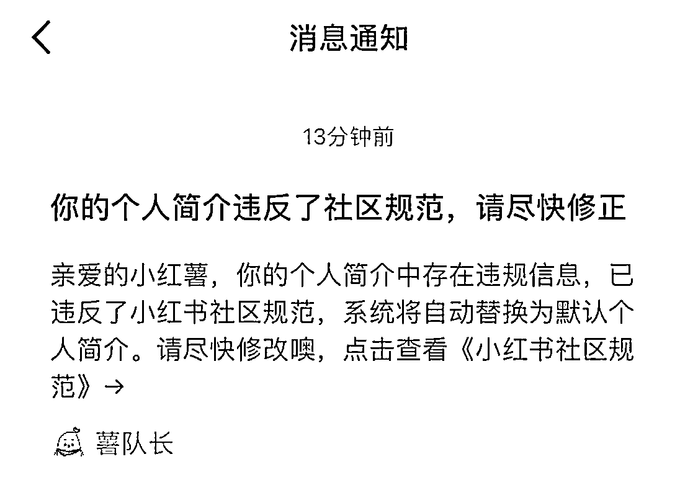
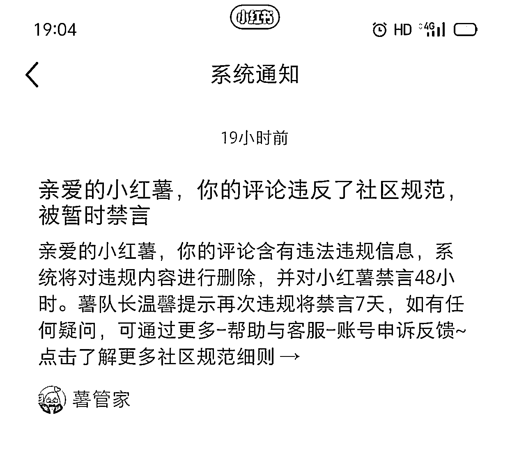
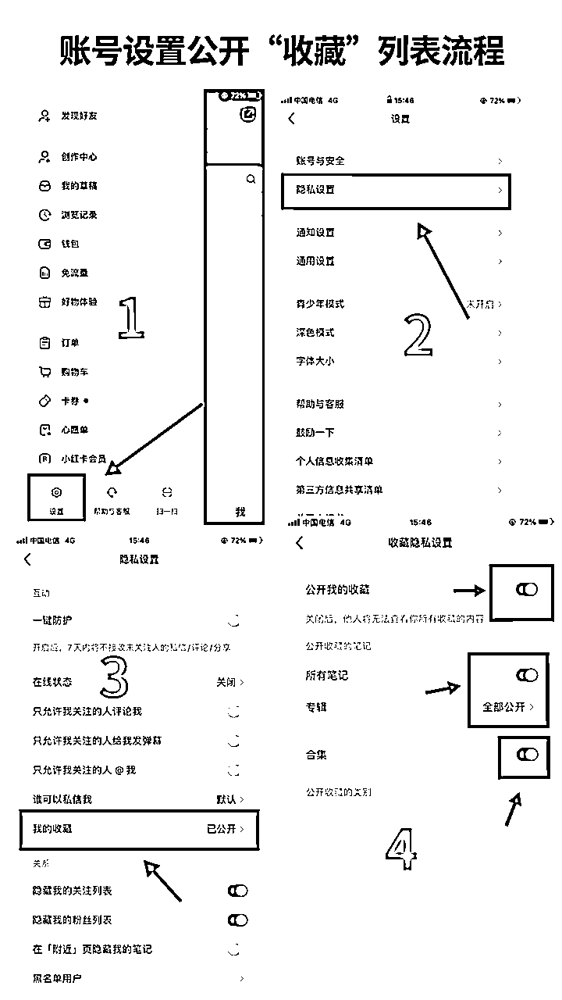
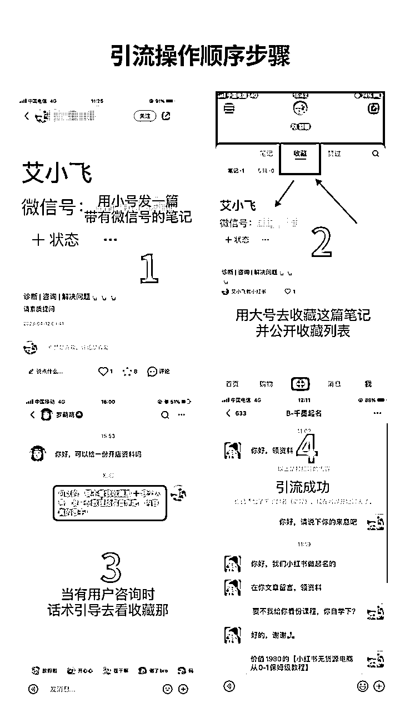
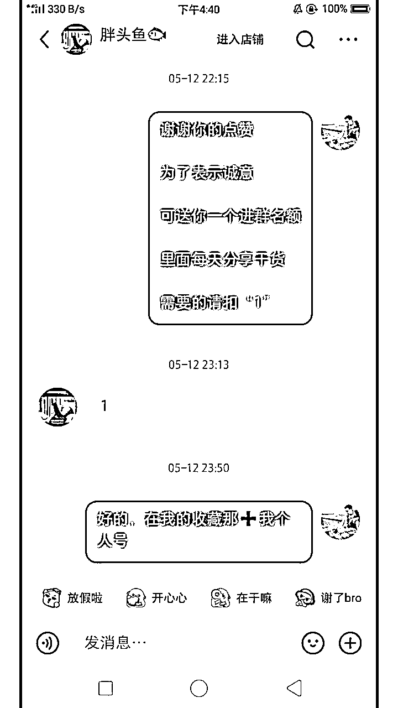
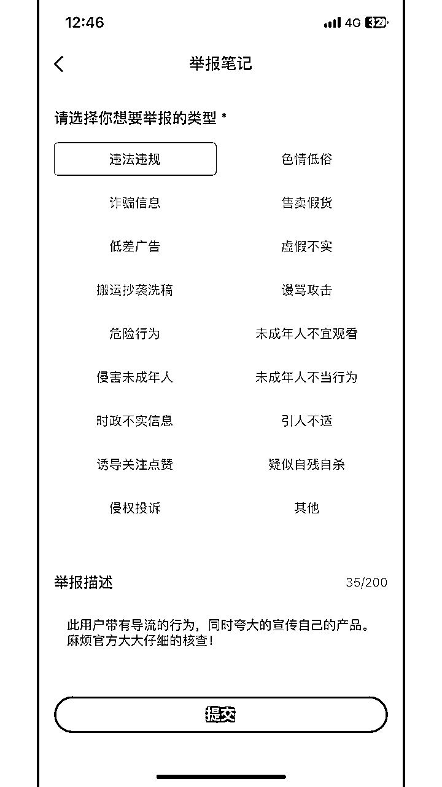

# 分享一个不起眼却很安全的小红书引流技巧

> 来源：[https://nivut760ftk.feishu.cn/docx/FIBqdxKmzoddGsxBHmMc91nInLd](https://nivut760ftk.feishu.cn/docx/FIBqdxKmzoddGsxBHmMc91nInLd)

大家好，我叫艾小飞，95后内容创作者。

个人创业3年，目前从事小红书运营和小红书无货源店铺

本篇只讲真实经历和实操技巧，不讲空话和大道理

看此篇前，需要在安静的环境下，且有30分钟以上的充足时间学习

建议在晚上睡前打开会更好，以免影响心态和理解能力

# 目录

一、前言

二、为什么会想到分享这篇干货？

三、看完这篇后你将会得到什么？

四、主流的引流方式有哪些？

五、为什么会选这个引流方式？

六、引流的实操流程和技巧是什么？

七、这个方式有哪些缺点和优点？

八、有什么需要注意的细节？

九、总结

# 一.写在前面

我相信很多做小红书的博主朋友，都会面临一个很痛苦的问题，那就是如何高效率且低风险的，把精准客户引流到自己的私人微信上，对吧

这也是很多人都绞尽脑汁知道的运营细节问题，但结果都不太理想

不过大家也理解下，小红书平台这几年花钱砸出来的流量给集中到自己的手上

他们却像个小偷一样，毫无成本的把他精准用户给偷走，换做是你，你会不会很生气，会不会处罚他，对吧

不管是在哪个平台，都不希望把自己的用户引到竞争对手的平台那，因为这样会导致平台的粘性度变低，也会损害平台的商业价值。

所以很多新人都尝试过各种引流方法到私域上，但是都会面临违规限流，甚至是封号的问题

其实当初我也是靠“偷流量”经历过来的，那么今天我就给大家分享一些纯干货的操作技巧

这个方法我亲测了5个月，目前还没有被平台封过账号，安全系数是较高的，如果满分是100分的话，我给它评到90

看完这篇后，对于想要从小红书上引流私域的朋友，这篇或许能让你打开很多的思路

# 二、为什么会想到分享这篇干货？

## 1.粉丝来诉苦

因为平时只要我有空，就会把自己所经历和掌握到的知识，分享在小红书平台上

其中有篇是关于引流私域的笔记爆了，评论区都是聊关于引流违规和限流的问题

观察他们，我也发现很多人都有引流的需求，但又害怕账号被限流，都苦于自己不知道该如何找到能高效引流，又能降低账号违规风险的办法

## 2.刚好有经验

因为他们有需求，也因此都关注了我，正好我每天做的事，都跟小红书引流有关的。

说不定我微不足道的简单几句话，就能给别人带来了帮助呢

所以今天我就以第一视角，用故事的形式，来给你们讲一下，引流的具体实操流程是怎么样的

# 三、看完这篇后你将会得到什么？

*   1.引流技巧

*   2.引流话术

*   3.避坑经验

# 四、主流的引流方式有哪些？

## 1.小红书群聊

这个是目前在小红书上最常见的引流方式，10个私域号7个都是通过群聊去导流的

那么这个引流方式的好处在于，它的效率会比较高，效果也不错，省时省力不费劲

但是同样的缺点也比较明显，虽然是用小号发联系方式，但也很容易影响到主帐号的流量和权重问题。而且经常被同行在群里截流

## 2.私信引流

这也是我最开始在小红书上用的方法，因为它简单、直接、方便。

没有那么多的流程和绕弯子，直接给用户隐晦的发私人联系方式

但有一点是比较致命的

一旦被举报或被系统检测到，那么你的帐号就会被违规提示

轻的是私信禁言，严重的是整个帐号都被限流，怎么发都没流量

## 3.主页简介

当时我的帐号被封了之后，我也尝试在主页简介用@小号的方式，引导别人去看我小号上，带有联系方式的笔记

但只要在评论区，或在私信上说关于“看我主页”“看我小号”等这些关键词，也同样被系统或被人举报到限流

所以安全系数比较低，后面我也放弃了

## 4.置顶笔记

这个方法跟主页简介的流程也是一样的，也是在评论区和私信引导别人看我置顶笔记的内容

可一旦发关于这方面的关键词，也会被提示，效果也是非常差的

# 五、为什么会选这个引流方式？

我是从去年秋天开始做小红书的，那时候无意在小红书上，分享了一篇关于视频号的干货资料，没想到小爆了，挺意外的。

然后很多人来找我咨询相关问题，那既然这样，我就想把他们都引到微信上，做一些付费咨询吧，赚些零花钱

当时我对引流的技巧不太懂，平台规则也不熟悉。我就把微信号或二维码通过私信直接发给用户

好家伙！结果账号马上被违规提醒，提示有导流风险

烦！但又不得不依赖小红书的精准流量

为了测试这些引流方式的可靠性，账号还被永久封了5个号，十多个号被私信禁言

更多的是被长期账号限流。怎么发流量都显示是0播放

刚开始心态是受不了的，不过常在河边走哪有不湿鞋，后来心态放好了，封了就换号呗

但唯独只有通过引导到【收藏】栏那，加我微信号的玩法，还是比较稳的。

这就引起了我的好奇，当时就马上有动力了，想进一步的去钻研这个小窍门

通过大号收藏小号笔记的这个方式，我相信大家做过小红书私域的博主，都应该听说过

但为了照顾有些刚接触小红书新人的感受，我可以提前大概说下流程

按顺序：

小号发篇有微信号的笔记→大号去收藏这篇笔记→大号后台设置公开收藏列表→引导用户看我的收藏列表→小号笔记有我的微信号→成功加到我的微信号

如果看着还不太明白，待会我会细嚼慢咽的跟你说，争取手把手的教会你整套流程和注意细节

先给你们看一份账号公开收藏的教程吧

# 六、具体的引流实操流程和技巧

流程是怎么样操作的呢？

我先放一张图，先看图再看文字

接下来我会讲解我实操的案例，让你们能通俗易懂一些

之前我有一篇是写小红书无货源运营干货的，通过笔记的文案中，我会有意的留下一些暗钩

比如：“你看完了这篇后，这只是无货源其中的一个小环节而已，想要学整套无货源的教程，可以后台踢踢我，或在评论区留言，我将整理一份完整版的给你，让你少走弯路”。类似这些的暗钩文案

这句话能吸引用户的同时，也能筛选掉一波不是你的用户人群，可以说是一举两得

这个时候如果他有兴趣的话，他会在评论区留言，比如评论“领资料”或者提出问题

那么我就会发这样的一套话术：

“后台踢我，我给你发份干货资料自学吧，内容真的很干！！”

从而引起更多人的兴趣，引来围观

一般用户看到这句话后，是很难抵得住诱惑力的，90%都会来后台私信我，除非他对这个不感兴趣或者不是我的精准用户

那么这个时候他来私信我之后。如果他回复的是：“你好”，或者发“领资料”之类的话，那我就会回复：“可以的，要不看我收藏那➕我个人号，发一份教程给你自学吧，内容真的很干！”

小结下

按顺序：小号发篇有微信号的笔记→大号去收藏这篇笔记→大号后台设置公开收藏列表→引导用户看我的收藏列表→小号笔记有我的微信号→成功加到我的微信号

我同时用十多个号测试过，基本上这样的加微率，能达到70%以上，也就是说10个用户来找我，基本上有7个人都会加到我，除非他不感兴趣，或者不是我的精准用户

OK，这个操作流程大概也清楚了吧

（哪里不明白的可评论区留言）

# 七、这个方式有哪些缺点和优点

我是站在客观的角度来给你们讲解这套玩法的，而不是一味的去吹捧它有多好，当然它也有不足的地方

## 缺点：

1.流程繁琐

它的繁琐程度，会比任何的引流流程都多，所以导致有一部分人，他加不到你的微信，就会来骂你

2.依赖话术

我很早之前做过话术方面的测试，之前的那套话术能引流的加微率都不到40%，给你们看看我的失败案例图吧

所以没有一定的用户感知力，用这一招是比较吃力的，而且还需要不断的去优化调整话术，来适应你的账号节奏和调性

3.被强行下架

虽然说这一套玩法，目前来说还没有被封过号，但我的小号在没有被提示的情况下，被系统强行下架过3次笔记了

我估计是别人举报的。不过总的来说影响不是很大，没有波及到我的其他每个号上

## 优点：

说完了缺点，那也要说说人家的优点吧

1.安全系数高

我认可它这套的优点，就是它的安全系数高，同时引来的用户粘性也非常的高

2.用户精准

为了测试这波引流的精准度，我每周都去用软件测试微信的“僵尸粉”，从之前删人率的10%，降到现在的2%

也就是每100个用户加到我，只有2人会删我。这是在同行来说，是有点不可思议的，接近完美的数据了

基本上加了我之后，很少人会去删我的。但前提是你一定要让他感受到，你的真诚和资料的干货性，说人话就是一定要利他，利他，利他！

3.付费意识高

而且通过这套方法引流，付费率从之前的8.5%，提升到18%，这数据对于我来说还不算很满意，很多地方还需要去抠细节，再去优化更适合自己的话术

同时，我还会自我用小号去投诉我的这个引流行为，来测试账号的抗风险能力

# 八、有什么需要注意的细节

首先第一点，也是非常重要的一点

就是你发话术给用户的时候，如果他不理解你话术的意思，千万千万不能再回复他任何的话了

为什么呢？

比如你发刚刚那套话术过去

他回复：

“这是微信吗？”，

“这是wx吗？”，

“这是要加微信吗？”这类的话

你看到后第一时间必须要他马上撤回，同时你也要马上撤回你刚刚发给他的话术

这样才能降最低风险的去保住你大号

要不然你的这个号，会被系统检测到或被他恶意举报，轻的禁言，重得整个账号都被限流。得不偿失

还有呢，如果你发了话术过去后，他依然不按照你的步骤去走，问一些无关紧要的问题

比如：

“在这里发给我不好吗？”

“为什么非要加你”

“你帮我解答这两个问题我就加你”

“付费的吗”

“不要钱我就加”

......

这种人你千万别搭理他，为什么呢？

*   第一，这种人他不是你的精准用户，纯来捣乱的

*   第二，就算把他引到微信上了，也会各种的烦你

*   第三，这种人付费率超低，你试着让他付个0.88元，哈哈简直要他的老命

*   第四，大多数举报你账号或朋友圈的，都从这种人里面出来的

# 九、总结

我相信很多人之前也听说过这个玩法，但我从这么多主流的引流方式里面，只选择了它，并细分化的去放大和优化细节

虽然这是一个不太起眼的引流方式，但他却给我带来了很多精准用户的同时，也能保住我的每个帐号不被限流和违规

因为我这个引流技巧已经用有五个多月了，经过了时间的磨合和平台的考验。到现在依然还很稳固如初

这些都是我亲自所经历过的，受过的伤是比较多了，所以我希望你们就不要再走我同样的老路了，站在我的肩膀上做事，可能会更安全更可靠一些吧

因为时间关系，这次关于引流话术方面的说得不够全面

如果你们感兴趣，下期我可以单独给你们分享，关于小红书引流话术的模板

好了，这次的分享就到这里了

如果你看完后，有哪些小细节方面不太清楚的，可以在评论区留个言，看到后我会给你解答的！

辛苦观看了！

原创：艾小飞

转载可私信

禁止搬运和抄袭

微信：aifei9977 （记得备注来意）