# GPT写作变现新手操作指南

> 来源：[https://lv9qj6hfr4z.feishu.cn/docx/GG5MdQYCgoWOhDxdSQbc4zUgnDc](https://lv9qj6hfr4z.feishu.cn/docx/GG5MdQYCgoWOhDxdSQbc4zUgnDc)

自从上一篇帖子发布之后，很多圈友吐槽我没说干货，因为上一篇帖子只是在阐述我的模式与思路，而今天，我终于要分享一些真正关于GPT写作变现的实操干货了！让我们来深入交流吧！

如果你有兴趣，可以私聊我，我会给你链接。让我们欢快交流起来，一起探讨！

今天才是GPT写作变现的实操干货分享。欢迎深度交流，可私聊链接我，有课程有陪跑社群等服务。

# 一、整体思路和变现流程AI写作入门介绍

相信大家都或多或少在新闻头条和推送中听闻过ChatGPT，但“只闻其声，不见其人”，我们可以通过哪些平台去使用它？它究竟具备什么功能呢？它可以帮助人类进行哪些工作？我们又如何利用它进行变现呢？大多数人都知之甚少。今天！就让我们一起揭开ChatGPT的神秘面纱！

不得不承认，AI是今年的大风口。本篇内容所要重点介绍的AI写作（ChatGPT）就正是一片蓝海，它就像一位随时待命的创意助手，能够在新闻、商业、科技等领域生成生动活泼的文字。不论是拯救你的写作困境还是点亮你的创作灵感，AI写作就像是你的文字小神仙，为你带来无限可能的文学奇迹！

## 首先，我们可以通过哪些平台去使用ChatGPT？

目前，OpenAI公司提供了几种方式供用户使用ChatGPT：

1.  OpenAI网站：您可以在OpenAI的官方网站上直接使用ChatGPT。登录您的OpenAI帐号后，您可以与ChatGPT进行交互，提出问题并获取回复。

1.  ChatGPT Playground：这是OpenAI提供的一个在线交互式界面，让用户可以直接与ChatGPT进行互动。您可以在Playground上输入文本并查看ChatGPT生成的回复，从而体验其功能和潜力。

1.  ChatGPT API：如果您希望将ChatGPT集成到自己的应用程序或平台中，您可以使用ChatGPT API。通过API，您可以通过编程方式与ChatGPT进行交互，并将其功能融入到自己的应用中。

1.  当然，你也可以直接在Google直接搜索ChatGPT进入官方网站使用。

通过上述介绍，我们已经知道了如何去使用AI写作。接下来，我要重点介绍如何快速的地将AI与自己的传统项目融合到一起进行变现，是我们值得思考的一个问题。实现写作变现的独特技巧。别急，让我们一起揭开这个魔幻的AI写作之门！

# 二、整体思路和变现流程

此前，我在传统写作行业中已经做了三年，今年二月之后开始实行AI写作变现，摸爬滚打中我也取得了一些不错的成绩。

在此，我不仅想总结回顾一下自己在这个领域中获得的成就，也想把自己的对于AI写作变现的思考汇聚成力量带给更多人，因此写下这篇非常适合新手的分享实操指南分享给大家！

我相信通过GPT写作赚钱的人有很多，像行业中很多人都是通过自媒体来变现的。作为自媒体小白，曾经我也在自媒体上面发表过一些相关的文章，但是效果不是很好，收效甚微。

目前我专注的方向是直接对标服务私域客户，直接为我们的甲方或者中介服务，从而赚取稿费。当然，自从今年搭上了AI这个大风口，与往年相比，我在同样的时间和精力投入下，收入翻了三倍以上！

话不多说，上干货！

今年与往年对比，差不多用了同样的时间和精力，但是收入是去年的3倍以上。

我们的整体思路其实很简单：

找到接单渠道——确认客户需求——写作——变现

首先是要找寻渠道接单，然后与客户确认写作需求，利用AI完成稿件，提交给客户，从而达成变现。

流程图如下：

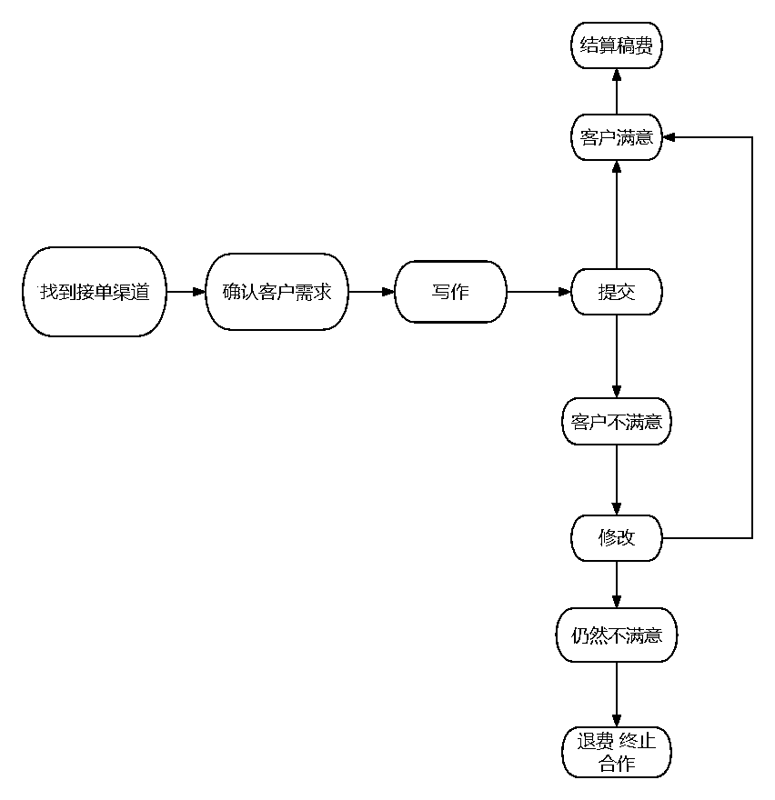

说到这里就有很多人要来问我了，找不到渠道怎么办？不知道如何写作怎么办？没有经验，能不能做呢？

我的答案是：此项目完全适合小白！只要你坚持做坚持学习，95%的人都是可以轻松赚到钱的。目前我们内测社群带了19个小白学员，变现率达到了百分之90以上，不信？

如下图所示，我们就可以知道新手完全可以尝试这个项目的。关于产品规划、渠道等方面的详细讲解，我会在下文运用4P理论，从产品、价格、渠道和促销方面进行详细阐述。

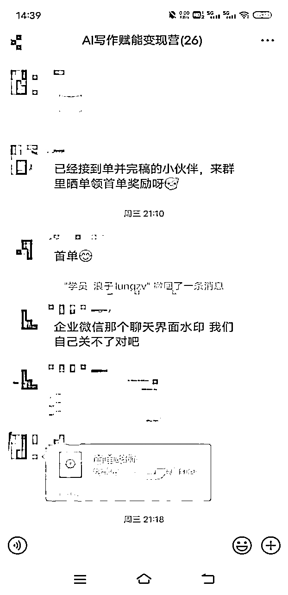

这是一件非常令人高兴的事，我的学员们首单都非常顺利，后续也几乎都轻轻松松做到了日入400+，且毫不费力。经过AI写作训练和经验积累，我们的学员愈发熟练、效率越来越高，也逐渐开始有了信任自己的私域客户。

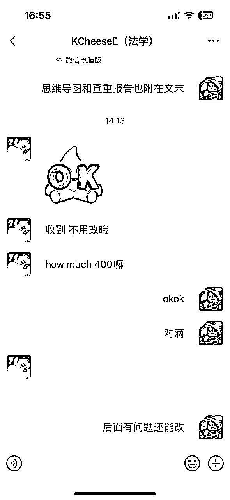

这张图也是来自我的学员，她刚刚开始起步第三天，利用AI写作两篇文献综述两个小时轻松入账四百元。

因为在这个脑力时代，文化产品永远是供不应求的，许多学生或文职工作者都非常乐意为知识付费，只要你掌握了大多数人都不了解的AI写作技巧，你就可以轻松为他人提供文化产品，同时积累自己的能力。

毕竟我们都知道：利用信息差，才是赚钱的王道！

# 三、如何操作

跟随我的步伐，手把手教你如何写稿！

## （一）产品规划

我们的产品就是文稿，其实很简单，就是把只需要把我们的需求输入给ChatGPT窗口 ，AI通过提炼、分析、加工信息，自动生成符合客户要求的稿子，有时生成的内容也许会略有偏差，但通过我们的调教技巧，最终都可以完成质量优秀的成稿让GPT完成我们客户要求的稿子。

然而，对于很多新手来说，肯定也许就会觉得很难感到有些困难，无妨，接下来我将倾囊相授，我会把调教模式分为短篇文章与长篇文章两大类来阐述。

### 短篇文章万能调教操作

### ①演讲稿

（例如我要写一篇演讲稿，要求如下：题目：决不轻言放下 字数500 用途：学生演讲）

第一步，输入稿件类型

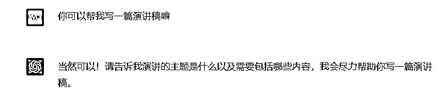

第二步，询问该类型稿件写作要求与注意事项

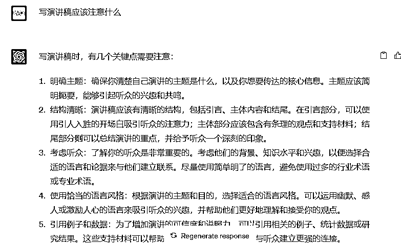

第三步，输入题目、字数与使用场景

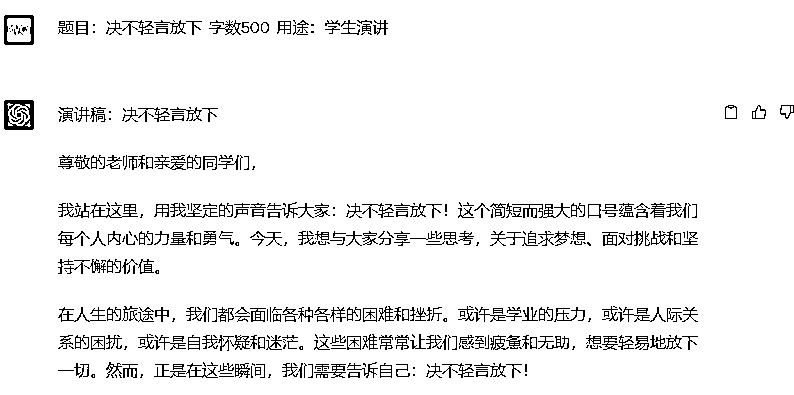

第四步，得到稿件选取有用信息

决不轻言放下

尊敬的老师和亲爱的同学们，

我站在这里，用我坚定的声音告诉大家：决不轻言放下！这个简短而强大的口号蕴含着我们每个人内心的力量和勇气。今天，我想与大家分享一些思考，关于追求梦想、面对挑战和坚持不懈的价值。

在人生的旅途中，我们都会面临各种各样的困难和挫折。或许是学业的压力，或许是人际关系的困扰，或许是自我怀疑和迷茫。这些困难常常让我们感到疲惫和无助，想要轻易地放下一切。然而，正是在这些瞬间，我们需要告诉自己：决不轻言放下！

放下意味着失去机会，放下意味着放弃希望。当我们放下的时候，我们向困难低头，向失败屈服。但如果我们决不轻言放下，我们将在每一次困境中找到力量和智慧。无论是在学习中遇到难题，还是在人际交往中面对挑战，我们都要保持信念，坚持前行。

追求梦想是一个漫长而曲折的过程，其中充满了艰辛和艰巨的挑战。但是，只有在面对挑战时，我们才能真正看到自己的成长和进步。成功的路上并不会一帆风顺，但正是在艰难的时刻，我们才能真正体验到奋斗的快乐和价值。所以，不要害怕失败，不要轻言放下！

如果我们能够坚持不懈地追求梦想，面对挑战时毫不退缩，我们将会创造出惊人的成果。伟大的发明家爱迪生曾说过：“天才是百分之一的灵感加上百分之九十九的汗水。”这句话道出了成功的真谛。只有通过坚持不懈的努力和勤奋付出，我们才能创造出属于自己的辉煌。

第五步，润色修改整理

（削弱ai的及其机器感，阐述重复的句子 删除 首先 其次 再次等 根据自身感觉完成润色与修改）

第六步，完成，交稿！

### ②新闻稿

（要求如下：客户已给出模板，要求与模板一致 字数1500 用途：发布于公众号）

第一步，观察模板，总结关键点

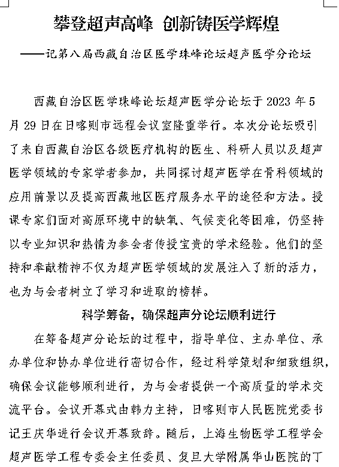

从这个模板可以看出，此新闻稿的关键是，有大标题、引言、小标题以及正文。

第二步，初步阐述要求

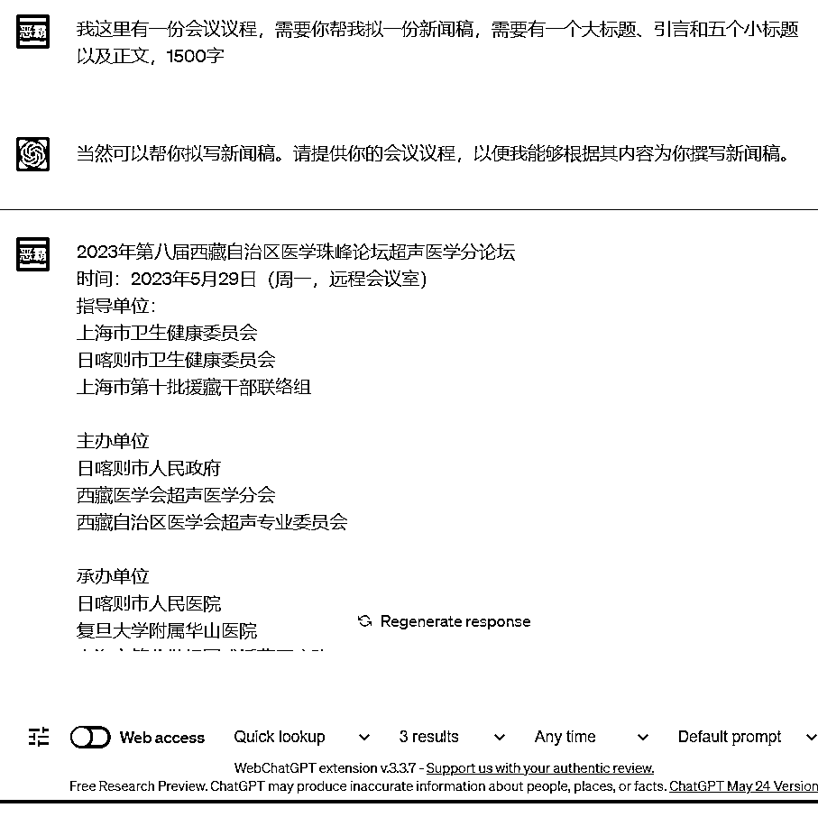

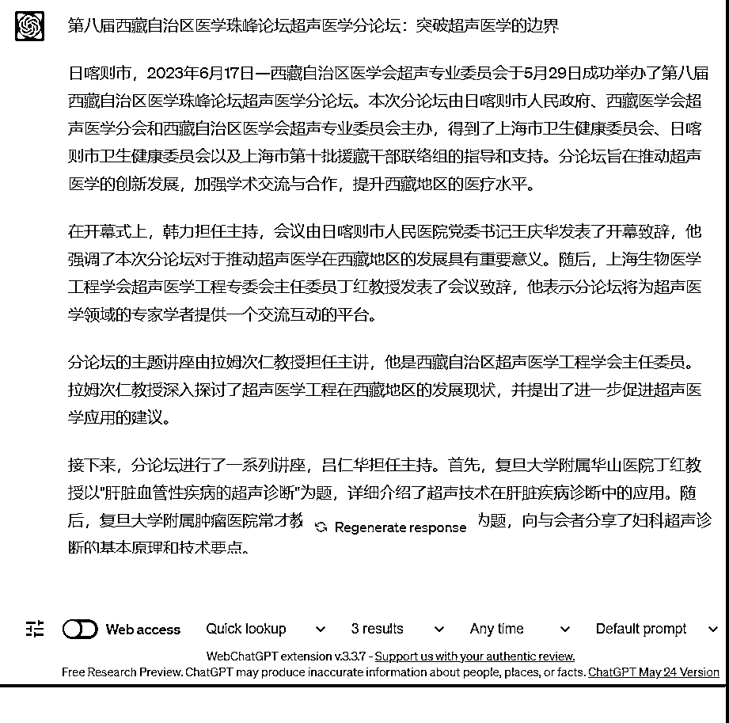

如图所示，GPT第一次的回答并不符合要求，这时候我们可以反问它。

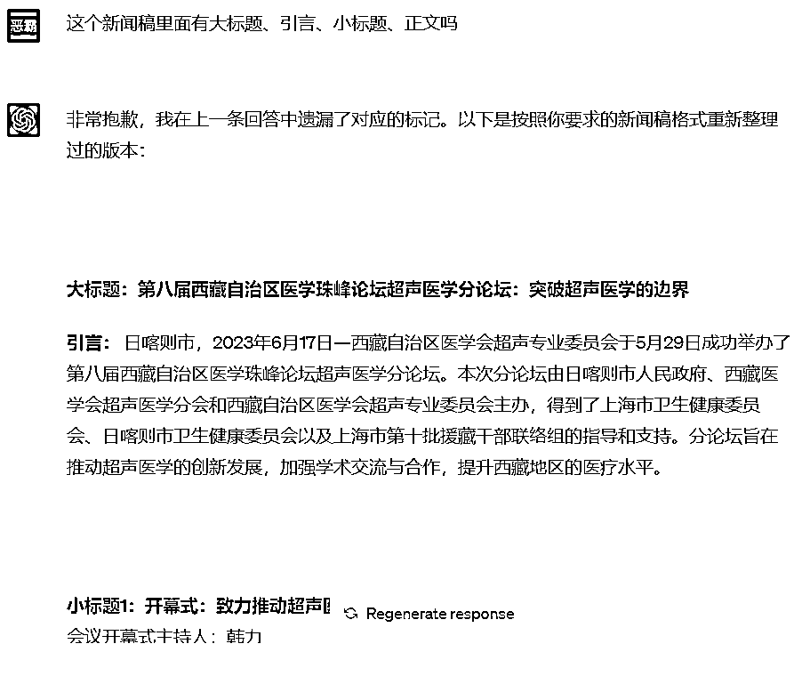

第三步，不断细化要求，让稿子逐渐往我们想要的方向走。

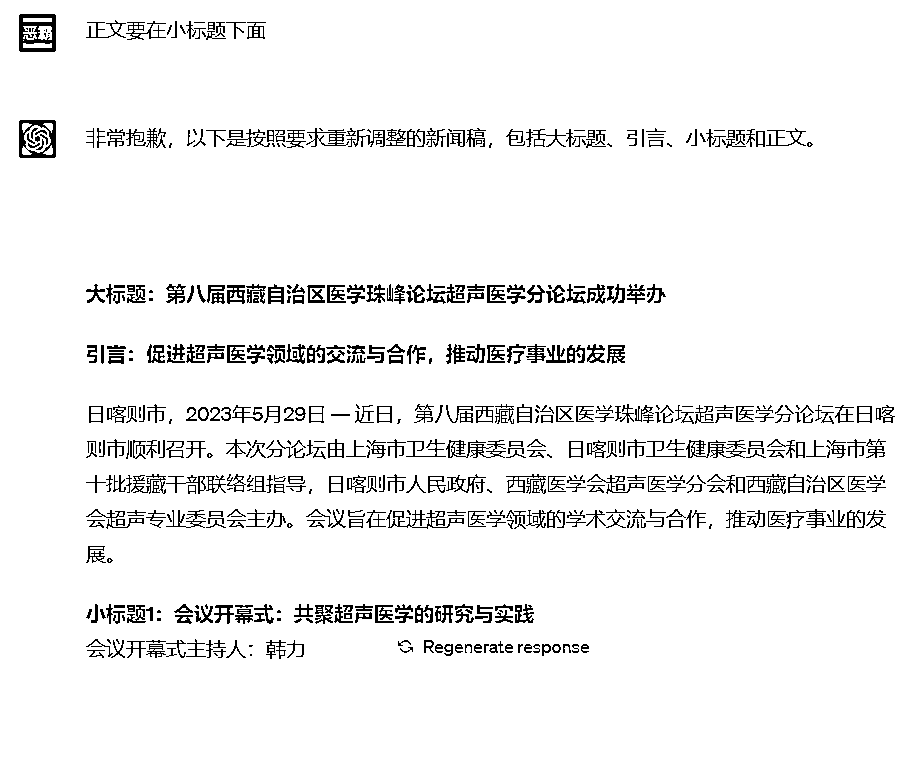

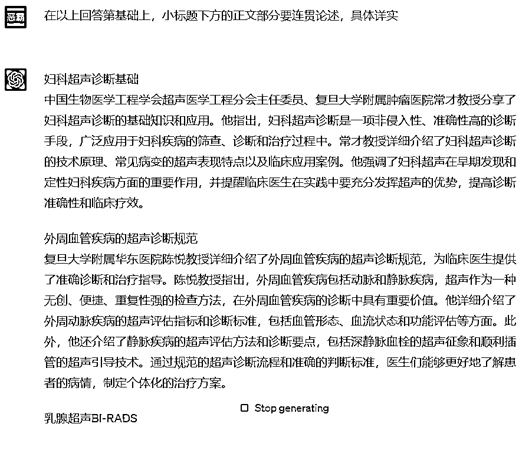

第四步，选取有用部分，得到初稿

我们首先提取ChatGPT生成的框架，不断精细化，填充内容。

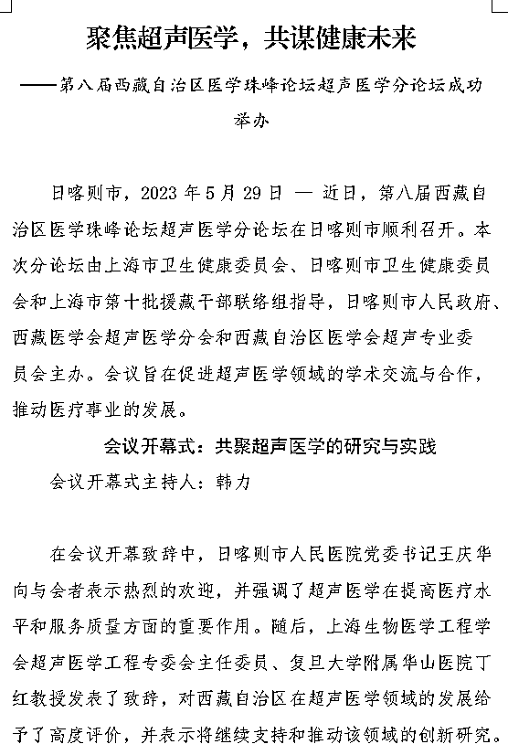

第五步，润色修改、调整格式

第六步，成稿

这样，一篇高质量、有深度的新闻稿也完成了。

### 长篇文章万能调教操作

（例如我要写一篇述职报告 要求如下：游泳教练述职报告1000字 教师述职，要求：1、一年来的工作表现(德、能、勤、绩)；2、工作中的不足；3、个人规划(教学、活动、个人成长、带队成绩等等。)

第一步，输入稿件类型

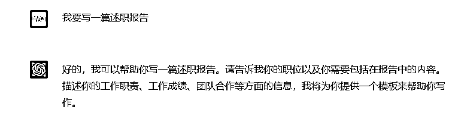

第二步，输入要求用GPT生成大纲

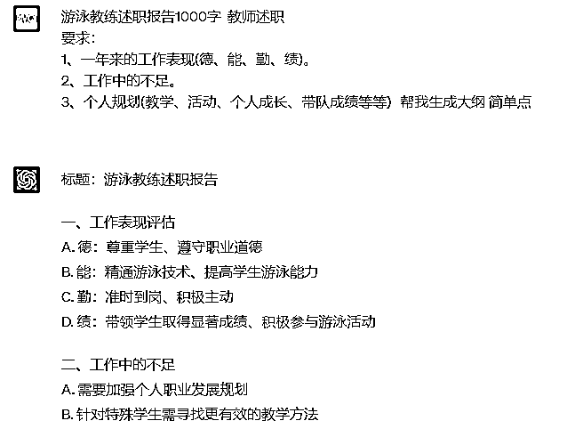

GPT生成的大纲如下：

标题：游泳教练述职报告

一、工作表现评估

A. 德：尊重学生、遵守职业道德

B. 能：精通游泳技术、提高学生游泳能力

C. 勤：准时到岗、积极主动

D. 绩：带领学生取得显著成绩、积极参与游泳活动

二、工作中的不足

A. 需要加强个人职业发展规划

B. 针对特殊学生需寻找更有效的教学方法

C. 提升与家长的沟通和协作能力

三、个人规划

A. 教学：参加专业培训、设计个性化教学计划

B. 活动：组织多样化游泳活动、参与校际比赛

C. 个人成长：持续参与专业学习、积极交流分享经验

D. 带队成绩：培养优秀选手、争取更好的成绩

四、结语：感谢学校的支持与信任，将继续努力提升自己，为学生和学校取得更大成就。

第三步，人脑优化大纲

标题：游泳教练述职报告

一、工作表现评估

A. 德：

B. 能：

C. 勤：

D. 绩：

二、工作中的不足

三、个人规划

四、结语

第四步，根据每一个小标题生成相应章节

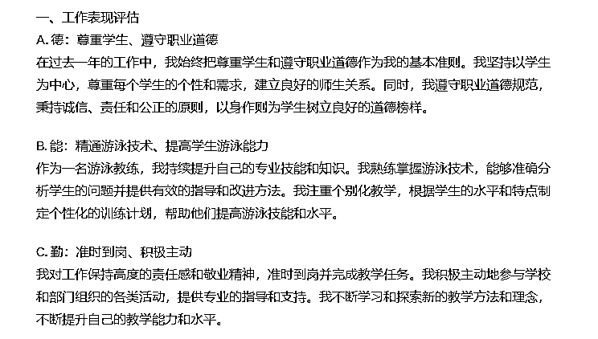

第五步，整合全文

标题：游泳教练述职报告

一、工作表现评估

A. 德：尊重学生、遵守职业道德 在过去一年的工作中，我始终把尊重学生和遵守职业道德作为我的基本准则。我坚持以学生为中心，尊重每个学生的个性和需求，建立良好的师生关系。同时，我遵守职业道德规范，秉持诚信、责任和公正的原则，以身作则为学生树立良好的道德榜样。

B. 能：精通游泳技术、提高学生游泳能力 作为一名游泳教练，我持续提升自己的专业技能和知识。我熟练掌握游泳技术，能够准确分析学生的问题并提供有效的指导和改进方法。我注重个别化教学，根据学生的水平和特点制定个性化的训练计划，帮助他们提高游泳技能和水平。

C. 勤：准时到岗、积极主动 我对工作保持高度的责任感和敬业精神，准时到岗并完成教学任务。我积极主动地参与学校和部门组织的各类活动，提供专业的指导和支持。我不断学习和探索新的教学方法和理念，不断提升自己的教学能力和水平。

D. 绩：带领学生取得显著成绩、积极参与游泳活动 在过去一年的工作中，我带领学生取得了显著的游泳成绩。多名学生在比赛中获得奖项，展现了他们的优秀水平和潜力。我积极参与学校组织的各项游泳活动，为学校赢得了荣誉和声誉。

二、工作中的不足

在工作中，我意识到自己还存在一些不足之处，需要进一步改进和提升：

需要加强个人职业发展规划，进一步提升教学水平和专业能力。

针对特殊学生，如水性差、水性恐惧等，需要寻找更有效的教学方法，提供个性化的支持和指导。

在与家长的沟通和协作方面，需要进一步改进，加强与家长的联系和合作，共同关注学生的发展和进步。

三、个人规划

为了不断提升自己，我制定了以下个人规划：

教学：积极参加专业培训和学习，深入了解最新的游泳教学理论和方法，提供更优质的教学服务。

活动：组织丰富多样的游泳活动，激发学生的兴趣和参与度，提高他们的游泳技能和水平。

个人成长：持续参与专业学习和教研活动，与其他教师交流分享经验和教学方法，不断提升自己的教育素养和能力。

带队成绩：培养更多的优秀游泳选手，争取在校际比赛中取得更好的成绩，为学校赢得更多荣誉。

四、结语

感谢学校的支持与信任，我将继续努力提升自己，不断改进和成长。我将坚守德能勤绩的原则，为学生的成长和发展贡献自己的力量，为学校的发展做出更大的贡献。

第六步，润色修改

第七步，完成交稿

### 小结

通过以上例子，大家是不是对AI写作有了初步了解，怎么样，是不是很简单？

总结：我们要通过GPT的特性去投喂内容，锁定要求，必须掌握以下几个原则：

原则一：简洁明了

简洁明了的提问类型有助于GPT快速理解需求，减少不必要的信息处理。

错误示范：

题目:题目自拟，与侵权法中的监护职责有关的题目 (在本组范围的选题范围内展开)，例如《浅谈流浪动物致人损害的责任承担主体》等，注意一定要落在一个具体的点，不能宽泛地去进行讨论,如《浅议我国的网络侵权行为》太宽泛需要增加限定词譬如《浅议计算机软件网络侵权行为中的XXX》。

正确示范：

我要写一篇论文，选题范围：侵权法中的监护职责，论点不可以太宽泛，请给我至少三个论文题目。

原则二：清楚明确

清楚明确地写出范围有助于GPT知道如何回答，从而提供更具针对性的信息，比如设置上下文，多添加定语。

错误示范：

请让以上文章更具体详实。

正确示范：

请在以上文章中具体说明：XX战争是如何取胜的，作者通过列举想说明什么？

其实大部分的文章都可以用这套逻辑快速产出，但是若想做出高质量的稿件，一定要耐心询问客户要求，对ai产出的大纲与内容加以完善，润色修改整理。

还有很多类型的稿子有不同的操作，这里我只简单举了两几个例子帮助大家理解，因为不同类型的文章很多要求都不一致，因此我们需要做到就事论事，具体问题具体分析。

## （二）价格设定

### 对标中介单

如果接中介单，了解各个公司的价格体系，并选择符合自己认可的价格范围。随着与中介的合作关系发展，适时提出提升价格的要求。

基本上如果是中介单的话，每一个公司都会设立自己的价格体系，新手接单只能按照公司的要求选择自己认为合适的价格来接单，如果你与你的中介关系逐渐密切，可以适当要求提升价格。

中介单的价格参差不齐，我建议最低标准按千字20起步。事先一定要问清楚要求和交稿时间确认好再接，避免出现误解导致烂尾，新手一定要保障好自己的权益。

### 私域客户报价策略

可以根据不同服务和需求设定不同的价格。可以制定一个整体的价格标准，或者采取分层次分阶段的报价策略。确保价格合理并与服务价值相匹配。

面对私域客户，就需要我们自己报价啦

首先可以像我一样设定一个整体的价格标准，如下表。

| 荷包蛋论文辅导 |  |  |  | 增值服务 |  |
| 函授 | 初稿 | 800 |  | 文科降重 | 千字60 |
|  | 包修改 | 1200 |  | 理科降重 | 千字80 |
| 专科 | 初稿 | 800 |  | 格式校对 | 5元/页 |
|  | 包修改 | 1200 |  | 答辩PPT | 200 |
| 本科 | 初稿 | 800 |  | 修改3次 | 400 |
|  | 包修改 | 1800 |  | 修改5次 | 700 |
| 特殊要求 |  |  |  | 修改8次 | 1000 |
| 有问卷 | 初稿 | 基础报价+300 |  |  |  |
|  | 包修改 |  |  |  |  |
| 有模型 | 包修改 | 3000-5000 |  |  |  |
|  |  |  |  |  |  |

另外也可以采取分层次分阶段的报价策略，例如以一万字的文章为基础可以这样子和客户报价：

只要初稿600

初稿➕3次修改1000

初稿➕5次修改1200

初稿➕8次修改1500

初稿➕10次修改1800

1次修改300

3次修改800

5次修改1200

8次修改1500

10次修改1800

## （三）渠道开发

可以接单的渠道有很多种，在这篇文章中我主要举例三个方式。

### 淘宝店铺

搜索淘宝店铺，私聊客服，完成面试进入接单群，淘宝店铺的优势就是，靠谱。

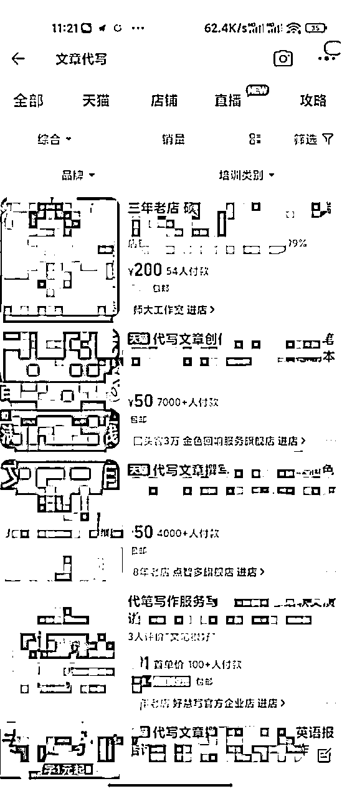

### 公众号搜索

在公众号上搜索相关关键词，链接中介，成为写手开始接单。

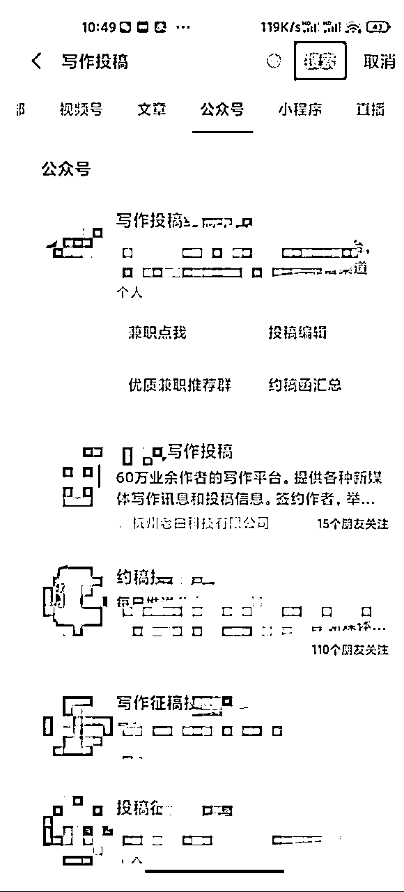

### 各种相关群

QQ搜索相关的群，进入群聊蹲单，慢慢把公域转化私域。

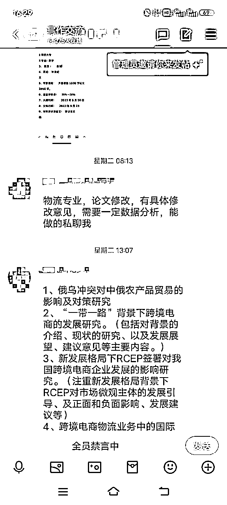

## （四）提高转化

我先来简单阐述一下我想分享的几个营销方式与技巧。

### 服务营销实操

服务营销是一种强调客户关系管理的营销策略，它将客户服务作为吸引和保持客户的关键。它的目标是提供高质量的服务，以满足客户需求，并通过建立客户忠诚度和口碑来促进销售和增长。

服务营销主要关注以下几个方面：

A.提供高质量的服务，以满足客户需求和期望。

B.建立客户关系，了解客户需求和反馈。

C.在客户服务的过程中，提供额外的价值，超出客户期望。

D.发展客户忠诚度，使其成为长期客户，并吸引新客户通过口碑宣传。

服务营销的核心是客户满意度，因此服务营销需要专注于客户需求和期望，提供个性化的服务，以增强客户满意度并建立长期关系。服务营销可以通过各种方式实施，例如提供更好的售后服务、增加客户支持、提供高质量的产品和服务等。

我的客户将近一半都是学生，很荣幸，找我供稿的学生很多都和我成为了无话不谈的朋友，我们都是从学生时代过来的因此我很理解现阶段学生客户的想法与焦虑，我来简单的分享两个例子。

例如这个客户

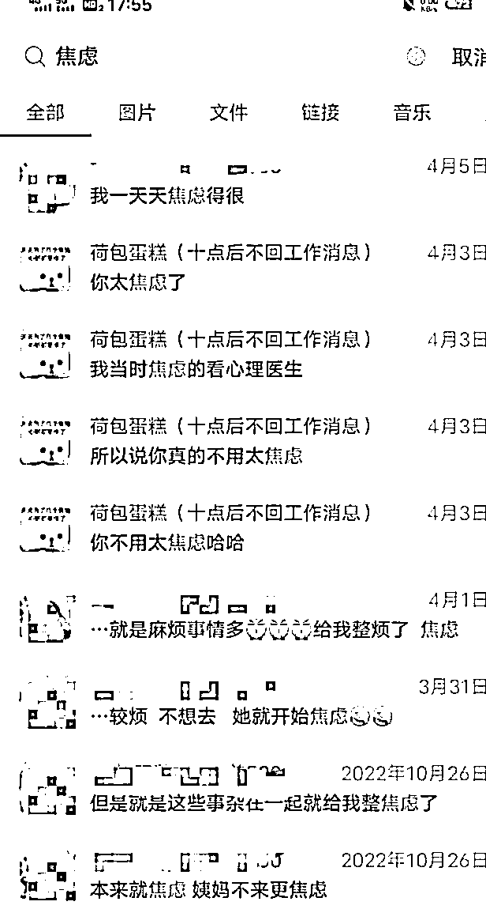

因为稿子反复修改，她多次跟我阐述她的焦虑，焦虑的天天做恶梦大姨妈都不来了，我多次耐心的劝导她，最后帮助她成功改完了所有稿件，也加深了客户粘性。

因此我觉得【共情能力】在我们日常的对接过程中十分的重要，并且我提供了附加的【情绪价值】。

再例如

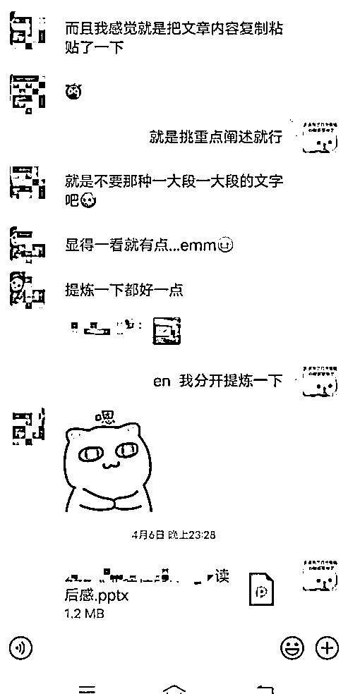

面对客户的反复修改要求，我都会尽量满足，我的原则是只要我可以完成我就尽量帮助客户改到最后一稿，有时候往往一稿要改七八次，但是我乐此不疲。我想给我提供完美的一对一私人订制的服务，让客户满意的无话可说，因此回购客户或者老带新推荐来的客户特别多，因为他们都特别信任我，知道我提供的稿子质量好，服务也很周到，慢慢积累，完成了初步的裂变，同时增加了客户粘性与复购率。

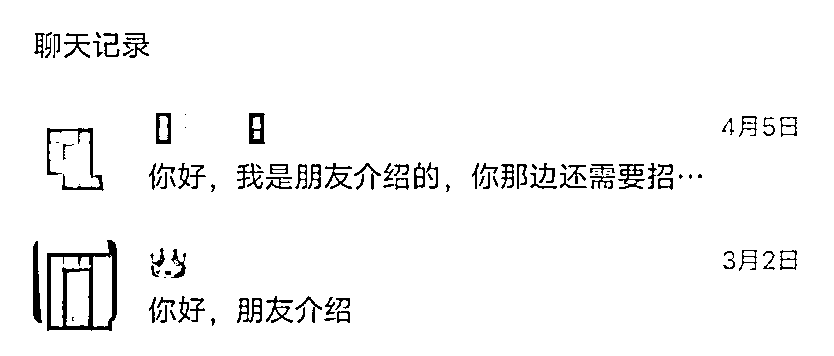

### 个人IP打造

当我们的业务水平越来越高，客户群体越来越大，我们就可以打造个人IP啦。

首先，你要有自己的IP定位。向公众宣传自己，包括个人简介、写作样本、作品集和客户评价等，确保你的写作资料展示你的专业能力和经验。

如下图所示：

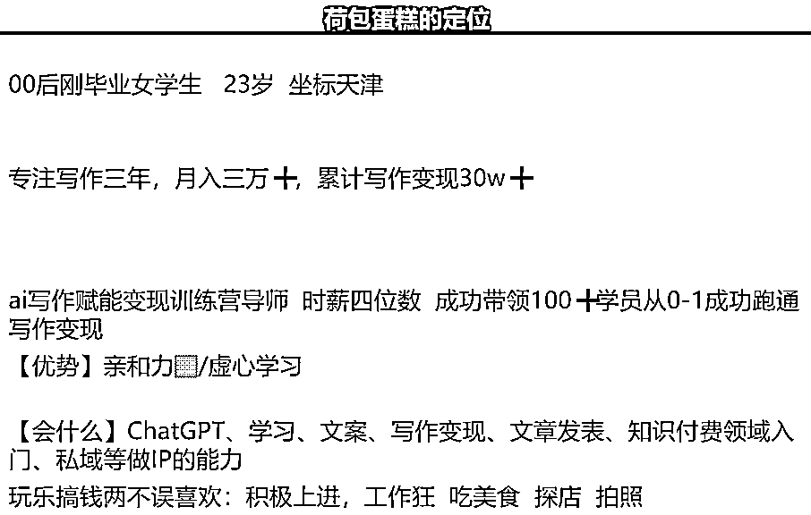

其次，你的个人界面要完全充分地展现自己，例如：

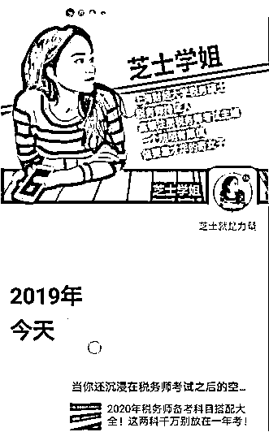

另外，你也可以在社交平台发布有用的信息和见解，这可以是文章、博客帖子、专栏、指南等形式，吸引潜在客户或读者的兴趣。

### 病毒式营销实操

病毒式营销（Viral Marketing）是指借助社交网络和传播渠道，通过用户自发的分享和推广，将产品或服务的信息迅速传播开来，从而快速扩大品牌影响力和用户群体的一种营销方式。

这都是大家玩剩下的模式了，但是不得不说真的很好用。

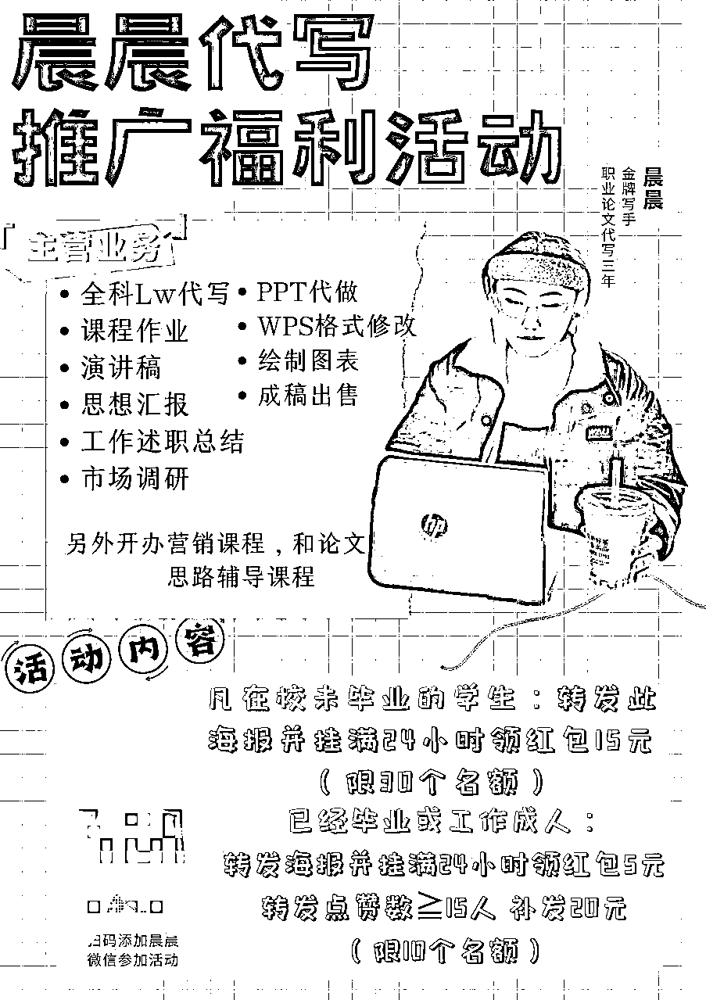

我妹妹帮我做了这样一个海报

转发得红包，前期投入不用太多，只要你的产品质量口碑都不错，在加上这样一点点的推广活动，可以吸引到大量的潜在客户群体。

# 四、下场赚第一块钱吧

通过前面的讨论和分享，相信你已经对GPT写作变现有了一定的了解，并且领悟了一些实操的方法和策略。那么现在，是时候迈出第一步，开始赚取你的第一块钱啦。

去行动就是赚取第一笔稿费的关键一步啦！过程中也别忘了保持自信和耐心哦~

赚取第一笔收入可能会花费很多的时间和努力，但只要你持续学习和改进，适应市场的变化，并与行业保持同步，你一定能够取得更大的成功。

相信自己的能力，相信你所提供的价值。迎接挑战，坚持不懈地追求你的目标。下场赚取你的第一块钱吧，这将是你迈向成功的第一步！祝你好运！