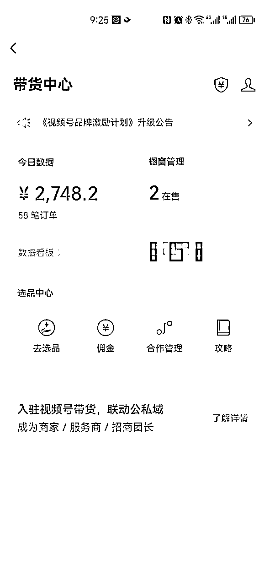
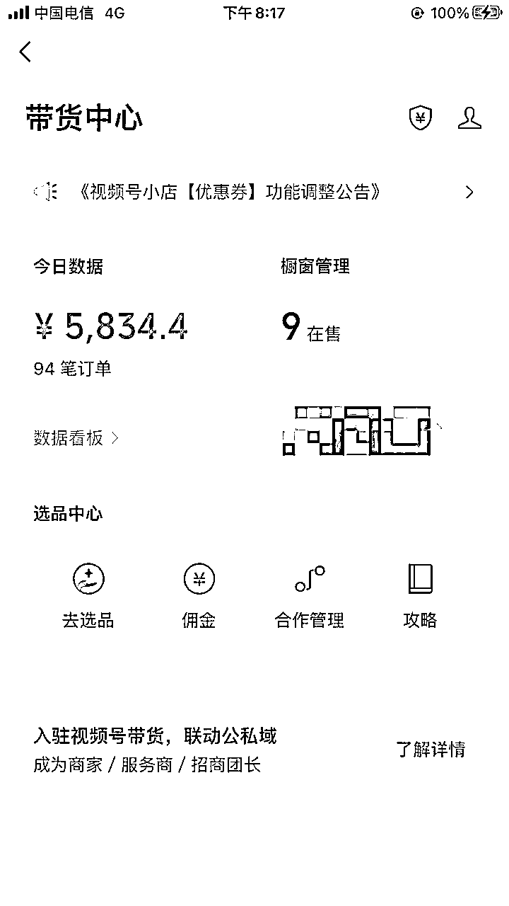
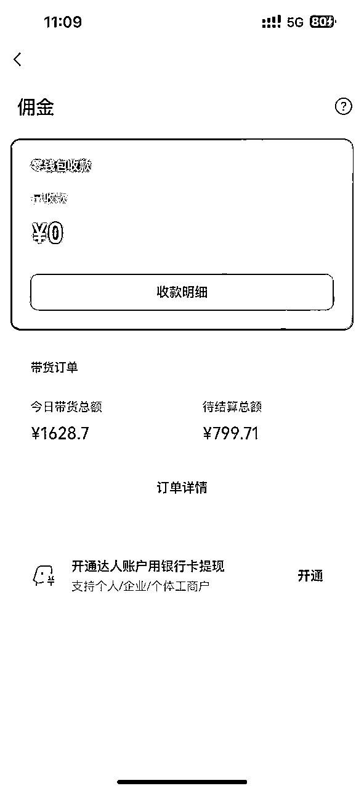
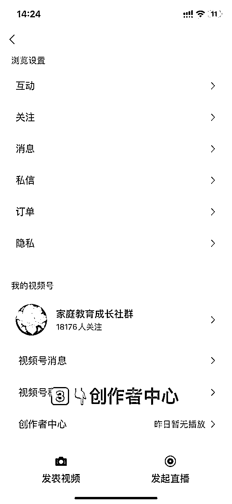
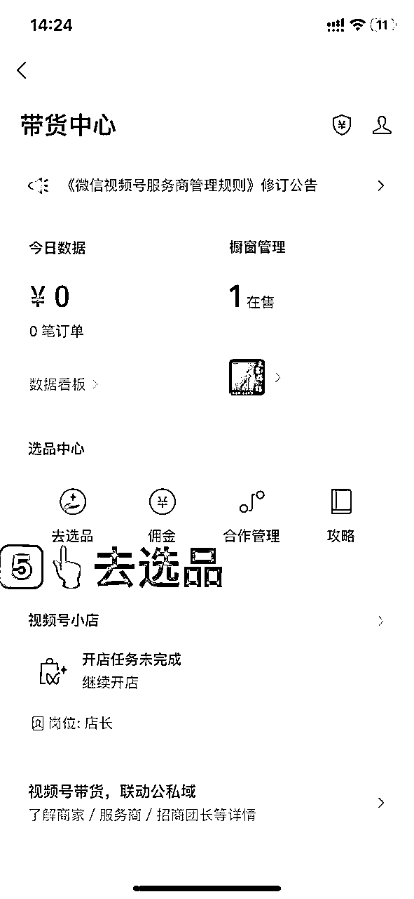

# 2天视频号短视频5w＋变现分享（抄作业啦）

> 来源：[https://k4h4dcpi91.feishu.cn/docx/GJh0dHJVgoB1L5xb6p3c5uKVnCf](https://k4h4dcpi91.feishu.cn/docx/GJh0dHJVgoB1L5xb6p3c5uKVnCf)

大家好，我是小李同学。特别爱折腾的98年陕西小伙子。干过服务员，也自学摄影创业过疫情到来，干过健身教练，也民宿创业过，目前是在厦门创业做电商。从对电商毫无概念，到现在埋头苦干有点思路，非常感谢社群里的诸位大佬们的文章和私下的帮助，希望有机会可以跟厦门和杭州的圈友链接（经常会去杭州学习）。

先放成绩（，下面是三个账号的成绩，其它的就不一一展示了）

4.18日加入的生财，第二篇发帖，真的感谢生财让我打开认知并一步步成长。话不多数，直接开始。之前写过的一篇，大家也可以看看

正文内容如下：

一，账号搭建

二，抄对标爆款模版

三，找素材

四，剪辑发布

# 账号搭建

账号：一个身份证可以认证5个微信账号，一个微信账号开通一个视频号，开通后根据品类起名，最近好卖的是经文类和文昌塔这种与考试相关的品类。

名称及备注：名称中不能出现和佛教，道教有关的名称，然后就是备注，我卖的是经文品类，账号起名后简介简单干脆：视频同款商品在👇🏻购买

选品加橱窗流程（用个废的视频号演示）：

选品广场搜索产品名后添加至橱窗。

# 抄对标爆款模版

经文产品视频举例：

1.  视频内文案一比一模仿，背景音乐照搬，时长一比一模仿

1.  替换视频素材，有条件的最好去原创后半部分内容的抄经书及场景素材，保持至少百分之七十的原创度

1.  能否打开流量层级前三秒很重要，建议最好选择有场景感的画面

# 找素材

1.  一级素材产地：抖音，快手（不要从视频号搬运）。根据产品名找抖音对标账号，例如经文，就在抖音搜经文，筛选转发没那么多的素材，防止被过度搬运，搬运多次的素材我们再搬运剪辑较大概率是做无用功

1.  二级素材产地：微博，记录片（佛学类）。找素材的时间成本较高，但素材基本没有被搬运过，很容易过审，剪辑没问题的话较大概率取得不错的曝光。

1.  A视频用过的素材即刻丢弃，B视频再用的话极容易废号，建议大家开始就建立素材库（前期测试不用多，3至5条视频的素材量即可）

# 剪辑发布

剪辑就不多说了，很多剪辑教程社群里都有，重点强调新人一定注意要避免的坑，因为我踩过，不希望大家踩。

1.  先跑通有把握，再复制。当我一个账号跑通但未完善经验时，立马注册了4个，第二第三个账号踩了坑，例如素材不能重复使用的坑，死了两个账号，所以圈友们千万注意。

1.  发布时间段。周内最佳时间段是每天的晚上7点后，周末全天都可。

1.  心态。视频号不同于抖音快手，数据反馈并不及时，有的视频两三天才有正反馈，有的视频几分钟几小时就有反馈，我们控制不了数据，但可以控制作品的质量，同时这个项目可能周期并不久，建议大家抱着跑通学习心态，而不是要赚多少多少。

诸位圈友，共同学习，无限进步！（有帮助的话，点个赞呗🌹）