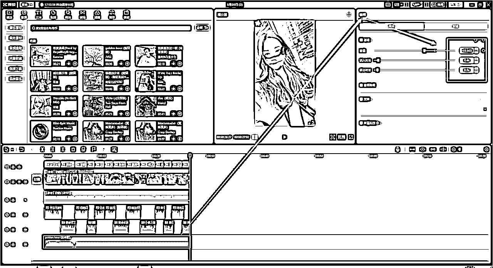
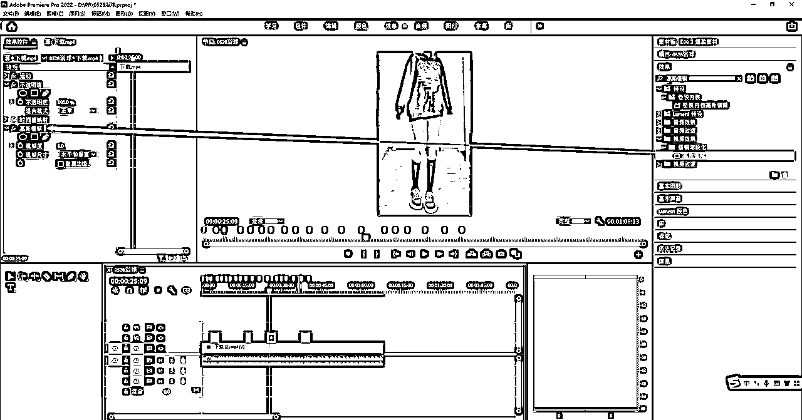

# 小白友好向——5分钟快速上手视频剪辑

> 来源：[https://betteridea.feishu.cn/docx/H0yedmj1QoEPPfxSLSCcED7xnZb](https://betteridea.feishu.cn/docx/H0yedmj1QoEPPfxSLSCcED7xnZb)

# 一、工具选择

## 主力工具

PR+剪映

### 1.1 剪映：

剪映专业版-全能易用的桌面端剪辑软件-轻而易剪 上演大幕

### 1.2 PR

百度云

链接：https://pan.baidu.com/s/1n08I03YjDhwyGnFqtQ7ovw

提取码：eakd

PR安装教程：https://zhuanlan.zhihu.com/p/456842774

## 辅助工具

### 2.1 losslesscut软件

GitHub - mifi/lossless-cut: The swiss army knife of lossless video/audio editing

用于素材的快速分割，批量导出每一段分割好的素材。

缺点是需要手动对素材分割，剪映可以智能分割，但是不能一次性分段导出每一个素材片段。

windows系统直接用这个。可以直接下载。

补充losslesscut使用教程 ，也可以搜一下中文版本

4.64 ZzG:/ “原汁原味”无损视频剪辑—LosslessCut，你值得拥有@西瓜视频 # 视频剪辑 # 实用软件 https://v.douyin.com/UaoJWcJ/ 复制此链接，打开Dou音搜索，直接观看视频！

### 2.2 哼哼喵

开通/续费会员 - 亨亨猫去水印

这是个付费软件，很好用。

抖音素材下载平替工具，可以选择【抖快助手】小程序，每天提取20条。

# 二、新人最快上手路径

## 剪映的PC版是最上手最快的

下载后，记得在 【剪映学习中心】学习基础操作

https://www.capcut.cn/learning

先看新手必看就行

进阶功能学习，推荐看抖音【楠哥的课】

直达链接：长按复制此条消息，打开抖音搜索，查看TA的更多作品。 https://v.douyin.com/U5W2SwC/

想要学啥功能直接去搜，基本3分钟学会一个功能。

### 1.1 开始创作

注意到【开始创作】和【导入工程】，剪映是可以直接打开PR的工程文件的，很赞，尤其加字幕

主界面选择【导入】素材，将选中的素材拉入主轨道

然后做对应的剪辑操作，分割，翻转，放大，变速等

附上快捷键

### 1.2 字幕处理

素材粗剪完成后，先做【音轨分离】ctrl +shift+s ,然后选中音频，鼠标右键，选择【识别字幕】

可以对字幕进行调整，选择样式，字体

### 1.3 音轨替换

可以选择字幕功能的朗读，重新替换【音轨】

同时，关闭原来的音轨

### 1.4 新增BGM

去抖音创作者中心选择爆款音乐，【热歌榜】或者【飙升榜】都行

在【音频】——【音乐素材】下，搜索自己选的音乐，点击小加号【+】，选择使用，注意对齐开头

过长的部分，ctrl + B 分割，删除多余的部分

选中【音频】，调整【音量、淡出和淡入】，如果是口播，BGM音量-15，人声+8，如果是纯BMG卡点素材，BMG+8，可以根据自己的观感调整。

当然啦，在合适的地方可以添加合适的【音效】

### 1.5 增加贴纸

可以在视频合适地方，增加下单引导的贴纸。

### 1.6 转场滤镜

可以根据自己的需要加转场，或者滤镜，也是去重的操作。

## 进阶的PR是效率提升的神器

### 2.1 基础设置

一定要提前设置好PR的参数，咱们是竖版9:16的视频

主要是项目名称，方便找源文件

储存地址

### 2.2 新建序列

【项目】板块，选择【序列】

为序列命名，方便找工程文件

这是重点，做【基础设置】，一共四部

1.  帧率选择30

1.  帧大小：1080-1920

1.  方形像素

1.  点击保存预设

### 2.3 素材导入

鼠标左键选中素材文件夹，直接拖拽到工作区，当然你选择搜索打开也行

将对标的素材拖拽到工作区，因为我们的素材分辨率不一样，就选择【保持现有设置】

调整素材【帧大小】

选择【缩放为帧大小】，保持尺寸一致

### 2.4 素材分割

PR的分割是【剃刀工具】，对应英文输入法状态下的 C 键

还可以用【打标工具】，第二个箭头，快捷键是英文下的 M 键,对素材打上标记，方便分割。

分割的逻辑

1.  关键帧的位置，就是画面前后不一致的位置；

1.  口播文案一句话的结束，因为对应的是音画同步；

这两个位置是剪辑的参考点

### 2.5 素材混剪

这里细分3个操作

1.  双击素材，素材将出现在上方【源】窗口

1.  用两个小括号去标记需要用到的画面，对应英文输入法下的 I 和 O 快剪辑

1.  将圆圈中的视频素材拖拽到序列中，打好标记的位置，提前打标记，提升效率，快速定位素材位置

完成之后，可以检查下有没有跳帧，跳帧的位置容易在分割点的左边或者右边。之后，也可以在PR中完成调色。

### 2.6 视频导出

使用 ctrl+M 导出素材

## 剪映和PR联动提升素材过审

### 3.1 工程文件

使用剪映打开PR的工程文件，粗剪的部分就都全在剪映里面了

### 3.2 精剪操作

就是在第一个环节中介绍的部分，依次去调整

1.  字幕提取

1.  字幕朗读

1.  BGM替换

1.  视频镜像，放大、缩小，裁剪

1.  滤镜调色

1.  贴纸增加

### 3.3 特别说明

这个工作流程，仅仅是我最顺手的工作流，可以根据自己的使用情况做调整，PR也有好用的插件工具。

剪映的痛点，在于不能直接从预览的素材中快速选中需要的片段，PR就很方便。

PR的痛点，对于小白来说，是加字幕不方便，镜像、缩放，贴纸，滤镜，没有剪映简单。

# 三、PR中最实用的技能

## 超级键

在【效果】中，主要是绿幕抠图，可以自己做一部分素材，用于去重

## 高斯模糊

在【效果】中，主要用于遮挡字幕，LOGO，有时候素材带字幕的，但是和我们的口播文案匹配不上，就需要调整。

调节模糊度，去达到字幕遮挡的效果。

## 曲线工具

在颜色选项中，主要是调整视频，相当于自定义的滤镜

# 

好了，这里就OK了，还是祝小伙伴们都在自己的赛道一路狂飙吧

欢迎点赞，收藏，一键三连，我是生财新人-星空

欢迎转发给需要的小伙伴~么么哒

【待补充细化】

1.  素材无水印下载工具（两种方式）,

1.  目前，我在使用的剪辑思路。（搬运也要差异化）

PS: 如果有想了解的功能，可以在评论区留言，或者有好的思路，欢迎留言共创。

【更新】

剪映中素材预览，切换为 列表模式，可以直接选择需要的片段，不需要去PR分割啦。

分割的快捷键，是英文状态下的 I 和 O

