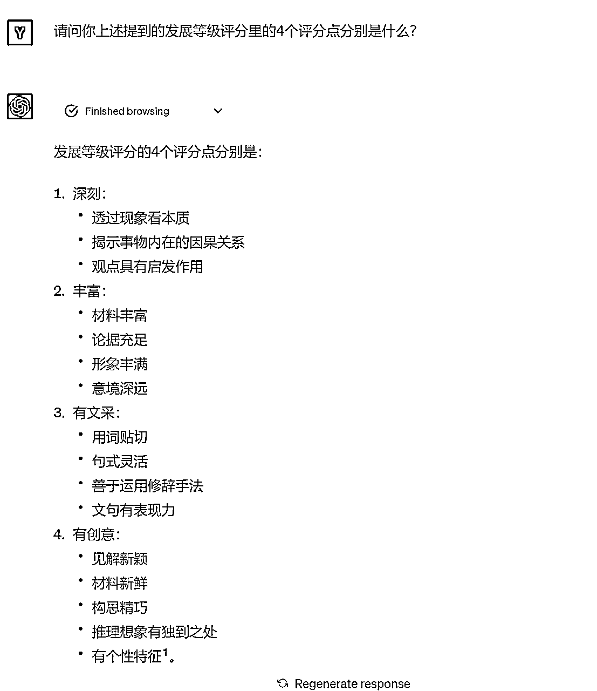

# 别再发low到爆的GPT秒出高考作文了！一文讲透AI在文字创作中的正确使用姿势

> 来源：[https://fjt9w880tn.feishu.cn/docx/HEajdvRmbozwitxgBD3chKlDnbe](https://fjt9w880tn.feishu.cn/docx/HEajdvRmbozwitxgBD3chKlDnbe)

高考作文出炉了，这个热点，怎能不蹭？

已经有很多AI公众号和朋友圈里的朋友展示了他们用AI生成的高考作文。

这个话题，我本不想蹭。

但看了那么写出来的文章，我觉得，除了蹭热点，我还有一个不得不写的理由。

我看到太多人使用ChatGPT在文字创作重点的误区：

使用GPT来解决问题是一个过程，但太多人将其当做两点一线。妄想给内容出结果，用你这个思维，我认为你在高考时也手写不出啥好文章来。

我不希望仅限于用我的方法给大家写几篇作文，我想从这个话题中挤出一些有益的养分，给到大家。通过这样一篇思考，解决问题的过程，把写出高考作文作为一个载体，来由小及大，讲清楚更大的一些点。

下面我还是先讲大家大概率会比较喜欢的部分：小凡怎么用GPT来生成一篇高考作文。

# 开放性思考：文字创作的目的是什么？要怎么创作？

写高考作文，是为了什么？要怎么写？

写小红书文案，是为了什么？要怎么写？

写情书，是为了什么？要怎么写？

写复盘，是为了什么？要怎么写？

这是一个开放性的思考题，我希望大家先把这个问题放在脑海中先思考。下面我们针对高考作文，讲讲小凡的答案。

# 拆解写一篇高考作文的真正步骤

## 我们的目的是什么？

很简单，写出一篇高考满分作文

## 达到目的所要具备的标准是什么？

案例地址：https://chat.openai.com/share/1e3079e9-9315-4e17-bbb0-deea3584a6b1

### 通过GPT调研

那我们自然要先搞明白：一篇满分作文的分数是怎样构成的？我们的问题是：

一篇中国高考语文满分作文，所需要具备的要素是什么？阅卷老师是怎么样评出一篇满分作文的？你可以联网搜索来优化你的总结。

所以我们让万能的GPT来帮我们解决这个问题：

结合GPT的联网搜索结果，我们可以知道，一篇满分作文，他的评分是分块的，分为基础等级评分和发展等级评分。那么，我们自然要继续深挖了解。

所以我在这个结果之上，我又继续追问了两个问题：

1.请问你上述提到的发展等级评分里的4个评分点分别是什么？

2.请问基础等级评分的评分标准如何？

### 整合确定标准

我们要对得到的信息进行了精简整合，剔除一些我们不需要的内容，于是我们有了以下的投喂资料：

一篇中国高考语文满分作文得分由下述规则构成：

1.  基础等级评分：基础等级的评分分为内容和表达两项，各自达20分，全面考虑题意、内容、语言和文体。内容项的重点是题意和内容。

1.  发展等级评分：发展等级评分依据4个评分点，只需一点突出，即可按等级评分，直至满分。这里也占20分。

其中，基础等级评分主要考察两个方面：内容和表达。

1.  内容：重点考察题意和内容。考生的思路、题材、选择的角度都是不同的，只要能够自圆其说，一般情况下都不会被判定为低分作文。对于内容的评价要综合考虑，对于材料的把握一定要重点关注。题材要新颖，选择角度要以小见大，文章的内容要流露真情实感，考生的中心思想和主题不能偏离题目和给出的材料内容。考生的考卷中所述论据的真实性要特别注意，如果是编造，或者有明显错误，都要适当扣分。

1.  表达（包括语言、文体和结构）：作文阅卷的重点是作文的结构、语言、文体、卷面等方面的综合考量。在对“内容”的评等的基础上，根据考生的行文内容、表达的情感、阐述的理论等等内容，阅卷老师可以酌情评分。评分的高低会有一定的上下浮动，这些都是正常现象。所以在作文的阅卷评分工作上，一篇作文不会是一位老师评分结束就打分的；系统会根据实际情况进行综合评分。

而发展等级评分的4个评分点分别是：

1.  深刻：

*   透过现象看本质

*   揭示事物内在的因果关系

*   观点具有启发作用

1.  丰富：

*   材料丰富

*   论据充足

*   形象丰满

*   意境深远

1.  有文采：

*   用词贴切

*   句式灵活

*   善于运用修辞手法

*   文句有表现力

1.  有创意：

*   见解新颖

*   材料新鲜

*   构思精巧

*   推理想象有独到之处

*   有个性特征

## 如何达到标准？达到标准的方法是怎样的？

案例地址：https://chat.openai.com/share/24d98815-3625-40b1-847d-4abe25d1e36a

### 先告诉G老师我们要做什么

那么想要达到让阅卷老师评出满分作文的标准，我们需要利用怎样的写作步骤和手法？

下面我希望你成为一名中国的语文特级教师，请先完成下面这项任务。

我会发送给你中国高考作文得到满分的规则，请认真学习并总结出一套作文得到满分的技巧方法发送给我。

如果你能理解了我的需求，请用你用自己的语言回答：1、你接下来要做什么事；2、你接下来会用怎么样的方法完成这件事

### 把我们刚才的标准告诉G老师

### 理解我们的评分规则

### 获得G老师总结的写作方法

## 调研完毕，开始写作

案例地址：https://chat.openai.com/share/99a57ad6-5812-466b-a14a-d71020daf703

### 给考生小G布置任务

参考以前小凡文章的写作技巧，可以自己去翻阅

### 给予考生小G满分规则和写作手法

这里就快速略过了，想看详细的自己去分享的案例地址里去看。

需要注意的是，我把评分标准和写作手法都提供给了GPT。

### 最终产出结果

我们把文章复制出来：

标题：故事的力量

我们每个人都是自己人生故事的作者和主角。这些故事，大到人类文明的历史，小到每个人日常生活的点滴，都在我们的心中留下深刻的痕迹。它们是无形的，却有着无穷的力量，它们改变我们的视角，启迪我们的智慧，塑造我们的人格，更可以改变一个人的命运，展现一个民族的形象。故事，就像一把无形的魔法棒，有着神奇的力量。

我小时候听过一则故事，那是关于一只小蚂蚁的故事。小蚂蚁总是忙碌着，从早到晚都在为冬天储存食物。而其他动物都笑它太过努力，却不懂享受生活。然而，当冬天真的来临时，那些原本嘲笑小蚂蚁的动物都开始饥寒交迫，而小蚂蚁却有足够的食物度过整个冬天。这个故事让我明白了勤奋和努力的重要性，也启发我认识到目光长远的智慧。故事的力量就在于此，它通过具象的细节和情节，帮助我们理解抽象的道理，触动我们的心灵。

故事的力量也可以表现在其改变命运的潜力上。许多成功人士都有他们的成长故事，这些故事激励着我们不断前进，赋予我们力量。比如乔布斯的故事。乔布斯的一生充满了起伏，他的故事让我们明白，即使面临困境，也不能放弃梦想。这样的故事力量，改变了我们的心态，也改变了我们的命运。

同样，故事也可以展现一个民族的形象。例如，中国的四大名著就是最好的证明。这些故事展现了中国古代社会的风貌，体现了中华民族的智慧和品格，也让世界了解了中国的文化和历史。故事的力量，就在于它能够跨越时空，连接过去和现在，展现一个民族的魂魄。

然而，故事的力量并非只在于他人对它的理解，更在于我们对故事的创作。每个人都是自己生命故事的主角和作者，我们通过我们的选择和行动创造我们的故事。我们的故事将塑造我们的个性，影响我们的未来，也影响着周围人的心灵。我们的故事可能会成为他人的启示，成为他们的力量源泉。

综上，故事是有力量的。它们可以教会我们生活的智慧，帮助我们改变命运，展示一个民族的形象，更让我们意识到自己生命中的创作力量。所以，让我们珍视每一个故事，珍视自己生活中的每一个瞬间，因为这些瞬间都将成为我们人生故事的一部分，塑造我们的未来。让我们一起创造属于我们自己的故事，感受那来自故事的无尽力量。

# 是骡子是马，拉出来溜溜

小凡联系一名俺们台州当地一所高中的语文老师，把这篇文章伪装成俺的小外甥，一名高二学生所写的文章。得到了下面的评价：

在P1-P4中，王老师真把这个作文当成我的小外甥写的文章了，发了超级多的语音，我知道大家懒得看那么多字，我就节选了一些，给大家做个总结：能拿一个中等偏上水平，文笔还是很可以的，但是结构和主旨理解还不算到位，素材还可以多积累。当然，在P4我最后是给人家解释过啦！！！没有欺骗人家的感情！！！！！！

在P5-P6中，我同样把这篇文章给了另一位高中老师，也得到了差不多的结论：48分，还不错，但没啥特别的亮点。

后续我没有根据她们讲的点去对GPT做修正型投喂，因为提高分数的方法已经很明确了，并且我们可以很方便地在以前的提示词里优化这些要点。而第二位戴老师，还提出了我一直在讲的一个观点……

## 人类的创意，更加难能可贵。看似降低门槛，实则提高了门槛，加剧了分化。

# 我们正处在一个浮躁的世界

## 秒出的作文为何而low？

很抱歉，这篇文章可能带有一些情绪，也比较直接。我想正式表明我的观点：low的不是GPT本身，而是使用他的人。小凡看到了太多蹭热点的新闻和文章，他们直接抛给ChatGPT作文题目，让他直接就来写一篇作文。

你们是真的把GPT当成神了吗？？？？？？

还是把那些寒窗苦读12年的高考生当成猪头？？？？？？

还是当高中语文老师都是一帮饭桶？？？？？？

## 我们失去了难能可贵的耐心和思考

现代人真的太爱偷懒了！！！

在生财混迹越久，我们越了解抖音和小红书，我们就越清楚这些社交APP、短视频如何捕获我们的粉丝。我们擅长开幕雷击，擅长利用即时反馈来吸引粉丝。但有没有一种可能，这些被我们利用的特点，也潜移默化地侵蚀了我们自己呢？

文章，收藏了就是会了。

课程，买了就是会了。

创作，丢给GPT就能写了。

创作，怎么可能那么简单呢？完成一件事情，怎么可能那么简单呢？？

我们丧失了一步一步拆解问题的耐心，也放弃了寻找问题本质的思考，这才是让我感到失望和崩溃的地方。

# 解决问题的钥匙，不在小凡手中，也不在GPT手中

## 解决问题的钥匙在你自己手中

## 第一把钥匙：听话，照做；但请把你的话说明白。

人为什么做不好一个项目，最重要缺的是，执行执行执行。

一定要听话照做，这句话我记得是亦仁在生财里说过的。

我在生财打响名号的第一篇精华，也引用了“听话照做打工人”的概念。

可是你有把你的话认认真真告诉GPT吗？

甚至我觉得宁可GPT不要诞生，最起码你执行的过程中还会老老实实去看别人给你的经验。

所以，有了GPT很好，他的执行力着实比人强。但你在让他照做之前，你的话真说明白了吗？

下面是我的付费星球的一个小伙伴写的提示词，这样的案例实在太多了。

老实说，我作为一个被称为人类的有机生命体，我也看不太懂这说的是啥。

## 第二把钥匙：让AI成为你创作游戏中的一件神级装备，而非万能NPC

小凡用这样具象化的例子，是为了说明一个抽象的状态。

更多时候，我们把GPT当成了一个外部的存在，所以在交互的过程中，我们没有跟他进行有机的结合。更多时候，我们将一个任务给他，让他完成任务后我们再去优化，在这个过程中会有很多信息传递的损耗。

尽管小凡写的提示词中也会用到“任务”这个词汇，但我与GPT相处的状态是不一样的。

GPT更像是我大脑的一部分，他负责了机械化、执行的那一部分。他会是我们的一个器官，而非是一个特定对象

我们应该让ChatGPT融入我们的创作，而非把任务交给GPT。

AI更像一件装备，不知道大家有没有打过游戏，一些RPG游戏里面，高等级的装备是需要我们的某个属性超过某个数值，穿上去才能给你加100%的能力。如果所要求的属性不足，那么穿上这件装备，这些装备或许就只能给你加30%的能力了。我认为这更像GPT与使用者之间的一种状态。

## 第三把钥匙：尊重GPT，尊重他人，也尊重你自己

请尊重GPT的智商，请老老实实按照步骤让GPT完成任务，他真没那么神啊喂！！(#`O′)不然你大概率只能得到一个很平庸的结果。

请尊重他人的智商，不要妄想你随随便便用GPT产出的内容，就去吊打你的同行。好歹人家也是认认真真一步一步踏实做出来的。除了文案之外，你还有很多要做的事情！

请尊重你自己的智商，如果GPT天生的能力就吊打你，或许你真的应该恐慌自己会不会有一天被取代。请你学会好好教导，训练GPT成为你想要他成为的执行机器。

## 第四把钥匙：文字创作，关注那些AI替代不了的

在与戴老师的交流中，有一个核心经验，应该单独总结出来，就是AI看似降低了创作的门槛，但实际提升了门槛。

创意，是你生而为人最后的尊严。请不要停止你的思考。

# 用好AI，到底要做什么？

有人可能读到了这里，还是看不懂小凡说了什么。好的，那么你可以把前面的所有都忘记，只记住这一章的内容。

在高考中，写完语文前面的大题，最后留给考生写出一篇作文的时间大约一般只有40分钟-1小时。而小凡做的调研，让考生小G学习怎么写作文，花了3个小时左右，这里还不包括后面如果要优化迭代投入的时间。

有人会说：

“拉了拉了，还说什么GPT颠覆呢！我看反而是加大了工作量！”

“前面做了那么多，一点都不省时。”

真的不省时吗？我做好这样的调研，沉淀下来了这一套方法论。我下次写出这样的一篇作文的时间，就是复制粘贴的功夫，可能只要几分钟。并且，这可是实实在在要去考场拼杀，冲刺满分作文的计划。

如果这样，你还觉得花的时间久吗？培养一个语文名师要多久？培养一个优秀的高考学生要多久？难道你觉得公众号里朋友圈里那些只准备了几分钟就写出来的作文，真的够资格去考场上用，它真的能落地吗？？？

所以，回答最后一个问题，用好AI，到底要做什么？

沉淀你的方法论，沉淀你的提示词，并且不断优化迭代。

千万不要惧怕一开始要投入的大量精力和时间。

因为这是一件复利的事，并且极其极其复利。

# 全文没有提自媒体创作，但全在讲自媒体创作

回归老本行，小红书创作是否如此呢？

讨论了整整一长篇的如何写作文，但是我未尝不是在写小红书笔记呢？我未尝不是在写自媒体创作？所以最后，给大家留下思考的空间：

1.  在小红书发笔记的目的是什么？

1.  想要达到笔记的目的，我的笔记需要具备哪些特点？

1.  如何达到这些特点？达到这些特点的方法是怎样的？

读懂的人，自然会找到答案。

# 关于小凡

AI训练师小凡

前人工智能领域风险投资人

生财有术ChatGPT航海教练

亿级亚马逊企业组织架构优化师

专注利用AI解决企业级提效

矩阵化批量化运作整体解决方案

公号：黄小凡2077；VX：evanhhh6666（备注来意不然不通过）

## 往期生财精华