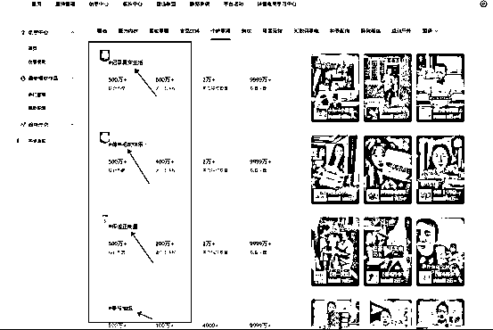

# 新手做视频号，如何快速拿到正反馈，喂饭级教程

> 来源：[https://q2wnncqnyh.feishu.cn/docx/HSUadJ8omoJKLgxorrccStgTn8d](https://q2wnncqnyh.feishu.cn/docx/HSUadJ8omoJKLgxorrccStgTn8d)

做项目还是要结合自己本身的资源和情况（这点很重要，这里的情况包括你上班的情况，下班时间等），作为一个体制内的人，你想搞副业，必然是悄咪咪的搞，那么你对直播这块就无缘了，于是我就选择了视频带货。

视频带货有混剪的方式，有实拍的方式，我选择了混剪加实拍的方式。

具体做法：找你对标产品的爆款视频，对视频进行分析，将爆点保留，其他稀疏平常的部分用自己实拍的片段进行替换。

爆款带货视频的开头是一定要用的，也就是视频的前几秒（学名叫黄金前3秒），后面的片段就自己实拍，实拍部分主要是展示产品，展示功能就行，主要是让观众老爷们知道你卖的是什么。

为什么要用爆款的开头呢？因为爆过的视频是经过验证的，前三秒都没人看，视频的数据必然好不了，也不会有爆的可能性，相反，视频爆了，那么他的开头一定是有点东西的。

讲到这里，问题来了，去哪里找爆款视频？（我是懂新手的，因为我也是个新手）

我用的是巨量百应，以下是入口

这里有很多的类目，你是做什么的就选择什么，下面这一排显示不完，你可以点（更多）查看其他的类目。

比如说我是做这个（个护家清）的

点开后，你往下翻，他的类目下有很多这样的话题，你找到自己产品的那个相关话题。

比如说我做的产品，他的相关话题是这个

点进去，选择你的类目，就能看到很多你的同行

你可以看到这些同行们的营业额，而且这个就是他们近期发的作品，很有参考价值

到这一步你就看到很多爆款视频了，他们都赚上钱了，这样的视频是不是你想要的？是不是可以给你做参考？（如果你回答不是，请。。。。）

爆款视频，我们找到后，下一步做分析，问题来了，要怎么分析？如何分析呢？（我是懂新手的）

我们先把爆款视频下载下来，如何下（上工具）

有款工具叫IDM(学名叫Internet Download Manager )这软件在互联网上到处都能找见，安装一下，然后你会在浏览器看到这个工具的插件，这就代表着已经安装成功了，这个时候，你要重启浏览器，说人话就是把浏览器关掉在打开。

我用的谷歌浏览器，（学名叫Google Chrome）其他浏览器差不多一样的方式。

我们再次来到巨量百应，点开你要下载的爆款视频

真诚不？我做的品都告诉你们了，点个赞不过分吧？

看到那个悬浮的按钮了吧？点击它就能下载视频了。

视频下载后，我们把剪映打开，将视频放进去

点智能镜头分割

剪映会自动将视频按照镜头去分段，这样你可以直观的看到这段视频的每一个镜头，也知道有多少个镜头，这段视频有那些镜头组成的，有那些爆点。

分析完成后，你需要看看这些个镜头，有那些是你可以实拍的，他们实拍时的角度是什么样的，接下就是实拍了。

我做这个品购买了一些实物回来，想着反正自己也能用上，没有什么专业的设备，就是一个支架，一部手机，就能拍摄了，拍摄出来的画面和你要替换的画面大差不差就行。

同样的角度和背景，用多了也不行，所以拍摄时尽量做到角度和背景不一样，你可以在桌子上拍，可以在地板上拍，可以在洗手池上拍，这样场景就不一样了，在加上角度的不同，可以有非常多的可用视频。

实拍好的片段，将之前的爆款视频的片段替换掉，重点是留下爆点

这样一个混剪视频就出来了，单个的产出效率有点低，没有关系，我们可以用圈友分享的批量方式来做。

这个号，每天发一条，当时是为了测试，没有多发，出了一单后被限流了，之后就是0播放

于是我用上了第二个号，这里有个坑，我踩了，如何有和我一样情况的，看完后，应该可以避坑

第2个号 我定时定的是早上的8点左右，新疆这边早上10点上班，下午20点下班，我定的早上8点，发完后就没管了，然后这个号爆了 15万的播放量，爆的时候也是早上，而且这个号在我朋友手里，等到下午我下班回家才知道爆了，评论区里很多人问怎么买，如果当时我定的时间是下午20点，那么我下班后查看手机，就能直接开播，这里一波流量就浪费了，然后这个号就限流了，然后0播放。

做副业有些坑真的是踩完才知道，这2个号用的方式都一样，出单都在很短的时间内，正反馈是拿到了，接下来，就是不断的优化了。欢迎做视频号的兄弟们一起讨论，一起生财有术。