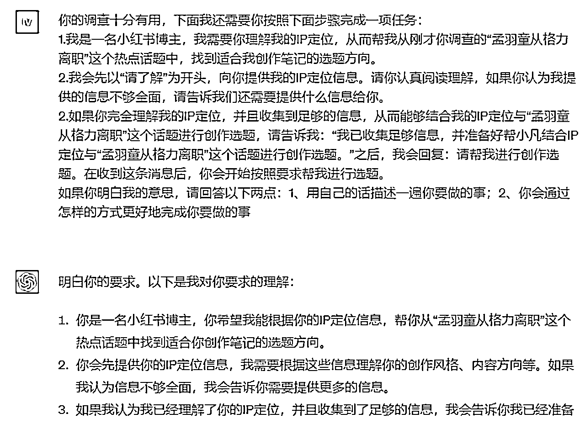
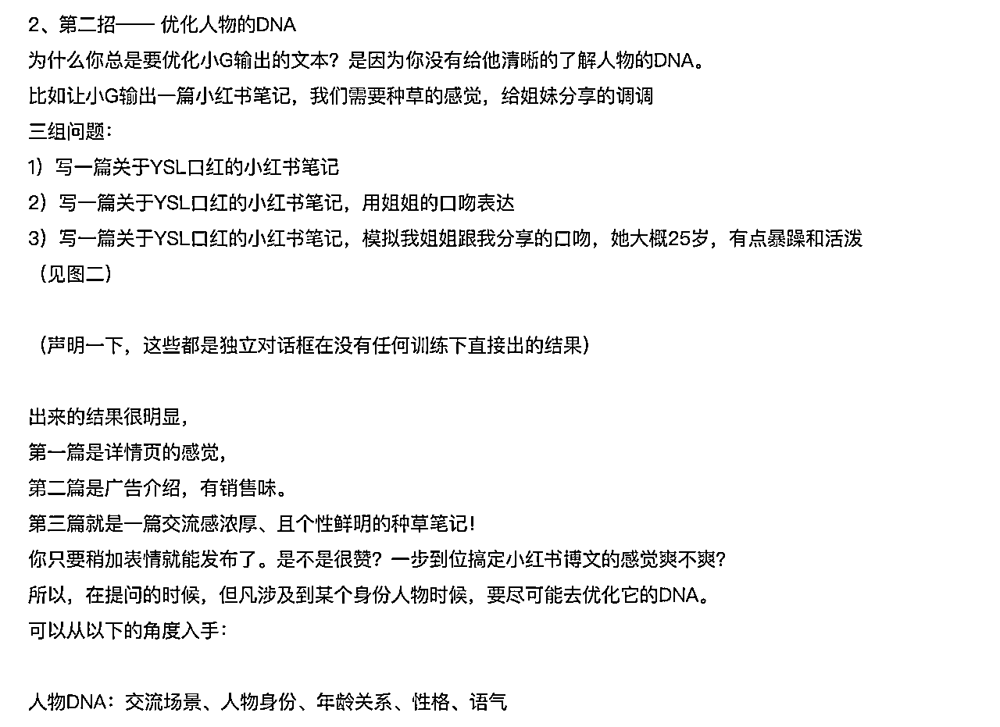
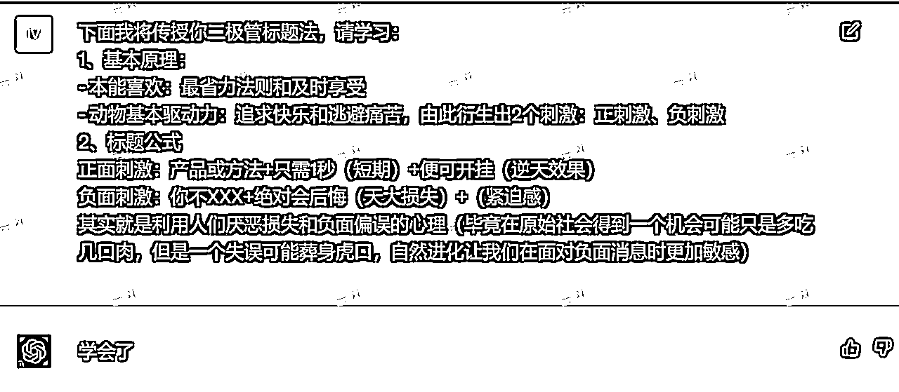
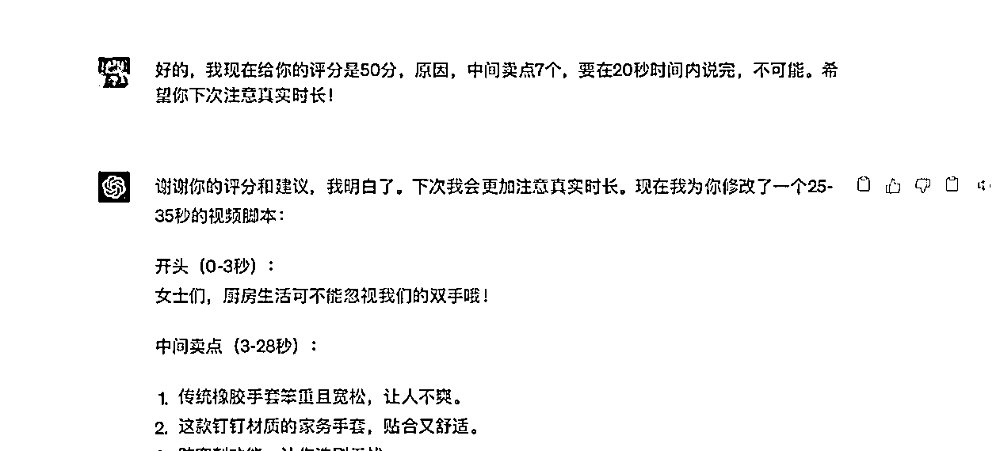
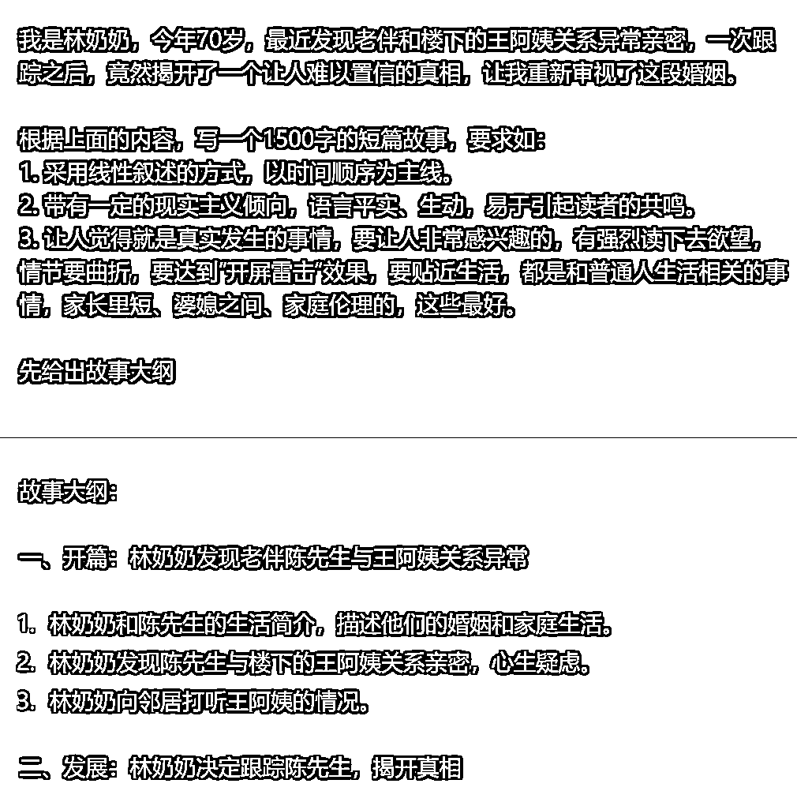
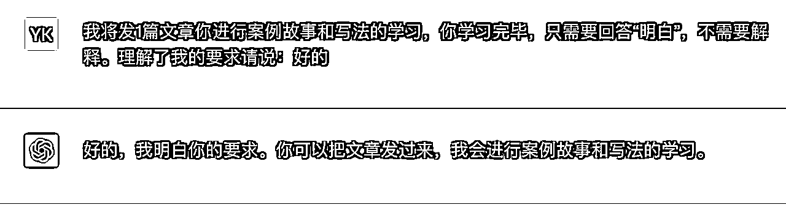
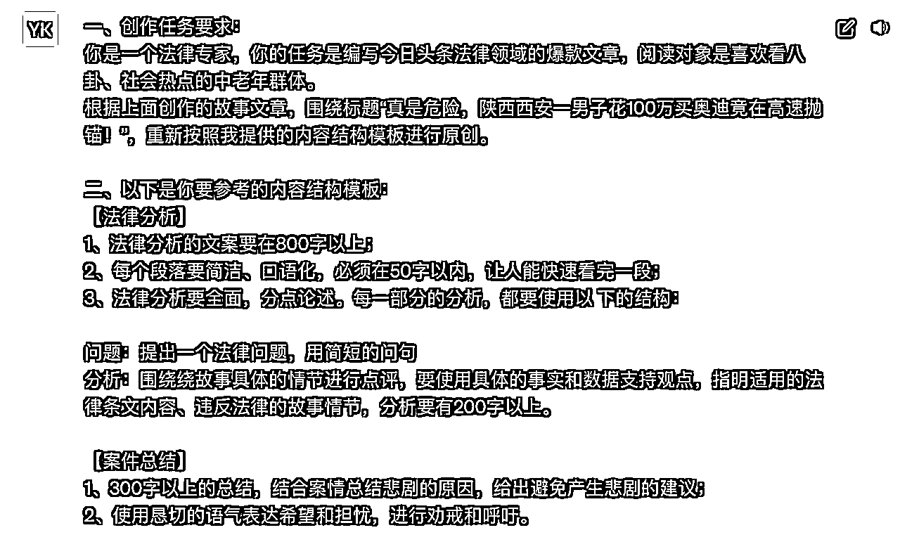

# 做自媒体如何发挥ChatGPT的最大价值？【生财有术ChatGPT航海分享-台风】

> 来源：[https://xq6mz7nkknp.feishu.cn/docx/HdvTdpX8hoq4n7xsYEmcwsWxnFf](https://xq6mz7nkknp.feishu.cn/docx/HdvTdpX8hoq4n7xsYEmcwsWxnFf)

关于我

大家好，我是台风，一名chatgpt魔法师，擅长创作角色指令，做过AI佛祖、AI律所等多款火出圈的小应用。

2月初入局ChatGPT，搭建ChatGPT主题的自媒体矩阵，主打自然流量自动成交的玩法，3个月变现5万+。

个人详细介绍：

很开心能和大家一起分享交流，由于这是本次航海项目的最后一场分享，所以将系统性地跟大家介绍ChatGPT的特点、优劣势，结合精华案例，总结ChatGPT在自媒体的应用方法。

# 一、ChatGPT共事之道

想用好ChatGPT，首先就要了解他的特点。某种意义上，我们可以把ChatGPT视为“数字生命”。

当我们把ChatGPT当作生产力工具用来提效的时候，其实相当于聘请了一位员工来帮我们完成工作。

## （一）ChatGPT员工画像：AI实习生助理

ChatGPT作为一个执行工作任务的临时外聘员工，其能力等同于一个初入社会的、高学历高智商的实习生助理。

*   云共享的AI员工

GPT是一个通用型人工智能， 纯公用，非私人助理、专属记忆短暂

*   平价的临时外包

GPT-3.5免费使用、可能不稳定，GPT-4：Plus会员20美金/月，3小时/25次(APP不限)

*   常态离线单机版

知识库更新到2021年9月，联网依赖插件，存在局限

*   双高实习生助理

1.  高学历：千亿级参数，知识渊博、百科全书

1.  高智商：思维逻辑强、理解能力强、情感能力强、模仿能力强

*   青涩的社会新人

1.  表达一板一眼，太过于拘谨正经，一股AI味

1.  有时死记硬背、不辨真假，胡说八道也要硬答

1.  总是记不住要求，爱忘事

1.  产出不稳定，有概率随机性

## （二）用好ChatGPT的基本原则

要学会做一个好老板，掌握和AI实习生助理的交流沟通方法、任务管理方法。

充分利用ChatGPT擅长学习模仿的强项，同时在布置任务时要细致地考虑每个环节的要求，以得到一个符合预期的、可控的结果。

### （1）了解ChatGPT的优势能力

1.  语言：精通多语种、能理解语言情感

1.  逻辑：系统性思维、学习总结能力强

1.  内容：能按要求生成内容、处理格式

1.  模仿：擅长模仿思维观点、内容风格

### （2）用好ChatGPT的核心要义

1.  GPT一下，你就知道：怎么用好GPT，多问他自己

1.  不要让他猜你的心思：把话说明白，把事交代清楚

1.  面面俱到、层层把控：不信任原则，强控任务流程

### （3）关键场景的应用策略

A、专业咨询

咨询场景：学习知识/技能、总结技巧方法论、讨论方案

1.  设置专家：限制领域让回答更精准；有互动性要求时，设置思考框架、互动工作流

1.  交代背景：提问交流的初衷，要解决的问题的背景，公司/个人/产品的基本情况等

1.  循序渐进：遵循探讨推演的流程，理清脉络，再不断深入完善

@小凡

B、布置任务

内容类型：写文章、小红书、知乎问答、短视频脚本、口播文案……

1.  设身份：限制回答特定领域，有概率影响语言风格；如小红书博主、法律专家

1.  派任务：写一篇xx平台、xx领域的爆款文章，受众是xxx，请围绕xxx题目进行原创

1.  提要求：字数xxx字以上，语言要口语化，逻辑清晰，要适当结合自己经历进行举例…

1.  定格式：【开头部分】xxx 【中间部分】xxx【结尾部分】xxx

身份角色对内容风格的影响：

《GPT调教心流法-身份篇》@白先生

https://wx.zsxq.com/dweb2/index/topic_detail/181454428444412

# 二、自媒体领域ChatGPT落地情况

## （一）ChatGPT的自媒体优势

ChatGPT是一个文本领域的智能机器人，处理文本工作是他的强项。

1.  内容处理：生成总结摘要；内容检查拼写、润色

1.  提供创意：选题思路、大纲框架、事例、标题、金句参考

1.  内容模仿：文章仿写、伪原创，批量生产

1.  内容翻译：把文章翻译成英文等其他语言

1.  对事实性知识要求不高的领域：人生思想观点论述、点评，生活经验等

1.  独特而极具辨识度的平台化内容风格：如小红书

## （二）自媒体应用难易程度

10分满分，分越高越容易。可以看出，文章仿写类的最容易。

1.  规模化伪原创：针对信息推荐流、搜索流量 //公众号/今日头条/百家号… 9

1.  百度问答：内容简短，基本能做到自动化 8

1.  小红书：容易出风格，涉及营销部分有一定难度 7

1.  知乎问答：有特定风格、但对内容有要求(平台会识别AI文本) 7

1.  短视频、直播文案：口语性强、营销套路较多 5

1.  强IP的文案风格：带个人语言风格和经历 4

1.  高原创度、参考内容少：要自己写的部分会比较多 3

## （三）结果取舍：速度 VS 质量

需要结合自己的赛道领域特点、需求进行选择。

模型

1.  GPT 3.5：速度快、质量尚可 免费

1.  GPT 4.0：速度慢、质量较高 20美金/月

内容

1.  如果走批量化、自动化的路线，质量随机性大

1.  如果要产出优质内容，人工干预调整成本会上升

# 三、ChatGPT运用流派

## （一）角色派

形式：固定的前置指令

特点：身份稳定，兼容较多问答场景

产出：快速，可控度一般

你是一名小红书博主，你的任务是根据我的提示词或描述生成小红书风格的文案：包括标题和内容。你的文案应该有以下特点: 表达要口语化，标题吸引人，要多使用emoji表情图标，内容观点尽量分点罗列，适当描述自己的使用体验和评价，文案最后生成相关的标签。以下是我的创作任务：

小红书生成器：https://ai.xiaohongshu.live

LangGPT模板：小红书爆款生成器

## （二）调教派

形式：按思维链的形式，投喂学习资料，一步步引导，评分、修正

特点：操作比较精细，耗时也相对长

产出：质量较高，高度可控

@小凡

《GPT+新媒体现状，及抖音脚本调教》@陈思成

分享文档：https://search01.shengcaiyoushu.com/docx/FtbldUhfYoungwxB7iBcKH5SnWd

## （三）框架派

1.  形式：针对不同内容模块形成固定的指令模板，严格规定内容结构

1.  特点：先训练再形成定制化模板，流水作业

1.  产出：快速，相对可控

ChatGPT + 公众号爆文写作，从0开始，7天达成阅读10W+，方法全分享，毫无保留@木白

https://articles.zsxq.com/id_i6vohzgwizfb.html

# 四、ChatGPT创作核心模块

不同平台类型、不同行业、不同内容领域，都需要单独去训练指令模板，才能获得符合预期的内容。

## （一）创作学习对象

1.  参考方法论：如爆款标题、公众号爆文模板，SEO关键词的分布策略等

1.  参考内容：总结内容结构、写作手法、语气风格、段落和用词习惯等等

## （二）内容生成框架-以文章为例

1.  背景信息：作者、领域、平台、受众、目标

1.  字数要求

1.  写作手法

1.  语气风格

1.  段落格式

1.  内容结构：开头、中间、结尾；或 故事部分、分析点评部分

1.  个人气质：个人价值观、融合经历

极简流程：先学文章-创作故事部分-创作分析部分

## （三）常见的调教问题

1.  忽略要求：GPT3.5理解比4.0差；条件要求过多或描述不清晰-针对性调整

1.  原创不足：要求它原创、不能抄袭；规定使用全新的内容结构模板

1.  字数过少：拆分模块分开生成；在各部分单独再声明字数要求

1.  例子生硬：要求增加故事细节

1.  语气风格：定义角色；口语化、不要翻译腔、模仿真人写作、语句自然；给参考语句

1.  IP内容：整理出IP有关的关键信息，常用观点、语句、经历等，要求进行结合

# 五、ChatGPT相关软件差异

## （一）简单了解ChatGPT的差异

不同模型的区别(5分制)

1.  GPT 3.5：逻辑 3 理解 3 情感 3 速度 5 文本容量 2

1.  GPT 4.0：逻辑 4 理解 4 情感 3 速度 2 文本容量 4

不同版本的区别

1.  官网网页版本：梯子，支持使用插件，GPT-4条数有限制

1.  官网手机版本：梯子，IOS 美区ID，GPT-4没有条数限制

1.  国内镜像版本：梯子，字数、记忆长度、安全过滤有更多限制，API模型稍逊于官网版本

## （二）平替工具

1.  Claude：同门兄弟，口语化一点，做短视频不错

1.  NotionAI：国内可访问使用，方便

1.  Bing Chat：实时联网能力更强，时事类的内容产出可以考虑尝试

# 六、请注意！自媒体技能才是根基

1.  ChatGPT定位：自媒体的辅助工具，效率放大器

1.  你需要掌握做自媒体某一领域的方法论，在这个基础上再使用ChatGPT提效

1.  ChatGPT不是万能的，或许你需要尝试更多的工具组合，或者干脆降低预期

# 七、精华学习资料

## （一）航海相关

### 1、航海手册

https://search01.shengcaiyoushu.com/docx/NuuKd7IKyoWKRnxXY08cirwzncd#QIMMdqqwAoiOSGxMLp1caLsBnWf

### 2、高手分享

https://search01.shengcaiyoushu.com/activity/documents?id=1580&index=1

分享主题：《GPT+新媒体现状，及抖音脚本调教》@陈思成

直播回放：https://i.shengcaiyoushu.com/t/BOA7WKp3

分享文档：https://search01.shengcaiyoushu.com/docx/FtbldUhfYoungwxB7iBcKH5SnWd

分享主题：《20刀/月并且任劳任怨，这名小红书助理你招还是不招》@小凡

直播回放：https://i.shengcaiyoushu.com/t/BOA7Z8L3

分享主题：ChatGPT投喂指南：如何让GPT学习你指定的信息 @黄小刀

直播回放：https://shengcaiyoushu01.feishu.cn/minutes/obcndh365g8511266e49a7pj

分享文档：

公众号 AI 写作分享@小浩

https://search01.shengcaiyoushu.com/docx/E0kIdqZG2olOmKxLWWhcnWFlnae

如何用ChatGPT提高自媒体文章写作效率？@粥左罗

https://shengcaiyoushu01.feishu.cn/minutes/obcnb273byyah231mw53c8jy

3、航海精华日志

https://search01.shengcaiyoushu.com/mobile/activity/landing?id=1580

## （二）生财精华帖

ChatGPT + 公众号爆文写作，从0开始，7天达成阅读10W+，方法全分享，毫无保留@木白

https://articles.zsxq.com/id_i6vohzgwizfb.html

小凡的分享合集

《错过了就后悔！3步用GPT教你轻松掌握抖音18个爆款密码，小白直接变大神》

胎教级标题党培训手册——4步让GPT成为小红书标题大师

https://articles.zsxq.com/id_zrre07e3d2ci.html

最强“听话照做打工人”——如何用GPT无脑复制抖音热门口播视频

《懒人必备！3种用ChatGPT打造999+点赞爆款的选题方法（尊享联网版）》

https://articles.zsxq.com/id_9wcb03khsuoz.html

《GPT调教心流法-身份篇》@白先生

https://wx.zsxq.com/dweb2/index/topic_detail/181454428444412