# 公众号AI写作保姆级教程

> 来源：[https://ph57ka8tip.feishu.cn/docx/Hk00db5HWo3aMKxBzivcJq4Bnie](https://ph57ka8tip.feishu.cn/docx/Hk00db5HWo3aMKxBzivcJq4Bnie)

大家好，我是这次参加公众号航海实战的船员小浩哥，非常高兴有机会与大家分享我的公众号创作旅程和学习心得。我也是今年五月首次投入公众号的学习运营和创作，虽然起步晚，但在 GPT-4 的辅助下，10天左右我实现了可观的收益——累计收益 3000＋。

新账号都会进入一个阶段叫做数据惨淡期，我在没有用 ChatGPT 创作和没有进流量池之前，我的数据也很惨淡， 写一篇情感故事文需要耗费我 1 到 2 个小时：

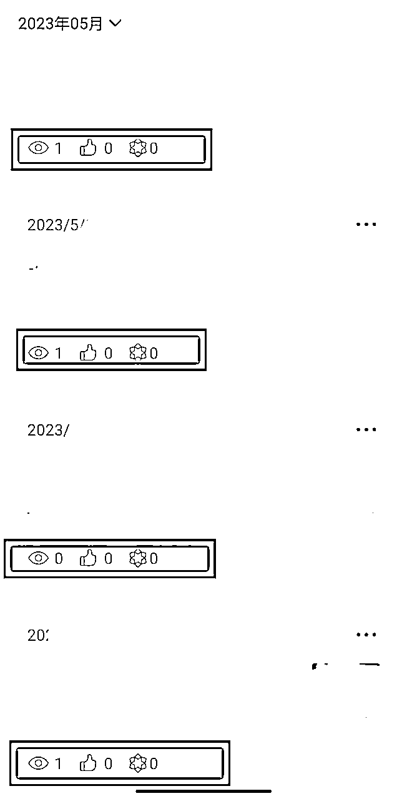

但当我坚持每天保持更新，加上巧妙运用 ChatGPT，我的数据质量出现了显著的跃升和提升。借助 ChatGPT 的创作能力，大大提升了我的工作效率。通过不断学习和训练 GPT，我现在可以在 5 到 10 分钟内创作出一篇情感故事文。

稍后我会分享一些我使用 GPT 创作的技巧。

再给大家看下我账号进入流量池之后，使用 ChatGPT 创作部分文章的数据和收益的反馈截图。

目前单个账号收益最高的一天是 457 ：

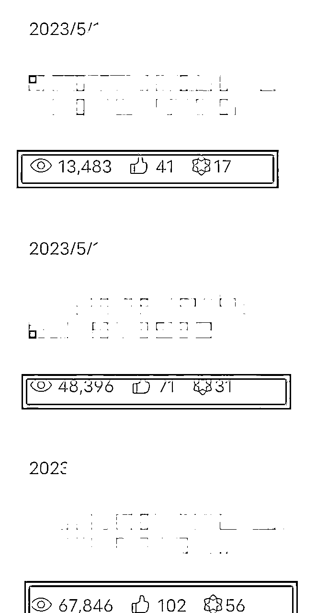

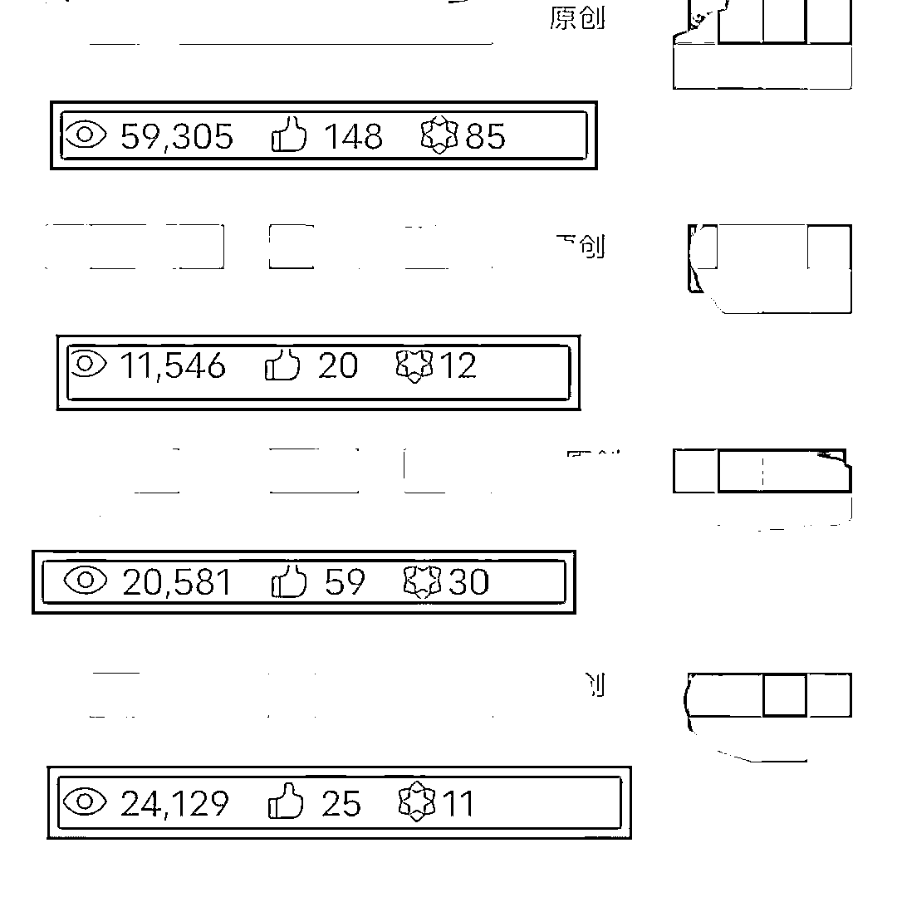

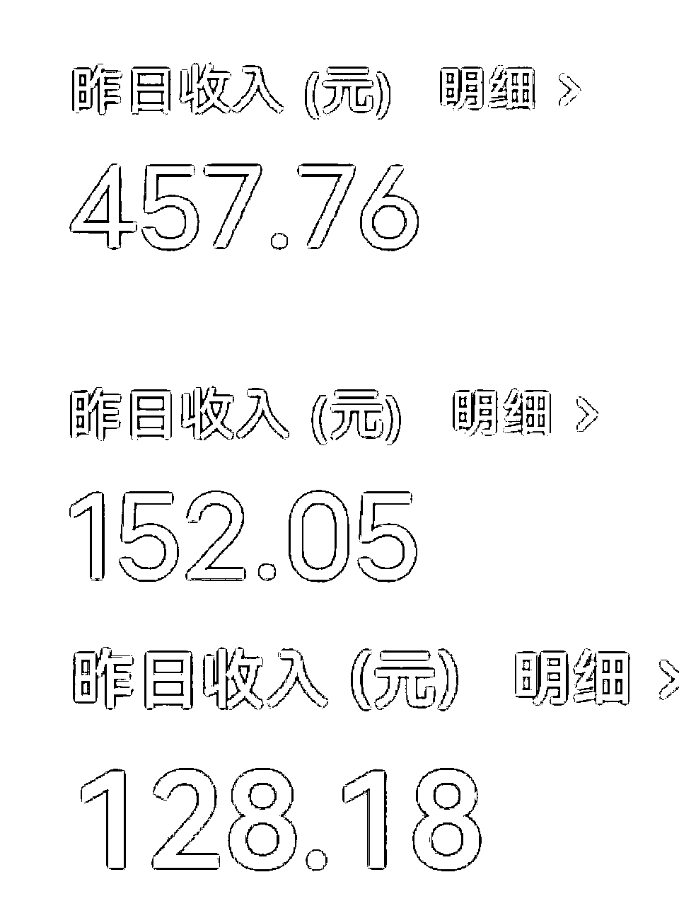

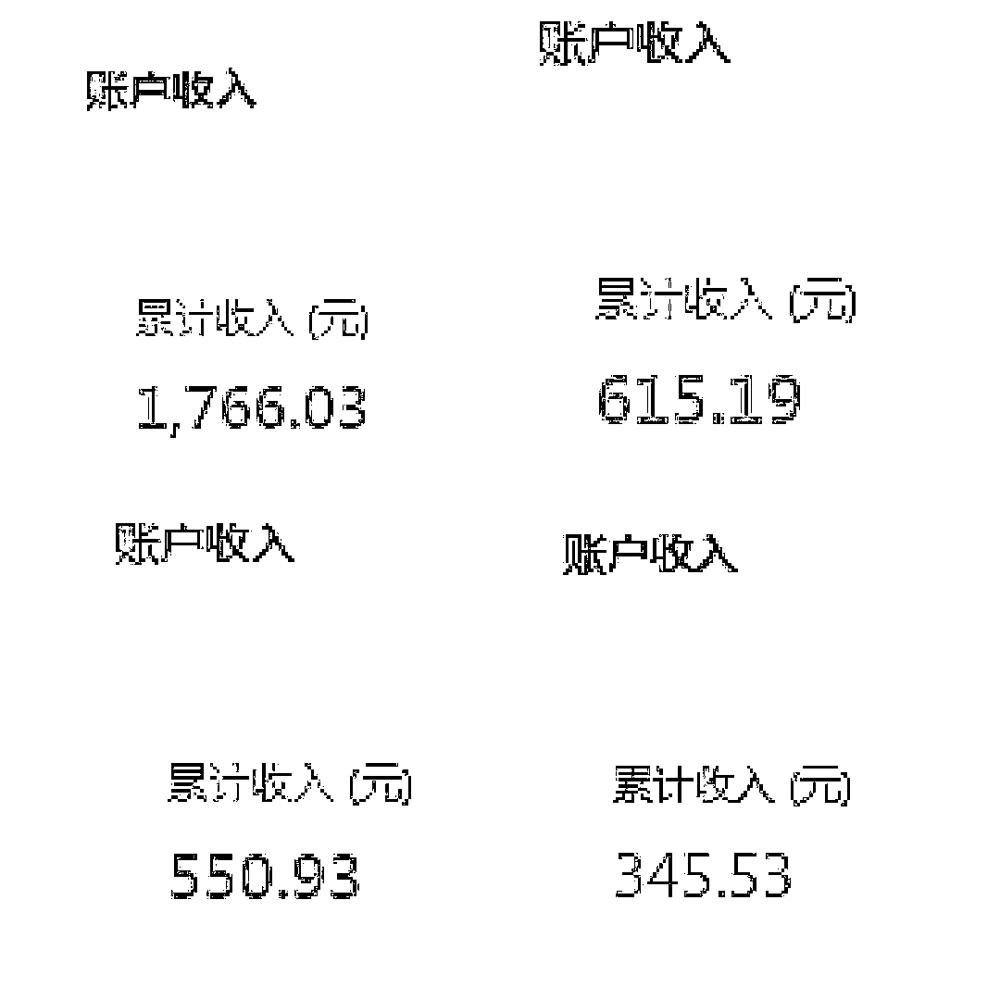

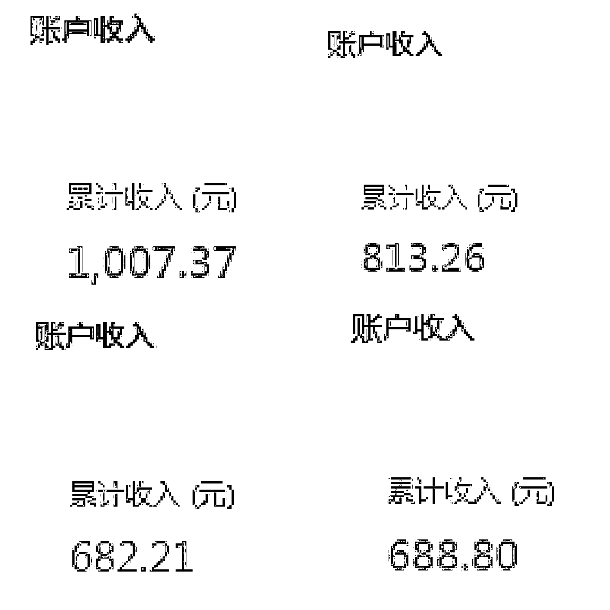

今天，我想与你们分享，我如何通过使用 ChatGPT，创作出了多篇高阅读的爆款文章，以及我在这个过程中的学习历程和收获。

不管是自己写还是用 AI 写首先要了解创作公众号文章的爆款逻辑，所以第一部分我们还是先来看公众号爆文的结构。

# 一、公众号爆款文章流程结构

第一步找对选题。

要选择读者感兴趣的话题去创作，爆文的核心选题占 90%；

一定是要选择你这个领域用户关心的话题去创作 而不是你觉得好的选题；

找到你这个领域的 20 到 50 篇 的 10w+的爆款，可以让 GPT 帮你分析和拆解。

更多选题技巧可以参考

第二步，写出吸引用户点击的标题。

标题是读者用户刷到的第一信息，也是决定读者是否点击阅读你这篇内容的关键。

标题需要简洁、直接且引人入胜留有悬念，能够引发读者的好奇心或者情感共鸣。

尽量使用感性、具体、直接和明确的词汇或者视觉效果的词汇，如“崩溃”、“反击”和“震惊”，这些都能引起读者的情绪反应，从而吸引他们点击阅读。

爆款标题元素的需要包含：人物角色+ 情感冲突+生活挑战+设计悬念

以下是爆款标题案例：

① 爱情迷阵：丈夫异地工作，我却无法抵挡公司领导的温柔陷阱

② 婚礼上的惊人一幕：35 岁新郎的言论让 26 岁新娘泪流满面，二手货也有春天

③ 人生大逆转：我 35 岁失业被丈夫抛弃，五年后我崭露头角，他却开始乞求原谅

④ 超凡体验：46 岁离婚大妈和年轻黑人小伙的二婚生活，他的体力让她振奋不已

第三步，引人入胜的开头。

可以是一个故事、一段对话、一组数据，或者对主题的直接提出，吸引读者的注意力，引发他们的兴趣。

案例：

1\. 看着镜子中的自己，我不禁深深地叹了口气。我的脸上依然清晰地印着昨夜的泪痕，一切仿佛都还在眼前。五年前的这个时候，我 35 岁，失去了工作，失去了丈夫，一切都变得如此的陌生和冰冷。我被抛弃在这个世界，无助又无望，但我知道，我不能就这样被困住。我要改变自己，我要证明给所有人看，我可以凤凰涅槃，我可以崭露头角。

2\. 清晨五点的闹钟又响了，他依旧不在我身边。从他离开去异地工作开始，我每天早晨醒来都会有这样的空虚感。但是，他不在的日子里，我竟然被公司领导的温柔陷阱所吸引。我知道我正在走向一个我也不确定能否自拔的迷阵..

第四步，剧情内容利用情感共鸣、冲突和转折、人物特征、情感表达和美好的结局等元素。

全文的框架结构可以参考以下几点：

① 问题提出：提出你文章想要探讨的问题或者阐述的主题，让读者知道这篇文章的核心是什么；

② 问题展开：在这部分，你可以通过提供信息、讲述故事、列举例子等方式，深入展开你的主题，让读者更深入地理解你的观点；

③ 问题解决：在这个部分，你需要给出解决前面提出问题的答案，或者给出你对主题的见解和建议；

④ 引导互动：在文章的最后，你可以引导读者进行一些互动，如留言、分享、点赞等。比如你被这个故事打动了吗？欢迎在文章右下角：点赞、在看；

⑤ 结束语：这是对整篇文章的一个总结，可以是一个精彩的观点，一个深入的见解，或者一个引人深思的问题，让读者在阅读完文章后仍然记忆犹新。

故事正文剧情内容可以包含：人物设计、情感冲突、生活挑战、出乎意料反转剧情、题材多样、引人入胜的叙述。

① 人物设计：请设定年龄在 20-50 岁之间的主角，尤其可以考虑女性角色，因为他们面临的社会压力和挑战更多。你可以使用如老板、男友、男同事、老公等角色，他们能引发人际关系的冲突和生活挑战。

② 情感冲突：请在文中加入情感冲突，如愤怒、恐惧、期待、等，以引发读者的好奇心，

③ 生活挑战：请在文中涉及一些常见的生活挑战，如工作压力、人际关系、婚姻问题等。这样可以引发读者的共鸣，使他们更愿意阅读文章。

④ 出乎意料的转折：可以在剧情中加入一个出乎意料的转折，如意外的发现、突然的变故等。这种转折能引发读者的好奇心，提高读者点击的概率

⑤ 题材多样：请涵盖各种主题，如工作、恋爱、婚姻、人际关系等。这样可以吸引不同兴趣的读者。

⑥ 引人入胜的叙述：可以用讲故事的方式来吸引读者的注意力。通过设定有趣的情节和冲突，使读者产生想要了解故事结局的欲望。

# 二、如何利用 ChatGPT 批量写标题

## 2.1 如何让 ChatGPT 批量产出爆款标题

我直接来分享实操方法 我们需给 ChatGPT 一个标题写作指令，这个指令需要自己通过给 GPT 喂养爆款选题内容获取。

第一步：让 ChatGPT 分析爆款标题

我们可以先找 5 到 20 个你这个行业的 10w+的爆款标题让 ChatGPT 去分析学习：

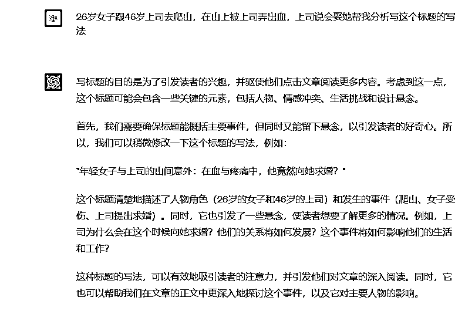

第二步：根据回答提炼标题核心公式，并把公式喂给 ChatGPT，目的是获得下一步对话的指令

从前一步的分析中，我们可以提炼出一个标题的核心公式：人物角色+ 情感冲突+生活挑战+设计悬念，再把这个公式给 GPT 帮我们写标题指令，这一步的指令可以如下图这样写。

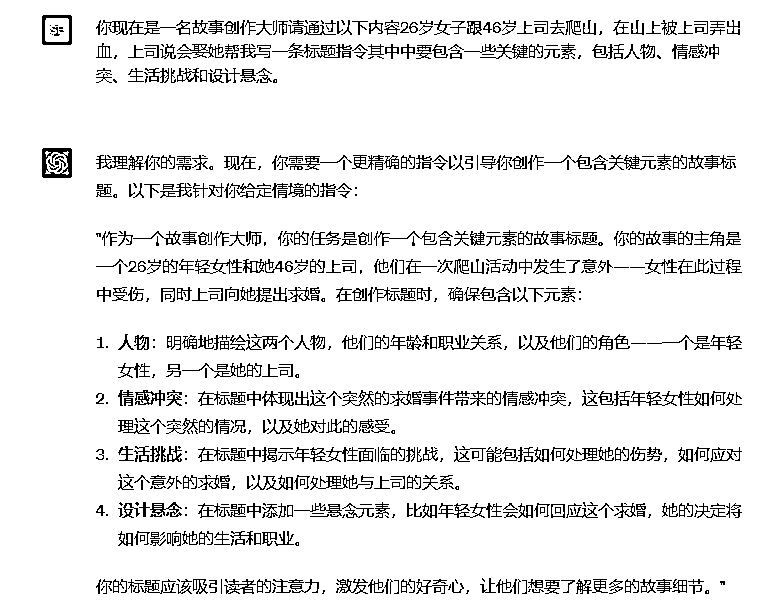

第三步：将新的指令喂给 ChatGPT，批量获得爆款标题

根据上一步，我们已经得到这一步与 ChatGPT 对话的指令，即上图中 ChatGPT 回答我们的内容。这个指令我们还可以通过自己对内容的要求去优化。

下面是我自己经过多次优化写的标题指令：

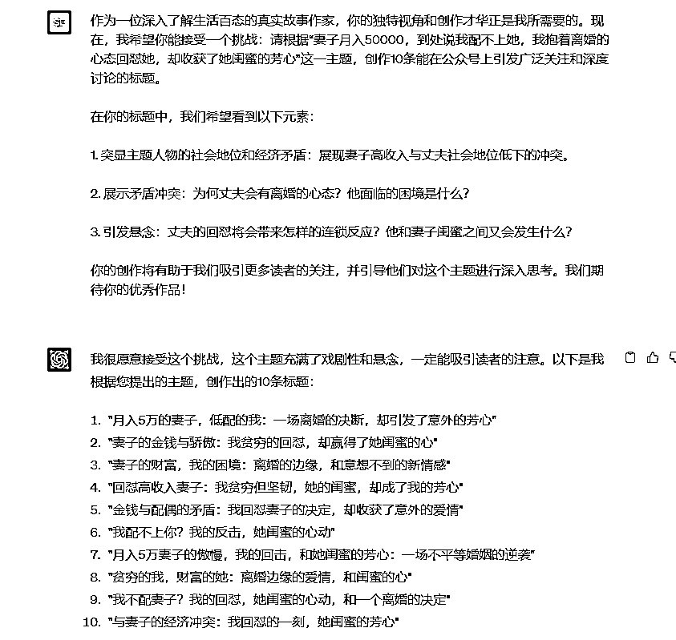

可以看到，这时候 ChatGPT 已经能够根据你的指令批量给出不错的标题，你可以从中选择自己觉得合适的，也可以在这些标题的基础上进一步优化修改，作为自己的文章标题。

## 2.2 简易指令模板与使用方法

为方便大家更快完成「批量取标题」的动作，我再提供一个只需你给主题就可以套用的标题写作指令：

作为一个有深度理解和探究社会生活微妙情况的作家，我们希望你能根据特定的主题创建一系列精彩的标题。你的创作需要在我们的公众号上引发广泛关注和深度讨论。

我们期待您在创作中考虑如下几点要素：

1、标题简洁、直接且引人入胜：我们需要的标题要能够直击要点，同时能引起读者的强烈兴趣。试着让标题留有悬念，以激发读者的好奇心，驱使他们点击查看更多内容。

2、使用具有强烈感性和视觉效果的词汇：诸如“崩溃”、“反击”和“震惊”等词汇能引发读者的情绪反应，从而吸引他们点击阅读。请尽可能在标题中使用这类词汇。

3、包含人物角色、情感冲突、生活挑战和设计悬念的元素：请设定具有特色的人物角色，并设定他们之间的情感冲突和生活挑战。同时，在标题中设计一些悬念，让读者想要了解更多。

我们期待你能利用这些指导，创作出精彩的标题，让我们的公众号读者为之振奋。

第一种用法，直接给关键词，如工作、恋爱、婚姻、人际关系老板、男友、男同事、老公等角色的主题：

不满意的话可以让他继续写：

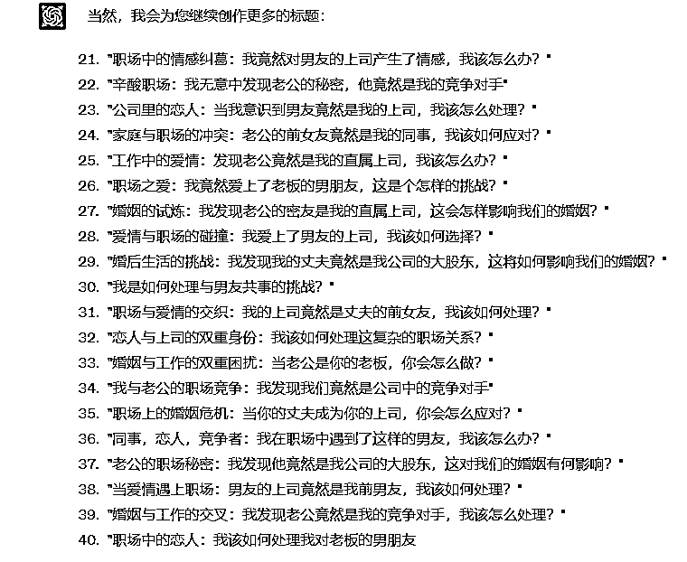

第二种用法，直接给他爆款标题让他写同类型的：

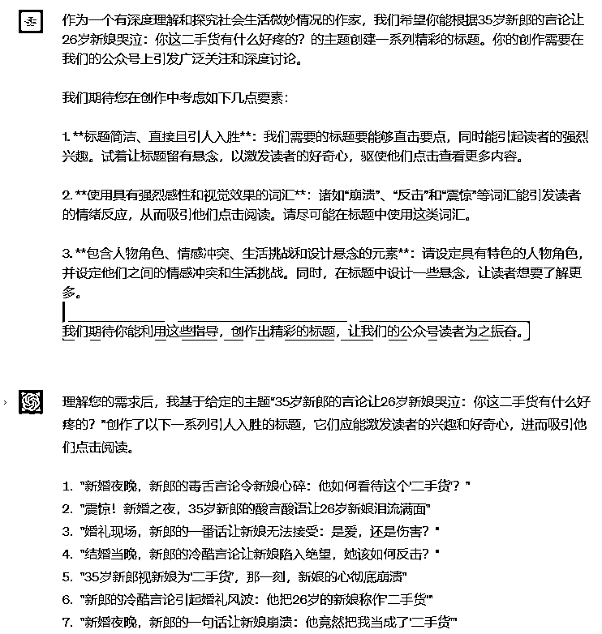

生成完后，我们可以从这类标题选一个自己比较满意的，稍作一些优化就可以直接用。

# 三、如何利用指令写正文内容

## 3.1 方法一：投喂爆款文章，让 ChatGPT 产出指令与正文内容

第一步，直接找篇 10w+爆款文章链接让 GPT 分析内容结构然后仿写：

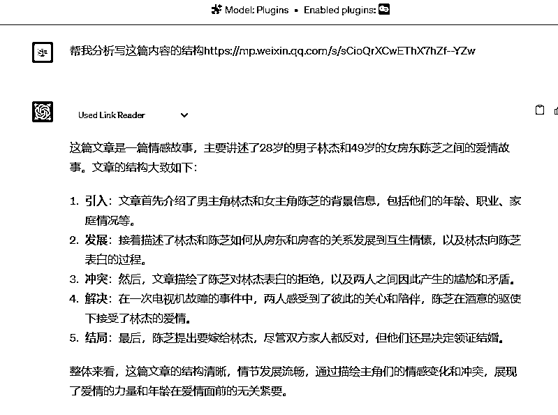

第二步，继续根据分析的内容让 GPT 创作指令，如：

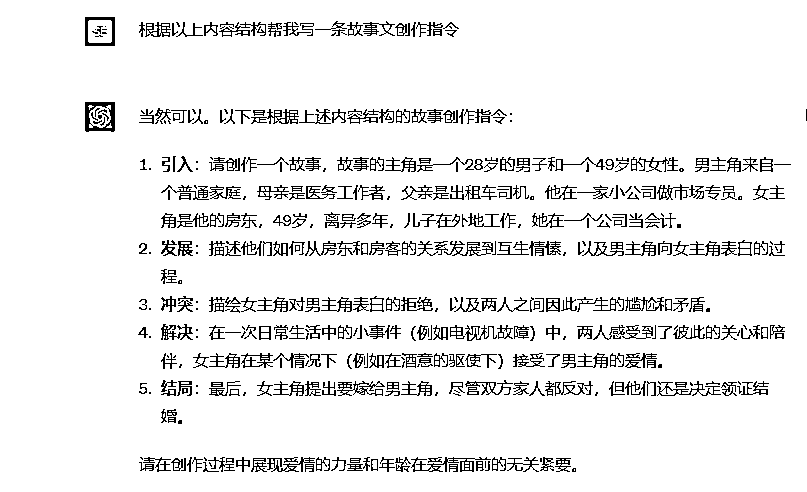

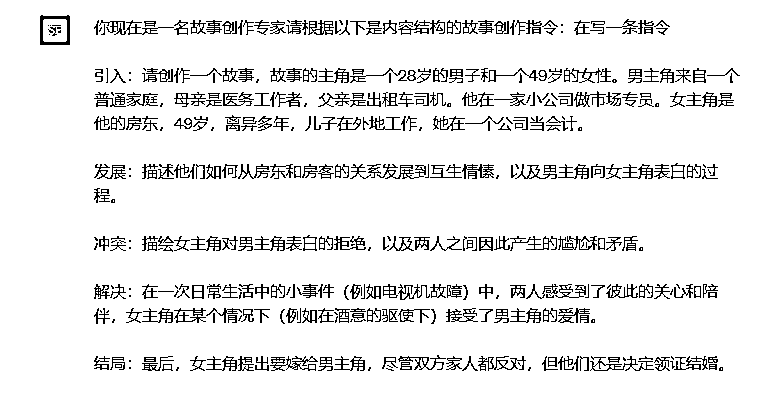

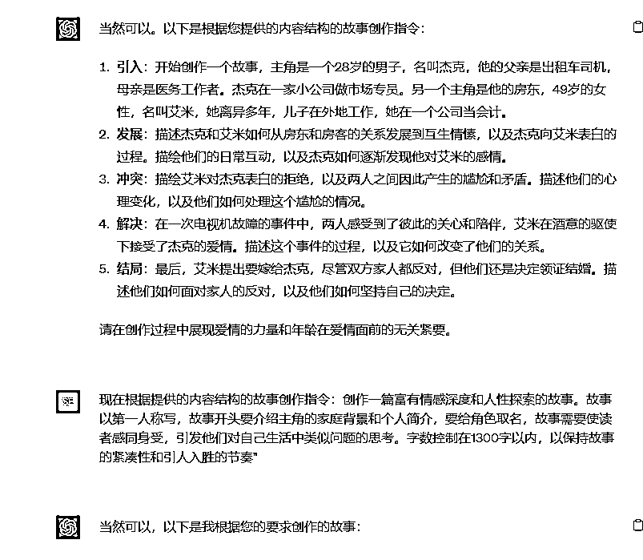

第三步，获得通过指令直接产出的正文内容：

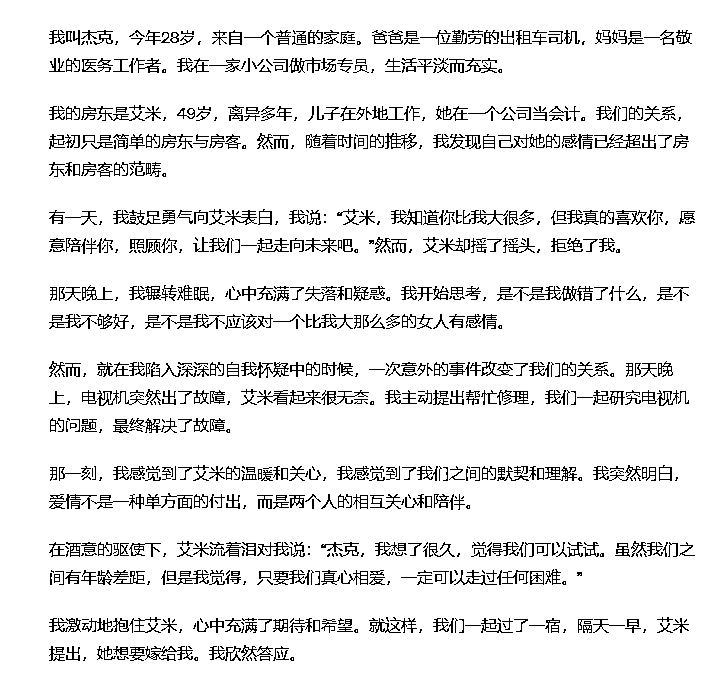

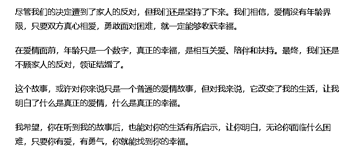

因为 GPT 字数限制，这里可能会没有完，可以让他继续写：

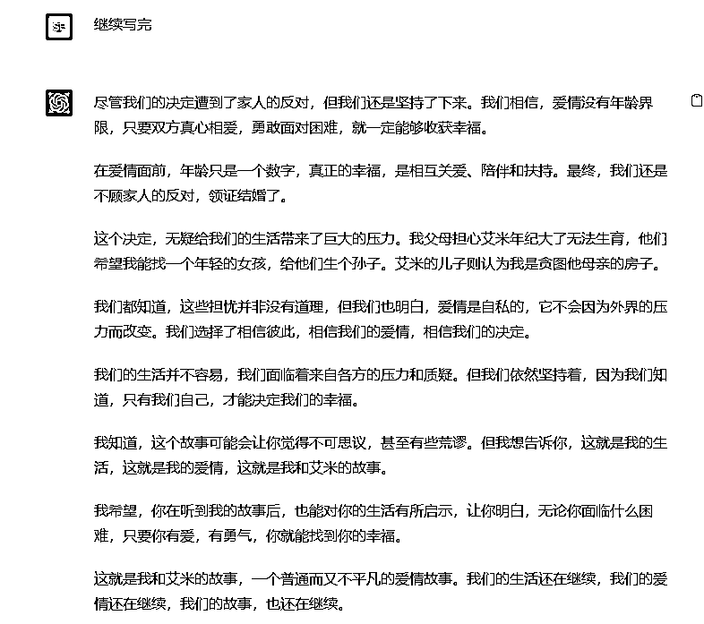

这之后我们可以检查一下全文，删除重复内容或不适合的内容。

## 3.2 方法二：直接给出指令，让 ChatGPT 产出正文内容

第 2 种方法是自己优化指令，直接让 ChatGPT 写。比如你有自己构想好的剧情或剧本，但不想自己一点点写，就可以把想法喂给 ChatGPT，让他来产出正文内容。

给大家一个参考指令：

作为一个富有洞察力的作家，你现在的任务是以”xxxxx”为主题，创作一篇引人入胜的故事。

在开头，你应该详细地描述 xxxxx，为故事增添趣味性和复杂性。接下来，你需要描绘 xxxxx，这会增加故事的

戏剧性。你可以详细地描绘 xxxx，并从中揭示 xxxx。在故事的中部，你需要深入挖掘 xxxx。你可以描绘 xxxx，揭示 xxxx，引起读者的共鸣。

在故事的高潮部分，你可以设计一个出人意料的转折，例如 xxxx，这会使读者产生“原来如此”的惊喜感。

在故事的结尾，你需要对主角的感情变化进行总结，让读者明白 xxxx。

这篇故事的总字数应在1200字以内，既保持故事的紧凑度，也充分展现故事的细腻情感和真实感。

以下是运用这个指令产出的文稿，大家可以看看：

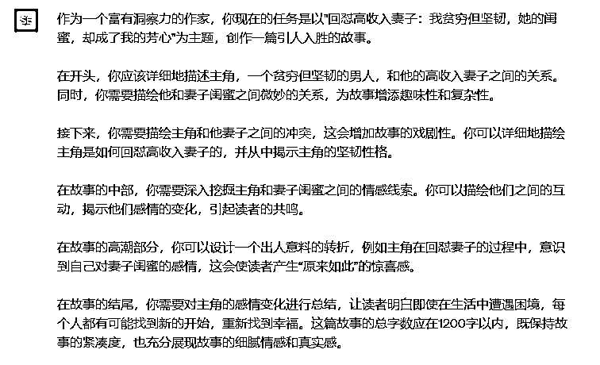

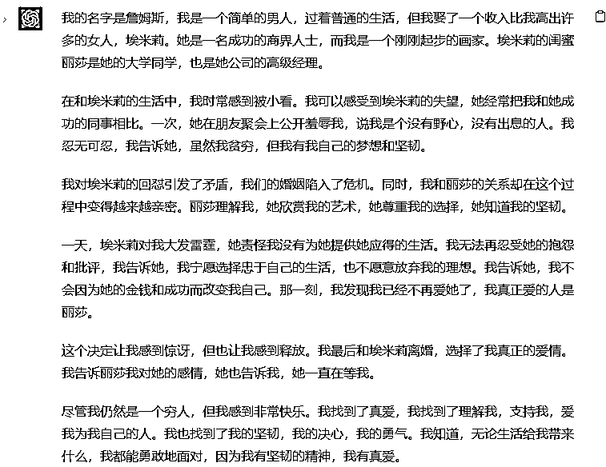

这篇就是我利用 ChatGPT 写出的一篇完整的文章内容。

## 3.3 技巧：如何提升 ChatGPT 写作效率

我们可以如何通过 ChatGPT 提高效率呢？

建议大家通过不同指令，建立多种模型，这样能够方便你想要创作某类文章时直接找到对应模型。

比如我的创作模型主要有以下这些：

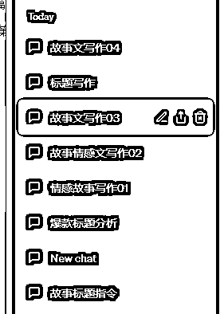

最开始，大家可以使用不同的模型写，之后看哪个模型写的内容更好，大家就可以选择这个模型持续去创作。在创作中，大家还可以在指令模板的基础上，加入自己想要的剧情或内容。

比如指令一：

作为一位敏感且熟练的作家，你的新任务是"在根据提供的内容创作一篇富有情感深度和人性探索的故事。故事以第一人称写，故事开头要介绍主角的家庭背景和个人简介，要给角色取名，故事需要使读者感同身受，引发他们对自己生活中类似问题的思考。字数控制在 1300 字以内，以保持故事的紧凑性和引人入胜的节奏"

引入：开始创作一个故事，主角是一个 28 岁的男子，名叫杰克，他的父亲是出租车司机，母亲是医务工作者。杰克在一家小公司做市场专员。另一个主角是他的房东，49 岁的女性，名叫艾米，她离异多年，儿子在外地工作，她在一个公司当会计。

发展：描述杰克和艾米如何从房东和房客的关系发展到互生情愫，以及杰克向艾米表白的过程。描绘他们的日常互动，以及杰克如何逐渐发现他对艾米的感情。

冲突：描绘艾米对杰克表白的拒绝，以及两人之间因此产生的尴尬和矛盾。描述他们的心理变化，以及他们如何处理这个尴尬的情况。

解决：在一次电视机故障的事件中，两人感受到了彼此的关心和陪伴，艾米在酒意的驱使下接受了杰克的爱情。描述这个事件的过程，以及它如何改变了他们的关系。

结局：最后，艾米提出要嫁给杰克，尽管双方家人都反对，但他们还是决定领证结婚。描述他们如何面对家人的反对，以及他们如何坚持自己的决定。

请在创作过程中展现爱情的力量和年龄在爱情面前的无关紧要。

再比如指令二：

作为一位才华横溢的作家，你的新创作任务是根据主题 "爱情迷阵：丈夫异地工作，我却无法抵挡公司领导的温柔陷阱"，写出一篇充满情感纠葛、道德冲突的故事。

首先，你需要描绘出女主角的个人和职业背景，她与丈夫的关系，以及丈夫为何会被调到异地工作。此外，你也需要对她与公司领导之间的关系进行初步的勾勒。

接下来，你应描述她在丈夫离开后的生活变化，特别是她与公司领导之间逐渐发展出的不正当关系。你需要准确地描绘出她心理的挣扎和困惑，同时展现她对于这种情况的内疚和恐惧。

然后，你需要设计一场危机，比如她的丈夫突然回家，或者公司的同事发现了她与领导的秘密。这个危机应该足以让她开始反思自己的行为，并寻找解决问题的方法。

最后，你应该创建一个反转，可能是她最终选择忏悔并坦白，也可能是她选择接受自己的行为并面对其后果。这个反转应该让读者对她的人性有深度的理解，并对她的未来充满期待。

总的来说，你的故事需要真实地描绘女主角的内心世界，展示她在爱情与道德之间的挣扎，以及她如何面对自己的行为和决定。

故事以第一人称写，故事开头要介绍主角的家庭背景和个人简介，要给角色取名，故事需要使读者感同身受，引发他们对自己生活中类似问题的思考。字数控制在 1300 字以内，以保持故事的紧凑性和引人入胜的节奏"

# 四、调整好心态，坚持创作

我始终坚信，无论我们投身于任何新领域，都需要拿出积极的态度和坚定的决心。

正如我开始运营公众号时，每天坚持发布原创文章，尽管初期的阅读量仅为个位数，甚至有时长期无法获得积极有效的正反馈，但我坚信唯有坚持，才能看到想要的结果。

在这个过程中，我不断地探索和学习如何使用 ChatGPT 提升写作效率和质量，并成功地吸引了更多的读者。

对于很多人来说，尝试新事物并寻求突破可能会带来焦虑和失望。

而我想说的是，我们应该在经验和方法论上从业界的佼佼者那里学习，但在结果上，我们应当与过去的自己相比。因为自己每一次的进步，都值得我们高兴。

刚开始在利用 ChatGPT 在创作过程中的，需要我们有耐心进行训练和优化。我开始使用 ChatGPT 的时候，创作的内容可能并不理想。但我始终相信，只有不断优化 GPT 的写作指令，才能让其创作出读者喜欢阅读的文章。

通过对 ChatGPT 的深度训练，我探索出如何批量编写吸引人的标题，如何寻找爆款文章的关键要素，等等。

在我与 ChatGPT 的创作旅程中，我不断尝试，优化写作指令。经过反复实践，最终我掌握了如何根据特定的爆款选题，为 ChatGPT 设定写作指令，让 ChatGPT 高效产出更优质的内容。

我希望我的这次分享能帮助到大家，无论你是已经开始创作，还是正在犹豫是否要开始创作。记住，无论你在何处，无论你在做什么，都要相信自己的力量，保持乐观和积极的态度。

以上就是我今天要分享的内容，希望对你们有所帮助。谢谢大家！