# （生财有术）小红书店铺从选品到出单全套分享

> 来源：[https://fcf4a0devm.feishu.cn/docx/I4tBdhtiEoffmRxhFdqcB8X0niC](https://fcf4a0devm.feishu.cn/docx/I4tBdhtiEoffmRxhFdqcB8X0niC)

大家好，我是小毛

我们团队是今年才开始做小红书电商的，很幸运趁着红利做出了一定成绩

按例先放几个结果图吧

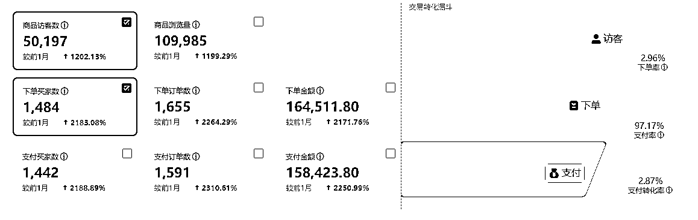

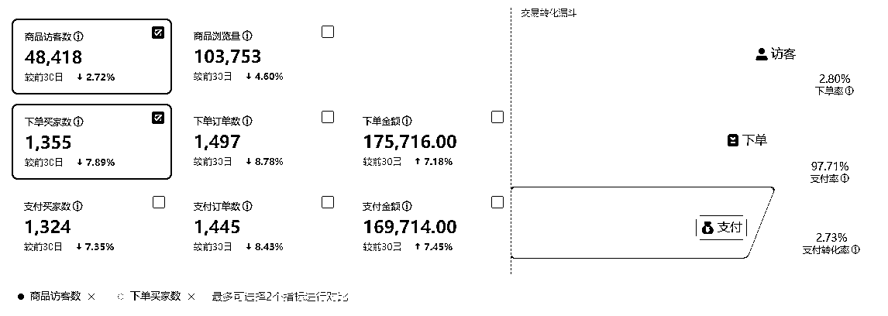

我这里先说下，我们做这个业务的真实感受

第一：确实有一定的红利效应，不用质疑

第二：操作确实不难

第三：执行力不强，不懂随机应变的干不好

小红书电商，我们的操作方式，简单说来，重要流程就三个环节，1.选品 2.测品 3.怼爆品

接下来，我把我们每个环节的操作方式都分享下，大家可以结合其他老师分享的自行参考

# 1.选品

## 先定一个基调蓝海平台干红海品，

在我们看来，小红书在电商版块还属于蓝海，所以我们并没有怼什么蓝海品，我们就是做的市面上容易爆单的红海品。（观点也不一定对，仅供大家参考）

## 说到选品，我们首先要对小红书平台的用户画像有一个大致了解。

据统计平台18-35岁的女性用户占了72%，且50%以上是一二线城市。

人群标签有哪些？城市白领，潮流丽人，精致孕妈，单身贵族，享乐一族等等

人群特征，爱生活，爱分享，高消费，爱尝鲜。

最后得出人群偏好：

高颜值：视觉效果拉满，如好看的杯子，精致的汤勺，这些能够有超高颜值的日常物品。

高品质：如仙居杨梅，猫山王榴莲。这些当季最好的水果，水果品种中的王。

时尚仪式感：如香薰，香氛，花瓶，摆件，很多在我们大老粗直男眼里毫无用处的东西，

新奇创意：如造型奇特的手工制品，鲜少有人见过的水果，地域特色食品等

## 接下来说选品的几个方法

### 1 小红书选品，主要是找低粉爆文没挂车的（下面都是蹲蹲 求链接 哪里买这类型评论）

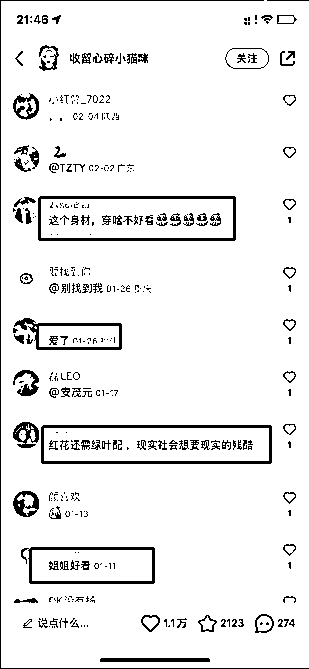

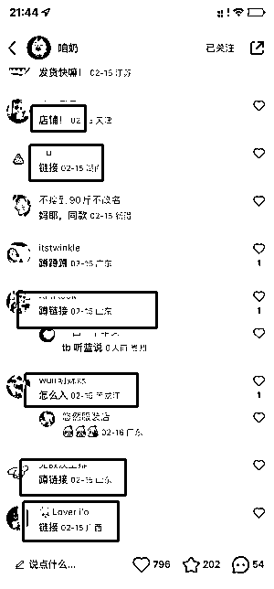

可以看下这2张图 后面这种就是我们要找的爆文和产品 （第一张是这种贴贴 老婆这类的 不是好的带货笔记 可能是博主的颜值）

低粉爆文的标准有这几个

1 粉丝2000以内

2 点赞+收藏大于500

3 时间在近一个月

4 评论区有留言需求

### 2.小红书选品的第二种选品方法就是跟品

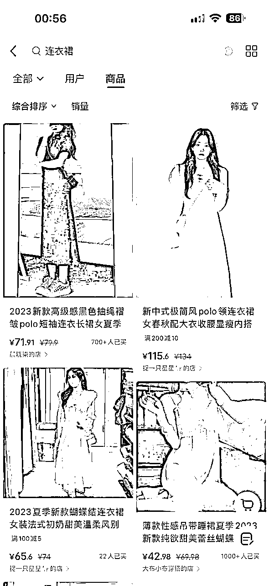

直接在小红书搜索你想做的产品关键词，可以了解到什么样的款式是受小红书这个平台的用户喜欢的风格类型，再根据的你定位去找到对应的上家链接

### 3\. 各大电商平台选品

主要分3种方式

a 榜单型选品

b 黑马型选品

c 搜关键词按销量排序选品

#### 1.榜单选品就是各大平台都是自己的榜单 每天都会更新，所以要多关注

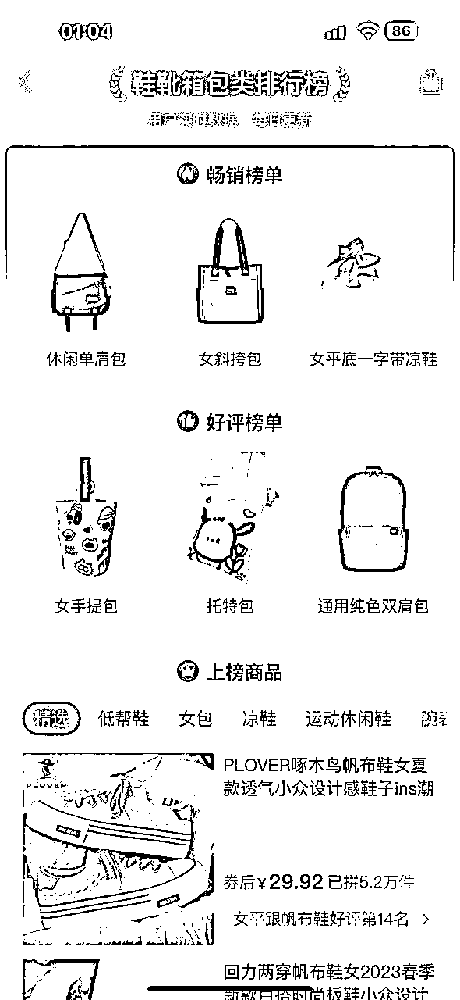

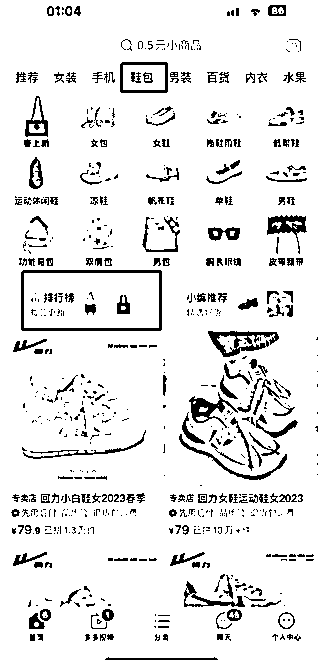

这里以拼多多举例 大家可以参考下

顺带提一下1688也有很多榜单，而且1688以批发为主，所以销量反馈可能会比其他平台前置，就是对比其他平台销量还不高的时候，他已经卖很多了！那么你提前布局的话 很有可能到了季节的时候 你会爆发的很猛

#### 2.黑马型选品 就是可以理解为新品短期销量飙升 评论还没跟上的这种链接

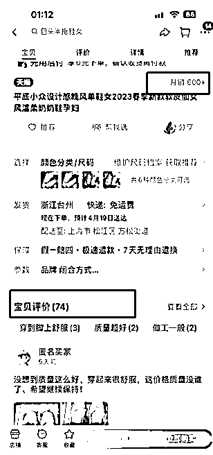

不同类目标准不太一样 ，我这边自己定的最低标准销量大于300，评价只有几十这种，这个可以结合自己的经验判断！那么这种品也有可能是成为爆品的

#### 3.销量排序很简单 ，就是你做的什么产品，直接在搜索栏里面搜对应关键词，按销量排序，选择符合你风格和要求的产品！

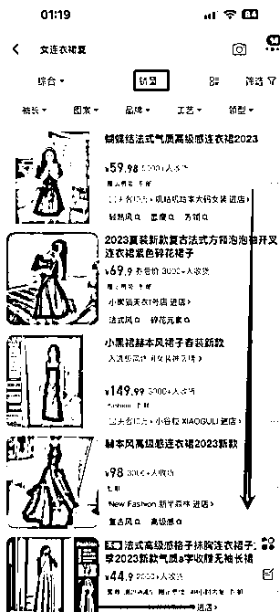

#### 4.爆款风格店铺选品 标准

a 天猫店/金冠以上的淘宝店或者拼多多关注人数几十万百万的店

b 产品数量一千以上

c 过千销量的产品大于8款

这里举例2家淘宝店大家参考下，大店的选品能力和跟款速度都是顶级的，可以多关注下

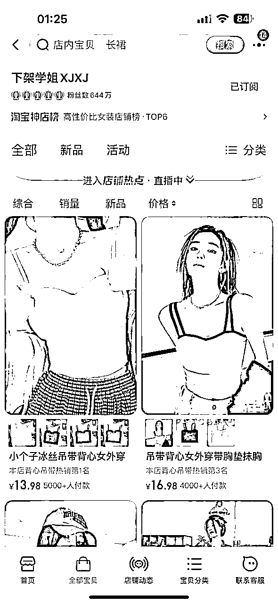

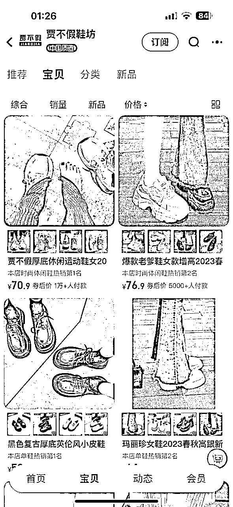

小红书热卖类目参考，因为主要用户群体是18-35岁的女性人群，那么像美妆 服装 内衣内裤 女鞋女包这些都是很不错的赛道，水果零食 手机壳 母婴用品......等等也都可以，大家都有爆发的机会，越红海的品爆发的量才有机会更大！

小红书人群特性，喜欢高颜值 新奇特类型的产品，我们在选品之后的笔记最好做到卖点可视化 场景化 高性价比 ，这样会更容易促进买家冲动消费。

## 选品举例

我看也有些人在做水果，正好我们爆的店里，其中有两家就是水果的，我这里直接分享下，我们是怎么选出爆品的思路。

因为水果见效确实快，我们也搞了两家店做，确定大类目做水果生鲜后，就想什么水果是高颜值高品质，一张图片封面就能让人产生购买欲望呢？酸！光看图就能让人不自觉分泌口水，女性特别是孕妈群体又是爱吃酸的人群，人群符合。

OK，再详细列出偏酸味的水果：柠檬，山楂，李子，杨桃，黑布林等等，再详细去搜索下当前水果最好的品种

如广东香水柠檬，清河山楂，茂名三华李等等。这些具体的品就出来了，然后挨个去平台搜索相关的笔记和商品数量是否太多，避开竞争太激烈的品后就是直接发笔记测试，最后爆的就是三华李。

上面讲的是各种选品方法，大家可以参照用

这里补充下商品的定价，很多人说直接三倍加价，其实也是有点扯的，还是要看品。

因为小红书的用户也是很精明的，他们追求品质愿意付高点价格，但是绝对不傻，一般我们在拼多多或者1688选品，价格都是比较低的，我们看下小红书同行，以及淘宝天猫这些地方同款效率好的店铺卖的价格，在这个基础上，上下浮动些是可以的。

# 二、测品

选品之后就到了测品环节，验证你选的品是否可以爆，这里我们一般分为两种测品方式

## 第一种，单品测试

选好品后，一个一个的测，比如先做苹果，那就先坚持只发苹果，每天笔记保持在5-10条，先坚持5-7天。

前期封面要多变换，是在测品同时也是在测封面。

如果哪篇数据不错，封面可以重复其他变化一下多发几条。再去观察数据和销量，如果数据流量有个几千起来了，但是货卖不出，那就要考虑是不是品的问题，换个水果接着这样测。如果连笔记数据破千都做不到，更是果断换品。循环坚持，直到测出一个爆品。

## 第二种，多品测试。

每天都要不断选品，选好品后，一天上架5个品，每个品发两条笔记。第二天上架新的5个品，同理每个品发两条笔记。直到测出爆品。

我们现在用的比较多的是第二种，如果水果的话，还是建议第一种

测品时，关于笔记的制作也给大家分享下

我们这边笔记制作过程其实跟大家并没有什么不同，就是去各大平台找美观又真实感强的商品图片或者视频混剪。

这里需要注意的是，千万不要拿那种淘宝美工感特别强的图，最好都是实拍图，让用户有种所见即所得的感觉。

特别是封面，封面定生死。

小红书是双瀑布流展示，封面的美观和好坏，会直接影响这个笔记的点击率。

## 怎么做才能让封面抓人呢？我们就拿水果来举例吧

### 提高封面的丰富度。

比如说一摞一摞的水果堆起来，人们天然追求“多”，把封面堆得满满的不会错。

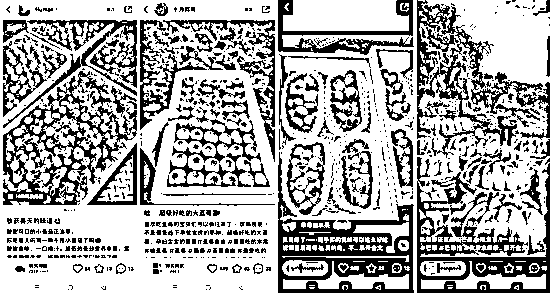

### 2.突出产品细节。

比如水果咬一口爆汁的瞬间，抓住最打动人的那一瞬间。

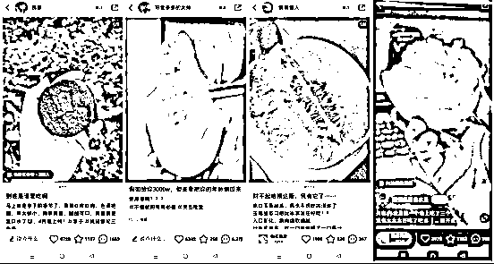

### 3.猎奇类

平时不常见的东西，让人想点进来一探究竟。利用平台用户们的好奇心博取流量。

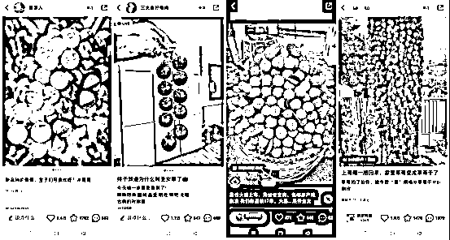

### 4.封面加文字。

用文字突出立意，或者用文字引导用户的吐槽欲和分享欲。

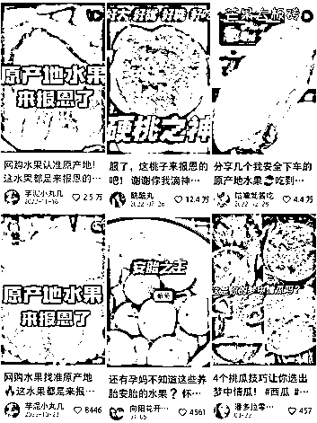

其实还有好多同行的封面都值得我们去分析和学习，平时多刷小红书，自然对小红书用户的调性和需求也会越来越了解。抓住用户的心理，就不愁流量起不来。

账号包装，标题和文案也是同理，同行就是最好的老师，自己不会做，先一比一去模仿就不会错！

# 三、怼爆品

这个很简单了，就是当你测出爆品、爆款笔记模板，那就持续怼就是了

继续发这个品的笔记，或者继续按照爆款笔记内容模板发。

## 上面说到的是大体的流程，接下来我补充下日常操作中提升出单效率的技巧性做法：

### 1.一定要建立自己的素材库

对标同行账号、低粉爆文作品的链接、标题都要记录下来，后续发笔记的时候才会有可借鉴的点，不然做了很久和没做一样。

然后就是作品素材库，作品的视频图片大家都可以收集归类好，可以反复使用

## 2.观察数据+优化跟进

观察点赞收藏数据和小眼睛数据

小眼睛每破500要做评论优化，一般3条左右。找朋友的小红书号帮忙评论就行，内容可以参考问大家和爆文评论区买家关系的点，这样可以提升转化和减少售前咨询！

有收藏加购和有出单的品要裂变看后续情况

### 3.制定工作安排，并严格执行

和挺多做小红书电商的人沟通了下，不好的理由各不相同，但是做的好的基本都一样，就是持续严格在操作，所以这个点尽管老套，但是我还是说下，很关键。

好了，今天的分享就到这，感谢大家的聆听。