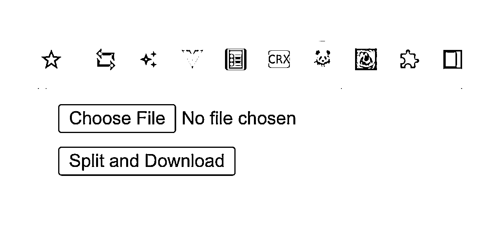
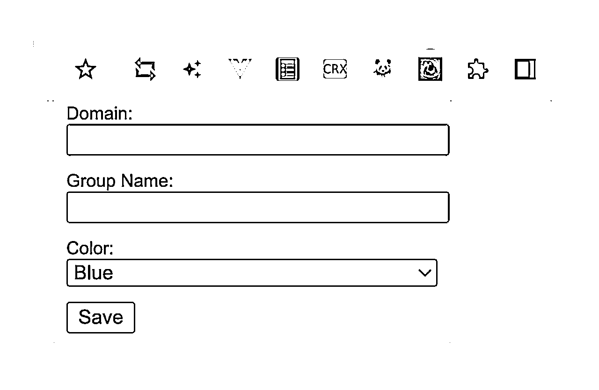
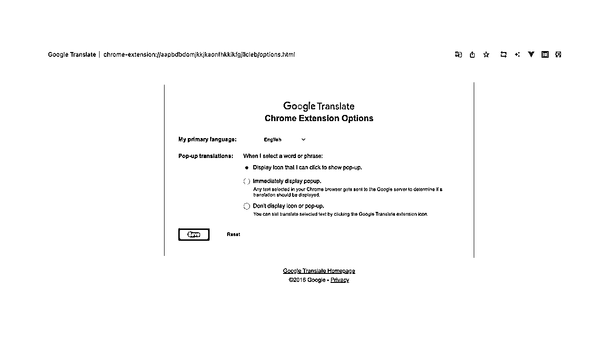

# 任何人都可以利用ChatGPT开发自己的谷歌插件

> 来源：[https://zzi7a49xoa.feishu.cn/docx/I5Qnd3yq7o8D23xkEhjcOYJwn3g](https://zzi7a49xoa.feishu.cn/docx/I5Qnd3yq7o8D23xkEhjcOYJwn3g)

# 概述

大家好，我是熊猫Jay，你是否曾经被某个Chrome插件深深地吸引，甚至萌生过自己也能开发一个的念头？是否想过没有开发经验怎么完成插件开发呢？

不论你是 开发者 还是 没有开发经验的小伙伴，这篇文章都是为你准备的。我们将一步步引导你完成自己的第一个Chrome插件。

需要声明的是, 本视频的目的绝不是教大家开发怎样精美,功能如何炫酷的插件. 而是讲解任何人都可以结合提示词, 描述相对简单的需求, 让ChatGPT提供代码, 然后逐步排查问题, 最终拿到满足需求的插件.

我知道小伙伴们可能在想, 你是不是在吹牛啊, 我们不懂代码的人可以做? 而且你熊猫Jay好像也有程序员背景呀, 我们可没有啊!

的确可以做, 这篇文章将结合视频带领大家进行实践, 我不做任何主观干涉, 那话不多说, 我们直接开始吧!

# 学习目标

从这篇文章中，你可以学会以下几点：

*   了解插件开发的入门知识

*   如何编写demo代码

*   如何定位的问题

*   结合案例利用ChatGPT快速上手

*   插件开发的最佳实践

# 培训视频

为更好地将制作方式讲清楚, 我准备了一套视频, 带大家手把手实战谷歌插件的开发, 不需要任何开发经验也可以轻松上手.

视频大纲如下:

*   培训大纲

*   环境准备

*   核心文件

*   演示案例

*   利用ChatGPT开发插件的最佳实践

建议先看完视频, 按照视频进行实战, 模糊的地方可以查看文档. 视频如下:

# 开发环境准备

首先，你需要安装以下开发工具：

*   Chrome 浏览器(必须)

*   文本编辑器（如：VS Code, Sublime Text, Atom，txt也可以, 必须）

*   ChatGPT账号 (必须)

视频中使用的是Sublime, 下载地址为: https://www.sublimetext.com/

# 核心文件讲解

核心文件的讲解稍显枯燥, 但是对于我们理解开发过程, 和后期排查错误都起到很大的作用.

没有开发经验的小伙伴会有些迷糊, 没关系, 简单理解即可. 不理解可以先忽略!!!

## manifest.json

manifest.json：插件的主要配置文件，为JSON格式，必须放在根目录下，它为浏览器扩展提供了插件的蓝图，包含几个重要的点：

*   插件名称、描述、版本、图标

*   需要使用的权限和插件API

*   指定相关文件，如后台脚本background.js、弹出窗口的HTML文件popup.html 和JavaScript文件popup.js等等。

## background.js

background.js：后台脚本，用于监听浏览器事件进行访问数据，协调任务，如以下的简单案例：

*   监听插件被安装时。

*   新的选项卡被创建时。

*   新的书签被添加时。

*   插件按钮被点击时...

注意：

*   该文件可访问所有 插件API。

*   不可以调用全局窗口提供的DOM API。

*   不可以修改页面内容。

## popup.html

插件的主要交互界面, 展示核心信息. 可以包含如下功能：

*   显示当前选项卡列表。

*   当前选项卡的其他信息。

*   用户可以轻松点击插件图片。

*   用户导航离开后自动关闭...

如视频案例: 自动分组浏览器Tab 的配置窗口, 或者 分割图片为四等份 的上传文件窗口.





## content-script.js

插件可以利用该文件，注入代码到主页上（被指定的页面），可以访问和修改网页内容, 并且允许插件与浏览器的页面进行交互。如以下动作:

*   插入元素到页面。

*   修改页面的样式。

*   修改页面上的DOM元素。

## options.html

允许用户配置扩展设置的页面。如例, 一个开关按钮，允许用户选择是否启动某一功能。




## 其他文件

*   sidepanel.html: 可以在用户的浏览指定页面的过程中协助用户。

*   popup.js：弹出窗口的HTML文件和JavaScript文件。

*   css文件: 样式文件, 提高美观度.

*   ...

# Demo案例

上手一个Demo案例, 有助于找找感觉, 再编写相对复杂的插件, 将更加游刃有余!

### 1\. 编写 manifest.json

manifest.json 文件是Chrome插件的配置文件，包含插件的名称、描述、版本、权限等信息。下面是一个基础的 manifest.json 文件的示例；

```
{
  "manifest_version": 3,
  "name": "My First Chrome Extension",
  "version": "1.0",
  "action": {
    "default_popup": "popup.html",
    "default_icon": "icon.png"
  },
  "background": {
    "service_worker": "background.js"
  },
  "permissions": ["notifications"],
  "icons": {
    "16": "icon.png",
    "48": "icon.png",
    "128": "icon.png"
  }
}

```

### 2\. 实现 background.js

在 background.js 文件中，可以监听和处理浏览器事件。例如，以下代码在每个新标签页打开时显示一个通知：

```
chrome.runtime.onMessage.addListener((message, sender, sendResponse) => {
  if (message.command === 'createNotification') {
    chrome.notifications.create({
      type: 'basic',
      iconUrl: 'icon.png',
      title: 'Button clicked!',
      message: 'The button was clicked.'
    });
  }
});
```

### 3\. 实现 popup.html 和 popup.js

popup.html 是点击插件图标时显示的弹出窗口的HTML文件。例如，以下代码创建一个包含按钮的弹出窗口：