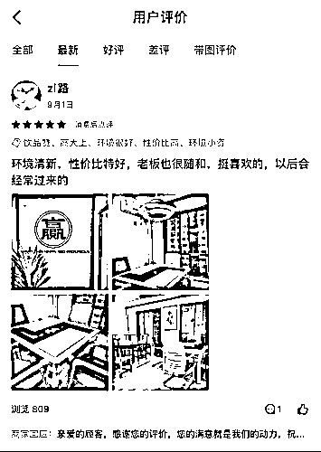
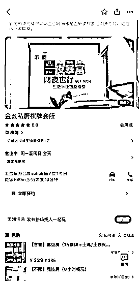
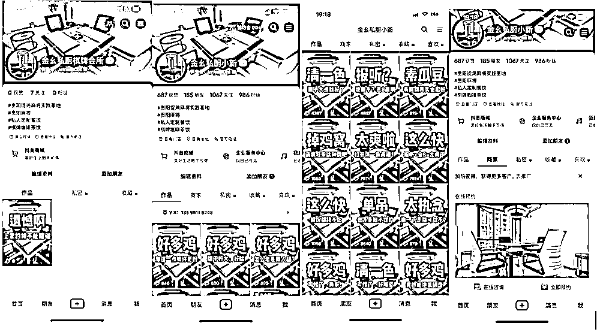

# 月稳定盈利2万元的棋牌室案例复盘

> 来源：[https://q6rpgbg9y1.feishu.cn/docx/IRNOdmGvJoXGKLxAuwmcNEUqnyg](https://q6rpgbg9y1.feishu.cn/docx/IRNOdmGvJoXGKLxAuwmcNEUqnyg)

大家好，我是周先生，7年连续创业者，16岁当兵，20岁开始创业，做过家用电器代理，年营收500W+;干过美团操盘手，年GMV5000万+;抖音本地生活创业三年，是第一批入场的玩家；期间做贡献充电宝“躺赚了50W(截至目前）"https://t.zsxq.com/0eglSQjQV ，多年来已为多家实体店做线上赋能，实现业绩倍增。

我非常喜欢猫叔的一个词：践写者，我是军人出身，执行力很强，我写的东西，都是我下场实践过，并拿到结果的。我厌恶那些假大空的理论，那些所谓专家给你一堆自己都没实践过的垃圾教程。

借用李笑来的一句话：只说、只写自己做过或曾经做到过的事。

今天继续来给大家分享一个少有人关注的小项目——棋牌室。

22年7月起，我操盘了一家在贵阳观山湖区的棋牌室，三个月时间私域精准引流1000人，目前每月稳定盈利2万元左右。

废话不多说，上实操案例：

#### 一、缘起

金幺私厨棋牌会所，位于观山湖区会展商圈核心区域，会展东路SOHO公寓E座7楼，面积为255平方米，共包含9个包房，主要品类为：麻将娱乐+私厨定制餐饮。

创立初衷为老板喜欢打麻将，老是找不到满意的麻将馆。经过多处探访，竞品对比，发现周边的市场需求并没有得到满足，于是发现商机。

老板有20多年的餐饮经验，但是线上营销经验不足，经过分析，发现每天的营业额只需要到700元就可以保本，那么餐饮及私厨版块就能成为利润增长点。

聊下来后，了解到棋牌室的特点，开始有了策划思路：棋牌室具备很强的重复性消费属性。因为棋牌需要约人一起打，对于经常打牌的人来说，一是平常很难约到人，你有时间的时候别人没时间;二是打牌这事情吧，多少还是涉及到一些信任因素，你想，你是愿意跟不认识的人打还是多少认识一些的人打；三是，对于经常打牌的人来说，固定场所也可以成为他们的”老地方“，方便下次约牌。

基于以上原因，整个策划的思路就定位在重复性消费上，只要有几百个老顾客，养活一个店完全没问题。并且打牌这事，那啥...多少有点瘾...时间长着呢，客户很难会自然流失的。

最后我给出的策划案是：公域引流，私域养熟，促进到店变现

核心是：低成本获客+培养用户消费习惯

根据这个战略定位，前期只需要用各种低成本的方式把用户拉进私域，慢慢养熟，并利用各种活动促进客户频繁到店。到店后牌友都熟悉了，服务做好了，这个客户就跑不了了。

#### 二、流量获取

##### 1、美团端做评分：

项目由于位于SOHO公寓楼以内，如果没有线上平台，是肯定不会有客户的，初期我们的客户大部分都来自于“美团”平台，美团的流量非常精准，刚上线，就有客户进行咨询，到店。

但我们一开始就有了私域思维，凡是美团的客户，在订单页就备注清楚，必须要提前预定，避免包房没有了，客户跑空。所以在客户电话预定的过程中，就做了转私域的动作，转私域的话术如下：

“尊敬的客户您好，为了方便发预定信息及定位地址，麻烦您留一下您的电话，我这边马上加您微信”。

由于美团都是虚拟号码，需要和客户要一下电话，确保添加客户的数据准确。前期的客户，一定要鼓励客人在美团上消费，消费就能引导客户做好评，好评一定要做到以下几点：

1.  必须带上4张及以上的图片；

1.  评价内容字数越多越好；

1.  一定要全5星级好评；

前期在引导好评的时候，最好是能给一些激励，比如说，送一瓶饮料等，为了避免好评出现问题，前期最好自己梳理几个好评模板，复制粘贴是最好，确保好评数能持续稳定的提高。

上述2个办法，让棋牌店二十几天就在美团做到5.0分，排名第一。

##### 2、抖音端做曝光：

8月4日，我们开始启动抖音端账号，抖音账号名为：金幺私厨棋牌会所，账号情况如下图所示：

为了鼓励店员拍摄剪辑，扩大流量，弄了一个激励政策：每一条视频，剪辑费用为5元钱，剪辑播放量破3000了，剪辑费用加5元。每周我这边去拍摄一次素材，素材供应给店员，店员按照标准进行剪辑，剪辑好之后我自己在根据剪辑完稿的视频，加工后进行发布，基本上能做到一周3到5更新。在抖音自媒体版块实现了低成本的标准化。

随着视频素材的不断更新，到店的客户也越来越多，判断标准就是，客户直接拨打店面手机的，就是抖音来的客人，因为我们这边还有一个绝活，就是通过主页就能轻松的知道我们的店面手机号。

##### 3、同城群做引流：

在前面美团及抖音来的顾客中，全部通过前面设计的话术，沉淀到私域后，我们的私域规模也在不断的扩大。

除了上述被动到店客户加入微信以外，我们还有两种“主动添加人”的方式，一种是通过同城群被动加人，在相应分类的同城群类，群发下列加人话术：

“各位同事/邻居/校友/朋友，有需要过来打麻将的，欢迎加我店的微信预定，店就在会展东路，加的时候备注融创，就可以免费玩两个小时，免费小吃、咖啡、茶饮”

这种主动加人的话术有几个点要强化：

1、钩子，一定要留一定的诱饵，吸引客户添加微信，添加私域；

2、目标明确，被动添加过来的客户，一定要让他知道，您是干什么的，做什么内容；这样才能强化你的私域客户的精准属性。

但也有2个问题要注意：

1、由于大部分人的群都是免打扰的，由于你也不是群主，也无法做到精准的群公告，所以，影响力也有限，但我们尝试了一下，通过这种方式主动加人，再配上一点小红包，效果会好很多；

2、如果你在这类同城群从来没有存在感，你最好不要直接发广告，容易被群举报，影响你账号安全，所以营销动作，特别是高频的群发，非常容易触发风控，账号如果被封，就得不偿失了，当然我们抽一个时间可以专门讲一下账号安全的问题。对于这个问题，我们这边还有另一种“主动加人”的方式。

##### 4、线下活动引流

2023年2月1日至2023年3月30日，增长迅速，快速的加到了1000+人，这个阶段我们仅仅采用一招，就让私域客户量在两个月翻了3倍，即通过购买彩票的方式进行，凡是来店内消费的新客人，都赠送彩票1张（成本2元），于是我们的工作人员也有了更充足的理由添加客人微信。

#### 三、运营变现

通过前面几个动作，店铺每天都有了稳定的精准流量。前面分析过，每天只要700的营业额就能保证成本，也就是一个大包房就可以，那么多出来的小包房就是盈利空间。

再加上客户一般打牌一来就是一天，那就会产生很多日常消费，这一块就是我们最核心的利润来源：

##### 1.朋友圈运营

我们的朋友圈运营分为几个阶段，第一个阶段，我们的名字直接就是金幺私厨棋牌会所，但是我们发现一段时间活跃度严重不足，后来我们分析出来，其实这个属于人之常情，毕竟谁都不愿意和一个店来打交道，后来我们就把微信号改为了店内员工金幺私厨肖叔，通过这种方式，因为服务主要是靠员工来实现，故对于客户来说，加的微信背后就是活生生的人，那现在一般定桌的客人，都会直接称呼肖叔，我们几点几点过来。

从我们了解到的数据，朋友圈的打开率其实是能占到70%的，一般作为私域空间来说，大部分都会有在闲暇时间打开朋友圈的习惯，我这边做的最成功的动作就是安排点赞，对于朋友圈的客户，都要求肖叔每天去给朋友圈点赞，让客户知道店一直开着，让他想要打牌的时候能第一时间想起我。

发朋友圈其实也就是两个内容，一个是宣传店内的环境照片，一个是发布店内的真实好评部分。俗话说金杯银杯不如群众的口碑，用户好评的内容，其他人看到后就会更信任。

##### 2.店内运营

店内的运营，我们分为线上运营及线下异业联盟合作。

其中，线上运营我们主要跟进的是美团、抖音端及私域，美团端围绕打造5.0评分的好店，注重客户评价，注重客户咨询及时反馈。

而抖音端我们也将团购套餐上架，与美团端的价格对比，我们都要低10元，我们秉承的是低成本的生产内容，刚开始制作的视频均为录制我们棋牌的视频，后续拍摄的视频主要围绕麻将小段子实现，在不增加任何成本的情况下，最高的时候实现了一个视频30万播放的好数据，让店铺曝光突破了三十多万，带来了更多私域用户。

私域端的主要有几个设置，第一个设置就是加好友自动通过，我们通过私域管理软件，将凡是主动添加我们的客户，自动通过，并且自动打招呼，让客户知道我们是谁；第二个设置是主动添加周边的潜在客户，通过混同城群的方案，获取周边潜在客户的微信号，然后通过话术及钩子，主动添加客户微信，通过后再通过朋友圈文案引导客户到店消费，完成私域获客闭环。

而异业联盟主要通过周边没有包房的餐厅合作，如会展东路沿街的门面，凡是通过店铺到店消费的客户，均由对应的优惠券及推荐店铺的返现，并且到店客户及时导入私域。

##### 3.与楼下餐饮店铺合作增加利润

刚开始我们是自己开餐的，我们请了有一个厨师，厨师的工资是5000元，折算到每天的成本就有166元，并且还有菜品成本，经过近一个月的分析之后，订桌吃饭的人群还是偏少，在平时可能只有1到2桌，在周末可能也就3到4桌，并不足以养活人工成本。

但是客人吃饭问题还是需要解决，我们就安排店内的大姐自己做饭，她其实还是烧得一手好吃的家常菜，我们给大姐加了500元额外做餐的补助，我们按这种方式持续了7个月，但是后来是我们这个大姐抱怨说做餐太累，因为涉及到要值夜班，就存在头天熬夜，第二天再买菜做饭就会非常累。

我们经过综合分析，即使是自己做餐，因为我们的餐标价格非常低，平均一桌就100元的四菜一汤，要靠餐来弥补营业额，显得很不切实际，我们折算了一下3月的数据，这月仅有21桌点餐，收入是2100元，成本费用就花了1600元，餐费补贴花了500元，也就是说这个月下来，在餐食上面我们根本没有赚钱，于是我们采取了与楼下餐饮店合作的事宜。

我们合作了3个套餐（109元、150元、200元套餐），三种套餐分别可提19元、20元、30元的费用，这样，员工也轻松，我们也能实实在在挣到餐食部分的费用。

##### 4.服务流程

店内的服务，围绕客户进店流程，我们分为：

1.  引导进包房——上零食、纸巾、扑克牌，

1.  询问客户喝什么样的茶水——准备茶水——3个小时添加一次水

1.  每6个小时提醒用户包房即将超时

1.  结账、打扫卫生，

1.  如果是美团客户，我们会第一时间请客户先做评价，选择拍摄3到4张照片，把美团的好评做到极致。

#### 五、总结

1.  线上（抖音端、视频号端）保持持续更新，每个月固定好更新条数及频率，确保位置的持续曝光；

1.  服务标准化，客人到店、服务及整体的服务及保洁流程完整到位，确保维持客户持续的好服务标准。

1.  送彩票是引导加微信的有效手段。

1.  异业联盟，通过与楼下餐饮店合作，将店内的菜品先停掉，减少该部分的人工及材料支出，降低成本。同时，楼下餐饮店增加宣传单页，推动客户能到店消费。

1.  适当使用付费方式如美团“推广通”及抖音“本地推”实现新流量增长，同时通过矩阵达人方式探店来提升店面活跃度，让店铺有更多新客户到店，并通过私域不断沉淀客户。

1.  混同城群也是获取用户的好办法，优点是成本低，缺点是信任感不足，需要慢慢养熟。

#### 最后的话

对于大部分实体店老板来说，他们都有很多年的实体运营经验，但是对于引流，如何更好更低成本的在抖音美团上做流量，他们不专业。对于时常混迹于互联网的各位生财老板们，大家做流量的能力毋庸置疑。那二者结合不就是强强联合了。

所以用流量能力去赋能产品力很好的实体店老板，这是蓝海，是错位竞争！

这是我看到的一个垂直机会。

实体老板，在产品、服务做到基本就OK了，拼这块，大家谁也不比谁弱。把更多的时间精力用在做流量上，胜出的概率就更大，因为你的很多同行都不会。

搞流量的人，愿意下场做实体流量，你会发现比线上竞争小太多了，因为你之前面对的都是和你一样的强者，而线下你会发现都是不如你的弱鸡。

最简单的例子，抖音一千粉丝，对于你来说随随便便，但是你知道有多少个商家永远突破不了500播放量吗?

最后，其实对于绝大部分人来说，你的首要目标不是赚一百万，一千万，甚至都不是一万。你的首要目标，是赚到第一块钱，你要先下场，跑通闭环。刷再多帖子，学再多奇技淫巧，不去实践，你终究体会不到项目的“体感”，然而这才是一个项目真正成功的关键。

正常的操作路径，不是一直刷帖学习，那叫空想，也不是一直闷头干活，那叫莽撞。我遇到太多实体老板，是不喜欢学习的，只知道蒙头干。正确的路径是边干边学，在干中学，学了去干，遇到问题去找答案，然后解决问题，又遇到下一个问题，再去找答案，直到解决，拿到结果。这才是操作项目乃至人生成长的正确路径。

大部分人在纯思考中就耗费了大量的时间和精力，知行合一，你就超过了99%的人。

涛哥说过：“想都是问题，干才是答案”。

祝：阅有所获。