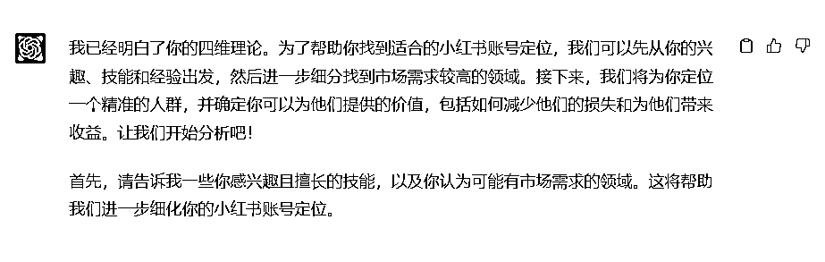
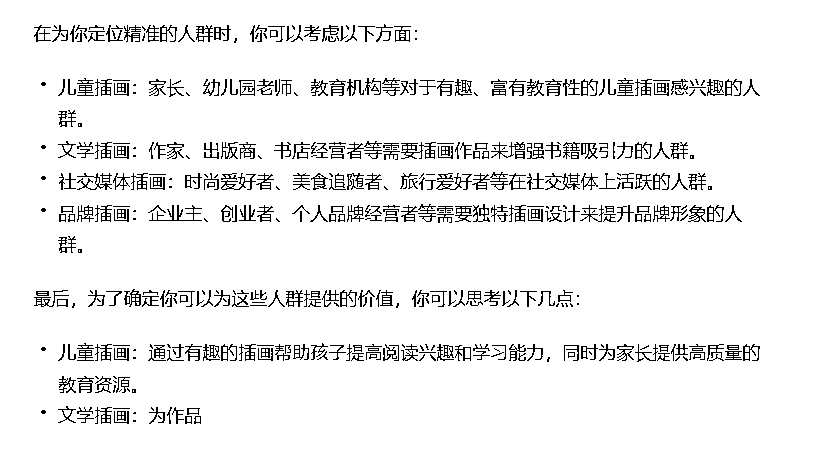

# 从一开始就做赚钱的账号！用ChatGPT帮你做小红书账号定位

> 来源：[https://dvicfjbl5q.feishu.cn/docx/IUDddMgHVozJ7CxwPaUcUDO0nGc](https://dvicfjbl5q.feishu.cn/docx/IUDddMgHVozJ7CxwPaUcUDO0nGc)

无论你是做副业，还是准备推广自己的产品，你现在准备入局小红书，那你就一定不要错过这篇文章。没有内容基础的人，可能一上来就会先学，如何用ChatGPT做小红书笔记，但是作为一个有12年自媒体经验的老鸟，我告诉你，第一件事应该先做账号定位，定位对了，你就已经超过了50%的新手账号。这也是为什么，有人做小红书2-3个月，就开始出单或者出爆款了。以往，如果要做账号定位，是要花费大量功夫的：分析自己的优势、研究目标用户的痛点和需求、研究对标账号等。比如我曾经为了做好定位，加了100多个目标用户，去逐条看他们的朋友圈，找需求。

但是现在有了ChatGPT，很多手工繁琐的工作，都可以通过ChatGPT来解决。以往可能要1周-1个月，而现在有了ChatGPT，十几分钟就搞定了。下面我就以我帮学员训练的案例为例，来讲一讲如何通过ChatGPT快速找到小红书账号定位。

大致思路：1、先梳理自己的个人经历，特长、爱好

2、给ChatGPT喂养自己的背景和定位方法论

3、ChatGPT与自己一步一步对话，逐渐找到定位

4、根据定位的关键词，去小红书平台搜一下是否有竞争力

* * *

## 1.先梳理自己的个人经历，特长

比如我这个学员自述自己的经历：35岁的孩子妈妈，孩子目前已经一岁了，在这之前，我有2年没上班，我在职场有8年的互联网公司产品经理的经验，我大学学美术的，爱好也是画画，之前在小红书做过设计副业。

## 2.喂养定位方法论

命令：我是一个35岁的孩子妈妈，孩子目前已经一岁了，在这之前，我有2年没上班，我在职场有8年的互联网公司产品经理的经验，我大学学美术的，接下来，请你作为一位小红书的账号定位专家，通过与我对话的方式，为我找到我的小红书账号定位。

在正式开始前，我会先告诉你小红书定位的四维理论：第一步，先找到自己爱好且擅长的技能；第二步，在这个技能对应的领域下面，找一个更为细分、竞争较小、但又有市场需求的领域；第三步，为我定位精准的人群，而这些人群是有高需求的；第四步，告诉我能给他们提供什么价值，价值从2个方面去思考，第一个是如何减少他们哪方面的损失，第二个是能为他们带来什么收益。你现在明白了吗？明白的话请告诉我已明白

## 3.对话ChatGPT找到定位

学员反馈，ChatGPT已经有点走偏了，这时应该把它拉回来，于是，我给到了下面的命令：

目前的领域我比较感兴趣的是社交媒体插画，但是我目前觉得这个领域有点大，不具象，不聚焦，请再往下细分，直到让我看到我感兴趣的领域

学员反馈，还可以再继续引领一个方向：插画风格，于是给到命令:我觉得，还有一个领域你可以参考，就是插画的风格，请就插画风格，为我往下做细分

经过几番调教，ChatGPT给出的答案就比较接近心中的需求了。接下来只需要做选择了。

找完了细分的领域，接下来应该要找人群了，输入如下命令：

我已经找到我的细分领域：数字插画人像绘制：利用AI技术进行人像绘制，为个人、婚礼、家庭等提供独特的数字肖像。按照定位的四维方法论，你应该帮我找目标人群了，请给我列举10个对该细分领域感兴趣的目标人群

根据给出的提示，我和学员一致认为宠物这个赛道不错。下面就快速展示对话的过程。

## 4.去小红书平台搜一下是否有竞争力

搜索了相关关键词，发现没有这类内容，但是相邻的话题有低粉爆款。而相邻话题的爆款内容也不多。于是判断这是一个比较不错的定位。

你学会了吗？